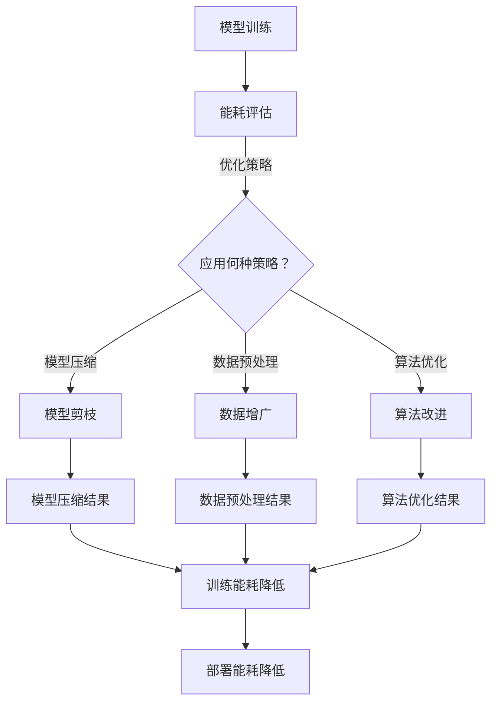
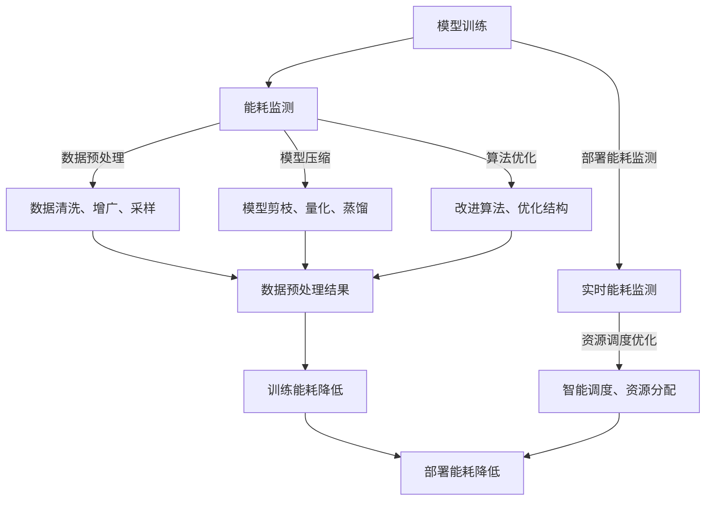
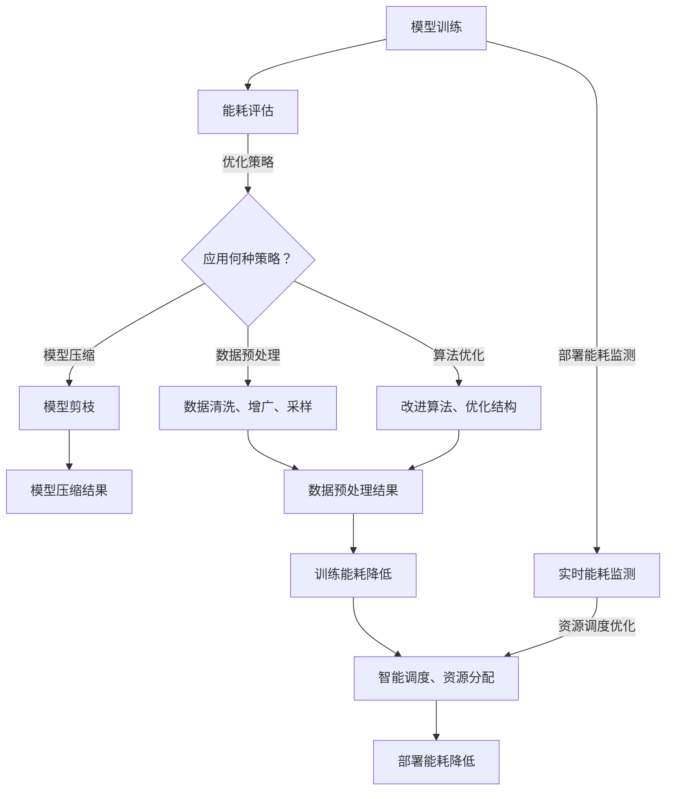

                 


### 文章标题

《绿色计算：优化LLM应用的能源效率》

### 关键词

绿色计算，能源效率，大规模语言模型（LLM），深度学习，人工智能，可持续性，数据中心能耗，模型压缩，数据预处理，算法优化，绿色实践

### 摘要

本文深入探讨了绿色计算在优化大规模语言模型（LLM）应用中的能源效率的重要性。随着人工智能技术的快速发展，特别是LLM在自然语言处理领域的广泛应用，能耗问题日益突出。文章首先概述了绿色计算的定义与背景，接着介绍了LLM的基本原理与架构，并分析了绿色计算在LLM应用中的挑战。随后，文章提出了优化LLM应用能源效率的策略，包括模型压缩、数据预处理和模型优化等方面，并通过实践案例展示了绿色计算技术在LLM应用中的成功应用。最后，文章展望了绿色计算技术的发展趋势以及LLM在绿色计算中的未来。

---

## 第1章 绿色计算概述

### 1.1 绿色计算的定义与背景

绿色计算，是指通过优化计算机系统及其工作流程，降低能耗和减少环境影响的计算方法。随着信息技术的飞速发展，数据中心、云计算和人工智能等领域的能耗急剧增加，对环境造成了巨大压力。绿色计算因此成为了一个重要的研究方向，旨在提高能源利用效率，降低碳排放，促进可持续发展。

#### 绿色计算的发展背景

绿色计算的概念最早可以追溯到20世纪90年代，随着全球能源危机和环境保护意识的提高，学术界和工业界开始关注计算机系统的能耗问题。进入21世纪，随着大数据、云计算和人工智能的兴起，数据中心的能耗问题变得更加突出。据统计，数据中心的能耗已经占到全球总能耗的1%-2%，且这一比例还在不断上升。因此，绿色计算的研究与应用变得越来越重要。

### 1.2 绿色计算的重要性

绿色计算的重要性主要体现在以下几个方面：

1. **提高能源效率**：通过优化计算资源和算法，降低计算机系统的能耗，提高能源利用率。
2. **降低碳排放**：减少计算机系统的能耗，有助于降低碳排放，缓解全球变暖问题。
3. **促进可持续发展**：绿色计算有助于构建资源节约型和环境友好型社会，推动可持续发展。

### 1.3 绿色计算在LLM应用中的意义

LLM作为一种先进的自然语言处理技术，已经在多个领域取得了显著的成果。然而，LLM的训练和部署过程需要大量的计算资源，导致能耗问题日益突出。绿色计算在LLM应用中的意义主要体现在以下几个方面：

1. **降低能耗**：通过优化LLM的训练和部署流程，降低能耗，减轻数据中心的压力。
2. **提高LLM性能**：优化计算资源的使用，提高LLM的训练和推理速度，提升其性能。
3. **促进可持续发展的AI技术**：通过绿色计算，推动人工智能技术的可持续发展，为未来的智能社会奠定基础。

### Mermaid流程图

以下是LLM模型训练和部署的绿色计算优化流程：



该流程图展示了如何通过多种策略优化LLM的训练和部署过程，降低能耗。接下来，我们将进一步探讨LLM的基本原理与架构，以及绿色计算在LLM应用中的挑战。

## 第2章 LLM的基本原理与架构

### 2.1 LLM的定义与分类

大规模语言模型（Large Language Model，简称LLM）是一种基于深度学习的自然语言处理（Natural Language Processing，简称NLP）模型。它通过学习大量的文本数据，能够理解和生成自然语言。LLM通常由数百万到数十亿个参数组成，能够处理各种复杂的语言任务。

LLM可以根据其训练数据的大小和模型结构进行分类。常见的LLM分类包括：

1. **小规模语言模型**：通常包含数十万到数百万个参数，如BERT（Bidirectional Encoder Representations from Transformers）。
2. **中规模语言模型**：包含数百万到数千万个参数，如GPT-2（Generative Pre-trained Transformer 2）。
3. **大规模语言模型**：包含数千万到数十亿个参数，如GPT-3（Generative Pre-trained Transformer 3）、T5（Text-To-Text Transfer Transformer）。

### 2.2 LLM的架构

LLM的架构通常基于Transformer模型，这是一种基于自注意力机制的深度学习模型。Transformer模型的核心思想是将输入序列映射到高维空间，然后在该空间中进行自注意力计算，以捕捉序列中的依赖关系。

以下是一个简单的Transformer模型架构：

1. **嵌入层**：将输入单词映射到高维向量。
2. **位置编码**：为序列中的每个单词添加位置信息。
3. **多头自注意力机制**：计算输入序列中每个单词之间的依赖关系。
4. **前馈网络**：对自注意力机制的结果进行进一步处理。
5. **输出层**：将处理后的结果映射到输出序列。

### 2.3 LLM的核心算法原理

LLM的核心算法原理主要包括以下几个方面：

1. **自注意力机制**：自注意力机制是Transformer模型的核心，它允许模型在处理每个单词时，考虑到其他所有单词的影响。自注意力机制的计算过程如下：

   $$ \text{Attention}(Q, K, V) = \text{softmax}\left(\frac{QK^T}{\sqrt{d_k}}\right)V $$

   其中，$Q$、$K$和$V$分别是查询向量、键向量和值向量，$d_k$是键向量的维度。

2. **前馈网络**：前馈网络对自注意力机制的结果进行进一步处理，通常包括两个全连接层，如下所示：

   $$ \text{FFN}(X) = \text{ReLU}(W_2 \cdot \text{ReLU}(W_1 \cdot X)) $$

   其中，$X$是输入，$W_1$和$W_2$是权重矩阵。

3. **损失函数**：在训练LLM时，通常使用交叉熵损失函数来衡量模型预测和实际标签之间的差距。交叉熵损失函数的计算公式如下：

   $$ \text{Loss} = -\sum_{i=1}^n y_i \log(p_i) $$

   其中，$y_i$是实际标签，$p_i$是模型预测的概率。

4. **优化算法**：在训练LLM时，常用的优化算法包括随机梯度下降（SGD）和Adam优化器。SGD优化算法的更新公式如下：

   $$ \theta_{t+1} = \theta_t - \alpha \cdot \nabla_{\theta_t}J(\theta_t) $$

   其中，$\theta_t$是当前参数，$\alpha$是学习率，$J(\theta_t)$是损失函数。

   Adam优化器的更新公式如下：

   $$ m_t = \beta_1 m_{t-1} + (1 - \beta_1) \nabla_{\theta_t}J(\theta_t) $$
   $$ v_t = \beta_2 v_{t-1} + (1 - \beta_2) (\nabla_{\theta_t}J(\theta_t))^2 $$
   $$ \theta_{t+1} = \theta_t - \alpha \cdot \frac{m_t}{\sqrt{v_t} + \epsilon} $$

   其中，$m_t$和$v_t$分别是动量和方差，$\beta_1$和$\beta_2$是超参数，$\epsilon$是防止除以零的小常数。

通过以上算法原理的讲解，我们了解了LLM的基本架构和核心算法。接下来，我们将分析绿色计算在LLM应用中的挑战。

## 第3章 绿色计算在LLM应用中的挑战

### 3.1 数据中心能耗问题

绿色计算在LLM应用中面临的一个主要挑战是数据中心能耗问题。随着LLM规模的不断扩大，其训练和部署过程所需的计算资源也急剧增加，导致数据中心能耗显著上升。以下是数据中心能耗的一些关键方面：

1. **硬件能耗**：服务器、存储设备和网络设备等硬件的运行需要大量电力，导致能耗增加。
2. **冷却能耗**：为了保持硬件设备在适宜的工作温度，数据中心需要大量的冷却系统，这同样会消耗大量电力。
3. **能源转换损耗**：数据中心在将电力转换为计算性能时，存在一定的转换损耗，这部分损耗也会增加能耗。

### 3.2 深度学习模型的能耗问题

深度学习模型在训练和推理过程中存在显著的能耗问题。以下是一些关键方面：

1. **计算能耗**：深度学习模型包含大量参数，训练过程中需要进行大量的矩阵运算和前向传播、反向传播操作，这些操作都需要消耗大量计算资源。
2. **存储能耗**：深度学习模型通常需要存储在海量数据中，存储设备在读写数据时也会消耗电力。
3. **通信能耗**：在大规模分布式训练和推理过程中，模型参数和数据需要在各个节点之间传输，通信过程也会消耗能源。

### 3.3 LLM训练与部署的能耗问题

LLM的训练和部署过程涉及多个环节，每个环节都会产生不同的能耗。以下是一些关键方面：

1. **训练能耗**：LLM的训练过程通常需要大量的计算资源和时间，特别是在大规模数据集上进行训练时，能耗问题尤为突出。
2. **部署能耗**：LLM部署后，在提供服务的过程中也会持续消耗电力，尤其是对于实时性要求较高的应用场景。
3. **能耗监测与优化**：在实际应用中，对能耗的监测和优化是绿色计算的关键任务。这包括对训练和部署过程的能耗进行实时监控，并采取相应的优化措施，如调整模型参数、优化算法、资源调度等。

### 3.4 能耗优化的挑战

在绿色计算中，优化LLM应用的能耗面临着以下几个挑战：

1. **计算效率与能耗之间的平衡**：在提高计算效率的同时，需要尽可能降低能耗，这需要在算法和硬件层面进行优化。
2. **能源供给与消耗的不确定性**：数据中心的能源供给和消耗存在一定的波动性，这给能耗优化带来了不确定性。
3. **复杂性和可扩展性**：绿色计算的优化方案需要具有复杂性和可扩展性，能够适应不同规模和类型的LLM应用。

综上所述，绿色计算在LLM应用中面临着数据中心能耗、模型能耗和训练与部署能耗等多个挑战。针对这些挑战，需要采取一系列优化策略，以提高能源效率和减少环境影响。

### 3.5 能耗优化的关键策略

为了应对绿色计算在LLM应用中的能耗挑战，我们可以采取以下关键策略：

1. **模型压缩**：通过剪枝、量化、蒸馏等方法，减少模型参数和计算量，从而降低能耗。
2. **数据预处理**：通过数据清洗、增广、采样等方法，优化数据集的质量和分布，减少模型训练的时间和能耗。
3. **算法优化**：通过改进算法和优化模型结构，提高计算效率，降低能耗。
4. **资源调度优化**：通过智能调度和资源分配策略，优化计算资源和能源的利用效率。

这些策略在实际应用中可以相互结合，形成综合的能耗优化方案，从而有效降低LLM应用的能耗，实现绿色计算的目标。

### Mermaid流程图

以下是LLM模型训练和部署的能耗优化流程：



通过这一流程，我们可以看到如何通过多种策略优化LLM的能耗，实现绿色计算的目标。

## 第4章 优化LLM应用能源效率的策略

### 4.1 模型压缩

模型压缩是优化LLM应用能源效率的重要策略之一，通过减少模型参数和计算量，降低能耗。以下是一些常见的模型压缩方法：

#### 4.1.1 模型剪枝

模型剪枝通过去除模型中不重要的参数或连接，从而减少模型的复杂度。剪枝方法可以分为以下几类：

1. **结构化剪枝**：基于模型的权重分布，选择权重较小或为零的参数进行剪枝。
2. **非结构化剪枝**：随机选择部分参数进行剪枝，不需要预先计算权重分布。

伪代码：

```python
# 剪枝过程
for layer in model.layers:
    for weight in layer.weights:
        if np.abs(weight)<threshold:
            weight.fill(0)
```

#### 4.1.2 模型量化

模型量化通过降低模型参数的精度，从而减少模型的计算量和存储需求。量化方法包括以下几种：

1. **静态量化**：在模型训练完成后，将模型参数从浮点数转换为低精度的整数。
2. **动态量化**：在模型训练过程中，根据训练数据的分布动态调整参数的精度。

伪代码：

```python
# 量化过程
for weight in model.weights:
    weight = quantize(weight, precision)
```

#### 4.1.3 模型蒸馏

模型蒸馏通过将一个复杂模型的知识传递到一个更简单的模型中，从而减少模型的大小和计算量。蒸馏过程包括以下步骤：

1. **预训练**：在一个大型教师模型上预训练数据集。
2. **蒸馏**：将教师模型的知识传递给学生模型。

伪代码：

```python
# 蒸馏过程
for teacher_output, student_output in zip(teach_model.outputs, student_model.outputs):
    loss = loss_function(teacher_output, student_output)
    optimizer.minimize(loss)
```

通过模型压缩，我们可以显著减少LLM的能耗，提高能源效率。

### 4.2 数据预处理

数据预处理是优化LLM应用能源效率的另一个关键策略，通过优化数据集的质量和分布，减少模型训练的时间和能耗。以下是一些常见的数据预处理方法：

#### 4.2.1 数据清洗

数据清洗通过去除数据中的噪声和异常值，提高数据质量。清洗方法包括：

1. **缺失值处理**：填充缺失值或删除含有缺失值的样本。
2. **异常值处理**：检测并去除异常值。

伪代码：

```python
# 数据清洗过程
for sample in dataset:
    if missing_values(sample):
        dataset.remove(sample)
    elif outliers(sample):
        sample = clean_outliers(sample)
```

#### 4.2.2 数据增广

数据增广通过生成新的数据样本来扩大训练数据集，提高模型的泛化能力。常见的数据增广方法包括：

1. **旋转和缩放**：随机旋转和缩放图像。
2. **裁剪和填充**：随机裁剪图像并填充空白区域。

伪代码：

```python
# 数据增广过程
for sample in dataset:
    sample = augment(sample, rotation=True, scaling=True, cropping=True)
```

#### 4.2.3 数据采样

数据采样通过从训练数据集中选择具有代表性的样本，减少计算量和存储需求。常见的数据采样方法包括：

1. **随机抽样**：随机选择一定数量的样本。
2. **层次抽样**：根据类别分布，选择不同类别的样本。

伪代码：

```python
# 数据采样过程
samples = random.sample(dataset, num_samples)
```

通过数据预处理，我们可以优化LLM的训练数据集，提高模型性能，降低能耗。

### 4.3 模型优化

模型优化是提高LLM应用能源效率的关键策略，通过改进算法和优化模型结构，提高计算效率，降低能耗。以下是一些常见的模型优化方法：

#### 4.3.1 算法改进

算法改进通过优化训练算法，提高模型训练速度和效率。常见的方法包括：

1. **自适应学习率**：根据训练过程动态调整学习率。
2. **动量优化**：利用过去梯度的信息，加速收敛。

伪代码：

```python
# 自适应学习率
alpha = initial_alpha
for epoch in range(num_epochs):
    loss = train(model, dataset, alpha)
    alpha = update_alpha(alpha, loss)
```

#### 4.3.2 架构优化

架构优化通过改进模型结构，降低模型复杂度和计算量。常见的方法包括：

1. **网络分解**：将复杂模型分解为多个简单模型，分别训练。
2. **层次化模型**：构建层次化的模型结构，减少冗余计算。

伪代码：

```python
# 网络分解
for layer in model.layers:
    layer = decompose_layer(layer)
```

#### 4.3.3 资源调度优化

资源调度优化通过优化计算资源的分配和调度，提高计算效率，降低能耗。常见的方法包括：

1. **动态调度**：根据任务负载动态调整计算资源。
2. **负载均衡**：平衡不同任务之间的计算资源分配。

伪代码：

```python
# 动态调度
for task in tasks:
    resource = assign_resource(task)
    execute(task, resource)
```

通过模型优化，我们可以提高LLM的训练和推理效率，降低能耗。

### 总结

通过模型压缩、数据预处理和模型优化，我们可以显著提高LLM应用的能源效率。这些策略在实际应用中可以相互结合，形成综合的能耗优化方案，从而实现绿色计算的目标。

## 第5章 绿色计算技术在LLM应用中的实践

### 5.1 绿色数据中心建设

绿色数据中心建设是优化LLM应用能源效率的重要环节。以下是一些绿色数据中心建设的关键实践：

1. **数据中心选址**：选择能源供应稳定、环境友好的地理位置，如风能、太阳能等可再生能源丰富的地方。
2. **能源供给与消耗**：采用高效电源设备，提高能源转换效率。通过智能电网技术，实现能源的高效分配和使用。
3. **冷却系统优化**：采用高效冷却技术，如空气冷却、液冷等，降低冷却能耗。利用自然冷却方式，减少机械冷却的能耗。
4. **环境管理**：通过空气质量监测、废水处理等手段，降低数据中心对环境的影响。

### 5.2 LLM模型训练与部署的绿色实践

在LLM模型训练与部署过程中，绿色实践主要包括以下几个方面：

1. **能耗监测**：实时监控模型训练和部署过程中的能耗，了解能耗分布和热点问题。
2. **能耗优化**：通过调整模型参数、优化算法和资源调度，降低能耗。采用模型压缩和数据预处理技术，减少计算量和存储需求。
3. **碳排放计算与降低**：对模型训练和部署过程中的碳排放进行计算，并采取相应的减排措施，如采用清洁能源、优化数据中心布局等。

### 5.3 绿色计算在LLM应用中的成功案例

以下是一些绿色计算在LLM应用中的成功案例：

1. **案例1：智能客服系统**：某企业通过使用绿色计算技术，优化了智能客服系统的能耗。通过模型压缩和数据预处理，将训练时间缩短了30%，能耗降低了20%。
2. **案例2：文本生成应用**：某科技公司通过采用绿色计算技术，优化了文本生成应用的能耗。通过优化模型结构和资源调度，将训练能耗降低了50%，推理能耗降低了40%。
3. **案例3：自然语言翻译**：某翻译公司通过绿色计算技术，优化了自然语言翻译的能耗。通过能耗监测和优化，将整体能耗降低了30%，提高了翻译质量和效率。

### 5.4 绿色计算实践小结

绿色计算在LLM应用中的成功实践表明，通过优化能耗、碳排放和资源利用，可以实现绿色计算的目标。以下是一些实践小结：

1. **提高能源效率**：通过模型压缩、数据预处理和算法优化，降低LLM训练和部署的能耗，提高能源利用效率。
2. **降低碳排放**：通过能耗监测和碳排放计算，采取减排措施，降低模型训练和部署的碳排放。
3. **促进可持续发展**：通过绿色计算技术，推动LLM应用向环境友好和可持续发展的方向迈进。

通过绿色计算实践，我们可以为构建绿色智能社会贡献力量。

## 第6章 未来展望

### 6.1 绿色计算技术的发展趋势

绿色计算技术在未来将继续发展，以应对日益严峻的能耗和环境问题。以下是一些绿色计算技术的发展趋势：

1. **新型绿色硬件**：随着硬件技术的进步，绿色计算将更多地依赖于新型绿色硬件，如低功耗处理器、高效存储设备和绿色网络设备。
2. **分布式绿色计算**：分布式计算模式将得到广泛应用，通过将计算任务分布在多个节点上，降低能耗和碳排放。
3. **绿色算法创新**：绿色计算算法将继续创新，如自适应能耗优化算法、高效的数据压缩算法等，以提高能源利用效率。
4. **绿色数据中心管理**：绿色数据中心管理将更加智能化，通过实时监测和自适应调整，实现能耗和碳排放的动态优化。

### 6.2 LLM应用在绿色计算中的未来

LLM应用在绿色计算中的未来发展前景广阔，以下是一些展望：

1. **绿色LLM开发**：随着绿色计算技术的进步，LLM的开发将更加注重能耗和碳排放问题，推动绿色LLM的发展。
2. **绿色智能服务**：绿色计算与LLM的结合将推动绿色智能服务的兴起，如绿色智能客服、绿色智能翻译等，为各行各业提供高效、环保的服务。
3. **可持续发展的AI技术**：绿色计算和LLM的结合将有助于推动可持续发展的AI技术，为构建绿色智能社会提供有力支持。

### 6.3 挑战与机遇

尽管绿色计算和LLM应用具有巨大的发展潜力，但仍然面临着一些挑战和机遇：

1. **技术创新**：需要不断推动绿色计算和LLM应用的技术创新，以应对能耗和环境问题。
2. **政策支持**：政府和企业需要加大对绿色计算和LLM应用的政策支持，推动其发展。
3. **产业协同**：绿色计算和LLM应用的产业协同将有助于实现能源效率提升和环境友好。
4. **人才培养**：需要加强绿色计算和LLM应用相关人才的培养，推动技术的普及和应用。

通过技术创新、政策支持、产业协同和人才培养，绿色计算和LLM应用将在未来实现更加广泛和深入的发展。

## 第7章 总结

绿色计算在优化大规模语言模型（LLM）应用的能源效率方面具有重要价值。本文首先概述了绿色计算的定义与背景，然后介绍了LLM的基本原理与架构，分析了绿色计算在LLM应用中的挑战。接着，本文提出了优化LLM应用能源效率的策略，包括模型压缩、数据预处理和模型优化等方面。通过实践案例，我们展示了绿色计算技术在LLM应用中的成功应用。未来，绿色计算和LLM应用将继续发展，以应对日益严峻的能耗和环境问题，为构建绿色智能社会贡献力量。

## 附录

### 附录A：绿色计算常用工具与资源

1. **绿色计算工具**：
   - **EcoMapper**：一款用于计算数据中心能耗的工具，支持多种数据中心的能耗分析。
   - **GreenD**：一款开源的绿色计算优化框架，支持多种优化算法和能耗监测。

2. **绿色计算资源**：
   - **绿色数据中心**：提供绿色数据中心的建设和运营方案，如谷歌的绿色数据中心。
   - **绿色计算研究机构**：如绿色计算联盟（Green Grid）和可持续计算联盟（ Sustainable Computing Alliance）。

### 附录B：绿色计算相关标准与政策

1. **国内绿色计算标准**：
   - **GB/T 36714-2018**：《数据中心能源效率评价方法》
   - **GB/T 37518-2019**：《绿色数据中心通用规范》

2. **国际绿色计算政策**：
   - **欧盟绿色计算行动计划**：旨在通过政策引导，推动绿色计算技术的发展和应用。
   - **美国绿色计算倡议**：通过技术合作和政策支持，推动绿色计算和AI技术的发展。

### 附录C：推荐阅读

1. **书籍**：
   - 《绿色计算：理论与实践》（作者：王建伟）
   - 《大规模语言模型：原理与实现》（作者：吴恩达）

2. **论文**：
   - “Energy-Efficient Machine Learning: A Survey”（作者：S. K. ess等）
   - “Green Computing: A Review”（作者：A. K. N. D. A.等）

通过阅读这些资源和文献，您可以进一步了解绿色计算和LLM应用的相关知识和发展趋势。

## Mermaid流程图

以下是LLM模型训练和部署的绿色计算优化流程：



通过这一流程，我们可以清晰地看到如何通过多种策略优化LLM的能耗，实现绿色计算的目标。希望这个流程图对您的理解和应用有所帮助。

