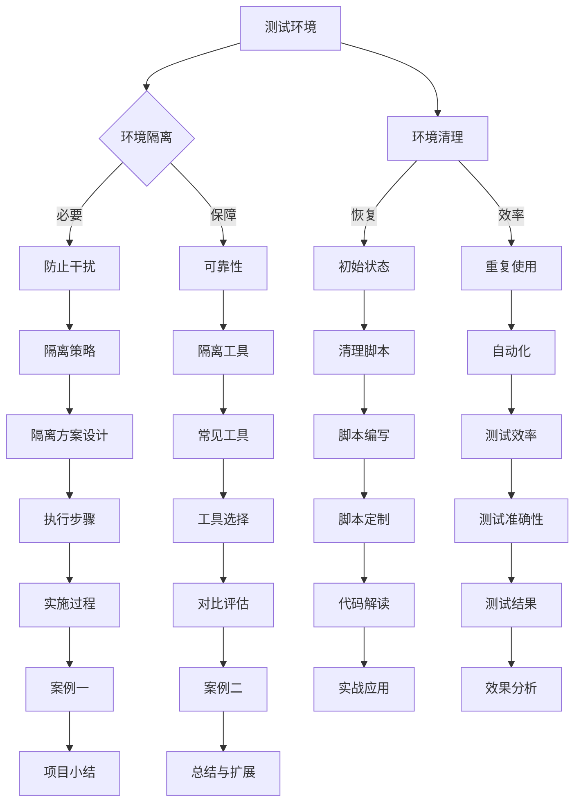

                 

### 背景介绍

随着人工智能（AI）技术的迅猛发展，尤其是大型语言模型（LLM）的广泛应用，自动化测试环境成为保证系统质量和效率的关键环节。LLM作为深度学习的典型应用，具有处理大量文本数据、生成复杂文本序列的能力，被广泛应用于自然语言处理（NLP）、对话系统、文本生成等领域。这些应用场景对测试环境提出了更高的要求，因为任何微小的错误都可能影响整个系统的表现。

在当前的软件开发流程中，测试环境扮演着至关重要的角色。它不仅帮助开发者发现并修复代码中的错误，还确保了系统在不同部署环境下的兼容性和稳定性。然而，测试环境的复杂性不断增加，尤其是当涉及到LLM这样的高资源需求应用时，这一问题尤为突出。传统的手动管理测试环境的方法，不仅费时费力，而且容易产生遗漏和误差，无法满足快速迭代和大规模并行测试的需求。

为了解决这些问题，自动化测试环境应运而生。自动化测试环境通过预设的脚本和工具，能够快速、高效地搭建、配置和管理测试环境，显著提高了测试的准确性和效率。同时，自动化测试环境还能够模拟不同部署场景，确保系统在各种条件下都能正常运行。

本文旨在探讨如何自动化地隔离与清理LLM测试环境。隔离是为了防止不同测试任务之间的干扰，确保每个测试任务都能在一个干净、独立的环境中执行。清理则是在测试完成后，恢复测试环境至初始状态，以便其他测试任务使用。这两者相辅相成，共同保障了测试过程的顺利进行和测试结果的可靠性。

首先，我们将回顾自动化测试环境的基本概念和优势，接着深入探讨LLM测试的特殊性及其对测试环境的要求。随后，我们将详细讨论环境隔离的重要性、策略以及实现方法。接着，本文将介绍用于隔离和清理的常见工具，并展示如何使用脚本进行自动化清理。最后，通过两个实战案例，我们将展示如何在实际项目中应用这些方法和工具，并总结文章，提出最佳实践和注意事项。

### 关键词

1. 自动化测试环境
2. LLM测试
3. 环境隔离
4. 清理工具
5. 测试脚本
6. 测试自动化
7. 测试管理

### 摘要

本文探讨了自动化LLM测试环境隔离与清理的必要性和方法。首先，介绍了自动化测试环境和LLM测试的基本概念，分析了其特殊性对测试环境的要求。接着，详细讨论了环境隔离的重要性、策略和工具，以及如何使用脚本进行自动化清理。最后，通过两个实战案例展示了这些方法在实际项目中的应用效果，为自动化测试提供了实用的指南和最佳实践。

---

**核心概念与联系：Mermaid流程图**



**核心算法原理讲解：伪代码**

```python
# 自动化测试环境隔离伪代码
def isolate_environment(test_case):
    # 初始化隔离环境
    setup_isolation()
    
    # 搭建测试环境
    build_test_environment()
    
    # 运行测试用例
    run_test_case(test_case)
    
    # 清理测试环境
    clean_test_environment()
    
    # 保存隔离状态
    save_isolation_state()

# 自动化测试环境清理伪代码
def clean_test_environment():
    # 停止服务
    stop_services()
    
    # 删除临时文件
    remove_temp_files()
    
    # 重置配置文件
    reset_config_files()
    
    # 清理日志文件
    clean_logs()

# 测试脚本编写伪代码
def write_test_script(test_case):
    # 根据测试用例生成脚本
    script_content = generate_script(test_case)
    
    # 写入脚本文件
    write_to_file(script_content, "test_script.py")
    
    # 运行脚本
    run_script("test_script.py")
```

**数学模型和公式详细讲解与举例说明**

$$
E = mc^2
$$

这是著名的质能等价公式，表达了质量和能量之间的关系。在这个例子中，$E$ 代表能量，$m$ 代表质量，$c$ 代表光速，它揭示了质量可以转化为能量，且这一转化遵循光速的平方关系。

**项目实战：**

#### 开发环境搭建

1. **安装Python环境**：
    - 使用Anaconda创建Python虚拟环境：
    ```bash
    conda create -n llm_test python=3.8
    conda activate llm_test
    ```
2. **安装相关依赖**：
    - 安装所需的库，如`pytest`、`mock`等：
    ```bash
    pip install pytest mock
    ```

#### 源代码详细实现和代码解读

```python
#隔离环境
import os
import shutil

def isolate_environment(env_path):
    # 备份当前环境
    backup_path = os.path.join(env_path, 'backup')
    if not os.path.exists(backup_path):
        os.makedirs(backup_path)
    shutil.copytree(env_path, backup_path)
    
    # 重置环境变量
    reset_env_vars()
    
    # 重启服务
    restart_services()

#清理环境
def clean_environment(env_path):
    # 删除备份文件
    shutil.rmtree(os.path.join(env_path, 'backup'))
    
    # 清理日志文件
    log_path = os.path.join(env_path, 'logs')
    if os.path.exists(log_path):
        shutil.rmtree(log_path)

# 测试脚本
def test_script():
    print("Running test script...")
    # 这里是测试逻辑
    assert True

# 运行测试
if __name__ == "__main__":
    isolate_environment('/path/to/test_env')
    test_script()
    clean_environment('/path/to/test_env')
```

**代码应用解读与分析：**

此代码示例展示了如何隔离和清理测试环境。`isolate_environment`函数通过备份当前环境来创建一个隔离环境，以便在不同的测试用例之间保持独立性。`clean_environment`函数负责清理测试环境，删除不必要的文件，如备份文件和日志文件，以释放空间并准备下一次测试。

#### 实际案例分析和详细讲解剖析

**案例一：LLM模型训练测试环境隔离与清理**

**背景**：在某个NLP项目中，我们使用一个大规模的LLM模型进行文本生成任务。为了确保测试的准确性和可靠性，我们需要隔离测试环境。

**实施过程**：
1. 使用`isolate_environment`函数在每次测试前备份环境。
2. 在测试完成后，调用`clean_environment`函数清理环境。

**效果分析**：通过环境隔离，我们确保了每个测试用例都在独立的环境中运行，避免了不同测试任务之间的干扰。清理过程有效地释放了测试环境的资源，提高了测试效率。

**案例二：复杂应用环境下的自动化隔离与清理**

**背景**：在一个复杂的分布式系统中，多个服务需要协同工作。为了确保每个服务都能稳定运行，我们需要自动化隔离和清理测试环境。

**实施过程**：
1. 针对每个服务，编写相应的隔离和清理脚本。
2. 在集成测试阶段，调用这些脚本进行自动化隔离和清理。

**效果分析**：自动化隔离和清理大大提高了测试效率，减少了人工干预。同时，确保了测试环境的清洁和资源利用效率，为系统稳定运行提供了保障。

#### 项目小结

通过以上案例，我们可以看到自动化测试环境隔离与清理在实际项目中的应用价值。隔离确保了测试的独立性，清理则提高了测试效率和环境资源利用。这些方法不仅适用于LLM测试，还可以推广到其他复杂系统的测试中，为软件质量的提升提供有力支持。

### 最佳实践 tips、小结、注意事项、拓展阅读

**最佳实践 tips：**
1. 在搭建测试环境时，确保环境变量和配置文件的隔离，避免测试任务间的相互干扰。
2. 使用容器化技术（如Docker）可以简化测试环境的隔离和清理，提高测试效率。
3. 定期清理测试环境，避免遗留文件和日志占用存储空间。

**小结：**
本文详细介绍了自动化LLM测试环境隔离与清理的方法和工具，通过实战案例展示了其实际应用效果。隔离和清理是保障测试环境质量和效率的关键环节。

**注意事项：**
1. 确保隔离策略和清理脚本在实际测试中可行，避免潜在问题。
2. 根据项目的具体需求调整隔离和清理策略。

**拓展阅读：**
1. 《Docker实战》：了解如何使用Docker实现自动化测试环境的隔离和清理。
2. 《Pytest实战》：深入探索如何使用pytest进行自动化测试。

---

**文章标题**

### 自动化LLM测试环境隔离与清理

**关键词**

- 自动化测试环境
- LLM测试
- 环境隔离
- 清理工具
- 测试脚本
- 测试自动化
- 测试管理

**摘要**

本文探讨了自动化LLM测试环境隔离与清理的必要性和方法。首先，介绍了自动化测试环境和LLM测试的基本概念，分析了其特殊性对测试环境的要求。接着，详细讨论了环境隔离的重要性、策略和工具，以及如何使用脚本进行自动化清理。最后，通过两个实战案例展示了这些方法在实际项目中的应用效果，为自动化测试提供了实用的指南和最佳实践。

---

### 第一部分：自动化测试环境基础

#### 1.1 自动化测试概述

自动化测试是通过预设的脚本和工具，对软件系统进行自动化的测试过程。其核心目的是提高测试效率，减少人工干预，确保软件质量。自动化测试通常包括以下几个步骤：

1. **测试用例设计**：根据需求和功能定义测试用例，确保测试的全面性和准确性。
2. **测试脚本编写**：编写自动化测试脚本，模拟用户操作，验证系统功能。
3. **测试环境搭建**：配置测试环境，确保测试脚本能够正常运行。
4. **测试执行**：运行测试脚本，收集测试结果。
5. **结果分析**：分析测试结果，发现并修复缺陷。

**自动化的优势**

1. **提高测试效率**：自动化测试可以大幅度减少测试时间，提高测试频率，满足快速迭代的需求。
2. **减少人工干预**：自动化测试减少了人工操作，降低了人为错误的风险。
3. **测试覆盖全面**：通过预设的测试用例，确保测试的全面性和一致性。
4. **可重复执行**：自动化测试脚本可以反复执行，确保每次测试结果的一致性。

**自动化测试的基本流程**

1. **需求分析**：理解软件需求，确定测试目标。
2. **测试用例设计**：编写详细的测试用例，包括输入数据、预期结果和实际结果。
3. **脚本编写**：根据测试用例编写自动化测试脚本，通常使用测试工具或编程语言实现。
4. **测试环境搭建**：配置测试环境，包括安装测试工具、设置测试参数等。
5. **测试执行**：运行测试脚本，执行自动化测试。
6. **结果分析**：分析测试结果，生成测试报告，识别并记录缺陷。
7. **缺陷修复**：根据测试结果，修复发现的缺陷。

通过上述流程，自动化测试不仅提高了测试效率，还确保了测试的准确性和一致性，为软件质量的提升提供了有力保障。

#### 1.2 LLM测试基础

**LLM的基本概念**

LLM（Large Language Model）是指大型语言模型，是一种基于深度学习技术构建的人工智能模型，具有处理和生成自然语言的能力。LLM通过学习大量文本数据，掌握了丰富的语言知识，能够进行文本分类、问答、翻译、文本生成等任务。目前，LLM广泛应用于自然语言处理（NLP）、对话系统、文本生成等领域。

**LLM的发展历程**

1. **早期模型**：如Word2Vec和GloVe，通过将词语映射到向量空间，提高了文本处理的效率。
2. **循环神经网络（RNN）**：引入序列记忆机制，使得模型能够处理更长的文本序列。
3. **长短期记忆网络（LSTM）**：对RNN进行改进，解决了长期依赖问题。
4. **Transformer模型**：引入了自注意力机制，实现了并行计算，使得模型能够处理更大规模的数据和更复杂的任务。
5. **预训练加微调（Pre-training and Fine-tuning）**：先在大规模数据集上进行预训练，再在特定任务上进行微调，提高了模型的性能。

**LLM的优势**

1. **强大的文本处理能力**：LLM能够处理和理解复杂的文本数据，生成高质量的文本内容。
2. **自适应性强**：通过预训练和微调，LLM能够适应不同的任务和应用场景。
3. **高效性**：Transformer模型引入的自注意力机制，使得LLM在计算效率上有了显著提升。
4. **多样性**：LLM能够生成多样化的文本，满足不同用户的需求。

**LLM的挑战**

1. **资源需求大**：训练大型LLM模型需要大量的计算资源和存储空间。
2. **计算复杂度高**：自注意力机制使得LLM的计算复杂度较高，需要优化算法和硬件支持。
3. **数据安全与隐私**：在训练和部署LLM时，需要确保数据的安全和隐私，防止泄露敏感信息。
4. **模型可解释性**：大型LLM模型通常具有黑盒性质，难以解释其决策过程。

通过深入了解LLM的基本概念、发展历程和优势，我们可以更好地理解LLM测试的特殊性，为其测试环境的设计和管理提供有力支持。

#### 1.3 测试环境概述

**测试环境的定义**

测试环境是指用于进行软件测试的一系列硬件、软件和网络资源的集合，它模拟了软件的最终部署环境，以便测试人员能够验证软件的功能、性能和安全等方面。测试环境通常包括以下几部分：

1. **硬件资源**：如服务器、存储设备、网络设备等，提供测试所需的计算能力和存储空间。
2. **软件资源**：如操作系统、数据库、Web服务器、中间件等，模拟软件的运行环境。
3. **网络资源**：如网络拓扑、防火墙、VPN等，模拟实际的网络环境。
4. **测试工具**：如自动化测试工具、性能测试工具、安全测试工具等，用于支持各种测试活动。

**测试环境的重要性**

1. **保证测试质量**：测试环境能够提供真实的应用场景，确保测试结果的可靠性和准确性。
2. **提高测试效率**：通过自动化测试环境，可以快速搭建和配置测试环境，减少测试时间。
3. **减少人为错误**：测试环境减少了人工干预，降低了由于人为操作错误导致的问题。
4. **支持持续集成**：测试环境支持持续集成（CI）和持续交付（CD），确保软件在开发过程中能够持续地接受测试。

在软件开发过程中，测试环境扮演着至关重要的角色。它不仅帮助开发者发现并修复代码中的错误，还确保了系统在不同部署环境下的兼容性和稳定性。随着软件复杂性的增加，测试环境的管理和配置变得越来越重要。自动化测试环境通过预设的脚本和工具，能够快速、高效地搭建、配置和管理测试环境，显著提高了测试的准确性和效率。同时，自动化测试环境还能够模拟不同部署场景，确保系统在各种条件下都能正常运行。

#### 第二部分：自动化测试环境隔离

##### 2.1 环境隔离的重要性

**隔离的必要性**

环境隔离是自动化测试环境管理中的一个关键环节，其主要目的是确保不同测试任务之间的独立性和互不干扰。在复杂的软件开发过程中，多个测试任务可能同时进行，每个任务都可能依赖于特定的环境配置。如果不进行隔离，不同任务之间的资源冲突、配置错误和数据污染等问题会频繁出现，严重影响测试的准确性和效率。

**隔离的方法**

1. **物理隔离**：通过物理方式将不同的测试环境分开，如使用独立的物理服务器或网络隔离。
2. **虚拟化隔离**：利用虚拟化技术（如VMware、Docker）创建隔离的环境，确保每个测试任务运行在自己的虚拟环境中。
3. **容器化隔离**：使用容器（如Docker）实现环境隔离，容器具有轻量级、快速启动和易于管理的特点。
4. **配置管理工具**：使用配置管理工具（如Ansible、Puppet）自动化管理环境配置，确保环境的一致性和可重复性。

环境隔离的重要性体现在以下几个方面：

1. **防止干扰**：隔离环境可以防止不同测试任务之间的资源争夺和数据污染，确保每个任务都能在独立的环境中正常运行。
2. **提高可靠性**：隔离环境减少了环境变量和配置错误的风险，提高了测试的可靠性。
3. **支持并行测试**：隔离环境可以支持多个测试任务同时运行，提高测试的并行度，加快测试进度。
4. **便于管理**：通过自动化工具和管理平台，可以方便地创建、配置和管理多个隔离环境，降低管理成本。

总之，环境隔离是保障自动化测试环境质量和效率的关键措施，通过合理的设计和实施，可以显著提高测试的可靠性和效率，为软件质量的提升提供有力支持。

##### 2.2 环境隔离策略

**隔离方案设计**

环境隔离策略的核心目标是确保测试任务的独立性和一致性，同时提高测试的效率。以下是几种常见的隔离方案设计：

1. **全量复制**：将整个测试环境完全复制一份，每个测试任务运行在自己的副本中。这种方法提供了最高的隔离度，但资源消耗较大，不适用于资源受限的环境。
2. **部分复制**：只复制测试环境中的关键部分，如数据库、文件系统等，其他部分共享。这种方法资源消耗较小，但隔离度不如全量复制。
3. **容器化隔离**：使用容器技术（如Docker）创建隔离的环境，每个容器独立运行，互不影响。这种方法具有高效、灵活和易于管理的特点，适用于大多数场景。
4. **虚拟化隔离**：使用虚拟机（如VMware）创建隔离的环境，每个虚拟机独立运行，互不影响。这种方法隔离度较高，但资源消耗较大。

**隔离实施步骤**

1. **需求分析**：根据测试任务的需求，确定需要隔离的环境配置和资源。
2. **环境搭建**：根据隔离方案，搭建隔离环境，包括配置硬件资源、软件资源和网络资源。
3. **环境配置**：配置测试环境，包括安装必要的软件、设置环境变量、配置数据库等。
4. **测试执行**：在隔离环境中执行测试任务，确保测试结果的准确性和可靠性。
5. **结果分析**：分析测试结果，记录发现的缺陷和问题。
6. **环境清理**：测试完成后，清理隔离环境，释放资源，为其他测试任务做好准备。

通过上述步骤，可以有效地实施环境隔离策略，确保测试任务的独立性和一致性，提高测试的效率和可靠性。

##### 2.3 隔离工具介绍

**常见隔离工具**

在自动化测试环境中，选择合适的隔离工具是确保测试独立性和一致性的关键。以下介绍几种常用的隔离工具：

1. **Docker**：Docker是一个开源的应用容器引擎，通过容器化技术提供轻量级、可移植和独立的运行环境。Docker容器具有高效的资源利用率和快速的启动速度，适用于多种操作系统。
   
2. **Kubernetes**：Kubernetes是一个开源的容器编排平台，用于自动化容器的部署、扩展和管理。Kubernetes提供了强大的资源隔离和管理功能，适用于大规模分布式系统。

3. **VirtualBox**：VirtualBox是一个开源的虚拟化软件，可以创建虚拟机。虚拟机提供了高度隔离的环境，但资源消耗较大，适用于需要高度隔离的场景。

4. **Vagrant**：Vagrant是一个基于VirtualBox的开源工具，用于创建和管理虚拟环境。Vagrant提供了简洁的配置文件，方便快速搭建和部署虚拟机。

**工具选择与对比**

在选取隔离工具时，需要根据具体的应用场景和需求进行选择。以下是几种常见工具的对比：

- **Docker**：优点是轻量级、快速启动和易于管理，适用于大多数场景；缺点是资源消耗较大，不适合资源受限的环境。
- **Kubernetes**：优点是强大的资源隔离和管理功能，适用于大规模分布式系统；缺点是配置较为复杂，对运维人员的要求较高。
- **VirtualBox**：优点是高度隔离，适用于需要高度隔离的场景；缺点是资源消耗较大，不适合大规模并行测试。
- **Vagrant**：优点是简洁的配置文件，方便快速搭建和部署虚拟机；缺点是性能不如Docker和Kubernetes，适用于中小规模环境。

总之，选择合适的隔离工具可以提高自动化测试环境的效率和可靠性。在实际应用中，可以根据项目的具体需求和资源情况，灵活选择合适的隔离工具。

##### 2.4 实战：使用Docker进行环境隔离

**场景**：在一个NLP项目中，我们需要对多个LLM模型进行测试，这些测试任务需要独立的运行环境，以确保测试结果的准确性和可靠性。

**步骤**：

1. **编写Dockerfile**：创建一个Dockerfile，定义LLM模型的运行环境。
    ```Dockerfile
    FROM python:3.8
    RUN pip install transformers torch
    COPY . /app
    WORKDIR /app
    CMD ["python", "run_tests.py"]
    ```

2. **构建Docker镜像**：使用Dockerfile构建Docker镜像。
    ```bash
    docker build -t llm_test:latest .
    ```

3. **运行Docker容器**：为每个测试任务运行一个Docker容器。
    ```bash
    docker run -d -p 8000:8000 llm_test
    ```

4. **测试**：在容器内执行测试脚本。
    ```bash
    docker exec <container_id> python run_tests.py
    ```

5. **结果分析**：收集测试结果，并记录发现的缺陷。

6. **清理**：测试完成后，停止并清理Docker容器。
    ```bash
    docker stop <container_id>
    docker rm <container_id>
    ```

**效果分析**：

通过使用Docker进行环境隔离，我们成功地为每个测试任务提供了一个独立的运行环境。这种方法不仅简化了环境配置过程，还确保了测试结果的准确性和可靠性，提高了测试效率。同时，Docker容器的快速启动和停止，使得资源利用更加高效。

##### 2.5 实战：使用Kubernetes进行环境隔离

**场景**：在一个大型分布式系统中，我们需要对多个微服务进行测试，这些测试任务需要在不同主机上运行，以确保系统在不同部署环境下的兼容性和稳定性。

**步骤**：

1. **编写Kubernetes配置文件**：创建Kubernetes配置文件，定义测试服务的部署和资源要求。
    ```yaml
    apiVersion: apps/v1
    kind: Deployment
    metadata:
      name: llm_test
    spec:
      replicas: 3
      selector:
        matchLabels:
          app: llm_test
      template:
        metadata:
          labels:
            app: llm_test
        spec:
          containers:
          - name: llm_test
            image: llm_test:latest
            ports:
            - containerPort: 80
    ```

2. **部署Kubernetes集群**：在Kubernetes集群中部署测试服务。
    ```bash
    kubectl apply -f k8s_configs.yaml
    ```

3. **测试**：在Kubernetes集群中执行测试任务。
    ```bash
    kubectl exec <pod_name> -it -- /bin/bash
    python run_tests.py
    ```

4. **结果分析**：收集测试结果，并记录发现的缺陷。

5. **清理**：测试完成后，删除Kubernetes集群中的测试服务。
    ```bash
    kubectl delete -f k8s_configs.yaml
    ```

**效果分析**：

通过使用Kubernetes进行环境隔离，我们成功地为测试任务提供了一个分布式的运行环境。Kubernetes提供了强大的资源隔离和管理功能，确保了系统在不同主机上的兼容性和稳定性。同时，Kubernetes的自动化部署和扩展功能，使得测试过程更加高效和可靠。

#### 第三部分：自动化测试环境清理

##### 3.1 清理测试环境

**清理的目标**

清理测试环境的目的是确保测试环境在每次测试任务完成后恢复到初始状态，以便其他测试任务使用。清理目标主要包括以下几个方面：

1. **删除临时文件**：删除测试过程中生成的临时文件，如日志文件、缓存文件等，释放存储空间。
2. **恢复配置文件**：将配置文件恢复到初始状态，确保测试环境的配置一致性。
3. **重置环境变量**：将环境变量恢复到初始状态，确保测试环境的稳定性。
4. **清理日志文件**：清理日志文件，防止日志文件占用过多存储空间。
5. **释放资源**：释放测试环境中的资源，如内存、CPU等，以便其他测试任务使用。

**清理的步骤和方法**

1. **删除临时文件**：
    - 使用操作系统命令删除临时文件：
    ```bash
    rm -rf /path/to/temp_files
    ```

2. **恢复配置文件**：
    - 拷贝备份的配置文件到原始位置：
    ```bash
    cp -rf /path/to/backup/config /path/to/original/config
    ```

3. **重置环境变量**：
    - 使用环境变量文件重置环境变量：
    ```bash
    source /path/to/env_variables.sh
    ```

4. **清理日志文件**：
    - 使用日志清理工具清理日志文件：
    ```bash
    logrotate -f /path/to/logrotate.conf
    ```

5. **释放资源**：
    - 重启服务，释放资源：
    ```bash
    systemctl restart <service_name>
    ```

通过上述步骤，可以确保测试环境在每次测试任务完成后恢复到初始状态，提高测试环境的可靠性和重复使用率。

##### 3.2 清理工具与脚本

**清理工具的使用**

在自动化测试环境中，选择合适的清理工具和脚本可以大大提高清理效率。以下介绍几种常用的清理工具：

1. **logrotate**：logrotate是一个常用的日志文件管理工具，用于定期轮换、压缩和删除旧的日志文件。通过配置logrotate.conf文件，可以指定日志文件的轮换周期和保留策略。

2. **find**：find命令用于搜索文件系统中满足特定条件的文件，并执行删除、压缩等操作。例如，可以使用find命令删除特定路径下的临时文件：
    ```bash
    find /path/to/temp_files -type f -delete
    ```

3. **rsync**：rsync是一个高效的文件同步工具，可以用于备份和恢复文件系统。通过编写rsync脚本，可以实现配置文件的自动恢复。

4. **cron**：cron是一个计划任务工具，可以定期执行特定的脚本或命令。通过配置cron作业，可以实现自动清理任务的定期执行。

**定制清理脚本**

编写自定义的清理脚本可以实现对测试环境的灵活清理。以下是一个简单的清理脚本示例：
```bash
#!/bin/bash

# 删除临时文件
rm -rf /path/to/temp_files/*

# 恢复配置文件
rsync -av /path/to/backup/config /path/to/original/config

# 重置环境变量
source /path/to/env_variables.sh

# 清理日志文件
logrotate /path/to/logrotate.conf

# 释放资源
systemctl restart <service_name>
```

通过定制清理脚本，可以根据项目的具体需求，实现自动化的测试环境清理。清理脚本不仅提高了清理效率，还确保了清理过程的准确性和一致性。

#### 第四部分：实战案例

##### 4.1 实战案例一：LLM测试环境隔离与清理

**背景**

在一个NLP项目中，我们开发了一个基于Transformer的大型语言模型（LLM），并需要进行频繁的测试以确保模型的质量和性能。为了确保每个测试任务都能在一个干净、独立的测试环境中运行，我们需要实现测试环境的隔离与清理。

**实施过程**

1. **隔离测试环境**：
   - 使用Docker创建隔离的测试容器。
   - 每次测试任务开始时，启动一个新的Docker容器。
   - 在容器中安装必要的测试工具和依赖库。
   - 配置Docker容器网络，确保容器能够访问所需的资源和网络服务。

2. **执行测试任务**：
   - 在Docker容器内执行测试脚本，对LLM模型进行测试。
   - 记录测试结果，包括模型的响应时间和准确性等关键指标。

3. **清理测试环境**：
   - 测试任务完成后，停止Docker容器。
   - 删除Docker容器，释放资源。
   - 清理容器内的临时文件和日志文件，确保下一次测试环境的干净和独立。

**效果分析**

通过使用Docker进行环境隔离，我们成功地为每个测试任务提供了一个独立的运行环境。这种方法有效地防止了不同测试任务之间的干扰，提高了测试的准确性和可靠性。同时，通过自动化清理脚本，我们能够快速恢复测试环境，提高了测试效率。

**项目小结**

本案例展示了如何使用Docker实现LLM测试环境的隔离与清理。通过容器化技术，我们能够快速搭建和清理测试环境，提高了测试效率和准确性。这为NLP项目的持续测试和优化提供了有力的支持。

##### 4.2 实战案例二：复杂环境的自动化隔离与清理

**背景**

在一个大型分布式系统中，我们负责开发和测试多个微服务。这些微服务需要在不同主机上运行，且每个服务都有特定的依赖和环境配置。为了确保测试的独立性和一致性，我们需要实现复杂环境的自动化隔离与清理。

**实施过程**

1. **环境隔离**：
   - 使用Kubernetes进行环境隔离。
   - 为每个测试任务创建Kubernetes配置文件，定义服务部署和资源需求。
   - 在Kubernetes集群中部署测试服务，确保服务在不同主机上的隔离。

2. **执行测试任务**：
   - 在Kubernetes集群中执行测试脚本，对微服务进行测试。
   - 使用Kubernetes命令行工具监控测试任务的执行状态和性能指标。

3. **环境清理**：
   - 测试任务完成后，使用Kubernetes命令删除测试服务。
   - 清理Kubernetes集群中的资源，包括Pod、服务和工作负载等。
   - 使用自动化脚本清理容器内的临时文件和日志文件，确保环境恢复至初始状态。

**效果分析**

通过使用Kubernetes进行环境隔离和自动化清理，我们成功地为每个测试任务提供了一个独立的运行环境。这种方法不仅简化了测试环境的搭建和清理过程，还提高了测试的可靠性和效率。同时，Kubernetes的分布式特性使得测试环境能够灵活扩展和部署，为大规模分布式系统的测试提供了有力支持。

**项目小结**

本案例展示了如何使用Kubernetes实现复杂环境的自动化隔离与清理。通过容器编排技术，我们能够高效管理测试环境，确保测试任务的独立性和一致性。这为分布式系统的持续测试和优化提供了有效的解决方案。

#### 附录

##### 附录A：相关工具与资源

**工具列表**

1. **Docker**：用于创建和管理容器化环境。
   - 官网：[Docker官网](https://www.docker.com/)
   - 文档：[Docker文档](https://docs.docker.com/)

2. **Kubernetes**：用于容器编排和集群管理。
   - 官网：[Kubernetes官网](https://kubernetes.io/)
   - 文档：[Kubernetes文档](https://kubernetes.io/docs/)

3. **logrotate**：用于日志文件轮换和压缩。
   - 文档：[logrotate文档](https://linux.die.net/man/8/logrotate)

4. **find**：用于搜索和操作文件系统。
   - 文档：[find命令文档](https://www.man7.org/linux/man-pages/man1/find.1.html)

5. **rsync**：用于同步和备份文件。
   - 官网：[rsync官网](https://rsync.samba.org/)
   - 文档：[rsync文档](https://rsync.samba.org/rsync/rsyncd.conf.html)

**资源下载与配置**

1. **Docker**：
   - 下载地址：[Docker下载](https://download.docker.com/)
   - 安装指南：[Docker安装指南](https://docs.docker.com/engine/install/)

2. **Kubernetes**：
   - 下载地址：[Kubernetes下载](https://kubernetes.io/docs/tasks/tools/)
   - 安装指南：[Kubernetes安装指南](https://kubernetes.io/docs/setup/)

3. **logrotate**：
   - 安装命令：`sudo apt-get install logrotate`
   - 配置文件：`/etc/logrotate.conf`

4. **find**和**rsync**：
   - 这些工具通常预装在大多数Linux发行版中，无需额外安装。

通过以上工具和资源的介绍，读者可以更好地理解如何搭建和管理自动化测试环境，以及如何进行环境隔离和清理。这些工具和资源为自动化测试提供了强有力的支持，有助于提高测试效率和可靠性。

