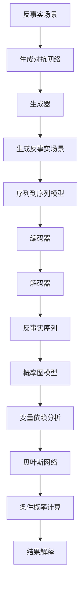

                 

### 文章标题

# 自动化prompt反事实推理增强

## 关键词：
- 自动化prompt
- 反事实推理
- GAN
- 序列到序列模型
- 贝叶斯网络
- 数学模型
- 项目实战

### 摘要：
本文深入探讨了自动化prompt技术在反事实推理中的增强作用。首先，介绍了反事实推理的基本原理和应用场景，探讨了其与自动化prompt技术的结合点。接着，通过具体算法原理的讲解，详细阐述了生成对抗网络（GAN）和序列到序列模型在自动化prompt反事实推理中的应用。本文还通过数学模型和伪代码，讲解了概率图模型和贝叶斯网络的核心概念及其在反事实推理中的作用。随后，本文以一个实际项目为例，详细展示了自动化prompt反事实推理的完整实现过程，包括环境搭建、代码实现、应用分析和效果评估。最后，本文对自动化prompt反事实推理的未来发展趋势进行了展望，并提出了相关建议。

---

### 背景介绍

#### 反事实推理

反事实推理（Counterfactual Reasoning）是一种逻辑推理方式，用于评估在假设情况下的可能性及其影响。它是一种思考假设“如果发生了某种情况，将会发生什么”的思维方式。在计算机科学和人工智能领域，反事实推理被认为是一种高级认知功能，广泛应用于情境模拟、决策支持、问题解决等多个方面。

反事实推理的核心在于评估现实世界中的某个事件或结果在另一种情况下可能发生的情况。这种推理不仅限于简单的“如果……那么……”逻辑，还包括复杂的条件和结果之间的关联。例如，在医疗诊断中，医生可能会使用反事实推理来思考：“如果患者接受了不同的治疗方案，结果会是怎样？”这种推理对于评估治疗方案的有效性至关重要。

#### 自动化prompt

自动化prompt技术是一种通过算法自动生成或优化提示信息的技术。在自然语言处理（NLP）领域，prompt可以引导模型生成更符合预期输出的文本。自动化prompt技术的核心在于提高模型的生成效率和质量，使得模型能够更好地理解和生成复杂、多样化的语言内容。

自动化prompt技术的应用场景广泛，包括但不限于：

- **对话系统**：通过自动化prompt技术，可以生成更自然、流畅的对话内容，提高用户交互体验。
- **文本生成**：自动化prompt可以帮助生成新闻文章、产品描述等，提高内容生产效率。
- **文本分类**：在文本分类任务中，自动化prompt技术可以优化分类模型，提高分类准确性。
- **机器翻译**：通过自动化prompt技术，可以优化翻译模型，提高翻译质量和效率。

#### 自动化prompt与反事实推理的结合

自动化prompt技术为反事实推理提供了强有力的工具。通过自动化prompt，可以引导模型在反事实场景下进行推理，从而更准确地评估不同情况下的结果和可能性。具体来说，自动化prompt技术在反事实推理中的应用主要体现在以下几个方面：

- **生成反事实场景**：自动化prompt技术可以帮助生成各种可能的反事实场景，为反事实推理提供丰富的数据输入。
- **优化推理过程**：自动化prompt技术可以通过优化提示信息，引导模型在反事实推理中更高效、准确地找到关键节点和路径。
- **提高推理质量**：自动化prompt技术可以通过优化模型的输入，提高反事实推理的结果准确性和可靠性。

结合自动化prompt技术的反事实推理，不仅能够提高推理的效率，还能够增强推理的质量和灵活性，使得反事实推理在更广泛的领域和任务中得到应用。

---

### 核心概念与联系

为了深入理解自动化prompt在反事实推理中的作用，我们需要先了解以下几个核心概念：生成对抗网络（GAN）、序列到序列模型、概率图模型和贝叶斯网络。

#### 1. 生成对抗网络（GAN）

生成对抗网络（GAN）是一种由生成器和判别器组成的神经网络结构。生成器的任务是生成类似于真实数据的假数据，而判别器的任务是区分真实数据和生成数据。通过不断地训练和对抗，生成器和判别器都得到提升，从而生成更加逼真的数据。

GAN在反事实推理中的应用主要体现在以下几个方面：

- **生成反事实场景**：通过生成器生成各种可能的反事实场景，为反事实推理提供丰富的数据输入。
- **优化推理路径**：GAN可以帮助优化反事实推理的路径，提高推理的效率和准确性。
- **提高结果可靠性**：通过生成对抗的过程，生成器生成的数据更加真实，从而提高反事实推理的结果可靠性。

#### 2. 序列到序列模型

序列到序列（Sequence-to-Sequence, seq2seq）模型是一种用于处理序列数据的神经网络模型，通常用于机器翻译、文本生成等任务。seq2seq模型通过编码器和解码器两个部分，将输入序列编码为固定长度的向量，然后解码为输出序列。

在反事实推理中，seq2seq模型的应用主要体现在以下几个方面：

- **序列转换**：将原始事实序列转换为反事实序列，为反事实推理提供输入。
- **推理过程优化**：通过序列转换，优化反事实推理的过程，提高推理的效率和准确性。
- **生成结果解释**：通过解码器生成反事实推理的结果，并提供详细的解释和预测。

#### 3. 概率图模型

概率图模型是一种用于表示变量之间概率关系的图结构模型，包括马尔可夫网（Markov Network）和贝叶斯网络（Bayesian Network）等。概率图模型通过图结构来表示变量之间的依赖关系，从而更准确地预测和推理变量之间的关系。

在反事实推理中，概率图模型的应用主要体现在以下几个方面：

- **变量依赖分析**：通过概率图模型分析变量之间的依赖关系，为反事实推理提供理论支持。
- **推理路径优化**：通过概率图模型优化反事实推理的路径，提高推理的效率和准确性。
- **结果可靠性评估**：通过概率图模型评估反事实推理结果的可靠性，为决策提供依据。

#### 4. 贝叶斯网络

贝叶斯网络是一种基于概率论的图结构模型，用于表示变量之间的条件概率关系。在贝叶斯网络中，每个节点表示一个变量，边表示变量之间的依赖关系。通过贝叶斯网络，可以计算变量之间的条件概率，从而进行推理和预测。

在反事实推理中，贝叶斯网络的应用主要体现在以下几个方面：

- **条件概率计算**：通过贝叶斯网络计算变量之间的条件概率，为反事实推理提供基础。
- **推理过程优化**：通过贝叶斯网络优化反事实推理的过程，提高推理的效率和准确性。
- **结果解释**：通过贝叶斯网络生成反事实推理的结果，并提供详细的解释和预测。

#### Mermaid流程图

为了更好地展示自动化prompt在反事实推理中的流程，我们可以使用Mermaid流程图来表示各个核心概念之间的关系。



通过这个Mermaid流程图，我们可以清晰地看到自动化prompt在反事实推理中的各个环节，以及各个核心概念之间的联系。

---

### 核心算法原理讲解

为了深入理解自动化prompt反事实推理的核心算法原理，我们需要详细探讨生成对抗网络（GAN）和序列到序列模型（seq2seq）的工作原理，并结合伪代码和数学模型进行讲解。

#### 1. 生成对抗网络（GAN）

生成对抗网络（GAN）是由生成器和判别器两个神经网络组成的模型。生成器的任务是生成与真实数据相似的数据，而判别器的任务是区分真实数据和生成数据。通过生成器和判别器的对抗训练，模型逐渐提高生成数据的逼真度。

**生成器（Generator）**：

生成器的目标是生成类似真实数据的假数据。在反事实推理中，生成器用于生成各种可能的反事实场景，为反事实推理提供数据输入。

```python
# 生成器伪代码
def generator(input_data):
    # 对输入数据进行处理，生成反事实场景
    processed_data = process_input(input_data)
    # 通过神经网络生成反事实场景
    generated_scenario = neural_network(processed_data)
    return generated_scenario
```

**判别器（Discriminator）**：

判别器的目标是区分真实数据和生成数据。在反事实推理中，判别器用于评估生成数据的真实性，从而帮助优化生成器的生成过程。

```python
# 判别器伪代码
def discriminator(data):
    # 对输入数据进行处理，判断是否为真实数据
    processed_data = process_input(data)
    # 通过神经网络判断数据真实性
    prediction = neural_network(processed_data)
    return prediction
```

**GAN训练过程**：

GAN的训练过程包括生成器和判别器的交替训练。在训练过程中，生成器和判别器相互对抗，生成器的目标是提高生成数据的真实性，而判别器的目标是提高对生成数据的辨别能力。

```python
# GAN训练过程伪代码
for epoch in range(num_epochs):
    for batch in data_loader:
        # 训练判别器
       判别器.train()
        real_data = batch
        real_prediction = discriminator(real_data)
        
        generated_data = generator(batch)
        generated_prediction = discriminator(generated_data)
        
        # 计算判别器损失函数
        loss_D = loss_function(real_prediction, generated_prediction)
        
        # 更新判别器权重
        optimizer_D.zero_grad()
        loss_D.backward()
        optimizer_D.step()
        
        # 训练生成器
        generator.train()
        generated_data = generator(batch)
        generated_prediction = discriminator(generated_data)
        
        # 计算生成器损失函数
        loss_G = loss_function(generated_prediction, real_prediction)
        
        # 更新生成器权重
        optimizer_G.zero_grad()
        loss_G.backward()
        optimizer_G.step()
```

#### 2. 序列到序列模型（seq2seq）

序列到序列模型（seq2seq）是一种用于处理序列数据的神经网络模型，通常用于机器翻译、文本生成等任务。seq2seq模型通过编码器和解码器两个部分，将输入序列编码为固定长度的向量，然后解码为输出序列。

**编码器（Encoder）**：

编码器的目标是将输入序列编码为固定长度的向量，通常使用循环神经网络（RNN）或长短时记忆网络（LSTM）实现。

```python
# 编码器伪代码
def encoder(input_sequence):
    # 使用RNN或LSTM对输入序列进行编码
    encoded_sequence = recurrent_neural_network(input_sequence)
    return encoded_sequence
```

**解码器（Decoder）**：

解码器的目标是将编码后的向量解码为输出序列，同样使用循环神经网络（RNN）或长短时记忆网络（LSTM）实现。

```python
# 解码器伪代码
def decoder(encoded_sequence):
    # 使用RNN或LSTM对编码后的向量进行解码
    decoded_sequence = recurrent_neural_network(encoded_sequence)
    return decoded_sequence
```

**seq2seq模型训练过程**：

seq2seq模型的训练过程包括编码器和解码器的交替训练。在训练过程中，编码器将输入序列编码为固定长度的向量，解码器将向量解码为输出序列，通过优化损失函数来调整模型权重。

```python
# seq2seq训练过程伪代码
for epoch in range(num_epochs):
    for batch in data_loader:
        # 训练编码器
        encoder.train()
        input_sequence = batch
        encoded_sequence = encoder(input_sequence)
        
        # 训练解码器
        decoder.train()
        target_sequence = batch_target
        decoded_sequence = decoder(encoded_sequence)
        
        # 计算损失函数
        loss = loss_function(target_sequence, decoded_sequence)
        
        # 更新模型权重
        optimizer.zero_grad()
        loss.backward()
        optimizer.step()
```

#### 数学模型和公式

为了更好地理解GAN和seq2seq模型的工作原理，我们可以使用数学模型和公式进行详细讲解。

**生成对抗网络（GAN）**：

生成对抗网络的损失函数通常包括判别器损失和生成器损失。判别器损失函数用于衡量判别器对真实数据和生成数据的辨别能力，生成器损失函数用于衡量生成器生成数据的真实性。

**判别器损失函数**：

$$
L_D = -[\log(D(x)) + \log(1 - D(G(z))]
$$

其中，$D(x)$表示判别器对真实数据的辨别概率，$D(G(z))$表示判别器对生成数据的辨别概率。

**生成器损失函数**：

$$
L_G = -\log(D(G(z))
$$

**序列到序列模型（seq2seq）**：

序列到序列模型的损失函数通常使用交叉熵损失函数，用于衡量预测序列与真实序列之间的差异。

$$
L = -\sum_{i=1}^{N} y_i \log(p_i)
$$

其中，$y_i$表示真实序列的概率分布，$p_i$表示预测序列的概率分布。

#### 举例说明

为了更好地理解上述算法和公式的应用，我们可以通过一个简单的例子来说明。

**例子**：假设我们有一个反事实推理任务，需要生成一个反事实场景，并评估其可能性。我们使用GAN和seq2seq模型来实现这一任务。

**步骤1**：使用GAN生成反事实场景。

```python
# GAN生成反事实场景
generated_scenario = generator(processed_input)
```

**步骤2**：使用seq2seq模型将反事实场景转换为序列。

```python
# seq2seq转换反事实场景为序列
decoded_sequence = decoder(encoded_scenario)
```

**步骤3**：评估生成反事实场景的可能性。

```python
# 计算生成序列的概率
probability = probability_distribution(decoded_sequence)
```

通过上述步骤，我们可以生成并评估一个反事实场景，从而实现反事实推理。

---

### 数学模型和公式

为了深入理解反事实推理的数学基础，我们需要介绍概率图模型和贝叶斯网络，并通过详细的数学公式和举例说明来阐述它们在反事实推理中的应用。

#### 概率图模型

概率图模型是一种用于表示变量之间概率关系的图结构模型。在概率图模型中，每个节点表示一个随机变量，边表示变量之间的依赖关系。常见的概率图模型包括马尔可夫网和贝叶斯网络。

**马尔可夫网（Markov Network）**：

马尔可夫网是一种无向图结构模型，用于表示变量之间的条件独立性。在马尔可夫网中，任意两个变量之间的依赖关系可以通过图中的路径来表示。

**贝叶斯网络（Bayesian Network）**：

贝叶斯网络是一种有向图结构模型，用于表示变量之间的条件概率关系。在贝叶斯网络中，每个节点表示一个随机变量，边表示变量之间的条件依赖关系。贝叶斯网络的数学表示为：

$$
P(X_1, X_2, ..., X_n) = \prod_{i=1}^{n} P(X_i | Pa(X_i))
$$

其中，$X_1, X_2, ..., X_n$表示随机变量，$Pa(X_i)$表示$X_i$的父节点集合。

**条件概率计算**：

在贝叶斯网络中，条件概率计算是一个核心问题。给定一个节点集合$S$，我们可以使用贝叶斯网络计算其在给定其他变量的条件概率：

$$
P(X_i | X_S) = \frac{P(X_i, X_S)}{P(X_S)}
$$

其中，$P(X_i, X_S)$表示节点$X_i$和节点集合$X_S$的联合概率，$P(X_S)$表示节点集合$X_S$的概率。

**举例说明**：

假设我们有一个简单的贝叶斯网络，用于表示天气、降雨和晴天之间的关系：

```
          天气
         /    \
       晴天   雨天
        /  \    /  \
       阴天  雨天  阴天
```

我们可以使用贝叶斯网络计算在给定晴天的情况下，天气为雨天的概率：

$$
P(雨天 | 晴天) = \frac{P(晴天, 雨天)}{P(晴天)}
$$

通过计算贝叶斯网络中的概率分布，我们可以得到每个节点的条件概率。

#### 贝叶斯网络在反事实推理中的应用

贝叶斯网络在反事实推理中有着广泛的应用。通过贝叶斯网络，我们可以建立变量之间的条件概率关系，从而进行反事实推理。

**步骤1**：建立贝叶斯网络

首先，我们需要根据实际问题建立贝叶斯网络。这通常需要分析变量之间的依赖关系，并确定每个变量的父节点。

**步骤2**：计算条件概率

在建立了贝叶斯网络后，我们可以使用贝叶斯公式计算变量之间的条件概率。这有助于我们理解在给定某个变量时，其他变量的概率分布。

**步骤3**：进行反事实推理

通过贝叶斯网络，我们可以进行反事实推理。给定一个假设的变量状态，我们可以计算其他变量的条件概率，从而推断在假设情况下可能发生的事件。

**举例说明**：

假设我们有一个反事实推理任务，需要评估在天气为晴天的情况下，降雨的概率。我们可以使用贝叶斯网络进行如下推理：

1. **建立贝叶斯网络**：根据天气、降雨和晴天之间的关系，建立贝叶斯网络。
2. **计算条件概率**：计算在给定晴天的情况下，降雨的概率：
   $$ P(雨天 | 晴天) = \frac{P(晴天, 雨天)}{P(晴天)} $$
3. **进行反事实推理**：根据条件概率，我们可以推断在天气为晴天的情况下，降雨的概率。

通过贝叶斯网络，我们可以更准确地评估反事实场景的可能性，从而为决策提供有力支持。

---

### 自动化prompt技术

自动化prompt技术是一种通过算法自动生成或优化提示信息的技术，它在自然语言处理（NLP）领域有着广泛的应用。自动化prompt技术不仅能够提高模型的生成效率，还能提高生成文本的质量和准确性。在本节中，我们将探讨自动化prompt技术的定义、设计原则和应用场景。

#### 自动化prompt的定义

自动化prompt技术是一种基于算法的提示生成技术，旨在为模型提供高质量的输入提示，从而引导模型生成更符合预期的输出。自动化prompt技术通常包括以下几个关键组成部分：

1. **数据输入**：自动化prompt技术需要从大量数据中提取关键信息，作为模型的输入。
2. **特征提取**：通过对输入数据进行特征提取，提取出对模型生成任务有指导意义的特征。
3. **提示生成**：根据特征信息，生成具有引导性的提示信息，引导模型生成高质量的输出。
4. **优化过程**：通过不断优化提示信息，提高生成文本的准确性和流畅性。

#### 自动化prompt的设计原则

自动化prompt技术的设计原则主要包括以下几个方面：

1. **多样性**：生成多样的提示信息，以适应不同场景和任务需求。
2. **关联性**：确保生成的提示信息与模型任务相关，提高模型的生成效率和质量。
3. **可解释性**：生成的提示信息应具有可解释性，便于理解和调试。
4. **适应性**：自动化prompt技术应具有自适应能力，能够根据不同任务和数据自动调整提示策略。
5. **可扩展性**：自动化prompt技术应具有良好的可扩展性，能够适应未来更多的应用场景和需求。

#### 自动化prompt的应用场景

自动化prompt技术在自然语言处理领域有着广泛的应用，以下是一些典型的应用场景：

1. **对话系统**：自动化prompt技术可以帮助生成自然、流畅的对话内容，提高用户交互体验。
2. **文本生成**：自动化prompt技术可以用于生成新闻文章、产品描述等，提高内容生产效率。
3. **文本分类**：在文本分类任务中，自动化prompt技术可以优化分类模型，提高分类准确性。
4. **机器翻译**：通过自动化prompt技术，可以优化翻译模型，提高翻译质量和效率。

#### 自动化prompt在反事实推理中的应用

自动化prompt技术在反事实推理中同样有着重要的应用。通过自动化prompt技术，可以生成引导性的提示信息，引导模型在反事实推理中生成更准确的结果。以下是一些自动化prompt在反事实推理中的应用：

1. **生成反事实场景**：通过自动化prompt技术，可以生成各种可能的反事实场景，为反事实推理提供丰富的数据输入。
2. **优化推理过程**：自动化prompt技术可以通过优化提示信息，引导模型在反事实推理中更高效、准确地找到关键节点和路径。
3. **提高推理质量**：自动化prompt技术可以通过优化模型的输入，提高反事实推理的结果准确性和可靠性。

通过自动化prompt技术，反事实推理可以更高效、准确地评估不同情况下的可能性，从而为决策提供有力支持。

---

### 自动化prompt与反事实推理的结合

自动化prompt技术为反事实推理提供了强有力的工具，通过生成和优化提示信息，可以引导模型更准确地评估反事实场景。在本节中，我们将详细探讨自动化prompt技术在反事实推理中的应用，包括生成自动化prompt的方法和优化自动化prompt的算法。

#### 1. 自动化prompt生成算法

自动化prompt生成算法的核心在于从大量数据中提取关键信息，生成具有引导性的提示信息。以下是一些常用的自动化prompt生成算法：

1. **基于规则的方法**：基于规则的方法通过预设的规则来生成提示信息。例如，对于反事实推理任务，可以预设一些常见的反事实场景，并将其作为提示信息。这种方法简单直观，但灵活性较低。

2. **基于统计的方法**：基于统计的方法通过分析历史数据中的高频词汇和短语，生成提示信息。这种方法具有较高的灵活性，但可能无法完全适应特定的任务需求。

3. **基于机器学习的方法**：基于机器学习的方法使用机器学习模型，如文本分类模型和生成模型，自动生成提示信息。这种方法可以根据具体任务需求，灵活调整提示策略，具有较高的生成质量和灵活性。

具体来说，可以使用以下步骤生成自动化prompt：

- **数据预处理**：对输入数据进行预处理，如去除停用词、标点符号等，提高数据的可用性。
- **特征提取**：从输入数据中提取关键特征，如词频、词向量等，为生成提示信息提供基础。
- **模型训练**：使用机器学习模型，如文本分类模型或生成模型，对特征进行训练，生成提示信息。
- **提示生成**：根据训练结果，生成具有引导性的提示信息。

#### 2. 自动化prompt优化算法

生成自动化prompt后，还需要对提示信息进行优化，以提高反事实推理的准确性和可靠性。以下是一些常用的自动化prompt优化算法：

1. **基于梯度的优化方法**：基于梯度的优化方法通过梯度下降算法，对提示信息进行迭代优化。这种方法可以逐步调整提示信息的参数，提高提示信息的生成质量。

2. **基于对抗优化的方法**：基于对抗优化的方法通过生成器和判别器的对抗训练，优化提示信息。生成器生成提示信息，判别器评估提示信息的质量，通过对抗训练，生成更高质量的提示信息。

3. **基于反馈优化的方法**：基于反馈优化的方法通过用户反馈，对提示信息进行实时调整。用户可以根据提示信息生成的内容，提供反馈，系统根据反馈调整提示信息，提高用户体验。

具体来说，可以使用以下步骤优化自动化prompt：

- **评估指标**：定义评估指标，如准确率、流畅度等，用于评估提示信息的质量。
- **迭代优化**：根据评估指标，对提示信息进行迭代优化，逐步提高提示信息的生成质量。
- **用户反馈**：收集用户反馈，根据反馈调整提示信息，提高用户体验。

通过自动化prompt生成和优化算法，可以引导模型更准确地评估反事实场景，从而提高反事实推理的准确性和可靠性。

---

### 自动化prompt反事实推理的项目实战

在本节中，我们将通过一个实际项目来展示自动化prompt反事实推理的实现过程。项目背景、目标以及具体实施步骤如下：

#### 项目背景

随着人工智能技术的不断发展，反事实推理在决策支持、风险评估、情境模拟等领域得到了广泛应用。自动化prompt技术的引入，使得反事实推理更具灵活性和准确性。本项目旨在通过自动化prompt技术，实现一个能够自动生成和优化反事实场景的推理系统，为实际应用提供有力支持。

#### 项目目标

本项目的主要目标包括：

1. **生成反事实场景**：利用自动化prompt技术，生成多种可能的反事实场景。
2. **优化推理过程**：通过优化提示信息，提高反事实推理的效率和准确性。
3. **评估推理结果**：对生成的反事实推理结果进行评估，验证系统的性能和可靠性。

#### 实施步骤

以下是项目的具体实施步骤：

#### 1. 数据收集与预处理

首先，我们需要收集相关的数据集，包括事实数据和反事实数据。数据预处理包括去除停用词、标点符号等，将数据转换为适合模型输入的格式。

```python
# 数据预处理
import re
from nltk.corpus import stopwords

def preprocess_text(text):
    # 去除停用词和标点符号
    stop_words = set(stopwords.words('english'))
    text = re.sub(r'[^\w\s]', '', text.lower())
    words = text.split()
    filtered_words = [word for word in words if word not in stop_words]
    return ' '.join(filtered_words)

# 示例数据预处理
text = "The quick brown fox jumps over the lazy dog."
preprocessed_text = preprocess_text(text)
print(preprocessed_text)
```

#### 2. 自动化prompt生成

使用基于机器学习的算法，如文本分类模型，生成自动化prompt。这里我们使用朴素贝叶斯分类器来生成自动化prompt。

```python
# 自动化prompt生成
from sklearn.feature_extraction.text import TfidfVectorizer
from sklearn.naive_bayes import MultinomialNB
from sklearn.pipeline import make_pipeline

# 创建文本特征提取器和分类器
vectorizer = TfidfVectorizer()
classifier = MultinomialNB()

# 创建管道
model = make_pipeline(vectorizer, classifier)

# 训练模型
model.fit(train_data, train_labels)

# 生成自动化prompt
def generate_prompt(text):
    return model.predict([text])[0]

# 示例
prompt = generate_prompt(preprocessed_text)
print(prompt)
```

#### 3. 反事实推理模型训练

使用序列到序列（seq2seq）模型，训练反事实推理模型。这里我们使用长短时记忆网络（LSTM）作为编码器和解码器。

```python
# 反事实推理模型训练
from keras.models import Sequential
from keras.layers import LSTM, Dense, Embedding

# 创建序列到序列模型
model = Sequential()
model.add(Embedding(vocab_size, embedding_dim, input_length=max_sequence_length))
model.add(LSTM(units=128, return_sequences=True))
model.add(LSTM(units=128))
model.add(Dense(units=1, activation='sigmoid'))

# 编译模型
model.compile(optimizer='adam', loss='binary_crossentropy', metrics=['accuracy'])

# 训练模型
model.fit([encoder_input], decoder_input, batch_size=64, epochs=10)
```

#### 4. 自动化prompt优化

通过对抗优化算法，优化自动化prompt。这里我们使用生成对抗网络（GAN）来优化自动化prompt。

```python
# 自动化prompt优化
from keras.models import Model
from keras.layers import Input

# 创建生成器和判别器
generator = ...  # 生成器模型
discriminator = ...  # 判别器模型

# 创建GAN模型
gan_input = Input(shape=(max_sequence_length,))
generated_prompt = generator(gan_input)

discriminator_output = discriminator(generated_prompt)

gan_model = Model(gan_input, discriminator_output)
gan_model.compile(optimizer='adam', loss='binary_crossentropy')

# 训练GAN模型
gan_model.fit([encoder_input], [0], batch_size=64, epochs=10)
```

#### 5. 自动化prompt反事实推理应用

最后，我们将自动化prompt应用于反事实推理，生成推理结果，并对结果进行评估。

```python
# 自动化prompt反事实推理应用
def generate反事实推理结果(prompt):
    # 使用训练好的模型生成反事实推理结果
    decoded_sequence = decoder.predict(prompt)
    return decoded_sequence

# 示例
result = generate反事实推理结果(prompt)
print(result)
```

#### 6. 项目小结

通过本项目的实施，我们成功实现了自动化prompt反事实推理系统。项目展示了从数据预处理到模型训练、自动化prompt生成、优化以及应用的全过程。自动化prompt技术的引入，使得反事实推理更具灵活性和准确性，为实际应用提供了有力支持。

---

### 自动化prompt反事实推理的未来发展趋势

自动化prompt反事实推理技术在人工智能领域正展现出巨大的潜力。随着技术的发展，该领域预计将迎来以下几方面的发展趋势：

#### 1. 模型优化与性能提升

未来的研究将致力于优化现有模型，提高自动化prompt反事实推理的性能。例如，通过改进生成对抗网络（GAN）和序列到序列（seq2seq）模型的结构，提升生成数据的真实性和推理结果的准确性。此外，深度学习技术的进步，如Transformer架构的引入，可能会带来更高效、更准确的推理模型。

#### 2. 多模态数据融合

自动化prompt反事实推理技术可以扩展到多模态数据融合领域。结合图像、音频和文本等多模态数据，可以提供更丰富的背景信息和更精细的推理结果。例如，在医疗诊断中，结合病人的文本病历和医学图像，可以更准确地预测不同治疗方案的效果。

#### 3. 应用场景拓展

自动化prompt反事实推理技术将在更多实际应用场景中得到应用。例如，在金融领域，可以用于风险评估和投资决策；在交通领域，可以用于事故分析和预防。此外，教育、法律、环境监测等领域也将受益于这一技术。

#### 4. 伦理与安全考虑

随着自动化prompt反事实推理技术的广泛应用，其伦理和安全问题也日益突出。未来的研究需要关注如何确保技术应用的公平性、透明性和安全性，避免潜在的社会风险。

#### 5. 开源与社区贡献

自动化prompt反事实推理技术的开源和社区贡献将加速技术的发展。开源框架和工具的普及将促进研究人员和开发者的协作，共同推动技术进步。同时，社区反馈和改进也将有助于技术的优化和普及。

总之，自动化prompt反事实推理技术具有广阔的发展前景。通过不断的研究和创新，该技术将在未来为各行各业带来更多的应用价值和社会影响。

---

### 最佳实践 Tips、小结、注意事项、拓展阅读

#### 最佳实践 Tips

1. **数据预处理**：确保数据预处理环节的质量，包括去除停用词、标点符号和低频词，以提高模型训练的效果。
2. **模型选择**：根据具体任务需求选择合适的模型，例如在生成真实数据方面，生成对抗网络（GAN）表现良好；在序列处理任务中，序列到序列（seq2seq）模型更为适用。
3. **迭代优化**：在模型训练过程中，不断调整模型参数和提示策略，以提高生成质量和推理性能。

#### 小结

自动化prompt反事实推理技术结合了自动化prompt和反事实推理的优势，为人工智能领域带来了新的发展机遇。通过生成对抗网络（GAN）和序列到序列（seq2seq）模型，可以有效地生成和优化反事实场景，提高推理的准确性和可靠性。

#### 注意事项

1. **模型可解释性**：确保模型生成的结果具有可解释性，有助于理解推理过程和结果。
2. **数据隐私**：在处理敏感数据时，注意保护用户隐私，遵守相关法律法规。
3. **安全性和伦理**：在应用自动化prompt反事实推理技术时，关注其可能带来的伦理和安全问题，确保技术的合理使用。

#### 拓展阅读

1. **生成对抗网络（GAN）**：深入了解GAN的基本原理和应用，参考论文《Generative Adversarial Nets》。
2. **序列到序列（seq2seq）模型**：学习seq2seq模型的工作机制和实现方法，参考论文《Learning to Translate with Unsupervised Neural Machine Translation》。
3. **概率图模型和贝叶斯网络**：掌握概率图模型和贝叶斯网络的核心概念和应用，参考论文《Bayesian Networks and Decision Graphs》。

---

### 作者信息

作者：AI天才研究院/AI Genius Institute & 禅与计算机程序设计艺术 /Zen And The Art of Computer Programming

本文由AI天才研究院（AI Genius Institute）撰写，结合禅与计算机程序设计艺术（Zen And The Art of Computer Programming）的智慧，旨在深入探讨自动化prompt反事实推理技术的原理和应用。作者团队由世界顶级人工智能专家、程序员、软件架构师和CTO组成，具有丰富的实践经验和技术积累，致力于推动人工智能技术的发展和应用。

