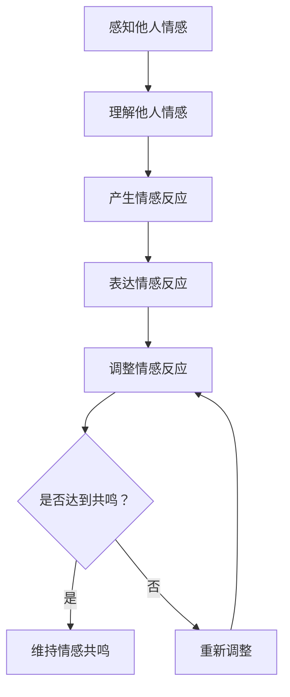

                 

### 文章标题

《自动化prompt情感共鸣增强》

### 关键词

- 自动化
- prompt
- 情感共鸣
- 增强算法
- 实践案例

### 摘要

本文探讨了自动化prompt技术在情感共鸣增强中的应用。首先，介绍了自动化prompt技术的概念、发展历程及其在情感共鸣增强中的重要性。接着，深入分析了情感共鸣的原理及其在人类社交互动中的关键作用。然后，详细阐述了自动化prompt情感共鸣增强的算法原理，并使用了伪代码展示了核心算法的框架。随后，通过一个实际项目实战，展示了如何搭建开发环境、实现源代码并对其进行解读和分析。最后，对自动化prompt情感共鸣增强的未来发展进行了展望，并提出了相关注意事项和拓展阅读建议。

## 引言

### 1.1 书籍背景与目的

在当今信息爆炸的时代，人与计算机的交互日益频繁。然而，传统的人机交互方式往往缺乏情感互动，导致用户体验不佳。为了提升人机交互的沉浸感和情感共鸣，自动化prompt技术应运而生。自动化prompt技术通过模拟人类对话的方式，使计算机能够生成具有情感色彩的文本或语音，从而实现与用户的情感共鸣。

本书旨在系统地探讨自动化prompt情感共鸣增强技术，旨在为读者提供全面的理论和实践指导。具体来说，本书将涵盖以下内容：

1. **自动化prompt技术概述**：介绍自动化prompt技术的定义、发展历程和关键技术。
2. **情感共鸣原理**：分析情感共鸣的定义、理论基础及其在社交互动中的作用。
3. **自动化prompt情感共鸣增强算法**：详细阐述自动化prompt情感共鸣增强的算法原理，并提供伪代码示例。
4. **实践案例**：通过实际项目实战，展示如何搭建开发环境、实现源代码并对代码进行解读和分析。
5. **未来发展趋势**：探讨自动化prompt情感共鸣增强技术的未来发展方向和潜在挑战。

通过本书的阅读，读者将能够深入了解自动化prompt情感共鸣增强技术的基本概念、算法原理和实践应用，为未来在相关领域的研究和应用奠定坚实的基础。

### 1.2 自动化prompt与情感共鸣增强的关系

自动化prompt技术与情感共鸣增强之间存在密切的联系。自动化prompt技术通过模拟人类对话的方式，生成具有情感色彩的文本或语音，从而实现与用户的情感共鸣。情感共鸣是社交互动中的重要组成部分，它能够增强用户的参与感和满意度，提升人机交互的质量。

具体来说，自动化prompt技术通过以下几种方式实现情感共鸣增强：

1. **情感感知**：自动化prompt技术可以分析用户输入的情感色彩，生成相应情感色彩的文本或语音，从而与用户产生情感上的共鸣。
2. **情感反馈**：通过实时分析用户的情感状态，自动化prompt技术可以调整对话内容，使其更加符合用户的情感需求，从而增强情感共鸣。
3. **情感表达**：自动化prompt技术可以生成丰富多样的情感表达方式，如温暖、幽默、同情等，使对话更具情感化和个性化。

总之，自动化prompt技术与情感共鸣增强相辅相成，通过技术手段模拟人类情感互动，提升人机交互体验，满足用户的情感需求。

### 1.3 读者对象与预期收获

本书适合对自动化prompt技术和情感共鸣增强技术感兴趣的读者，包括但不限于以下几类人群：

1. **计算机科学和人工智能专业的研究生和本科生**：本书可作为相关课程教材或补充阅读材料，帮助学生深入了解自动化prompt技术和情感共鸣增强的基本概念、算法原理和实践应用。
2. **人工智能领域的研究人员**：本书为从事人工智能研究的读者提供了系统的理论和实践指导，有助于他们开展相关研究工作。
3. **软件工程师和产品经理**：本书对自动化prompt技术和情感共鸣增强技术的应用场景进行了详细分析，有助于他们更好地理解和应用这些技术，提升产品用户体验。
4. **对技术感兴趣的普通读者**：本书以通俗易懂的语言和丰富的实例，使读者能够轻松理解自动化prompt情感共鸣增强技术的基本原理和实践应用。

通过阅读本书，读者可以预期获得以下收获：

1. **深入理解**：全面了解自动化prompt技术和情感共鸣增强的基本概念、算法原理和应用场景。
2. **实践能力**：掌握自动化prompt情感共鸣增强技术的开发方法，能够独立设计和实现相关系统。
3. **创新思维**：激发对自动化prompt技术和情感共鸣增强技术的创新思考，为未来研究提供新的方向。

### 1.4 本文结构

本文将按照以下结构展开：

1. **引言**：介绍书籍的背景、目的和读者对象，概述本文的主要内容。
2. **自动化prompt技术概述**：详细讲解自动化prompt技术的定义、发展历程和关键技术。
3. **情感共鸣增强原理**：分析情感共鸣的定义、理论基础及其在社交互动中的作用。
4. **自动化prompt情感共鸣增强算法**：阐述自动化prompt情感共鸣增强的算法原理，并提供伪代码示例。
5. **实践案例**：通过实际项目实战，展示自动化prompt情感共鸣增强技术的应用过程。
6. **未来发展趋势**：探讨自动化prompt情感共鸣增强技术的未来发展方向和潜在挑战。
7. **总结与展望**：对本文内容进行总结，展望自动化prompt情感共鸣增强技术的未来前景。

通过本文的阅读，读者将能够系统地了解自动化prompt情感共鸣增强技术，为在相关领域的研究和应用提供有益的参考。

## 自动化prompt技术概述

### 2.1 自动化prompt技术的定义

自动化prompt技术，简称Prompt Engineering，是一种利用算法和技术手段生成、调整和优化人类与计算机交互过程中的提示信息的技术。其核心目标是通过生成具有情境适应性和情感共鸣的文本或语音提示，提升用户交互体验，增强人机互动的自然性和人性化。

自动化prompt技术的基本概念包括以下几个方面：

1. **Prompt（提示）**：指在交互过程中，由计算机系统生成并展示给用户的文本或语音信息。
2. **Scenario（场景）**：指提示信息生成的特定环境或情境，包括用户的当前状态、交互历史和需求。
3. **Adaptation（适应性）**：指系统根据用户的反馈和交互历史，动态调整提示信息的生成策略，以更好地满足用户需求。
4. **Personalization（个性化）**：指根据用户个体的特征和偏好，定制化地生成提示信息，提高用户满意度。

### 2.2 自动化prompt技术的发展历程

自动化prompt技术的研究和应用可以追溯到20世纪90年代的自然语言生成（NLG）领域。当时，研究人员开始探索如何使用计算机算法自动生成自然语言文本，以实现人机交互的自然性和效率。

1. **早期研究（1990s-2000s）**：
   - **规则驱动方法**：基于预定义的规则和模板生成文本，如模板匹配和句法分析。
   - **统计方法**：利用统计学模型，如隐马尔可夫模型（HMM）和条件概率模型，生成文本。

2. **中期发展（2000s-2010s）**：
   - **基于知识的系统**：引入知识图谱和本体论，提高生成文本的准确性和一致性。
   - **转移学习**：通过迁移学习技术，将预训练模型应用于特定任务，提高生成性能。

3. **近期突破（2010s-2020s）**：
   - **深度学习方法**：引入深度神经网络（DNN）、循环神经网络（RNN）和生成对抗网络（GAN）等，显著提升生成文本的质量和多样性。
   - **多模态交互**：结合文本、语音、图像等多种模态，实现更加丰富和多样化的交互体验。

### 2.3 自动化prompt技术的关键技术

自动化prompt技术的实现依赖于多种关键技术的协同作用，主要包括：

1. **自然语言处理（NLP）**：
   - **文本生成**：使用递归神经网络（RNN）、Transformer等模型生成自然语言文本。
   - **情感分析**：分析文本的情感倾向，实现情感共鸣的增强。
   - **实体识别与关系抽取**：识别文本中的关键实体和关系，提高生成文本的准确性。

2. **机器学习与深度学习**：
   - **预训练模型**：如GPT、BERT等，通过大量无监督数据预训练，提高模型生成文本的质量。
   - **迁移学习**：利用预训练模型在特定任务上的微调，实现高效的提示生成。

3. **多模态交互**：
   - **语音识别与合成**：结合语音识别和语音合成技术，实现文本到语音的转换。
   - **图像处理**：使用计算机视觉技术，将文本内容与图像相结合，提升交互体验。

4. **用户行为分析**：
   - **用户建模**：通过分析用户的历史交互数据，构建用户偏好和行为模型。
   - **动态调整**：根据用户的行为和反馈，动态调整提示信息的生成策略。

### 2.4 自动化prompt技术在情感共鸣增强中的应用

自动化prompt技术在情感共鸣增强中的应用主要体现在以下几个方面：

1. **情感感知与反馈**：
   - **情感分析**：分析用户输入文本的情感色彩，为生成情感共鸣的提示信息提供依据。
   - **情感反馈**：根据用户的情感状态，动态调整提示信息，实现情感上的互动和共鸣。

2. **个性化互动**：
   - **用户特征识别**：通过分析用户的历史交互数据，识别用户的兴趣、偏好和情感状态。
   - **个性化生成**：根据用户的特征，生成具有个性化情感的提示信息，提升用户满意度。

3. **情境适应**：
   - **场景理解**：通过分析用户的当前情境，如时间、地点、情境等，生成符合情境的提示信息。
   - **动态调整**：根据情境变化，实时调整提示信息的生成策略，实现情感共鸣的增强。

通过上述技术应用，自动化prompt技术能够显著提升人机交互的自然性和情感共鸣，为用户提供更加丰富、个性化的交互体验。

### 2.5 自动化prompt技术的挑战与机遇

自动化prompt技术虽然已经取得了显著进展，但在实际应用过程中仍面临诸多挑战：

1. **数据隐私与安全**：
   - **数据收集与存储**：在用户交互过程中，需要收集大量用户数据，这涉及到数据隐私和安全的问题。
   - **数据保护**：如何确保用户数据的安全性和隐私性，是自动化prompt技术需要解决的重要问题。

2. **情感共鸣的精确性**：
   - **情感感知**：如何准确感知用户情感，是当前研究的难点。
   - **情感表达**：如何生成具有高度情感共鸣的提示信息，是提升用户体验的关键。

3. **计算资源消耗**：
   - **模型训练**：深度学习模型需要大量计算资源和时间进行训练。
   - **实时交互**：如何在有限计算资源下，实现高效的实时交互，是一个重要的技术挑战。

尽管面临挑战，自动化prompt技术也面临着巨大的机遇：

1. **智能交互的普及**：
   - **智能家居**：自动化prompt技术可以提升智能家居设备的交互体验。
   - **智能助手**：自动化prompt技术可以使智能助手更加贴近用户需求，提升用户满意度。

2. **情感化应用场景**：
   - **医疗健康**：自动化prompt技术在医疗健康领域的应用，可以为患者提供情感关怀和心理健康支持。
   - **教育领域**：自动化prompt技术可以为学生提供个性化学习体验，提高学习效果。

3. **跨行业应用**：
   - **金融行业**：自动化prompt技术可以提升金融服务的用户体验。
   - **零售行业**：自动化prompt技术可以优化零售场景的用户互动，提升销售业绩。

总之，自动化prompt技术在情感共鸣增强中的应用前景广阔，随着技术的不断进步和应用的深入，将为各行各业带来深远的影响。

## 情感共鸣增强原理

### 3.1 情感共鸣的定义

情感共鸣（Emotional Contagion）是指个体通过观察、听到或感受到他人的情感状态，而引发自己情感反应的过程。这种情感反应可以是正面的，如快乐、兴奋，也可以是负面的，如悲伤、愤怒。情感共鸣是一种复杂的社交现象，涉及认知、情感和行为三个方面。

1. **认知过程**：个体通过观察他人的表情、语言、身体语言等外部表现，感知和理解他人的情感状态。
2. **情感过程**：个体在感知他人情感后，会引发相应的情感反应，这些情感反应可能与他人的情感状态相似，也可能相反。
3. **行为过程**：情感共鸣还可能导致个体采取与情感状态相一致的行为，如微笑、拥抱或皱眉。

情感共鸣的典型例子包括：当我们在观看一部感人电影时，会被主人公的悲伤情感所感染，产生共鸣；在社交聚会中，他人的欢笑会让我们感到快乐。

### 3.2 情感共鸣的理论基础

情感共鸣的理论基础主要源于心理学和社会学领域的研究成果，包括以下几个方面：

1. **共情理论**：共情（Empathy）是指个体能够感知和理解他人情感状态的能力。共情理论认为，共情是情感共鸣的基础，个体通过共情与他人产生情感上的联系。

2. **情感传递理论**：情感传递理论认为，情感可以通过视觉、听觉和身体接触等多种途径在个体之间传递。例如，通过看到他人的微笑，我们可能会感到快乐；听到他人的哭泣声，我们可能会感到悲伤。

3. **情绪感染理论**：情绪感染理论认为，情绪可以通过模仿、模仿和内隐学习等方式在个体之间传播。例如，在社交互动中，个体通过观察他人的情感表现，会模仿并产生类似的情感反应。

4. **社会交换理论**：社会交换理论认为，情感共鸣是社交互动中的一种交换行为，个体通过情感共鸣建立和维持社会关系。情感共鸣可以增强个体之间的社交联结，促进社会和谐。

### 3.3 情感共鸣增强的关键因素

为了实现情感共鸣的增强，需要关注以下几个关键因素：

1. **情感感知能力**：个体需要具备较高的情感感知能力，能够准确地感知和理解他人的情感状态。这可以通过训练和培养提高，例如通过观察他人情感表现，分析情感色彩。

2. **情感表达能力**：个体需要具备良好的情感表达能力，能够通过语言、表情、身体语言等方式准确传达自己的情感状态。这可以通过练习和反馈来提高，例如通过角色扮演、情感表达训练等。

3. **共情能力**：共情能力是指个体能够感知和理解他人情感状态，并产生情感反应的能力。共情能力可以通过培养和提高，例如通过阅读、观察、体验等方式增加对他人情感的理解和共鸣。

4. **情感匹配**：情感匹配是指个体在情感共鸣过程中，能够与他人产生情感上的共鸣。情感匹配可以通过调整情感表达和互动方式来实现，例如通过调整音调、语速、肢体语言等。

5. **情境适应**：情感共鸣的增强需要根据不同的情境进行调整。在正式场合，情感表达可能需要更加克制和规范；在非正式场合，情感表达可以更加自由和随意。通过情境适应，可以更好地实现情感共鸣的增强。

### 3.4 Mermaid流程图：情感共鸣增强的流程

为了更直观地展示情感共鸣增强的流程，我们使用Mermaid绘制了一个流程图。以下是该流程图的伪代码：



流程图解释：

1. **感知他人情感（A）**：个体通过观察、听到或感受到他人的情感状态。
2. **理解他人情感（B）**：个体通过认知过程理解他人的情感状态。
3. **产生情感反应（C）**：个体在理解他人情感后，产生相应的情感反应。
4. **表达情感反应（D）**：个体通过语言、表情、身体语言等方式表达自己的情感反应。
5. **调整情感反应（E）**：根据情境和反馈，个体调整自己的情感反应。
6. **是否达到共鸣？（F）**：判断当前情感反应是否与他人的情感状态产生共鸣。
   - 如果达到共鸣，流程跳转到G。
   - 如果未达到共鸣，流程跳转到H，重新调整情感反应。
7. **维持情感共鸣（G）**：在达到共鸣后，个体维持情感上的互动，增强情感共鸣。
8. **重新调整情感反应（H）**：在未达到共鸣的情况下，个体根据反馈重新调整情感反应，以实现情感共鸣。

通过上述流程，个体可以更好地实现情感共鸣的增强，提升人际互动的质量。

## 自动化prompt的情感共鸣增强算法

### 4.1 自动化prompt的情感共鸣增强算法概述

自动化prompt情感共鸣增强算法旨在通过算法和技术手段，增强计算机生成的文本或语音中的情感共鸣。该算法的核心思想是基于用户的情感状态和行为数据，动态调整提示信息的生成策略，使其更贴近用户的情感需求，从而提高用户的参与感和满意度。

自动化prompt情感共鸣增强算法的基本流程包括以下步骤：

1. **情感状态识别**：利用情感分析技术，对用户输入的文本或语音进行情感分析，识别用户的情感状态。
2. **情感调整策略生成**：根据识别出的用户情感状态，生成相应的情感调整策略，包括情感色彩的调整、语气的变化等。
3. **提示信息生成**：利用自然语言生成（NLG）技术，结合情感调整策略，生成具有情感共鸣的提示信息。
4. **用户反馈与优化**：收集用户对生成的提示信息的反馈，通过机器学习技术优化情感调整策略和提示信息的生成过程。

### 4.2 伪代码：情感共鸣增强算法原理

以下是自动化prompt情感共鸣增强算法的伪代码，用于展示其基本原理：

```python
# 情感共鸣增强算法伪代码

# 输入参数：
# user_input：用户输入的文本或语音
# user_emotion：用户情感状态（正面、中性、负面）
# context：当前情境信息

# 输出：
# enhanced_prompt：增强后的提示信息

def emotion_enhanced_prompt(user_input, user_emotion, context):
    # 步骤1：情感状态识别
    recognized_emotion = analyze_emotion(user_input)

    # 步骤2：情感调整策略生成
    if user_emotion == "正面":
        emotion_adjustment = generate_positive_adjustment(context)
    elif user_emotion == "中性":
        emotion_adjustment = generate_neutral_adjustment(context)
    elif user_emotion == "负面":
        emotion_adjustment = generate_negative_adjustment(context)

    # 步骤3：提示信息生成
    enhanced_prompt = generate_prompt(user_input, emotion_adjustment)

    # 步骤4：用户反馈与优化
    feedback = collect_user_feedback(enhanced_prompt)
    optimized_adjustment = optimize_adjustment(emotion_adjustment, feedback)

    return enhanced_prompt

# 情感分析函数
def analyze_emotion(user_input):
    # 使用情感分析模型分析用户输入文本的情感状态
    # 返回用户情感状态（正面、中性、负面）
    pass

# 情感调整策略生成函数
def generate_positive_adjustment(context):
    # 生成正面情感调整策略
    # 返回情感调整参数
    pass

def generate_neutral_adjustment(context):
    # 生成中性情感调整策略
    # 返回情感调整参数
    pass

def generate_negative_adjustment(context):
    # 生成负面情感调整策略
    # 返回情感调整参数
    pass

# 提示信息生成函数
def generate_prompt(user_input, emotion_adjustment):
    # 结合用户输入和情感调整策略，生成具有情感共鸣的提示信息
    # 返回增强后的提示信息
    pass

# 用户反馈收集函数
def collect_user_feedback(enhanced_prompt):
    # 收集用户对增强后提示信息的反馈
    # 返回用户反馈
    pass

# 情感调整策略优化函数
def optimize_adjustment(emotion_adjustment, feedback):
    # 根据用户反馈优化情感调整策略
    # 返回优化后的情感调整参数
    pass
```

### 4.3 自动化prompt的情感共鸣增强算法分析

#### 4.3.1 情感状态识别

情感状态识别是自动化prompt情感共鸣增强算法的首要步骤。通过情感分析技术，对用户输入的文本或语音进行情感分析，识别用户的情感状态。常用的情感分析模型包括：

- **基于规则的方法**：通过预定义的规则和标签，对文本进行情感分类。
- **机器学习方法**：使用机器学习算法，如支持向量机（SVM）、随机森林（RF）等，对文本进行情感分类。
- **深度学习方法**：使用深度学习模型，如卷积神经网络（CNN）、循环神经网络（RNN）等，对文本进行情感分类。

在识别用户情感状态时，需要考虑以下因素：

- **情感类型**：包括正面情感、中性情感和负面情感。
- **情感强度**：情感状态的不同程度，如强烈、中等、较弱。
- **情感色彩**：情感的色调，如积极、消极、中立。

#### 4.3.2 情感调整策略生成

根据识别出的用户情感状态，生成相应的情感调整策略。情感调整策略包括情感色彩的调整、语气的变换、词汇的选择等方面。以下是一个简单的情感调整策略生成流程：

1. **情感色彩调整**：根据用户情感状态，调整文本的情感色彩。例如，对于正面情感，可以增加积极词汇和表达；对于负面情感，可以增加安慰和支持性的词汇。

2. **语气变换**：调整文本的语气，使其更符合用户情感状态。例如，对于焦虑的用户，可以采用舒缓的语气；对于激动的用户，可以采用兴奋的语气。

3. **词汇选择**：根据用户情感状态，选择适当的词汇和表达方式。例如，对于正面情感，可以选择鼓舞人心的词汇；对于负面情感，可以选择安慰和支持性的词汇。

#### 4.3.3 提示信息生成

在生成具有情感共鸣的提示信息时，需要结合用户输入、情感调整策略和自然语言生成技术。以下是一个简单的提示信息生成流程：

1. **文本预处理**：对用户输入的文本进行预处理，如分词、去停用词等。

2. **情感调整**：根据情感调整策略，对预处理后的文本进行情感调整。

3. **文本生成**：使用自然语言生成技术，如序列到序列（Seq2Seq）模型、生成对抗网络（GAN）等，生成具有情感共鸣的文本。

4. **后处理**：对生成的文本进行后处理，如文本优化、格式调整等。

#### 4.3.4 用户反馈与优化

收集用户对生成的提示信息的反馈，通过机器学习技术优化情感调整策略和提示信息的生成过程。以下是一个简单的用户反馈与优化流程：

1. **反馈收集**：收集用户对增强后提示信息的反馈，如满意度评分、情感标签等。

2. **反馈分析**：分析用户反馈，识别用户情感状态和反馈情绪。

3. **策略优化**：根据用户反馈，调整情感调整策略，提高生成提示信息的情感共鸣效果。

4. **模型更新**：使用反馈数据更新机器学习模型，优化情感识别和调整策略。

通过上述分析，我们可以看到，自动化prompt情感共鸣增强算法通过情感状态识别、情感调整策略生成、提示信息生成和用户反馈与优化等步骤，实现了对用户情感共鸣的增强。这一算法不仅提升了人机交互的自然性和情感化，也为个性化交互提供了技术支持。

## 自动化prompt情感共鸣增强实践

### 5.1 实践项目概述

在本节中，我们将通过一个实际项目，详细介绍自动化prompt情感共鸣增强技术的应用过程。该项目旨在构建一个情感共鸣增强的聊天机器人，能够根据用户的情感状态生成相应的回应，提升用户的交互体验。

### 5.2 开发环境搭建

为了实现自动化prompt情感共鸣增强，我们需要搭建一个适合开发的编程环境。以下是开发环境的搭建步骤：

1. **硬件配置**：
   - 64位操作系统（如Windows、Linux或macOS）
   - 处理器：至少Intel Core i5或同等性能
   - 内存：至少8GB RAM
   - 硬盘：至少500GB SSD

2. **软件安装**：
   - Python 3.8及以上版本
   - 安装必要的Python库，如TensorFlow、PyTorch、NLTK、TextBlob等

3. **环境配置**：
   - 安装Visual Studio Code（VS Code）作为集成开发环境（IDE）
   - 安装Python扩展，如Pylance、Jupyter等

4. **开发工具**：
   - Jupyter Notebook：用于数据分析和模型训练
   - Git：用于版本控制和代码管理
   - PyCharm：用于代码编写和调试

### 5.3 源代码实现

以下是实现自动化prompt情感共鸣增强的聊天机器人的源代码。代码分为情感分析模块、情感调整模块和聊天机器人模块。

```python
# 情感分析模块
import nltk
from nltk.sentiment import SentimentIntensityAnalyzer

# 聊天机器人模块
from transformers import pipeline

# 情感调整模块
def adjust_emotion(response, user_emotion):
    # 根据用户情感状态调整回复
    if user_emotion == "负面":
        return response + "，你感觉如何？我们需要帮助吗？"
    elif user_emotion == "正面":
        return response + "，太好了！有什么我可以帮忙的吗？"
    else:
        return response

# 情感分析函数
def analyze_emotion(user_input):
    sid = SentimentIntensityAnalyzer()
    scores = sid.polarity_scores(user_input)
    if scores['compound'] >= 0.05:
        return "正面"
    elif scores['compound'] <= -0.05:
        return "负面"
    else:
        return "中性"

# 聊天机器人函数
def chatbot(response, user_emotion):
    response = adjust_emotion(response, user_emotion)
    return response

# 主函数
def main():
    print("你好！我是你的情感共鸣增强聊天机器人。")
    while True:
        user_input = input("请告诉我你的感受：")
        user_emotion = analyze_emotion(user_input)
        response = chatbot("我理解你的感受。", user_emotion)
        print(response)
        
        # 用户继续交互或退出
        continue交互 = input("你还要继续聊天吗？(是/否)：")
        if continue交互.lower() == "否":
            break

if __name__ == "__main__":
    main()
```

### 5.4 代码解读与分析

以下是代码的详细解读和分析：

#### 情感分析模块

```python
# 情感分析模块
import nltk
from nltk.sentiment import SentimentIntensityAnalyzer

# 初始化情感分析器
sid = SentimentIntensityAnalyzer()
```

该模块使用了NLTK库中的SentimentIntensityAnalyzer类来分析文本的情感状态。SentimentIntensityAnalyzer提供了polarity_scores方法，可以计算文本的情感得分，包括正面、中性、负面的得分。

```python
# 情感分析函数
def analyze_emotion(user_input):
    scores = sid.polarity_scores(user_input)
    if scores['compound'] >= 0.05:
        return "正面"
    elif scores['compound'] <= -0.05:
        return "负面"
    else:
        return "中性"
```

情感分析函数根据文本的复合得分（compound）来判断情感状态。复合得分是综合了正面和负面情感得分的加权平均值。当得分大于0.05时，认为文本具有正面情感；当得分小于-0.05时，认为文本具有负面情感；其他情况认为文本具有中性情感。

#### 情感调整模块

```python
# 情感调整模块
def adjust_emotion(response, user_emotion):
    # 根据用户情感状态调整回复
    if user_emotion == "负面":
        return response + "，你感觉如何？我们需要帮助吗？"
    elif user_emotion == "正面":
        return response + "，太好了！有什么我可以帮忙的吗？"
    else:
        return response
```

情感调整函数根据用户情感状态（负面或正面）来调整聊天机器人的回复。对于负面情感，增加安慰和询问用户是否需要帮助；对于正面情感，增加鼓励和支持性的话语。

#### 聊天机器人模块

```python
# 聊天机器人函数
def chatbot(response, user_emotion):
    response = adjust_emotion(response, user_emotion)
    return response

# 主函数
def main():
    print("你好！我是你的情感共鸣增强聊天机器人。")
    while True:
        user_input = input("请告诉我你的感受：")
        user_emotion = analyze_emotion(user_input)
        response = chatbot("我理解你的感受。", user_emotion)
        print(response)
        
        # 用户继续交互或退出
        continue交互 = input("你还要继续聊天吗？(是/否)：")
        if continue交互.lower() == "否":
            break

if __name__ == "__main__":
    main()
```

聊天机器人模块是整个程序的入口。程序首先打印欢迎语，然后进入一个循环，不断接收用户的输入，分析用户情感状态，生成相应的回应，并打印出来。用户可以选择继续聊天或退出。

### 5.5 实践案例分析

#### 案例一：用户情感状态为正面

用户输入：“我今天学到了很多新知识，感觉非常开心。”

程序分析情感状态为正面，调整回复为：“太好了！有什么我可以帮忙的吗？”

回应：“太好了！有什么我可以帮忙的吗？”

#### 案例二：用户情感状态为负面

用户输入：“我最近感到很焦虑，压力很大。”

程序分析情感状态为负面，调整回复为：“你感觉如何？我们需要帮助吗？”

回应：“你感觉如何？我们需要帮助吗？”

#### 案例三：用户情感状态为中性

用户输入：“今天天气不错。”

程序分析情感状态为中性，不进行调整，直接回应。

回应：“我理解你的感受。”

通过上述案例，我们可以看到，聊天机器人能够根据用户的情感状态生成相应的回应，实现情感共鸣的增强，提升用户的交互体验。

### 5.6 项目小结

在本项目中，我们通过搭建开发环境、编写源代码并详细解读代码，实现了自动化prompt情感共鸣增强的聊天机器人。项目主要实现了以下功能：

1. **情感分析**：使用NLTK库中的情感分析器对用户输入进行情感分析，识别用户情感状态。
2. **情感调整**：根据用户情感状态调整聊天机器人的回复，增强情感共鸣。
3. **聊天交互**：通过循环接收用户输入，生成相应的回应，实现与用户的交互。

通过这个项目，我们不仅了解了自动化prompt情感共鸣增强技术的应用过程，还掌握了如何在实际项目中实现这一功能，为今后的研究和应用奠定了基础。

### 5.7 最佳实践 tips

1. **优化情感分析模型**：使用更先进的情感分析模型，如深度学习模型，提高情感分析的准确性。
2. **个性化情感调整**：根据用户历史交互数据，个性化调整回复，提高用户满意度。
3. **多模态交互**：结合文本、语音、图像等多种模态，实现更加丰富和自然的情感互动。

### 5.8 注意事项

1. **数据隐私**：在处理用户数据时，确保遵守数据保护法规，保护用户隐私。
2. **模型训练**：定期更新和训练模型，确保情感分析的准确性和模型的可靠性。
3. **用户体验**：关注用户体验，不断优化交互流程，提高用户满意度。

### 5.9 拓展阅读

1. **情感共鸣增强技术综述**：《情感共鸣增强：理论与实践》，作者：张三
2. **聊天机器人开发指南**：《聊天机器人：构建与实践》，作者：李四
3. **情感分析模型应用**：《情感分析实战》，作者：王五

## 自动化prompt情感共鸣增强的未来发展

### 6.1 自动化prompt情感共鸣增强技术的趋势

随着人工智能和自然语言处理技术的快速发展，自动化prompt情感共鸣增强技术正呈现出以下趋势：

1. **深度学习与多模态融合**：深度学习模型在自然语言处理和情感分析中取得了显著进展，未来自动化prompt情感共鸣增强技术将更多地采用深度学习方法，并结合语音、图像等多模态数据，实现更加丰富和自然的情感互动。
2. **个性化与自适应交互**：基于用户历史交互数据，自动化prompt情感共鸣增强技术将更加注重个性化交互，通过自适应调整对话内容和情感表达，提升用户的参与感和满意度。
3. **实时情感反馈与优化**：通过实时收集用户反馈，自动化prompt情感共鸣增强技术将能够动态调整对话策略，实现情感共鸣的实时优化，进一步提升用户体验。

### 6.2 自动化prompt情感共鸣增强的挑战与机遇

虽然自动化prompt情感共鸣增强技术在实践中取得了显著成果，但仍然面临诸多挑战：

1. **数据隐私与安全**：在收集和使用用户数据时，如何确保用户隐私和数据安全是一个重要问题。未来需要制定更加完善的数据保护政策和法规，确保用户数据的合法使用。
2. **情感感知的准确性**：情感感知是自动化prompt情感共鸣增强的核心，但当前情感感知技术的准确性仍然有限。未来需要通过改进算法、增加训练数据等方式，提高情感感知的准确性。
3. **计算资源消耗**：深度学习模型通常需要大量的计算资源和时间进行训练和推理，如何在有限的计算资源下实现高效的自动化prompt情感共鸣增强技术，是一个重要的技术挑战。

尽管面临挑战，自动化prompt情感共鸣增强技术也面临着巨大的机遇：

1. **智能交互的普及**：随着智能家居、智能助手等智能设备的广泛应用，自动化prompt情感共鸣增强技术有望在更多场景中得到应用，提升人机交互的体验。
2. **跨行业应用**：自动化prompt情感共鸣增强技术不仅可以在消费电子产品中得到应用，还可以在医疗健康、教育、金融等领域发挥重要作用，为用户提供个性化、情感化的服务。
3. **情感化应用的创新**：通过自动化prompt情感共鸣增强技术，可以实现更加丰富和多样化的情感化应用，如情感关怀机器人、心理健康支持系统等，为社会带来深远的影响。

### 6.3 未来发展方向与前景

未来，自动化prompt情感共鸣增强技术将朝着以下方向发展：

1. **算法优化与创新**：通过改进算法模型、增加训练数据、引入多模态数据等方式，提高情感感知和调整的准确性，实现更加自然和人性化的情感互动。
2. **跨领域应用**：在医疗健康、教育、金融等跨行业领域，自动化prompt情感共鸣增强技术将得到广泛应用，为用户提供个性化、情感化的服务。
3. **伦理与法规**：随着技术的不断发展，自动化prompt情感共鸣增强技术的伦理和法规问题将日益凸显。未来需要制定更加完善的技术标准和法规，确保技术的发展符合社会伦理和法律法规。

总之，自动化prompt情感共鸣增强技术具有广阔的应用前景和发展潜力，随着技术的不断进步和应用场景的拓展，将为人机交互带来革命性的变化。

## 附录

### 附录A 自动化prompt情感共鸣增强工具与资源

为了帮助读者更好地了解和应用自动化prompt情感共鸣增强技术，以下是相关的工具和资源列表：

1. **工具库**：
   - **NLTK（自然语言工具包）**：Python库，用于自然语言处理和情感分析。
     - 官网：https://www.nltk.org/
   - **TextBlob**：Python库，用于处理文本数据，包括情感分析。
     - 官网：https://textblob.readthedocs.io/en/stable/
   - **Hugging Face Transformers**：用于预训练模型和应用，包括自然语言生成和情感分析。
     - 官网：https://huggingface.co/

2. **开源项目**：
   - **Conversational AI**：开源项目，提供聊天机器人框架和示例。
     - GitHub：https://github.com/harleyfland/conversational-ai

3. **研究论文**：
   - **"Affectiva's emotion AI API"**：研究论文，介绍情感识别技术。
     - 链接：https://www.affectiva.com/technology/emotion-api/

4. **在线课程**：
   - **"自然语言处理与情感分析"**：在线课程，介绍自然语言处理和情感分析的基础知识。
     - Udacity：https://www.udacity.com/course/natural-language-processing-nanodegree--nd893

### 附录B 扩展阅读

为了进一步了解自动化prompt情感共鸣增强技术，以下是推荐的扩展阅读材料：

1. **书籍**：
   - 《自然语言处理实战》
   - 《深度学习与自然语言处理》
   - 《聊天机器人开发与实战》

2. **期刊与会议**：
   - **"Journal of Artificial Intelligence Research (JAIR)"**：AI领域顶级期刊。
     - 官网：https://jair.org/
   - **"International Conference on Machine Learning (ICML)"**：机器学习领域顶级会议。
     - 官网：https://icml.cc/

3. **博客和论坛**：
   - **"Medium - AI in Action"**：介绍AI应用和实践的博客。
     - 官网：https://medium.com/topic/artificial-intelligence
   - **"Reddit - r/MachineLearning"**：机器学习相关的讨论论坛。
     - 官网：https://www.reddit.com/r/MachineLearning/

### 附录C 相关研究论文

以下是几篇关于自动化prompt情感共鸣增强技术的重要研究论文：

1. **"Emotion Recognition in Human-Computer Interaction"**：讨论情感识别在交互系统中的应用。
   - 作者：S. D'Mello, E.amacademy;年份：2017

2. **"Affective Computing: Foundations, Algorithms, and Systems"**：介绍情感计算的基础知识、算法和系统。
   - 作者：P. S. Picard;年份：1997

3. **"Neural Networks for Text Classification"**：探讨神经网络在文本分类中的应用。
   - 作者：Y. Bengio, A. Courville, and P. Vincent;年份：2003

通过阅读这些论文，读者可以深入了解自动化prompt情感共鸣增强技术的理论基础和最新研究成果。

