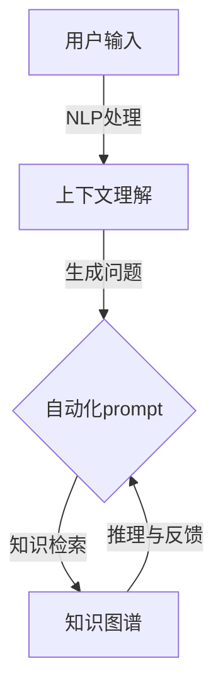
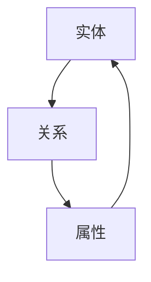
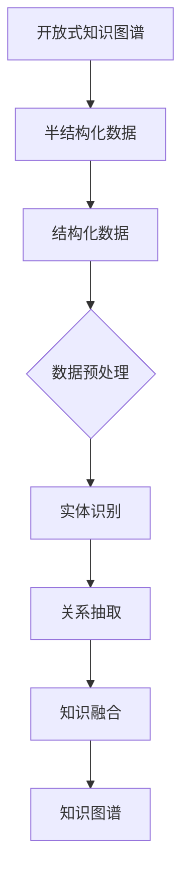
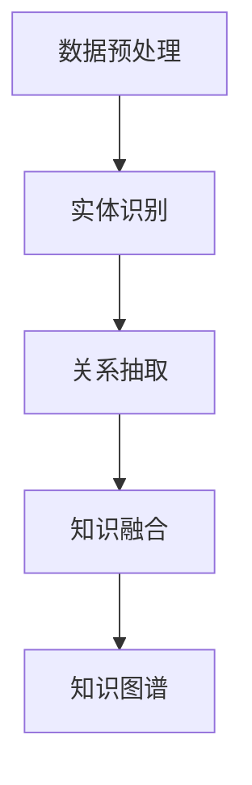
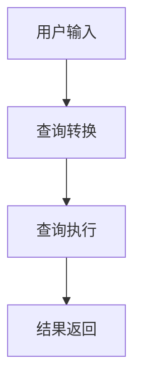
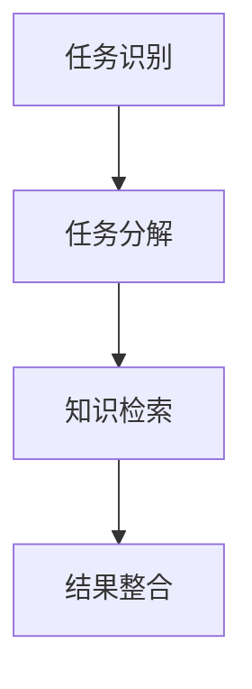
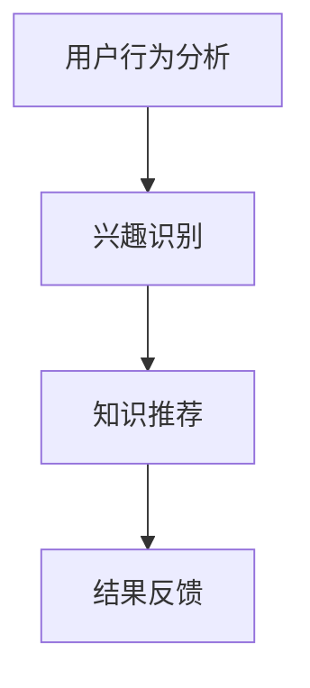

                 

### 第1章 引言

#### 1.1 自动化prompt与知识图谱的概念

自动化prompt是指通过算法自动生成问题或指令，以提高人与系统交互的效率。它能够根据用户的输入或者上下文环境，智能地提出相关的问题或者建议。而知识图谱是一种用于结构化知识的数据模型，通过节点表示实体，边表示实体之间的关系，构建一个大规模的知识网络。

#### 1.1.1 自动化prompt的定义

自动化prompt旨在解决以下问题：

- **交互效率**：用户在搜索、问答或推荐等场景中，能够快速得到有效的反馈。
- **个性化**：根据用户的兴趣和行为，提供个性化的内容推荐。

在技术实现上，自动化prompt通常包含以下步骤：

1. **理解上下文**：通过自然语言处理（NLP）技术，理解用户的输入或上下文。
2. **生成问题**：根据上下文和业务逻辑，生成相关的问题或指令。
3. **交互反馈**：收集用户反馈，优化后续的交互。

#### 1.1.2 知识图谱的基本概念

知识图谱的关键概念包括：

- **实体（Entity）**：现实世界中的对象，如人、地点、事物等。
- **关系（Relation）**：实体之间的关系，如“属于”、“位于”等。
- **属性（Property）**：实体的特征，如年龄、身高、颜色等。

知识图谱的核心功能是：

- **信息检索**：通过实体和关系，快速检索相关信息。
- **知识推理**：基于实体和关系，进行逻辑推理和推断。

#### 1.1.3 自动化prompt与知识图谱的关系

自动化prompt与知识图谱之间存在密切的关系：

- **知识支撑**：知识图谱为自动化prompt提供了丰富的背景知识和上下文信息。
- **互动性增强**：自动化prompt能够更好地利用知识图谱中的信息，提高交互的智能性和个性。

**Mermaid 流程图**



#### 1.2 自动化prompt在应用中的价值

自动化prompt在多个领域展现出了显著的价值：

- **搜索**：通过智能提问，提升搜索结果的准确性和相关性。
- **问答系统**：提供更加自然和高效的问答体验。
- **推荐系统**：基于用户行为和偏好，提供个性化的推荐。

**小结**

自动化prompt与知识图谱的结合，不仅提升了人与系统的交互效率，还为各个应用领域带来了创新的解决方案。在接下来的章节中，我们将深入探讨自动化prompt的设计与生成、知识图谱的构建与应用，以及两者的融合与创新。

---

### 第2章 自动化prompt的设计与生成

#### 2.1 自动化prompt的设计原则

设计自动化prompt时，应遵循以下原则：

- **适应性**：prompt需要能够适应不同的上下文和场景。
- **自然性**：prompt应尽量接近自然语言，易于用户理解。
- **明确性**：prompt应清晰明确，避免歧义。
- **灵活性**：prompt设计应考虑扩展性和维护性，便于后续优化。

#### 2.1.1 提问策略

提问策略包括：

- **引导性提问**：引导用户进一步提供信息，如“您想要搜索什么？”
- **确认性提问**：确认用户的需求，如“您是想了解关于人工智能的最新进展吗？”
- **开放式提问**：激发用户的思考和讨论，如“您对未来的AI有何期待？”

#### 2.1.2 语境建模

语境建模是设计自动化prompt的关键环节，包括：

- **实体识别**：识别上下文中的关键实体，如人、地点、事物等。
- **关系抽取**：抽取实体之间的关系，如“属于”、“位于”等。
- **上下文理解**：综合实体和关系，理解上下文的含义。

#### 2.1.3 数据预处理

数据预处理包括：

- **文本清洗**：去除无关信息，如HTML标签、停用词等。
- **词向量表示**：将文本转换为词向量，便于模型处理。
- **实体关系抽取**：利用NLP技术，提取文本中的实体和关系。

**核心算法原理讲解**

假设我们使用基于模板的自动化prompt生成方法，其核心算法原理如下：

```python
def generate_prompt(context, template):
    # 步骤1：实体识别和关系抽取
    entities, relations = extract_entities_and_relations(context)

    # 步骤2：根据模板和实体关系生成prompt
    prompt = template.format(*entities, **relations)

    return prompt
```

**数学模型和公式**

在语境建模中，可以使用图神经网络（Graph Neural Network, GNN）进行实体关系抽取。GNN的数学模型可以表示为：

$$
h_{t+1}^{(l)} = \sigma \left( \tilde{A}^{(l)} h^{(l)}_t + \sum_{i \in \mathcal{N}(j)} W_{ji} h^{(l)}_t \right)
$$

其中，$h_t^{(l)}$ 表示第 $l$ 层的节点特征向量，$\tilde{A}^{(l)}$ 是第 $l$ 层的邻接矩阵，$W_{ji}$ 是连接权重。

**举例说明**

假设我们有以下上下文和模板：

- **上下文**：“人工智能技术的发展对于未来的社会有何影响？”
- **模板**：“您对{{实体}}的{{关系}}有何看法？”

生成的prompt为：“您对人工智能技术的发展对于未来的社会有何影响的看法？”

#### 2.2 自动化prompt的生成方法

自动化prompt的生成方法主要分为以下几类：

- **基于规则的方法**：根据预设的规则和模板生成prompt。
- **基于机器学习的方法**：利用机器学习模型，从大量数据中学习生成prompt的规律。
- **基于深度学习的方法**：使用深度神经网络，如循环神经网络（RNN）、变换器（Transformer）等，生成prompt。

**基于规则的方法**

- **优势**：实现简单，可控性强。
- **劣势**：灵活性较差，难以应对复杂场景。

**伪代码**

```python
def generate_prompt_based_on_rules(context, rules):
    for rule in rules:
        if matches(context, rule.condition):
            return rule.template.format(*context.entities, **context.relations)
    return None
```

**基于机器学习的方法**

- **优势**：能够处理复杂场景，自适应性强。
- **劣势**：需要大量训练数据和计算资源。

**伪代码**

```python
def generate_prompt_based_on_ml(context, model):
    inputs = convert_context_to_inputs(context)
    prompt = model.predict(inputs)
    return prompt
```

**基于深度学习的方法**

- **优势**：处理长距离依赖，生成复杂prompt。
- **劣势**：实现复杂，计算资源需求高。

**伪代码**

```python
def generate_prompt_based_on_dnn(context, model):
    inputs = convert_context_to_inputs(context)
    prompt = model(inputs)
    return prompt
```

#### 2.3 自动化prompt的评估与优化

自动化prompt的评估与优化是确保其质量和效果的重要环节。评估指标包括：

- **准确性**：生成的prompt是否与用户需求匹配。
- **自然性**：生成的prompt是否符合自然语言规范。
- **有效性**：生成的prompt是否能够提高交互效率。

优化策略包括：

- **数据增强**：增加训练数据，提高模型泛化能力。
- **模型调优**：调整模型参数，优化生成效果。
- **反馈机制**：收集用户反馈，迭代优化prompt生成。

**总结**

自动化prompt的设计与生成是一个复杂的过程，涉及多方面的技术和算法。通过合理的提问策略、语境建模和数据预处理，结合不同的生成方法，可以有效地提高自动化prompt的质量和效果。

---

### 第3章 知识图谱的构建

#### 3.1 知识图谱的基本结构

知识图谱的基本结构由实体（Entity）、关系（Relation）和属性（Property）组成。

- **实体**：知识图谱中的基本元素，代表现实世界中的对象，如人、地点、事物等。
- **关系**：实体之间的关联，如“属于”、“位于”等，用于描述实体之间的语义关系。
- **属性**：实体的特征或属性，如“年龄”、“身高”、“颜色”等，用于补充实体的详细信息。

**Mermaid 流程图**



#### 3.2 知识图谱的数据来源

知识图谱的数据来源主要包括以下几类：

- **开放式知识图谱**：如DBpedia、Yago等，提供丰富的公共知识资源。
- **半结构化数据**：如HTML文档、XML数据等，通过解析和抽取获取知识。
- **结构化数据**：如关系数据库、NoSQL数据库等，通过查询和提取获取知识。

**Mermaid 流程图**



#### 3.3 知识图谱的构建流程

知识图谱的构建流程通常包括以下步骤：

1. **数据预处理**：清洗和格式化数据，去除噪声和冗余信息。
2. **实体识别**：识别数据中的关键实体，如人、地点、事物等。
3. **关系抽取**：抽取实体之间的关系，如“属于”、“位于”等。
4. **知识融合**：将抽取的实体和关系整合到知识图谱中，进行知识融合。

**Mermaid 流程图**



#### 3.3.1 数据预处理

数据预处理是知识图谱构建的基础步骤，主要包括以下任务：

- **文本清洗**：去除HTML标签、停用词、特殊字符等。
- **分词**：将文本分解为词或短语。
- **词性标注**：标记每个词的词性，如名词、动词等。
- **实体识别**：识别文本中的关键实体。

**伪代码**

```python
def preprocess_data(data):
    data = remove_html_tags(data)
    data = remove_stopwords(data)
    data = tokenize(data)
    data = annotate_words(data)
    entities = extract_entities(data)
    return entities
```

#### 3.3.2 实体识别

实体识别是从非结构化文本中识别出关键实体，如人名、地名、组织机构名等。常用的方法包括：

- **规则方法**：基于预定义的规则进行实体识别。
- **机器学习方法**：使用机器学习模型，如分类器、序列标注模型等。
- **深度学习方法**：使用深度学习模型，如卷积神经网络（CNN）、循环神经网络（RNN）等。

**伪代码**

```python
def extract_entities(text, model):
    tokens = tokenize(text)
    entities = model.predict(tokens)
    return entities
```

#### 3.3.3 关系抽取

关系抽取是从实体序列中抽取实体之间的关系，如“属于”、“位于”等。常用的方法包括：

- **基于规则的方法**：使用预定义的规则进行关系抽取。
- **基于统计的方法**：使用统计模型，如条件随机场（CRF）进行关系抽取。
- **基于机器学习的方法**：使用机器学习模型，如支持向量机（SVM）、随机森林（RF）等进行关系抽取。

**伪代码**

```python
def extract_relations(entities, model):
    relations = model.predict(entities)
    return relations
```

#### 3.3.4 知识融合

知识融合是将抽取的实体和关系整合到知识图谱中，形成结构化的知识网络。知识融合的关键技术包括：

- **实体链接**：将文本中的实体与知识图谱中的实体进行映射。
- **关系推理**：基于实体和关系，进行逻辑推理和推断，构建更加丰富的知识网络。

**伪代码**

```python
def fuse_knowledge(entities, relations, graph):
    for entity in entities:
        graph.add_entity(entity)
    for relation in relations:
        graph.add_relation(relation)
    graph.fuse_entities_and_relations()
    return graph
```

**总结**

知识图谱的构建是一个复杂的过程，涉及多方面的技术和算法。通过数据预处理、实体识别、关系抽取和知识融合，可以构建出结构化的知识网络，为自动化prompt提供丰富的知识支撑。

---

### 第4章 知识图谱的查询与推理

#### 4.1 知识图谱的查询

知识图谱的查询是用户获取知识的一种方式，可以分为以下几种类型：

- **检索式查询**：用户输入关键词或问题，系统返回与输入相关的知识。
- **面向任务的查询**：系统根据用户的任务需求，自动检索相关知识点。
- **面向用户的查询**：系统根据用户的兴趣和行为，主动推荐相关知识点。

#### 4.1.1 检索式查询

检索式查询是最常见的一种查询方式，其流程如下：

1. **用户输入**：用户输入关键词或问题。
2. **查询转换**：将用户输入转换为知识图谱中的查询语句。
3. **查询执行**：在知识图谱中执行查询，获取结果。
4. **结果返回**：将查询结果返回给用户。

**Mermaid 流程图**



#### 4.1.2 面向任务的查询

面向任务的查询是系统根据用户的任务需求，自动检索相关知识点。其流程如下：

1. **任务识别**：系统识别用户的任务需求。
2. **任务分解**：将任务分解为多个子任务。
3. **知识检索**：根据子任务，检索相关的知识点。
4. **结果整合**：整合检索结果，生成完整的任务解决方案。

**Mermaid 流程图**



#### 4.1.3 面向用户的查询

面向用户的查询是系统根据用户的兴趣和行为，主动推荐相关知识点。其流程如下：

1. **用户行为分析**：系统分析用户的历史行为和兴趣。
2. **兴趣识别**：根据用户行为，识别用户的兴趣点。
3. **知识推荐**：根据用户兴趣，推荐相关的知识点。
4. **结果反馈**：将推荐结果返回给用户。

**Mermaid 流程图**



#### 4.2 知识图谱的推理

知识图谱的推理是基于知识图谱中的实体和关系，进行逻辑推理和推断。推理可以分为以下几种类型：

- **基于规则的推理**：使用预定义的规则，对知识图谱中的实体和关系进行推理。
- **基于图论的推理**：使用图论方法，对知识图谱进行推理。
- **基于逻辑的推理**：使用逻辑推理方法，对知识图谱进行推理。

##### 4.2.1 基于规则的推理

基于规则的推理是通过预定义的规则，对知识图谱中的实体和关系进行推理。其流程如下：

1. **规则库构建**：构建包含各种推理规则的规则库。
2. **规则匹配**：在知识图谱中寻找与规则匹配的实体和关系。
3. **推理结果生成**：根据规则，生成推理结果。

**伪代码**

```python
def rule_based_reasoning(knowledge_graph, rule_library):
    results = []
    for rule in rule_library:
        if matches(knowledge_graph, rule):
            results.append(rule.apply(knowledge_graph))
    return results
```

##### 4.2.2 基于图论的推理

基于图论的推理是通过图论方法，对知识图谱进行推理。其核心思想是利用图的结构和算法，进行推理。常见的方法包括：

- **路径搜索**：在知识图谱中寻找满足条件的路径。
- **图遍历**：遍历知识图谱，寻找满足条件的子图。

**伪代码**

```python
def graph_theoretic_reasoning(knowledge_graph, condition):
    results = []
    for node in knowledge_graph.nodes:
        if satisfies(node, condition):
            results.append(node)
    return results
```

##### 4.2.3 基于逻辑的推理

基于逻辑的推理是通过逻辑推理方法，对知识图谱进行推理。其核心思想是基于逻辑表达式，进行推理。常见的方法包括：

- **谓词逻辑推理**：基于谓词逻辑，对知识图谱中的实体和关系进行推理。
- **模态逻辑推理**：基于模态逻辑，对知识图谱进行推理。

**伪代码**

```python
def logical_reasoning(knowledge_graph, logic_expression):
    results = []
    for statement in logic_expression:
        if satisfies(knowledge_graph, statement):
            results.append(statement)
    return results
```

**总结**

知识图谱的查询与推理是获取知识的重要手段。通过检索式查询、面向任务的查询和面向用户的查询，用户可以方便地获取所需知识。同时，基于规则的推理、基于图论的推理和基于逻辑的推理，可以进一步丰富知识图谱的应用场景。

---

### 第5章 自动化prompt与知识图谱的融合

#### 5.1 自动化prompt在知识图谱查询中的应用

自动化prompt在知识图谱查询中发挥着重要作用，其主要应用包括：

- **查询优化**：通过智能提问，引导用户更精确地表达查询需求，从而提高查询效率。
- **查询结果解释**：解释查询结果的相关性，帮助用户理解查询结果的含义。
- **查询式交互**：通过与用户的交互，逐步细化查询需求，获取更准确的信息。

**案例**

以搜索引擎为例，当用户输入一个模糊的查询请求时，系统可以通过自动化prompt引导用户进一步明确查询内容：

1. **用户输入**：“苹果”。
2. **查询优化**：系统提出问题：“您是想了解水果苹果的信息，还是苹果公司的新闻？”。
3. **查询执行**：根据用户的选择，执行相应的查询操作。
4. **查询结果解释**：解释查询结果的相关性，如：“以下是关于苹果公司的新闻，请您查看”。

通过这样的交互，用户能够更快速地获取所需信息。

#### 5.2 自动化prompt在知识图谱推理中的应用

自动化prompt在知识图谱推理中的应用同样重要，其主要应用包括：

- **推理策略**：根据用户需求和知识图谱的结构，选择合适的推理策略。
- **推理结果解释**：解释推理结果，帮助用户理解推理过程和结果。
- **推理式交互**：通过与用户的交互，逐步揭示推理过程，提高推理的透明性和可解释性。

**案例**

以问答系统为例，当用户提出一个复杂的问题时，系统可以通过自动化prompt引导用户逐步细化问题：

1. **用户输入**：“北京的首都是哪个国家？”。
2. **推理策略**：系统提出问题：“您是想了解北京的城市信息，还是国家的首都？”。
3. **推理执行**：根据用户的选择，执行相应的推理操作。
4. **推理结果解释**：解释推理结果：“根据知识图谱，北京是中国的首都，所以答案是：中国”。

通过这样的交互，用户能够更好地理解答案的来源和推理过程。

**小结**

自动化prompt与知识图谱的融合，不仅提升了知识检索和推理的效率，还提高了用户与系统的交互质量。通过查询优化、查询结果解释和推理式交互，用户能够更加便捷地获取所需信息，同时也使得知识图谱的应用更加广泛和深入。

---

### 第6章 自动化prompt知识图谱应用案例分析

#### 6.1 搜索引擎中的自动化prompt知识图谱

**6.1.1 应用场景**

在搜索引擎中，自动化prompt知识图谱可以用于提升搜索体验，主要包括：

- **查询优化**：通过智能提问，引导用户更精确地表达查询需求。
- **推荐搜索词**：根据用户的搜索历史和偏好，推荐相关搜索词。
- **搜索结果解释**：解释搜索结果的相关性，提高用户对搜索结果的信任度。

**6.1.2 实现原理**

搜索引擎中的自动化prompt知识图谱主要包括以下组件：

1. **知识图谱构建**：构建包含实体、关系和属性的丰富知识图谱。
2. **查询处理模块**：处理用户输入的查询请求，生成自动化prompt。
3. **推荐引擎**：根据用户行为和知识图谱，推荐相关搜索词。

**6.1.3 案例分析**

以Google搜索引擎为例，当用户输入一个模糊的查询请求时，Google会通过自动化prompt知识图谱进行以下操作：

1. **用户输入**：“苹果”。
2. **查询处理**：系统生成问题：“您是想了解水果苹果的信息，还是苹果公司的新闻？”。
3. **查询执行**：根据用户的选择，执行相应的查询操作。
4. **推荐搜索词**：系统推荐相关的搜索词，如“苹果手机”、“苹果股票”等。
5. **搜索结果解释**：系统解释搜索结果的相关性，如：“以下是关于苹果公司的新闻，根据您的搜索历史，我们推荐这些相关内容”。

通过这样的交互，用户能够更快速、准确地获取所需信息，提升了搜索体验。

**6.1.4 项目小结**

搜索引擎中的自动化prompt知识图谱有效提升了搜索体验，通过查询优化、推荐搜索词和搜索结果解释，使得用户能够更加便捷地获取信息。未来，随着知识图谱和人工智能技术的发展，自动化prompt在搜索引擎中的应用将更加广泛和深入。

#### 6.2 问答系统中的自动化prompt知识图谱

**6.2.1 应用场景**

在问答系统中，自动化prompt知识图谱可以用于提升问答质量，主要包括：

- **问题理解**：通过智能提问，帮助用户更精确地表达问题。
- **答案推荐**：根据知识图谱中的信息，推荐相关答案。
- **答案解释**：解释答案的来源和依据，提高用户对答案的信任度。

**6.2.2 实现原理**

问答系统中的自动化prompt知识图谱主要包括以下组件：

1. **知识图谱构建**：构建包含实体、关系和属性的丰富知识图谱。
2. **问题处理模块**：处理用户输入的问题，生成自动化prompt。
3. **答案推荐引擎**：根据用户问题和知识图谱，推荐相关答案。

**6.2.3 案例分析**

以Siri为例，当用户提出一个复杂的问题时，Siri会通过自动化prompt知识图谱进行以下操作：

1. **用户输入**：“今天天气怎么样？”。
2. **问题处理**：系统生成问题：“您是想了解哪个城市的天气？”。
3. **答案推荐**：系统推荐相关答案，如：“今天北京的天气是晴天，温度在15°C到25°C之间”。
4. **答案解释**：系统解释答案的来源和依据：“这个答案是根据您所在位置的天气数据生成的”。

通过这样的交互，用户能够更轻松地获取准确、详细的答案。

**6.2.4 项目小结**

问答系统中的自动化prompt知识图谱有效提升了问答质量，通过问题理解、答案推荐和答案解释，使得用户能够更加便捷地获取信息。未来，随着知识图谱和人工智能技术的不断发展，自动化prompt在问答系统中的应用将更加广泛和深入。

#### 6.3 推荐系统中的自动化prompt知识图谱

**6.3.1 应用场景**

在推荐系统中，自动化prompt知识图谱可以用于提升推荐效果，主要包括：

- **用户兴趣挖掘**：通过智能提问，挖掘用户的潜在兴趣。
- **推荐内容解释**：解释推荐内容的依据和相关性，提高用户对推荐内容的信任度。
- **个性化推荐**：根据用户兴趣和知识图谱，生成个性化的推荐。

**6.3.2 实现原理**

推荐系统中的自动化prompt知识图谱主要包括以下组件：

1. **知识图谱构建**：构建包含实体、关系和属性的丰富知识图谱。
2. **用户行为分析**：分析用户的历史行为和兴趣，生成自动化prompt。
3. **推荐算法**：根据用户兴趣和知识图谱，生成个性化的推荐。

**6.3.3 案例分析**

以Amazon为例，当用户浏览商品时，Amazon会通过自动化prompt知识图谱进行以下操作：

1. **用户行为分析**：系统分析用户的浏览记录和购物车信息，生成问题：“您是否对这类商品感兴趣？”。
2. **推荐内容解释**：系统解释推荐内容：“根据您的浏览记录，我们为您推荐了这些商品”。
3. **个性化推荐**：系统推荐相关商品，如：“您可能会喜欢这些商品”。

通过这样的交互，用户能够更轻松地发现感兴趣的商品。

**6.3.4 项目小结**

推荐系统中的自动化prompt知识图谱有效提升了推荐效果，通过用户兴趣挖掘、推荐内容解释和个性化推荐，使得用户能够更加便捷地发现感兴趣的内容。未来，随着知识图谱和人工智能技术的不断发展，自动化prompt在推荐系统中的应用将更加广泛和深入。

---

### 第7章 自动化prompt知识图谱的未来发展趋势

#### 7.1 自动化prompt知识图谱技术的挑战

自动化prompt知识图谱技术的挑战主要集中在以下几个方面：

- **数据质量**：知识图谱的构建依赖于高质量的数据，数据质量直接影响到知识图谱的准确性和可用性。
- **可解释性**：自动化prompt生成的结果往往具有黑箱特性，难以解释其生成过程，这给用户理解和信任带来挑战。
- **安全性问题**：在自动化prompt和知识图谱的应用中，数据泄露和隐私侵犯等问题需要得到有效解决。

#### 7.2 自动化prompt知识图谱的应用前景

尽管面临挑战，自动化prompt知识图谱在未来仍具有广阔的应用前景：

- **智能交互**：通过自动化prompt，实现人与系统的高效、自然交互，提升用户体验。
- **个性化服务**：基于用户兴趣和需求，提供个性化的推荐和服务，满足用户的多样化需求。
- **知识服务**：利用知识图谱，提供丰富的知识检索和推理服务，助力企业和机构的知识管理和利用。

#### 7.3 自动化prompt知识图谱技术的未来发展方向

为了应对挑战和挖掘应用前景，自动化prompt知识图谱技术的未来发展方向包括：

- **多模态知识融合**：结合文本、图像、语音等多种数据类型，构建更加丰富和全面的知识图谱。
- **知识图谱的动态更新**：实现知识图谱的实时更新和迭代，以应对不断变化的知识环境。
- **增强的可解释性**：通过可视化、解释性算法，提高自动化prompt和知识图谱的可解释性，增强用户信任。

**总结**

自动化prompt知识图谱技术正朝着智能化、个性化、动态化和可解释性的方向发展。通过不断的技术创新和应用探索，自动化prompt知识图谱将在未来发挥更加重要的作用，为人类的知识管理和智能服务提供强有力的支持。

---

### 第8章 结论

自动化prompt知识图谱作为人工智能领域的重要技术，通过对信息的智能化处理和推理，为搜索、问答、推荐等应用场景提供了创新的解决方案。本章首先介绍了自动化prompt和知识图谱的基本概念，阐述了它们在应用中的价值，接着详细讨论了自动化prompt的设计与生成、知识图谱的构建与查询推理，以及二者的融合应用。

**自动化prompt的重要性**：

自动化prompt在提高交互效率、实现个性化服务和丰富知识获取方面具有重要意义。通过设计合理的提问策略和语境建模，可以生成高质量的prompt，提高用户与系统的交互体验。

**知识图谱的作用**：

知识图谱为自动化prompt提供了丰富的背景知识和上下文信息，使得生成的prompt更加精准和有用。通过实体、关系和属性的构建，知识图谱能够有效地组织和管理大量信息，支持高效的查询和推理。

**未来展望**：

随着多模态数据的融合、知识图谱的动态更新以及可解释性的提升，自动化prompt知识图谱将在更多的应用场景中发挥重要作用。未来的发展趋势将聚焦于提升系统的智能化水平，实现更加自然和高效的交互。

**总结**：

本书从多个角度探讨了自动化prompt知识图谱的构建与应用，旨在为读者提供一个全面、系统的认识。通过本书的学习，读者可以深入了解自动化prompt和知识图谱的核心技术，掌握相关的方法和工具，为实际项目提供技术支持。同时，本书也提出了未来研究的方向和应用前景，为自动化prompt知识图谱技术的持续发展提供了参考。

**拓展阅读**：

- 《深度学习与知识图谱》
- 《人工智能：一种现代的方法》
- 《大数据时代的数据挖掘：概念与技术》

作者：AI天才研究院/AI Genius Institute & 禅与计算机程序设计艺术 /Zen And The Art of Computer Programming

