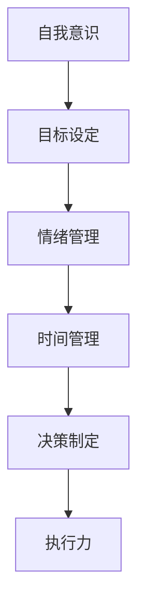
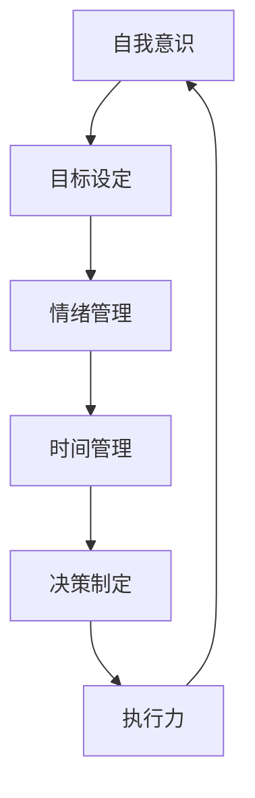

                 

### 文章标题

# 自我管理：优秀领导者的第一步

### 关键词

- 自我管理
- 领导力
- 时间管理
- 决策制定
- 团队协作

### 摘要

自我管理是优秀领导者不可或缺的素质。本文从核心概念、实践方法、挑战应对和领导力发展四个方面，详细探讨了自我管理的原理和实践。通过案例分析、工具介绍以及实际操作，本文旨在帮助读者深入理解自我管理的重要性，并掌握提升自我管理能力的有效策略。

## 第一部分：自我管理的核心概念与原理

### 1.1 自我管理的定义与重要性

自我管理是指个体对自己思想、情感、行为和目标进行有效控制的过程。自我管理的重要性在于，它不仅能提升个人的工作效率和生活质量，还能为团队和组织的发展提供强有力的支持。

#### 1.1.1 自我管理的含义与内涵

自我管理的内涵包括以下几个方面：

- **时间管理**：合理安排时间，提高工作效率。
- **目标设定**：明确个人和团队的目标，并制定实现目标的计划。
- **情绪管理**：调节和控制自己的情绪，保持积极心态。
- **决策制定**：在面对选择时，做出理性、明智的决策。
- **执行力**：将计划付诸行动，实现目标。

#### 1.1.2 自我管理在个人成长中的作用

自我管理在个人成长中具有重要作用。它能够帮助个体：

- **提升自我意识**：认识自己，明确自己的优点和不足。
- **增强自律能力**：养成良好的习惯，克服拖延和懒惰。
- **提高自信心**：通过实现目标，增强自我价值感。

#### 1.1.3 自我管理与领导力的关系

自我管理与领导力密切相关。优秀的领导者必须具备自我管理的能力，才能在团队中发挥领导作用。具体来说，自我管理对领导力的影响体现在：

- **提高领导者的信誉**：通过自我管理，领导者能够树立良好的榜样，赢得下属的尊重和信任。
- **增强领导者的应变能力**：自我管理有助于领导者更好地应对挑战和变化。
- **提升领导者的决策质量**：通过自我管理，领导者能够做出更理性、更有效的决策。

### 1.2 自我管理的基本原则

自我管理的基本原则包括：

- **自我意识**：了解自己的需求、动机和价值观。
- **目标设定**：明确具体、可实现的目标，并制定实现目标的计划。
- **情绪管理**：学会调节情绪，保持积极心态。
- **时间管理**：合理安排时间，提高工作效率。
- **决策制定**：基于事实和逻辑做出决策。

### 1.3 自我管理的关键要素

自我管理的关键要素包括：

- **时间管理**：合理安排时间，提高工作效率。
- **决策制定**：基于事实和逻辑做出决策。
- **沟通与合作**：有效地与他人沟通和合作。

## 第二部分：自我管理实践与案例分析

### 2.1 自我管理实践方法

#### 2.1.1 建立健康的生活习惯

建立健康的生活习惯是自我管理的基础。具体方法包括：

- **规律作息**：保持充足的睡眠，按时起床和休息。
- **合理饮食**：均衡摄入各种营养，避免过度饮酒和吸烟。
- **适量运动**：每天进行适量的运动，保持身体健康。

#### 2.1.2 增强自我激励能力

增强自我激励能力有助于自我管理。具体方法包括：

- **设定小目标**：将大目标分解为小目标，逐步实现。
- **自我奖励**：在实现目标后，给予自己适当的奖励。
- **寻求支持**：与朋友、家人或同事分享自己的目标和进展，获得支持。

#### 2.1.3 提升自我反思能力

提升自我反思能力有助于自我管理。具体方法包括：

- **定期总结**：定期对自己的行为和成果进行总结，找出不足和需要改进的地方。
- **倾听反馈**：接受他人的反馈，了解自己的优点和不足。
- **持续学习**：不断学习新知识，提升自己的能力和素质。

### 2.2 自我管理案例分析

#### 2.2.1 成功领导者的自我管理实践

成功领导者通常具备良好的自我管理能力。以下是一些成功领导者的自我管理实践案例：

- **乔布斯**：注重细节，追求完美，对自己和团队都有极高的要求。
- **杰克·韦尔奇**：善于设定目标，勇于面对挑战，不断推动公司创新。
- **稻盛和夫**：强调员工的自我成长，鼓励员工积极参与企业的发展。

#### 2.2.2 企业文化中的自我管理案例

一些成功的企业文化注重自我管理，鼓励员工自我驱动和自我提升。以下是一些企业文化中的自我管理案例：

- **谷歌**：提供丰富的学习和成长机会，鼓励员工自我驱动和创新。
- **华为**：强调员工的责任感和使命感，鼓励员工为企业发展贡献力量。

#### 2.2.3 团队协作中的自我管理策略

在团队协作中，自我管理策略有助于提高团队效率和协作效果。以下是一些团队协作中的自我管理策略：

- **明确分工**：明确团队成员的职责和任务，确保每个人都能发挥自己的优势。
- **有效沟通**：建立良好的沟通机制，确保信息的有效传递和反馈。
- **共同目标**：设定共同的目标和愿景，激发团队的凝聚力和执行力。

### 2.3 自我管理工具与资源

为了提高自我管理能力，可以借助一些工具和资源。以下是一些自我管理工具和资源的介绍：

- **时间管理工具**：如Trello、Asana、Google Calendar等，帮助合理安排时间。
- **决策制定工具**：如Rationality Manager、Pros and Cons List等，帮助做出理性决策。
- **情绪管理资源**：如冥想应用、心理学书籍等，帮助调节情绪。

## 第三部分：自我管理中的挑战与应对策略

### 3.1 自我管理中的常见挑战

在自我管理过程中，常见挑战包括：

- **焦虑与压力**：面对工作和生活压力，可能导致焦虑和不安。
- **精神健康问题**：如抑郁、焦虑等，可能影响自我管理能力。
- **沟通障碍与冲突**：与他人沟通不畅，可能导致冲突和误解。

### 3.2 应对策略与实践

#### 3.2.1 应对焦虑与压力的策略

应对焦虑与压力的策略包括：

- **深呼吸**：进行深呼吸，缓解紧张情绪。
- **运动**：通过运动释放压力，保持身心健康。
- **休息**：合理安排休息时间，避免过度劳累。

#### 3.2.2 提升精神健康的实践

提升精神健康的实践包括：

- **心理咨询**：寻求专业心理咨询，解决心理问题。
- **自我调节**：学会自我调节，调整心态，积极面对挑战。
- **兴趣爱好**：培养兴趣爱好，丰富生活内容，提高生活质量。

#### 3.2.3 改进沟通与合作的技巧

改进沟通与合作的技巧包括：

- **倾听**：倾听他人的意见和需求，建立良好的沟通基础。
- **表达**：清晰、准确地表达自己的观点和需求。
- **同理心**：站在他人的角度思考问题，增进理解和信任。

## 第四部分：自我管理在领导力发展中的应用

### 4.1 自我管理对领导力的影响

自我管理对领导力的影响包括：

- **提高领导者的自我意识**：领导者通过自我管理，更好地认识自己，提高自我意识。
- **增强领导者的决策能力**：领导者通过自我管理，提高决策质量，做出更明智的决策。
- **提升领导者的团队管理能力**：领导者通过自我管理，更好地激励和引导团队成员，提高团队绩效。

### 4.2 自我管理与团队发展

#### 4.2.1 如何通过自我管理提升团队效率

通过自我管理提升团队效率的方法包括：

- **设定共同目标**：与团队成员共同设定明确的目标和愿景，激发团队活力。
- **有效沟通**：建立良好的沟通机制，确保信息的有效传递和反馈。
- **激励团队成员**：通过自我管理，激发团队成员的积极性和创造力。

#### 4.2.2 团队自我管理实践案例

以下是一些团队自我管理实践案例：

- **谷歌**：谷歌的OKR（目标与关键结果）体系，帮助团队设定明确的目标和关键结果，提高团队效率。
- **华为**：华为的“铁军”文化，强调自我管理，提升团队执行力。

#### 4.2.3 领导者如何引导团队自我管理

领导者引导团队自我管理的策略包括：

- **建立明确的目标和期望**：明确团队的目标和期望，帮助团队成员明确自己的职责和目标。
- **提供支持和资源**：为团队成员提供必要的支持和资源，帮助他们实现自我管理。
- **鼓励反馈和改进**：鼓励团队成员进行自我反馈和改进，提升团队整体能力。

## 附录

### 5.1 自我管理相关的参考资料

以下是一些自我管理相关的参考资料：

- **书籍**：如《自控力》、《高效能人士的七个习惯》等。
- **文章**：如《如何提升自我管理能力》、《自我管理：成功人士的秘密武器》等。
- **网站**：如“LinkedIn”、“知乎”等，提供关于自我管理的专业文章和讨论。
- **社交媒体**：如“Facebook”、“Twitter”等，关注自我管理领域的专家和学者。
- **在线课程**：如“Coursera”、“Udemy”等，提供关于自我管理的在线课程。

以上是关于《自我管理：优秀领导者的第一步》的详细目录大纲和文章内容。文章分为四个主要部分，分别介绍了自我管理的核心概念与原理、实践方法与案例分析、挑战与应对策略以及领导力发展中的应用。通过本文的阅读，读者可以深入理解自我管理的重要性，并掌握提升自我管理能力的有效策略。作者：AI天才研究院/AI Genius Institute & 禅与计算机程序设计艺术/Zen And The Art of Computer Programming。|> 

## 第一部分：自我管理的核心概念与原理

自我管理是指个体对自己思想、情感、行为和目标进行有效控制的过程。它是一种高级的心理和情感技能，能够帮助人们更好地应对生活中的挑战和困难，提高生活质量和工作效率。本部分将深入探讨自我管理的定义、重要性以及核心原则。

### 1.1 自我管理的定义与重要性

#### 1.1.1 自我管理的含义与内涵

自我管理的内涵可以从以下几个方面来理解：

1. **时间管理**：时间管理是自我管理的重要组成部分。它涉及如何合理安排时间，确保在有限的时间内完成更多任务，并保持生活的平衡。时间管理的方法包括制定日程表、设定优先级、避免拖延等。

2. **目标设定**：目标设定是指确定个人和团队的目标，并制定实现这些目标的计划。有效的目标设定可以帮助人们集中精力，提高工作效率，实现个人和团队的发展。

3. **情绪管理**：情绪管理是指调节和控制自己的情绪，保持积极心态。情绪管理的方法包括认知行为疗法、冥想、深呼吸等。

4. **决策制定**：决策制定是指在面对选择时，基于事实和逻辑做出理性、明智的决策。有效的决策制定可以帮助人们减少错误，提高成功率。

5. **执行力**：执行力是指将计划付诸行动，实现目标的能力。良好的执行力可以帮助人们克服拖延，确保计划的顺利实施。

#### 1.1.2 自我管理在个人成长中的作用

自我管理在个人成长中具有重要作用。它能够帮助人们：

1. **提升自我意识**：通过自我管理，人们可以更好地认识自己，了解自己的优点和不足，从而更好地发展自己。

2. **增强自律能力**：自我管理要求人们自律，养成良好的习惯，克服拖延和懒惰。这种自律能力可以帮助人们在面对挑战时保持坚定的决心。

3. **提高自信心**：通过实现目标，人们可以增强自信心，提升自我价值感。

#### 1.1.3 自我管理与领导力的关系

自我管理与领导力密切相关。优秀的领导者必须具备自我管理的能力，才能在团队中发挥领导作用。具体来说，自我管理对领导力的影响体现在：

1. **提高领导者的信誉**：通过自我管理，领导者能够树立良好的榜样，赢得下属的尊重和信任。

2. **增强领导者的应变能力**：自我管理有助于领导者更好地应对挑战和变化。

3. **提升领导者的决策质量**：通过自我管理，领导者能够做出更理性、更有效的决策。

### 1.2 自我管理的基本原则

自我管理的基本原则包括：

1. **自我意识**：自我意识是指对自己内心世界和外部环境的认知。它是自我管理的基础，有助于人们更好地理解自己，做出合适的决策。

2. **目标设定**：目标设定是指确定个人和团队的目标，并制定实现这些目标的计划。有效的目标设定可以帮助人们集中精力，提高工作效率。

3. **情绪管理**：情绪管理是指调节和控制自己的情绪，保持积极心态。情绪管理有助于人们应对压力，保持良好的工作状态。

4. **时间管理**：时间管理是指合理安排时间，确保在有限的时间内完成更多任务。时间管理有助于提高工作效率，减轻工作压力。

5. **决策制定**：决策制定是指在面对选择时，基于事实和逻辑做出理性、明智的决策。决策制定有助于人们减少错误，提高成功率。

### 1.3 自我管理的关键要素

自我管理的关键要素包括：

1. **时间管理**：时间管理是自我管理的重要组成部分。它有助于人们合理安排时间，提高工作效率，实现个人和团队的发展。

2. **决策制定**：决策制定是自我管理的核心能力。它有助于人们在面对选择时做出理性、明智的决策，减少错误，提高成功率。

3. **沟通与合作**：沟通与合作是自我管理的重要组成部分。有效的沟通和合作有助于人们更好地理解他人，实现共同目标。

### 1.4 自我管理的核心概念联系架构

为了更好地理解自我管理的核心概念，我们可以使用Mermaid流程图来展示它们之间的关系。



### 1.5 核心概念与联系：自我管理的核心概念架构

在自我管理的核心概念中，各个概念之间存在着紧密的联系。我们可以通过以下Mermaid流程图来展示这种关系：



在这个流程图中，自我意识作为起点，通过目标设定、情绪管理、时间管理、决策制定和执行力，形成一个闭环，不断循环和优化。

### 1.6 核心算法原理讲解：自我管理的算法模型

为了更好地理解自我管理的算法原理，我们可以使用伪代码来详细阐述其核心算法模型。

```python
# 自我管理算法模型

# 输入：个体特征、环境信息
# 输出：行动方案

def 自我管理算法(个体特征, 环境信息):
    # 步骤1：自我意识评估
    自我意识 = 评估自我意识(个体特征)
    
    # 步骤2：目标设定
    目标 = 设定目标(自我意识, 环境信息)
    
    # 步骤3：情绪管理
    情绪状态 = 管理情绪(情绪状态)
    
    # 步骤4：时间管理
    时间安排 = 管理时间(目标, 情绪状态)
    
    # 步骤5：决策制定
    行动方案 = 制定决策(时间安排, 情绪状态)
    
    # 步骤6：执行力
    执行结果 = 执行行动方案(行动方案)
    
    # 步骤7：反馈与调整
    反馈 = 收集反馈(执行结果)
    个体特征 = 更新自我意识(反馈)
    
    return 行动方案
```

在这个伪代码中，自我管理算法通过评估自我意识、设定目标、管理情绪、时间管理、决策制定和执行力等多个步骤，形成一个闭环，不断优化和调整，以实现自我管理的目标。

### 1.7 数学模型和公式：自我管理的量化分析

为了更好地理解自我管理的量化分析，我们可以使用以下数学模型和公式来描述其关键要素。

#### 时间管理效率

时间管理效率可以用以下公式表示：

$$
效率 = \frac{完成的工作量}{花费的时间}
$$

#### 目标实现率

目标实现率可以用以下公式表示：

$$
实现率 = \frac{实现的目标数}{设定的目标总数}
$$

#### 情绪状态指数

情绪状态指数可以用以下公式表示：

$$
指数 = \frac{积极情绪时间}{总情绪时间}
$$

#### 决策准确性

决策准确性可以用以下公式表示：

$$
准确性 = \frac{正确决策数}{总决策数}
$$

通过这些数学模型和公式，我们可以量化分析自我管理的各个关键要素，从而更好地理解其内在机制。

### 1.8 详细讲解和举例说明

为了更好地理解自我管理的核心概念和原理，我们可以通过具体案例进行详细讲解和举例说明。

#### 案例一：时间管理

假设一位程序员小明，他的工作需要每天完成一定的编程任务。为了提高工作效率，小明采用时间管理的方法，将任务分解为小任务，并为每个任务设定具体的时间安排。通过这种方式，小明成功地提高了工作效率，每天都能按时完成任务。

#### 案例二：目标设定

假设一位创业者小王，他希望通过创业实现财务自由。为了实现这个目标，小王设定了一系列具体的目标，包括：每月收入达到一定数额、积累一定数量的客户等。通过设定这些目标，小王能够清晰地知道自己的发展方向，并不断努力实现这些目标。

#### 案例三：情绪管理

假设一位销售人员小李，他的工作经常面临压力和挑战。为了应对这些压力，小李学会了情绪管理的方法，通过冥想和运动来调节自己的情绪。通过这种方式，小李能够保持积极的心态，更好地应对工作中的挑战。

### 1.9 自我管理在技术团队中的应用

在技术团队中，自我管理对于提升团队效率和项目成功至关重要。以下是一个具体的案例，展示了自我管理在技术团队中的应用。

#### 案例四：技术团队的时间管理与目标设定

假设一个技术团队正在开发一款复杂的软件项目。为了提高团队效率，团队成员采用了以下自我管理策略：

1. **时间管理**：团队成员使用工具如Trello或Asana来管理任务和进度。每个成员为其负责的任务设定具体的时间安排，并定期更新状态。

2. **目标设定**：团队成员共同设定了项目目标，如每周发布一个新版本、解决所有关键Bug等。每个成员为其负责的部分设定了具体的目标和时间表。

3. **情绪管理**：团队定期进行心理健康检查，成员之间互相支持，帮助缓解工作压力。

4. **决策制定**：团队成员在遇到问题或决策时，会进行集体讨论，基于事实和数据做出决策。

通过这些自我管理策略，技术团队能够更好地协调工作，提高工作效率，最终成功完成了项目。

### 1.10 小结

通过本部分的探讨，我们了解了自我管理的核心概念和原理。自我管理不仅对个人成长和领导力发展具有重要意义，而且在技术团队中也有着广泛的应用。掌握自我管理的技巧和方法，能够帮助我们更好地应对生活中的挑战，实现个人和团队的目标。

### 1.11 注意事项

在实施自我管理时，需要注意以下几点：

- **保持灵活性**：自我管理不是一成不变的，需要根据实际情况进行调整。
- **持续学习**：自我管理能力可以通过不断学习和实践来提升。
- **寻求支持**：在自我管理的过程中，可以寻求家人、朋友或专业人士的支持和指导。

### 1.12 拓展阅读

对于希望深入了解自我管理的读者，以下书籍和文章是值得推荐的：

- **书籍**：《高效能人士的七个习惯》、《自控力》
- **文章**：《如何提升自我管理能力》、《自我管理：成功人士的秘密武器》
- **网站**：LinkedIn、知乎等

通过这些拓展阅读，读者可以进一步了解自我管理的理论和实践，提升自我管理能力。

## 第二部分：自我管理实践与案例分析

### 2.1 自我管理实践方法

#### 2.1.1 建立健康的生活习惯

建立健康的生活习惯是自我管理的基础。良好的生活习惯可以帮助我们保持身体和心理健康，提高工作效率和生活质量。以下是一些建立健康生活习惯的方法：

1. **规律作息**：每天保持相同的起床和就寝时间，确保充足的睡眠。

2. **合理饮食**：遵循均衡饮食原则，多吃蔬菜、水果和全谷类食物，少吃油腻和糖分高的食物。

3. **适量运动**：每周至少进行三次运动，如跑步、游泳、瑜伽等，保持身体健康。

4. **保持社交**：与家人、朋友保持良好的社交关系，定期参加社交活动，缓解压力。

#### 2.1.2 增强自我激励能力

增强自我激励能力可以帮助我们更好地应对挑战和困难，保持积极的心态。以下是一些增强自我激励能力的方法：

1. **设定小目标**：将大目标分解为小目标，逐步实现。每个小目标的实现都会带来成就感，增强自我激励能力。

2. **自我奖励**：在实现小目标后，给予自己适当的奖励，如购买喜欢的物品、享受一次美食等。

3. **寻求支持**：与家人、朋友分享自己的目标和进展，获得他们的支持和鼓励。

#### 2.1.3 提升自我反思能力

提升自我反思能力可以帮助我们更好地认识自己，发现自身的优点和不足，从而不断进步。以下是一些提升自我反思能力的方法：

1. **定期总结**：每天或每周进行总结，回顾自己的行为和成果，分析成功和失败的原因。

2. **倾听反馈**：接受他人的反馈，特别是批评和建议，从中吸取经验和教训。

3. **持续学习**：通过阅读书籍、参加课程、听取讲座等方式，不断学习新知识和技能。

### 2.2 自我管理案例分析

#### 2.2.1 成功领导者的自我管理实践

成功领导者通常具备出色的自我管理能力，这使他们能够在压力和挑战面前保持冷静，有效地领导团队。以下是一些成功领导者的自我管理实践案例：

1. **乔布斯**：苹果公司创始人乔布斯以其极致的自我管理能力而闻名。他每天都会花时间冥想，以保持精神集中和情绪稳定。此外，他坚持每天早上7点起床，并保持规律的作息时间。

2. **杰克·韦尔奇**：通用电气前CEO杰克·韦尔奇每天都会花时间进行阅读和思考，以确保自己始终处于行业的前沿。他还会定期与团队成员进行一对一的沟通，了解他们的需求和反馈。

3. **稻盛和夫**：日本企业家稻盛和夫在其自传《活法》中分享了其自我管理的方法。他强调持续的自我反省和感恩的心态，以及通过冥想和静坐来保持内心的平静。

#### 2.2.2 企业文化中的自我管理案例

成功的企业文化往往鼓励员工进行自我管理，这有助于提高员工的工作效率和企业整体的竞争力。以下是一些企业文化中的自我管理案例：

1. **谷歌**：谷歌以其开放、创新的企业文化而著称。谷歌鼓励员工进行自我驱动，通过提供灵活的工作时间和自主项目来激发员工的创造力。

2. **华为**：华为强调员工的责任感和使命感，鼓励员工在工作中不断挑战自己，追求卓越。华为的“艰苦奋斗、自我驱动”的企业文化帮助员工在面对困难和压力时保持积极的心态。

#### 2.2.3 团队协作中的自我管理策略

在团队协作中，自我管理策略有助于提高团队效率和协作效果。以下是一些团队协作中的自我管理策略：

1. **明确分工**：确保每个团队成员都清楚自己的职责和任务，避免工作重复和冲突。

2. **有效沟通**：建立良好的沟通机制，确保信息的及时传递和反馈，避免误解和冲突。

3. **共同目标**：设定共同的目标和愿景，激发团队的凝聚力和执行力。

4. **自我激励**：通过设定小目标和自我奖励，激发团队成员的积极性和创造力。

### 2.3 自我管理工具与资源

为了提高自我管理能力，可以借助一些工具和资源。以下是一些自我管理工具和资源的介绍：

1. **时间管理工具**：如Trello、Asana、Google Calendar等，帮助合理安排时间。

2. **决策制定工具**：如Rationality Manager、Pros and Cons List等，帮助做出理性决策。

3. **情绪管理资源**：如冥想应用、心理学书籍等，帮助调节情绪。

4. **在线课程与培训资源**：如Coursera、Udemy等，提供关于自我管理的在线课程。

通过这些工具和资源，我们可以更有效地进行自我管理，提升个人和团队的工作效率。

### 2.4 自我管理实践案例

#### 2.4.1 案例一：个人项目管理者

小明是一位个人项目管理者，他通过自我管理的方法提高了项目效率。他首先明确了项目目标，并将其分解为可管理的小任务。然后，他使用Trello来跟踪任务进度，确保每个任务都在计划时间内完成。此外，小明每天都会花时间进行自我反思，总结自己的工作，找出需要改进的地方。

#### 2.4.2 案例二：企业家

李女士是一位企业家，她通过自我管理的方法提升了企业的竞争力。她每天都会花时间进行市场研究和竞争对手分析，以确保企业的战略方向正确。此外，她鼓励员工进行自我管理，通过设定目标和提供资源，激发员工的积极性和创造力。李女士还定期与员工进行一对一的沟通，了解他们的需求和反馈。

#### 2.4.3 案例三：技术团队

一个技术团队通过自我管理的策略，成功完成了复杂的软件开发项目。团队成员通过明确分工和有效沟通，确保了项目的高效进行。他们还定期进行技术分享和团队建设活动，提升了团队的凝聚力和技术水平。

### 2.5 小结

通过自我管理实践，我们可以更好地应对生活中的挑战和困难，提升个人和团队的工作效率。建立健康的生活习惯、增强自我激励能力和提升自我反思能力是自我管理的关键。同时，借助自我管理工具和资源，我们可以更有效地进行自我管理。通过具体的案例，我们可以看到自我管理在个人、企业和团队中的应用和效果。

### 2.6 注意事项

在实践自我管理时，需要注意以下几点：

1. **个性化**：自我管理方法应该根据个人的实际情况进行个性化调整。
2. **持续性**：自我管理不是一时的行为，而是一种长期的习惯和生活方式。
3. **灵活性**：在自我管理过程中，要灵活应对变化，适时调整计划和方法。

### 2.7 拓展阅读

对于希望深入了解自我管理的读者，以下书籍和资源是值得推荐的：

- **书籍**：《高效能人士的七个习惯》、《自控力》
- **文章**：《如何提升自我管理能力》、《自我管理：成功人士的秘密武器》
- **网站**：LinkedIn、知乎等
- **在线课程**：Coursera、Udemy等

通过这些拓展阅读，读者可以进一步了解自我管理的理论和实践，提升自我管理能力。

## 第三部分：自我管理中的挑战与应对策略

### 3.1 自我管理中的常见挑战

在自我管理的过程中，人们可能会遇到各种挑战。这些挑战不仅会影响个人的工作效率和生活质量，还可能对团队和组织的发展产生负面影响。以下是自我管理中常见的挑战及其应对策略。

#### 3.1.1 焦虑与压力管理

焦虑和压力是自我管理过程中常见的挑战。长期处于高压力状态可能导致身心健康问题，影响工作表现。以下是一些应对策略：

1. **深呼吸和冥想**：深呼吸和冥想可以帮助人们放松身心，减轻焦虑和压力。可以通过专门的冥想应用程序或在线课程学习冥想技巧。

2. **定期休息和放松**：在忙碌的工作和生活中，定期安排休息和放松时间，如短时间休息、散步、听音乐等，可以帮助缓解压力。

3. **锻炼身体**：适度的锻炼可以释放身体中的压力激素，提高心理健康水平。可以选择跑步、瑜伽、游泳等适合自己身体状况的锻炼方式。

#### 3.1.2 精神健康问题

精神健康问题，如抑郁症、焦虑症等，也可能影响自我管理能力。以下是一些应对策略：

1. **寻求专业帮助**：如果精神健康问题严重，应及时寻求专业心理咨询师的帮助。心理咨询师可以提供专业的治疗和建议。

2. **建立支持系统**：与家人、朋友或同事建立良好的支持系统，分享自己的困扰和感受，获得情感上的支持。

3. **培养兴趣爱好**：通过培养兴趣爱好，如绘画、音乐、运动等，可以转移注意力，减轻精神压力。

#### 3.1.3 沟通障碍与冲突解决

在团队和组织中，沟通障碍和冲突是常见的挑战。有效的沟通和冲突解决能力对于自我管理至关重要。以下是一些应对策略：

1. **倾听和表达**：倾听他人的意见和需求，并清晰、准确地表达自己的观点和需求。良好的沟通是解决冲突的基础。

2. **积极沟通**：在冲突发生时，保持冷静和客观，通过积极的沟通方式解决问题，避免情绪化的争吵。

3. **冲突解决技巧**：学习冲突解决技巧，如寻求妥协、制定共同目标、寻求第三方调解等。

### 3.2 应对策略与实践

#### 3.2.1 应对焦虑与压力的策略

为了更好地应对焦虑和压力，可以采取以下具体策略：

1. **时间管理技巧**：合理安排时间，避免过度工作。使用时间管理工具，如Trello、Asana等，帮助制定和跟踪任务进度。

2. **目标分解**：将大目标分解为小目标，逐步实现。每次完成一个小目标，都会带来成就感，减轻焦虑。

3. **积极心态**：培养积极心态，面对困难和挑战时，保持乐观和自信。

#### 3.2.2 提升精神健康的实践

提升精神健康可以从以下几个方面进行：

1. **心理健康教育**：参加心理健康教育课程或阅读相关书籍，了解心理健康知识，提高自我意识。

2. **情绪管理训练**：通过情绪管理训练，如认知行为疗法、正念冥想等，学会更好地调节情绪。

3. **健康生活方式**：保持健康的生活习惯，如规律作息、合理饮食、适量运动等。

#### 3.2.3 改进沟通与合作的技巧

为了改进沟通与合作的技巧，可以采取以下策略：

1. **沟通培训**：参加沟通技巧培训，学习有效的沟通方法，如积极倾听、非暴力沟通等。

2. **团队合作活动**：通过团队合作活动，如团队建设游戏、头脑风暴等，提高团队成员的沟通与合作能力。

3. **建立反馈机制**：建立有效的反馈机制，鼓励团队成员之间相互反馈，及时解决问题。

### 3.3 案例分析

#### 3.3.1 案例一：焦虑管理

小李是一名软件工程师，他经常感到工作压力很大，容易焦虑。为了应对这个问题，小李采取了一系列措施：

- **时间管理**：他开始使用Trello来管理任务，确保工作进度可控，避免了工作堆积导致的焦虑。
- **运动**：每天晚上都会进行30分钟的慢跑，帮助释放工作压力。
- **冥想**：每周至少进行两次冥想，以平静内心，减轻焦虑。

通过这些措施，小李成功地减轻了焦虑，提高了工作效率。

#### 3.3.2 案例二：精神健康问题

张女士是一名项目经理，由于长期工作压力大，她开始出现抑郁症状。为了应对这个问题，她采取了以下措施：

- **心理咨询**：她定期与心理咨询师进行交流，寻求专业的心理支持。
- **健康生活方式**：她开始保持规律的作息时间，注重饮食健康，每天进行适量的运动。
- **兴趣爱好**：她培养了对绘画的兴趣，通过艺术创作来缓解压力。

通过这些措施，张女士的抑郁症状得到了显著改善，工作效率也得到了提升。

#### 3.3.3 案例三：沟通障碍

在一个团队项目中，团队成员小王和小张因为沟通不畅产生了矛盾。为了解决这个问题，团队成员采取了以下措施：

- **积极沟通**：在产生分歧时，团队成员进行了面对面的沟通，表达了自己的观点和感受。
- **第三方调解**：团队负责人作为第三方调解者，帮助双方找到了共同点，解决了冲突。
- **团队建设活动**：通过团队建设活动，增强了团队成员之间的信任和理解。

通过这些措施，团队内部的沟通障碍得到了有效解决，项目进展顺利。

### 3.4 小结

自我管理中的挑战是多方面的，包括焦虑与压力管理、精神健康问题和沟通障碍。通过合理的应对策略和实践，我们可以有效地应对这些挑战，提升自我管理能力。焦虑和压力可以通过时间管理技巧、运动和冥想等方法来缓解；精神健康问题可以通过心理咨询、健康生活方式和兴趣爱好来改善；沟通障碍可以通过沟通技巧培训、团队合作活动和第三方调解来解决。

### 3.5 注意事项

在应对自我管理中的挑战时，需要注意以下几点：

1. **个性化**：应对策略应该根据个人的实际情况进行个性化调整。
2. **持续性**：应对策略需要持续实践，不能一蹴而就。
3. **灵活性**：在应对挑战时，需要灵活调整策略，以适应不断变化的环境。

### 3.6 拓展阅读

对于希望深入了解自我管理中挑战与应对策略的读者，以下书籍和资源是值得推荐的：

- **书籍**：《焦虑管理》、《自控力》、《非暴力沟通》
- **文章**：在线心理学杂志、专业网站等
- **在线课程**：Coursera、Udemy等

通过这些拓展阅读，读者可以进一步了解自我管理中的挑战与应对策略，提升自我管理能力。

## 第四部分：自我管理在领导力发展中的应用

### 4.1 自我管理对领导力的影响

自我管理在领导力发展中扮演着至关重要的角色。优秀的领导者不仅需要具备出色的技术能力和业务知识，还需要具备自我管理的能力，以便在复杂多变的商业环境中保持清晰的头脑和冷静的态度。以下探讨自我管理对领导力的影响：

#### 4.1.1 自我管理在领导力培养中的作用

1. **自我意识**：领导者通过自我管理，可以更好地认识自己，了解自己的优点和不足。这种自我意识有助于领导者更准确地评估自己的能力和潜力，从而在领导过程中做出更明智的决策。

2. **情绪管理**：领导者需要具备良好的情绪管理能力，以应对工作中的压力和挑战。自我管理技能可以帮助领导者调节自己的情绪，保持积极的心态，从而更好地激励和影响团队成员。

3. **目标设定**：领导者需要明确组织的目标，并制定实现这些目标的计划。自我管理能力有助于领导者设定具体、可衡量的目标，并制定实现这些目标的策略和行动方案。

4. **时间管理**：领导者需要合理安排时间，确保在有限的时间内完成重要的任务。自我管理技能可以帮助领导者有效地分配时间，提高工作效率，确保组织目标的实现。

5. **决策制定**：领导者需要在面对复杂的选择时，做出理性、明智的决策。自我管理能力有助于领导者基于事实和数据做出决策，减少错误，提高决策质量。

6. **执行力**：领导者需要将决策付诸行动，确保计划的顺利实施。自我管理能力可以帮助领导者克服拖延，提高执行力，确保组织目标的实现。

#### 4.1.2 优秀领导者自我管理的特点

优秀领导者通常具备以下自我管理特点：

1. **自我反思**：优秀领导者善于自我反思，从成功和失败中学习经验，不断提升自己的能力和素质。

2. **自律**：优秀领导者能够自律，养成良好的习惯，克服拖延和懒惰，保持高效的工作状态。

3. **自我激励**：优秀领导者具备自我激励能力，能够在困难和挑战面前保持积极的心态，激励自己和团队成员共同前进。

4. **情绪稳定**：优秀领导者具备情绪管理能力，能够保持冷静和理智，应对工作中的压力和挑战。

5. **持续学习**：优秀领导者具备持续学习的能力，不断更新知识和技能，以适应快速变化的市场环境。

#### 4.1.3 自我管理在团队领导中的应用

自我管理在团队领导中的应用主要体现在以下几个方面：

1. **建立榜样**：领导者通过自我管理，树立良好的榜样，激励团队成员学习和效仿。

2. **提高团队效率**：领导者通过自我管理，合理安排时间和资源，提高团队的工作效率。

3. **增强团队凝聚力**：领导者通过自我管理，增强与团队成员的沟通和合作，提高团队的凝聚力。

4. **提升团队学习能力**：领导者通过自我管理，激发团队成员的学习兴趣和动力，提高团队的整体能力。

### 4.2 自我管理与团队发展

自我管理对团队发展具有重要影响。通过自我管理，领导者可以有效地提升团队的效率和绩效，促进团队的发展。以下是一些具体的策略和方法：

#### 4.2.1 如何通过自我管理提升团队效率

1. **明确目标**：领导者需要明确团队的目标，并与团队成员共同制定实现这些目标的计划。

2. **合理分工**：领导者需要根据团队成员的能力和特长，合理分配任务，确保每个人都能发挥自己的优势。

3. **时间管理**：领导者需要合理安排时间，确保团队成员有足够的时间完成自己的任务，同时避免过度加班。

4. **沟通协作**：领导者需要建立良好的沟通机制，确保信息的及时传递和反馈，促进团队成员之间的协作。

5. **激励机制**：领导者需要制定合理的激励机制，激发团队成员的积极性和创造力，提高工作效率。

#### 4.2.2 团队自我管理实践案例

以下是一些团队自我管理的实践案例：

1. **谷歌的OKR体系**：谷歌采用了OKR（目标与关键结果）体系，帮助团队明确目标并制定实现目标的计划。OKR体系通过设定明确的目标和关键结果，确保团队成员专注于最重要的任务，提高团队效率。

2. **华为的“铁军”文化**：华为强调团队自我管理，通过“艰苦奋斗、自我驱动”的文化理念，激发团队成员的积极性和创造力。华为的团队在面临困难和挑战时，通过自我管理，不断提升团队效率和绩效。

3. **企业的团队建设活动**：一些企业通过组织团队建设活动，如拓展训练、团队游戏等，增强团队成员之间的沟通和合作，提高团队自我管理能力。

#### 4.2.3 领导者如何引导团队自我管理

领导者引导团队自我管理的关键在于提供支持和资源，激励团队成员发挥潜力。以下是一些具体的策略：

1. **明确期望和目标**：领导者需要明确团队的期望和目标，并与团队成员进行充分的沟通，确保每个人都清楚自己的职责和目标。

2. **提供培训和发展机会**：领导者需要为团队成员提供培训和发展机会，帮助他们提升自我管理能力和专业素养。

3. **建立反馈机制**：领导者需要建立有效的反馈机制，鼓励团队成员进行自我反思和改进，提高团队整体能力。

4. **鼓励创新和尝试**：领导者需要鼓励团队成员进行创新和尝试，提供支持和资源，帮助团队克服困难和挑战。

5. **建立良好的沟通机制**：领导者需要建立良好的沟通机制，确保团队成员之间的信息传递和反馈，促进团队的协作和自我管理。

### 4.3 小结

自我管理在领导力发展中具有重要作用。通过自我管理，领导者可以提升自我意识、情绪管理、目标设定、时间管理、决策制定和执行力等方面的能力，从而更好地发挥领导作用，推动团队和组织的发展。自我管理不仅有助于领导者自身的成长，还能提升团队的效率和绩效，为团队和组织带来长期的竞争优势。

### 4.4 注意事项

在实施自我管理时，领导者需要注意以下几点：

1. **个性化**：自我管理策略需要根据个人的实际情况进行个性化调整，不能一刀切。
2. **持续性**：自我管理是一个长期的过程，需要持续实践和改进，不能急于求成。
3. **灵活性**：在自我管理过程中，领导者需要灵活应对变化，根据实际情况调整策略。

### 4.5 拓展阅读

对于希望深入了解自我管理与领导力发展的读者，以下书籍和资源是值得推荐的：

- **书籍**：《领导力的五个层次》、《团队协作力》
- **文章**：专业领导力杂志、在线领导力博客等
- **在线课程**：Coursera、Udemy等

通过这些拓展阅读，读者可以进一步了解自我管理与领导力发展的理论和实践，提升自己的领导力水平。|> 

## 附录

### 5.1 自我管理相关的参考资料

#### 5.1.1 推荐书籍与文章

1. **《高效能人士的七个习惯》**：史蒂芬·柯维（Stephen R. Covey）著，这是一本经典的管理书籍，详细介绍了如何通过自我管理来实现个人和职业的成功。

2. **《自控力》**：凯利·麦格尼格尔（Kelly McGonigal）著，这本书通过科学研究，探讨了如何增强自我控制力，提高生活质量和幸福感。

3. **《领导者的影响力》**：约翰·迈耶（John Meyer）和杰克·莱文森（Jack Levinson）著，这本书介绍了领导力的核心要素，包括自我管理、沟通技巧和团队建设等。

4. **《团队协作力》**：本尼斯（W. Bennis）和特伦斯·迪尔（Terrance Deal）著，这本书探讨了如何通过有效的团队合作来提高组织的效率和绩效。

5. **《如何提升自我管理能力》**：该文章提供了实用的自我管理技巧和方法，适用于个人和团队。

#### 5.1.2 专业网站与社交媒体资源

1. **LinkedIn**：LinkedIn是一个专业的社交平台，上面有许多关于自我管理和领导力的专业文章和讨论。

2. **知乎**：知乎是中国最大的知识分享社区，上面有许多关于自我管理和领导力的问题和答案。

3. **领英博客**：领英博客是一个提供专业文章的博客平台，许多行业专家和领导者在这里分享他们的经验和见解。

4. **Twitter**：Twitter上有许多领导力和自我管理的专家和学者，通过关注他们，可以随时获取最新的行业动态和见解。

#### 5.1.3 在线课程与培训资源

1. **Coursera**：Coursera是一个提供大量在线课程的平台，包括自我管理、领导力等方面的课程。

2. **Udemy**：Udemy提供了各种自我管理和领导力相关的在线课程，适合不同层次的学习者。

3. **edX**：edX是一个由多所知名大学提供在线课程的平台，包括一些关于领导力和管理的课程。

4. **MBAx**：MBAx是一个专门提供MBA相关课程的在线平台，包括自我管理和领导力方面的课程。

通过以上参考资料，读者可以进一步深入学习和探索自我管理的理论和实践，提升自我管理能力和领导力水平。

### 5.2 小结

附录部分为读者提供了丰富的自我管理相关的参考资料，包括书籍、文章、专业网站、社交媒体资源和在线课程等。这些资源有助于读者深入理解和实践自我管理，提升自我管理能力和领导力水平。读者可以根据自己的兴趣和需求选择合适的资源进行学习和实践。

### 5.3 注意事项

1. **个性化**：在学习和实践自我管理时，应根据个人实际情况进行个性化调整，不能生搬硬套。

2. **持续性**：自我管理是一个长期的过程，需要持续实践和改进，不能急于求成。

3. **灵活性**：在实施自我管理策略时，应灵活应对变化，根据实际情况进行调整。

### 5.4 拓展阅读

1. **《领导者的影响力》**：约翰·迈耶（John Meyer）和杰克·莱文森（Jack Levinson）

2. **《团队协作力》**：本尼斯（W. Bennis）和特伦斯·迪尔（Terrance Deal）

3. **《如何提升自我管理能力》**：在线文章和教程

4. **LinkedIn**：领英上的专业文章和讨论

5. **Coursera**：自我管理和领导力相关的在线课程

通过以上拓展阅读，读者可以进一步深入学习和探索自我管理和领导力的理论和实践，提升自我管理能力和领导力水平。|> 

