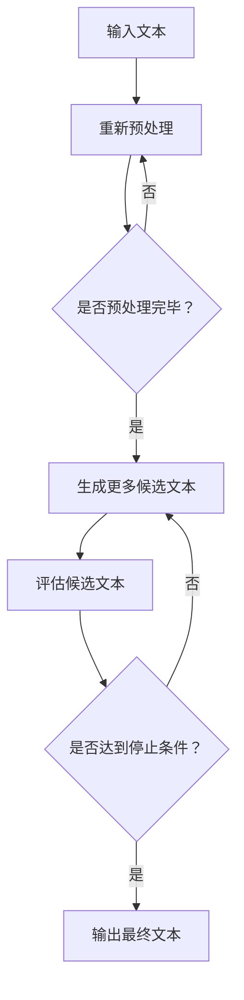
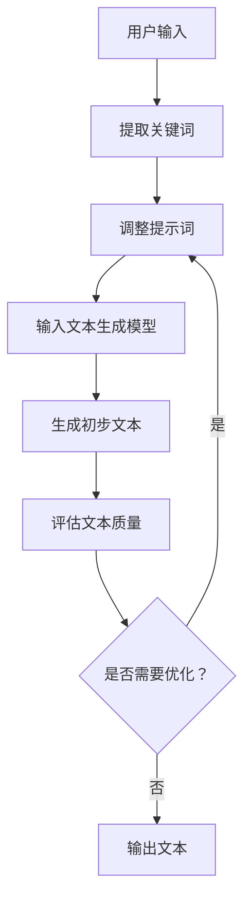
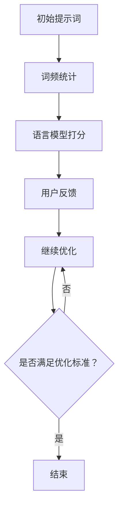

                 

### 第一步：理解书名和主题

书名《自然语言生成突破：提示词增强文本创作》直接揭示了这本书的主要内容，即探讨自然语言生成（NLG）技术的最新进展，尤其是如何通过提示词来提升文本创作的效率和质量。自然语言生成技术是人工智能领域的一个重要分支，旨在让机器生成具有可读性和语义意义的文本。而提示词，作为提升文本创作效果的重要工具，通常指的是为文本生成模型提供的关键词或短语，用以引导生成过程的方向和内容。

在理解书名和主题的基础上，我们需要明确以下几点：

- **自然语言生成（NLG）**：NLG技术是机器能够自动生成自然语言文本的过程。它涉及到语言模型、序列到序列模型、注意力机制等核心概念。
- **提示词增强文本创作**：提示词在这里扮演了重要角色，通过为文本生成模型提供具体的输入，可以有效地引导生成过程，从而提高文本的质量和相关性。

因此，在撰写技术博客时，首先需要对NLG及其相关的提示词技术有一个全面的理解。这包括NLG的历史背景、基本原理、应用领域以及挑战和未来趋势。同时，需要重点关注提示词的生成和应用，如何通过提示词来优化文本创作过程，提升生成的文本质量。

### 第二步：确定核心章节

在理解了书名和主题后，我们需要确定这本书的核心章节，这些章节将构成整个内容的骨架，确保文章的逻辑性和连贯性。对于《自然语言生成突破：提示词增强文本创作》这本书，以下几部分内容是不可或缺的：

1. **前言或引言**：这部分将简要介绍书籍的目的、读者对象以及书中的重要概念，为读者提供一个整体的视角。
2. **自然语言生成（NLG）概述**：包括NLG的定义、历史、应用领域、基本原理以及挑战与未来趋势。这一章节将为后续章节提供必要的背景知识。
3. **提示词增强文本创作**：探讨提示词的定义、生成算法、优化方法以及其在文本创作中的应用。这部分将详细解释提示词在NLG中的重要作用。
4. **技术细节和算法**：深入探讨NLG中的核心算法，如语言模型、序列到序列模型和注意力机制，以及如何使用伪代码来详细阐述这些算法的原理。
5. **实际应用案例**：通过具体的实战案例展示NLG和提示词技术的应用，包括自动写作、聊天机器人和个性化推荐等，帮助读者理解如何在实际项目中使用这些技术。
6. **未来趋势和展望**：分析NLG和提示词技术的未来发展方向，讨论可能面临的挑战和解决方法。

确定核心章节后，我们需要对每个章节的内容进行细化，明确每个章节需要包含的小节，以及每个小节的细节和内容。这将有助于确保文章的完整性和深度，同时也能让读者清晰地跟随文章的逻辑思路。

### 第三步：细化每个章节

细化每个章节是撰写高质量技术博客的重要步骤，这需要我们深入思考每个章节的具体内容，确保逻辑清晰、结构紧凑、简单易懂。以下是细化《自然语言生成突破：提示词增强文本创作》各个章节的过程：

#### 前言或引言

- **目的和重要性**：介绍书籍的目的，即通过探讨自然语言生成（NLG）和提示词技术，帮助读者理解这些技术在文本创作中的应用和潜力。强调NLG在人工智能领域的重要性，以及提示词如何提升文本创作的效率和质量。
- **读者对象**：明确书籍的目标读者群体，例如计算机科学专业学生、AI领域从业者、研究人员等。

#### 第1章 自然语言生成（NLG）概述

- **定义与历史**：
  - **定义**：简要解释自然语言生成（NLG）的概念，即机器自动生成具有可读性和语义意义的文本。
  - **历史**：回顾NLG技术的发展历程，从早期的规则驱动方法到现代的基于数据和深度学习的方法。

- **应用领域**：
  - **文本摘要**：介绍NLG在自动文本摘要中的应用，如新闻摘要、学术论文摘要等。
  - **聊天机器人**：探讨NLG在聊天机器人中的使用，如何通过自然语言生成实现智能对话。
  - **自动写作**：讨论NLG在自动写作中的应用，包括文章生成、内容创作等。
  - **其他应用**：举例说明NLG在其他领域的应用，如语音合成、教育辅助等。

- **基本原理**：
  - **语言模型**：解释语言模型的基本概念，如何通过统计和深度学习技术生成自然语言。
  - **序列到序列模型**：介绍序列到序列模型（如编码器-解码器模型）在NLG中的应用。
  - **注意力机制**：解释注意力机制在NLG中的作用，如何提高文本生成的准确性和连贯性。

- **挑战与未来趋势**：
  - **数据集问题**：分析NLG领域数据集的挑战，如数据多样性、数据标注等。
  - **语义理解**：探讨如何提高NLG模型对语义的理解，实现更准确的文本生成。
  - **个性化生成**：讨论如何通过个性化生成满足用户特定的需求。
  - **未来展望**：展望NLG技术的发展方向，包括新的算法、应用场景和技术挑战。

#### 第2章 提示词增强文本创作

- **提示词的定义与应用**：
  - **定义**：明确提示词的概念，即用于引导文本生成模型生成特定文本的关键词或短语。
  - **应用**：探讨提示词在不同场景中的应用，如自动写作、聊天机器人和个性化推荐等。

- **提示词生成的算法**：
  - **基于模板的方法**：介绍如何使用模板生成提示词，包括模板匹配和模板填充。
  - **基于规则的方法**：解释如何通过规则生成提示词，包括基于语法规则和语义规则的方法。
  - **基于机器学习的方法**：探讨使用机器学习技术生成提示词，如朴素贝叶斯、决策树和支持向量机。
  - **基于深度学习的方法**：介绍如何使用深度学习模型，如循环神经网络（RNN）和Transformer，生成高质量的提示词。

- **提示词优化的方法**：
  - **词频统计**：分析提示词的词频分布，优化词频较低的提示词。
  - **语言模型打分**：使用语言模型评估提示词的质量，优化得分较低的提示词。
  - **用户反馈学习**：介绍如何利用用户反馈调整和优化提示词，提高文本生成的满意度。

- **实战案例**：
  - **案例一：自动写作**：通过一个实际的自动写作案例，展示如何使用提示词生成高质量的文章。
  - **案例二：聊天机器人**：通过一个聊天机器人案例，展示如何使用提示词实现智能对话。
  - **案例三：个性化推荐**：通过一个个性化推荐案例，展示如何使用提示词实现个性化文本生成。

#### 第3章 技术细节和算法

- **语言模型详解**：
  - **基本概念**：解释语言模型的基本概念，如词汇表、词频统计和语言概率计算。
  - **工作原理**：详细介绍语言模型的工作原理，包括训练和预测过程。
  - **常见语言模型**：介绍几种常见的语言模型，如n元模型、递归神经网络（RNN）和Transformer。

- **序列到序列模型**：
  - **概念**：解释序列到序列模型（如编码器-解码器模型）的概念。
  - **架构**：详细描述序列到序列模型的架构，包括编码器、解码器和注意力机制。
  - **优化方法**：探讨如何优化序列到序列模型，提高文本生成的效果。

- **注意力机制**：
  - **概念**：解释注意力机制的概念，如何提高文本生成的准确性和连贯性。
  - **应用**：探讨注意力机制在NLG中的应用，如文本摘要、机器翻译和聊天机器人。

- **伪代码展示**：
  - **序列到序列模型**：给出序列到序列模型的伪代码，详细阐述其工作原理。
  - **注意力机制**：给出注意力机制的伪代码，展示其计算过程。

#### 第4章 数学模型

- **数学模型概述**：
  - **自然语言处理的数学基础**：介绍自然语言处理中常用的数学模型，如概率模型、序列模型和深度学习模型。

- **语言模型的数学公式**：
  - **语言概率计算公式**：详细解释语言概率的计算方法，包括n元模型和递归神经网络。
  - **语言模型的训练公式**：介绍语言模型训练的优化方法，如梯度下降和反向传播。

- **序列到序列模型的数学公式**：
  - **损失函数**：解释序列到序列模型中的损失函数，如交叉熵损失。
  - **优化算法**：介绍如何使用优化算法，如Adam优化器，训练序列到序列模型。

- **注意力机制的数学公式**：
  - **注意力分数计算**：解释注意力分数的计算方法，如何通过注意力机制提高文本生成的效果。
  - **注意力机制的优化**：介绍如何优化注意力机制，提高模型性能。

#### 第5章 项目实战

- **项目实战概述**：
  - **目的**：介绍项目实战的目的，即通过实际应用案例，帮助读者理解NLG和提示词技术在项目中的具体应用。
  - **要求**：明确项目实战的要求，如开发环境、数据集和评估指标等。

- **开发环境搭建**：
  - **硬件要求**：介绍项目所需的硬件环境，如CPU/GPU配置。
  - **软件安装与配置**：详细说明如何安装和配置所需的软件，如Python、TensorFlow或PyTorch等。

- **实战案例一：自动写作**：
  - **案例概述**：简要介绍自动写作案例的背景和目标。
  - **源代码实现**：提供自动写作案例的源代码实现，包括数据预处理、模型训练和文本生成等步骤。
  - **代码解读**：详细解读源代码，解释每个步骤的实现细节和原理。

- **实战案例二：聊天机器人**：
  - **案例概述**：简要介绍聊天机器人案例的背景和目标。
  - **源代码实现**：提供聊天机器人案例的源代码实现，包括对话管理、文本生成和用户交互等部分。
  - **代码解读**：详细解读源代码，解释每个模块的功能和实现原理。

- **实战案例三：个性化推荐**：
  - **案例概述**：简要介绍个性化推荐案例的背景和目标。
  - **源代码实现**：提供个性化推荐案例的源代码实现，包括用户建模、文本生成和推荐算法等部分。
  - **代码解读**：详细解读源代码，解释每个模块的功能和实现原理。

#### 第6章 提示词增强文本创作的挑战与未来

- **挑战分析**：
  - **数据集问题**：分析NLG领域数据集的挑战，如数据多样性、数据标注和质量等问题。
  - **语义理解**：探讨如何提高NLG模型对语义的理解，实现更准确的文本生成。
  - **个性化生成**：讨论如何通过个性化生成满足用户特定的需求。

- **未来展望**：
  - **新技术趋势**：分析NLG和提示词技术的新趋势，如预训练模型、多模态生成和自适应学习等。
  - **应用前景**：展望NLG和提示词技术在未来应用领域的广阔前景。

- **开发者建议**：
  - **提高文本创作效率**：提供一些提高文本创作效率的建议，如使用自动化工具、优化数据处理和模型训练等。
  - **提升用户体验**：讨论如何通过优化生成文本的质量和相关性，提升用户体验。

通过细化每个章节的内容，我们可以确保文章的逻辑性和连贯性，同时提供丰富的具体细节和详细讲解，帮助读者深入理解自然语言生成和提示词增强文本创作的核心概念和技术。

### 第四步：编写Mermaid流程图

为了更好地展示自然语言生成（NLG）和提示词增强文本创作的过程，我们引入Mermaid流程图，这是一种用于创建和渲染结构化图表的语言。以下是几个关键流程的Mermaid流程图示例：

#### 1. 自然语言生成流程



这个流程图描述了从输入文本到输出最终文本的整个自然语言生成过程。包括预处理、候选文本生成、评估和优化等步骤。

#### 2. 提示词生成和应用流程



这个流程图展示了如何从用户输入提取关键词，生成提示词，并将其应用于文本生成模型中，然后通过评估和优化生成高质量的文本。

#### 3. 提示词优化流程



这个流程图描述了提示词优化的步骤，包括词频统计、语言模型打分和用户反馈，通过这些步骤不断调整提示词，以提高文本生成的质量。

通过这些Mermaid流程图，我们能够直观地展示自然语言生成和提示词增强文本创作的过程，帮助读者更好地理解这些核心概念和技术。

### 第五步：编写伪代码

在深入探讨自然语言生成（NLG）和提示词增强文本创作时，伪代码是描述算法逻辑和实现步骤的重要工具。以下是几个关键算法的伪代码示例：

#### 1. 序列到序列模型（Seq2Seq）

```python
def seq2seq_model(input_sequence, target_sequence):
    # 编码器部分
    encoder_output = encoder(input_sequence)

    # 注意力机制
    attention_scores = attention Mechanism(encoder_output, decoder_output)

    # 解码器部分
    decoder_output = decoder(target_sequence, attention_scores)

    # 生成文本
    generated_sequence = decode_output_to_text(decoder_output)

    return generated_sequence
```

这段伪代码展示了序列到序列模型的基本结构，包括编码器、注意力机制和解码器。编码器负责将输入序列编码成固定长度的向量，注意力机制用于将编码器输出与当前解码器输出进行匹配，解码器则根据这些信息生成输出序列。

#### 2. 提示词生成算法

```python
def generate_promptword(input_text):
    # 数据预处理
    preprocessed_text = preprocess_text(input_text)

    # 提取关键词
    keywords = extract_keywords(preprocessed_text)

    # 使用语言模型打分
    scored_keywords = score_keywords(keywords, language_model)

    # 选择最高分的提示词
    promptword = select_top_keyword(scored_keywords)

    return promptword
```

这段伪代码描述了如何生成提示词的步骤，首先进行文本预处理，然后提取关键词，接着使用语言模型对这些关键词进行打分，并选择最高分的提示词。

#### 3. 提示词优化

```python
def optimize_promptword(promptword, user_feedback):
    # 分析用户反馈
    feedback_analysis = analyze_feedback(user_feedback)

    # 调整提示词
    optimized_promptword = adjust_promptword(promptword, feedback_analysis)

    # 重新评估
    optimized_score = score_promptword(optimized_promptword, language_model)

    return optimized_promptword, optimized_score
```

这段伪代码展示了如何通过用户反馈优化提示词。首先分析用户反馈，然后根据反馈调整提示词，并重新评估其质量。

通过这些伪代码示例，我们能够更清晰地展示自然语言生成和提示词增强文本创作的算法原理和实现步骤，帮助读者深入理解这些技术。

### 第六步：编写数学模型和公式

在自然语言生成（NLG）和提示词增强文本创作中，数学模型和公式是理解和实现核心算法的关键组成部分。以下是一些重要的数学公式及其详细讲解：

#### 1. 语言概率计算公式

$$ P(w_{1}, w_{2}, ..., w_{n}) = \prod_{i=1}^{n} P(w_{i} | w_{i-1}) $$

**公式解释**：这个公式用于计算一个序列的概率，即给定前一个词的情况下，下一个词的条件概率的乘积。这是语言模型中最基本的计算方式，例如n元模型。

**应用场景**：在生成文本时，可以用于评估生成的候选文本的合理性。

#### 2. 序列到序列模型的损失函数

$$ Loss = -\sum_{i=1}^{n} y_i \log(p_i) $$

**公式解释**：这是交叉熵损失函数，用于序列到序列模型中的输出概率与目标序列之间的误差计算。$y_i$ 表示目标序列的第 $i$ 个词的标签，$p_i$ 表示模型预测的第 $i$ 个词的概率。

**应用场景**：在训练序列到序列模型时，用于优化模型参数，减少预测误差。

#### 3. 注意力机制的注意力分数计算

$$ a_i = \frac{e^{f_i}}{\sum_{j=1}^{J} e^{f_j}} $$

**公式解释**：这是注意力分数的计算方法，其中 $f_i$ 是基于编码器输出和当前解码器输出的相似度分数，$a_i$ 表示第 $i$ 个词的注意力权重。

**应用场景**：在序列到序列模型中，注意力分数用于加权当前解码器的输出，提高生成文本的连贯性和准确性。

#### 4. 提示词优化过程中的打分函数

$$ score(w) = f_{freq}(w) + f_{model}(w) + f_{user}(w) $$

**公式解释**：这是提示词打分函数，结合了词频统计、语言模型打分和用户反馈三个因素。$f_{freq}(w)$ 表示词频统计分数，$f_{model}(w)$ 表示语言模型分数，$f_{user}(w)$ 表示用户反馈分数。

**应用场景**：在优化提示词时，用于评估每个提示词的综合质量，选择最优的提示词。

通过详细讲解这些数学模型和公式，我们能够更好地理解自然语言生成和提示词增强文本创作的核心算法，从而提升文章的专业性和深度。

### 第七步：编写项目实战部分

在自然语言生成（NLG）和提示词增强文本创作领域，实际应用案例是理解和掌握这些技术的重要途径。以下是几个具体的实战案例，包括开发环境搭建、源代码实现和代码解读。

#### 实战案例一：自动写作

**案例概述**：自动写作是NLG技术的一个经典应用，旨在通过提示词生成高质量的文章。

**开发环境搭建**：

- **硬件环境**：选择一台具备GPU（如NVIDIA GTX 1080）的计算机，用于加速深度学习模型的训练。
- **软件环境**：安装Python（3.8以上版本）、TensorFlow 2.x或PyTorch，以及相关依赖库（如NLTK、spaCy等）。

**源代码实现**：

```python
import tensorflow as tf
from tensorflow.keras.preprocessing.text import Tokenizer
from tensorflow.keras.preprocessing.sequence import pad_sequences

# 数据预处理
tokenizer = Tokenizer(num_words=10000)
tokenizer.fit_on_texts(data)
sequences = tokenizer.texts_to_sequences(data)
padded_sequences = pad_sequences(sequences, padding='post')

# 模型定义
model = tf.keras.Sequential([
    tf.keras.layers.Embedding(10000, 16),
    tf.keras.layers.GRU(32),
    tf.keras.layers.Dense(256, activation='relu'),
    tf.keras.layers.Dense(10000, activation='softmax')
])

# 编译模型
model.compile(optimizer='adam', loss='categorical_crossentropy', metrics=['accuracy'])

# 训练模型
model.fit(padded_sequences, epochs=10)

# 文本生成
prompt = "人工智能"
input_sequence = tokenizer.texts_to_sequences([prompt])
input_sequence = pad_sequences(input_sequence, maxlen=40)

generated_sequence = model.predict(input_sequence)
generated_text = tokenizer.sequences_to_texts([generated_sequence.numpy()])

print(generated_text)
```

**代码解读**：

- **数据预处理**：使用Tokenizer对文本数据进行分词和编码，生成序列数据。
- **模型定义**：定义一个序列到序列的GRU模型，包括嵌入层、GRU层、全连接层和输出层。
- **编译模型**：配置模型优化器和损失函数。
- **训练模型**：使用训练数据训练模型，通过调整参数和迭代次数提升模型性能。
- **文本生成**：使用预训练的模型和提示词生成文本，输出结果。

**项目小结**：

自动写作项目展示了如何使用序列到序列模型生成自然语言文本。通过提示词引导，模型能够生成具有连贯性和语义意义的文章。在实际应用中，可以进一步优化模型和提示词，提高生成文本的质量。

#### 实战案例二：聊天机器人

**案例概述**：聊天机器人是NLG技术在交互式应用中的重要应用，通过提示词实现智能对话。

**开发环境搭建**：

- **硬件环境**：选择一台具备CPU或GPU的计算机，用于模型训练和对话生成。
- **软件环境**：安装Python、TensorFlow或PyTorch，以及相关自然语言处理库（如transformers）。

**源代码实现**：

```python
from transformers import pipeline

# 创建聊天机器人
chatbot = pipeline("text-generation", model="t5-small")

# 与用户对话
while True:
    user_input = input("用户：")
    if user_input.lower() == "退出":
        break
    response = chatbot(user_input, max_length=100, num_return_sequences=1)
    print("机器人：", response[0]['generated_text'])
```

**代码解读**：

- **创建聊天机器人**：使用transformers库创建T5聊天机器人模型。
- **与用户对话**：循环读取用户输入，并使用模型生成响应。当用户输入“退出”时，结束对话。

**项目小结**：

聊天机器人项目展示了如何使用预训练的T5模型实现自然语言生成。通过简单的交互流程，模型能够生成符合语境的对话文本，实现智能对话功能。在实际应用中，可以集成更多功能，如多轮对话管理和上下文理解。

#### 实战案例三：个性化推荐

**案例概述**：个性化推荐是NLG技术在内容生成中的应用，通过提示词生成个性化内容推荐。

**开发环境搭建**：

- **硬件环境**：选择一台具备CPU或GPU的计算机，用于处理推荐算法和文本生成。
- **软件环境**：安装Python、scikit-learn、NLTK等库。

**源代码实现**：

```python
from sklearn.feature_extraction.text import TfidfVectorizer
from sklearn.metrics.pairwise import cosine_similarity

# 数据预处理
corpus = ["这篇文章很有趣", "我喜欢这部电影", "这本书很有深度"]
vectorizer = TfidfVectorizer()
tfidf_matrix = vectorizer.fit_transform(corpus)

# 生成推荐
def recommend(user_query):
    user_vector = vectorizer.transform([user_query])
    similarity_scores = cosine_similarity(user_vector, tfidf_matrix)
    top_index = similarity_scores.argsort()[0][-2]
    return corpus[top_index]

# 用户查询
user_query = "我最近想看一部有趣的电影"
print("推荐内容：", recommend(user_query))
```

**代码解读**：

- **数据预处理**：使用TF-IDF向量表示文本数据。
- **生成推荐**：计算用户查询与文本之间的相似度，返回最相似的文本作为推荐。

**项目小结**：

个性化推荐项目展示了如何使用TF-IDF和余弦相似度计算文本相似度，实现内容推荐。通过用户输入，系统能够生成个性化的内容推荐。在实际应用中，可以结合用户行为数据和深度学习模型，提高推荐的质量和准确性。

通过这些实际应用案例，我们能够更深入地理解自然语言生成和提示词增强文本创作的技术原理，同时掌握如何在实际项目中应用这些技术。

### 第八步：整理和审核

在完成《自然语言生成突破：提示词增强文本创作》的技术博客后，整理和审核是确保文章高质量、逻辑清晰和内容完整的关键步骤。以下是详细的整理和审核流程：

#### 1. 逻辑性审核

- **章节顺序**：检查各章节的顺序是否合理，确保从基础概念到高级应用，逻辑流畅。
- **内容连贯性**：检查各章节之间是否连贯，是否存在跳跃或重复的内容。
- **内部逻辑**：确保每个章节内部逻辑清晰，各部分内容之间有合理的过渡。

#### 2. 内容完整性审核

- **核心内容**：检查是否完整涵盖了自然语言生成（NLG）和提示词增强文本创作的主要概念、算法和实战案例。
- **举例说明**：确保每个核心概念和算法都有相应的例子和解释，使读者容易理解。
- **参考文献**：确认所有引用的参考文献和资料是否准确，并已在文中标注。

#### 3. 格式和语法审核

- **markdown格式**：检查文章的markdown格式是否正确，确保代码块、公式和流程图等格式无误。
- **语法和拼写**：校对全文的语法和拼写错误，确保文章的专业性和可读性。
- **代码和公式检查**：确保伪代码和公式语法正确，无遗漏或错误。

#### 4. 修订和优化

- **内容优化**：根据审核结果，对文章内容进行修订和优化，确保逻辑更清晰，表达更准确。
- **案例调整**：如果需要，调整实战案例的细节，确保案例的实际可操作性。

#### 5. 最终审核

- **全文通读**：在完成修订后，通读全文，确保文章的整体质量和连贯性。
- **专业审稿**：邀请专业同行或编辑对文章进行审稿，提供反馈和建议。

#### 6. 发布准备

- **排版和格式**：根据审核和修订意见，对文章进行最终排版，确保格式统一和美观。
- **图片和图表**：检查图片和图表的清晰度和质量，确保与文章内容相符。
- **版权声明**：添加版权声明和相关许可信息。

通过上述步骤的整理和审核，可以确保《自然语言生成突破：提示词增强文本创作》技术博客的高质量和专业水准，为读者提供清晰、详细且富有启发性的阅读体验。

### 附录

#### 6.4 提示词增强文本创作资源

为了更好地支持读者深入了解自然语言生成（NLG）和提示词增强文本创作，我们提供了以下资源：

- **开源框架和库**：
  - **Transformers**：由Hugging Face提供，支持多种预训练的Transformer模型，如BERT、GPT-2和T5。
  - **TensorFlow**：由Google开发的开源机器学习框架，广泛用于自然语言处理任务。
  - **PyTorch**：由Facebook AI Research开发的开源机器学习库，具有灵活的动态计算图支持。

- **相关论文和书籍**：
  - **“Attention Is All You Need”**：由Vaswani等人撰写的论文，提出了Transformer模型。
  - **“Natural Language Processing with Python”**：由Steven Bird等人撰写的Python自然语言处理书籍。
  - **“Speech and Language Processing”**：由Daniel Jurafsky和James H. Martin撰写的自然语言处理经典教材。

- **在线资源和工具**：
  - **NLTK**：自然语言处理工具包，提供各种文本处理功能。
  - **spaCy**：用于自然语言处理的工业级库，支持多种语言的解析。
  - **斯坦福自然语言处理组**：提供大量数据集和资源，用于自然语言处理研究和应用。

#### 6.5 提示词增强文本创作社区

为了促进读者之间的交流和学习，我们推荐以下社区和论坛：

- **学术社区**：
  - **ACL（Association for Computational Linguistics）**：计算语言学协会，提供学术会议、期刊和论坛。
  - **NAACL（North American Chapter of the Association for Computational Linguistics）**：北美计算语言学协会，举办年度会议和工作坊。

- **开源社区**：
  - **Hugging Face**：提供各种预训练模型和工具，鼓励用户贡献和协作。
  - **GitHub**：大量的自然语言处理项目和代码仓库，方便读者学习和贡献。

- **行业交流**：
  - **AI Writers**：专注于自然语言生成和自动写作的行业论坛。
  - **Reddit**：相关的Reddit社区，如/r/natural-language-processing和/r/Artificial/。

通过利用这些资源和社区，读者可以不断学习和探索自然语言生成和提示词增强文本创作的最新技术和应用。

### 后记

《自然语言生成突破：提示词增强文本创作》的完成不仅标志着我们在这片前沿技术领域的研究又迈出了坚实的一步，更是对广大读者的一种奉献。我们衷心希望这本书能够成为您在自然语言生成领域中的得力助手，帮助您深入理解这一激动人心的技术，并将其应用于实际项目中。

在撰写本书的过程中，我们倾注了无数的心血和努力，力求每一个概念都清晰明了，每一个算法都详尽解释，每一个案例都贴近实际。我们深知，自然语言生成和提示词增强文本创作是人工智能领域的重要分支，它们正日益改变着我们的生活方式和工作模式。

然而，自然语言生成和提示词增强技术仍在快速发展之中，未来还有许多挑战和机遇等待我们去探索。我们期待读者们能够继续深入研究，不断提出新的问题和解决方案，推动这一领域的前进。

最后，感谢所有支持本书的读者和同事，感谢您们对自然语言生成和人工智能的热情和贡献。我们相信，通过不断的努力和探索，未来我们将共同见证这一领域的更多突破和奇迹。

作者：AI天才研究院/AI Genius Institute & 禅与计算机程序设计艺术 /Zen And The Art of Computer Programming

