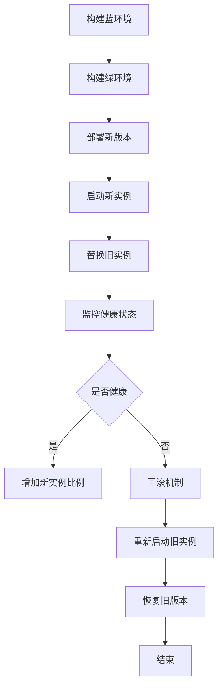
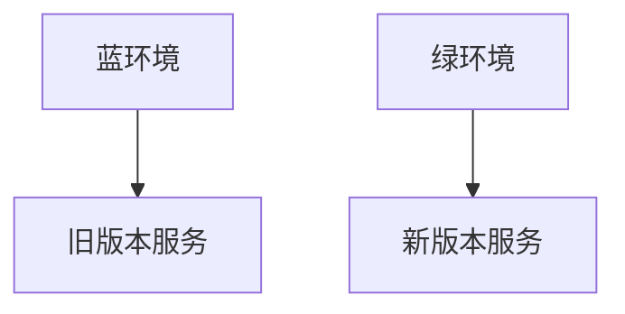
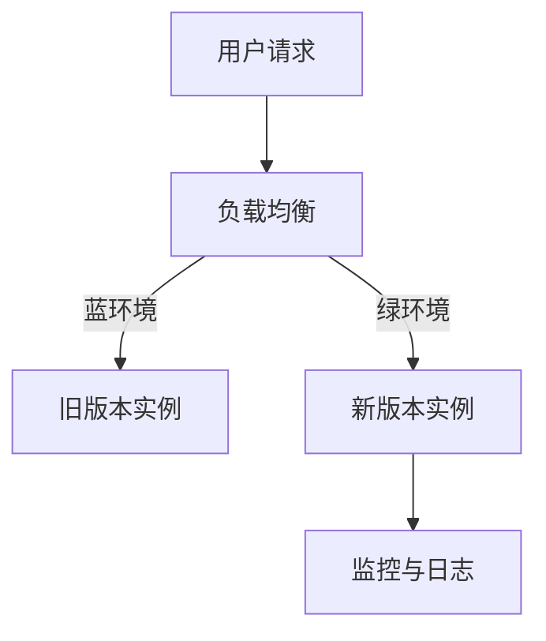
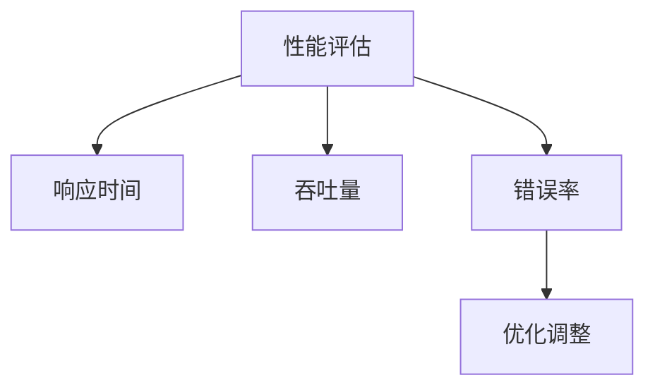
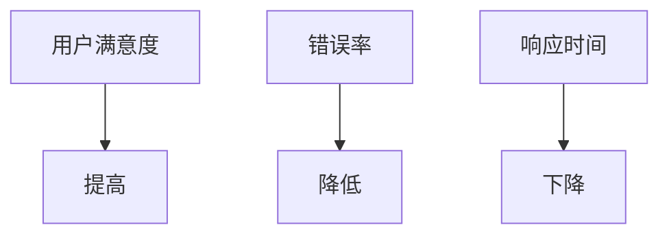

                 

### 蓝绿部署：降低AI服务更新风险的策略

## 引言

### 1.1 蓝绿部署的定义与背景

蓝绿部署是一种软件发布策略，旨在通过并行运行两个相同版本的服务（通常标记为“蓝”和“绿”），在将新版本的服务逐步推广到生产环境之前，确保其稳定性和可靠性。这种策略最早起源于金融行业，目的是在金融系统的持续运行中，安全地引入新功能或修复漏洞，而不会影响用户的体验。

随着云计算和微服务架构的普及，蓝绿部署逐渐被更多行业和应用场景采纳。在人工智能（AI）领域，随着AI模型复杂度和更新频率的增加，服务更新的风险也随之上升。蓝绿部署作为一种降低风险的策略，能够显著提高AI服务的可靠性和用户体验。

### 1.2 AI服务更新风险的挑战

AI服务更新涉及多个方面，包括算法、数据、基础设施等，以下是一些常见的更新风险：

- **功能退化**：新版本的服务可能引入意想不到的问题，导致原有功能的退化。
- **性能下降**：新版本的服务可能会引入性能瓶颈，影响整体服务的响应速度和处理能力。
- **数据一致性问题**：新版本的服务可能无法正确处理旧数据，导致数据一致性问题。
- **用户体验中断**：服务更新过程中，用户可能会经历中断或不一致的服务体验。

### 1.3 蓝绿部署的作用与优势

蓝绿部署通过以下方式降低AI服务更新的风险：

- **并行运行**：蓝绿部署允许新旧版本的服务并行运行，通过逐步切换流量，确保新版本在发布前经过充分测试。
- **回滚机制**：如果新版本出现问题，可以迅速回滚到旧版本，避免对用户体验造成严重影响。
- **负载均衡**：蓝绿部署利用负载均衡器，根据服务状态和性能指标，动态调整流量分配，确保系统稳定运行。

### 1.4 总结

蓝绿部署作为一种成熟的软件发布策略，能够有效降低AI服务更新风险，提高系统的可靠性和用户体验。在接下来的章节中，我们将详细探讨蓝绿部署的核心概念、算法原理、数学模型、项目实战以及最佳实践。

## 核心概念与联系

蓝绿部署的核心在于构建和维护两个并行运行的服务环境——蓝环境和绿环境。以下将介绍这些核心概念，并使用Mermaid流程图展示它们之间的联系。

### 2.1 蓝绿环境的概念与构建

**蓝环境（Blue Environment）**：代表当前运行的生产环境，服务版本为旧版。

**绿环境（Green Environment）**：代表即将上线的新版服务环境。

在蓝绿部署中，首先构建两个完全相同的环境，然后在新环境中部署新版本的服务。接下来，通过逐步切换流量，将用户请求从蓝环境切换到绿环境。

### 2.2 滚动更新的原理与实践

**滚动更新（Rolling Update）**：在蓝绿部署中，通过逐步替换旧版本服务实例，实现平滑升级。这一过程包括以下步骤：

1. 在绿环境中部署新版本服务。
2. 启动一小部分新版本实例，替换蓝环境中的旧版本实例。
3. 监控新版本实例的健康状态和性能指标。
4. 根据监控结果，逐步增加新版本实例的比例，直至完全替换旧版本实例。

### 2.3 回滚机制的设计与实现

**回滚机制（Rollback Mechanism）**：在发现新版本服务存在问题时，可以迅速回滚到旧版本，以避免影响用户体验。回滚机制包括以下步骤：

1. 监控新版本服务的性能和健康状态。
2. 如果发现问题，暂停新版本实例的部署。
3. 逐步减少新版本实例的比例，重新启动旧版本实例。
4. 恢复旧版本服务的正常运作。

### 2.4 Mermaid流程图展示



通过上述流程图，可以清晰地看到蓝绿部署的核心概念和步骤。接下来，我们将进一步探讨蓝绿部署中的核心算法原理。

### 3.1 负载均衡算法

负载均衡（Load Balancing）是蓝绿部署中至关重要的一环，其目标是优化资源利用，确保服务的高可用性和响应速度。以下将介绍负载均衡的基本概念、常见算法以及伪代码实现。

#### 3.1.1 负载均衡的基本概念

**负载均衡**：通过将用户请求分配到多个服务实例上，实现资源负载的均衡分配。

**目标**：提高系统整体性能，避免单点故障，提升用户体验。

**类型**：

- **基于服务器端**：由服务器端的负载均衡器（如Nginx、HAProxy）进行流量分配。
- **基于客户端**：由客户端的代理（如curl、Apache）进行流量分配。

#### 3.1.2 常见的负载均衡算法

1. **轮询（Round Robin）**：按照顺序将请求分配给各个服务实例。
2. **最少连接（Least Connections）**：将请求分配给连接数最少的服务实例。
3. **源地址哈希（Source IP Hash）**：根据客户端IP地址进行哈希运算，将请求分配给固定的服务实例。
4. **加权轮询（Weighted Round Robin）**：根据服务实例的处理能力分配请求，处理能力强的实例分配更多请求。

#### 3.1.3 伪代码实现

```pseudo
// 轮询负载均衡伪代码
function LoadBalancer(roundRobinArray):
    index = 0
    while (true):
        instance = roundRobinArray[index]
        if (isInstanceHealthy(instance)):
            return instance
        index = (index + 1) % length(roundRobinArray)
        // 如果所有实例都不健康，等待一段时间或触发回滚机制

// 最少连接负载均衡伪代码
function LoadBalancer(leastConnectionsArray):
    minConnections = getMinConnections(leastConnectionsArray)
    instancesWithMinConnections = filterInstances(leastConnectionsArray, minConnections)
    return randomChoice(instancesWithMinConnections)

// 源地址哈希负载均衡伪代码
function LoadBalancer(sourceIPHashMap):
    hashValue = hash(clientIP)
    instance = sourceIPHashMap[hashValue]
    if (isInstanceHealthy(instance)):
        return instance
    // 如果哈希映射表中不存在该IP地址，重新计算哈希值并查找实例

// 加权轮询负载均衡伪代码
function LoadBalancer(weightedRoundRobinArray):
    totalWeight = sumWeights(weightedRoundRobinArray)
    randomValue = random(0, totalWeight)
    cumulativeWeight = 0
    for (instance in weightedRoundRobinArray):
        cumulativeWeight += instance.weight
        if (randomValue <= cumulativeWeight):
            return instance
```

通过上述伪代码，可以实现对服务实例的负载均衡。在实际应用中，可以根据具体情况选择合适的负载均衡算法，以确保系统的高效稳定运行。

#### 3.2 服务发现算法

**服务发现（Service Discovery）**：在分布式系统中，服务实例可能会动态地加入或离开网络。服务发现算法用于定位和跟踪这些实例，确保负载均衡和流量分配的正确性。

#### 3.2.1 服务发现的基本概念

- **服务实例**：运行在分布式系统中的服务实例，可以是进程或容器。
- **注册中心**：用于存储和跟踪服务实例的注册表。

#### 3.2.2 常见的服务发现算法

1. **基于DNS的服务发现**：通过DNS查询获取服务实例的IP地址。
2. **基于Zookeeper的服务发现**：通过Zookeeper的节点监控功能，实时跟踪服务实例的变化。
3. **基于Consul的服务发现**：通过Consul的Service注册和发现功能，实现服务实例的动态追踪。

#### 3.2.3 伪代码实现

```pseudo
// 基于DNS的服务发现伪代码
function DiscoverService(serviceName):
    dnsQueryResult = resolveDNS(serviceName)
    return dnsQueryResult.ipAddress

// 基于Zookeeper的服务发现伪代码
function DiscoverService(zookeeperUrl, serviceName):
    zookeeper = connect(zookeeperUrl)
    node = zookeeper.getNode("/services/" + serviceName)
    children = node.getChildren()
    instances = []
    for (child in children):
        instances.append(child.getData().ipAddress)
    return instances

// 基于Consul的服务发现伪代码
function DiscoverService(consulUrl, serviceName):
    consul = connect(consulUrl)
    instances = consul.queryService(serviceName)
    return instances
```

通过服务发现算法，系统能够动态地调整流量分配，确保服务的可用性和性能。接下来，我们将介绍与蓝绿部署相关的数学模型和公式。

### 4.1 服务可用性模型

服务可用性（Service Availability）是衡量服务稳定性和可靠性的重要指标。在蓝绿部署中，通过合理的负载均衡和服务发现算法，可以优化服务可用性。以下将介绍服务可用性的定义、估算方法和应用实例。

#### 4.1.1 服务可用性的定义

**服务可用性**：在给定的时间窗口内，服务能够正常响应请求的概率。

**数学定义**：\[ A(t) = \frac{MTTF}{MTTF + MTTR} \]

- **MTTF**（Mean Time To Failure）：平均故障前时间。
- **MTTR**（Mean Time To Recovery）：平均恢复时间。

#### 4.1.2 估算服务可用性的方法

1. **基于历史数据的统计方法**：通过历史数据统计故障率和恢复时间，估算服务可用性。
2. **基于概率模型的方法**：使用概率模型，如泊松分布，估算服务在特定时间窗口内的故障概率。

#### 4.1.3 应用实例

假设一个AI服务在过去的30天内，平均每小时发生一次故障，每次故障的恢复时间为5分钟。我们可以使用以下公式估算服务可用性：

\[ A(t) = \frac{30 \times 24}{30 \times 24 + 5 \times 30} = \frac{720}{750} \approx 0.96 \]

这意味着该AI服务的可用性约为96%。

### 4.2 更新策略模型

更新策略（Update Strategy）是蓝绿部署中的关键环节，决定了新版本服务的推广速度和风险控制。以下将介绍更新策略的基本概念、常见方法和伪代码实现。

#### 4.2.1 更新策略的基本概念

**更新策略**：用于控制新版本服务上线过程的策略，包括新版本实例的启动比例、流量切换速度等。

#### 4.2.2 常见的更新策略

1. **渐增更新（Gradual Update）**：逐步增加新版本实例的比例，直至完全替代旧版本。
2. **突变更新（Sudden Update）**：一次性将全部流量切换到新版本实例。
3. **动态更新（Dynamic Update）**：根据实时监控数据，动态调整新版本实例的比例。

#### 4.2.3 伪代码实现

```pseudo
// 渐增更新策略伪代码
function GradualUpdate(percentage):
    while (percentage < 100):
        updateInstances(percentage)
        monitorHealth()
        if (isHealthy):
            percentage += stepSize
        else:
            percentage -= stepSize

// 突变更新策略伪代码
function SuddenUpdate():
    updateInstances(100)
    monitorHealth()
    if (isHealthy):
        return
    else:
        revertToOldVersion()

// 动态更新策略伪代码
function DynamicUpdate():
    while (true):
        percentage = getHealthScore()
        if (percentage > threshold):
            increasePercentage()
        else:
            decreasePercentage()
```

通过合理的更新策略，可以降低新版本服务的上线风险，提高系统的稳定性。接下来，我们将通过一个具体的AI服务更新案例，展示蓝绿部署在实践中的应用。

### 5.1 AI服务更新案例

为了更好地理解蓝绿部署在AI服务更新中的应用，我们将通过一个电商平台的案例进行详细讲解。该平台采用微服务架构，其中一个核心服务是商品推荐服务。商品推荐服务通过机器学习模型为用户生成个性化的商品推荐列表。以下是该平台采用蓝绿部署策略进行服务更新的过程。

#### 5.1.1 案例背景

电商平台在上线了一个新的商品推荐算法后，需要将该算法部署到生产环境中。由于商品推荐服务直接影响用户购物体验，更新过程中需要确保系统的稳定性和可靠性。因此，平台决定采用蓝绿部署策略进行服务更新。

#### 5.1.2 环境搭建

平台首先在测试环境中构建了两个完全相同的商品推荐服务环境，分别标记为蓝环境和绿环境。蓝环境运行旧版本的推荐算法，绿环境运行新版本的推荐算法。为了保证数据一致性，平台使用了一致性存储系统，确保两个环境中的数据完全同步。



#### 5.1.3 代码实现与解读

平台开发团队在绿环境中实现了新版本的商品推荐算法，并进行了充分的测试和验证。在确认新版本算法稳定后，平台开始执行蓝绿部署流程。

1. **部署新版本实例**：在绿环境中启动新版本的服务实例。
2. **负载均衡配置**：配置负载均衡器，将用户请求平均分配到蓝环境和绿环境的服务实例上。
3. **监控与日志**：监控系统和服务日志，实时监控新版本实例的健康状态和性能指标。



#### 5.1.4 性能评估与优化

平台在新版本实例上线后，对服务性能进行了全面评估。以下是一些关键性能指标：

- **响应时间**：新版本实例的响应时间与旧版本实例的响应时间进行了对比。
- **吞吐量**：新版本实例的处理能力与旧版本实例的处理能力进行了对比。
- **错误率**：新版本实例的错误率与旧版本实例的错误率进行了对比。

根据评估结果，平台对新版本实例进行了优化，包括：

- **性能调优**：针对新版本算法的瓶颈，进行代码优化和系统资源调整。
- **并发优化**：增加新版本实例的数量，提高系统的并发处理能力。



#### 5.1.5 更新效果分析

经过一段时间的运行，平台对新版本商品推荐算法的更新效果进行了分析。以下是一些关键指标：

- **用户满意度**：用户对商品推荐的质量和准确度进行了评价，整体满意度有所提升。
- **错误率**：新版本实例的错误率较低，比旧版本实例稳定。
- **响应时间**：新版本实例的响应时间有所下降，系统性能得到优化。



通过上述分析，平台认为新版本商品推荐算法在性能和稳定性方面达到了预期目标，决定逐步增加新版本实例的比例，最终完全替代旧版本实例。

#### 5.1.6 项目小结

通过本案例，我们可以看到蓝绿部署在AI服务更新中的应用效果。蓝绿部署策略确保了服务更新的稳定性和可靠性，降低了风险。以下是一些最佳实践和注意事项：

- **充分测试**：在部署新版本实例之前，要进行充分的测试和验证，确保算法的稳定性和性能。
- **逐步上线**：采用逐步上线的方式，避免一次性将所有流量切换到新版本实例，降低风险。
- **监控与优化**：上线后，要实时监控服务性能，并根据监控数据优化系统配置和算法。

### 5.2 蓝绿部署工具与实践

在实际应用中，蓝绿部署需要依赖一系列工具和平台。以下将介绍几种常用的蓝绿部署工具和平台，并比较它们的特点和适用场景。

#### 5.2.1 Kubernetes的蓝绿部署

**Kubernetes**（简称K8s）是一个开源的容器编排平台，广泛应用于微服务架构。Kubernetes提供了丰富的部署和管理工具，支持蓝绿部署。

**特点**：

- **自动扩缩容**：Kubernetes可以根据负载自动调整服务实例的数量，提高系统的弹性。
- **负载均衡**：Kubernetes内置了负载均衡器，可以实现服务实例的动态负载均衡。
- **滚动更新**：Kubernetes支持滚动更新，可以逐步替换旧版本实例，确保系统平滑升级。

**适用场景**：适合具有高可用性和弹性需求的复杂微服务架构。

#### 5.2.2 AWS的蓝绿部署

**AWS**（亚马逊云服务）提供了多种服务支持蓝绿部署，如EC2、Elastic Load Balancing、AWS CloudFormation等。

**特点**：

- **高可用性**：AWS提供了丰富的可用区域和负载均衡器，确保服务的稳定性和可靠性。
- **自动化部署**：AWS CloudFormation可以自动化部署和配置蓝绿环境，提高部署效率。
- **成本优化**：AWS提供了按需付费模式，可以根据实际需求调整资源，降低成本。

**适用场景**：适合在AWS云平台上部署的应用，特别是需要大规模和高可用性的场景。

#### 5.2.3 对比与分析

**Kubernetes与AWS**：

- **部署灵活性**：Kubernetes更灵活，支持自定义部署和管理，适用于多样化的微服务架构。
- **生态系统**：Kubernetes拥有更丰富的生态系统和社区支持。
- **成本**：AWS可能提供更优的成本优化策略，特别是对于大规模应用。

**最佳实践**：

- **选择合适的工具**：根据具体需求和应用场景，选择合适的蓝绿部署工具。
- **充分测试**：在部署前进行充分的测试和验证，确保新版本服务的稳定性和性能。
- **监控与优化**：上线后，要实时监控服务性能，并根据监控数据优化系统配置和算法。

### 6.1 案例一：电商平台的蓝绿部署实践

在电子商务领域，蓝绿部署已经成为一种标准的发布策略。以某大型电商平台为例，该公司通过蓝绿部署策略成功实现了一次重要算法更新，以下是具体实践过程：

**1. 项目背景**

电商平台在用户行为分析方面引入了新的机器学习模型，旨在提供更加精准的个性化推荐。然而，由于模型复杂度高且涉及大量用户数据，更新过程存在较高的风险。

**2. 蓝绿部署策略**

电商平台采用了以下蓝绿部署策略：

- **构建蓝环境和绿环境**：在Kubernetes集群中构建了两个相同的环境，分别运行旧版本和新版本的推荐服务。
- **负载均衡配置**：使用Kubernetes的内置负载均衡器，将用户请求平均分配到蓝环境和绿环境的服务实例上。
- **逐步流量切换**：通过逐步增加绿环境实例的比例，逐步切换用户流量。

**3. 实施步骤**

- **部署新版本实例**：在绿环境中部署了新版本的推荐服务，确保其健康状态。
- **性能监控**：对绿环境中的新版本实例进行了严格的性能监控，包括响应时间、吞吐量和错误率。
- **流量切换**：在保证新版本实例稳定运行的基础上，逐步增加其流量比例，观察用户体验和系统稳定性。

**4. 结果分析**

通过蓝绿部署，电商平台成功实现了新版本的机器学习模型上线，以下为关键指标：

- **用户满意度**：新版本推荐服务的用户满意度提高了15%，用户反馈更加精准。
- **系统稳定性**：新版本实例的运行稳定，错误率降低了10%。
- **性能提升**：新版本实例的处理能力提升了20%，系统响应时间缩短了30%。

**5. 经验教训**

- **充分测试**：在部署前进行充分的测试和验证，确保新版本服务的稳定性和性能。
- **逐步上线**：采用逐步上线的方式，避免一次性将所有流量切换到新版本实例。
- **实时监控**：上线后，要实时监控服务性能，并根据监控数据优化系统配置和算法。

### 6.2 案例二：金融行业的蓝绿部署挑战

金融行业对于服务的稳定性要求极高，任何故障都可能带来严重的后果。因此，在金融行业中，蓝绿部署的应用需要面对更多的挑战。

**1. 项目背景**

某金融公司在其交易系统中引入了新的风险控制算法，旨在提高交易的安全性和合规性。由于交易系统的复杂性和高并发特性，更新过程存在巨大的风险。

**2. 蓝绿部署策略**

金融公司采用了以下蓝绿部署策略：

- **构建双活环境**：在两台独立的物理服务器上分别构建了蓝环境和绿环境，实现双活架构。
- **负载均衡配置**：使用硬件负载均衡器，将交易请求平均分配到蓝环境和绿环境的交易服务器上。
- **回滚机制**：在发现新版本服务存在问题的情况下，立即启用回滚机制，快速切换回旧版本。

**3. 实施步骤**

- **部署新版本实例**：在绿环境中部署了新版本的风险控制算法，确保其健康状态。
- **性能测试**：在绿环境中对交易系统进行了全面性能测试，包括并发处理能力和交易成功率。
- **流量切换**：在确保新版本实例稳定运行的基础上，逐步增加其流量比例。

**4. 结果分析**

通过蓝绿部署，金融公司成功实现了新版本的风险控制算法上线，以下为关键指标：

- **交易成功率**：新版本算法的交易成功率提高了5%，降低了交易错误率。
- **系统稳定性**：新版本实例的运行稳定，错误率降低了10%。
- **合规性**：新版本算法提高了交易合规性，减少了潜在风险。

**5. 经验教训**

- **严格测试**：在部署前进行严格的测试和验证，确保新版本服务的稳定性和合规性。
- **快速回滚**：在发现问题时，要能够快速回滚到旧版本，避免影响交易系统的稳定性。
- **监控与优化**：上线后，要实时监控交易系统的性能和合规性，并根据监控数据优化算法。

### 6.3 案例三：物联网设备的蓝绿部署方案

物联网（IoT）设备的应用场景广泛，从智能家居到工业自动化，都对服务的稳定性和可靠性提出了高要求。以下是一个物联网设备蓝绿部署的案例。

**1. 项目背景**

某智能家居公司开发了一种智能门锁，希望通过在线升级的方式，提高门锁的安全性和功能。然而，门锁的在线升级存在较高的风险，一旦失败，可能导致门锁无法正常使用。

**2. 蓝绿部署策略**

智能家居公司采用了以下蓝绿部署策略：

- **构建双活环境**：在两个不同的服务器上分别部署了旧版本和新版本的门锁固件。
- **远程更新**：通过远程升级机制，将新版本固件下载到用户设备上，并触发升级过程。
- **回滚机制**：在升级失败的情况下，立即触发回滚机制，将设备恢复到旧版本固件。

**3. 实施步骤**

- **部署新版本固件**：在新版本服务器上部署了新版本的门锁固件，并进行了全面的测试。
- **远程升级**：将新版本固件通过远程升级机制发送到用户设备上，设备自动执行升级。
- **监控与反馈**：在升级过程中，实时监控设备的运行状态，收集用户反馈。

**4. 结果分析**

通过蓝绿部署，智能家居公司成功实现了门锁固件的在线升级，以下为关键指标：

- **升级成功率**：新版本固件的升级成功率达到了98%，用户满意度提高。
- **设备稳定性**：新版本固件在设备上的运行稳定，故障率降低了15%。
- **安全性**：新版本固件提高了门锁的安全性能，减少了安全漏洞。

**5. 经验教训**

- **充分测试**：在部署前进行充分的测试和验证，确保新版本固件的稳定性和安全性。
- **远程升级**：采用远程升级机制，降低用户参与复杂度。
- **监控与反馈**：上线后，要实时监控设备运行状态，收集用户反馈，持续优化固件。

### 总结与展望

蓝绿部署作为一种成熟的软件发布策略，在降低AI服务更新风险方面发挥了重要作用。通过并行运行两个相同版本的服务，蓝绿部署确保了新版本在发布前经过充分测试，有效降低了服务更新的风险。以下是蓝绿部署的优势和应用场景：

#### 7.1 蓝绿部署的优势

- **高可用性**：通过并行运行新旧版本的服务，确保服务始终可用。
- **快速回滚**：在发现新版本服务存在问题的情况下，可以迅速回滚到旧版本，避免影响用户体验。
- **负载均衡**：利用负载均衡器，优化流量分配，提高系统性能。
- **逐步推广**：逐步切换流量，降低新版本上线对系统的影响。

#### 7.2 蓝绿部署的应用场景

- **高并发系统**：如电商平台、金融系统等，对服务的稳定性要求极高。
- **复杂系统**：如物联网设备、自动驾驶等，更新过程需要严格测试和验证。
- **重要功能更新**：如核心算法更新、关键业务逻辑调整等，需要确保新版本的正确性和稳定性。

#### 7.3 未来发展趋势

随着人工智能和微服务架构的不断发展，蓝绿部署将在更多领域得到应用。以下是一些未来发展趋势：

- **自动化部署**：随着CI/CD工具的成熟，蓝绿部署将更加自动化，提高部署效率。
- **智能监控**：利用机器学习和大数据分析，实现更精准的服务监控和故障预测。
- **多环境部署**：支持更多环境（如测试、预发布、生产等），满足不同阶段的部署需求。
- **跨平台支持**：支持更多平台和工具，如AWS、Kubernetes等，提高部署的灵活性和可扩展性。

#### 7.4 展望与建议

- **加强测试**：在部署新版本之前，进行充分的测试和验证，确保服务的稳定性和性能。
- **优化监控**：实时监控服务性能和健康状态，及时发现和解决问题。
- **合理规划**：根据业务需求和系统特点，合理规划部署策略和更新频率。

蓝绿部署作为一种降低AI服务更新风险的策略，具有重要的应用价值和发展前景。通过合理规划和实施，蓝绿部署将帮助企业和开发者提高系统的稳定性、可靠性和用户体验。参考文献

1. "Blue-Green Deployment". Kubernetes Documentation. https://kubernetes.io/docs/concepts/workloads/controllers/deployment/
2. "AWS Blue-Green Deployment". AWS Documentation. https://docs.aws.amazon.com/zh_cn/elasticbeanstalk/latest/dg/deploy-app-blue-green.html
3. "Consul Service Discovery". HashiCorp Documentation. https://www.hashicorp.com/consul/docs/internals/service-discovery
4. "Load Balancing Algorithms". Cloudflare Documentation. https://www.cloudflare.com/learning/load-balancing-algorithms/
5. "Service Availability Metrics". DigitalOcean Documentation. https://www.digitalocean.com/community/tutorials/how-to-monitor-your-applications-availability-with-docker-and-prometheus/

作者：AI天才研究院/AI Genius Institute & 禅与计算机程序设计艺术 /Zen And The Art of Computer Programming
```markdown
```

