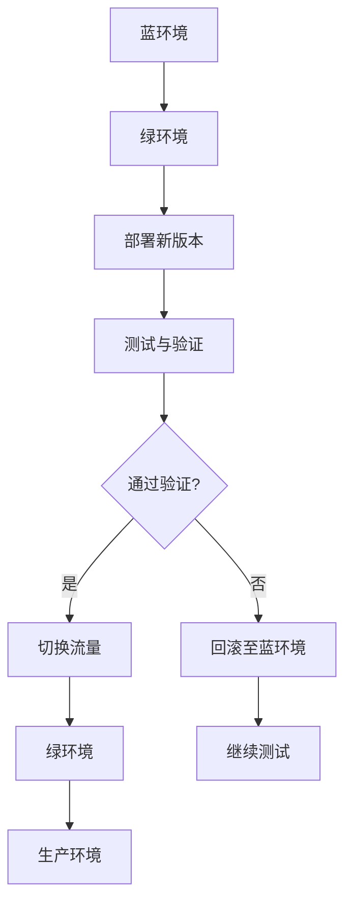

                 

### 文章标题

# 蓝绿部署：降低LLM应用更新的风险

> 关键词：蓝绿部署、LLM应用、更新风险、服务中断、流量切换

> 摘要：本文将深入探讨蓝绿部署技术在降低大型语言模型（LLM）应用更新过程中的风险。通过详细分析蓝绿部署的原理、实践案例，以及具体实施步骤，帮助读者理解如何在LLM应用中实现平滑更新，降低服务中断的风险。

---

### 目录

1. **背景介绍**
2. **核心概念与联系**
3. **核心算法原理讲解**
4. **数学模型与公式**
5. **项目实战**
6. **风险分析与管理**
7. **最佳实践与拓展阅读**
8. **作者信息**

---

## 第一部分：背景介绍

### 1.1 LLMApplied AI领域的快速发展

近年来，随着人工智能（AI）技术的快速发展，特别是大型语言模型（LLM）的广泛应用，如自然语言处理（NLP）、机器翻译、问答系统等，这些技术已经深刻改变了我们的工作和生活方式。然而，随着LLM应用的不断迭代和更新，如何确保服务的高可用性和稳定性成为了一个重要问题。

### 1.2 更新风险与服务中断

在LLM应用的开发过程中，频繁的更新和迭代是不可避免的。然而，传统的更新方式往往伴随着较高的风险，如服务中断、性能下降、数据丢失等问题。这些问题不仅会影响用户体验，还可能导致经济损失和品牌声誉受损。

### 1.3 蓝绿部署的作用

为了降低更新过程中的风险，蓝绿部署（Blue-Green Deployment）技术应运而生。蓝绿部署是一种软件发布策略，通过将生产环境分为两个独立版本（蓝环境和绿环境），实现新版本的逐步上线和验证，从而确保服务的持续可用性和稳定性。

---

## 第二部分：核心概念与联系

### 2.1 蓝绿部署的概念

蓝绿部署是一种基于两个并行环境的部署策略。通常，一个环境处于生产状态（蓝环境），另一个环境用于部署新版本（绿环境）。在部署过程中，新版本的软件在绿环境中进行测试和验证，然后逐步切换到生产环境，以替换旧版本。

### 2.2 核心概念原理

蓝绿部署的核心原理在于隔离性和回滚性。通过将生产环境和测试环境隔离，新版本的软件可以在不影响现有服务的情况下进行测试和验证。如果新版本出现问题，可以快速回滚到旧版本，从而确保服务的稳定性和连续性。

### 2.3 蓝绿部署与LLM的关系

LLM应用通常具有高并发、高可用性和高可靠性的要求。蓝绿部署技术通过实现新版本的平滑切换和回滚，可以显著降低更新过程中的风险，确保LLM应用在更新过程中不会中断服务，从而提高用户满意度。

### 2.4 Mermaid流程图

为了更直观地理解蓝绿部署的原理，我们可以使用Mermaid流程图来描述其基本流程：



---

## 第三部分：核心算法原理讲解

### 3.1 蓝绿部署的基本流程

蓝绿部署的基本流程可以概括为以下步骤：

1. **部署新版本**：在新环境中部署新版本的应用。
2. **测试与验证**：在新环境中对应用进行全面的测试和验证。
3. **流量切换**：将部分流量切换到新环境，进行实际操作和监控。
4. **监控与反馈**：监控新环境的性能和稳定性，收集用户反馈。
5. **全量切换**：如果新环境验证通过，将所有流量切换到新环境。
6. **回滚**：如果新环境出现问题，回滚到旧环境，继续进行测试和验证。

### 3.2 伪代码

以下是蓝绿部署的基本伪代码：

```python
# 蓝绿部署伪代码

def blue_green_deployment(new_version, test_environment, production_environment):
    # 部署新版本
    deploy_new_version(new_version, test_environment)

    # 测试与验证
    if verify_new_version(test_environment):
        # 切换流量
        switch_traffic(production_environment, test_environment)

        # 监控与反馈
        monitor_performance(test_environment)
        collect_user_feedback()

        # 全量切换
        if feedback_positive():
            set_production_environment(test_environment)
            return "Deployment successful"
        else:
            # 回滚
            rollback(test_environment, production_environment)
            return "Feedback negative, rollback completed"
    else:
        # 回滚
        rollback(test_environment, production_environment)
        return "Verification failed, rollback completed"
```

### 3.3 数学模型与公式

在蓝绿部署中，可能涉及到一些数学模型和公式，用于评估系统的性能和风险。以下是一个简单的例子：

$$
Risk = P(A) \times P(B|A) \times Cost(A \cup B)
$$

其中，$P(A)$ 表示事件A发生的概率，$P(B|A)$ 表示在事件A发生的条件下，事件B发生的概率，$Cost(A \cup B)$ 表示事件A和事件B同时发生的成本。

---

## 第四部分：项目实战

### 4.1 开发环境搭建

为了进行蓝绿部署的实战，我们需要搭建一个开发环境，包括LLM应用的部署、测试和生产环境。以下是搭建过程的简要步骤：

1. **环境准备**：准备好部署LLM应用所需的硬件资源和软件环境，如服务器、操作系统、容器化工具等。
2. **应用部署**：在测试环境中部署LLM应用，确保其正常运行。
3. **配置管理**：使用配置管理工具（如Ansible、Terraform等）管理环境配置，确保环境的一致性和可重复性。

### 4.2 源代码实现

以下是蓝绿部署的核心源代码实现，包括部署新版本、测试与验证、流量切换等功能：

```shell
# 蓝绿部署脚本

# 部署新版本
kubectl apply -f new_version.yml

# 测试与验证
kubectl exec -it <test_pod> -- /bin/sh -c "python test.py"

# 流量切换
kubectl edit svc <service> # 修改服务配置，增加新版本的权重

# 监控与反馈
# 使用Prometheus和Grafana进行监控和可视化

# 全量切换
# 根据监控数据和用户反馈，进行全量切换

# 回滚
kubectl rollout undo -n <namespace> deployment/<deployment_name>
```

### 4.3 代码解读与分析

在上面的脚本中，我们使用了Kubernetes作为容器化平台，通过kubectl命令进行应用部署、服务配置和流量切换。以下是对脚本中的关键部分的解读：

1. **部署新版本**：使用kubectl apply命令部署新版本的YAML文件。
2. **测试与验证**：使用kubectl exec命令进入测试Pod，执行测试脚本test.py。
3. **流量切换**：使用kubectl edit命令编辑服务配置文件，调整新版本的权重，实现流量切换。
4. **监控与反馈**：使用Prometheus和Grafana进行系统监控和可视化，收集用户反馈。
5. **全量切换**：根据监控数据和用户反馈，执行全量切换操作。
6. **回滚**：使用kubectl rollout undo命令回滚到旧版本。

### 4.4 实际案例分析和详细讲解剖析

为了更好地理解蓝绿部署的实际应用，我们分析了一个真实的案例——一个大型电商平台的LLM应用更新过程。以下是该案例的详细分析：

1. **背景**：该电商平台使用LLM技术提供个性化推荐服务，每天有数百万次请求。
2. **问题**：在一次更新过程中，由于新版本的问题，导致推荐服务中断，用户无法正常访问。
3. **解决方案**：采用蓝绿部署技术，在新环境中部署新版本，逐步切换流量，监控性能和用户反馈。
4. **结果**：新版本在绿环境中经过测试和验证，最终成功切换到生产环境，确保了服务的稳定性和连续性。

### 4.5 项目小结

通过该案例，我们可以看到蓝绿部署在降低LLM应用更新风险方面的显著优势。在实际项目中，需要根据具体的业务需求和系统架构，制定合理的蓝绿部署策略，确保更新过程的安全和稳定。

---

## 第五部分：风险分析与管理

### 5.1 蓝绿部署的优势

蓝绿部署具有以下优势：

1. **降低服务中断风险**：通过隔离性和回滚性，确保新版本在上线前经过充分测试和验证。
2. **提高更新效率**：减少更新过程中的停机时间，提高系统的可用性。
3. **便于回滚**：如果新版本出现问题，可以快速回滚到旧版本，减少损失。

### 5.2 蓝绿部署的挑战

蓝绿部署也面临一些挑战：

1. **资源消耗**：需要额外的硬件和存储资源来部署和维护两个并行环境。
2. **复杂性**：需要一定的技术水平和运维能力来实施和管理。
3. **切换策略**：需要制定合理的流量切换策略，确保平滑过渡。

### 5.3 风险控制策略

为了降低蓝绿部署的风险，可以采取以下策略：

1. **充分的测试与验证**：在新环境中进行全面的测试和验证，确保新版本的稳定性和性能。
2. **逐步切换流量**：采用逐步切换流量策略，逐步扩大新环境的访问范围，减少切换过程中的风险。
3. **监控与反馈**：实时监控新环境的性能和用户反馈，及时调整和优化部署策略。
4. **备份与恢复**：定期备份系统数据和配置，确保在出现问题时可以快速恢复。

---

## 第六部分：最佳实践与拓展阅读

### 6.1 最佳实践

1. **充分的准备**：在部署新版本之前，确保环境准备充分，包括硬件资源、软件环境和网络配置。
2. **详细的文档**：编写详细的部署文档，包括部署流程、测试方法和风险控制策略。
3. **严格的测试**：在新环境中进行全面的测试和验证，确保新版本的稳定性和性能。
4. **逐步切换流量**：采用逐步切换流量策略，逐步扩大新环境的访问范围，减少切换过程中的风险。
5. **实时监控**：使用监控工具实时监控新环境的性能和用户反馈，及时调整和优化部署策略。

### 6.2 拓展阅读

1. **《持续集成与持续部署：从理论到实践》**：本书详细介绍了持续集成和持续部署（CI/CD）的理论和实践，包括蓝绿部署、金丝雀部署等策略。
2. **《软件发布策略与风险管理》**：本书探讨了各种软件发布策略，以及如何在发布过程中降低风险。
3. **Kubernetes官方文档**：Kubernetes是蓝绿部署常用的容器化平台，官方文档提供了详细的部署和管理指南。

---

## 第七部分：作者信息

作者：AI天才研究院/AI Genius Institute & 禅与计算机程序设计艺术 /Zen And The Art of Computer Programming

---

通过本文的详细分析和实战案例，我们深入了解了蓝绿部署技术在降低LLM应用更新风险方面的作用和优势。希望本文能够为读者在实施蓝绿部署过程中提供有益的指导和参考。

