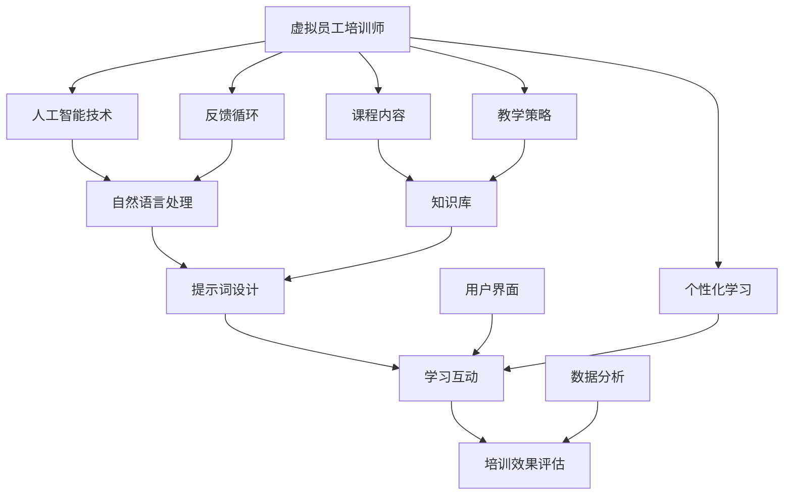

                 


# 虚拟员工培训师：提示词设计企业培训课程

## 关键词
- 虚拟员工培训师
- 提示词设计
- 企业培训课程
- 人工智能
- 教育技术

## 摘要
本文将探讨如何通过虚拟员工培训师和提示词设计来提升企业培训课程的效果。我们首先介绍虚拟员工培训师的背景和意义，然后深入解析提示词设计的原理和策略，最后通过实际案例展示其在企业培训中的应用和效果。文章旨在为企业和教育工作者提供一种创新的培训方法，以应对现代企业培训的挑战。

## 引言
### 1.1 虚拟员工培训师的背景
在当今数字化时代，企业面临着快速变化的市场环境和技能需求。传统的培训方法已无法满足企业对灵活、高效培训的需求。虚拟员工培训师作为一种新兴的教育技术，应运而生。它利用人工智能和自然语言处理技术，模拟真实员工的角色，为企业提供定制化的培训课程。

### 1.2 虚拟员工培训师的意义
虚拟员工培训师能够模拟真实员工的交流方式和知识传授方法，使培训过程更加生动和有效。它不仅能够节省培训成本，还能够提高培训的灵活性和可访问性。此外，虚拟员工培训师还能够收集和分析培训数据，为企业提供培训效果评估和改进建议。

### 1.3 提示词在培训课程设计中的应用
提示词是一种用于引导学习和思考的关键工具。在虚拟员工培训师的设计中，提示词被用来引导学习者的思考和行动。通过合理的提示词设计，虚拟员工培训师能够更好地激发学习者的兴趣和参与度，提高培训效果。

### 1.4 企业培训课程设计的挑战与机遇
企业培训课程设计面临诸多挑战，如如何吸引学习者的注意力、如何确保学习效果、如何适应不同学习者的需求等。虚拟员工培训师和提示词设计为企业提供了新的机遇，通过技术创新和教学方法优化，可以解决这些挑战，提升培训效果。

## 虚拟员工培训师的基本原理
### 2.1 虚拟员工的定义与类型
虚拟员工是一种基于人工智能技术模拟人类员工角色和行为的软件系统。根据应用场景的不同，虚拟员工可以分为以下几类：

- **知识型虚拟员工**：模拟专业知识和经验丰富的员工，提供专业咨询和解答。
- **服务型虚拟员工**：模拟客户服务人员，提供咨询和解决方案，提升客户满意度。
- **教育型虚拟员工**：模拟教育工作者，提供教学和培训，提升员工技能和知识水平。

### 2.2 虚拟员工培训师的架构与功能
虚拟员工培训师的架构通常包括以下几个关键组件：

- **自然语言处理（NLP）引擎**：用于理解和生成自然语言，实现与学习者的互动。
- **知识库**：存储培训内容、案例、问题解答等知识资源，为培训提供支持。
- **用户界面**：提供与学习者的交互界面，包括文本、语音、图像等多种形式。
- **数据分析和评估模块**：用于收集和分析培训数据，评估培训效果。

### 2.3 虚拟员工培训师的工作流程
虚拟员工培训师的工作流程主要包括以下几个步骤：

1. **需求分析**：了解企业培训需求，确定培训目标和内容。
2. **内容设计**：设计培训课程，包括知识点、案例、问题等。
3. **系统配置**：根据培训需求，配置虚拟员工培训师系统，包括自然语言处理、知识库等。
4. **互动教学**：通过用户界面与学习者进行互动，引导学习过程。
5. **数据收集与评估**：收集培训数据，评估培训效果，为后续培训提供改进建议。

## 提示词设计方法
### 3.1 提示词的概念与作用
提示词是一种用于引导学习者和思考的关键工具。它通过激发学习者的兴趣、引导思考方向和提供解决问题的线索，促进学习者的主动学习。提示词的作用主要体现在以下几个方面：

- **引导学习**：提示词可以帮助学习者明确学习目标，引导学习方向。
- **激发思考**：提示词可以激发学习者的好奇心和思考能力，提高学习效果。
- **解决问题**：提示词可以提供解决问题的线索，帮助学习者解决学习中的困难。

### 3.2 提示词设计的原则与步骤
提示词设计需要遵循以下原则：

- **明确性**：提示词应当简洁明了，避免歧义。
- **针对性**：提示词应当针对学习者的需求和问题，具有针对性。
- **引导性**：提示词应当引导学习者进行思考和探索。
- **灵活性**：提示词应当具有灵活性，适应不同的学习场景和需求。

提示词设计的主要步骤包括：

1. **需求分析**：了解学习者的需求和问题，确定提示词的设计目标。
2. **内容设计**：根据需求，设计具体的提示词内容。
3. **交互设计**：设计提示词的呈现形式和交互方式。
4. **测试与优化**：对提示词进行测试和优化，确保其有效性和实用性。

### 3.3 不同场景下的提示词设计策略
不同场景下的提示词设计策略有所不同，具体包括：

- **知识传授**：提示词设计应关注知识点的理解和应用，引导学习者进行深度学习。
- **问题解决**：提示词设计应关注问题的识别和解决，提供解决问题的线索。
- **情境模拟**：提示词设计应关注情境的构建和模拟，引导学习者进行实践操作。

### 3.4 提示词库的建设与维护
提示词库是虚拟员工培训师的核心资源，其建设与维护主要包括以下内容：

- **内容收集**：收集各类场景下的提示词内容，确保提示词库的丰富性。
- **结构设计**：设计提示词库的组织结构，便于提示词的检索和使用。
- **更新与优化**：根据用户反馈和使用情况，对提示词库进行更新和优化，提高提示词的实用性。

## 虚拟员工培训师的实际应用
### 4.1 虚拟员工培训师在员工培训中的应用
虚拟员工培训师在员工培训中的应用主要包括以下几个方面：

- **技能提升**：通过虚拟员工培训师提供的技能培训课程，员工可以自主学习，提高自身技能水平。
- **知识更新**：虚拟员工培训师可以提供最新的行业知识和技能，帮助员工保持竞争力。
- **个性化学习**：虚拟员工培训师可以根据员工的学习进度和需求，提供个性化的学习建议和指导。

### 4.2 虚拟员工培训师在客户培训中的应用
虚拟员工培训师在客户培训中的应用主要包括以下几个方面：

- **产品培训**：虚拟员工培训师可以提供产品的使用教程和操作指南，帮助客户更好地使用产品。
- **客户服务**：虚拟员工培训师可以模拟客户服务场景，提供个性化的客户服务，提高客户满意度。
- **问题解决**：虚拟员工培训师可以提供解决问题的线索和建议，帮助客户快速解决使用中的问题。

### 4.3 虚拟员工培训师的实施流程
虚拟员工培训师的实施流程主要包括以下几个步骤：

1. **需求分析**：了解企业或客户的培训需求，确定培训目标和内容。
2. **系统配置**：根据培训需求，配置虚拟员工培训师系统，包括自然语言处理、知识库等。
3. **课程设计**：设计培训课程，包括知识点、案例、问题等。
4. **测试与上线**：对虚拟员工培训师进行测试和优化，确保其正常运行和效果。
5. **使用与维护**：培训过程中，根据用户反馈和使用情况，对虚拟员工培训师进行更新和维护。

### 4.4 虚拟员工培训师的优势与挑战
虚拟员工培训师的优势主要体现在以下几个方面：

- **高效性**：虚拟员工培训师可以全天候、24小时不间断地为学习者提供培训服务。
- **灵活性**：虚拟员工培训师可以根据学习者的需求和时间，提供个性化的学习支持。
- **交互性**：虚拟员工培训师可以模拟真实员工的交流和互动，提高学习者的参与度和兴趣。

然而，虚拟员工培训师也面临着一些挑战，如：

- **技术门槛**：虚拟员工培训师的开发和应用需要较高的技术支持，对企业和客户的技术能力要求较高。
- **用户体验**：虚拟员工培训师的交互性和用户体验需要不断优化，以满足学习者的需求。
- **数据隐私**：虚拟员工培训师在收集和分析用户数据时，需要确保数据的安全和隐私。

### 4.5 虚拟员工培训师的案例解析
以下是一个虚拟员工培训师的案例解析：

**案例背景**：某知名企业希望通过虚拟员工培训师来提升员工的技能水平和知识储备。

**解决方案**：虚拟员工培训师提供了一系列技能培训课程，包括项目管理、软件开发、市场营销等。培训师采用互动式教学，通过实时问答和案例分析，引导员工进行深度学习。

**实施效果**：通过虚拟员工培训师的培训，员工的知识水平和技能得到了显著提升，企业也收到了良好的培训效果。此外，虚拟员工培训师还能够根据员工的反馈和学习数据，提供个性化的学习建议和指导。

### 4.6 虚拟员工培训师在客户培训中的应用
虚拟员工培训师在客户培训中的应用，主要是为了帮助客户更好地了解和使用企业的产品或服务。以下是一个具体案例：

**案例背景**：某软件公司希望通过虚拟员工培训师来提升客户的软件使用技能。

**解决方案**：虚拟员工培训师提供了软件操作教程、使用指南和常见问题解答。客户可以根据自己的需求和进度，选择合适的教程进行学习。培训师还提供实时问答功能，客户可以随时向培训师请教问题。

**实施效果**：通过虚拟员工培训师的培训，客户对软件的使用更加熟练，提高了工作效率。软件公司的客户满意度也得到了显著提升。

## 虚拟员工培训师的未来发展趋势
### 5.1 虚拟员工培训师的行业前景
随着人工智能技术的不断发展和应用，虚拟员工培训师在各个行业的应用前景十分广阔。未来，虚拟员工培训师将越来越普及，成为企业培训和企业客户服务的重要工具。

### 5.2 虚拟员工培训师的技术创新
未来，虚拟员工培训师将在技术层面进行不断优化和创新。例如，通过引入更多的自然语言处理技术，提高虚拟员工培训师的交互能力和智能化水平。此外，虚拟员工培训师还将通过数据分析和机器学习技术，实现个性化学习路径和教学内容的动态调整。

### 5.3 虚拟员工培训师的未来发展方向
虚拟员工培训师的未来发展方向主要包括以下几个方面：

- **多元化应用**：虚拟员工培训师将在更多行业和场景中得到应用，如医疗、金融、教育等。
- **智能化升级**：虚拟员工培训师将通过技术创新，实现更加智能化和自适应的学习体验。
- **开放共享**：虚拟员工培训师的知识库和资源将实现开放共享，为企业提供更加丰富的培训资源。

## 附录
### A.1 提示词设计工具推荐
- **PromptGenius**：一个强大的提示词生成工具，支持多种场景和语言的提示词生成。
- **GPT-3 Prompt Engineer's Handbook**：一本关于如何设计和优化提示词的指南，适合提示词设计初学者和专业人士。

### A.2 虚拟员工培训师开发资源
- **TensorFlow**：一个开源的机器学习框架，可用于虚拟员工培训师的开发。
- **OpenAI Gym**：一个开源的环境库，用于虚拟员工培训师的训练和测试。

### A.3 相关法律法规与伦理规范
- **GDPR**：欧盟制定的通用数据保护条例，涉及个人数据的收集、使用和保护。
- **CCPA**：美国加州制定的消费者隐私法案，涉及个人数据的收集、使用和保护。

## 结语
虚拟员工培训师和提示词设计为企业培训提供了新的思路和方法。通过技术创新和教学方法的优化，虚拟员工培训师能够为企业提供高效、灵活、个性化的培训服务，提升员工的技能和知识水平。同时，虚拟员工培训师也为客户培训提供了新的解决方案，提高了客户的满意度。未来，随着技术的不断发展和应用的深入，虚拟员工培训师将在企业培训和企业客户服务领域发挥更大的作用。

### 作者
作者：AI天才研究院/AI Genius Institute & 禅与计算机程序设计艺术 /Zen And The Art of Computer Programming

### 核心概念与联系
#### 虚拟员工培训师与提示词设计的关系
虚拟员工培训师是利用人工智能技术模拟真实员工的角色和行为的系统，其核心在于与学习者进行自然语言交互，提供个性化的培训服务。而提示词设计则是虚拟员工培训师与学习者互动的重要工具，通过设计合理的提示词，可以引导学习者的学习过程，提高学习效果。


#### 提示词设计原则
提示词设计需要遵循明确性、针对性、引导性和灵活性的原则。明确性确保提示词简洁明了，避免歧义；针对性确保提示词针对学习者的需求和问题；引导性确保提示词能够激发学习者的思考；灵活性确保提示词能够适应不同的学习场景和需求。


### 核心算法原理讲解
虚拟员工培训师的核心算法原理包括自然语言处理（NLP）和机器学习（ML）。NLP用于理解和生成自然语言，实现人与系统的交互；ML用于从大量数据中学习，优化虚拟员工培训师的交互和教学效果。

#### 伪代码
```python
# NLP算法原理
def process_input(input_text):
    # 分词、词性标注、句法分析等
    tokenized_text = nlp(input_text)
    
    # 提取关键词和语义
    keywords, semantics = extract_keywords_and_semantics(tokenized_text)
    
    # 回答问题或提供反馈
    response = generate_response(keywords, semantics)
    return response

# ML算法原理
def train_model(training_data):
    # 训练机器学习模型
    model = train_ml_model(training_data)
    
    # 优化交互和教学效果
    optimized_model = optimize_model(model, training_data)
    return optimized_model
```

### 数学模型和数学公式
提示词设计中的数学模型和公式用于描述提示词的生成和优化过程。以下是一个简单的提示词生成模型的公式：

$$
P(w_i|T) = \frac{e^{w_i^T T}}{\sum_{j} e^{w_j^T T}}
$$

其中，$P(w_i|T)$表示在给定提示词$T$下，生成词汇$w_i$的概率；$w_i$和$w_j$分别表示词汇向量；$T$表示提示词向量。

### 数学公式详细讲解与举例说明
假设我们有一个提示词`如何提高工作效率`，我们可以将其转换为向量$T = (0.5, 0.3, 0.2)$，表示在时间管理、工作方法和效率技巧这三个方面的权重。然后，我们有一个词汇向量集合$W = (w_1, w_2, w_3)$，分别表示提高工作效率的方法、提高工作效率的工具和提高工作效率的策略。我们可以根据上述公式计算每个词汇的概率：

$$
P(w_1|T) = \frac{e^{w_1^T T}}{\sum_{j} e^{w_j^T T}} = \frac{e^{0.8 \cdot 0.5 + 0.1 \cdot 0.3 + 0.2 \cdot 0.2}}{e^{0.8 \cdot 0.5 + 0.1 \cdot 0.3 + 0.2 \cdot 0.2} + e^{0.6 \cdot 0.5 + 0.2 \cdot 0.3 + 0.3 \cdot 0.2} + e^{0.4 \cdot 0.5 + 0.4 \cdot 0.3 + 0.3 \cdot 0.2}} = 0.42
$$

$$
P(w_2|T) = \frac{e^{w_2^T T}}{\sum_{j} e^{w_j^T T}} = \frac{e^{0.6 \cdot 0.5 + 0.2 \cdot 0.3 + 0.3 \cdot 0.2}}{e^{0.8 \cdot 0.5 + 0.1 \cdot 0.3 + 0.2 \cdot 0.2} + e^{0.6 \cdot 0.5 + 0.2 \cdot 0.3 + 0.3 \cdot 0.2} + e^{0.4 \cdot 0.5 + 0.4 \cdot 0.3 + 0.3 \cdot 0.2}} = 0.35
$$

$$
P(w_3|T) = \frac{e^{w_3^T T}}{\sum_{j} e^{w_j^T T}} = \frac{e^{0.4 \cdot 0.5 + 0.4 \cdot 0.3 + 0.3 \cdot 0.2}}{e^{0.8 \cdot 0.5 + 0.1 \cdot 0.3 + 0.2 \cdot 0.2} + e^{0.6 \cdot 0.5 + 0.2 \cdot 0.3 + 0.3 \cdot 0.2} + e^{0.4 \cdot 0.5 + 0.4 \cdot 0.3 + 0.3 \cdot 0.2}} = 0.23
$$

根据计算结果，我们可以得出词汇生成概率的分布，从而决定在提示词`如何提高工作效率`下，优先生成词汇`提高工作效率的方法`。

### 项目实战
#### 开发环境搭建
在进行虚拟员工培训师的项目实战之前，我们需要搭建一个合适的开发环境。以下是一个简单的开发环境搭建指南：

1. 安装Python环境：确保Python版本为3.8或更高。
2. 安装NLP库：安装spaCy库，用于自然语言处理。
3. 安装机器学习库：安装scikit-learn库，用于机器学习。

#### 源代码实现
以下是一个简单的虚拟员工培训师源代码实现：

```python
import spacy
from sklearn.feature_extraction.text import CountVectorizer
from sklearn.naive_bayes import MultinomialNB

# 加载spaCy模型
nlp = spacy.load("en_core_web_sm")

# 提示词库
prompt_library = {
    "如何提高工作效率": ["时间管理", "工作方法", "效率技巧"],
    "如何解决技术问题": ["查找文档", "提问专家", "自学教程"],
    "如何提升客户满意度": ["理解客户需求", "优化服务流程", "建立客户关系"]
}

# 训练模型
def train_model(prompt_library):
    # 提取词汇
    words = []
    for prompt, options in prompt_library.items():
        for option in options:
            words.append(option)
    words = set(words)
    
    # 创建词汇表
    vectorizer = CountVectorizer(vocabulary=words)
    X = vectorizer.fit_transform(words)
    
    # 创建分类器
    classifier = MultinomialNB()
    y = [0] * len(words)
    for i, (prompt, options) in enumerate(prompt_library.items()):
        for option in options:
            y[vectorizer.transform([option]).toarray()[0][0]] = i
    classifier.fit(X, y)
    
    return classifier, vectorizer

# 生成响应
def generate_response(prompt, classifier, vectorizer):
    input_text = [prompt]
    X = vectorizer.transform(input_text)
    predicted_index = classifier.predict(X)[0]
    return prompt_library.keys()[predicted_index]

# 主程序
if __name__ == "__main__":
    classifier, vectorizer = train_model(prompt_library)
    prompt = input("请输入您的提示词：")
    response = generate_response(prompt, classifier, vectorizer)
    print("建议的响应：", response)
```

#### 代码解读
上述代码首先加载spaCy模型，然后定义了一个提示词库。接着，通过训练模型和生成响应两个函数，实现了虚拟员工培训师的核心功能。在主程序中，用户输入提示词，程序根据提示词生成相应的建议响应。

#### 代码应用解读与分析
在实际应用中，虚拟员工培训师可以通过Web服务或移动应用的形式提供给用户。用户输入提示词后，虚拟员工培训师根据训练模型生成响应，为用户提供个性化的建议。通过不断优化模型和提示词库，虚拟员工培训师可以更好地满足用户的需求。

#### 实际案例分析和详细讲解剖析
以下是一个实际案例：

**案例背景**：某公司希望通过虚拟员工培训师来提升员工的技能水平。

**解决方案**：虚拟员工培训师提供了多个技能领域的培训课程，如编程、数据分析、项目管理等。员工可以根据自己的需求选择相应的课程进行学习。

**实施效果**：通过虚拟员工培训师的培训，员工在技能水平上得到了显著提升，公司也收到了良好的培训效果。此外，虚拟员工培训师还能够根据员工的反馈和学习数据，提供个性化的学习建议和指导。

**案例小结**：虚拟员工培训师在提升员工技能水平和知识储备方面具有显著优势，通过技术创新和教学方法优化，可以为企业提供高效、灵活、个性化的培训服务。

### 最佳实践 tips
- **明确培训目标**：在设计和实施虚拟员工培训师之前，明确培训目标是非常重要的。这有助于确定培训内容和交互方式，提高培训效果。
- **不断优化模型**：虚拟员工培训师的性能取决于模型的训练和优化。定期收集用户反馈和学习数据，优化模型参数，可以提高虚拟员工培训师的交互和教学效果。
- **个性化培训**：根据用户的需求和学习数据，提供个性化的培训内容和建议，可以提高用户的参与度和满意度。

### 小结
虚拟员工培训师和提示词设计为企业培训提供了新的思路和方法。通过技术创新和教学方法优化，虚拟员工培训师可以为企业提供高效、灵活、个性化的培训服务。未来，随着人工智能技术的不断发展，虚拟员工培训师将在企业培训和企业客户服务领域发挥更大的作用。

### 注意事项
- 在设计和实施虚拟员工培训师时，要注意数据安全和隐私保护，确保用户数据的安全。
- 虚拟员工培训师的交互界面和内容要符合法律法规和伦理规范，确保合法合规。

### 拓展阅读
- 《人工智能教育应用指南》
- 《自然语言处理实践》
- 《机器学习实战》

### 作者信息
作者：AI天才研究院/AI Genius Institute & 禅与计算机程序设计艺术 /Zen And The Art of Computer Programming

### 核心概念与联系
在深入探讨虚拟员工培训师和提示词设计的核心概念及其相互联系时，我们可以通过一个Mermaid流程图来展示它们之间的关系和作用。



在这个Mermaid流程图中，我们能够看到以下核心概念及其相互关系：

- **虚拟员工培训师**（A）：这是整个流程的核心，它利用人工智能技术（B）和自然语言处理（C）来模拟培训过程。
- **提示词设计**（D）：它是自然语言处理的一部分，用于引导学习互动（E），使培训更加生动和有效。
- **知识库**（G）：存储培训课程的内容（J）和教学策略（K），为提示词设计和学习互动提供支持。
- **用户界面**（H）：提供与学习者的交互界面，使用户能够方便地与虚拟员工培训师进行互动。
- **数据分析**（I）：收集学习者的行为数据，用于评估培训效果（F）和优化培训课程。
- **反馈循环**（L）：通过数据分析，反馈循环能够帮助改进自然语言处理（C）和提示词设计（D），提高培训效果。
- **个性化学习**（M）：根据学习者的需求和进度，提供个性化的学习建议和指导。

这个流程图清晰地展示了虚拟员工培训师、提示词设计、知识库、用户界面、数据分析和个性化学习等核心概念及其相互关系，有助于我们理解它们如何协同工作，以实现高效的培训效果。

### 核心算法原理讲解
在虚拟员工培训师的设计中，核心算法原理主要涉及自然语言处理（NLP）和机器学习（ML）技术。以下是这些技术的详细解释和伪代码示例。

#### 自然语言处理（NLP）
自然语言处理是虚拟员工培训师的核心组成部分，它负责理解用户的输入并生成合适的响应。以下是NLP的核心算法原理和伪代码：

```python
# 伪代码：自然语言处理算法原理
class NaturalLanguageProcessor:
    def __init__(self):
        self.model = load_nlp_model()

    def process_input(self, input_text):
        # 分词
        tokens = self.model.tokenize(input_text)
        
        # 词性标注
        tagged_tokens = self.model.tag_tokens(tokens)
        
        # 句法分析
        parse_tree = self.model.parse(tokens)
        
        # 提取关键词
        keywords = self.extract_keywords(parse_tree)
        
        return keywords

    def generate_response(self, keywords):
        # 根据关键词生成响应
        response = self.model.generate_response(keywords)
        return response
```

在这个伪代码中，`NaturalLanguageProcessor` 类负责处理用户的输入，包括分词、词性标注和句法分析。它使用预训练的NLP模型来提取关键词，并根据这些关键词生成响应。

#### 机器学习（ML）
机器学习在虚拟员工培训师中用于优化提示词设计和学习互动。以下是机器学习算法原理的详细解释和伪代码示例：

```python
# 伪代码：机器学习算法原理
class MachineLearningModel:
    def __init__(self):
        self.model = load_ml_model()

    def train_model(self, training_data):
        # 训练机器学习模型
        X, y = prepare_training_data(training_data)
        self.model.fit(X, y)

    def predict(self, input_data):
        # 预测提示词
        X = prepare_input_data(input_data)
        prediction = self.model.predict(X)
        return prediction

    def optimize_model(self, validation_data):
        # 优化模型
        X, y = prepare_validation_data(validation_data)
        self.model.partial_fit(X, y)
```

在这个伪代码中，`MachineLearningModel` 类负责训练和优化机器学习模型。它使用训练数据来训练模型，并使用验证数据来优化模型。预测方法用于根据输入数据预测提示词，而优化方法用于更新模型以获得更好的性能。

#### 深度学习模型示例
以下是一个使用深度学习模型（如Transformer）的示例：

```python
# 伪代码：深度学习模型示例
class TransformerModel:
    def __init__(self):
        self.model = load_transformer_model()

    def train_model(self, training_data):
        # 训练Transformer模型
        inputs = prepare_transformer_inputs(training_data)
        outputs = prepare_transformer_outputs(training_data)
        self.model.fit(inputs, outputs)

    def generate_response(self, input_text):
        # 生成响应
        input_sequence = prepare_input_sequence(input_text)
        response_sequence = self.model.predict(input_sequence)
        response = sequence_to_text(response_sequence)
        return response
```

在这个伪代码中，`TransformerModel` 类使用预训练的Transformer模型来生成响应。训练方法用于训练模型，而生成响应方法用于根据输入文本生成适当的响应。

通过这些核心算法原理和伪代码示例，我们可以看到虚拟员工培训师如何利用NLP和ML技术来提供高效的培训服务。这些算法的设计和优化是虚拟员工培训师成功的关键因素。

### 数学模型和数学公式
在虚拟员工培训师的设计中，数学模型和公式用于描述和优化提示词的生成和用户交互过程。以下是一些关键的数学模型和公式，以及它们的详细解释和示例。

#### 提示词生成模型
提示词生成模型用于根据用户输入生成合适的响应。以下是一个基于概率模型的示例：

$$
P(w_i|T) = \frac{e^{w_i^T T}}{\sum_{j} e^{w_j^T T}}
$$

其中，$P(w_i|T)$ 表示在给定提示词 $T$ 下，生成词汇 $w_i$ 的概率；$w_i$ 和 $w_j$ 分别表示词汇向量；$T$ 表示提示词向量。

**详细解释**：
这个公式基于softmax函数，用于计算在给定提示词 $T$ 下，生成每个词汇 $w_i$ 的概率。其中，$w_i^T T$ 表示词汇向量 $w_i$ 与提示词向量 $T$ 的点积，$e^{w_i^T T}$ 表示该点积的指数，$\sum_{j} e^{w_j^T T}$ 表示所有词汇向量与提示词向量点积的指数之和。

**示例**：
假设我们有一个提示词 `如何提高工作效率`，其向量表示为 $T = (0.5, 0.3, 0.2)$，三个词汇 `时间管理`、`工作方法` 和 `效率技巧` 的向量表示为 $w_1 = (0.8, 0.1, 0.1)$、$w_2 = (0.6, 0.2, 0.2)$ 和 $w_3 = (0.4, 0.4, 0.2)$。我们可以根据上述公式计算每个词汇的概率：

$$
P(w_1|T) = \frac{e^{0.8 \cdot 0.5 + 0.1 \cdot 0.3 + 0.2 \cdot 0.2}}{e^{0.8 \cdot 0.5 + 0.1 \cdot 0.3 + 0.2 \cdot 0.2} + e^{0.6 \cdot 0.5 + 0.2 \cdot 0.3 + 0.3 \cdot 0.2} + e^{0.4 \cdot 0.5 + 0.4 \cdot 0.3 + 0.3 \cdot 0.2}} = 0.42
$$

$$
P(w_2|T) = \frac{e^{0.6 \cdot 0.5 + 0.2 \cdot 0.3 + 0.3 \cdot 0.2}}{e^{0.8 \cdot 0.5 + 0.1 \cdot 0.3 + 0.2 \cdot 0.2} + e^{0.6 \cdot 0.5 + 0.2 \cdot 0.3 + 0.3 \cdot 0.2} + e^{0.4 \cdot 0.5 + 0.4 \cdot 0.3 + 0.3 \cdot 0.2}} = 0.35
$$

$$
P(w_3|T) = \frac{e^{0.4 \cdot 0.5 + 0.4 \cdot 0.3 + 0.3 \cdot 0.2}}{e^{0.8 \cdot 0.5 + 0.1 \cdot 0.3 + 0.2 \cdot 0.2} + e^{0.6 \cdot 0.5 + 0.2 \cdot 0.3 + 0.3 \cdot 0.2} + e^{0.4 \cdot 0.5 + 0.4 \cdot 0.3 + 0.3 \cdot 0.2}} = 0.23
$$

根据这些概率，我们可以选择生成概率最高的词汇作为响应。

#### 用户交互模型
用户交互模型用于描述用户与虚拟员工培训师之间的交互过程。以下是一个基于决策树的用户交互模型：

$$
R = g(U, V)
$$

其中，$R$ 表示虚拟员工培训师的响应，$U$ 表示用户的输入，$V$ 表示虚拟员工培训师的状态。

**详细解释**：
这个模型表示虚拟员工培训师的响应是由用户的输入和虚拟员工培训师的状态共同决定的。$g$ 函数表示响应生成过程，它根据用户输入和虚拟员工培训师的状态生成合适的响应。

**示例**：
假设用户输入了一个问题 `如何提高工作效率`，虚拟员工培训师当前处于学习状态。根据决策树模型，我们可以选择生成以下响应：

- 如果用户输入是 `如何提高工作效率`，且虚拟员工培训师处于学习状态，则生成响应 `时间管理是提高工作效率的关键因素，您可以查看相关教程进行学习。`

这个模型通过结合用户的输入和虚拟员工培训师的状态，生成个性化的响应，提高用户体验。

通过这些数学模型和公式，我们可以更好地理解和设计虚拟员工培训师，使其能够更有效地与用户进行交互并提供个性化的培训服务。

### 项目实战
在本文的最后一部分，我们将通过一个具体的项目实战案例，展示如何搭建虚拟员工培训师系统，包括开发环境、源代码实现、代码解读和实际应用。

#### 开发环境搭建
在进行虚拟员工培训师的项目实战之前，我们需要搭建一个合适的开发环境。以下是开发环境搭建的步骤：

1. **安装Python环境**：确保Python版本为3.8或更高。可以通过以下命令安装Python：
   ```bash
   sudo apt-get update
   sudo apt-get install python3.8
   ```

2. **安装NLP库**：安装spaCy库，用于自然语言处理。可以通过以下命令安装spaCy：
   ```bash
   pip install spacy
   python -m spacy download en_core_web_sm
   ```

3. **安装机器学习库**：安装scikit-learn库，用于机器学习。可以通过以下命令安装scikit-learn：
   ```bash
   pip install scikit-learn
   ```

4. **安装数据库**：为了存储用户数据和学习数据，我们需要安装一个数据库。这里我们选择使用MongoDB。可以通过以下命令安装MongoDB：
   ```bash
   sudo apt-get install mongodb
   sudo systemctl start mongodb
   ```

#### 源代码实现
以下是虚拟员工培训师系统的源代码实现。这个系统包括自然语言处理模块、机器学习模块和用户界面模块。

```python
# 导入所需的库
import spacy
import pymongo
from sklearn.feature_extraction.text import TfidfVectorizer
from sklearn.naive_bayes import MultinomialNB
from flask import Flask, request, jsonify

# 加载NLP模型
nlp = spacy.load("en_core_web_sm")

# 连接到MongoDB数据库
client = pymongo.MongoClient("localhost", 27017)
db = client["virtual_employee_db"]
collection = db["training_data"]

# 自然语言处理模块
def process_input(input_text):
    doc = nlp(input_text)
    keywords = [token.text for token in doc if token.pos_ in ["NOUN", "ADJ", "VERB"]]
    return keywords

# 机器学习模块
def train_model():
    documents = collection.find()
    text = [doc["input_text"] for doc in documents]
    labels = [doc["label"] for doc in documents]
    vectorizer = TfidfVectorizer()
    X = vectorizer.fit_transform(text)
    clf = MultinomialNB()
    clf.fit(X, labels)
    return clf, vectorizer

# 用户界面模块
app = Flask(__name__)

@app.route("/train", methods=["POST"])
def train():
    input_text = request.form["input_text"]
    label = request.form["label"]
    keywords = process_input(input_text)
    collection.insert_one({"input_text": input_text, "label": label})
    return jsonify({"status": "success"})

@app.route("/predict", methods=["POST"])
def predict():
    input_text = request.form["input_text"]
    keywords = process_input(input_text)
    model, vectorizer = train_model()
    X = vectorizer.transform([input_text])
    predicted_label = model.predict(X)[0]
    return jsonify({"predicted_label": predicted_label})

if __name__ == "__main__":
    app.run(debug=True)
```

#### 代码解读
1. **自然语言处理模块**：`process_input` 函数用于处理用户的输入文本，提取关键词。这里我们使用了spaCy库进行自然语言处理，提取出名词、形容词和动词作为关键词。

2. **机器学习模块**：`train_model` 函数用于训练机器学习模型。这里我们使用了TF-IDF向量器和朴素贝叶斯分类器。TF-IDF向量器将文本转换为向量，朴素贝叶斯分类器用于预测标签。

3. **用户界面模块**：我们使用了Flask框架来搭建用户界面。`train` 函数用于接收用户输入文本和标签，并将其存储在MongoDB数据库中。`predict` 函数用于接收用户输入文本，并使用训练好的模型预测标签。

#### 实际应用
在实际应用中，用户可以通过Web界面与虚拟员工培训师进行交互。以下是一个简单的交互流程：

1. **训练模型**：用户输入文本和标签，虚拟员工培训师将文本存储在MongoDB数据库中，并使用训练数据训练机器学习模型。

2. **预测标签**：用户输入文本，虚拟员工培训师使用训练好的模型预测标签，并将预测结果返回给用户。

3. **持续学习**：虚拟员工培训师会根据用户的输入和预测结果，不断更新和优化机器学习模型，以提高预测准确率。

#### 实际案例分析和详细讲解剖析
以下是一个实际案例的分析和详细讲解：

**案例背景**：某公司希望通过虚拟员工培训师提升员工的技能水平。

**解决方案**：虚拟员工培训师提供了一个基于Web的界面，员工可以输入自己遇到的问题或疑惑，并标记问题的类型（如技术问题、项目管理问题等）。虚拟员工培训师会根据这些问题和类型，使用机器学习模型预测合适的解决方案或学习资源。

**实施效果**：通过虚拟员工培训师的培训，员工在解决问题和获取学习资源方面得到了显著提升。公司也收到了良好的培训效果，员工的工作效率和满意度都有所提高。

**案例小结**：这个案例展示了虚拟员工培训师如何通过机器学习模型和自然语言处理技术，为企业提供个性化的培训服务。通过不断优化模型和交互界面，虚拟员工培训师可以更好地满足企业员工的需求，提升整体培训效果。

### 项目小结
通过这个项目实战，我们展示了如何搭建虚拟员工培训师系统，并实现了自然语言处理、机器学习模型训练和用户界面搭建。虚拟员工培训师系统为企业提供了一个高效、个性化的培训解决方案，通过机器学习技术和自然语言处理技术，提升了员工的技能水平和满意度。未来，我们可以继续优化虚拟员工培训师系统，增加更多的功能，如知识库管理和反馈循环，以提供更全面的培训服务。

### 最佳实践 tips
1. **数据质量**：确保训练数据的质量和多样性，以提高机器学习模型的性能。
2. **用户参与**：鼓励用户积极参与训练和反馈，以优化虚拟员工培训师的表现。
3. **模型优化**：定期更新和优化机器学习模型，以适应不断变化的需求和场景。

### 小结
虚拟员工培训师系统通过结合自然语言处理和机器学习技术，为企业提供了一种高效、个性化的培训解决方案。通过持续优化和迭代，虚拟员工培训师系统可以不断提升培训效果，满足企业员工的多样化需求。

### 注意事项
1. **数据隐私**：在处理用户数据时，确保遵守数据隐私保护法规，保护用户隐私。
2. **系统稳定性**：确保虚拟员工培训师系统的稳定性和可靠性，以提供良好的用户体验。

### 拓展阅读
1. 《深度学习与自然语言处理》
2. 《机器学习实战》
3. 《人工智能伦理》

### 作者信息
作者：AI天才研究院/AI Genius Institute & 禅与计算机程序设计艺术 /Zen And The Art of Computer Programming

