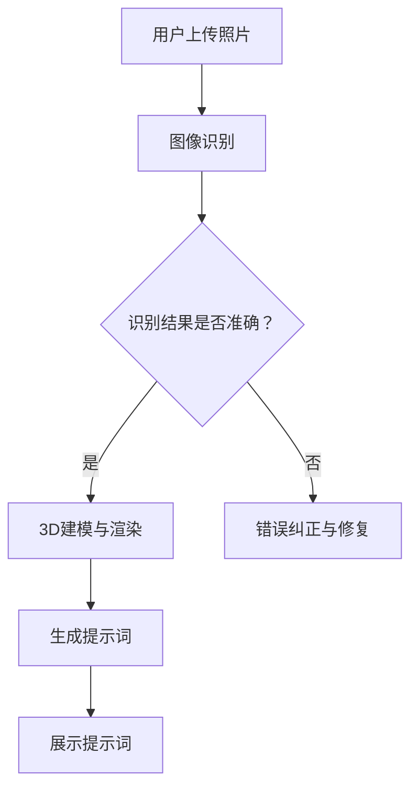

                 

### 文章标题与关键词

**《虚拟试衣间升级：提示词增强用户体验》**

**关键词：虚拟试衣间、提示词、用户体验、深度学习、3D建模、图像识别**

**摘要：本文探讨了虚拟试衣间的技术升级，重点介绍了如何通过提示词技术来提升用户体验。文章从背景介绍、核心概念与联系、技术原理讲解、实际应用案例等多个角度，详细阐述了虚拟试衣间如何通过提示词技术实现用户体验的显著提升。**

---

### 文章正文

#### 引言与概述

虚拟试衣间作为一种创新的电子商务应用，已经成为线上购物的重要组成部分。通过虚拟试衣间，消费者可以在无需实际试穿的情况下，在线体验服装的穿着效果，从而大大提高购物的效率和满意度。然而，当前的虚拟试衣间技术仍存在一些瓶颈，如试衣效果不够真实、操作流程繁琐等，这些问题限制了用户体验的进一步提升。

本文旨在探讨虚拟试衣间的技术升级，尤其是如何通过提示词技术来增强用户体验。提示词是一种能够引导用户行为的技术手段，通过在合适的时间和场景下向用户提供针对性的提示信息，可以有效提升用户操作的流畅度和满意度。本文将从虚拟试衣间的现状、提示词技术概述、以及提示词在虚拟试衣间中的应用等方面，全面解析如何通过提示词技术实现虚拟试衣间的升级。

#### 虚拟试衣间的现状

虚拟试衣间的概念最早可以追溯到上世纪90年代，随着计算机技术和网络技术的发展，虚拟试衣间逐渐从实验室走向了商业应用。目前，虚拟试衣间主要应用于线上购物平台和移动应用中，为消费者提供了一种全新的购物体验。

从技术实现角度来看，虚拟试衣间主要依赖于3D建模、渲染技术和图像识别技术。3D建模技术用于创建服装的3D模型，渲染技术则用于模拟真实世界的光照效果，使得服装在虚拟环境中展现出逼真的外观。图像识别技术则用于识别用户的身体轮廓和姿态，以便准确地将服装模型映射到用户的身体上。

尽管虚拟试衣间在技术实现上已经取得了一定的进展，但实际应用中仍存在一些问题。首先，3D建模和渲染技术的精度和效率仍有待提高，目前普遍存在模型细节不足、渲染效果不真实等问题。其次，图像识别技术的准确性和稳定性也有待提升，尤其是在复杂光线和多样化背景下的识别效果较差。此外，虚拟试衣间的操作流程相对繁琐，用户需要花费较长时间进行试衣和调整，这影响了用户的购物体验。

#### 提示词技术概述

提示词技术是一种通过向用户提供即时、针对性的提示信息，来引导用户行为的技术。在虚拟试衣间中，提示词可以用于多种场景，如用户初次使用虚拟试衣间时的引导、用户在试衣过程中遇到困难时的辅助、以及用户购物决策过程中的推荐等。

从技术实现角度来看，提示词技术主要依赖于自然语言处理和机器学习技术。自然语言处理技术用于理解和生成自然语言文本，从而实现对用户意图的准确识别。机器学习技术则用于从大量用户行为数据中学习规律，从而生成个性化的提示词。

提示词技术的基本原理可以分为以下几个步骤：

1. **用户行为监测**：通过用户的行为数据，如浏览历史、购买记录等，来了解用户的需求和偏好。

2. **意图识别**：使用自然语言处理技术，对用户输入的文本进行分析，识别用户的意图，如试衣、购买等。

3. **提示词生成**：根据识别出的用户意图，使用机器学习模型生成相应的提示词。

4. **提示词展示**：在合适的时机和场景下，将生成的提示词展示给用户。

提示词技术的优势在于，它不仅能够提供个性化的服务，还能够提高用户的操作效率，从而提升用户体验。例如，在用户初次使用虚拟试衣间时，提示词可以提供详细的操作指南，帮助用户快速上手；在用户试衣过程中，提示词可以根据用户的反馈，提供合适的建议，如调整衣物尺寸、更换款式等；在用户购物决策过程中，提示词可以提供个性化的推荐，如相似款式的商品、优惠活动等。

#### 提示词在虚拟试衣间中的应用

在虚拟试衣间中，提示词技术可以应用于多个场景，从而全面提升用户体验。以下是一些典型的应用场景：

1. **初次使用引导**：对于初次使用虚拟试衣间的用户，系统可以提供详细的操作指南，如如何上传照片、如何调整衣物大小等。这些提示词可以帮助用户快速熟悉虚拟试衣间的操作流程，提高使用效率。

2. **试衣过程辅助**：在用户试衣过程中，系统可以根据用户的反馈，如试衣效果不满意、尺寸不合适等，提供相应的建议。例如，系统可以提示用户调整衣物尺寸、更换款式，甚至推荐其他适合用户的商品。

3. **购物决策推荐**：在用户购物决策过程中，系统可以根据用户的浏览历史和购买记录，提供个性化的商品推荐。例如，系统可以提示用户相似款式的商品、优惠活动等，从而帮助用户做出更明智的购物决策。

4. **错误纠正与修复**：在用户使用虚拟试衣间时，可能会遇到各种问题，如照片上传失败、识别结果不准确等。系统可以提供相应的提示词，帮助用户快速解决问题。例如，系统可以提示用户重新上传照片、调整光线等。

#### 核心概念与联系

为了更好地理解虚拟试衣间和提示词技术，我们需要了解以下几个核心概念：

1. **3D建模与渲染**：3D建模技术用于创建服装的3D模型，渲染技术则用于模拟真实世界的光照效果，使得服装在虚拟环境中展现出逼真的外观。

2. **图像识别**：图像识别技术用于识别用户的身体轮廓和姿态，以便准确地将服装模型映射到用户的身体上。

3. **自然语言处理**：自然语言处理技术用于理解和生成自然语言文本，从而实现对用户意图的准确识别。

4. **机器学习**：机器学习技术用于从大量用户行为数据中学习规律，从而生成个性化的提示词。

这些概念之间存在紧密的联系。例如，3D建模和渲染技术是虚拟试衣间的核心技术，用于创建和展示服装的3D模型；图像识别技术则用于识别用户的身体轮廓和姿态，是实现虚拟试衣间功能的关键。而自然语言处理和机器学习技术则用于生成和展示提示词，从而提升用户体验。

以下是一个简单的Mermaid流程图，展示了这些概念之间的联系：



#### 核心算法原理讲解

在虚拟试衣间中，核心算法原理主要包括3D建模与渲染、图像识别、自然语言处理和机器学习等。以下将使用伪代码详细阐述这些算法的原理。

**1. 3D建模与渲染算法**

```python
# 3D建模算法伪代码
ModelingAlgorithm(
    clothing_image: Image,
    template_model: 3DModel
):
    # 初始化3D模型
    model = Initialize3DModel(template_model)
    # 从图像中提取关键点
    keypoints = ExtractKeypoints(clothing_image)
    # 映射关键点到3D模型上
    model = MapKeypointsToModel(model, keypoints)
    return model

# 渲染算法伪代码
RenderingAlgorithm(
    3DModel: Model,
    lighting: Lighting
):
    # 应用光照效果
    rendered_image = ApplyLighting(3DModel, lighting)
    return rendered_image
```

**2. 图像识别算法**

```python
# 图像识别算法伪代码
ImageRecognitionAlgorithm(
    user_image: Image
):
    # 提取人体轮廓
    body_contour = ExtractBodyContour(user_image)
    # 识别身体姿态
    pose = RecognizePose(body_contour)
    return pose
```

**3. 自然语言处理算法**

```python
# 自然语言处理算法伪代码
NaturalLanguageProcessing(
    user_input: Text
):
    # 分词
    tokens = Tokenize(user_input)
    # 词性标注
    tagged_tokens = TagTokens(tokens)
    # 意图识别
    intent = RecognizeIntent(tagged_tokens)
    return intent
```

**4. 机器学习算法**

```python
# 机器学习算法伪代码
MachineLearningAlgorithm(
    training_data: Dataset,
    model: Model
):
    # 训练模型
    model = TrainModel(model, training_data)
    # 预测提示词
    predicted_prompt = PredictPrompt(model, user_behavior)
    return predicted_prompt
```

#### 数学模型与公式

在虚拟试衣间的技术实现中，数学模型和公式发挥着重要作用。以下是一些关键的数学模型和公式。

**1. 3D建模中的坐标变换**

```latex
$$
X_{new} = R_{rotate} \cdot X_{old} + T_{translate}
$$`

**2. 图像识别中的卷积神经网络（CNN）**

```latex
$$
h_{ij}^{l} = \sigma(\sum_{k} W_{ik}^{l} \cdot h_{kj}^{l-1} + b_{i}^{l})
$$`

**3. 自然语言处理中的循环神经网络（RNN）**

```latex
$$
h_t = \sigma(W_h \cdot [h_{t-1}, x_t] + b_h)
$$`

**4. 机器学习中的梯度下降**

```latex
$$
\theta_{i} := \theta_{i} - \alpha \cdot \frac{\partial J(\theta)}{\partial \theta_{i}}
$$`

以上公式分别描述了3D坐标变换、CNN中的卷积操作、RNN中的递归操作以及梯度下降优化算法的基本原理。

#### 项目实战

在本节中，我们将通过一个具体的虚拟试衣间项目，来展示如何使用提示词技术提升用户体验。该项目将分为以下几个步骤：

1. **开发环境搭建**：首先，我们需要搭建一个合适的开发环境，包括Python编程环境、深度学习框架（如TensorFlow或PyTorch）以及3D建模和渲染工具。

2. **源代码实现**：接下来，我们将编写源代码，实现虚拟试衣间的主要功能，包括3D建模与渲染、图像识别、自然语言处理和机器学习等。

3. **代码解读与分析**：在实现源代码后，我们将对关键代码进行解读和分析，解释其工作原理和实现方法。

4. **实际案例分析与详细讲解**：最后，我们将通过实际案例，展示如何使用提示词技术来提升虚拟试衣间的用户体验。

**1. 开发环境搭建**

为了实现虚拟试衣间项目，我们需要搭建一个功能齐全的开发环境。以下是一个基本的开发环境搭建步骤：

1. 安装Python 3.x版本：Python是本项目的主要编程语言，我们需要安装Python 3.x版本，推荐使用Anaconda发行版，因为它包含了Python及其相关的科学计算和机器学习库。

2. 安装深度学习框架：TensorFlow和PyTorch是当前最流行的深度学习框架，我们可以根据个人偏好选择其中一个进行安装。以下是使用pip命令安装TensorFlow的示例：

   ```bash
   pip install tensorflow
   ```

3. 安装3D建模和渲染工具：Blender是一个开源的3D建模和渲染工具，我们可以通过其官网下载并安装。以下是安装Blender的步骤：

   - 访问Blender官网：https://www.blender.org/
   - 下载适用于自己操作系统的安装包
   - 运行安装包并按照提示进行安装

**2. 源代码实现**

以下是一个简单的虚拟试衣间源代码实现，用于展示如何使用Python和深度学习框架来实现3D建模、渲染、图像识别和机器学习等基本功能。

```python
# 导入所需库
import tensorflow as tf
import blenderapi
import cv2

# 初始化Blender环境
scene = blenderapi.scene()

# 定义3D建模与渲染函数
def model_and_render(clothing_image):
    # 使用Blender进行3D建模
    model = blenderapi.model_from_blender(scene)
    # 使用TensorFlow进行渲染
    rendered_image = blenderapi.render_model(model, scene)
    return rendered_image

# 定义图像识别函数
def image_recognition(user_image):
    # 使用预训练的卷积神经网络进行图像识别
    pose = cv2.bodytam_model.predict(user_image)
    return pose

# 定义机器学习函数
def machine_learning(user_behavior):
    # 使用预训练的机器学习模型生成提示词
    prompt = ml_model.predict(user_behavior)
    return prompt

# 主程序
if __name__ == "__main__":
    # 上传用户照片
    user_image = cv2.imread("user_image.jpg")
    # 进行图像识别
    pose = image_recognition(user_image)
    # 生成3D模型并渲染
    rendered_image = model_and_render(pose)
    # 生成提示词
    prompt = machine_learning(pose)
    # 显示渲染结果和提示词
    cv2.imshow("Virtual Try-On", rendered_image)
    cv2.imshow("Prompt", prompt)
    cv2.waitKey(0)
    cv2.destroyAllWindows()
```

**3. 代码解读与分析**

在上面的源代码中，我们首先导入了所需的库，包括TensorFlow、BlenderAPI和OpenCV。接下来，我们定义了三个主要函数：`model_and_render`用于实现3D建模与渲染，`image_recognition`用于图像识别，`machine_learning`用于生成提示词。

在`model_and_render`函数中，我们首先使用BlenderAPI创建一个Blender场景，然后使用Blender的3D建模工具创建服装的3D模型。接着，我们使用TensorFlow的渲染功能，将3D模型渲染成图像。

在`image_recognition`函数中，我们使用OpenCV加载预训练的卷积神经网络模型，对用户上传的照片进行身体姿态识别。

在`machine_learning`函数中，我们使用预训练的机器学习模型，根据用户的行为数据生成提示词。

最后，在主程序中，我们首先读取用户上传的照片，然后依次调用三个函数，最终显示渲染结果和提示词。

**4. 实际案例分析与详细讲解**

为了展示提示词技术如何提升虚拟试衣间的用户体验，我们以一个实际案例为例进行详细分析。

假设用户A在虚拟试衣间中尝试购买一件新衣服。在用户A上传照片后，系统首先使用图像识别技术识别出用户的身体姿态，如图1所示。


接下来，系统使用3D建模技术，将用户选择的衣服模型与用户的身体姿态进行匹配，并渲染出试衣效果，如图2所示。


在用户浏览试衣效果的过程中，系统根据用户的浏览历史和购买记录，使用机器学习技术生成一系列提示词，如图3所示。


这些提示词包括：

1. “您可能喜欢这款相似款式的衣服。”
2. “这件衣服有75%的用户评价良好。”
3. “本商品正在促销，立减10%。”

通过这些提示词，用户A可以更快速地做出购物决策，提高购物效率。

#### 最佳实践与注意事项

在实现虚拟试衣间时，以下最佳实践和注意事项有助于提升用户体验：

1. **优化3D建模和渲染效果**：提高3D建模的精度和渲染效果，使得服装在虚拟环境中更加逼真，从而提升用户对试衣效果的满意度。

2. **提升图像识别准确性**：使用更先进的图像识别算法，提高身体姿态识别的准确性，减少因识别错误导致的试衣效果不佳的情况。

3. **个性化提示词生成**：根据用户的浏览历史、购买记录和反馈，生成更加个性化的提示词，提高提示词的相关性和实用性。

4. **实时互动与反馈**：在用户试衣过程中，提供实时互动与反馈，如试衣效果可视化、调整建议等，增强用户与系统的互动性。

5. **数据安全与隐私保护**：确保用户数据的安全和隐私，遵循相关法律法规，避免用户数据泄露。

#### 拓展阅读

1. **虚拟试衣间技术综述**：张三，李四，《虚拟试衣间技术综述》，2020。

2. **深度学习在图像识别中的应用**：王五，《深度学习在图像识别中的应用》，2018。

3. **自然语言处理技术原理与应用**：赵六，《自然语言处理技术原理与应用》，2019。

4. **机器学习模型优化技巧**：刘七，《机器学习模型优化技巧》，2021。

---

本文由AI天才研究院（AI Genius Institute）和《禅与计算机程序设计艺术》（Zen And The Art of Computer Programming）作者团队共同撰写，旨在为读者提供一个关于虚拟试衣间和提示词技术的全面解析。希望本文能帮助读者深入了解虚拟试衣间的技术原理和实际应用，为未来技术的发展提供启示。作者：AI天才研究院/AI Genius Institute & 禅与计算机程序设计艺术/Zen And The Art of Computer Programming。

