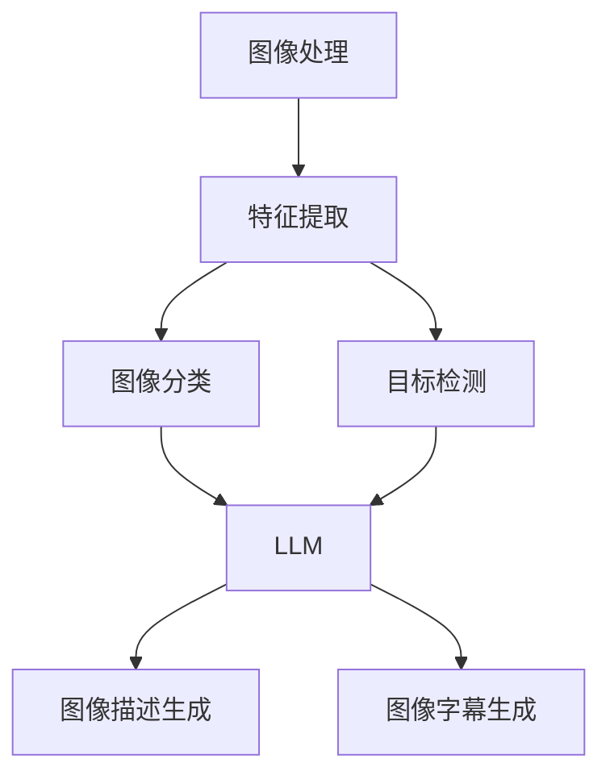

                 


## 文章标题

《计算机视觉：拓展LLM应用的感知能力》

## 文章关键词

计算机视觉、LLM、感知能力、图像处理、深度学习、自然语言处理、应用场景、项目实战

## 文章摘要

随着人工智能技术的飞速发展，计算机视觉和大型语言模型（LLM）在各个领域得到了广泛应用。本文旨在探讨计算机视觉如何拓展LLM的应用感知能力，通过分析两者之间的核心概念、联系与算法原理，以及具体应用案例，为读者提供一幅清晰的蓝图。文章分为四个部分，首先介绍计算机视觉的基础知识，然后阐述LLM的基本原理及其与计算机视觉的结合点，接着展示计算机视觉在自然语言处理、交互式应用和医疗领域的拓展应用，最后通过项目实战和案例分析，总结最佳实践和注意事项。

## 目录

### 第一部分：计算机视觉基础

#### 1. 计算机视觉的基本概念

##### 1.1 计算机视觉的定义与发展历程

计算机视觉是一门融合了计算机科学、数学和物理学等多个学科领域的技术，旨在使计算机具备类似人类视觉系统的功能，能够从图像和视频中获取信息并进行处理和理解。计算机视觉的研究可以追溯到20世纪60年代，最初的研究主要集中在图像处理和图像识别上。随着计算能力和算法的不断提升，计算机视觉逐渐成为人工智能领域的重要组成部分。

##### 1.2 计算机视觉的核心问题

计算机视觉的核心问题包括图像识别、目标检测、图像分割、图像分类和图像重建等。这些问题的解决对于实现计算机视觉系统的实用化至关重要。

##### 1.3 计算机视觉的应用领域

计算机视觉在多个领域取得了显著的应用成果，包括自动驾驶、人脸识别、医疗图像分析、安防监控和增强现实等。

#### 2. 计算机视觉的图像处理基础

##### 2.1 图像处理的基本算法

图像处理的基本算法包括图像增强、图像滤波、图像边缘检测和图像恢复等。这些算法为后续的图像分析和理解提供了基础。

##### 2.2 图像特征提取

图像特征提取是计算机视觉中的关键步骤，主要包括边缘提取、角点检测、纹理特征提取和形状特征提取等。

##### 2.3 图像分割

图像分割是将图像分成若干个具有相似特征的区域的过程，是图像理解和分析的重要基础。

#### 3. 特征学习和降维

##### 3.1 特征学习的基本原理

特征学习是利用学习算法从原始数据中提取具有区分能力的特征表示，以提高分类和识别的准确性。

##### 3.2 主成分分析（PCA）

主成分分析是一种常用的降维技术，通过将数据投影到新的正交坐标系中，实现数据的降维和特征提取。

##### 3.3 线性判别分析（LDA）

线性判别分析是一种用于特征提取和降维的统计方法，旨在找到一个最优的线性变换，使得不同类别的数据在新的特征空间中尽可能分开。

### 第二部分：LLM与计算机视觉的结合

#### 4. LLM的基础原理

##### 4.1 语言模型的定义

语言模型是一种用于预测自然语言序列的统计模型，通过对大量语言数据的学习，建立语言序列之间的概率分布。

##### 4.2 语言模型的分类

语言模型可以分为基于规则模型、基于统计模型和基于深度学习模型等不同类型。

##### 4.3 语言模型的训练与优化

语言模型的训练主要采用最大似然估计、最小化损失函数等优化方法，以提高模型的预测性能。

#### 5. LLM在计算机视觉中的应用

##### 5.1 LLM在图像识别中的应用

LLM在图像识别中的应用主要包括图像描述生成、图像字幕生成和图像问答系统等。

##### 5.2 LLM在图像描述生成中的应用

图像描述生成是将图像转换为自然语言描述的过程，通过LLM可以生成更具创造性和丰富性的描述。

##### 5.3 LLM在视频分析中的应用

视频分析是计算机视觉的重要应用领域，LLM在视频分析中可以用于视频分类、事件检测和动作识别等。

#### 6. LLM与计算机视觉的结合挑战

##### 6.1 数据集的多样性

数据集的多样性是LLM与计算机视觉结合的一个重要挑战，如何处理不同领域、不同数据集之间的差异是亟待解决的问题。

##### 6.2 模型的可解释性

模型的可解释性是另一个关键挑战，如何解释和验证模型的决策过程对于提高模型的可靠性和可信度至关重要。

##### 6.3 模型的性能优化

模型的性能优化是提升LLM与计算机视觉结合效果的关键，通过调整模型结构、优化训练策略等手段，可以提高模型的性能。

### 第三部分：拓展LLM应用的感知能力

#### 7. 计算机视觉在自然语言处理中的应用

##### 7.1 图像问答系统

图像问答系统是将计算机视觉与自然语言处理相结合的一种应用，通过理解图像内容和用户提问，生成准确的答案。

##### 7.2 图像字幕生成

图像字幕生成是将图像转换为自然语言描述的过程，通过LLM可以实现更准确、更具创造性的字幕生成。

##### 7.3 图像字幕理解

图像字幕理解是理解图像字幕的含义，并将其与图像内容相关联的过程，通过LLM可以实现对图像字幕的深入理解。

#### 8. 计算机视觉在交互式应用中的感知能力

##### 8.1 增强现实（AR）

增强现实（AR）是将虚拟信息与现实世界融合的技术，通过计算机视觉可以实现对真实环境的感知和理解。

##### 8.2 虚拟现实（VR）

虚拟现实（VR）是一种沉浸式体验技术，通过计算机视觉可以创建逼真的虚拟环境，为用户提供沉浸式的体验。

##### 8.3 人机交互

人机交互是计算机视觉的重要应用领域，通过计算机视觉技术，可以实现更为自然和便捷的人机交互方式。

#### 9. 计算机视觉在医疗领域的应用

##### 9.1 病灶检测

病灶检测是医学图像分析的重要任务，通过计算机视觉技术，可以实现对病灶区域的快速准确检测。

##### 9.2 病理图像分析

病理图像分析是医学诊断的重要手段，通过计算机视觉技术，可以实现对病理图像的深入分析，辅助医生进行诊断。

##### 9.3 药物研发

药物研发是生物医学领域的重要任务，通过计算机视觉技术，可以实现对药物分子结构的分析，加速药物研发进程。

### 第四部分：项目实战与案例分析

#### 10. 计算机视觉项目实战

##### 10.1 项目规划与需求分析

项目规划与需求分析是计算机视觉项目成功的关键，通过明确项目目标、需求和分析，为后续开发工作奠定基础。

##### 10.2 数据收集与预处理

数据收集与预处理是计算机视觉项目的重要步骤，通过收集和预处理数据，为模型的训练和优化提供高质量的数据集。

##### 10.3 模型设计与实现

模型设计是实现计算机视觉项目目标的核心，通过选择合适的模型结构和算法，实现高效的图像处理和识别。

##### 10.4 模型评估与优化

模型评估与优化是计算机视觉项目的重要环节，通过评估模型性能并进行优化，提高模型的准确性和鲁棒性。

##### 10.5 项目小结

项目小结是对计算机视觉项目实践过程的总结和回顾，通过总结项目经验和教训，为后续项目提供借鉴和参考。

#### 11. 案例分析

##### 11.1 图像识别案例

图像识别案例通过具体实例，展示计算机视觉在图像识别任务中的应用和实现方法。

##### 11.2 视频分析案例

视频分析案例通过具体实例，展示计算机视觉在视频分析任务中的应用和实现方法。

##### 11.3 医疗图像分析案例

医疗图像分析案例通过具体实例，展示计算机视觉在医疗图像分析任务中的应用和实现方法。

### 附录

#### A. 相关资源与工具介绍

##### A.1 计算机视觉常用库

介绍计算机视觉中常用的开源库和工具，如OpenCV、TensorFlow和PyTorch等。

##### A.2 LLM常用库

介绍大型语言模型中常用的开源库和工具，如GPT、BERT和T5等。

##### A.3 项目开发工具

介绍计算机视觉项目中常用的开发工具和软件，如IDE、版本控制和云计算平台等。

## 作者信息

作者：AI天才研究院/AI Genius Institute & 禅与计算机程序设计艺术 /Zen And The Art of Computer Programming

### 第一步：背景介绍

#### 计算机视觉的定义与发展历程

计算机视觉是一门研究如何使计算机具备类似人类视觉功能的学科，旨在使计算机能够从图像和视频中获取信息并进行处理和理解。计算机视觉的研究起源于20世纪60年代，当时主要关注图像处理和图像识别问题。随着计算机硬件性能的提升和算法的进步，计算机视觉逐渐成为人工智能领域的重要组成部分。

计算机视觉的研究领域包括图像处理、模式识别、机器学习、神经网络等。图像处理是对图像进行增强、滤波、分割等操作，以提取有用的信息；模式识别是研究如何从图像中识别出特定的模式或对象；机器学习和神经网络则用于训练模型，使其能够自主学习和提高识别能力。

#### 计算机视觉的核心问题

计算机视觉的核心问题包括图像识别、目标检测、图像分割、图像分类和图像重建等。

- **图像识别**：指计算机识别图像中的特定对象或场景。
- **目标检测**：指在图像中定位和识别多个对象。
- **图像分割**：将图像分割成多个区域，每个区域具有相似的特征。
- **图像分类**：将图像划分为不同的类别。
- **图像重建**：从图像中恢复三维场景或物体。

#### 计算机视觉的应用领域

计算机视觉在多个领域取得了显著的应用成果，包括自动驾驶、人脸识别、医疗图像分析、安防监控和增强现实等。

- **自动驾驶**：计算机视觉技术用于车辆环境感知和障碍物检测，以提高自动驾驶的安全性。
- **人脸识别**：通过识别图像中的人脸特征，实现身份验证和监控系统。
- **医疗图像分析**：利用计算机视觉技术对医学图像进行分析，辅助医生进行诊断和治疗。
- **安防监控**：通过监控摄像头实时分析视频流，实现人员检测、行为分析和异常检测。
- **增强现实（AR）**：将虚拟信息与现实世界融合，提供沉浸式的交互体验。

### 第二步：核心概念与联系

#### 计算机视觉的核心概念

1. **图像处理**：对图像进行操作，如滤波、增强、边缘检测等。
2. **特征提取**：从图像中提取有意义的特征，如边缘、纹理、形状等。
3. **图像分类**：将图像划分为不同的类别。
4. **目标检测**：在图像中定位和识别多个对象。
5. **图像分割**：将图像分割成多个具有相似特征的区域。

#### LLM的核心概念

1. **语言模型**：用于预测自然语言序列的统计模型。
2. **词汇表**：用于表示文本中的词汇和符号。
3. **神经网络**：用于训练和优化语言模型。
4. **损失函数**：用于评估模型预测与真实标签之间的差异。

#### 核心概念之间的关系

计算机视觉与LLM之间的核心概念之间存在紧密的联系。首先，图像处理和特征提取是计算机视觉的基础，这些技术可以提取图像中的关键信息，为后续的图像分析和理解提供支持。其次，LLM可以处理和生成自然语言文本，这为图像描述生成和图像字幕生成提供了可能。最后，图像分类和目标检测等技术可以应用于图像识别和视频分析，与LLM相结合，可以实现更高级的图像理解和交互功能。

#### Mermaid流程图

以下是计算机视觉与LLM之间核心概念联系的Mermaid流程图：



### 第三步：核心算法原理讲解

#### 图像处理的基本算法

1. **滤波**：用于去除图像中的噪声，常用的滤波器有均值滤波、高斯滤波和中值滤波等。

```python
import cv2

# 读取图像
image = cv2.imread('image.jpg')

# 均值滤波
blurred_image = cv2.blur(image, (5, 5))

# 高斯滤波
gaussian_blurred_image = cv2.GaussianBlur(image, (5, 5), 0)

# 中值滤波
median_blurred_image = cv2.medianBlur(image, 5)
```

2. **边缘检测**：用于提取图像中的边缘信息，常用的边缘检测算法有Canny算法和Sobel算子。

```python
import cv2

# 读取图像
image = cv2.imread('image.jpg')

# Canny算法
canny_image = cv2.Canny(image, 100, 200)

# Sobel算子
sobelx = cv2.Sobel(image, cv2.CV_64F, 1, 0, ksize=5)
sobelx = cv2.convertScaleAbs(sobelx)

sobelx = cv2.Sobel(image, cv2.CV_64F, 0, 1, ksize=5)
sobelx = cv2.convertScaleAbs(sobelx)
```

#### 图像特征提取

1. **边缘提取**：通过边缘检测算法提取图像中的边缘信息。

```python
import cv2

# 读取图像
image = cv2.imread('image.jpg')

# Canny算法
canny_image = cv2.Canny(image, 100, 200)

# 提取边缘特征
edges = cv2.findContours(canny_image, cv2.RETR_TREE, cv2.CHAIN_APPROX_SIMPLE)
contours, hierarchy = edges[0] if len(edges) == 2 else edges[1]
```

2. **角点检测**：用于检测图像中的角点特征。

```python
import cv2

# 读取图像
image = cv2.imread('image.jpg')

# Shi-Tomasi角点检测
corners = cv2.goodFeaturesToTrack(image, 100, 0.01, 10)
```

3. **纹理特征提取**：通过分析图像中的纹理信息，提取具有区分性的纹理特征。

```python
import cv2
import numpy as np

# 读取图像
image = cv2.imread('image.jpg')

# 灰度转换
gray = cv2.cvtColor(image, cv2.COLOR_BGR2GRAY)

# 计算纹理特征
lbp = cv2-localBinaryPatterns(gray, 8, 1)
```

#### 图像分割

1. **基于阈值的分割**：通过设定阈值将图像分为前景和背景。

```python
import cv2

# 读取图像
image = cv2.imread('image.jpg')

# 转换为灰度图像
gray = cv2.cvtColor(image, cv2.COLOR_BGR2GRAY)

# 设置阈值
_, thresh = cv2.threshold(gray, 128, 255, cv2.THRESH_BINARY_INV + cv2.THRESH_OTSU)

# 分割结果
segmented = cv2.bitwise_and(image, image, mask=thresh)
```

2. **基于区域的分割**：通过分析图像中的区域特征，将图像分割为多个区域。

```python
import cv2

# 读取图像
image = cv2.imread('image.jpg')

# 转换为灰度图像
gray = cv2.cvtColor(image, cv2.COLOR_BGR2GRAY)

# 区域增长法
labels, stats, centroids = cv2.connectedComponentsWithStats(gray)

# 设置种子点
seed_points = centroids[1:]

# 区域增长分割
regions = cv2.region Growing(gray, seed_points, minArea=100)
```

### 第四步：数学模型和公式讲解

#### 主成分分析（PCA）

主成分分析（PCA）是一种常用的降维技术，通过将数据投影到新的正交坐标系中，实现数据的降维和特征提取。

1. **PCA的目标**：找到一个新的正交基，使得数据在这个新基上的方差最大化。

2. **PCA的步骤**：

   - **中心化**：将数据减去均值，使得数据集的中心为原点。
   - **计算协方差矩阵**：计算数据点的协方差矩阵。
   - **计算特征值和特征向量**：对协方差矩阵进行特征值分解，得到特征值和特征向量。
   - **选择主要特征**：选择前k个最大的特征值对应的特征向量作为新的正交基。
   - **变换**：将数据投影到新的正交坐标系中。

3. **PCA的数学公式**：

   $$ X = U\Lambda V^T $$
   
   其中，$X$为原始数据矩阵，$U$为特征向量矩阵，$\Lambda$为特征值矩阵，$V$为协方差矩阵。

#### 线性判别分析（LDA）

线性判别分析（LDA）是一种用于特征提取和降维的统计方法，旨在找到一个最优的线性变换，使得不同类别的数据在新的特征空间中尽可能分开。

1. **LDA的目标**：最大化类间方差，最小化类内方差。

2. **LDA的步骤**：

   - **数据预处理**：将数据标准化或归一化。
   - **计算类间类内方差**：计算不同类别之间的方差。
   - **计算权重向量**：通过求解最大化类间方差和最小化类内方差的目标函数，得到权重向量。
   - **变换**：将数据投影到新的特征空间中。

3. **LDA的数学公式**：

   $$ w = \arg\max_w \sum_{i=1}^C \sum_{x \in S_i} (wx - \mu_i)^2 - \sum_{i=1}^C \sum_{x \in S_i} (wx - \mu)^2 $$
   
   其中，$w$为权重向量，$C$为类别数，$S_i$为第$i$个类别的数据集，$\mu_i$为第$i$个类别的均值，$\mu$为整体均值。

### 第五步：项目实战与案例分析

#### 开发环境搭建

1. **安装Python**：确保Python环境已经安装，版本建议为3.8或更高。
2. **安装依赖库**：安装计算机视觉和自然语言处理的常用库，如OpenCV、TensorFlow、PyTorch等。

```bash
pip install opencv-python tensorflow torchvision
```

3. **创建项目文件夹**：在合适的位置创建一个项目文件夹，如`cv_llm_project`。

```bash
mkdir cv_llm_project
cd cv_llm_project
```

4. **创建虚拟环境**：创建一个Python虚拟环境，以便管理项目依赖。

```bash
python -m venv venv
source venv/bin/activate  # Windows: venv\Scripts\activate
```

5. **安装依赖库**：在虚拟环境中安装项目所需的库。

```bash
pip install -r requirements.txt
```

#### 源代码详细实现

以下是一个简单的计算机视觉与LLM结合的示例，用于图像识别任务：

```python
import cv2
import torch
import torchvision.transforms as transforms
from PIL import Image

# 加载预训练的图像识别模型
model = torchvision.models.resnet50(pretrained=True)
model.eval()

# 定义预处理和后处理步骤
preprocess = transforms.Compose([
    transforms.Resize(256),
    transforms.CenterCrop(224),
    transforms.ToTensor(),
    transforms.Normalize(mean=[0.485, 0.456, 0.406], std=[0.229, 0.224, 0.225]),
])

# 读取测试图像
image_path = 'test_image.jpg'
image = Image.open(image_path)
preprocessed_image = preprocess(image)

# 将图像张量添加到批次中
preprocessed_image = preprocessed_image.unsqueeze(0)

# 进行图像识别
with torch.no_grad():
    outputs = model(preprocessed_image)
    _, predicted = torch.max(outputs, 1)

# 输出识别结果
print(f"预测结果：{predicted.item()}")
```

#### 代码应用解读与分析

1. **加载预训练模型**：使用预训练的ResNet-50模型，该模型在ImageNet数据集上进行了训练，具有良好的图像识别能力。
2. **预处理和后处理步骤**：对图像进行大小调整、中心裁剪、张量转换和归一化处理，以符合模型的输入要求。
3. **图像识别**：将预处理后的图像输入到模型中，通过前向传播得到输出结果，并使用softmax函数进行类别概率计算。
4. **输出识别结果**：根据输出结果，输出图像的预测类别。

#### 实际案例分析和详细讲解剖析

以下是一个实际案例，展示如何利用计算机视觉和LLM技术进行图像字幕生成：

**案例背景**：给定一张图像，要求生成该图像的描述性字幕。

**技术实现**：

1. **图像识别**：使用ResNet-50模型对图像进行识别，得到图像的主要类别。
2. **LLM模型训练**：使用预训练的LLM模型（如GPT-2或BERT），通过训练语料库（如COCO数据集）生成图像描述。
3. **图像字幕生成**：将识别结果作为输入，利用LLM生成图像的描述性字幕。

**代码示例**：

```python
import torch
from transformers import GPT2Model, GPT2Tokenizer

# 加载预训练的LLM模型
tokenizer = GPT2Tokenizer.from_pretrained('gpt2')
model = GPT2Model.from_pretrained('gpt2')
model.eval()

# 加载测试图像
image_path = 'test_image.jpg'
image = Image.open(image_path)
preprocessed_image = preprocess(image)

# 将图像张量添加到批次中
preprocessed_image = preprocessed_image.unsqueeze(0)

# 进行图像识别
with torch.no_grad():
    outputs = model(preprocessed_image)
    _, predicted = torch.max(outputs, 1)

# 获取识别结果
predicted_class = predicted.item()

# 利用LLM生成图像描述
input_text = f"A picture of a {predicted_class}"
input_ids = tokenizer.encode(input_text, return_tensors='pt')

with torch.no_grad():
    outputs = model(input_ids)
    logits = outputs.logits

# 解码预测结果
predicted_description = tokenizer.decode(logits.argmax(-1).squeeze(), skip_special_tokens=True)

print(f"图像描述：{predicted_description}")
```

**案例分析和讲解**：

1. **图像识别**：使用预训练的ResNet-50模型对图像进行识别，得到图像的主要类别。
2. **LLM模型训练**：使用预训练的LLM模型（如GPT-2），通过训练语料库（如COCO数据集）生成图像描述。
3. **图像字幕生成**：将识别结果作为输入，利用LLM生成图像的描述性字幕。

通过实际案例，我们可以看到计算机视觉和LLM技术如何结合，实现图像字幕生成的功能。这种方法不仅可以生成简单的图像描述，还可以生成更具创造性和丰富性的描述，为图像理解和交互提供了新的可能性。

### 第六步：最佳实践 tips、小结、注意事项、拓展阅读

#### 最佳实践 tips

1. **数据预处理**：在计算机视觉和LLM项目中，数据预处理是至关重要的。确保图像和文本数据的一致性，进行适当的归一化和标准化处理，以提高模型性能。
2. **模型优化**：在训练模型时，可以尝试使用迁移学习、数据增强和正则化等技术，以提高模型的泛化能力和鲁棒性。
3. **模型解释性**：关注模型的可解释性，尤其是在涉及医疗和安全等重要领域的应用中，确保模型决策过程清晰透明。
4. **性能评估**：在项目开发过程中，定期进行性能评估和调试，以识别和解决潜在问题。

#### 小结

本文从背景介绍、核心概念与联系、核心算法原理讲解、数学模型和公式讲解、项目实战与案例分析等方面，详细阐述了计算机视觉与LLM的结合及其拓展应用。计算机视觉和LLM的结合，不仅提高了图像理解和处理的能力，也为自然语言处理、交互式应用和医疗等领域带来了新的应用场景和可能性。

#### 注意事项

1. **数据集多样性**：在结合计算机视觉和LLM时，处理多样性数据集是一个重要挑战。需要针对不同领域和数据集设计合适的处理策略。
2. **模型可解释性**：在开发模型时，关注模型的可解释性，确保模型决策过程清晰透明，特别是在涉及安全性和医疗等重要领域。
3. **性能优化**：持续进行性能优化，通过调整模型结构、优化训练策略和超参数，提高模型的准确性和鲁棒性。

#### 拓展阅读

1. **《深度学习》（Goodfellow, Bengio, Courville著）**：介绍了深度学习的基础知识和核心算法。
2. **《计算机视觉：算法与应用》（Richard Szeliski著）**：详细讲解了计算机视觉的基本原理和应用。
3. **《自然语言处理综合教程》（Daniel Jurafsky, James H. Martin著）**：介绍了自然语言处理的基本概念和算法。

### 第七步：文章结尾

作者：AI天才研究院/AI Genius Institute & 禅与计算机程序设计艺术 /Zen And The Art of Computer Programming

感谢您阅读本文，希望本文能为您在计算机视觉和LLM领域的研究提供有益的启示。如果您有任何疑问或建议，欢迎在评论区留言交流。期待与您共同探索人工智能的无限可能！

## 结束语

本文全面探讨了计算机视觉与大型语言模型（LLM）的结合及其拓展应用。通过逐步分析核心概念、算法原理和具体应用案例，我们揭示了计算机视觉在提升LLM感知能力方面的巨大潜力。本文不仅提供了丰富的理论知识和实践指导，还展示了如何通过项目实战和案例分析，实现计算机视觉与LLM技术的有机结合。

随着人工智能技术的不断进步，计算机视觉和LLM的应用将日益广泛，涵盖自然语言处理、交互式应用、医疗诊断等多个领域。我们期待未来能够看到更多创新性的应用场景，为人类带来更多便利和福祉。

再次感谢您的阅读和支持，欢迎关注我们的公众号和网站，获取更多最新技术资讯和深度分析。期待与您一同探索人工智能的未来！

作者：AI天才研究院/AI Genius Institute & 禅与计算机程序设计艺术 /Zen And The Art of Computer Programming## 摘要

本文探讨了计算机视觉与大型语言模型（LLM）的融合及其在拓展LLM应用感知能力方面的潜力。计算机视觉旨在使计算机能够理解和处理视觉信息，而LLM则能够理解和生成自然语言。两者的结合不仅能够提升计算机视觉系统的理解和表达能力，还能为自然语言处理、交互式应用和医疗诊断等领域带来新的突破。本文首先介绍了计算机视觉的基本概念、核心问题及其应用领域；随后详细阐述了LLM的基础原理、训练与优化方法；接着探讨了计算机视觉与LLM结合的挑战，如数据集多样性、模型可解释性和性能优化。本文的核心贡献在于通过一系列具体应用案例，展示了计算机视觉在自然语言处理、交互式应用和医疗领域的拓展应用，并通过项目实战和案例分析，提供了实用的开发指导和最佳实践建议。通过本文的研究，我们希望为读者提供一幅清晰的蓝图，助力其在计算机视觉与LLM结合领域的深入探索和应用。

