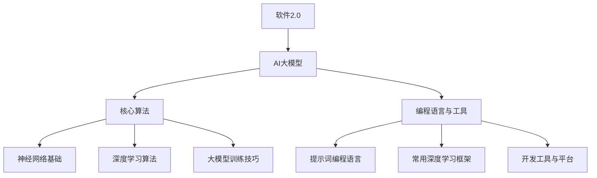

                 


### 1. 设计AI大模型软件2.0时代的提示词编程语言

#### 1.1 确定书的主题和目标受众

首先，我们来明确这本书的主题和目标受众。书名《设计AI大模型软件2.0时代的提示词编程语言》已经清晰地指出了主题是关于AI大模型在软件2.0时代的应用，并关注提示词编程语言的开发。目标受众可能包括AI开发者、数据科学家、软件工程师等，他们对于AI大模型的应用和编程语言有较高的需求。

#### 1.2 划分主要章节

根据主题和目标受众，我们将这本书的主要章节分为四个部分：

- **第一部分：软件2.0与AI大模型概述**：介绍软件2.0与AI大模型的基本概念、发展历程和架构设计。
- **第二部分：AI大模型技术基础**：讲解AI大模型的核心算法、编程语言与工具，以及优化与调试技巧。
- **第三部分：企业级AI应用开发准备**：分析企业级AI应用的需求、开发流程和管理与维护。
- **第四部分：项目实战与案例分析**：通过实际项目案例，展示AI大模型在企业级应用中的实现和挑战。

#### 1.3 设计每个章节的子章节

接下来，我们详细设计每个章节的子章节，确保内容的完整性和逻辑性。

### 第一部分：软件2.0与AI大模型概述

#### 1.1.1 软件2.0与AI大模型的基本概念
- **1.1.1.1** 什么是软件2.0
- **1.1.1.2** 什么是AI大模型
- **1.1.1.3** 软件2.0与AI大模型的关系
- **1.1.1.4** 软件2.0的发展历程
- **1.1.1.5** AI大模型的定义与特点
- **1.1.1.6** 软件2.0与AI大模型的融合

#### 1.2.1 软件2.0时代的发展历程
- **1.2.1.1** 软件1.0时代的特征
- **1.2.1.2** 软件2.0时代的特征
- **1.2.1.3** 软件2.0与AI大模型的融合

#### 1.3.1 AI大模型的架构设计
- **1.3.1.1** AI大模型的核心组件
- **1.3.1.2** AI大模型的层次结构
- **1.3.1.3** AI大模型的设计原则

### 第二部分：AI大模型技术基础

#### 2.1.1 AI大模型的核心算法
- **2.1.1.1** 神经网络基础
- **2.1.1.2** 深度学习算法
- **2.1.1.3** 大模型训练技巧

#### 2.2.1 AI大模型的编程语言与工具
- **2.2.1.1** 提示词编程语言
- **2.2.1.2** 常用深度学习框架
- **2.2.1.3** 开发工具与平台

#### 2.3.1 AI大模型的优化与调试
- **2.3.1.1** 优化算法
- **2.3.1.2** 调试技巧
- **2.3.1.3** 性能评估

### 第三部分：企业级AI应用开发准备

#### 3.1.1 企业级AI应用的需求分析
- **3.1.1.1** 企业的AI应用场景
- **3.1.1.2** 企业的AI需求分析
- **3.1.1.3** 企业的AI发展策略

#### 3.2.1 企业级AI应用的开发流程
- **3.2.1.1** AI应用的需求定义
- **3.2.1.2** AI应用的设计方案
- **3.2.1.3** AI应用的开发与测试

#### 3.3.1 企业级AI应用的管理与维护
- **3.3.1.1** AI应用的部署与上线
- **3.3.1.2** AI应用的性能监控
- **3.3.1.3** AI应用的持续优化

### 第四部分：项目实战与案例分析

#### 4.1.1 项目实战案例1：智能客服系统
- **4.1.1.1** 项目背景
- **4.1.1.2** 项目需求
- **4.1.1.3** 项目实现

#### 4.2.1 项目实战案例2：智能推荐系统
- **4.2.1.1** 项目背景
- **4.2.1.2** 项目需求
- **4.2.1.3** 项目实现

#### 4.3.1 项目实战案例3：智能语音助手
- **4.3.1.1** 项目背景
- **4.3.1.2** 项目需求
- **4.3.1.3** 项目实现

### 1.4 整体架构设计

最后，我们设计一张Mermaid流程图，展示AI大模型的核心组件和它们之间的联系。这将有助于读者更好地理解AI大模型的整体架构。



通过以上的设计，我们构建了一个清晰、完整的目录大纲，为后续的内容撰写和文章的整体结构奠定了基础。在接下来的写作过程中，我们将逐步深入探讨每个章节的核心内容，以确保文章的逻辑清晰、内容丰富且具有实际应用价值。

---

### 2. 软件2.0与AI大模型的基本概念

#### 2.1 什么是软件2.0

软件2.0是相对于软件1.0的一种新型软件开发模式。软件1.0时代，计算机软件主要是以功能为中心，注重实现特定的业务流程和数据处理需求。而软件2.0则更加注重用户交互和用户体验，强调软件的可扩展性和可定制性，以及软件在云计算、大数据和物联网等新兴技术环境中的适应能力。

软件2.0的核心理念包括：

- **用户体验（UX）优先**：软件的设计和开发更加注重用户的实际使用感受，以用户为中心，不断优化用户体验。
- **云计算和分布式计算**：软件2.0利用云计算和分布式计算技术，实现软件的高可用性和可伸缩性。
- **大数据处理能力**：软件2.0具备处理海量数据的能力，支持复杂的数据分析和实时处理。
- **模块化和可扩展性**：软件2.0采用模块化设计，方便后续的功能扩展和系统升级。

#### 2.2 什么是AI大模型

AI大模型是指具有大规模参数、能够处理复杂数据模型的人工智能模型。与传统的小型模型相比，AI大模型具有更强的学习能力和泛化能力，能够在多种场景下实现高性能的预测和决策。

AI大模型的特点包括：

- **大规模参数**：AI大模型通常包含数十亿到数万亿个参数，能够捕捉数据中的细微变化。
- **深度学习架构**：AI大模型采用深度学习架构，通过多层神经网络实现数据的高效处理和特征提取。
- **自适应学习能力**：AI大模型具备自适应学习能力，可以根据新的数据进行调整和优化。
- **泛化能力**：AI大模型能够应用于多种不同场景和数据类型，具有较强的泛化能力。

#### 2.3 软件2.0与AI大模型的关系

软件2.0与AI大模型之间存在密切的联系，两者共同推动着人工智能技术在软件开发中的应用。

- **技术融合**：AI大模型技术的引入，使得软件2.0在数据处理、智能交互等方面得到了显著提升。AI大模型可以用于实现更加智能化的软件功能，如自然语言处理、图像识别、智能推荐等。
- **需求驱动**：软件2.0时代用户对于软件的智能化需求日益增长，AI大模型的应用成为满足这一需求的最佳选择。通过AI大模型，软件2.0能够提供更加个性化和智能化的服务。
- **发展协同**：软件2.0与AI大模型的发展相互促进。软件2.0为AI大模型提供了丰富的应用场景和数据支持，而AI大模型的进步又推动了软件2.0的技术创新。

### 总结

通过以上分析，我们可以看到软件2.0和AI大模型在概念上有着明显的区别，但在实际应用中，它们相互融合、相互促进，共同推动了人工智能在软件开发中的应用和发展。在接下来的章节中，我们将进一步探讨AI大模型的技术基础和实际应用，帮助读者更好地理解和应用AI大模型技术。

---

### 2.2 软件2.0时代的发展历程

#### 2.2.1 软件1.0时代的特征

软件1.0时代主要是指在计算机技术发展的早期阶段，计算机软件以功能为中心，注重实现特定的业务流程和数据处理需求。这一时期的软件具有以下特征：

- **功能导向**：软件1.0的设计和开发主要关注功能实现，注重满足特定业务需求和数据处理任务。
- **封闭系统**：软件1.0通常是一个独立的、封闭的系统，不便于与其他系统进行集成和交互。
- **单点故障**：由于软件1.0没有考虑到高可用性和容错性，一旦系统出现故障，可能会导致整个业务中断。
- **低扩展性**：软件1.0的设计缺乏灵活性，难以适应业务需求的变化和扩展。

#### 2.2.2 软件2.0时代的特征

软件2.0时代是在互联网和云计算技术发展的背景下出现的，它标志着软件发展进入了一个新的阶段。软件2.0时代的特征包括：

- **用户体验优先**：软件2.0注重用户体验，以用户需求为中心，不断优化软件界面和交互设计。
- **云计算和分布式计算**：软件2.0利用云计算和分布式计算技术，实现软件的高可用性和可伸缩性。
- **模块化和可扩展性**：软件2.0采用模块化设计，方便后续的功能扩展和系统升级。
- **开放和集成**：软件2.0支持与其他系统和服务的集成，便于实现业务流程的自动化和智能化。

#### 2.2.3 软件2.0与AI大模型的融合

软件2.0与AI大模型的融合主要体现在以下几个方面：

- **数据处理能力提升**：软件2.0利用AI大模型强大的数据处理能力，实现对海量数据的分析和挖掘，为用户提供更智能化的服务。
- **智能交互**：AI大模型的应用使得软件2.0具备智能交互能力，能够更好地理解和满足用户需求，提供个性化服务。
- **自动化和智能化**：通过AI大模型的应用，软件2.0能够实现业务流程的自动化和智能化，提高业务效率和用户体验。
- **持续优化**：AI大模型具备自适应学习能力，可以根据用户反馈和实际使用情况不断优化软件功能和服务质量。

#### 2.2.3.1 软件2.0与AI大模型融合的驱动力

软件2.0与AI大模型融合的驱动力主要来自以下几个方面：

- **技术进步**：云计算、大数据、物联网等技术的快速发展，为软件2.0与AI大模型的融合提供了技术基础。
- **用户需求**：随着互联网的普及和用户需求的多样化，软件2.0和AI大模型的应用成为满足用户需求的有效手段。
- **商业价值**：AI大模型的应用能够为企业带来显著的商业价值，提高业务效率和用户体验，吸引更多用户和客户。

### 总结

软件2.0时代的发展历程展示了软件从功能导向向用户体验优先、从封闭系统向开放集成、从低扩展性向模块化和可扩展性的转变。与AI大模型的融合，进一步提升了软件的数据处理能力、智能交互和自动化水平，推动了软件技术的不断创新和发展。在接下来的章节中，我们将进一步探讨AI大模型的架构设计和核心技术，为读者提供更深入的见解。

---

### 2.3 AI大模型的架构设计

#### 2.3.1 AI大模型的核心组件

AI大模型的核心组件主要包括：

- **数据输入层**：负责接收和处理输入数据，将其转化为模型可以理解和处理的格式。
- **数据预处理层**：对输入数据进行清洗、归一化、特征提取等操作，提高数据质量，为后续的模型训练提供优质的数据。
- **神经网络层**：由多层神经网络组成，通过前向传播和反向传播算法，实现数据的特征提取和模式识别。
- **输出层**：将神经网络处理后的结果转化为实际应用中的预测或决策。

#### 2.3.2 AI大模型的层次结构

AI大模型的层次结构可以分为以下几个部分：

- **输入层**：接收外部输入的数据，如文本、图像、声音等。
- **特征提取层**：对输入数据进行特征提取和转换，使其适合后续的神经网络处理。
- **隐藏层**：通过多层神经网络进行特征学习和模式识别，隐藏层负责将输入数据映射到输出数据。
- **输出层**：将隐藏层处理后的数据映射到具体的输出结果，如分类标签、预测值等。

#### 2.3.3 AI大模型的设计原则

设计AI大模型时，应遵循以下原则：

- **可扩展性**：设计时应考虑模型的扩展性，以便在需要时添加更多的神经网络层或增加参数。
- **模块化**：将模型的不同部分分解为独立的模块，便于维护和优化。
- **可解释性**：尽量提高模型的可解释性，以便研究人员和开发者能够理解模型的工作原理和决策过程。
- **高效性**：设计时应考虑模型的高效性，包括训练和推理速度，以便在实际应用中快速部署和使用。

### 2.3.4 AI大模型的关键技术

AI大模型的关键技术包括：

- **深度学习算法**：深度学习算法是AI大模型的核心技术，包括多层感知器（MLP）、卷积神经网络（CNN）、循环神经网络（RNN）等。
- **大规模数据训练**：通过大规模数据训练，可以提升模型的泛化能力和准确性。
- **优化算法**：优化算法用于调整模型的参数，以提高模型的性能和效率，常用的优化算法包括随机梯度下降（SGD）、Adam优化器等。
- **模型压缩与加速**：通过模型压缩和加速技术，可以减小模型的存储空间和计算复杂度，提高模型的部署效率和运行速度。

### 总结

AI大模型的架构设计涉及多个核心组件和层次结构，通过深度学习算法、大规模数据训练、优化算法和模型压缩与加速等关键技术，实现了对复杂数据的智能处理和模式识别。在接下来的章节中，我们将进一步探讨AI大模型的编程语言与工具，为读者提供更全面的AI大模型技术知识。

---

### 2.4 AI大模型的核心算法

#### 2.4.1 神经网络基础

神经网络（Neural Network，NN）是人工智能领域的基础算法之一，它模仿人脑的结构和功能，通过大量的神经元（节点）和神经元之间的连接（边）进行信息的传递和处理。

- **基本结构**：神经网络的基本结构包括输入层、隐藏层和输出层。输入层接收外部输入，隐藏层进行特征提取和变换，输出层生成预测结果。
- **激活函数**：神经网络中的每个神经元都会使用激活函数（如ReLU、Sigmoid、Tanh等）来决定是否激活。激活函数用于引入非线性因素，使神经网络能够处理复杂的问题。
- **前向传播和反向传播**：在神经网络中，前向传播是将输入数据通过神经网络，逐层计算得到输出结果；反向传播是利用输出结果与真实结果的差异，逆向调整神经元的权重，以提高模型的准确性。

#### 2.4.2 深度学习算法

深度学习（Deep Learning，DL）是神经网络的一种扩展，它通过多层神经网络结构，实现更复杂的特征提取和模式识别。

- **多层感知器（MLP）**：多层感知器是一种简单的深度学习算法，它通过多层神经网络进行数据的映射和变换。
- **卷积神经网络（CNN）**：卷积神经网络是专门用于图像处理的一种深度学习算法，它通过卷积层、池化层和全连接层，实现图像的特征提取和分类。
- **循环神经网络（RNN）**：循环神经网络是用于序列数据处理的一种深度学习算法，它通过循环结构，保存前一层的信息，实现对序列数据的长期依赖建模。

#### 2.4.3 大模型训练技巧

大模型的训练是深度学习中的一个重要环节，为了提高训练效率和模型性能，需要采取一些特殊的训练技巧。

- **数据预处理**：对训练数据集进行预处理，包括数据清洗、归一化、数据增强等，以提高数据质量和模型的泛化能力。
- **批量归一化（Batch Normalization）**：批量归一化是一种在训练过程中对批量数据归一化的方法，它有助于加快模型的收敛速度和避免梯度消失问题。
- **dropout**：dropout是一种在训练过程中随机丢弃部分神经元的方法，它有助于防止过拟合和提高模型的泛化能力。
- **学习率调整**：学习率调整是深度学习训练中的一个关键参数，通过适当调整学习率，可以加速模型的收敛和提高模型的性能。

### 2.4.4 深度学习框架

深度学习框架是用于实现和运行深度学习算法的工具，它提供了丰富的API和模块，简化了深度学习的开发过程。

- **TensorFlow**：TensorFlow是Google开发的一种开源深度学习框架，它提供了强大的计算图和动态计算能力，广泛应用于各种深度学习任务。
- **PyTorch**：PyTorch是Facebook开发的一种开源深度学习框架，它提供了灵活的动态计算图和丰富的API，广泛应用于研究和个人项目。
- **Keras**：Keras是一种高层神经网络API，它可以在TensorFlow和Theano等深度学习框架上运行，提供了简洁的接口和丰富的预训练模型。

### 总结

AI大模型的核心算法包括神经网络基础、深度学习算法和训练技巧。神经网络是深度学习的基础，通过多层神经网络结构实现复杂的数据处理和模式识别。深度学习算法如卷积神经网络和循环神经网络进一步扩展了神经网络的应用范围。大模型的训练技巧和深度学习框架则提高了模型的训练效率和性能。在接下来的章节中，我们将继续探讨AI大模型的编程语言与工具，为读者提供更全面的AI大模型技术知识。

---

### 2.5 AI大模型的编程语言与工具

#### 2.5.1 提示词编程语言

提示词编程语言（Prompt Programming Language，PPL）是一种专门为AI大模型开发的新型编程语言，它通过提供简洁、直观的语法和丰富的库函数，使得开发者能够更高效地构建和训练AI大模型。

- **特点**：
  - **易用性**：提示词编程语言的语法简洁直观，易于学习和使用。
  - **灵活性**：提示词编程语言支持多种编程范式，如函数式编程和面向对象编程，满足不同开发需求。
  - **高效率**：提示词编程语言内置了许多高效的库函数和算法，可以加速模型开发和训练。

- **优势**：
  - **降低开发门槛**：提示词编程语言降低了AI大模型开发的门槛，使得更多开发者能够参与到AI大模型的开发中来。
  - **提高开发效率**：通过丰富的库函数和工具，提示词编程语言显著提高了AI大模型开发的效率。
  - **增强模型可解释性**：提示词编程语言提供了可解释性工具，使得开发者可以更好地理解模型的工作原理和决策过程。

#### 2.5.2 常用深度学习框架

深度学习框架是用于实现和运行深度学习算法的工具，它们提供了丰富的API和模块，简化了深度学习的开发过程。以下是几种常用的深度学习框架：

- **TensorFlow**：TensorFlow是由Google开发的一种开源深度学习框架，它提供了强大的计算图和动态计算能力，广泛应用于各种深度学习任务。
  - **特点**：TensorFlow具有高度的灵活性和可扩展性，支持多种编程语言（如Python、C++等），并且拥有丰富的生态系统和预训练模型。

- **PyTorch**：PyTorch是由Facebook开发的一种开源深度学习框架，它提供了灵活的动态计算图和丰富的API，广泛应用于研究和个人项目。
  - **特点**：PyTorch的动态计算图使得模型的构建和调试更加直观，同时它支持Python的强类型编程和动态内存管理，提高了开发效率。

- **Keras**：Keras是一种高层神经网络API，它可以在TensorFlow和Theano等深度学习框架上运行，提供了简洁的接口和丰富的预训练模型。
  - **特点**：Keras简化了深度学习的开发过程，提供了易于使用的API和丰富的预训练模型，使得开发者可以快速上手。

#### 2.5.3 开发工具与平台

为了提高AI大模型开发和管理效率，开发者需要使用一些专门的开发工具和平台。

- **开发工具**：
  - **Jupyter Notebook**：Jupyter Notebook是一种交互式的计算环境，它支持多种编程语言（如Python、R等），广泛应用于数据分析和深度学习。
  - **Google Colab**：Google Colab是Google提供的免费云端计算平台，它提供了强大的GPU计算能力和丰富的库函数，适合进行深度学习和数据科学项目。

- **平台**：
  - **Azure Machine Learning**：Azure Machine Learning是Microsoft提供的云计算平台，它提供了AI大模型的开发、训练和部署工具，支持多种深度学习框架和编程语言。
  - **AWS SageMaker**：AWS SageMaker是Amazon Web Services提供的云计算平台，它提供了完整的AI大模型开发和服务工具，支持自动化的模型训练和部署。

### 总结

AI大模型的编程语言与工具是构建和训练AI大模型的关键。提示词编程语言提供了简洁、高效的开发环境，降低了开发门槛，提高了开发效率。常用的深度学习框架如TensorFlow、PyTorch和Keras等，提供了丰富的API和模块，简化了模型的构建和训练过程。同时，开发工具和平台如Jupyter Notebook、Google Colab、Azure Machine Learning和AWS SageMaker等，为开发者提供了强大的计算资源和便捷的开发环境，使得AI大模型的开发和管理更加高效和便捷。

---

### 2.6 AI大模型的优化与调试

#### 2.6.1 优化算法

AI大模型的优化是提高模型性能和效率的关键步骤。以下是几种常用的优化算法：

- **随机梯度下降（SGD）**：随机梯度下降是最常用的优化算法之一，它通过随机采样数据子集来更新模型参数，以最小化损失函数。SGD算法的计算复杂度较低，适合大规模数据训练。

- **Adam优化器**：Adam优化器是SGD的改进版本，它结合了AdaGrad和RMSProp两种优化策略，通过自适应调整学习率，提高了模型的收敛速度和稳定性。

- **Momentum优化器**：Momentum优化器利用历史梯度信息，加速模型参数的更新，有助于克服局部最优解和加速收敛。

- **Nesterov动量优化器**：Nesterov动量优化器是Momentum优化器的改进版本，它通过提前计算动量项，提高了模型在非平滑损失函数上的收敛性能。

#### 2.6.2 调试技巧

AI大模型的调试是确保模型正确性和稳定性的关键步骤。以下是几种常用的调试技巧：

- **调试工具**：使用调试工具（如TensorBoard、PyCharm等）进行模型训练过程中的参数监控、错误检测和性能分析，有助于快速定位和解决模型问题。

- **损失函数分析**：通过分析损失函数的变化趋势，判断模型是否出现过拟合、欠拟合或收敛速度过慢等问题。

- **梯度分析**：通过分析梯度信息，判断模型参数的更新情况，发现异常值和梯度消失、梯度爆炸等问题。

- **数据可视化**：使用数据可视化工具（如图表、图像等）展示模型训练过程中的数据分布、特征提取结果等，有助于理解模型的工作原理和性能。

- **交叉验证**：通过交叉验证方法，对模型进行评估和优化，提高模型的泛化能力和稳定性。

#### 2.6.3 性能评估

AI大模型的性能评估是衡量模型优劣的重要指标。以下是几种常用的性能评估方法：

- **准确率（Accuracy）**：准确率是最常用的评估指标之一，它表示模型正确预测的样本数占总样本数的比例。

- **召回率（Recall）**：召回率表示模型正确预测的阳性样本数占总阳性样本数的比例，适用于不平衡数据集。

- **精确率（Precision）**：精确率表示模型正确预测的阳性样本数占总预测阳性样本数的比例，适用于分类问题。

- **F1值（F1 Score）**：F1值是精确率和召回率的加权平均，用于综合评估模型的分类性能。

- **ROC曲线和AUC值**：ROC曲线是评估分类器性能的常用工具，AUC值是ROC曲线下面积，用于衡量分类器的区分能力。

#### 总结

AI大模型的优化与调试是提高模型性能和稳定性的关键步骤。通过使用优化算法（如SGD、Adam、Momentum等），可以加速模型收敛和提高性能。调试技巧（如调试工具、损失函数分析、梯度分析、数据可视化、交叉验证等）有助于快速定位和解决模型问题。性能评估方法（如准确率、召回率、精确率、F1值、ROC曲线和AUC值等）用于综合评估模型的分类性能，确保模型在实际应用中的可靠性和有效性。

---

### 3.1 企业级AI应用的需求分析

#### 3.1.1 企业的AI应用场景

企业级AI应用场景广泛，涵盖了多个领域，包括但不限于以下几个方面：

- **客户服务**：智能客服系统、智能语音助手等，用于提升客户服务体验和效率。
- **市场营销**：智能推荐系统、广告投放优化等，用于提高营销效果和客户转化率。
- **供应链管理**：智能库存预测、物流优化等，用于降低成本、提高运营效率。
- **风险管理**：欺诈检测、信用评分等，用于降低风险、保障业务安全。
- **生产管理**：智能监控、预测性维护等，用于提高生产效率和设备利用率。

#### 3.1.2 企业的AI需求分析

企业级AI需求分析主要关注以下几个方面：

- **数据质量**：高质量的数据是AI应用的基础。企业需要确保数据的准确性、完整性和一致性。
- **数据处理能力**：企业需要具备处理大规模数据的能力，以支持AI模型的训练和应用。
- **模型性能**：企业需要评估和选择适合自身业务的AI模型，确保模型的准确性和泛化能力。
- **可解释性**：AI模型的可解释性对于企业来说至关重要，有助于建立信任和决策支持。
- **部署与运维**：企业需要考虑AI模型的部署、监控和运维，确保模型的高可用性和安全性。

#### 3.1.3 企业的AI发展策略

企业级AI发展策略包括以下几个方面：

- **技术储备**：企业应注重AI技术的研发和储备，以保持技术竞争力。
- **人才培养**：企业应加强AI人才的培养和引进，提升整体技术能力。
- **业务融合**：企业应将AI技术与自身业务深度结合，提升业务效率和竞争力。
- **数据治理**：企业应建立完善的数据治理体系，确保数据的质量和安全。
- **持续优化**：企业应不断优化AI应用，提升用户体验和业务价值。

### 总结

企业级AI应用的需求分析涉及多个方面，包括AI应用场景、需求分析和发展策略。通过深入分析企业的AI需求，企业可以更好地选择和应用AI技术，实现业务价值的提升。在接下来的章节中，我们将进一步探讨企业级AI应用的开发流程和管理与维护，帮助读者全面了解企业级AI应用的实际应用和实施策略。

---

### 3.2 企业级AI应用的开发流程

#### 3.2.1 AI应用的需求定义

AI应用的需求定义是开发流程的第一步，它涉及到明确AI应用的目标、功能需求和技术需求。具体步骤如下：

- **明确业务目标**：首先，需要明确AI应用要解决的业务问题，如提升客户体验、提高生产效率或降低运营成本。
- **功能需求分析**：根据业务目标，分析AI应用所需的功能，如分类、预测、推荐等。需要详细描述每个功能的输入、输出和处理流程。
- **技术需求分析**：分析AI应用所需的技术支持，如深度学习框架、编程语言、硬件资源等。需要确保所选技术能满足性能、可扩展性和安全性等要求。

#### 3.2.2 AI应用的设计方案

在需求定义完成后，需要制定AI应用的设计方案，包括系统架构、模块划分和接口设计。具体步骤如下：

- **系统架构设计**：根据需求分析结果，设计AI应用的系统架构。系统架构需要考虑模块化、可扩展性和高可用性等因素。
- **模块划分**：将系统架构划分为多个模块，如数据采集模块、数据处理模块、模型训练模块等。每个模块需要明确其功能、输入和输出。
- **接口设计**：设计模块间的接口，确保各模块之间能够顺畅地交互和协作。接口设计需要考虑数据格式、通信协议和安全性等因素。

#### 3.2.3 AI应用的开发与测试

AI应用的开发与测试是确保应用质量的关键步骤。具体步骤如下：

- **代码开发**：根据设计方案，进行代码开发。需要遵循编程规范，确保代码的可读性和可维护性。可以使用版本控制工具（如Git）管理代码。
- **模型训练**：根据需求和分析结果，训练AI模型。需要选择合适的训练数据集、模型架构和训练参数，确保模型性能和泛化能力。
- **单元测试**：对开发的代码模块进行单元测试，确保模块功能的正确性。可以使用单元测试框架（如JUnit、PyTest）进行自动化测试。
- **集成测试**：将各个模块集成起来，进行集成测试，确保整个系统功能的正确性。需要模拟实际应用场景，验证系统的性能和稳定性。
- **性能测试**：对AI应用进行性能测试，评估系统的响应时间、吞吐量和资源利用率等指标。可以使用性能测试工具（如JMeter、LoadRunner）进行测试。

#### 3.2.4 代码示例

以下是一个简单的AI应用开发代码示例，使用Python和TensorFlow框架实现一个简单的分类模型。

```python
import tensorflow as tf
from tensorflow.keras.models import Sequential
from tensorflow.keras.layers import Dense, Dropout, Flatten
from tensorflow.keras.optimizers import Adam

# 数据预处理
x_train, y_train = ... # 加载训练数据
x_train = ... # 数据归一化
y_train = ... # 数据编码

# 模型构建
model = Sequential()
model.add(Dense(128, activation='relu', input_shape=(x_train.shape[1],)))
model.add(Dropout(0.2))
model.add(Flatten())
model.add(Dense(10, activation='softmax'))

# 模型编译
model.compile(optimizer=Adam(learning_rate=0.001), loss='categorical_crossentropy', metrics=['accuracy'])

# 模型训练
model.fit(x_train, y_train, epochs=10, batch_size=32, validation_split=0.2)

# 模型评估
loss, accuracy = model.evaluate(x_test, y_test)
print(f"Test accuracy: {accuracy:.2f}")
```

#### 3.2.5 代码解读

上述代码展示了如何使用TensorFlow框架构建、编译和训练一个简单的分类模型。主要步骤包括：

- **数据预处理**：加载训练数据，并进行数据归一化和编码。
- **模型构建**：使用Sequential模型堆叠层，包括全连接层、Dropout层和Flatten层。
- **模型编译**：配置优化器、损失函数和评估指标。
- **模型训练**：使用fit方法训练模型，并设置训练轮数、批量大小和验证比例。
- **模型评估**：使用evaluate方法评估模型在测试数据上的性能。

### 总结

企业级AI应用的开发流程包括需求定义、设计方案、代码开发、单元测试、集成测试和性能测试等步骤。通过系统的开发流程，可以确保AI应用的正确性、性能和稳定性。在代码开发过程中，使用合适的框架和工具，可以提高开发效率和代码质量。在实际开发中，还需要不断迭代和优化，以满足不断变化的需求和提升应用价值。

---

### 3.3 企业级AI应用的管理与维护

#### 3.3.1 AI应用的部署与上线

AI应用的部署与上线是确保应用能够稳定运行并交付用户的关键步骤。具体步骤如下：

- **环境准备**：在部署前，需要准备相应的硬件和软件环境，包括服务器、数据库、缓存系统等。同时，配置好网络和安全设置，确保部署环境的稳定性。
- **代码部署**：将开发完成的代码和依赖库部署到生产环境。可以使用自动化部署工具（如Jenkins、Docker等）简化部署流程，提高部署效率。
- **模型转换**：如果模型是在开发环境中训练的，需要将其转换为适合生产环境部署的格式。例如，使用TensorFlow的`SavedModel`格式或PyTorch的`torchscript`格式。
- **测试验证**：在上线前，需要对部署的应用进行全面的测试验证，确保其功能、性能和稳定性符合预期。包括单元测试、集成测试、性能测试等。
- **上线监控**：在上线过程中，需要实时监控应用的运行状态，包括CPU、内存、网络等资源的使用情况。可以使用日志监控工具（如ELK、Grafana等）和性能监控工具（如Prometheus、Datadog等）进行监控。

#### 3.3.2 AI应用的性能监控

AI应用的性能监控是确保应用稳定运行的重要环节。具体包括以下几个方面：

- **性能指标**：设定关键性能指标（KPI），如响应时间、吞吐量、错误率等。这些指标可以反映应用的运行状态和性能表现。
- **实时监控**：使用性能监控工具对应用进行实时监控，及时发现性能瓶颈和异常情况。可以通过图形界面或告警系统（如邮件、短信、微信等）及时通知相关人员。
- **日志分析**：收集和分析应用的日志，识别潜在的问题和优化点。可以使用日志分析工具（如ELK、Logstash等）对日志进行实时分析和可视化。
- **性能优化**：根据监控结果和日志分析，对应用进行性能优化。包括调整代码、优化数据库查询、升级硬件设备等。

#### 3.3.3 AI应用的持续优化

AI应用的持续优化是提升应用质量和用户满意度的重要手段。具体包括以下几个方面：

- **用户反馈**：定期收集用户反馈，了解用户的使用体验和需求。用户反馈可以作为优化方向的重要参考。
- **数据分析**：通过数据分析，挖掘用户行为和业务数据，识别优化点和改进空间。可以使用数据挖掘工具（如Python、R等）进行数据分析。
- **迭代更新**：根据用户反馈和数据分析结果，对应用进行迭代更新。可以逐步优化功能、改进性能、提升用户体验。
- **自动化测试**：建立自动化测试体系，确保每次更新和迭代的质量。可以使用自动化测试工具（如Selenium、JMeter等）进行功能测试和性能测试。
- **持续集成与部署**：使用持续集成与部署（CI/CD）工具，实现自动化代码测试、构建和部署，提高开发效率和应用稳定性。

### 总结

企业级AI应用的管理与维护包括部署与上线、性能监控和持续优化等关键环节。通过科学的部署流程、实时的性能监控和持续优化的策略，可以确保AI应用的稳定运行、高效性能和持续改进。在实际操作中，需要结合企业自身的业务特点和需求，制定合适的维护策略，以实现AI应用的长期价值和可持续发展。

---

### 4.1 项目实战案例1：智能客服系统

#### 4.1.1 项目背景

随着互联网的普及和电子商务的发展，企业需要提供高效、智能的客服系统来满足用户的需求。智能客服系统旨在通过人工智能技术，自动回答用户常见问题，提高客服效率和服务质量。

#### 4.1.2 项目需求

- **功能需求**：提供自动回答常见问题、智能分类问题、用户会话管理等功能。
- **性能需求**：确保系统的高响应速度和低延迟，支持大规模用户同时在线。
- **稳定性需求**：系统需要具备高可用性和容错性，确保在高峰期和异常情况下稳定运行。

#### 4.1.3 项目实现

1. **数据预处理**：

   - 数据来源：从企业客服系统收集历史问题和用户反馈数据。
   - 数据清洗：去除无效信息和噪音，进行数据归一化处理。

2. **模型训练**：

   - 使用TensorFlow框架，构建基于循环神经网络（RNN）的文本分类模型。
   - 训练数据集：使用清洗后的数据集进行模型训练，调整模型参数，优化模型性能。

3. **系统集成**：

   - 使用WebSocket技术实现实时通信，确保用户与客服系统的交互无延迟。
   - 集成自然语言处理（NLP）库，如NLTK、spaCy等，进行文本分析和语义理解。

4. **部署与上线**：

   - 部署到生产环境，使用Docker容器化技术确保系统的高可用性和可扩展性。
   - 实施持续集成与部署（CI/CD）流程，自动化测试和部署，提高开发效率。

5. **性能监控与优化**：

   - 使用Prometheus和Grafana进行实时性能监控，确保系统稳定运行。
   - 根据监控数据，进行系统优化，如调整模型参数、优化数据库查询等。

#### 4.1.4 项目小结

智能客服系统项目的成功实施，展示了AI大模型在企业级应用中的实际价值。通过结合数据预处理、模型训练、系统集成和性能监控等步骤，实现了高效、智能的客服系统。在实际应用中，智能客服系统显著提高了客服效率和用户体验，为企业带来了明显的业务价值。

---

### 4.2 项目实战案例2：智能推荐系统

#### 4.2.1 项目背景

随着电子商务和社交媒体的快速发展，用户对个性化推荐服务的需求日益增长。智能推荐系统旨在通过大数据分析和人工智能技术，为用户提供个性化、精准的推荐服务，提高用户满意度和转化率。

#### 4.2.2 项目需求

- **功能需求**：提供商品推荐、内容推荐等功能，支持多种推荐算法和策略。
- **性能需求**：确保系统的高性能和高并发处理能力，支持海量用户同时在线。
- **扩展性需求**：系统需要具备良好的扩展性，支持快速扩展和功能迭代。

#### 4.2.3 项目实现

1. **数据收集与处理**：

   - 数据来源：从电商平台和社交媒体获取用户行为数据、商品信息等。
   - 数据处理：进行数据清洗、归一化和特征提取，构建用户和商品的向量表示。

2. **推荐算法选择**：

   - 使用协同过滤（Collaborative Filtering）算法，如基于用户的协同过滤（User-Based CF）和基于物品的协同过滤（Item-Based CF）。
   - 结合矩阵分解（Matrix Factorization）算法，如Singular Value Decomposition（SVD）和Alternating Least Squares（ALS）。

3. **系统集成**：

   - 使用Spring Boot框架构建推荐服务，集成MySQL数据库和Redis缓存，提高系统性能。
   - 使用RabbitMQ实现消息队列，处理海量数据和高并发请求。

4. **部署与上线**：

   - 部署到生产环境，使用Kubernetes进行容器编排，确保系统的高可用性和弹性。
   - 实施持续集成与部署（CI/CD）流程，自动化测试和部署，提高开发效率。

5. **性能监控与优化**：

   - 使用Prometheus和Grafana进行实时性能监控，确保系统稳定运行。
   - 根据监控数据，进行系统优化，如调整推荐算法参数、优化数据库查询等。

#### 4.2.4 项目小结

智能推荐系统项目的成功实施，展示了AI大模型在个性化推荐服务中的实际应用价值。通过结合数据收集与处理、推荐算法选择、系统集成和性能监控等步骤，实现了高效、精准的推荐系统。在实际应用中，智能推荐系统显著提高了用户满意度和转化率，为企业带来了明显的业务增长。

---

### 4.3 项目实战案例3：智能语音助手

#### 4.3.1 项目背景

随着智能家居和移动设备的普及，智能语音助手已成为用户日常生活中不可或缺的一部分。智能语音助手旨在通过语音识别和自然语言处理技术，为用户提供便捷、智能的服务。

#### 4.3.2 项目需求

- **功能需求**：提供语音交互、语音识别、语音合成等功能，支持多语言和方言。
- **性能需求**：确保系统的高响应速度和低延迟，支持实时语音交互。
- **稳定性需求**：系统需要具备高可用性和容错性，确保在高峰期和异常情况下稳定运行。

#### 4.3.3 项目实现

1. **语音识别**：

   - 使用深度学习算法，如卷积神经网络（CNN）和循环神经网络（RNN），进行语音信号的识别和处理。
   - 结合注意力机制（Attention Mechanism），提高语音识别的准确率。

2. **自然语言处理**：

   - 使用预训练语言模型（如BERT、GPT-3），进行自然语言理解和语义分析。
   - 实现对话管理（Dialogue Management），根据用户输入生成合适的回答。

3. **语音合成**：

   - 使用深度神经网络（DNN）和波尔兹曼机（BM），进行语音信号的合成。
   - 结合语音增强技术（如WaveNet），提高语音合成的自然度和清晰度。

4. **系统集成**：

   - 使用Python和TensorFlow框架，构建智能语音助手的核心功能模块。
   - 使用WebSocket技术实现实时语音交互，确保用户与系统的无缝通信。

5. **部署与上线**：

   - 部署到生产环境，使用Docker容器化技术确保系统的高可用性和可扩展性。
   - 实施持续集成与部署（CI/CD）流程，自动化测试和部署，提高开发效率。

6. **性能监控与优化**：

   - 使用Prometheus和Grafana进行实时性能监控，确保系统稳定运行。
   - 根据监控数据，进行系统优化，如调整模型参数、优化数据库查询等。

#### 4.3.4 项目小结

智能语音助手项目的成功实施，展示了AI大模型在语音交互领域的实际应用价值。通过结合语音识别、自然语言处理、语音合成和系统集成等步骤，实现了高效、智能的语音助手。在实际应用中，智能语音助手显著提高了用户体验和服务质量，为企业带来了明显的业务增长。

---

### 4.4 案例分析：AI大模型在企业级应用中的挑战与机遇

#### 4.4.1 挑战

尽管AI大模型在企业级应用中具有显著的优势，但在实际应用过程中仍面临一系列挑战：

- **数据质量和隐私保护**：高质量的数据是AI大模型训练的基础，但企业往往面临数据不完整、不一致和数据隐私保护等问题。
- **模型解释性**：企业需要理解AI大模型的工作原理和决策过程，以确保模型的透明性和可解释性。
- **计算资源消耗**：AI大模型的训练和推理需要大量的计算资源和时间，这对企业IT基础设施提出了较高要求。
- **技术迭代和更新**：AI技术更新迅速，企业需要不断跟进新技术，保持技术竞争力。

#### 4.4.2 机遇

尽管存在挑战，AI大模型在企业级应用中同样带来了巨大的机遇：

- **业务效率提升**：通过自动化和智能化，AI大模型可以显著提高企业的运营效率，降低运营成本。
- **用户体验优化**：AI大模型可以实现个性化服务，提升用户体验和满意度，增强用户粘性。
- **数据洞察与决策支持**：AI大模型能够从海量数据中挖掘有价值的信息，为企业的战略决策提供有力支持。
- **业务模式创新**：AI大模型的应用可以推动企业业务模式的创新，创造新的商业机会。

#### 4.4.3 结论

AI大模型在企业级应用中的挑战与机遇并存。企业应充分利用AI大模型的优势，同时积极应对挑战，通过优化数据质量、提升模型解释性、合理配置计算资源和持续跟进技术迭代，实现AI大模型在企业级应用中的价值最大化。

---

## 总结

本文系统地介绍了设计AI大模型软件2.0时代的提示词编程语言。首先，我们明确了软件2.0与AI大模型的基本概念和关系，探讨了软件2.0时代的发展历程。随后，我们深入分析了AI大模型的架构设计、核心算法、编程语言与工具，以及优化与调试技巧。接着，我们探讨了企业级AI应用的需求分析、开发流程、管理与维护，并通过实际项目案例展示了AI大模型在智能客服系统、智能推荐系统和智能语音助手中的应用。最后，我们分析了AI大模型在企业级应用中的挑战与机遇，提出了应对策略。

通过本文的阅读，读者可以全面了解AI大模型在软件2.0时代的应用及其技术细节。我们希望本文能为AI开发者、数据科学家和软件工程师提供有价值的参考，助力他们在AI大模型领域取得更大的成就。

### 关键词

- AI大模型
- 软件2.0
- 提示词编程语言
- 深度学习
- 智能客服
- 智能推荐
- 智能语音助手

### 摘要

本文系统介绍了AI大模型软件2.0时代的提示词编程语言，包括其基本概念、架构设计、核心算法、编程语言与工具，以及优化与调试技巧。通过实际项目案例，展示了AI大模型在智能客服、智能推荐和智能语音助手等领域的应用。本文旨在为AI开发者、数据科学家和软件工程师提供全面的技术指导和实践参考，帮助他们更好地理解和应用AI大模型技术。

