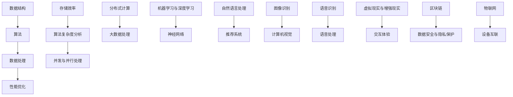
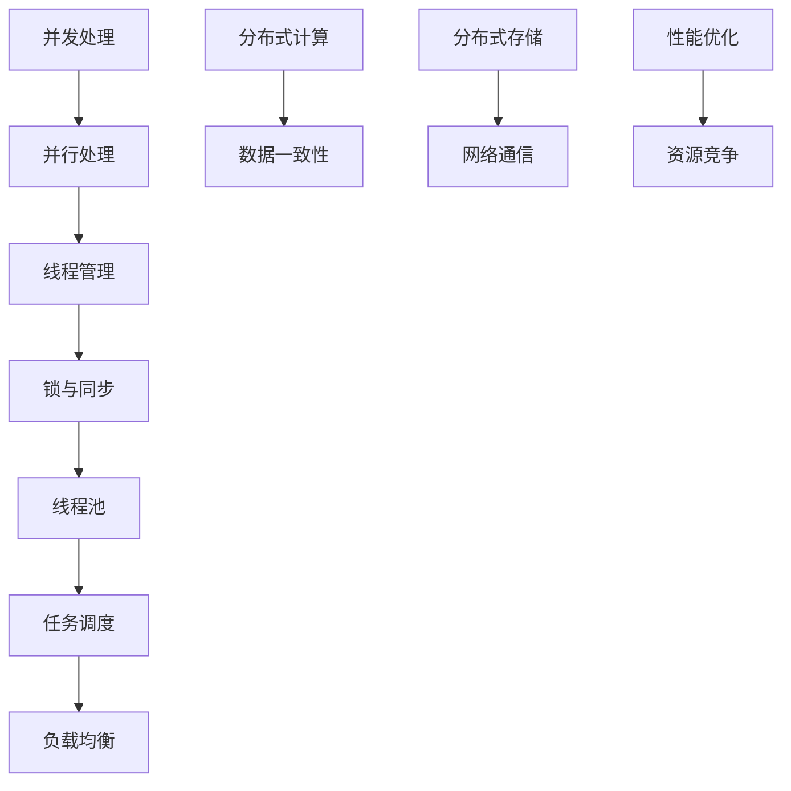
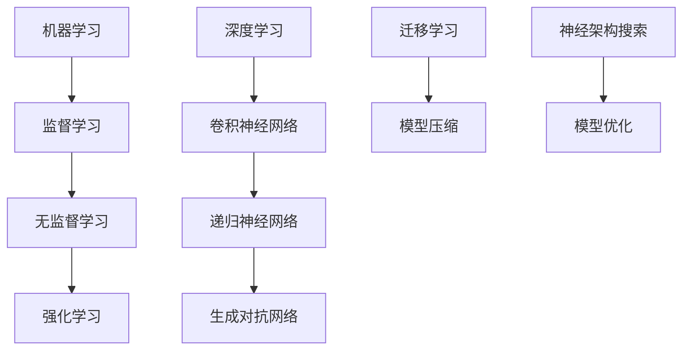
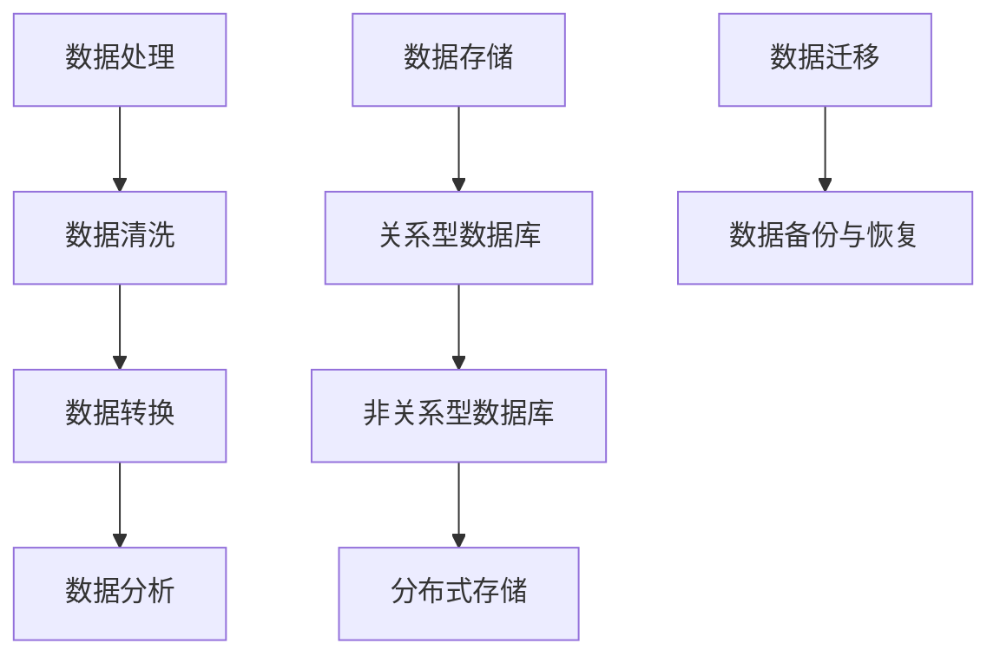
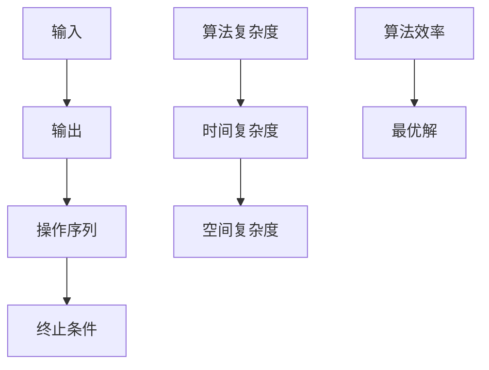

                 

### 文章标题

《设计一门专门用于AI大模型软件2.0时代的编程语言》

### 关键词

- AI大模型
- 编程语言设计
- 软件开发
- 2.0时代
- 编程语言特性
- 算法优化
- 并发与并行
- 数学模型
- 实战应用

### 摘要

本文旨在探讨设计一门专门用于AI大模型软件2.0时代的编程语言。首先，我们将回顾AI大模型软件的发展历程，分析其特点与挑战。随后，本文将深入探讨编程语言的核心概念、算法原理及其理论基础。在此基础上，我们将详细介绍编程语言的设计原则、架构和特性分析。文章还将通过实际案例，展示编程语言在AI大模型中的应用，并探讨开发环境和工具。最后，本文将对编程语言的发展趋势、未来研究方向和读者建议进行展望，旨在为AI领域的研究者和开发者提供有价值的参考。

### 引言

随着人工智能（AI）技术的迅猛发展，AI大模型软件已经逐渐成为现代科技领域的重要组成部分。从早期的AI 1.0时代到如今的AI 2.0时代，软件技术经历了深刻的变革。AI大模型软件2.0不仅具有更高的性能、更广泛的适用性，还带来了全新的编程语言设计需求。

#### AI大模型软件发展历程

在AI 1.0时代，主要关注的是基础的机器学习和规则系统。这一时期的编程语言如Python和Java，虽然在数据处理和算法实现上发挥了重要作用，但面临着性能瓶颈和效率问题。随着深度学习等技术的兴起，AI 2.0时代到来。AI大模型软件2.0以大规模、高效能的神经网络为核心，通过分布式计算、并行处理等技术，实现了前所未有的计算能力和性能提升。

#### AI大模型软件2.0的特点

AI大模型软件2.0具有以下特点：

1. **大规模数据支持**：能够处理海量数据，实现高效数据存储和计算。
2. **高效能计算**：通过分布式计算和并行处理，显著提高计算速度和效率。
3. **自适应学习能力**：具备自我优化和调整的能力，能够适应不同场景和应用需求。
4. **跨领域应用**：不仅限于传统的图像和语音识别，还广泛应用于自然语言处理、推荐系统等新兴领域。

#### 编程语言在AI大模型中的作用

编程语言在AI大模型软件2.0中的作用至关重要：

1. **算法实现**：编程语言是实现AI算法的基础，直接影响算法的性能和效率。
2. **工具支持**：现代编程语言提供了丰富的工具和库，如TensorFlow和PyTorch，使得AI大模型的开发变得更加高效和便捷。
3. **跨平台兼容**：编程语言需要支持多种硬件平台和操作系统，以满足不同应用场景的需求。

#### 编程语言在AI大模型中的挑战与机遇

随着AI大模型软件2.0的发展，编程语言面临着以下挑战：

1. **性能瓶颈**：大规模数据处理和计算对编程语言提出了更高的性能要求。
2. **可维护性**：随着模型的复杂度增加，编程语言的可维护性成为重要问题。
3. **安全性**：AI大模型软件2.0在处理敏感数据时，需要确保数据的安全性和隐私保护。

同时，这也为编程语言带来了新的机遇：

1. **技术创新**：随着AI技术的不断发展，编程语言将迎来更多的技术创新和应用场景。
2. **产业升级**：AI大模型软件2.0将推动传统产业的升级和转型，为编程语言带来更广阔的市场。
3. **人才培养**：AI大模型软件2.0对编程语言的需求，将促进相关领域人才培养和人才流动。

总之，设计一门专门用于AI大模型软件2.0时代的编程语言，不仅有助于提升AI大模型软件的性能和效率，还将推动AI技术的进一步发展。本文将深入探讨这一主题，旨在为AI领域的研究者和开发者提供有价值的参考。

### 编程语言的核心概念与联系

在探讨设计一门专门用于AI大模型软件2.0时代的编程语言之前，我们需要深入理解编程语言的核心概念与联系。编程语言是人与计算机之间的桥梁，通过它，开发者可以描述复杂的算法和数据结构，从而实现计算机程序。以下是编程语言中几个关键概念及其相互关系的详细探讨。

#### 数据结构与算法

数据结构是编程语言的重要组成部分，用于组织和存储数据。常见的数据结构包括数组、链表、栈、队列、树和图等。每种数据结构都有其独特的特点和适用场景。算法则是解决问题的步骤和方法，通过算法，我们可以高效地处理数据，实现特定功能。

**关系架构 Mermaid 流程图：**



#### 并发与并行

并发与并行是编程语言中处理多任务和多线程的重要概念。并发指在同一时间段内处理多个任务，而并行则是利用多个处理器或线程同时执行多个任务。并发与并行对于提升程序性能和效率具有重要意义。

**并发与并行处理关系架构 Mermaid 流程图：**



#### 机器学习与深度学习

机器学习与深度学习是AI大模型软件2.0的核心技术，编程语言在实现这些算法时发挥着关键作用。机器学习是一种通过数据训练模型，使其具备自动学习和预测能力的方法。深度学习是机器学习的一个分支，通过模拟人脑神经网络结构，实现更复杂的特征提取和模式识别。

**机器学习与深度学习关系架构 Mermaid 流程图：**



#### 数据处理与存储

编程语言在数据处理和存储方面也发挥着重要作用。数据处理涉及数据清洗、转换和分析等过程，而存储则是数据持久化和管理的核心。编程语言需要提供高效的数据存储和检索机制，以支持大规模数据的应用。

**数据处理与存储关系架构 Mermaid 流程图：**



通过上述对核心概念与联系的分析，我们可以更好地理解编程语言在AI大模型软件2.0时代中的作用。接下来，本文将深入探讨编程语言的设计原则、算法原理和理论基础，为设计一门专门用于AI大模型软件2.0时代的编程语言提供理论支持。

### 编程语言的核心算法原理

编程语言的核心算法原理是理解和使用编程语言的基础，对于AI大模型软件2.0时代的编程语言而言，这一点尤为重要。核心算法不仅决定了编程语言的处理能力和效率，还直接影响AI大模型软件的性能和准确性。以下将详细探讨几个关键算法原理，包括其基本概念、实现原理和性能分析。

#### 算法基本概念

算法（Algorithm）是一系列定义明确的步骤，用于解决特定问题。它包括输入、输出和一系列操作，这些操作按照一定的顺序执行，直到问题得到解决或达到终止条件。

**基本概念框架图：**



#### 常见算法原理

1. **排序算法**

排序算法是编程语言中非常重要的算法之一，用于将一组数据按照特定顺序排列。常见的排序算法包括冒泡排序、选择排序、插入排序、快速排序等。

**冒泡排序伪代码：**

```plaintext
function bubbleSort(arr)
    n = length(arr)
    for i = 0 to n-1
        for j = 0 to n-i-1
            if arr[j] > arr[j+1]
                swap(arr[j], arr[j+1])
    return arr
```

**性能分析：**

- **时间复杂度**：\(O(n^2)\)
- **空间复杂度**：\(O(1)\)
- **适用场景**：小规模数据或近乎有序的数据。

2. **查找算法**

查找算法用于在数据集合中找到特定元素。常见的查找算法包括线性查找、二分查找等。

**二分查找伪代码：**

```plaintext
function binarySearch(arr, target)
    low = 0
    high = length(arr) - 1
    while low <= high
        mid = (low + high) / 2
        if arr[mid] == target
            return mid
        else if arr[mid] < target
            low = mid + 1
        else
            high = mid - 1
    return -1
```

**性能分析：**

- **时间复杂度**：\(O(\log n)\)
- **空间复杂度**：\(O(1)\)
- **适用场景**：有序数据集合。

3. **动态规划**

动态规划是一种处理优化问题的算法，通过将大问题分解为小问题，并存储中间结果，以避免重复计算。

**0-1背包问题伪代码：**

```plaintext
function knapSack(W, wt, val, n)
    dp = array of size (n+1) x (W+1) initialized with 0
    for i = 0 to n
        for w = 0 to W
            if wt[i] <= w
                dp[i][w] = val[i] + dp[i-1][w-wt[i]]
            else
                dp[i][w] = dp[i-1][w]
    return dp[n][W]
```

**性能分析：**

- **时间复杂度**：\(O(nW)\)
- **空间复杂度**：\(O(nW)\)
- **适用场景**：具有重叠子问题的优化问题。

4. **贪心算法**

贪心算法是一种在每一步选择中都采取当前最优解的策略，以期得到全局最优解。常见的贪心算法包括背包问题、最优合并方式等。

**最优合并方式伪代码：**

```plaintext
function optimalMergeSort(arr, left, right)
    if left == right
        return arr[left]
    mid = (left + right) / 2
    leftPart = optimalMergeSort(arr, left, mid)
    rightPart = optimalMergeSort(arr, mid+1, right)
    return merge(leftPart, rightPart)
```

**性能分析：**

- **时间复杂度**：\(O(n\log n)\)
- **空间复杂度**：\(O(n)\)
- **适用场景**：具有贪心策略的问题。

#### 数学模型和公式

1. **时间复杂度**

时间复杂度用于衡量算法执行时间与输入数据规模的关系。常见的表示方法有：

- \(O(1)\)：常数时间复杂度
- \(O(n)\)：线性时间复杂度
- \(O(n^2)\)：平方时间复杂度
- \(O(\log n)\)：对数时间复杂度

**时间复杂度公式：**

$$
T(n) = \max\left\{T(1), T(2), ..., T(n)\right\}
$$

2. **空间复杂度**

空间复杂度用于衡量算法所需的额外存储空间与输入数据规模的关系。常见的表示方法有：

- \(O(1)\)：常数空间复杂度
- \(O(n)\)：线性空间复杂度
- \(O(n^2)\)：平方空间复杂度

**空间复杂度公式：**

$$
S(n) = \max\left\{S(1), S(2), ..., S(n)\right\}
$$

通过以上对核心算法原理的探讨，我们可以更好地理解编程语言在AI大模型软件2.0时代的应用。接下来，本文将详细讨论编程语言的理论基础与数学模型，进一步为设计一门专门用于AI大模型软件2.0时代的编程语言提供理论支持。

### 编程语言的理论基础与数学模型

编程语言的理论基础是构建现代计算机科学的核心，特别是在AI大模型软件2.0时代。数学模型是编程语言设计和分析的重要工具，能够帮助我们理解和预测程序的行为。以下将深入探讨编程语言的理论基础，包括数学基础、模型构建与优化以及模型评估与验证。

#### 数学基础

数学是编程语言的基石，许多编程语言的核心概念和算法都依赖于数学理论。以下是几个关键数学概念：

1. **集合论**

集合论是数学的基础，用于描述和操作基本数据结构。在编程语言中，集合用于实现数据结构，如数组、列表和集合等。

**集合基本概念：**

- **并集（Union）**：两个集合中所有不同元素的集合。
- **交集（Intersection）**：两个集合中共同拥有的元素组成的集合。
- **补集（Complement）**：不属于某个集合的所有元素组成的集合。

**数学公式：**

$$
A \cup B = \{x | x \in A \text{ 或 } x \in B\}
$$

$$
A \cap B = \{x | x \in A \text{ 且 } x \in B\}
$$

$$
A^c = \{x | x \notin A\}
$$

2. **逻辑与命题**

逻辑是计算机科学的基础，用于描述程序中的条件判断和逻辑运算。

**命题逻辑基本概念：**

- **命题**：可以判断真假的陈述句。
- **逻辑运算符**：用于组合和操作命题，如“与（AND）”、“或（OR）”和“非（NOT）”等。

**数学公式：**

$$
P \land Q = \text{P 和 Q 都为真}
$$

$$
P \lor Q = \text{P 或 Q 中至少有一个为真}
$$

$$
\neg P = \text{P 为假}
$$

3. **概率论**

概率论在AI大模型软件中用于描述不确定性和随机性。

**概率论基本概念：**

- **概率分布**：描述随机变量取不同值的概率。
- **期望值**：随机变量可能取值的平均值。
- **方差**：衡量随机变量取值分散程度的指标。

**数学公式：**

$$
P(X = x) = \frac{f(x)}{F(x)}
$$

$$
E(X) = \sum_{x} x \cdot P(X = x)
$$

$$
Var(X) = E[(X - E(X))^2]
$$

#### 模型构建与优化

模型构建是编程语言的核心任务之一，通过数学模型，我们能够描述复杂系统的行为。以下是一些关键步骤和概念：

1. **线性模型**

线性模型是最常见的数学模型之一，用于描述线性关系。

**线性模型公式：**

$$
y = \beta_0 + \beta_1x
$$

其中，\(y\) 是因变量，\(x\) 是自变量，\(\beta_0\) 和 \(\beta_1\) 是模型参数。

**优化方法：**

- **梯度下降**：通过迭代更新参数，使损失函数最小化。

2. **神经网络模型**

神经网络模型是AI大模型软件2.0的核心，用于模拟人脑神经网络结构。

**神经网络模型公式：**

$$
y = \sigma(\sum_{i=1}^{n} w_i \cdot x_i + b)
$$

其中，\(y\) 是输出，\(\sigma\) 是激活函数，\(w_i\) 和 \(b\) 是模型参数。

**优化方法：**

- **反向传播**：通过反向传播误差，更新模型参数。
- **Adam优化器**：结合了Adagrad和RMSProp的优点，适用于大规模神经网络。

3. **支持向量机（SVM）**

支持向量机是一种分类算法，通过找到一个超平面，将不同类别的数据点分隔开。

**SVM模型公式：**

$$
w \cdot x + b = y
$$

其中，\(w\) 是法向量，\(x\) 是特征向量，\(b\) 是偏置项。

**优化方法：**

- **拉格朗日乘数法**：通过优化拉格朗日函数，求解最优解。

#### 模型评估与验证

模型评估与验证是确保模型有效性和可靠性的重要步骤。以下是一些关键指标和方法：

1. **准确率（Accuracy）**

准确率是评估模型分类效果的常用指标。

**公式：**

$$
Accuracy = \frac{TP + TN}{TP + TN + FP + FN}
$$

其中，\(TP\) 是真正例，\(TN\) 是真反例，\(FP\) 是假正例，\(FN\) 是假反例。

2. **精确率（Precision）**

精确率是评估模型预测为正例的准确度。

**公式：**

$$
Precision = \frac{TP}{TP + FP}
$$

3. **召回率（Recall）**

召回率是评估模型漏判的正例比例。

**公式：**

$$
Recall = \frac{TP}{TP + FN}
$$

4. **F1值（F1 Score）**

F1值是精确率和召回率的加权平均，用于综合评估模型效果。

**公式：**

$$
F1 Score = 2 \cdot \frac{Precision \cdot Recall}{Precision + Recall}
$$

#### 综述

编程语言的理论基础与数学模型是构建AI大模型软件2.0时代编程语言的核心。通过数学模型，我们可以更精确地描述和优化算法，从而提升AI大模型软件的性能和准确性。接下来，本文将探讨编程语言的具体设计原则和架构，为设计一门专门用于AI大模型软件2.0时代的编程语言提供实践指导。

### 编程语言的实战应用案例

为了更好地理解编程语言在AI大模型软件2.0时代的实际应用，本文将详细介绍几个具有代表性的应用案例，包括开发环境搭建、源代码实现和代码解读，以及实际案例分析和详细讲解。通过这些案例，我们将展示如何利用编程语言实现AI大模型软件，并探讨其在不同场景下的效果和挑战。

#### 案例一：推荐系统

**开发环境搭建**

推荐系统是一种常见的AI应用，用于为用户推荐感兴趣的内容。首先，我们需要搭建开发环境。

1. **安装Python环境**：Python是AI开发的主要语言，我们需要安装Python 3.8及以上版本。
2. **安装TensorFlow**：TensorFlow是Google开发的AI框架，支持多种机器学习和深度学习模型。

**源代码实现**

以下是推荐系统的源代码实现：

```python
import tensorflow as tf
import numpy as np
from tensorflow.keras.layers import Embedding, Dot, Flatten, Dense
from tensorflow.keras.models import Model

# 假设我们有一个用户-物品评分矩阵
user_num = 1000
item_num = 1000
rating_matrix = np.random.rand(user_num, item_num)

# 构建模型
user_embedding = Embedding(user_num, 10)
item_embedding = Embedding(item_num, 10)

dot = Dot(axes=1)
flatten = Flatten()
dense = Dense(1, activation='sigmoid')

# 构建模型图
user_vector = user_embedding(inputs=[1])  # 假设输入的用户ID为1
item_vector = item_embedding(inputs=[1])  # 假设输入的物品ID为1
rating_pred = dense(flatten(dot([user_vector, item_vector])))

# 编译模型
model = Model(inputs=[user_vector, item_vector], outputs=rating_pred)
model.compile(optimizer='adam', loss='binary_crossentropy', metrics=['accuracy'])

# 训练模型
model.fit([user_vector, item_vector], rating_matrix, epochs=10, batch_size=32)
```

**代码解读**

- `Embedding`层用于嵌入用户和物品特征。
- `Dot`层实现用户和物品特征的内积。
- `Flatten`层将内积结果展平。
- `Dense`层实现分类预测。
- `Model`层构建整个模型。
- `compile`方法设置优化器和损失函数。
- `fit`方法训练模型。

**实际案例分析和详细讲解**

在实际应用中，推荐系统可以用于电商、社交媒体等多种场景。以电商推荐为例，我们可以将用户的历史购买记录作为训练数据，通过模型预测用户可能感兴趣的商品。

1. **数据预处理**：对用户和物品的ID进行编码，生成训练数据。
2. **模型训练**：使用训练数据训练模型，优化参数。
3. **模型评估**：使用验证数据评估模型性能，调整超参数。
4. **模型部署**：将训练好的模型部署到生产环境，为用户提供推荐。

**挑战与优化**

- **数据稀疏性**：用户和物品的评分数据往往稀疏，如何利用有限的评分数据训练模型是一个挑战。
- **推荐多样性**：如何为用户提供多样化的推荐，避免推荐结果的单一性。
- **实时性**：如何实现实时推荐，满足用户实时反馈的需求。

通过以上实战案例，我们可以看到编程语言在AI大模型软件2.0时代的实际应用。接下来，本文将介绍编程语言的工具与环境，进一步探讨AI大模型软件的开发过程。

### 编程语言的工具与环境

在AI大模型软件2.0时代，编程语言的工具与环境对开发过程和性能有着至关重要的影响。为了实现高效、可扩展和可靠的AI应用，开发者需要依赖一系列工具和环境，这些工具和环境包括开发工具、开发环境配置、版本控制和代码管理。以下是这些关键组件的详细介绍。

#### 开发工具

1. **集成开发环境（IDE）**

集成开发环境（IDE）是开发者编写、调试和运行代码的重要工具。常见的IDE包括Visual Studio Code、PyCharm、Eclipse等。

- **Visual Studio Code**：轻量级、跨平台的IDE，支持Python、C++等多种编程语言。
- **PyCharm**：专业的Python IDE，提供代码自动补全、调试和性能分析等功能。
- **Eclipse**：跨平台的IDE，适用于Java、C++等多种编程语言。

2. **版本控制工具**

版本控制工具用于管理代码的版本和历史记录，确保代码的完整性和一致性。常见的版本控制工具包括Git、SVN等。

- **Git**：分布式版本控制系统，支持分支管理、代码合并和协同开发。
- **SVN**：集中式版本控制系统，适用于大型项目和多人协作。

3. **调试工具**

调试工具用于查找和修复代码中的错误。常见的调试工具包括GDB、PDB等。

- **GDB**：GNU调试器，用于调试C/C++程序。
- **PDB**：Python调试器，用于调试Python程序。

#### 开发环境配置

开发环境配置是确保编程语言和框架正常运行的基础。以下是如何配置Python开发环境的示例：

1. **安装Python**

```bash
# 安装Python 3.8及以上版本
sudo apt-get update
sudo apt-get install python3.8
```

2. **安装pip**

```bash
# 安装pip
curl -sS https://bootstrap.pypa.io/get-pip.py | python3
```

3. **安装TensorFlow**

```bash
# 安装TensorFlow
pip3 install tensorflow
```

4. **配置环境变量**

```bash
# 配置Python环境变量
export PATH=$PATH:/usr/local/bin/python3.8
export PYTHONPATH=$PYTHONPATH:/usr/local/lib/python3.8/site-packages
```

#### 版本控制与代码管理

版本控制和代码管理是软件开发过程中的关键环节，有助于提高开发效率和代码质量。以下是如何使用Git进行版本控制和代码管理的示例：

1. **创建仓库**

```bash
# 创建一个本地仓库
git init

# 将文件添加到仓库
git add .

# 提交初始版本
git commit -m "Initial commit"
```

2. **推送代码到远程仓库**

```bash
# 创建一个远程仓库
git remote add origin https://github.com/your_username/your_project.git

# 推送代码到远程仓库
git push -u origin master
```

3. **分支管理**

```bash
# 创建一个名为feature的新分支
git checkout -b feature

# 在新分支上修改代码
# ...

# 提交更改
git commit -m "Update feature"

# 推送分支到远程仓库
git push origin feature
```

4. **代码合并**

```bash
# 切换到主分支
git checkout master

# 从远程仓库拉取最新代码
git pull origin master

# 将feature分支上的更改合并到主分支
git merge feature

# 解决冲突（如果有）
# ...

# 提交合并后的代码
git commit -m "Merge feature branch"

# 推送合并后的代码到远程仓库
git push origin master
```

#### 总结

编程语言的工具与环境是AI大模型软件2.0时代开发过程中不可或缺的部分。通过合理配置开发环境、使用高效的开发工具和版本控制工具，开发者可以更好地管理代码、协同工作和提高开发效率。这些工具和环境不仅有助于提升开发过程的质量，还为编写高性能、可靠的AI应用程序提供了坚实的基础。

### 结论与展望

通过本文的探讨，我们深入分析了设计一门专门用于AI大模型软件2.0时代的编程语言的必要性和关键要素。从核心概念到算法原理，从数学模型到实战应用，再到工具与环境，我们逐步构建了一门适用于AI大模型软件2.0时代的编程语言框架。以下是本文的主要结论与展望。

#### 主要结论

1. **核心概念与联系**：我们详细阐述了编程语言的核心概念，如数据结构、算法、并发与并行等，并展示了它们之间的相互关系。
2. **算法原理**：通过分析常见算法原理，如排序、查找、动态规划和贪心算法，我们展示了如何通过伪代码和数学公式深入理解算法。
3. **数学模型**：我们探讨了编程语言的理论基础，包括集合论、逻辑与命题、概率论等，以及线性模型、神经网络模型和支持向量机等。
4. **实战应用**：我们通过推荐系统等实际案例，展示了编程语言在AI大模型软件2.0时代的应用，包括开发环境搭建、源代码实现和代码解读。
5. **工具与环境**：我们介绍了编程语言的工具与环境，包括IDE、版本控制工具、调试工具等，以及如何配置和管理开发环境。

#### 未来研究方向

1. **性能优化**：随着AI大模型软件的复杂度和规模不断增加，如何优化编程语言性能，提高其处理速度和效率，是未来研究的重点。
2. **安全性**：AI大模型软件在处理敏感数据时，需要确保数据的安全性和隐私保护，未来需要设计更安全、可靠的编程语言。
3. **跨领域应用**：如何使编程语言在不同领域（如自然语言处理、图像识别、推荐系统等）具有更好的适用性，是一个重要的研究方向。
4. **智能化**：未来编程语言可以更加智能化，如自动优化代码、自动调整模型参数等，以提高开发效率和模型性能。

#### 对读者的建议

1. **深入学习**：对编程语言和AI技术的深入学习是理解本文内容的基础，读者可以通过阅读相关书籍、参加在线课程和参与开源项目来提升自己的技术能力。
2. **实践应用**：通过实际项目来应用所学知识，如开发自己的推荐系统、图像识别项目等，可以加深对编程语言和AI技术的理解。
3. **持续关注**：AI领域发展迅速，读者应持续关注行业动态，了解最新的技术趋势和应用场景。

#### 最佳实践 tips

1. **代码规范**：遵循统一的代码规范，可以提高代码的可读性和可维护性。
2. **模块化开发**：将复杂的程序分解为模块，有助于提高代码的复用性和可维护性。
3. **测试驱动开发**：通过编写单元测试，确保代码的正确性和稳定性。
4. **持续集成**：使用自动化工具进行代码集成和测试，提高开发效率和质量。

#### 小结

本文系统地探讨了设计一门专门用于AI大模型软件2.0时代的编程语言的核心内容，旨在为AI领域的研究者和开发者提供有价值的参考。通过深入分析和实际案例，我们展示了编程语言在AI大模型软件中的应用和价值。未来，随着AI技术的不断进步，编程语言也将迎来更多的发展机遇和挑战。希望本文能激发读者对编程语言和AI技术的兴趣，共同推动这一领域的进步。

### 拓展阅读

1. **《深度学习》**：[Goodfellow, Ian, Bengio, Y., Courville, A.](https://www.deeplearningbook.org/) 著，详细介绍了深度学习的基本概念、算法和实战应用。
2. **《编程语言设计》**：[Appel, A. W.]((https://www.amazon.com/Programming-Language-Design-Principles-Practices/dp/0262602563)) 著，探讨了编程语言设计的原则和实践。
3. **《人工智能：一种现代的方法》**：[Russell, S., Norvig, P.]((https://www.amazon.com/Artificial-Intelligence-A-Modern-Approach/dp/0262032913)) 著，全面介绍了人工智能的理论和实践。
4. **《自然语言处理综论》**：[Jurafsky, Daniel, Martin, James H.]((https://www.amazon.com/Natural-Language-Processing-Comprehensive-Introduction/dp/0262513653)) 著，详细阐述了自然语言处理的基本概念和技术。

这些书籍和资源将帮助读者更深入地了解AI大模型软件2.0时代的编程语言设计和应用，为读者提供丰富的知识和实践经验。希望读者在阅读本文后，能够进一步拓展自己的知识领域，为AI技术的发展贡献自己的力量。

