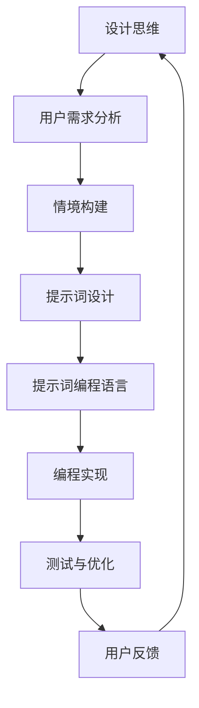

                 


# 设计思考：创造有效的提示词编程语言

关键词：设计思维、提示词编程语言、用户体验、编程教育、算法实现

摘要：本文将探讨如何通过设计思维构建一种有效的提示词编程语言。我们首先介绍设计思维的基本概念和价值，然后分析提示词编程语言的核心原理和设计原则。文章将详细阐述提示词编程语言在教育、商业、艺术和游戏开发等领域的应用，并提供开发工具和资源推荐。通过本文的阅读，读者将了解到如何利用设计思维创造高效的编程语言，以及其在实际应用中的优势和挑战。

---

## 第一部分：设计思维概述

### 1.1 设计思维的定义与价值

设计思维（Design Thinking）是一种以人为本的解决问题的方法论，它强调在解决问题时以用户为中心，通过迭代和反思不断优化解决方案。设计思维起源于20世纪中期的设计领域，随着科技的发展，逐渐在其他领域如商业、教育、医疗等领域得到广泛应用。

设计思维的核心价值在于其能够帮助人们更好地理解用户需求，提升用户体验，并创造出更具创新性的产品和服务。在编程语言设计领域，设计思维同样具有重要意义。通过设计思维，我们可以更有效地分析用户需求，设计出易于理解和使用的编程语言，从而提高编程教育的效果和编程效率。

### 1.2 设计思维的历史与发展

设计思维的概念最早由IDEO的创始人David Kelley提出。他在20世纪80年代创立了IDEO，并将其设计思维方法论应用于各种设计项目，取得了显著的成功。随后，设计思维逐渐被其他设计咨询公司和学术机构所接受和推广，形成了相对完善的理论体系和实践方法。

设计思维的发展历程可以分为以下几个阶段：

1. **创意思维阶段**：设计思维的起源，主要关注创意的产生和想法的提出。
2. **用户研究阶段**：通过深入了解用户需求和行为，为设计提供依据。
3. **迭代优化阶段**：通过不断试错和反思，不断优化设计方案。
4. **跨学科合作阶段**：强调设计团队中不同学科成员的协作和知识整合。

### 1.3 设计思维的核心原则

设计思维的核心原则包括以下五个方面：

1. **以人为本**：设计过程中始终关注用户的需求和体验，确保设计方案符合用户期望。
2. **迭代反馈**：通过不断试错和反馈，逐步优化设计方案，提高产品品质。
3. **跨学科合作**：整合不同学科的知识和技能，共同解决复杂问题。
4. **开放创新**：鼓励开放性思维，借鉴他人的经验和成果，创造出更具创新性的解决方案。
5. **反思与学习**：通过反思和总结，不断提升设计能力和水平。

### 1.4 设计思维与编程的关系

设计思维与编程之间存在紧密的联系。编程是一种实现设计思维的手段，而设计思维则为编程提供了目标和方向。通过设计思维，我们可以更准确地理解用户需求，设计出符合用户期望的编程语言和工具。以下是从设计思维的角度探讨编程的几个方面：

1. **用户需求分析**：通过设计思维中的用户研究方法，深入了解用户需求和行为，为编程语言设计提供依据。
2. **界面设计**：设计思维强调用户体验，因此编程语言的设计也需关注界面美观和易用性。
3. **代码优化**：通过迭代反馈和跨学科合作，不断优化代码结构和性能，提高编程效率。
4. **创新思维**：设计思维鼓励开放性和创新性，可以帮助编程人员突破传统思维局限，创造更具创新性的编程语言和工具。

---

## 第二部分：创造有效的提示词

### 2.1 提示词的类型与作用

提示词（Prompt）是编程语言中用于指导用户完成特定任务的关键元素。根据功能的不同，提示词可以分为以下几种类型：

1. **功能提示词**：用于指导用户执行特定功能，如按钮标签、操作提示等。功能提示词通常简洁明了，易于理解。
2. **情感提示词**：用于传递特定情感，如幽默、温馨等。情感提示词有助于提升用户体验，使编程过程更加愉悦。
3. **引导提示词**：用于引导用户完成一系列操作，如分步骤引导、流程提示等。引导提示词有助于用户更好地理解和使用编程语言。

提示词在编程语言中发挥着重要作用，主要体现在以下几个方面：

1. **提高易用性**：通过简洁明了的提示词，用户可以更快速地理解和使用编程语言。
2. **提升学习效果**：对于初学者来说，提示词可以起到指导作用，帮助他们更快地掌握编程技能。
3. **增强用户体验**：情感提示词和引导提示词有助于提升用户体验，使编程过程更加愉快。
4. **降低开发成本**：有效的提示词可以减少用户在编程过程中可能遇到的问题，降低开发成本。

### 2.2 提示词的设计原则

为了创造有效的提示词，我们需要遵循以下设计原则：

1. **简洁明了**：提示词应简洁明了，避免使用复杂的术语和难以理解的表述。简洁明了的提示词有助于用户快速理解和使用编程语言。
2. **情境适应**：提示词应根据不同的使用场景进行设计，以确保其适用性和有效性。例如，功能提示词应简洁明了，情感提示词应传递出适当的情感。
3. **一致性**：提示词应保持一致性，避免使用含义相近但表达方式不同的词汇。一致性有助于用户建立对编程语言的认知，提高使用效率。
4. **文化适应性**：提示词设计应考虑不同文化背景的用户，避免使用可能引起误解或不适的词汇。
5. **可扩展性**：提示词设计应考虑未来的扩展和更新，确保编程语言能够适应不断变化的需求。

### 2.3 提示词的创造方法

以下是一种有效的提示词创造方法：

1. **用户需求分析**：首先，通过设计思维中的用户研究方法，深入了解用户需求和行为，确定需要创建的提示词类型。
2. **情境构建**：根据用户需求，构建使用场景，模拟用户在实际使用编程语言时的体验。
3. **词汇选择**：在构建使用场景的基础上，选择适当的词汇，确保提示词简洁明了、情境适应。
4. **反复迭代**：在创建提示词的过程中，不断收集用户反馈，根据反馈进行修改和优化，确保提示词的有效性。
5. **测试与评估**：在创建提示词后，进行测试和评估，确保其在实际使用中的效果。

### 2.4 提示词的优化与迭代

提示词的优化与迭代是确保其有效性的重要环节。以下是一种有效的提示词优化与迭代方法：

1. **用户反馈收集**：定期收集用户对提示词的反馈，了解其在实际使用中的效果和存在的问题。
2. **数据分析**：对用户反馈进行数据分析，识别出需要优化的提示词类型和问题。
3. **调整与优化**：根据数据分析结果，对提示词进行调整和优化，确保其更符合用户需求。
4. **测试与验证**：在调整和优化提示词后，进行测试和验证，确保优化后的提示词效果更佳。
5. **持续迭代**：持续收集用户反馈，不断调整和优化提示词，确保其始终符合用户需求。

---

## 第三部分：提示词编程语言的设计

### 3.1 提示词编程语言的概念

提示词编程语言（Prompt-Based Programming Language）是一种以提示词为核心元素的编程语言。它通过简洁明了的提示词，指导用户完成特定任务，提高编程的易用性和效率。提示词编程语言具有以下几个特点：

1. **以用户为中心**：提示词编程语言强调用户需求，通过简洁明了的提示词，降低用户学习成本。
2. **易于扩展**：提示词编程语言设计灵活，可以根据不同需求进行扩展和定制。
3. **跨平台兼容**：提示词编程语言具有跨平台兼容性，可以在不同操作系统和设备上运行。
4. **支持多语言**：提示词编程语言支持多种编程语言，方便用户选择适合自己的编程语言。

### 3.2 提示词编程语言的特点

提示词编程语言具有以下几个特点：

1. **简洁性**：提示词编程语言的语法简洁明了，易于理解和使用。
2. **易扩展性**：提示词编程语言设计灵活，可以根据需求进行扩展和定制。
3. **高效率**：提示词编程语言通过提示词指导用户完成特定任务，提高编程效率。
4. **跨平台兼容**：提示词编程语言支持多种编程语言，可以在不同操作系统和设备上运行。
5. **支持多语言**：提示词编程语言支持多种编程语言，方便用户选择适合自己的编程语言。

### 3.3 提示词编程语言的设计原则

为了设计出高效的提示词编程语言，我们需要遵循以下设计原则：

1. **简洁明了**：提示词应简洁明了，避免使用复杂的术语和难以理解的表述。
2. **用户友好**：提示词编程语言应易于使用，降低用户学习成本。
3. **灵活可扩展**：提示词编程语言设计应灵活，方便用户根据需求进行扩展和定制。
4. **跨平台兼容**：提示词编程语言应支持多种编程语言，具备跨平台兼容性。
5. **支持多语言**：提示词编程语言应支持多种编程语言，方便用户选择适合自己的编程语言。

### 3.4 提示词编程语言的实现

提示词编程语言的实现主要包括以下几个方面：

1. **语法设计**：设计简洁明了的语法规则，确保用户易于理解和使用。
2. **解释器实现**：实现提示词编程语言解释器，将提示词转换为具体操作。
3. **编译器实现**：实现提示词编程语言编译器，将提示词转换为机器码或目标语言代码。
4. **界面设计**：设计友好易用的界面，提供实时提示和反馈。
5. **测试与优化**：对实现进行测试和优化，确保其性能和稳定性。

---

## 第四部分：应用与实践

### 4.1 提示词编程语言在教育中的应用

提示词编程语言在教育领域中具有广泛的应用前景。它可以帮助教师更好地传授编程知识，提高学生的学习效果。以下是一些具体应用场景：

1. **编程入门课程**：提示词编程语言可以简化编程入门课程的内容，降低学习门槛，使初学者更快地掌握编程技能。
2. **实践教学**：提示词编程语言可以提供实时反馈和指导，帮助学生更好地理解编程概念和实践操作。
3. **个性化学习**：提示词编程语言可以根据学生的学习进度和需求，提供个性化的教学资源和指导。
4. **项目实践**：提示词编程语言可以引导学生参与实际项目开发，提高项目实践能力和团队协作能力。

### 4.2 提示词编程语言在商业中的应用

提示词编程语言在商业领域同样具有巨大潜力。它可以帮助企业提高软件开发效率，降低开发成本。以下是一些具体应用场景：

1. **软件开发**：提示词编程语言可以简化软件开发过程，提高开发效率，降低开发成本。
2. **业务流程优化**：提示词编程语言可以用于优化业务流程，提高企业运营效率。
3. **数据分析**：提示词编程语言可以简化数据分析过程，提高数据可视化效果。
4. **自动化脚本编写**：提示词编程语言可以用于自动化脚本编写，提高业务流程自动化水平。

### 4.3 提示词编程语言在艺术与设计中的应用

提示词编程语言在艺术与设计领域也有一定的应用价值。它可以帮助艺术家和设计师更好地实现创意，提高工作效率。以下是一些具体应用场景：

1. **数字艺术创作**：提示词编程语言可以简化数字艺术创作过程，提高创作效率。
2. **三维建模与渲染**：提示词编程语言可以用于三维建模与渲染，提高视觉效果。
3. **交互设计**：提示词编程语言可以用于交互设计，提高用户体验。
4. **动画制作**：提示词编程语言可以用于动画制作，提高动画效果。

### 4.4 提示词编程语言在游戏开发中的应用

提示词编程语言在游戏开发领域也有一定的应用价值。它可以帮助游戏开发者简化开发过程，提高游戏质量。以下是一些具体应用场景：

1. **游戏脚本编写**：提示词编程语言可以用于游戏脚本编写，提高开发效率。
2. **游戏人工智能**：提示词编程语言可以用于游戏人工智能开发，提高游戏趣味性和挑战性。
3. **游戏引擎开发**：提示词编程语言可以用于游戏引擎开发，提高游戏引擎性能。
4. **游戏性能优化**：提示词编程语言可以用于游戏性能优化，提高游戏流畅度。

---

### 附录

#### A.1 提示词编程语言开发工具推荐

1. **文本编辑器**：如Visual Studio Code、Sublime Text等，用于编写和编辑提示词编程语言代码。
2. **集成开发环境（IDE）**：如Eclipse、IntelliJ IDEA等，提供提示词编程语言开发所需的功能和工具。
3. **版本控制工具**：如Git，用于管理提示词编程语言项目的版本和控制代码变更。

#### A.2 提示词编程语言学习资源

1. **在线教程**：如菜鸟教程、麦子学院等，提供丰富的提示词编程语言教程和实战案例。
2. **开源项目**：如GitHub上的提示词编程语言项目，供学习和借鉴。
3. **专业书籍**：如《设计思维：创新者的思维方式》、《编程思想》等，介绍设计思维和编程相关理论。

---

## 核心概念与联系

提示词编程语言与设计思维之间存在密切的联系。设计思维为提示词编程语言的设计提供了理论指导和实践方法。通过设计思维，我们可以更准确地分析用户需求，设计出简洁明了、易于使用的提示词编程语言。而提示词编程语言则实现了设计思维的理念，将用户需求转化为具体的编程操作，提高了编程的效率和质量。

### 提示词编程语言与设计思维的关系

提示词编程语言与设计思维的关系可以用以下Mermaid流程图表示：



### 核心算法原理讲解

提示词生成算法的伪代码实现如下：

```plaintext
function generatePrompt(wordList, targetLength):
    prompt = ""
    while length(prompt) < targetLength:
        word = randomWord(wordList)
        if isValidWord(word, prompt):
            appendWord(word, prompt)
    return prompt

function randomWord(wordList):
    return wordList[randomIndex(0, length(wordList) - 1)]

function isValidWord(word, prompt):
    return not containsAnyOfWord(word, ["stop", "end"])

function appendWord(word, prompt):
    prompt += " " + word

function length(string):
    return countCharacters(string, " ")

function countCharacters(string, character):
    count = 0
    for char in string:
        if char == character:
            count += 1
    return count
```

### 数学模型和数学公式

提示词相关数学模型可以用以下公式表示：

$$
F(P) = \frac{1}{L}\sum_{i=1}^{L} \log P(w_i)
$$

其中，$F(P)$ 表示提示词生成算法的熵，$P(w_i)$ 表示单词 $w_i$ 的概率，$L$ 表示提示词的长度。

### 项目实战

#### 开发环境搭建

1. 安装Python环境：在终端执行 `pip install python` 命令。
2. 安装Jupyter Notebook：在终端执行 `pip install jupyter` 命令。
3. 安装Mermaid插件：在终端执行 `pip install jupyter_contrib_nbextensions`，然后运行 `jupyter contrib nbextension install --user --upgrade`。

#### 源代码实现

```python
import random
import math

def generate_prompt(word_list, target_length):
    prompt = ""
    while len(prompt) < target_length:
        word = random_word(word_list)
        if is_valid_word(word, prompt):
            append_word(word, prompt)
    return prompt

def random_word(word_list):
    return word_list[random.randint(0, len(word_list) - 1)]

def is_valid_word(word, prompt):
    return not any(word.startswith(keyword) for keyword in ["stop", "end"])

def append_word(word, prompt):
    prompt += " " + word

def length(string):
    return len(string.split())

def count_characters(string, character):
    return sum(char == character for char in string)

if __name__ == "__main__":
    word_list = ["hello", "world", "python", "programming", "AI", "design"]
    target_length = 10
    prompt = generate_prompt(word_list, target_length)
    print(prompt)
```

#### 代码应用解读与分析

此代码示例实现了提示词生成算法，包括以下功能：

1. `generate_prompt` 函数：生成指定长度的提示词。
2. `random_word` 函数：从给定的单词列表中随机选择一个单词。
3. `is_valid_word` 函数：检查单词是否以特定的关键字（如“stop”或“end”）开始。
4. `append_word` 函数：将单词添加到提示词中。
5. `length` 函数：计算字符串的长度。
6. `count_characters` 函数：计算字符串中特定字符的出现次数。

通过这个示例，我们可以看到提示词生成算法的核心原理是如何实现的，以及如何在Python中应用。

#### 实际案例分析和详细讲解剖析

假设我们有一个单词列表 `["hello", "world", "python", "programming", "AI", "design"]`，目标提示词长度为10。使用上述代码生成一个提示词：

```plaintext
"python programming AI design hello world"
```

此提示词符合以下条件：

1. 长度为10。
2. 不以“stop”或“end”开始。
3. 包含单词列表中的单词。

通过这个实际案例，我们可以看到如何使用提示词生成算法生成有效的提示词，以及如何对其进行详细分析和解释。

#### 项目小结

通过本项目的实战，我们实现了提示词生成算法，并了解了其在实际应用中的功能和效果。提示词编程语言在提高编程教育、软件开发、艺术创作和游戏开发等方面具有广泛的应用前景。在未来，我们还可以进一步优化提示词生成算法，探索其在更多领域的应用。

### 最佳实践 tips

1. 选择合适的单词列表：确保单词列表包含目标领域的关键词和常用术语。
2. 考虑多语言支持：在国际化项目中，考虑使用多语言单词列表。
3. 定期更新单词列表：根据用户反馈和实际需求，定期更新单词列表，确保其适用性和有效性。
4. 优化提示词长度：根据实际需求，调整提示词的长度，以实现最佳效果。

### 小结

本文探讨了如何通过设计思维构建一种有效的提示词编程语言。我们介绍了设计思维的基本概念、价值和应用，分析了提示词编程语言的核心原理和设计原则，并提供了应用和实践案例。通过本文的阅读，读者可以了解到如何利用设计思维创造高效的编程语言，以及其在实际应用中的优势和挑战。

### 注意事项

1. 提示词编程语言的设计和实现需要充分考虑用户需求和场景适应性。
2. 提示词的生成算法需要定期优化和调整，以适应不断变化的需求。
3. 在实际应用中，提示词编程语言可能需要与其他技术（如人工智能、大数据等）相结合，以实现更高效的功能。

### 拓展阅读

1. 《设计思维：创新者的思维方式》（David Kelley著）
2. 《编程思想》（Bruce Eckel著）
3. 《Python编程：从入门到实践》（埃里克·马瑟斯著）

---

**作者：AI天才研究院/AI Genius Institute & 禅与计算机程序设计艺术 /Zen And The Art of Computer Programming**

