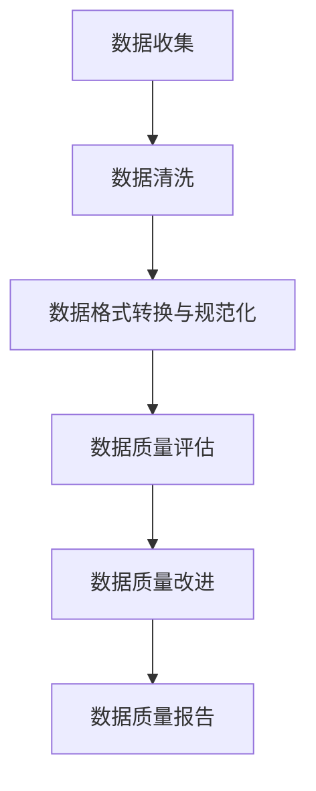

                 


### 引言

在现代人工智能（AI）与机器学习（ML）技术飞速发展的背景下，评测数据的质量控制成为了一个至关重要的环节。作为AI模型训练的核心组成部分，数据的质量直接影响着模型的性能与可靠性。然而，现实中存在大量的数据质量问题，如数据噪声、缺失值、错误标注等，这些问题往往会导致模型在真实应用中的不准确和不可靠。

本篇文章以《评测数据的质量控制：LLM辅助的数据净化》为标题，旨在探讨如何通过大型语言模型（LLM）来辅助数据净化，从而提升数据质量，增强模型训练效果。文章将分为以下几个部分：

1. **数据质量评估基础**：介绍数据质量的定义、重要性、评估指标与方法。
2. **LLM介绍与在数据质量控制中的应用**：详细阐述LLM的基本概念、发展历史及其在数据质量控制中的应用。
3. **数据质量控制流程**：描述数据质量控制的整体流程，包括数据收集、清洗、转换、规范化、评估与改进等步骤。
4. **LLM在数据预处理中的应用**：探讨LLM在数据预处理中的具体应用，如数据去重、纠错、增强等。
5. **数据质量评估方法与工具**：介绍常见的数据质量评估方法与工具，以及如何实现自动化评估。
6. **数据质量评估案例分析**：通过实际案例展示如何应用LLM进行数据质量评估。
7. **总结与展望**：总结文章主要内容，并对未来数据质量控制的发展趋势和LLM的应用前景进行展望。

本文将结合具体的算法、流程、实例和最佳实践，详细讲解数据质量控制在现代AI与ML领域的核心地位，以及如何利用LLM技术实现高效的数据质量控制。

---

关键词：数据质量控制、数据质量评估、大型语言模型（LLM）、数据预处理、AI模型训练、数据净化

摘要：本文探讨了数据质量控制的重要性以及如何通过大型语言模型（LLM）实现数据净化。文章首先介绍了数据质量的基础知识，然后详细阐述了LLM的基本概念及其在数据质量控制中的应用。随后，文章描述了数据质量控制的整体流程，并深入探讨了LLM在数据预处理中的具体应用。通过实际案例的分析，本文展示了如何利用LLM进行高效的数据质量评估。最后，文章总结了主要观点，并对未来数据质量控制的发展趋势和LLM的应用前景进行了展望。

---

### 数据质量评估基础

#### 数据质量的定义与特征

数据质量是指数据在满足特定需求和使用条件下的可靠性、准确性、完整性、一致性和可访问性。具体而言，数据质量包括以下几个方面：

1. **准确性**：数据真实且与事实相符的程度。例如，一个记录了客户年龄的数据，其准确性要求是客户实际的出生日期无误。
2. **完整性**：数据是否包含所有必要的字段和记录，没有缺失值。例如，一个销售数据库中的每条记录都应包含产品名称、数量和价格等所有必要信息。
3. **一致性**：数据在不同时间、不同系统或不同部门之间的同一性。例如，同一客户在不同数据库中的联系方式应当保持一致。
4. **可靠性**：数据源和收集方法的可信度。例如，来自权威来源的数据通常被认为是更可靠的。
5. **可访问性**：数据是否容易被查询和使用。例如，存储在不可访问的格式或位置中的数据对用户来说可能难以使用。

#### 数据质量评估的重要性

数据质量直接影响决策过程和业务绩效。以下是数据质量评估的重要性：

1. **提高决策准确性**：高质量的数据能够提供更准确的预测和分析，从而支持更明智的决策。
2. **减少错误和成本**：数据质量不佳会导致错误报告、不准确的业务分析和额外的修正成本。
3. **增强客户满意度**：准确和一致的数据能够提供更好的客户体验，例如个性化的营销策略和准确的服务信息。
4. **合规性**：在许多行业中，如金融和医疗，数据质量是确保合规性的关键因素。

#### 数据质量评估指标

评估数据质量常用的指标包括：

1. **准确性**：通过比较实际数据与标准或预期结果之间的差异来衡量。
2. **完整性**：计算缺失值的比例或字段填充率。
3. **一致性**：检查不同数据源之间的数据差异，如重复记录、错误的引用等。
4. **可靠性**：通过调查数据来源的可靠性和数据收集方法的准确性来评估。
5. **响应性**：数据是否能够及时响应业务需求，例如快速检索和分析。

#### 数据质量评估方法

数据质量评估的方法可以分为以下几类：

1. **统计方法**：使用统计技术，如假设检验、异常检测和相关性分析，来评估数据的准确性、完整性和一致性。
2. **专家评审**：通过数据专家或业务用户的经验和判断来评估数据的质量。
3. **自动化工具**：使用专门的软件工具来自动化数据质量评估过程，例如数据清洗工具、数据质量分析平台等。

通过上述数据质量评估的基础知识和方法，可以为后续的LLM在数据质量控制中的应用打下坚实的基础。在接下来的章节中，我们将深入探讨LLM的基本概念及其在数据质量控制中的具体应用。

---

### LLM介绍与在数据质量控制中的应用

#### LLM基本概念

大型语言模型（Large Language Model，简称LLM）是一种基于深度学习技术的自然语言处理模型，它通过大量的文本数据学习语言的统计规律，从而能够生成、理解和处理自然语言文本。LLM的核心特点是具有强大的语言理解和生成能力，可以处理复杂多样的语言现象，如语法结构、语义关系和上下文环境。

#### LLM的发展历史

LLM的发展历程可以分为以下几个阶段：

1. **早期NLP模型**：20世纪80年代，研究人员开始使用基于规则的方法和统计方法来构建自然语言处理模型，但效果有限。
2. **基于统计的模型**：20世纪90年代，统计模型如隐马尔可夫模型（HMM）和条件随机场（CRF）逐渐成为主流，但仍然难以处理复杂的语言现象。
3. **深度学习模型的崛起**：2013年，哈佛大学的研究人员提出了长短期记忆网络（LSTM），显著提升了语言模型的效果。随后，谷歌和OpenAI等公司相继推出了更强大的Transformer模型，如BERT、GPT等，这些模型具有数十亿甚至千亿级别的参数量，使得LLM的性能达到了前所未有的水平。

#### LLM在数据质量控制中的应用

LLM在数据质量控制中的应用主要体现在以下几个方面：

1. **文本清洗和预处理**：LLM可以通过其强大的文本处理能力，对原始文本数据中的噪声、错别字和格式不规范等问题进行自动清洗和预处理，从而提高数据质量。例如，使用LLM可以自动识别和替换常见的错别字，统一文本格式，去除无效字符等。

2. **数据去重和纠错**：LLM可以用来检测和去除重复的数据记录，通过对比不同记录的文本内容，找出相似或完全相同的记录，从而实现数据去重。此外，LLM还可以识别和纠正数据中的错误，例如自动修正拼写错误、填补缺失值等。

3. **数据增强**：LLM可以通过生成新的文本数据来扩充数据集，从而提高模型训练的效果。例如，在机器学习模型的训练过程中，如果数据量不足，可以使用LLM生成与训练数据类似的新文本，以增强模型的泛化能力。

4. **数据标注和分类**：LLM可以辅助进行数据标注和分类任务，通过学习大量标注数据，LLM能够自动预测新数据的标签，从而提高标注效率和准确性。

5. **文本分析和挖掘**：LLM可以用于深入分析文本数据，提取关键信息、构建知识图谱和进行语义分析，从而为数据质量控制提供更多的信息和支持。

#### LLM的核心算法

LLM的核心算法是基于深度学习，特别是基于Transformer模型的架构。Transformer模型的核心思想是自注意力机制（Self-Attention），通过计算输入序列中每个元素与其他元素之间的关联度，从而生成具有全局依赖关系的表示。自注意力机制使得模型能够捕捉到输入序列中长距离的依赖关系，从而显著提高了语言理解的准确性和效果。

伪代码如下：

```
# Transformer模型的伪代码

# 输入：文本序列 X
# 输出：文本序列的表示 H

# 初始化参数 W, b
# 应用多层自注意力机制
for layer in range(L):
    H = self attenttion(H, H, H, W, b)

# 应用前馈神经网络
H = self feedforward(H, W, b)

# 输出文本表示
return H
```

通过上述介绍，我们可以看到，LLM在数据质量控制中具有广泛的应用潜力。在接下来的章节中，我们将详细讨论数据质量控制的具体流程和步骤，以及如何利用LLM技术来提升数据质量。

---

### 数据质量控制流程

数据质量控制是确保数据准确性、完整性、一致性和可靠性等一系列活动的过程。这一过程通常包括以下步骤：

#### 1. 数据收集

数据收集是数据质量控制的第一步，涉及从各种来源（如数据库、API、文件等）获取数据。在这一过程中，需要确保数据的来源是可靠和权威的，以避免数据初始阶段就存在质量问题。

#### 2. 数据清洗

数据清洗是数据质量控制的核心步骤，目的是消除数据中的噪声、缺失值、重复记录和错误。数据清洗可以通过以下几种方法实现：

1. **缺失值处理**：对于缺失值，可以根据实际情况选择填充、删除或保留。例如，对于销售数据中的缺失值，可以使用平均值或中位数进行填充。

2. **重复记录处理**：使用去重算法，如哈希匹配，识别和删除重复的数据记录。

3. **错误值处理**：通过定义规则或使用LLM，自动识别和纠正数据中的错误，如拼写错误、格式错误和逻辑错误。

#### 3. 数据格式转换与规范化

在数据清洗之后，需要对数据进行格式转换和规范化，以确保数据的一致性。具体操作包括：

1. **数据格式转换**：将数据从一种格式转换为另一种格式，例如将CSV文件转换为JSON格式。

2. **规范化**：对数据进行标准化处理，例如统一日期格式、统一货币符号和统一文本编码等。

#### 4. 数据质量评估

数据质量评估是数据质量控制的重要环节，旨在评估数据的准确性、完整性、一致性和可靠性。常用的评估方法包括：

1. **统计方法**：使用统计技术，如假设检验、异常检测和相关性分析，来评估数据的准确性、完整性和一致性。

2. **专家评审**：通过数据专家或业务用户的经验和判断来评估数据的质量。

3. **自动化工具**：使用专门的数据质量分析平台来自动化数据质量评估过程。

#### 5. 数据质量改进

在数据质量评估的基础上，针对发现的问题进行数据质量的改进。改进措施可能包括重新清洗数据、修复错误、补充缺失值等。

#### 6. 数据质量报告

数据质量报告是数据质量控制流程的最后一步，旨在向管理层和相关部门报告数据质量的评估结果和改进建议。报告应包括数据质量指标、问题分析、改进措施和未来工作计划等内容。

#### 数据质量控制流程图

为了更好地理解数据质量控制流程，可以使用Mermaid流程图来描述。以下是数据质量控制流程的Mermaid表示：



通过上述流程，我们可以确保数据在进入模型训练之前具有高质量，从而提高模型的效果和可靠性。在下一章节中，我们将详细探讨LLM在数据预处理中的应用，以进一步提升数据质量。

---

### LLM在数据预处理中的应用

在数据预处理过程中，大型语言模型（LLM）凭借其强大的文本处理能力和深度学习技术，能够显著提升数据清洗、格式转换、去重和纠错等步骤的效率和效果。以下将详细探讨LLM在这些数据预处理任务中的具体应用。

#### 数据去重

数据去重是确保数据集中没有重复记录的重要步骤。传统的去重方法通常依赖于简单的哈希匹配或关键字比对，但这种方法在面对复杂文本数据时，可能无法准确识别出相似但不同内容的记录。LLM可以通过其文本理解能力，识别并去除具有高度相似性的重复数据。

**伪代码：**

```python
# 使用LLM进行数据去重

# 输入：数据集D
# 输出：去重后的数据集D'

# 初始化一个空的去重集合D'
D' = []

# 对每个记录r，使用LLM判断其是否重复
for r in D:
    similarity = LLM_similarity(r, D')
    if similarity < threshold:
        D'.append(r)
    else:
        # 标记为重复记录，可记录或忽略

# 返回去重后的数据集
return D'
```

#### 数据纠错

数据纠错是数据预处理中的另一个关键任务，目的是识别和修正数据中的错误。LLM可以通过其语言理解能力，识别出数据中的拼写错误、语法错误和逻辑错误，并提供修正建议。

**伪代码：**

```python
# 使用LLM进行数据纠错

# 输入：数据集D
# 输出：纠错后的数据集D'

# 初始化一个空的纠错集合D'
D' = []

# 对每个记录r，使用LLM进行纠错
for r in D:
    corrected_r = LLM_correct(r)
    D'.append(corrected_r)

# 返回纠错后的数据集
return D'
```

#### 数据增强

数据增强是通过生成新的数据来扩充数据集，从而提高模型训练效果。LLM可以通过其文本生成能力，生成与原始数据类似的新文本，从而丰富数据集。

**伪代码：**

```python
# 使用LLM进行数据增强

# 输入：原始数据集D
# 输出：增强后的数据集D'

# 初始化一个空的增强集合D'
D' = D.copy()

# 对每个记录r，使用LLM生成新数据
for r in D:
    new_data = LLM_generate(r)
    D'.append(new_data)

# 返回增强后的数据集
return D'
```

#### 数据标注和分类

LLM不仅可以用于数据清洗和预处理，还可以辅助进行数据标注和分类任务。通过学习大量的标注数据，LLM可以自动预测新数据的标签，从而提高标注效率和准确性。

**伪代码：**

```python
# 使用LLM进行数据标注和分类

# 输入：标注数据集L，未标注数据集U
# 输出：标注后的数据集U'

# 使用LLM训练模型
LLM_train(L)

# 对每个未标注记录u，使用LLM进行标注
for u in U:
    label = LLM_predict(u)
    u['label'] = label

# 返回标注后的数据集
return U
```

通过上述应用，我们可以看到，LLM在数据预处理中具有广泛的应用前景。它在数据清洗、去重、纠错、增强和标注等任务中，都展现出强大的能力和潜力。在下一章节中，我们将探讨常见的数据质量评估方法与工具。

---

### 数据质量评估方法与工具

数据质量评估是确保数据准确性、完整性、一致性和可靠性等关键属性的过程。有效的数据质量评估能够帮助组织识别和解决数据中的问题，从而提高数据的价值和可靠性。以下将介绍几种常见的数据质量评估方法与工具。

#### 方法

1. **统计方法**：
   - **假设检验**：通过设定显著性水平和置信区间，检验数据分布是否符合预期。
   - **异常检测**：使用统计学方法，如箱线图、Z分数等，识别数据中的异常值。
   - **相关性分析**：评估不同变量之间的相关性，帮助识别潜在的数据质量问题。

2. **专家评审**：
   - **手动检查**：通过数据专家或业务用户的人工审查，识别数据中的错误和异常。
   - **领域知识**：利用领域专家的知识和经验，评估数据的准确性、一致性和完整性。

3. **自动化工具**：
   - **数据质量检查工具**：如DataQualityWeb、DataCleaner等，提供自动化的数据质量检查和修复功能。
   - **机器学习算法**：使用机器学习算法，如决策树、支持向量机等，进行数据质量评估。

4. **评分系统**：
   - **综合评分**：通过为数据质量的不同方面赋予不同权重，计算一个综合评分，以评估整体数据质量。
   - **多维评分**：为数据的各个维度（如准确性、完整性、一致性等）分别评分，提供更详细的数据质量评估。

#### 工具

1. **Apache Airflow**：
   - 一个开源的数据调度平台，支持自动化的数据质量检查流程。
   - **使用场景**：定期执行数据质量任务，如数据清洗、数据转换、数据加载等。

2. **OpenRefine**：
   - 一个强大的数据清洗和转换工具，支持批量编辑和修正数据。
   - **使用场景**：处理复杂的数据清洗任务，如去重、填补缺失值、格式转换等。

3. **SQL**：
   - 一种广泛使用的数据库查询语言，用于执行复杂的数据质量检查和修复。
   - **使用场景**：对数据库中的数据进行查询、过滤和统计分析。

4. **Python数据科学库**：
   - 如Pandas、NumPy、SciPy等，提供丰富的数据处理和统计分析功能。
   - **使用场景**：数据预处理、数据可视化、数据质量评估等。

#### 自动化实现

自动化数据质量评估是实现高效数据质量控制的关键。以下是一个自动化数据质量评估的示例流程：

1. **数据采集**：从不同的数据源（如数据库、API、文件等）获取数据。
2. **数据清洗**：使用自动化工具或自定义脚本，清洗数据中的噪声、缺失值和错误。
3. **数据质量评估**：使用统计方法、专家评审或自动化工具，评估数据的准确性、完整性、一致性和可靠性。
4. **报告生成**：生成数据质量评估报告，包括评估结果、问题分析和改进建议。
5. **循环优化**：根据评估报告，对数据质量问题进行改进，并重新评估，以实现持续的数据质量控制。

通过上述方法与工具的合理组合，可以构建一个高效、自动化的数据质量评估系统，确保数据在进入模型训练或业务分析前具备高质量。在下一章节中，我们将通过实际案例展示如何应用LLM进行数据质量评估。

---

### 数据质量评估案例分析

在本案例中，我们将探讨一个具体的场景，即一家电子商务公司在进行用户行为分析时，如何利用LLM技术提升数据质量。该案例包括以下关键步骤：

#### 案例背景

一家电子商务公司收集了大量用户的购物数据，包括用户ID、购买时间、商品名称、购买数量和价格等信息。然而，这些数据存在多种质量问题，如部分记录缺失、错误拼写、格式不一致等。为了提高数据分析的准确性，公司决定利用LLM技术进行数据质量评估和改进。

#### 数据质量问题分析

1. **缺失值**：部分记录中存在缺失值，例如购买数量或价格字段为空。
2. **错误值**：一些数据记录存在错误值，如商品名称拼写错误或价格明显异常。
3. **格式问题**：不同数据源中的日期格式、货币符号和商品编码格式不一致。

#### LLM应用效果评估

为了解决上述问题，公司首先使用LLM对数据进行预处理，包括数据清洗、纠错和格式转换。

1. **数据清洗**：使用LLM自动识别和填补缺失值。LLM可以通过学习大量完整的购物数据，预测缺失值的可能值。例如，对于缺失的购买数量，LLM可以基于相同商品的平均购买数量进行填补。

   ```python
   # 伪代码：使用LLM填补缺失值
   for record in data:
       if 'quantity' not in record:
           record['quantity'] = LLM_predict_quantity(record['product_name'])
   ```

2. **数据纠错**：利用LLM自动识别和纠正拼写错误。例如，将“iPhone 13”错误拼写为“iPhone 13s”的记录进行自动修正。

   ```python
   # 伪代码：使用LLM纠正拼写错误
   for record in data:
       corrected_record = LLM_correct_spelling(record['product_name'])
       record['product_name'] = corrected_record
   ```

3. **格式转换**：使用LLM统一不同数据源的格式。例如，将不同日期格式统一为YYYY-MM-DD格式。

   ```python
   # 伪代码：使用LLM统一日期格式
   for record in data:
       record['purchase_date'] = LLM_format_date(record['purchase_date'])
   ```

#### LLM在数据质量评估中的应用

在完成数据预处理后，公司使用LLM对数据进行质量评估。

1. **一致性检查**：使用LLM检测不同记录之间的数据一致性。例如，检查同一用户的多次购买记录中，商品名称和购买时间是否一致。

   ```python
   # 伪代码：使用LLM检查数据一致性
   for user_id in unique_user_ids:
       records = get_records_by_user_id(user_id)
       for record in records:
           if not LLM_check一致性(records):
               report_error('数据一致性错误', record)
   ```

2. **异常值检测**：使用LLM检测异常值，例如价格明显偏离正常范围的数据。

   ```python
   # 伪代码：使用LLM检测异常值
   for record in data:
       if LLM_detect_anomaly(record['price']):
           report_error('异常价格值', record)
   ```

#### 案例总结与启示

通过应用LLM技术，电子商务公司显著提升了数据质量，确保了数据分析的准确性。以下是案例的主要收获和启示：

1. **自动化处理**：LLM技术可以自动化完成数据清洗、纠错和格式转换，提高了数据处理的效率。
2. **准确性提升**：通过数据质量的提升，公司能够获得更准确和可靠的业务分析结果。
3. **成本效益**：虽然LLM技术的实施需要一定的初始投入，但长期来看，它能够显著降低数据质量问题带来的成本。

该案例表明，LLM技术在数据质量评估中具有巨大潜力，可以有效解决传统方法难以应对的复杂问题。未来，随着LLM技术的进一步发展和优化，其在数据质量控制中的应用将更加广泛和深入。

---

### 总结与展望

#### 数据质量控制的发展趋势

随着人工智能和大数据技术的迅猛发展，数据质量控制已经成为现代企业数据管理和决策过程中不可或缺的一部分。以下是数据质量控制的一些发展趋势：

1. **自动化与智能化**：自动化工具和智能化算法（如LLM）的引入，使得数据质量评估和改进过程更加高效和准确。
2. **实时监控与反馈**：实时数据质量监控和反馈机制，可以及时发现和纠正数据质量问题，确保数据质量的一致性和可靠性。
3. **多源数据整合**：随着数据来源的多样化，如何整合和管理多源数据，确保数据的一致性和准确性，成为数据质量控制的重要挑战。
4. **数据治理和合规**：随着法规和合规要求的增加，数据治理和数据质量控制将在确保企业合规性和数据安全性方面发挥关键作用。

#### LLM在数据质量控制中的应用前景

大型语言模型（LLM）凭借其强大的文本处理能力和深度学习技术，在数据质量控制中展现出巨大的应用前景：

1. **文本清洗和预处理**：LLM可以有效处理文本数据中的噪声、错别字和格式问题，提升数据质量。
2. **数据去重和纠错**：利用LLM的文本理解能力，可以更精确地识别和修正数据中的重复记录和错误值。
3. **数据增强和标注**：LLM可以生成新的文本数据，扩充数据集，提高模型的泛化能力和准确性。同时，LLM也可以辅助进行数据标注和分类任务。
4. **文本分析和挖掘**：LLM可以深入分析文本数据，提取关键信息，构建知识图谱，为数据质量控制提供更多信息和支持。

#### 未来研究方向与挑战

尽管LLM在数据质量控制中展现出巨大潜力，但仍面临一些挑战和未来研究方向：

1. **算法性能和效率**：如何优化LLM算法，提高其处理大规模数据和复杂文本任务的能力和效率，是未来研究的重要方向。
2. **数据隐私保护**：在应用LLM进行数据质量评估和改进时，如何保护用户隐私和数据安全，是一个重要的伦理和技术挑战。
3. **跨领域适用性**：如何使LLM在不同领域和不同类型的数据中保持高效率和准确性，是未来需要深入研究的课题。
4. **人机协同**：如何将LLM与人类专家的经验和判断相结合，实现人机协同的数据质量控制，也是未来研究的重要方向。

总之，随着数据质量和数据治理的重要性日益凸显，LLM在数据质量控制中的应用将不断深入和拓展，为人工智能和大数据技术的发展提供有力支持。

---

### 附录

#### 附录A：数据质量控制工具列表

1. **Apache Airflow**：开源的数据调度平台，支持自动化数据质量检查流程。
2. **OpenRefine**：强大的数据清洗和转换工具，支持批量编辑和修正数据。
3. **DataQualityWeb**：数据质量检查和分析工具，提供自动化数据质量评估功能。
4. **DataCleaner**：企业级数据质量工具，支持多种数据源和复杂的数据质量任务。
5. **Pandas**：Python数据科学库，提供丰富的数据处理和统计分析功能。
6. **NumPy**：Python数学库，支持大规模数据的数学运算。

#### 附录B：相关数学模型与算法

1. **隐马尔可夫模型（HMM）**：用于处理序列数据，评估数据的概率分布。
2. **条件随机场（CRF）**：用于序列数据的标注和分类，评估标签之间的依赖关系。
3. **支持向量机（SVM）**：用于分类任务，评估数据的边界和分类模型。
4. **决策树**：用于分类和回归任务，评估数据的特征和分割。
5. **K-均值聚类**：用于聚类任务，评估数据的分布和相似性。

通过上述附录内容，读者可以进一步了解数据质量控制工具和数学模型的基本概念和应用，为实践数据质量控制提供参考。

---

作者：AI天才研究院/AI Genius Institute & 禅与计算机程序设计艺术 /Zen And The Art of Computer Programming

本文深入探讨了数据质量控制的重要性，通过介绍LLM的基本概念和应用，展示了如何利用LLM技术实现数据净化。文章涵盖了数据质量评估的基础知识、LLM的核心算法、数据质量控制流程、LLM在数据预处理中的应用、评估方法与工具、以及实际案例。总结和展望部分分析了数据质量控制的发展趋势和LLM的应用前景，并提出了未来研究方向与挑战。本文旨在为读者提供全面的数据质量控制技术和实践指导，促进人工智能和数据科学领域的进步。希望读者能从中获得启发，并将这些知识应用于实际工作中。谢谢大家的阅读！<sop>

