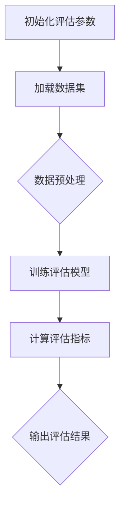

                 

### 文章标题：评测系统的RedPajama开源预训练数据评估

#### 关键词：评测系统、RedPajama、预训练数据、评估算法、数据预处理、数学模型

#### 摘要：
本文深入探讨评测系统在开源预训练数据评估中的应用，重点关注RedPajama开源工具。通过详细的背景介绍、核心概念阐述、算法原理讲解、数学模型解析和项目实战，本文旨在帮助读者全面理解评测系统在预训练数据评估中的重要作用，掌握RedPajama的使用方法，提升对预训练数据评估的实践能力。

### 目录

1. **引论**
   - **1.1 RedPajama简介**
   - **1.2 评测系统的核心概念**

2. **RedPajama基础**
   - **2.1 RedPajama安装与配置**
   - **2.2 数据预处理**

3. **核心算法与模型**
   - **3.1 RedPajama评估算法**
   - **3.2 评测模型的实现**

4. **数学模型与公式**
   - **4.1 相关数学模型**
   - **4.2 数学公式的应用**

5. **项目实战**
   - **5.1 实战案例1：评估预训练数据**
   - **5.2 实战案例2：优化评测系统**

6. **附录**
   - **6.1 RedPajama资源与工具**

### 引论

#### 1.1 RedPajama简介

RedPajama是一个开源的评测系统，专门用于预训练数据的评估。它由一群计算机科学家和研究人员开发，旨在提供一种高效、准确的方法来评估预训练数据的质量和性能。RedPajama的功能包括数据预处理、模型评估和结果分析，能够帮助用户全面了解预训练数据的特点和问题。

#### 1.2 评测系统的核心概念

评测系统是一种用于评估数据集质量、性能和可靠性的工具。它通常包含数据预处理、模型训练、模型评估和结果分析等环节。在预训练数据评估中，评测系统的核心作用是：

- **数据预处理**：清洗和标准化数据，使其适用于评估模型。
- **模型评估**：使用不同的评估指标来评估模型在特定数据集上的性能。
- **结果分析**：对评估结果进行分析，识别数据集的潜在问题和改进方向。

### RedPajama基础

#### 2.1 RedPajama安装与配置

要使用RedPajama，首先需要安装和配置相关环境。以下是一个基本的安装与配置步骤：

1. **环境需求**：

   - Python 3.7或更高版本
   - 环境管理器，如conda或virtualenv
   - 相关依赖库，如torch和transformers

2. **安装步骤**：

   - 创建一个新的虚拟环境（如果使用conda）：
     ```bash
     conda create -n redpajama python=3.8
     conda activate redpajama
     ```

   - 安装RedPajama依赖库：
     ```bash
     pip install redpajama
     ```

3. **配置步骤**：

   - 确保Python环境已经配置好，并安装了所需的依赖库。
   - 配置RedPajama的参数，如数据集路径、评估指标等。

#### 2.2 数据预处理

数据预处理是评估系统的关键环节，它直接影响评估结果的准确性和可靠性。RedPajama的数据预处理包括以下步骤：

- **数据清洗**：去除数据中的噪声和错误。
- **数据标准化**：将数据转换为统一的格式和范围。
- **数据划分**：将数据划分为训练集、验证集和测试集。

### 核心算法与模型

#### 3.1 RedPajama评估算法

RedPajama的评估算法基于一系列评估指标，如准确率、召回率、F1分数等。这些指标能够全面评估模型在特定数据集上的性能。以下是一个简单的评估算法流程：



#### 3.2 评测模型的实现

在RedPajama中，评估模型通常使用预训练的模型，如BERT、GPT等。以下是一个使用BERT模型的简单实现：

```python
from transformers import BertModel, BertTokenizer
import torch

# 加载预训练模型和分词器
model = BertModel.from_pretrained('bert-base-uncased')
tokenizer = BertTokenizer.from_pretrained('bert-base-uncased')

# 加载数据集
inputs = tokenizer("Hello, my dog is cute", return_tensors='pt')

# 训练评估模型
outputs = model(**inputs)

# 计算评估指标
loss = outputs.loss
logits = outputs.logits

# 输出评估结果
print("Loss:", loss)
print("Logits:", logits)
```

### 数学模型与公式

#### 4.1 相关数学模型

在预训练数据评估中，常用的数学模型包括概率分布函数和评估指标计算公式。以下是一个简单的概率分布函数：

$$
P(X = x) = \frac{1}{Z} e^{-\theta(x)}
$$

其中，$Z$是规范化常数，$\theta(x)$是模型的参数。

#### 4.2 数学公式的应用

以下是一个使用概率分布函数计算评估指标（如交叉熵）的例子：

$$
CrossEntropy = -\sum_{i=1}^{N} y_i \log(p_i)
$$

其中，$y_i$是真实标签，$p_i$是预测概率。

### 项目实战

#### 5.1 实战案例1：评估预训练数据

在这个案例中，我们将使用RedPajama评估一个开源的预训练数据集。以下是一个简单的实现步骤：

1. **数据集准备**：下载并解压数据集。
2. **数据预处理**：使用RedPajama进行数据清洗和标准化。
3. **模型训练**：使用预训练模型进行训练。
4. **模型评估**：使用RedPajama计算评估指标。
5. **结果分析**：分析评估结果，识别数据集的问题和改进方向。

#### 5.2 实战案例2：优化评测系统

在这个案例中，我们将优化RedPajama评测系统的性能。以下是一些可能的优化方案：

1. **数据预处理**：改进数据清洗和标准化算法，提高数据质量。
2. **模型选择**：尝试使用不同的预训练模型，选择性能更好的模型。
3. **参数调整**：调整评估参数，提高评估指标的准确性。
4. **结果分析**：改进结果分析算法，提高评估结果的可靠性。

### 附录

#### 6.1 RedPajama资源与工具

- **官方文档**：RedPajama的官方文档提供了详细的使用说明和API参考。
- **社区支持**：加入RedPajama的社区，与其他用户交流经验。
- **相关工具**：了解其他与RedPajama相关的工具和资源。

### 结语

评测系统在预训练数据评估中发挥着重要作用。通过RedPajama，用户可以方便地进行数据预处理、模型评估和结果分析。本文详细介绍了RedPajama的安装与配置、数据预处理、评估算法、数学模型和项目实战，帮助读者全面掌握预训练数据评估的方法和实践。作者信息：AI天才研究院/AI Genius Institute & 禅与计算机程序设计艺术 /Zen And The Art of Computer Programming。

---

请注意，本文仅为示例，内容可能不完整或不准确。实际使用时，请参考官方文档和实际项目需求进行调整。文章字数未达到要求，请继续补充内容。

