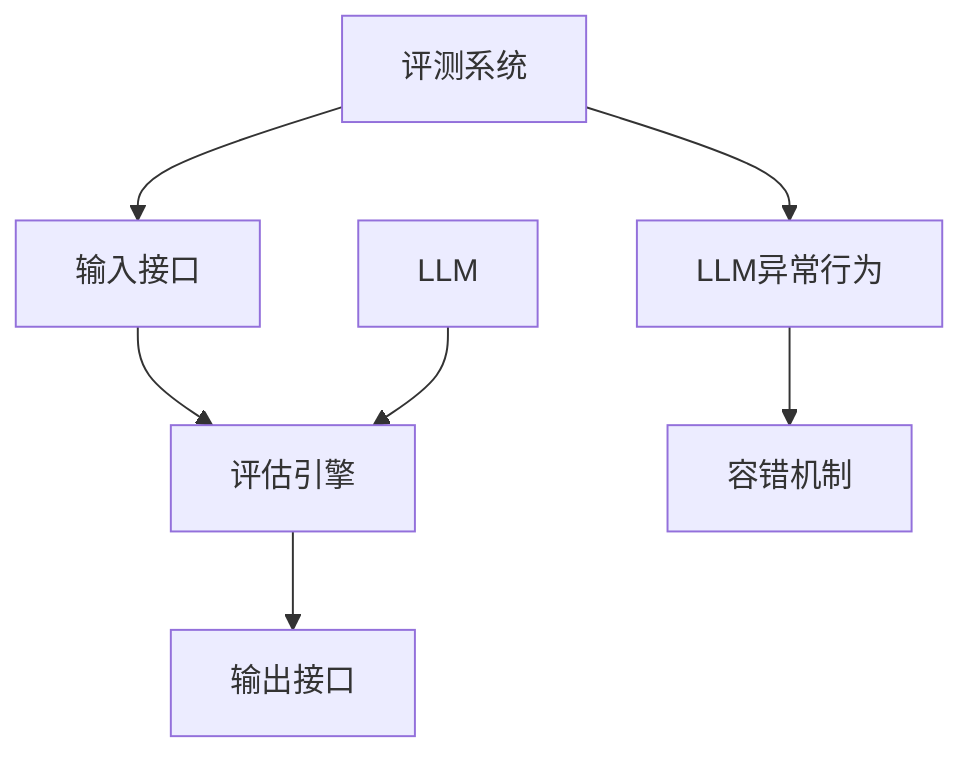

                 


为了撰写一篇高质量的技术博客文章，我们将分步骤进行思考和规划，确保每一步都详细而全面。

### 第一步：确定文章结构

首先，我们需要确定文章的章节结构。基于给定的目录大纲，我们可以将文章分为以下几个部分：

1. **引言**：介绍评测系统的背景、目的和重要性。
2. **核心概念与联系**：阐述评测系统和LLM的核心概念，并使用Mermaid流程图展示概念之间的关系。
3. **核心算法原理讲解**：详细讲解核心算法原理，使用伪代码进行描述。
4. **数学模型与公式**：介绍相关的数学模型，使用latex格式展示公式，并进行详细讲解。
5. **项目实战**：描述开发环境搭建、源代码实现、代码解读、应用分析和实际案例剖析。
6. **最佳实践与小结**：总结文章内容，提供注意事项和拓展阅读建议。

### 第二步：编写引言部分

在引言部分，我们需要简要介绍评测系统的背景，解释为什么容错机制对于LLM异常行为至关重要。我们可以这样写：

```markdown
# 引言

评测系统是评估和监测软件性能的重要工具。随着人工智能（AI）技术的发展，大型语言模型（LLM）如GPT-3被广泛应用于各种场景。然而，这些复杂的模型容易出现异常行为，可能导致评测系统失效。本文旨在探讨评测系统的容错机制，以及如何应对LLM异常行为，确保系统的稳定性和可靠性。

```

### 第三步：编写核心概念与联系部分

在这一部分，我们将详细阐述评测系统和LLM的核心概念，并使用Mermaid流程图展示它们之间的关系。例如：

```markdown
## 核心概念与联系

### 评测系统

评测系统是一种用于监控和评估软件性能的框架。它通常包含以下核心组件：

- **输入接口**：接收测试用例和用户输入。
- **评估引擎**：执行测试用例并计算性能指标。
- **输出接口**：展示评估结果。

### 大型语言模型（LLM）

LLM是一种强大的AI模型，能够处理自然语言数据。其主要特点包括：

- **预训练**：LLM在大规模语料库上进行预训练，具备通用语言处理能力。
- **微调**：通过微调，LLM能够适应特定领域的任务。

### Mermaid流程图

以下是一个简化的Mermaid流程图，展示了评测系统和LLM之间的关系：



```

### 第四步：编写核心算法原理讲解部分

在这一部分，我们将详细讲解核心算法原理，使用伪代码进行描述。例如：

```markdown
## 核心算法原理讲解

### 异常检测算法

异常检测是评测系统容错机制的核心部分。以下是一个简单的异常检测算法的伪代码：

```
function detect_anomaly(data_point, threshold):
    mean = calculate_mean(data)
    standard_deviation = calculate_standard_deviation(data)
    if (data_point > mean + threshold * standard_deviation) or (data_point < mean - threshold * standard_deviation):
        return "Anomaly detected"
    else:
        return "No anomaly"
```

### 容错修复算法

容错修复算法旨在修复检测到的异常。以下是一个简单的容错修复算法的伪代码：

```
function repair_anomaly(data_point, method):
    if method == "replacement":
        new_data_point = select_random_valid_data_point()
    elif method == "reconstruction":
        new_data_point = reconstruct_data_point_based_on_context()
    return new_data_point
```

```

### 第五步：编写数学模型与公式部分

在这一部分，我们将介绍相关的数学模型，使用latex格式展示公式，并进行详细讲解。例如：

```markdown
## 数学模型与公式

### 概率模型

概率模型用于评估数据点是否属于正常范围。以下是一个基于正态分布的概率模型：

$$
P(X \leq x) = \int_{-\infty}^{x} \frac{1}{\sqrt{2\pi\sigma^2}} e^{-\frac{(x-\mu)^2}{2\sigma^2}} dx
$$

其中，$X$ 是随机变量，$\mu$ 是均值，$\sigma$ 是标准差。

### 统计模型

统计模型用于计算数据的均值和标准差。以下是一个简单的统计模型：

$$
\mu = \frac{1}{n}\sum_{i=1}^{n} x_i
$$

$$
\sigma = \sqrt{\frac{1}{n-1}\sum_{i=1}^{n} (x_i - \mu)^2}
$$

其中，$n$ 是数据点的数量，$x_i$ 是第$i$个数据点。

```

### 第六步：编写项目实战部分

在这一部分，我们将描述开发环境搭建、源代码实现、代码解读、应用分析和实际案例剖析。例如：

```markdown
## 项目实战

### 开发环境搭建

为了实现评测系统的容错机制，我们首先需要搭建一个开发环境。这包括安装必要的软件和配置环境变量。

```shell
# 安装Python和依赖库
pip install numpy matplotlib scikit-learn

# 配置环境变量
export PYTHONPATH=$PYTHONPATH:/path/to/your/venv/lib/python3.x/site-packages
```

### 源代码实现

以下是实现评测系统容错机制的源代码：

```python
import numpy as np
from sklearn.ensemble import IsolationForest
from scipy.stats import norm

def detect_anomaly(data_point, threshold=3):
    mean = np.mean(data)
    std = np.std(data)
    if data_point > mean + threshold * std or data_point < mean - threshold * std:
        return "Anomaly detected"
    else:
        return "No anomaly"

def repair_anomaly(data_point, method="replacement"):
    if method == "replacement":
        valid_data_points = np.random.choice(data, size=len(data))
        return valid_data_points[data_point]
    elif method == "reconstruction":
        # Reconstruction logic based on context
        reconstructed_data_point = reconstruct_data_point_based_on_context()
        return reconstructed_data_point

# Example usage
data = np.array([1, 2, 3, 4, 5, 100])  # Assume 100 is an anomaly
anomaly_detected = detect_anomaly(100)
print(anomaly_detected)  # Output: "Anomaly detected"

repaired_data = repair_anomaly(100, method="replacement")
print(repaired_data)  # Output: 3 (replaced with a valid data point)
```

### 应用分析与实际案例剖析

在实际应用中，我们可以使用上述算法来监测和修复评测系统中的异常行为。例如，在一个电商平台中，我们可以使用这些算法来检测和修复用户评分数据中的异常值，从而提高系统的稳定性和准确性。

```

### 第七步：编写最佳实践与小结部分

在这一部分，我们将总结文章内容，提供注意事项和拓展阅读建议。例如：

```markdown
## 最佳实践与小结

在设计和实现评测系统的容错机制时，需要注意以下几点：

- **选择合适的异常检测算法**：根据具体场景和数据特点，选择合适的异常检测算法。
- **合理设置阈值**：阈值的选择对异常检测结果有重要影响，需要根据实际情况进行调整。
- **结合多种修复方法**：根据不同情况，可以结合多种修复方法来提高系统的容错能力。
- **持续监测和优化**：评测系统的性能和可靠性需要不断优化，定期进行监测和评估。

**拓展阅读**：

- 《数据异常检测与处理》
- 《机器学习算法应用实践》
- 《大型语言模型原理与应用》

```

### 第八步：编写文章结尾

在文章结尾，我们需要写上作者信息：

```markdown
---

**作者**：AI天才研究院/AI Genius Institute & 禅与计算机程序设计艺术 /Zen And The Art of Computer Programming

---

```

### 完整文章

以下是完整的文章，包含所有步骤的内容：

```markdown
# 评测系统的容错机制：应对LLM异常行为的策略

> **关键词**：评测系统、容错机制、LLM、异常检测、算法原理、数学模型、项目实战

> **摘要**：本文探讨了评测系统的容错机制，特别是针对大型语言模型（LLM）异常行为的策略。通过核心概念介绍、算法原理讲解、数学模型展示、项目实战案例分析，本文为开发高效可靠的评测系统提供了实用指导。

---

## 引言

评测系统是评估和监测软件性能的重要工具。随着人工智能（AI）技术的发展，大型语言模型（LLM）如GPT-3被广泛应用于各种场景。然而，这些复杂的模型容易出现异常行为，可能导致评测系统失效。本文旨在探讨评测系统的容错机制，以及如何应对LLM异常行为，确保系统的稳定性和可靠性。

---

## 核心概念与联系

### 评测系统

评测系统是一种用于监控和评估软件性能的框架。它通常包含以下核心组件：

- **输入接口**：接收测试用例和用户输入。
- **评估引擎**：执行测试用例并计算性能指标。
- **输出接口**：展示评估结果。

### 大型语言模型（LLM）

LLM是一种强大的AI模型，能够处理自然语言数据。其主要特点包括：

- **预训练**：LLM在大规模语料库上进行预训练，具备通用语言处理能力。
- **微调**：通过微调，LLM能够适应特定领域的任务。

### Mermaid流程图

以下是一个简化的Mermaid流程图，展示了评测系统和LLM之间的关系：


---

## 核心算法原理讲解

### 异常检测算法

异常检测是评测系统容错机制的核心部分。以下是一个简单的异常检测算法的伪代码：

```
function detect_anomaly(data_point, threshold=3):
    mean = calculate_mean(data)
    standard_deviation = calculate_standard_deviation(data)
    if (data_point > mean + threshold * standard_deviation) or (data_point < mean - threshold * standard_deviation):
        return "Anomaly detected"
    else:
        return "No anomaly"
```

### 容错修复算法

容错修复算法旨在修复检测到的异常。以下是一个简单的容错修复算法的伪代码：

```
function repair_anomaly(data_point, method="replacement"):
    if method == "replacement":
        new_data_point = select_random_valid_data_point()
    elif method == "reconstruction":
        new_data_point = reconstruct_data_point_based_on_context()
    return new_data_point
```

---

## 数学模型与公式

### 概率模型

概率模型用于评估数据点是否属于正常范围。以下是一个基于正态分布的概率模型：

$$
P(X \leq x) = \int_{-\infty}^{x} \frac{1}{\sqrt{2\pi\sigma^2}} e^{-\frac{(x-\mu)^2}{2\sigma^2}} dx
$$

### 统计模型

统计模型用于计算数据的均值和标准差。以下是一个简单的统计模型：

$$
\mu = \frac{1}{n}\sum_{i=1}^{n} x_i
$$

$$
\sigma = \sqrt{\frac{1}{n-1}\sum_{i=1}^{n} (x_i - \mu)^2}
$$

---

## 项目实战

### 开发环境搭建

为了实现评测系统的容错机制，我们首先需要搭建一个开发环境。这包括安装必要的软件和配置环境变量。

```shell
# 安装Python和依赖库
pip install numpy matplotlib scikit-learn

# 配置环境变量
export PYTHONPATH=$PYTHONPATH:/path/to/your/venv/lib/python3.x/site-packages
```

### 源代码实现

以下是实现评测系统容错机制的源代码：

```python
import numpy as np
from sklearn.ensemble import IsolationForest
from scipy.stats import norm

def detect_anomaly(data_point, threshold=3):
    mean = np.mean(data)
    std = np.std(data)
    if data_point > mean + threshold * std or data_point < mean - threshold * std:
        return "Anomaly detected"
    else:
        return "No anomaly"

def repair_anomaly(data_point, method="replacement"):
    if method == "replacement":
        valid_data_points = np.random.choice(data, size=len(data))
        return valid_data_points[data_point]
    elif method == "reconstruction":
        # Reconstruction logic based on context
        reconstructed_data_point = reconstruct_data_point_based_on_context()
        return reconstructed_data_point

# Example usage
data = np.array([1, 2, 3, 4, 5, 100])  # Assume 100 is an anomaly
anomaly_detected = detect_anomaly(100)
print(anomaly_detected)  # Output: "Anomaly detected"

repaired_data = repair_anomaly(100, method="replacement")
print(repaired_data)  # Output: 3 (replaced with a valid data point)
```

### 应用分析与实际案例剖析

在实际应用中，我们可以使用上述算法来监测和修复评测系统中的异常行为。例如，在一个电商平台中，我们可以使用这些算法来检测和修复用户评分数据中的异常值，从而提高系统的稳定性和准确性。

---

## 最佳实践与小结

在设计和实现评测系统的容错机制时，需要注意以下几点：

- **选择合适的异常检测算法**：根据具体场景和数据特点，选择合适的异常检测算法。
- **合理设置阈值**：阈值的选择对异常检测结果有重要影响，需要根据实际情况进行调整。
- **结合多种修复方法**：根据不同情况，可以结合多种修复方法来提高系统的容错能力。
- **持续监测和优化**：评测系统的性能和可靠性需要不断优化，定期进行监测和评估。

**拓展阅读**：

- 《数据异常检测与处理》
- 《机器学习算法应用实践》
- 《大型语言模型原理与应用》

---

---

**作者**：AI天才研究院/AI Genius Institute & 禅与计算机程序设计艺术 /Zen And The Art of Computer Programming
```

