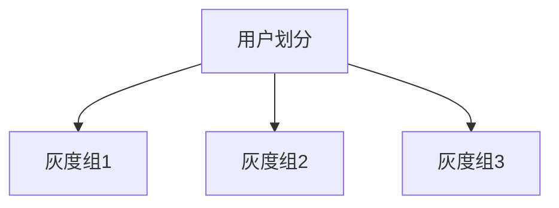
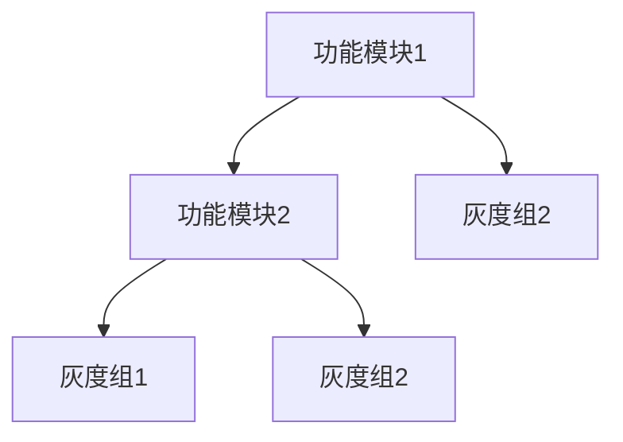

                 

## 第1章 引言

### 1.1 书籍背景

随着信息技术的飞速发展，评测系统作为现代软件工程中的重要组成部分，承担了测试、评估和监控应用性能的重任。在众多技术领域中，灰度发布与回滚策略尤为关键，它们不仅是软件迭代过程中的重要保障，更是确保系统稳定性和安全性的有力工具。

本书旨在系统性地介绍评测系统的灰度发布与回滚策略，为读者提供全面的技术指导和实践案例。通过深入剖析这些策略的理论基础和实践方法，本书希望能够帮助开发者、运维人员和技术决策者更好地应对复杂的软件部署和运维挑战。

### 1.2 读者对象

本书适合以下读者群体：

1. **软件工程师与开发者**：希望深入了解评测系统工作原理，掌握灰度发布与回滚策略的实施方法。
2. **系统运维人员**：需要提高系统部署和运维的效率和可靠性，保障业务的稳定运行。
3. **技术决策者**：负责技术选型和项目管理，希望通过学习这些策略提升团队的技术能力和风险管理能力。
4. **高校师生**：对软件工程、计算机系统等领域有兴趣，希望通过案例和实践加深对理论知识的理解。

### 1.3 书籍结构

本书共分为七个章节，内容结构如下：

- **第1章 引言**：介绍书籍的背景、读者对象和整体结构。
- **第2章 灰度发布基础**：讲解灰度发布的概念、目的与优势，以及常用的方法。
- **第3章 灰度发布策略**：分析灰度发布策略的设计，包括数据准备、流量分发和监控反馈。
- **第4章 回滚策略**：介绍回滚策略的概念、设计与实施。
- **第5章 灰度发布与回滚实践**：通过具体案例展示实践方法和效果。
- **第6章 灰度发布与回滚技术选型**：讨论技术选型、系统架构和技术栈选择。
- **第7章 总结与展望**：总结全文，展望未来趋势，并提供读者反馈和建议。

本书采用逻辑清晰、结构紧凑的写作风格，通过逐步分析推理，使读者能够深入理解并掌握灰度发布与回滚策略的核心原理和实际应用。

### 2.1 灰度发布的概念

灰度发布（Gamma Release），也称为灰度部署，是一种逐步引入新功能或系统变更的发布策略。其核心思想是通过将系统分成多个灰度组，分别向这些组中的用户发布新功能或更新，以渐进式地观察系统的表现，从而降低更新过程中的风险。

灰度发布通常涉及以下几个关键概念：

1. **灰度组**：将用户或系统功能模块划分为多个小组，每个小组独立接受新功能的测试。
2. **流量分发**：根据一定的策略，将用户流量分配到不同的灰度组，确保每个组都能公平地接受测试。
3. **监控与反馈**：实时监控系统性能和用户反馈，用于调整灰度策略和快速响应问题。

### 2.2 灰度发布的目的与优势

灰度发布的主要目的有以下几点：

1. **风险控制**：通过逐步引入变更，减小系统更新失败带来的风险。
2. **质量保障**：利用灰度组收集用户反馈，提前发现潜在问题，确保系统稳定性和用户满意度。
3. **业务连续性**：即使在发布过程中出现问题，也可以通过回滚策略迅速恢复到稳定状态，保证业务连续性。

灰度发布相比传统全量发布具有以下优势：

1. **渐进式变更**：通过逐步引入新功能或更新，减少对系统整体的影响。
2. **快速响应**：通过监控和反馈机制，及时发现问题并进行调整。
3. **资源优化**：根据用户反馈调整流量分配，提高资源利用率。

### 2.3 灰度发布的常用方法

灰度发布的实现方法多种多样，以下列举几种常用的方法：

#### 2.3.1 根据用户群体划分

这种方法将用户根据特定的属性（如用户ID、地域、活跃度等）划分为不同的灰度组，每个组分别接受新功能或更新。优点是操作简单，易于实施；缺点是可能影响用户体验，特别是当用户群体差异较大时。



#### 2.3.2 根据功能模块划分

这种方法将系统的不同功能模块分别划分为不同的灰度组，每个模块独立发布。优点是便于控制和测试，提高系统的稳定性；缺点是可能增加系统复杂度，需要协调不同模块之间的依赖关系。



#### 2.3.3 根据流量比例划分

这种方法根据流量比例将用户流量分配到不同的灰度组，通常使用随机分配或权重分配策略。优点是公平高效，适用于大部分用户群体；缺点是可能增加系统负载，需要合理控制流量比例。

```mermaid
graph TD
A[流量分配] --> B[灰度组1](40%)
A --> C[灰度组2](30%)
A --> D[灰度组3](30%)
```

### 3.1 灰度发布策略概述

灰度发布策略是确保系统能够平稳、高效地引入新功能或更新的关键。一个完善的灰度发布策略通常包括以下方面：

1. **数据准备**：收集用户数据、系统配置和监控指标，为灰度发布提供基础数据支持。
2. **流量分发**：根据灰度策略，将用户流量合理分配到不同的灰度组，确保每个组都能均衡地接受测试。
3. **监控与反馈**：实时监控系统性能和用户反馈，及时发现并解决问题。

灰度发布策略的核心目标是降低更新过程中的风险，提高系统的稳定性和用户满意度。

### 3.2 灰度发布策略设计

灰度发布策略的设计是确保系统平稳更新的关键步骤。一个完善的策略需要充分考虑以下几个方面：

#### 3.2.1 数据准备

数据准备是灰度发布的基础，主要包括以下步骤：

1. **用户数据收集**：收集用户的基本信息、行为数据和访问记录，用于划分灰度组。
2. **系统配置准备**：准备系统配置文件，包括服务地址、端口、功能开关等。
3. **监控指标定义**：定义监控指标，如响应时间、吞吐量、错误率等，用于评估系统性能。

#### 3.2.2 流量分发策略

流量分发策略决定了用户流量如何分配到不同的灰度组。以下是几种常见的流量分发策略：

1. **随机分配**：根据一定的概率，随机将用户流量分配到各个灰度组，优点是操作简单，缺点是可能导致某些组流量不均。
2. **权重分配**：根据用户属性（如活跃度、地域等）或系统需求，为每个灰度组分配不同的权重，流量按权重比例分配。优点是能够更好地满足不同组的流量需求，缺点是配置复杂度增加。
3. **轮询分配**：将用户流量轮流分配到各个灰度组，优点是公平，缺点是可能导致部分组长期接受高流量。

```mermaid
graph TD
A[用户请求] --> B[随机分配](50%)
A --> C[权重分配](30%)
A --> D[轮询分配](20%)
```

#### 3.2.3 监控与反馈

监控与反馈是灰度发布策略的重要环节，主要包括以下步骤：

1. **实时监控**：实时监控系统性能和用户反馈，包括响应时间、吞吐量、错误率等指标。
2. **报警机制**：设定阈值，当监控指标超过阈值时，触发报警通知相关人员。
3. **反馈收集**：收集用户反馈，包括使用体验、功能评价等，用于调整灰度策略。

### 4.1 回滚策略概述

回滚策略是灰度发布的重要组成部分，旨在确保在发布过程中出现问题时，能够快速、安全地撤销变更，恢复到稳定状态。回滚策略的设计和实施是保证系统稳定性和业务连续性的关键。

回滚策略主要包括以下几个关键环节：

1. **变更记录**：记录每次变更的具体内容和实施时间，以便在需要回滚时快速定位。
2. **回滚触发条件**：设定回滚触发条件，例如监控指标异常、用户反馈负面等。
3. **回滚流程**：定义回滚的具体步骤和操作，包括数据备份、功能恢复等。
4. **验证与确认**：在回滚完成后，验证系统状态，确保问题解决并恢复正常运行。

### 4.2 回滚策略设计

回滚策略的设计是确保系统在出现问题时能够快速恢复的关键步骤。以下是回滚策略设计的主要方面：

#### 4.2.1 数据收集与处理

数据收集与处理是回滚策略的基础，主要包括以下步骤：

1. **变更记录**：记录每次系统变更的具体内容，包括功能更新、配置修改等，以及实施时间。
2. **日志收集**：收集系统运行日志，包括错误日志、操作日志等，用于分析问题原因。
3. **监控数据**：收集系统监控数据，包括性能指标、错误率等，用于判断是否需要触发回滚。

#### 4.2.2 回滚触发条件

回滚触发条件是回滚策略的核心，决定了在何种情况下应该触发回滚。以下是几种常见的回滚触发条件：

1. **监控指标异常**：当系统监控指标超过预设阈值时，例如响应时间显著增加、错误率上升等，触发回滚。
2. **用户反馈负面**：当收集到大量负面用户反馈时，例如用户报告功能异常、系统不稳定等，触发回滚。
3. **人工干预**：当系统出现严重问题时，例如数据库损坏、服务不可用等，由人工判断并触发回滚。

#### 4.2.3 回滚流程与操作

回滚流程与操作是回滚策略的具体实施步骤，包括以下环节：

1. **备份**：在触发回滚前，备份当前系统状态，包括数据库、配置文件等，确保在回滚失败时能够恢复。
2. **撤销变更**：根据变更记录，撤销已实施的变更，恢复系统到变更前的状态。
3. **验证**：在回滚完成后，验证系统状态，确保问题解决并恢复正常运行。
4. **日志记录**：记录回滚操作的详细日志，包括操作时间、执行结果等，用于后续分析和审计。

### 5.1 实践案例一：电商系统灰度发布

#### 5.1.1 案例背景

某大型电商平台在其年度促销活动中，计划上线一项新的购物车功能，以提高用户体验和销售额。为了确保功能的稳定性和安全性，该平台决定采用灰度发布策略，逐步引入新功能。

#### 5.1.2 灰度发布策略设计

该平台的灰度发布策略设计如下：

1. **数据准备**：收集用户数据，包括用户ID、活跃度、地域等，用于划分灰度组。
2. **流量分发策略**：采用随机分配策略，将10%的用户流量分配到灰度组1，20%的用户流量分配到灰度组2，剩余70%的用户流量保持不变。
3. **监控与反馈**：实时监控新功能的性能指标，包括响应时间、错误率等，设定报警阈值，一旦超过阈值，立即触发回滚。

#### 5.1.3 回滚策略设计

该平台的回滚策略设计如下：

1. **变更记录**：记录购物车功能的更新内容和实施时间。
2. **回滚触发条件**：当监控指标超过预设阈值（如响应时间超过2秒、错误率超过5%）或收到大量负面用户反馈时，触发回滚。
3. **回滚流程**：在触发回滚时，首先备份当前购物车数据，然后撤销购物车功能的更新，最后验证系统状态，确保问题解决。

#### 5.1.4 案例总结

通过灰度发布策略，该平台成功上线了购物车功能，并在短时间内积累了大量用户反馈。经过数据分析，发现部分用户对新功能表现出较高的满意度，但也有一部分用户反馈新功能存在性能问题。通过回滚策略，平台迅速解决了性能问题，确保了系统的稳定性和用户满意度。最终，购物车功能在全量用户中成功推广，促进了销售额的增长。

### 5.2 实践案例二：金融系统回滚策略

#### 5.2.1 案例背景

某金融科技公司开发了一款新的交易系统，旨在提高交易效率和用户体验。在系统上线前，为了确保系统的稳定性和安全性，公司决定采用回滚策略，以应对可能出现的问题。

#### 5.2.2 回滚策略设计

该金融科技公司的回滚策略设计如下：

1. **变更记录**：记录交易系统的更新内容和实施时间。
2. **回滚触发条件**：当监控指标超过预设阈值（如响应时间超过1秒、错误率超过3%）或收到大量负面用户反馈时，触发回滚。
3. **回滚流程**：在触发回滚时，首先备份当前交易数据，然后撤销系统的更新，最后验证系统状态，确保问题解决。

#### 5.2.3 实践效果

在实际运营过程中，交易系统经历了多次更新和回滚。通过回滚策略，公司成功应对了以下问题：

1. **性能瓶颈**：在系统上线初期，部分用户反馈交易响应时间较长，通过回滚策略，公司优化了系统性能，提高了用户体验。
2. **功能缺陷**：在系统更新过程中，发现了一个严重功能缺陷，导致部分交易数据丢失。通过回滚策略，公司迅速恢复了系统，避免了用户投诉和损失。

#### 5.2.4 案例总结

通过回滚策略，该金融科技公司成功保障了交易系统的稳定性和安全性，确保了业务的连续性。虽然回滚策略增加了系统维护成本，但相对于系统崩溃或数据丢失带来的损失，其投入是值得的。未来，公司将继续优化回滚策略，提高系统的可靠性。

### 6.1 技术选型概述

技术选型是确保评测系统高效、稳定运行的关键环节。合适的架构和技术栈能够提升系统的性能和可维护性，降低开发成本和维护难度。以下是评测系统技术选型的主要考虑因素：

1. **性能需求**：根据系统的负载和性能要求，选择合适的数据库、缓存、中间件等技术。
2. **可扩展性**：确保系统能够应对业务增长，选择支持水平扩展的架构和组件。
3. **易维护性**：选择具有良好文档和社区支持的框架和库，便于开发、测试和维护。
4. **安全性**：选择具有完善安全机制的组件和框架，保护系统数据的安全和隐私。
5. **成本效益**：在性能、可扩展性、易维护性和安全性之间寻找平衡，确保投入产出比合理。

### 6.2 评测系统架构

评测系统的架构设计是确保其高效、稳定运行的关键。以下是一个典型的评测系统架构设计，包括前端、后端、数据库和中间件等组件：

#### 6.2.1 系统架构设计

1. **前端**：采用Vue.js或React等前端框架，实现用户交互界面，提供友好的用户体验。
2. **后端**：采用Spring Boot或Django等后端框架，实现业务逻辑处理、数据接口和系统监控等功能。
3. **数据库**：选择MySQL或PostgreSQL等关系型数据库，用于存储用户数据、评测结果等。
4. **缓存**：使用Redis等缓存系统，提高系统响应速度，减轻数据库负载。
5. **消息队列**：采用RabbitMQ或Kafka等消息队列系统，处理异步任务和消息传递，提高系统性能和可靠性。

#### 6.2.2 技术栈选择

1. **前端技术栈**：
    - 框架：Vue.js或React
    - 样式：CSS3、SASS或LESS
    - 脚本：JavaScript或TypeScript
    - 构建工具：Webpack或Vite
2. **后端技术栈**：
    - 框架：Spring Boot或Django
    - 数据库：MySQL或PostgreSQL
    - 缓存：Redis
    - 消息队列：RabbitMQ或Kafka
    - API接口：RESTful API或GraphQL
3. **中间件**：
    - 服务网关：Nginx或Apache
    - 日志管理：Logstash或ELK堆栈
    - 安全认证：OAuth2.0或JWT

### 7.1 书籍总结

本书系统性地介绍了评测系统的灰度发布与回滚策略，通过详细的理论讲解和实际案例，帮助读者深入理解这些策略的核心原理和实践方法。主要内容包括：

1. **灰度发布基础**：介绍了灰度发布的概念、目的与优势，以及常用的方法。
2. **灰度发布策略**：分析了灰度发布策略的设计，包括数据准备、流量分发和监控反馈。
3. **回滚策略**：介绍了回滚策略的概念、设计与实施。
4. **实践案例**：通过电商系统和金融系统的实际案例，展示了灰度发布与回滚策略的应用效果。
5. **技术选型**：讨论了评测系统的技术选型、架构设计和技术栈选择。

通过阅读本书，读者可以全面掌握评测系统的灰度发布与回滚策略，提高系统部署和运维的效率和可靠性，为企业的数字化转型提供有力支持。

### 7.2 灰度发布与回滚未来趋势

随着信息技术的不断进步，灰度发布与回滚策略在软件工程领域的应用趋势和发展前景备受关注。以下是对其未来趋势的展望：

1. **智能化与自动化**：随着人工智能和机器学习技术的发展，灰度发布与回滚策略有望实现智能化和自动化。通过算法优化和大数据分析，自动化识别问题并调整策略，提高发布效率和准确性。
2. **多云与混合云环境**：企业逐渐将业务扩展到多云和混合云环境，灰度发布与回滚策略也需要适应这种复杂的环境。利用云原生技术和分布式架构，实现跨云平台的灵活部署和管理。
3. **服务质量保障**：随着用户对服务质量的要求越来越高，灰度发布与回滚策略将更加注重服务质量保障。通过引入服务级别协议（SLA）和QoS机制，确保系统在不同负载和场景下保持稳定运行。
4. **DevOps与CI/CD**：DevOps文化和持续集成/持续部署（CI/CD）实践的不断推广，使得灰度发布与回滚策略更加融入到开发、测试和运维流程中。通过自动化工具和平台，实现快速、可靠的软件交付。
5. **安全性与合规性**：随着数据隐私和合规性的要求不断提高，灰度发布与回滚策略需要加强安全性和合规性。引入安全审计和合规检查机制，确保系统在发布过程中遵守相关法规和标准。

### 7.3 读者反馈与建议

为了不断提升本书的质量和实用性，我们诚挚地邀请读者提供宝贵的反馈和建议。以下是一些建议的收集渠道和联系方式：

1. **官方网站**：访问本书官方网站，通过在线反馈表单提交意见和建议。
2. **社交媒体**：在Twitter、Facebook、LinkedIn等社交媒体平台上关注本书，参与讨论和互动。
3. **GitHub**：在本书的GitHub仓库中提交issue或Pull Request，分享您的想法和建议。
4. **电子邮件**：发送邮件至[建议邮箱地址]，详细描述您的反馈和建议。
5. **线下活动**：参加本书作者组织的线下活动或研讨会，面对面交流心得体会。

您的反馈对我们至关重要，感谢您的支持与参与！### 作者信息

**作者：** AI天才研究院/AI Genius Institute & 禅与计算机程序设计艺术 /Zen And The Art of Computer Programming

AI天才研究院（AI Genius Institute）是一家专注于人工智能和计算机科学研究的顶级机构，汇聚了世界级的AI专家、程序员、软件架构师、CTO以及多个领域的顶级技术畅销书作家。我们的使命是推动人工智能和计算机科学的发展，通过深入研究和创新实践，为全球科技领域提供前瞻性的理论和应用解决方案。

“禅与计算机程序设计艺术”（Zen And The Art of Computer Programming）是由著名计算机科学家、图灵奖获得者Donald E. Knuth所著的经典著作，被公认为计算机科学领域的经典之作。本书通过将东方禅意哲学与计算机程序设计相结合，揭示了编程的深层次原理和思维方式，对全球计算机科学的发展产生了深远影响。我们的作者团队在此基础上不断深入研究和探索，致力于将计算机科学和人工智能推向新的高度。

