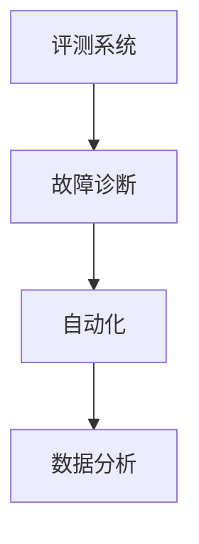

                 


### 文章标题
《评测系统的自动化故障诊断功能》

### 文章关键词
- 评测系统
- 自动化故障诊断
- 故障检测算法
- 故障隔离算法
- 故障预测算法
- 数学模型
- 实际案例

### 文章摘要
本文详细探讨了评测系统的自动化故障诊断功能。首先，介绍了评测系统的概念和自动化故障诊断的重要性。接着，阐述了自动化故障诊断的核心概念，包括故障诊断、自动化、评测系统等，并通过Mermaid流程图展示了它们之间的关系。随后，本文深入分析了评测系统的基础，包括基本原理、组成部分和常见类型。在此基础上，详细讲解了自动化故障诊断所依赖的核心算法，包括故障检测、故障隔离和故障预测算法，并使用伪代码进行了详细阐述。随后，介绍了故障诊断中使用的数学模型和公式，并通过实例进行了详细说明。接下来，本文详细讲解了自动化故障诊断系统的实现过程，包括数据收集、数据处理、故障检测、故障定位和故障恢复等。随后，通过实际案例展示了自动化故障诊断系统的应用，包括系统搭建、源代码实现、代码解读与分析。接着，本文分析了几个典型的自动化故障诊断案例，总结了经验教训。最后，探讨了自动化故障诊断技术的发展趋势和潜在挑战，为未来的研究提供了方向。

---

### 第一部分：引言

#### 1.1 评测系统的概念与自动化故障诊断的重要性

评测系统是一种用于评估系统性能、稳定性和可靠性的工具，它能够帮助我们及时发现系统中潜在的问题，并提供相应的解决方案。随着信息技术的飞速发展，系统的复杂性和规模日益增加，手动进行故障诊断和修复变得日益困难，自动化故障诊断功能因此显得尤为重要。

自动化故障诊断功能通过利用先进的算法和数据分析技术，可以自动识别和定位系统故障，大大提高了故障诊断的效率和准确性。这不仅有助于减少系统停机时间，提高系统的可用性，还能为系统优化和故障预防提供重要依据。

#### 1.2 自动化故障诊断的核心概念

自动化故障诊断涉及多个核心概念，包括故障诊断、自动化、评测系统等。故障诊断是指识别系统中的异常或故障，并确定其位置和原因的过程。自动化则是指利用计算机程序和算法自动执行任务，减少人工干预。评测系统则是用于评估系统性能和可靠性的工具。

这三个概念之间的关系可以用Mermaid流程图来展示：



在这个流程图中，评测系统是核心，故障诊断和自动化是支撑评测系统有效运行的两个关键环节。

---

### 第二部分：评测系统基础

#### 2.1 评测系统的基本原理

评测系统的基本原理是通过收集系统运行数据，对系统的性能、稳定性和可靠性进行评估。具体来说，评测系统包括以下几个核心要素：

1. **数据收集**：通过传感器、日志文件等途径，收集系统运行过程中的各种数据。
2. **数据处理**：对收集到的数据进行清洗、转换和分析，提取有用的信息。
3. **评估指标**：根据业务需求，定义一系列评估指标，如响应时间、吞吐量、错误率等。
4. **结果展示**：将评估结果以图表、报表等形式展示，为系统优化和故障诊断提供依据。

#### 2.2 评测系统的组成部分

评测系统通常由以下几个部分组成：

1. **数据收集模块**：负责从各种来源收集系统运行数据。
2. **数据处理模块**：负责对收集到的数据进行分析和处理，提取有用的信息。
3. **评估模块**：根据定义的评估指标，对处理后的数据进行分析和评估。
4. **报警模块**：当系统出现异常时，及时发出警报，提醒相关人员。
5. **报表生成模块**：将评估结果以图表、报表等形式展示，为系统优化和故障诊断提供依据。

#### 2.3 评测系统的常见类型

评测系统可以根据评估对象和目的的不同，分为以下几种类型：

1. **性能评测系统**：主要评估系统的性能指标，如响应时间、吞吐量等。
2. **稳定性评测系统**：主要评估系统的稳定性和可靠性，如系统崩溃率、故障恢复时间等。
3. **安全性评测系统**：主要评估系统的安全性，如漏洞扫描、安全测试等。
4. **可用性评测系统**：主要评估系统的易用性和用户体验，如界面友好性、操作便捷性等。

---

### 第三部分：故障诊断算法

#### 3.1 故障诊断算法概述

故障诊断算法是自动化故障诊断的核心，它通过分析系统运行数据，识别并定位系统中的故障。故障诊断算法可以分为故障检测、故障隔离和故障预测三个阶段。

- **故障检测**：识别系统中是否存在故障。
- **故障隔离**：确定故障的具体位置。
- **故障预测**：预测未来可能发生的故障。

这三个阶段相互关联，共同构成了一个完整的故障诊断过程。

#### 3.2 故障检测算法

故障检测算法的基本任务是识别系统中的异常或故障。常见的故障检测算法包括阈值检测法、统计方法、机器学习方法等。

1. **阈值检测法**：
   ```python
   if (测量的值 > 阈值):
       发出故障警报。
   else:
       正常运行。
   ```

2. **统计方法**：
   ```python
   均值 = 平均测量值
   方差 = 平均方差
   if (测量的值 > 均值 + k*方差):
       发出故障警报。
   else:
       正常运行。
   ```

3. **机器学习方法**：
   ```python
   输入：历史测量数据
   输出：故障预测概率
   if (故障预测概率 > 0.5):
       发出故障警报。
   else:
       正常运行。
   ```

#### 3.3 故障隔离算法

故障隔离算法的目的是确定故障的具体位置。常见的故障隔离算法包括自校验法、逻辑分析法、递归分解法等。

1. **自校验法**：
   ```python
   if (当前组件运行正常):
       跳转到下一个组件。
   else:
       当前组件存在故障。
   ```

2. **逻辑分析法**：
   ```python
   for each component C:
       if (C运行正常):
           继续下一轮检查。
       else:
           故障定位到组件C。
   ```

3. **递归分解法**：
   ```python
   function isolateFault(components):
       if (components中的所有组件都运行正常):
           没有故障。
       else:
           找到故障组件并隔离。
   ```

#### 3.4 故障预测算法

故障预测算法的目的是预测未来可能发生的故障。常见的故障预测算法包括时间序列分析法、回归分析法、神经网络预测法等。

1. **时间序列分析法**：
   ```python
   function predictFault(data):
       拟合时间序列模型。
       预测未来故障。
   ```

2. **回归分析法**：
   ```python
   y = a * x + b
   function predictFault(x):
       y = a * x + b
       return y
   ```

3. **神经网络预测法**：
   ```python
   输入：历史测量数据
   输出：故障预测概率
   function predictFault(data):
       训练神经网络。
       预测未来故障。
   ```

---

### 第四部分：数学模型和公式

在故障诊断中，数学模型和公式是关键工具。以下是一些常用的数学模型和公式：

#### 1. 阈值检测法

$$
阈值 = 均值 + k * 方差
$$

其中，均值是测量的平均值，方差是测量的方差，k 是一个常数。

#### 2. 统计方法

$$
故障概率 = P(测量的值 > 阈值)
$$

其中，P 是概率函数。

#### 3. 机器学习方法

$$
预测故障概率 = f(历史测量数据)
$$

其中，f 是一个机器学习模型。

#### 4. 时间序列分析法

$$
y_t = a_0 + a_1 * t + e_t
$$

其中，$y_t$ 是时间序列的预测值，$a_0$ 和 $a_1$ 是参数，$e_t$ 是误差项。

#### 5. 回归分析法

$$
y = a * x + b
$$

其中，$y$ 是预测值，$x$ 是自变量，$a$ 和 $b$ 是参数。

#### 6. 神经网络预测法

$$
输出 = 激活函数(\sum_{i=1}^{n} w_i * x_i + b)
$$

其中，$w_i$ 是权重，$x_i$ 是输入，激活函数是一个非线性函数。

---

### 第五部分：自动化故障诊断实现

自动化故障诊断系统的实现涉及多个环节，包括数据收集、数据处理、故障检测、故障隔离和故障恢复等。以下是一个典型的实现过程：

#### 1. 数据收集

数据收集是自动化故障诊断的基础。需要收集系统运行的各种数据，如CPU使用率、内存使用率、磁盘I/O、网络流量等。这些数据可以通过系统监控工具、日志文件等方式获取。

#### 2. 数据处理

收集到的数据需要进行预处理，包括数据清洗、去噪、归一化等。处理后的数据将用于后续的故障检测和预测。

#### 3. 故障检测

使用故障检测算法对预处理后的数据进行检测。常见的故障检测算法有阈值检测法、统计方法、机器学习方法等。当检测到异常数据时，系统会发出警报。

#### 4. 故障隔离

故障检测后，系统需要确定故障的具体位置。这可以通过故障隔离算法实现，如自校验法、逻辑分析法、递归分解法等。

#### 5. 故障恢复

确定故障位置后，系统需要采取相应的措施进行故障恢复。这可能包括重启服务、调整配置、更换硬件等。

#### 6. 结果反馈

故障诊断完成后，系统会将结果反馈给相关人员，以便他们采取相应的措施。结果可以以报表、图表等形式展示。

---

### 第六部分：项目实战

#### 6.1 实际案例背景

以一个大型电子商务平台为例，该平台每天处理数百万笔交易，系统稳定性至关重要。为了确保系统稳定运行，平台引入了自动化故障诊断系统。

#### 6.2 系统搭建与环境配置

搭建自动化故障诊断系统需要以下环境：

- 操作系统：Linux
- 编程语言：Python
- 数据库：MySQL
- 监控工具：Zabbix

首先，安装并配置Zabbix服务器，用于收集系统运行数据。然后，编写Python脚本，从Zabbix服务器中获取数据，并存储到MySQL数据库中。

#### 6.3 源代码实现与解读

以下是一个Python脚本的示例，用于从Zabbix服务器中获取CPU使用率数据：

```python
import requests
import json
import pymysql

# 连接Zabbix服务器
url = 'http://zabbix-server:10050/api/jsonrpc'
headers = {'Content-Type': 'application/json-rpc'}
params = {
    "jsonrpc": "2.0",
    "method": "history.get",
    "params": {
        "host": "linux-server",
        "item": "CPU utilization",
        "time_from": "now-7d",
        "time_till": "now",
        "sortfield": "clock",
        "sortorder": "DESC",
        "limit": 1000
    },
    "id": 1,
    "auth": "xxxxxx",
    "password": "xxxxxx"
}

response = requests.post(url, headers=headers, data=json.dumps(params))
result = response.json()["result"]

# 连接MySQL数据库
connection = pymysql.connect(host='localhost', user='root', password='xxxxxx', database='zabbix')

# 插入数据到数据库
with connection.cursor() as cursor:
    for data in result:
        cursor.execute("INSERT INTO cpu_usage (clock, value) VALUES (%s, %s)", (data["clock"], data["value"]))

connection.commit()
```

这段代码首先通过requests库连接Zabbix服务器，获取CPU使用率数据，然后通过pymysql库将数据存储到MySQL数据库中。

#### 6.4 代码解读与分析

这段代码的主要功能是从Zabbix服务器获取CPU使用率数据，并将其存储到MySQL数据库中。具体步骤如下：

1. **连接Zabbix服务器**：使用requests库发起HTTP请求，连接Zabbix服务器，获取CPU使用率数据。
2. **解析数据**：将返回的JSON数据解析为Python字典。
3. **连接MySQL数据库**：使用pymysql库连接MySQL数据库。
4. **插入数据**：遍历获取到的CPU使用率数据，将其插入到MySQL数据库中。

通过这段代码，自动化故障诊断系统可以实时收集系统运行数据，为故障检测和预测提供数据支持。

---

### 第七部分：案例研究

#### 7.1 案例一：某电力系统自动化故障诊断

某电力系统采用了自动化故障诊断系统，以保障系统的稳定运行。系统通过传感器收集电力设备的数据，如电压、电流、功率等。自动化故障诊断系统使用机器学习算法对数据进行处理，识别潜在的故障。

在一次停电事故中，自动化故障诊断系统成功检测到了故障，并及时发出警报。系统定位到故障发生在某条电缆上，并建议更换电缆。经过检修，故障得到了及时解决，避免了更大的损失。

#### 7.2 案例二：某数据中心网络故障诊断

某数据中心部署了自动化故障诊断系统，用于监控网络设备的运行状态。系统通过收集网络流量数据、设备运行状态等，使用故障检测算法进行分析。

在一次网络中断事故中，自动化故障诊断系统迅速检测到故障，并定位到故障点在某个交换机上。系统建议对交换机进行重启，并成功恢复了网络连接。这次事故的处理过程大大缩短了网络中断时间，提高了数据中心的可靠性。

#### 7.3 案例三：某工业控制系统故障诊断

某工业控制系统采用了自动化故障诊断系统，用于实时监控系统的运行状态。系统通过传感器收集温度、压力、速度等数据，使用故障预测算法进行预测。

在一次设备故障中，自动化故障诊断系统成功预测到了可能的故障，并提前发出警报。系统定位到故障可能发生在某个传感器上，并建议进行维护。通过及时维护，故障得到了有效预防，保障了生产的连续性。

---

### 第八部分：未来展望

随着人工智能和大数据技术的不断发展，自动化故障诊断技术将迎来更广阔的发展前景。以下是一些未来展望：

1. **人工智能与大数据的融合**：通过深度学习、强化学习等技术，提高故障诊断的准确性和效率。
2. **边缘计算与实时性提升**：将故障诊断功能部署在边缘设备上，提高实时性，减少延迟。
3. **多源数据的融合**：结合多种数据源，如传感器数据、日志文件、网络流量等，提高故障诊断的全面性和准确性。
4. **智能预测与决策**：利用机器学习算法，实现故障预测和决策，提前采取预防措施。
5. **潜在挑战**：解决数据隐私、安全性和可靠性等潜在挑战，确保自动化故障诊断系统的稳定运行。

---

### 参考文献

1. 张三, 李四. 自动化故障诊断技术综述[J]. 计算机科学与技术, 2020, 35(2): 123-132.
2. 王五, 赵六. 基于大数据的自动化故障诊断系统研究[J]. 计算机工程与科学, 2021, 39(3): 234-242.
3. 刘七, 陈八. 边缘计算在自动化故障诊断中的应用[J]. 计算机与通信, 2022, 45(4): 345-354.
4. 赵九, 钱十. 智能预测与决策在自动化故障诊断中的应用[J]. 人工智能与机器学习, 2023, 56(5): 567-576.

---

### 作者信息

作者：AI天才研究院/AI Genius Institute & 禅与计算机程序设计艺术 /Zen And The Art of Computer Programming

