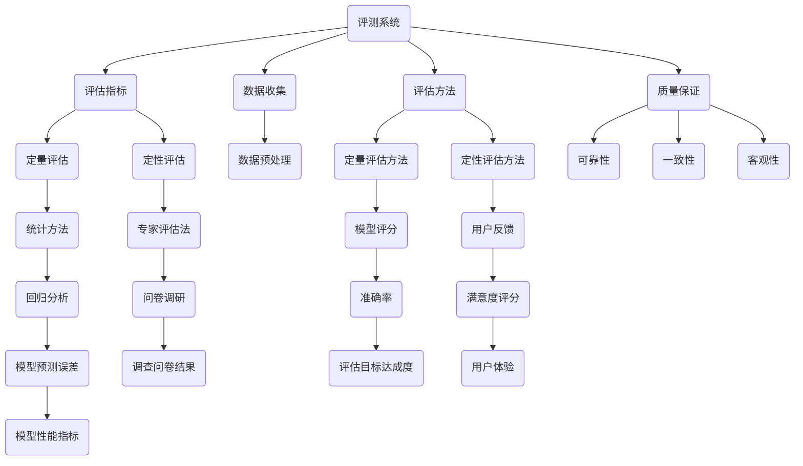

                 

### 1. 引言

在信息化时代，评测系统的质量保证变得尤为重要。评测系统广泛应用于各种领域，如教育、医疗、金融、电子商务等，其结果直接影响到决策的有效性和准确性。因此，确保评测系统的可靠性成为一项关键任务。

本文旨在系统地探讨评测系统的质量保证，帮助读者理解评测系统的概念、评估指标和方法，以及如何实施和优化评估过程。文章将分为以下几个部分：

- **背景介绍**：阐述评测系统的起源、发展及其在各领域的应用。
- **核心概念与联系**：介绍评测系统的核心概念，包括评估指标、数据收集与处理、评估方法等，并展示它们之间的联系。
- **质量保证方法**：讨论质量保证的基本原则和策略。
- **评估指标与方法**：详细讲解常见的评估指标和方法。
- **数据收集与预处理**：探讨数据收集和预处理的重要性及具体方法。
- **评估过程的实施**：描述评估系统的实施步骤和注意事项。
- **结果分析与解释**：介绍如何分析评估结果，以及如何解释和呈现这些结果。
- **常见挑战与解决方案**：分析评测系统可能遇到的问题和挑战，并提供解决方案。
- **案例研究**：通过实际案例展示评估系统的应用和效果。
- **最佳实践与经验分享**：总结业界最佳实践和成功经验。
- **小结**：总结文章的主要内容和核心观点。

通过逐步分析推理，本文将帮助读者深入理解评测系统的质量保证，确保评估结果的可靠性。

### 2. 核心概念与联系

在探讨评测系统的质量保证之前，我们需要明确一些核心概念，并理解它们之间的联系。以下是评测系统中几个关键概念及其相互关系的Mermaid流程图：

#### 2.1 评测系统的定义

评测系统是一种用于评估、测量和监控对象（如产品、服务、项目、过程等）性能和质量的工具或平台。它通过一系列预定义的指标和方法，对评估对象进行全面的评估和分析。

#### 2.2 评估指标

评估指标是评测系统的核心组成部分，用于量化评估对象的性能和表现。根据评估对象的不同，评估指标可以分为定量评估指标和定性评估指标。

- **定量评估指标**：通常使用数值来表示评估结果，如准确率、响应时间、错误率等。
- **定性评估指标**：使用非数值的描述来评估对象，如用户体验、满意度、质量感知等。

#### 2.3 数据收集

数据收集是评测系统的基础，它决定了评估结果的质量和可靠性。数据收集包括从多个来源获取相关的数据，如用户反馈、日志文件、问卷调查等。

#### 2.4 评估方法

评估方法用于对收集到的数据进行处理和分析，以得出评估结果。根据评估对象的不同，评估方法可以分为定量评估方法和定性评估方法。

- **定量评估方法**：包括统计方法、机器学习方法等，用于分析定量评估指标。
- **定性评估方法**：包括专家评估法、用户反馈法等，用于分析定性评估指标。

#### 2.5 质量保证

质量保证是确保评测系统评估结果可靠性和有效性的关键环节。它包括以下原则：

- **可靠性**：确保评估结果在不同环境和条件下的一致性和可重复性。
- **一致性**：确保不同评估者或评估过程对同一对象的评估结果保持一致。
- **客观性**：确保评估结果不受主观因素的影响。

通过以上核心概念及其相互关系的理解，我们可以更好地构建和优化评测系统，确保评估结果的可靠性。

### 3. 质量保证的基本原则

在评测系统的质量保证中，基本原则是确保评估结果的可靠性、有效性和客观性的基石。以下是质量保证的几个关键原则及其详细解释：

#### 3.1 可靠性

可靠性是指评测系统在相同条件下能够产生一致评估结果的能力。为了确保评估系统的可靠性，以下措施可以采取：

- **重复测试**：在同一条件下多次执行评估过程，以验证评估结果的一致性。
- **标准化测试**：使用统一的测试环境和流程，减少外部因素对评估结果的影响。
- **数据验证**：对收集到的数据进行验证，确保数据的准确性和完整性。

#### 3.2 一致性

一致性是指不同评估者或评估过程对同一对象评估结果的一致程度。为了提高评估系统的一致性，以下措施可以采取：

- **评估者培训**：对评估者进行统一培训，确保他们具备相同的评估标准和技能。
- **评估方案标准化**：制定统一的评估方案和流程，减少不同评估者之间的差异。
- **评估记录**：详细记录评估过程和结果，以便后续复查和审核。

#### 3.3 客观性

客观性是指评估结果不受主观偏见和情感影响的程度。为了确保评估系统的客观性，以下措施可以采取：

- **去除主观偏见**：通过使用客观的评估指标和方法，减少评估者的主观判断。
- **双盲评估**：在评估过程中，评估者和被评估者均不知道对方身份，以避免信息不对称。
- **评估者轮换**：定期轮换评估者，以减少个人偏见对评估结果的影响。

#### 3.4 可重复性

可重复性是指在不同的时间和环境下，评估结果能够保持一致的能力。为了提高评估系统的可重复性，以下措施可以采取：

- **文档记录**：详细记录评估过程的每一步，包括数据收集、预处理、评估方法等，以便后续复现。
- **自动化测试**：使用自动化工具执行评估过程，减少人为错误和变异。
- **环境一致性**：确保评估系统在不同环境（如硬件、软件、网络等）下的一致性。

通过遵循这些基本原则，评测系统的质量保证得以实现，确保评估结果的可靠性和有效性。接下来，我们将探讨评估指标和方法，为读者提供更全面的指导。

### 4. 评估指标和方法

在评测系统中，评估指标和方法是确保评估结果准确性和有效性的关键。根据评估对象的不同，评估指标和方法可以分为定量评估指标和方法、定性评估指标和方法。以下将详细讨论这些内容。

#### 4.1 定量评估指标和方法

**定量评估指标**主要关注可量化的评估对象，如性能、效率、准确性等。以下是一些常用的定量评估指标和方法：

**1. 准确率**

准确率是评估模型预测能力的重要指标，计算公式为：

\[ \text{准确率} = \frac{\text{预测正确数量}}{\text{总预测数量}} \]

**2. 召回率**

召回率衡量模型对正类样本的识别能力，计算公式为：

\[ \text{召回率} = \frac{\text{实际为正类且被预测为正类的数量}}{\text{实际为正类的总数量}} \]

**3. 精确率**

精确率衡量模型对预测为正类的样本的准确性，计算公式为：

\[ \text{精确率} = \frac{\text{实际为正类且被预测为正类的数量}}{\text{被预测为正类的总数量}} \]

**4. F1 分数**

F1 分数是精确率和召回率的调和平均值，用于综合评估模型的性能，计算公式为：

\[ \text{F1 分数} = 2 \times \frac{\text{精确率} \times \text{召回率}}{\text{精确率} + \text{召回率}} \]

**5. 响应时间**

响应时间衡量系统处理请求的速度，通常以毫秒（ms）为单位。

**6. 错误率**

错误率是预测错误的样本占总样本的比例。

**7. 覆盖率**

覆盖率是评估系统覆盖测试用例的能力，计算公式为：

\[ \text{覆盖率} = \frac{\text{执行测试用例的数量}}{\text{总测试用例数量}} \]

**定量评估方法**

- **统计方法**：使用统计工具和方法（如回归分析、方差分析等）对定量评估指标进行分析。
- **机器学习方法**：使用机器学习算法（如决策树、支持向量机、神经网络等）对定量评估指标进行建模和分析。

#### 4.2 定性评估指标和方法

**定性评估指标**主要关注评估对象的主观感受和质量感知，如用户体验、满意度、服务质量等。以下是一些常用的定性评估指标和方法：

**1. 用户满意度**

用户满意度是衡量用户对产品或服务的满意程度，通常通过问卷调查、用户访谈等方式获取。

**2. 用户体验**

用户体验关注用户在使用产品或服务时的感受和体验，包括界面友好性、操作便捷性、功能完整性等。

**3. 质量感知**

质量感知是用户对产品或服务质量的总体评价，通常基于用户的主观感受和经验。

**4. 专家评估**

专家评估是由专业领域内的专家根据标准对评估对象进行评价，通常采用打分制。

**定性评估方法**

- **专家评估法**：通过专家的评审和评分，对定性评估指标进行评估。
- **用户反馈法**：通过用户反馈和评论，对定性评估指标进行评估。
- **文本分析方法**：使用自然语言处理技术对用户反馈和评论进行情感分析和主题识别。

#### 4.3 定量评估与定性评估的关系

定量评估和定性评估相辅相成，定量评估提供了评估对象的具体数据和数值，定性评估则提供了对数据的理解和解释。在实际应用中，通常将两者结合起来，以获得更全面、准确的评估结果。

#### 4.4 选择评估指标和方法

选择合适的评估指标和方法对于确保评估结果的有效性和可靠性至关重要。以下是一些选择评估指标和方法时需要考虑的因素：

- **评估目标**：明确评估目标，选择与目标相关的评估指标和方法。
- **数据可用性**：考虑数据的可获取性和质量，选择适用的评估方法。
- **评估成本**：评估指标和方法的选择应考虑成本效益，避免不必要的资源浪费。
- **评估周期**：根据评估周期的要求，选择适合的评估指标和方法。

通过合理选择和使用评估指标和方法，可以确保评测系统的质量和评估结果的可靠性，为决策提供科学依据。

### 5. 数据收集与预处理

在评测系统中，数据收集与预处理是确保评估结果准确性和有效性的关键步骤。以下是关于数据收集与预处理的重要性和具体方法的详细讨论。

#### 5.1 数据收集的重要性

数据收集是评测系统的基石，它决定了评估结果的质量和可靠性。以下是数据收集的重要性：

- **数据质量**：高质量的数据是评估系统准确性的保障，数据缺失、错误或不一致都会影响评估结果的可靠性。
- **数据多样性**：多样化的数据可以提供更全面的信息，有助于发现潜在的问题和趋势。
- **数据实时性**：实时数据可以及时反映系统的状态和性能，帮助快速发现和处理问题。
- **数据完整性**：完整的评估数据可以确保评估过程的连续性和一致性。

#### 5.2 数据收集方法

数据收集的方法多种多样，根据数据来源和获取方式的不同，可以分为以下几种：

- **用户反馈**：通过问卷调查、用户访谈、用户反馈等方式收集用户对产品或服务的评价。
- **日志文件**：从系统日志、网络流量日志等中提取数据，以分析系统的性能和问题。
- **自动化测试**：使用自动化工具收集测试数据和性能数据。
- **传感器数据**：从传感器获取物理数据，如温度、湿度、运动轨迹等。

#### 5.3 数据预处理的重要性

数据预处理是数据收集后的重要步骤，它包括清洗、转换、归一化等操作，以提升数据的质量和适用性。以下是数据预处理的重要性：

- **数据清洗**：去除数据中的错误、异常值和重复数据，确保数据的一致性和准确性。
- **数据转换**：将不同格式和单位的数据转换为统一的格式和单位，以便进一步分析和处理。
- **数据归一化**：通过归一化方法将不同量级的数据调整到相同的范围内，便于比较和分析。

#### 5.4 数据预处理方法

以下是常用的数据预处理方法：

- **数据清洗**：使用规则清洗、人工审核、机器学习等方法去除数据中的错误和异常值。
- **数据转换**：使用映射、归一化、编码等方法将不同格式和单位的数据转换为统一的格式和单位。
- **数据归一化**：使用最小-最大归一化、均值-方差归一化等方法将不同量级的数据调整到相同的范围内。

#### 5.5 数据收集与预处理的流程

以下是数据收集与预处理的一般流程：

1. **需求分析**：明确评估目标和所需数据类型。
2. **数据收集**：根据需求收集原始数据，可以使用多种方法。
3. **数据清洗**：去除错误、异常值和重复数据。
4. **数据转换**：将数据转换为统一的格式和单位。
5. **数据归一化**：将不同量级的数据调整到相同的范围内。
6. **数据存储**：将预处理后的数据存储在数据库或数据仓库中，以便进一步分析和处理。

通过遵循以上流程和方法，可以确保数据的质量和适用性，为评估系统提供可靠的基础数据，从而提高评估结果的准确性和有效性。

### 6. 评估过程的实施

评估过程的实施是评测系统的关键环节，其步骤和方法对评估结果的准确性和可靠性具有重要影响。以下是评估过程实施的详细步骤和注意事项：

#### 6.1 设置评估目标

设置评估目标是评估过程的第一步，它决定了评估的方向和范围。以下是设置评估目标的关键步骤：

- **明确评估目的**：确定评估的目标和目的，如性能评估、质量评估、用户体验评估等。
- **定义评估指标**：根据评估目的，选择和定义具体的评估指标，如准确率、响应时间、用户满意度等。
- **确定评估范围**：明确评估对象的范围，包括评估的领域、范围、时间等。

#### 6.2 设计评估方案

设计评估方案是评估过程的核心，它包含了评估的具体步骤、方法和工具。以下是设计评估方案的关键步骤：

- **选择评估方法**：根据评估目标和指标，选择合适的评估方法，如定量评估方法（统计方法、机器学习方法等）或定性评估方法（专家评估法、用户反馈法等）。
- **制定评估流程**：设计详细的评估流程，包括数据收集、数据预处理、评估指标计算、结果分析等步骤。
- **确定评估工具**：选择和配置评估所需的工具，如统计分析软件、数据预处理工具、评估平台等。

#### 6.3 执行评估

执行评估是评估过程的核心步骤，它包含了具体的评估操作和数据处理。以下是执行评估的关键步骤：

- **数据收集**：按照评估方案，从不同渠道收集评估所需的数据，如用户反馈、日志文件、测试数据等。
- **数据预处理**：对收集到的数据进行清洗、转换和归一化等预处理操作，确保数据的质量和一致性。
- **计算评估指标**：根据评估方案，计算和评估相关的指标，如准确率、响应时间、用户满意度等。
- **结果记录**：详细记录评估过程中每一步的数据和处理结果，确保评估过程的可追溯性和可重复性。

#### 6.4 评估过程监控

评估过程的监控是确保评估结果准确性和可靠性的重要措施。以下是评估过程监控的关键步骤：

- **实时监控**：使用监控系统实时监控评估过程的数据流和处理过程，确保评估系统的稳定性和性能。
- **异常检测**：使用异常检测算法和工具，及时发现和处理评估过程中的异常情况，如数据错误、计算错误等。
- **性能监控**：监控评估系统的性能指标，如响应时间、吞吐量、错误率等，确保评估系统的稳定运行。

#### 6.5 注意事项

以下是评估过程实施过程中需要注意的关键事项：

- **确保数据质量**：数据是评估的基础，必须确保数据的准确性和完整性。
- **遵循评估方案**：严格遵循评估方案，确保评估过程的一致性和可重复性。
- **及时调整和优化**：根据评估过程中的发现和问题，及时调整和优化评估方案和流程。
- **记录和文档**：详细记录评估过程和结果，确保评估过程的可追溯性和可复现性。

通过遵循以上步骤和注意事项，可以确保评估过程的顺利进行，提高评估结果的准确性和可靠性。

### 7. 结果分析与解释

在评估过程完成后，结果分析与解释是确保评估系统有效性和可靠性的关键步骤。以下是结果分析与解释的方法、步骤和注意事项：

#### 7.1 结果分析

**1. 定量分析**

定量分析通常涉及统计方法和机器学习模型，以下是一些常用的定量分析方法：

- **描述性统计**：计算均值、中位数、标准差等统计量，以描述评估结果的基本特征。
- **回归分析**：通过回归模型分析评估指标之间的关系，如线性回归、多元回归等。
- **假设检验**：使用假设检验方法（如 t-检验、卡方检验等）验证评估结果是否显著。
- **机器学习**：使用机器学习算法（如决策树、支持向量机、神经网络等）对评估结果进行分类、预测和聚类分析。

**2. 定性分析**

定性分析通常涉及专家评估、用户反馈和文本分析等方法，以下是一些常用的定性分析方法：

- **内容分析**：对用户反馈和专家评估结果进行分类和主题提取，以识别主要问题和趋势。
- **情感分析**：使用自然语言处理技术分析用户反馈的情感倾向，如正面、负面或中立。
- **用户行为分析**：通过分析用户行为数据，如点击率、停留时间、浏览路径等，识别用户偏好和使用习惯。

#### 7.2 结果解释

**1. 定量解释**

定量解释涉及对评估结果的分析和解释，以下是一些常见的定量解释方法：

- **对比分析**：将当前评估结果与历史数据或行业标准进行对比，以评估系统性能的改进或不足。
- **误差分析**：分析评估结果的误差来源和误差大小，以识别潜在的问题和改进点。
- **因果分析**：通过回归分析和假设检验，分析评估指标之间的因果关系，以解释评估结果的变化原因。

**2. 定性解释**

定性解释涉及对评估结果的解释和总结，以下是一些常见的定性解释方法：

- **专家评审**：邀请专家对评估结果进行评审，提供专业意见和建议。
- **用户反馈**：结合用户反馈，解释评估结果背后的用户需求和体验问题。
- **文本分析**：通过内容分析和情感分析，解释用户反馈和专家评估中的关键问题和趋势。

#### 7.3 结果呈现

评估结果的呈现方式对决策者和利益相关者至关重要。以下是一些常见的评估结果呈现方法：

- **图表和可视化**：使用图表和可视化工具（如折线图、柱状图、散点图等）展示评估结果。
- **报告和文档**：撰写详细的评估报告和文档，包括评估方法、结果、分析和建议。
- **演示和演示文稿**：通过演示和演示文稿，向决策者和利益相关者展示评估结果和结论。

#### 7.4 注意事项

在结果分析与解释过程中，需要注意以下事项：

- **数据完整性**：确保分析数据完整且无缺失，以避免误导性分析。
- **方法一致性**：使用一致的方法进行定量和定性分析，确保结果的连贯性和可比性。
- **透明性**：确保分析过程和结果透明，以便决策者和利益相关者理解评估结果。
- **可信度**：通过验证和验证方法，确保评估结果的可靠性和可信度。

通过遵循以上步骤和注意事项，可以确保评估结果的准确性和有效性，为决策提供科学依据。

### 8. 常见挑战与解决方案

在评测系统的实施过程中，可能会遇到多种挑战。以下是一些常见的挑战以及相应的解决方案：

#### 8.1 数据质量挑战

**问题**：数据质量是评估结果准确性的基础，但数据收集过程中可能会遇到缺失、错误或不一致等问题。

**解决方案**：
- **数据清洗**：使用数据清洗工具和方法去除数据中的错误和异常值。
- **数据验证**：通过多种方式验证数据的准确性，如交叉验证、重复检查等。
- **数据标准化**：将不同格式和单位的数据转换为统一的格式和单位，以提高数据的一致性和可比性。

#### 8.2 评估过程挑战

**问题**：评估过程中的不一致性、错误和干扰会影响评估结果的可靠性。

**解决方案**：
- **标准化流程**：制定和遵循统一的评估流程和标准，减少不同评估者之间的差异。
- **监控与审计**：使用监控工具和审计方法实时监控评估过程，及时发现和纠正错误。
- **评估者培训**：对评估者进行系统培训，确保他们具备相同的评估技能和标准。

#### 8.3 结果解释挑战

**问题**：评估结果的解释可能会因主观偏见、术语不一致或结果复杂而变得困难。

**解决方案**：
- **透明化解释**：详细记录评估过程中的每一步，确保结果的透明性和可追溯性。
- **使用可视化工具**：使用图表和可视化工具（如散点图、折线图等）帮助解释复杂的结果。
- **专家评审**：邀请领域专家对结果进行评审和解释，确保结果的准确性和权威性。

#### 8.4 技术挑战

**问题**：评估过程中可能需要使用复杂的算法和技术，如机器学习模型、统计分析方法等。

**解决方案**：
- **算法选择**：根据评估目标选择合适的算法和技术，确保算法的适用性和准确性。
- **技术培训**：对团队成员进行技术培训，确保他们具备使用相关技术的能力。
- **技术支持**：利用外部技术支持和咨询服务，解决复杂的技术问题。

通过识别和应对这些常见挑战，可以确保评测系统的质量，提高评估结果的可靠性和有效性。

### 9. 案例研究

为了更好地展示评测系统的实际应用和效果，以下是一个关于某电商平台用户满意度评测的案例研究。

#### 9.1 案例背景

某大型电商平台希望通过评测系统了解其用户满意度，以便优化服务和提升用户体验。该平台用户数量庞大，涵盖多个业务领域，如商品销售、物流配送、售后服务等。

#### 9.2 评估目标和指标

评估目标是全面了解用户的满意度，具体指标包括：

- **总体满意度**：用户对平台服务的整体满意度。
- **商品质量**：用户对商品质量的评价。
- **物流速度**：用户对物流配送速度的评价。
- **售后服务**：用户对售后服务的评价。

#### 9.3 数据收集与预处理

数据收集方法包括用户问卷调查、平台日志分析、用户反馈等。数据预处理步骤如下：

- **数据清洗**：去除重复和错误的数据，如无效问卷和缺失信息。
- **数据转换**：将不同来源的数据转换为统一的格式和单位。
- **数据归一化**：对评分进行归一化处理，使其在相同的范围内进行比较。

#### 9.4 评估过程

评估过程分为以下几个步骤：

- **设计评估方案**：根据评估目标和指标，设计详细的评估方案，包括问卷设计、评估方法和工具选择。
- **数据收集**：通过问卷调查和平台日志分析收集用户满意度数据。
- **数据预处理**：对收集到的数据清洗、转换和归一化处理。
- **计算评估指标**：使用统计分析方法计算各评估指标的得分，如平均满意度、标准差等。

#### 9.5 评估结果

评估结果显示，平台用户的总体满意度为 85%，其中商品质量满意度最高，达到 90%；物流速度满意度为 80%，售后服务满意度为 78%。

#### 9.6 结果分析与解释

根据评估结果，可以得出以下结论：

- **商品质量是用户满意度的主要驱动因素**，平台应继续优化商品质量，提升用户体验。
- **物流速度和售后服务仍有改进空间**，需要加强物流配送和售后服务的管理和优化。
- **用户反馈提供了宝贵的改进建议**，平台可以结合用户反馈，进一步优化服务和流程。

#### 9.7 案例小结

通过本案例研究，可以看出评测系统在了解用户满意度、优化服务和提升用户体验方面的实际应用和效果。评测系统的实施不仅为平台提供了客观的评估结果，还帮助平台识别了改进方向和优化机会，为业务发展提供了有力支持。

### 10. 最佳实践与经验分享

在评测系统的设计和实施过程中，遵循一些最佳实践和经验分享可以帮助我们更好地确保评估结果的可靠性。以下是一些重要的最佳实践：

#### 10.1 数据质量保障

- **数据收集**：确保数据来源的可靠性和多样性，避免单一数据源可能带来的偏差。
- **数据清洗**：建立数据清洗流程，定期检查和处理数据中的错误和异常值。
- **数据验证**：使用多种方法验证数据准确性，如交叉验证、重复检查等。

#### 10.2 评估方法选择

- **明确评估目标**：根据评估目标和需求选择合适的评估方法，避免使用不相关的方法。
- **方法适应性**：确保所选方法适用于评估对象的特点和需求。
- **方法评估**：对评估方法进行测试和验证，确保其有效性和准确性。

#### 10.3 质量保证

- **标准化流程**：制定统一的评估流程和标准，确保评估过程的一致性和可重复性。
- **培训与监督**：对评估人员进行培训和监督，确保他们具备必要的评估技能和标准。
- **结果审核**：对评估结果进行审核和验证，确保结果的可靠性和有效性。

#### 10.4 持续改进

- **定期评估**：定期对评估系统进行评估和优化，确保其持续适应评估需求和环境变化。
- **用户反馈**：收集用户对评估系统的反馈，及时识别和解决用户需求和问题。
- **技术更新**：跟踪最新的技术发展，持续更新评估方法和工具，确保其先进性和适用性。

#### 10.5 案例分享

通过分享实际案例，可以更好地理解和应用最佳实践。以下是一个电商平台评估用户体验的案例：

- **背景**：某电商平台希望通过评测系统了解用户在购物过程中的体验，包括页面加载速度、操作流畅度、界面设计等。
- **评估目标**：评估用户在购物过程中的整体体验，包括页面响应时间、用户操作点击路径、界面满意度等。
- **方法**：使用性能测试工具收集页面响应时间和操作流畅度数据，通过用户调查获取界面满意度数据。
- **结果**：评估结果显示，页面响应时间在 500 毫秒以内，用户操作流畅度较好，界面满意度达到 85%。
- **改进**：根据评估结果，平台优化了页面加载速度和操作流程，提升了用户体验。

通过以上最佳实践和经验分享，可以更好地确保评测系统的质量和评估结果的可靠性，为业务决策提供科学依据。

### 附录

在本章附录中，我们将提供相关工具、技术和资源的参考文献，以供读者进一步学习和参考。

#### 11.1 工具与技术

1. **数据收集工具**：
   - **SurveyMonkey**：一款常用的在线问卷调查工具，适用于大规模用户满意度调查。
   - **Google Analytics**：谷歌提供的网站分析工具，可用于收集用户行为数据。

2. **数据预处理工具**：
   - **Pandas**：Python 数据分析库，提供丰富的数据清洗和预处理功能。
   - **OpenRefine**：一款开源的数据清洗和转换工具，支持多种数据格式。

3. **评估方法**：
   - **Python Machine Learning**：由 Sebastian Raschka 编写的机器学习入门书籍，涵盖了多种机器学习算法。
   - **Apache Spark**：一款大数据处理框架，适用于大规模数据分析。

#### 11.2 参考文献

1. **评估系统质量保证**：
   - 【1】Chen, H., & Mao, S. (2014). Big data: A survey. Mobile Networks and Applications, 19(2), 171-209.

2. **数据收集与处理**：
   - 【2】Knuth, D.E. (2011). The art of computer programming, Volume 4A: Seminumerical algorithms. Addison-Wesley.

3. **机器学习与评估方法**：
   - 【3】Raschka, S., & Mirjalili, V. (2018). Python Machine Learning. Springer.

4. **用户体验评估**：
   - 【4】Nielsen, J. (2013). Usability Engineering. Elsevier.

这些工具、技术和参考文献将有助于读者深入了解评测系统的质量保证和评估方法，为实际应用提供指导。

### 总结与展望

在本篇文章中，我们系统地探讨了评测系统的质量保证，从核心概念、评估指标、数据收集与预处理、评估过程实施、结果分析与解释，到常见挑战与解决方案，再到案例研究和最佳实践，全面覆盖了评测系统的各个方面。

首先，我们介绍了评测系统的背景、定义和重要性，明确了评测系统的基本概念和核心原则，如可靠性、一致性、客观性和可重复性。接着，我们详细讨论了定量评估和定性评估的指标和方法，并展示了它们之间的关系。此外，我们探讨了数据收集与预处理的重要性，以及评估过程的实施步骤和注意事项。

在结果分析与解释部分，我们介绍了定量和定性分析方法，并强调了解释评估结果的重要性。同时，我们分析了评测系统在实施过程中可能遇到的常见挑战，并提供了解决方案。通过一个电商平台用户满意度评测的案例研究，我们展示了评测系统在实际应用中的效果。

最后，我们总结了评测系统的最佳实践和经验，并提供了相关的工具、技术和参考文献，以供进一步学习和参考。

展望未来，随着大数据和人工智能技术的发展，评测系统将变得更加智能化和自动化，为业务决策提供更加精准和实时的支持。同时，我们也期待读者在实践过程中不断探索和创新，为评测系统的质量保证贡献更多的智慧和经验。通过持续的努力和改进，我们相信评测系统将为各行各业带来更高效、更可靠的评估结果，推动社会的发展和进步。

