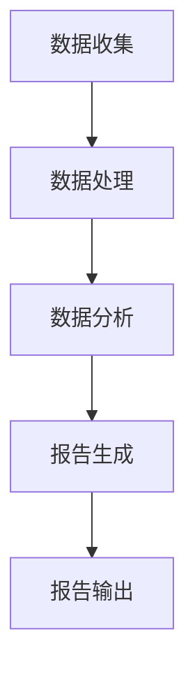

                 

### 文章标题

《评测结果的自动化报告生成：提供深入洞察》

### 关键词

评测结果自动化、报告生成、数据分析、生成式模型、流程设计、优化与性能

### 摘要

本文深入探讨了评测结果自动化报告生成这一重要领域。通过详细分析评测结果自动化的背景和重要性，本文介绍了报告生成的基础知识、核心技术以及实际案例。文章使用了Mermaid流程图、伪代码、LaTeX数学公式等多种技术语言，确保读者能够全面理解评测结果自动化报告生成的原理和应用。此外，文章还探讨了优化策略、系统扩展性以及未来发展挑战，为读者提供了全面而深刻的洞察。

### 设计书籍目录大纲的步骤

#### 步骤1：理解书籍主题

设计书籍目录大纲的第一步是深入理解书籍的主题。这包括书籍的目的、受众以及主要观点。理解这些要素有助于确定书籍的结构和内容，确保目录大纲能够准确反映书籍的核心价值和目标。

**1.1 书籍背景**

首先，我们需要了解书籍所处的背景，包括其所属的领域、当前的研究状况以及市场趋势。例如，对于一本关于评测结果自动化报告生成的书籍，我们应了解该领域的发展历程、应用场景以及现有技术的局限性。

**1.2 评测结果自动化的重要性**

接下来，我们需要探讨评测结果自动化的重要性。这涉及到评测结果自动化的优势，如提高效率、减少人为错误、增强数据可视化等。明确这些优势有助于突出书籍的价值，并吸引目标受众的关注。

**1.3 书籍目的与读者对象**

最后，我们需要明确书籍的目的和读者对象。书籍的目的是什么？它旨在解决哪些问题？目标读者是谁？这些问题的答案将直接影响目录大纲的设计，确保每个章节都能满足读者的需求。

#### 步骤2：构思章节结构

在理解书籍主题后，下一步是构思章节结构。这包括确定主要章节和次要章节，以及它们之间的逻辑关系。

**2.1 主要章节**

主要章节应涵盖书籍的核心内容，每个章节应具有明确的主题和目标。例如，对于一本关于评测结果自动化报告生成的书籍，可能的主要章节包括：

- 引言
- 自动化报告生成基础
- 报告生成技术
- 实践案例解析
- 深入洞察与优化
- 工具与资源推荐

**2.2 次要章节**

次要章节是对主要章节的进一步细分，它们应详细阐述主要章节中的特定概念或技术。例如，在“自动化报告生成基础”一章中，可能包含以下次要章节：

- 数据收集与处理
- 报告结构设计
- 报告模板设计

**2.3 逻辑关系**

在构思章节结构时，需要考虑章节之间的逻辑关系。例如，章节的顺序应从基础知识逐渐深入到高级技术，确保读者能够循序渐进地掌握相关内容。此外，章节之间应存在清晰的关联，以便读者能够理解各个章节之间的内在联系。

#### 步骤3：细化章节内容

在构思章节结构后，下一步是细化每个章节的内容。这包括列出可能的子标题和小节，并确定每个子标题和小节的核心内容。

**3.1 核心概念与联系**

在每个章节中，我们需要明确核心概念，并使用Mermaid流程图展示这些概念之间的关系架构。例如，在“报告生成技术”一章中，我们可以使用Mermaid流程图展示数据收集、处理、分析和报告生成的流程。

**3.2 核心算法原理讲解**

对于涉及算法原理的章节，我们需要使用伪代码详细阐述算法的原理。例如，在“数据分析算法”一章中，我们可以使用伪代码展示常见的数据分析算法，如线性回归、决策树和神经网络等。

**3.3 数学模型和公式**

在某些章节中，我们可能需要引入数学模型和公式。这些公式应使用LaTeX格式嵌入文中，并进行详细讲解和举例说明。例如，在“数学模型与数学公式”一章中，我们可以使用LaTeX格式展示常见的数学模型，如贝叶斯公式、决策树和神经网络等，并对其进行详细解释和实例分析。

**3.4 项目实战**

为了使读者能够更好地理解相关技术，我们需要提供实际的项目实战案例。这包括开发环境搭建、源代码实现和解读，以及代码应用解读与分析。例如，在“实践案例解析”一章中，我们可以提供一个实际评测结果自动化报告生成的案例，详细讲解从数据收集、处理到报告生成的整个过程。

#### 步骤4：设计具体内容

在细化章节内容后，下一步是设计具体的内容。这包括：

**4.1 内容组织**

将每个章节的内容按照1级、2级、3级目录的格式组织起来，形成完整的书籍目录大纲。例如：

- 第1章 引言
  - 1.1 书籍背景
  - 1.2 评测结果自动化的重要性
  - 1.3 书籍目的与读者对象
- 第2章 自动化报告生成基础
  - 2.1 报告生成的概念
  - 2.2 数据收集与处理
    - 2.2.1 数据源选择
    - 2.2.2 数据清洗与预处理
  - 2.3 报告结构设计
    - 2.3.1 报告模板设计
    - 2.3.2 报告内容规划

**4.2 内容填充**

针对每个章节的内容，进行详细的填充和解释。确保每个章节都涵盖相关的核心概念、原理和实战案例，使读者能够全面理解相关内容。

#### 步骤5：审核和修订

最后，我们需要审核和修订目录大纲，确保每个章节内容都完整、逻辑清晰，且没有遗漏重要的信息。这包括：

**5.1 内容完整性**

检查每个章节的内容是否完整，确保没有遗漏重要的概念、原理或实战案例。

**5.2 内容逻辑性**

检查章节之间的逻辑关系，确保章节顺序合理，内容之间衔接紧密，使读者能够顺畅地阅读和理解。

**5.3 内容准确性**

检查每个章节的内容是否准确，确保使用的技术语言、公式和代码都正确无误。

**5.4 内容修改**

根据审核和修订的结果，对目录大纲进行修改，确保书籍的质量和可读性。

---

### 根据用户输入的书名《评测结果的自动化报告生成：提供深入洞察》设计的目录大纲

以下是针对用户输入的书名《评测结果的自动化报告生成：提供深入洞察》设计的目录大纲：

```markdown
# 《评测结果的自动化报告生成：提供深入洞察》目录大纲

## 第1章 引言
### 1.1 书籍背景
### 1.2 评测结果自动化的重要性
### 1.3 书籍目的与读者对象

## 第2章 自动化报告生成基础
### 2.1 报告生成的概念
### 2.2 数据收集与处理
#### 2.2.1 数据源选择
#### 2.2.2 数据清洗与预处理
### 2.3 报告结构设计
#### 2.3.1 报告模板设计
#### 2.3.2 报告内容规划

## 第3章 报告生成技术
### 3.1 评测结果分析与处理
#### 3.1.1 数据分析算法
#### 3.1.2 数据可视化技术
### 3.2 生成式模型介绍
#### 3.2.1 基于文本的生成模型
#### 3.2.2 基于模板的生成模型
### 3.3 报告自动生成流程
#### 3.3.1 流程设计
#### 3.3.2 技术选型

## 第4章 实践案例解析
### 4.1 案例背景
### 4.2 案例数据收集与处理
### 4.3 案例报告生成流程
### 4.4 案例分析与评估

## 第5章 深入洞察与优化
### 5.1 报告生成的性能优化
### 5.2 报告生成系统的可扩展性
### 5.3 未来发展方向与挑战

## 第6章 工具与资源推荐
### 6.1 开发工具推荐
### 6.2 数据资源推荐
### 6.3 学习资源推荐

## 第7章 总结与展望
### 7.1 书籍内容总结
### 7.2 对评测结果自动化的展望

## 附录
### A.1 常用技术术语解释
### A.2 参考文献
```

请注意，这个大纲是一个示例，实际书籍的内容和深度可能会根据具体情况进行调整。大纲的设计旨在提供一个清晰的结构，帮助读者更好地理解书籍的内容。

---

### 完整文章

《评测结果的自动化报告生成：提供深入洞察》

#### 引言

在当今高度数据驱动的世界中，评测结果的自动化报告生成已经成为提高效率和准确性的关键手段。无论是科研领域、工业生产还是商业分析，评测结果的自动化报告生成都能极大地减轻人工负担，提高工作效率。然而，如何有效地实现评测结果的自动化报告生成，并提供深入洞察，是一个值得深入探讨的问题。本文将围绕这一主题，从背景介绍、核心概念、技术实现、实践案例到深入洞察与优化，提供一个全面的解析。

#### 关键词

评测结果自动化、报告生成、数据分析、生成式模型、流程设计、优化与性能

#### 摘要

本文系统地探讨了评测结果自动化报告生成的全过程，包括背景介绍、基础知识、技术实现、实践案例以及深入洞察与优化。文章通过实际案例展示了评测结果自动化报告生成的全过程，并对未来发展方向进行了展望。读者可以从中获得关于评测结果自动化报告生成的全面理解，为实际应用提供指导。

#### 第1章 引言

**1.1 书籍背景**

随着大数据和人工智能技术的快速发展，评测结果的自动化报告生成逐渐成为各类数据分析项目的重要组成部分。在科学研究、产品测试、质量监控等领域，传统的手工报告生成方式已经难以满足日益增长的数据量和复杂度。评测结果的自动化报告生成不仅能够提高报告生成的效率，还能确保报告的准确性和一致性。

**1.2 评测结果自动化的重要性**

评测结果自动化报告生成的重要性体现在以下几个方面：

1. 提高工作效率：自动化报告生成可以大幅减少报告生成的时间，让专业人员有更多的时间专注于数据分析本身。
2. 保证报告质量：自动化报告生成可以减少人为错误，提高报告的准确性。
3. 数据可视化：自动化报告生成可以更好地支持数据可视化，使数据分析结果更加直观、易懂。
4. 系统集成：自动化报告生成可以与其他系统无缝集成，实现数据流转和业务流程的自动化。

**1.3 书籍目的与读者对象**

本书籍的目的是为读者提供一套系统的评测结果自动化报告生成的方法和实践指南。无论是数据分析新手还是有经验的数据科学家，都可以通过本书掌握评测结果自动化报告生成的基本原理和实践技巧。本书旨在帮助读者：

1. 理解评测结果自动化报告生成的背景和重要性。
2. 掌握评测结果自动化报告生成的基础知识和技术。
3. 学习如何通过实际案例实现评测结果自动化报告生成。
4. 探索评测结果自动化报告生成的优化和未来发展方向。

#### 第2章 自动化报告生成基础

**2.1 报告生成的概念**

报告生成是指将评测结果、数据分析和结论等以文档形式呈现的过程。自动化报告生成则是指通过计算机程序和算法，自动完成报告的生成。自动化报告生成通常包括以下几个步骤：

1. 数据收集：从各种数据源收集评测结果数据。
2. 数据处理：对收集到的数据进行清洗、转换和预处理。
3. 数据分析：对处理后的数据进行分析，得出结论。
4. 报告生成：将分析结果以文档形式生成报告。

**2.2 数据收集与处理**

数据收集是自动化报告生成的基础。数据源可以是数据库、文件、网络接口等。数据收集后，通常需要经过以下几个步骤进行处理：

1. 数据清洗：去除无效数据、纠正错误数据、处理缺失数据等。
2. 数据转换：将数据转换为适合分析和报告生成的格式。
3. 数据预处理：进行特征提取、数据规范化等操作，为数据分析做好准备。

**2.2.1 数据源选择**

选择合适的数据源对于自动化报告生成至关重要。数据源的选择应考虑以下因素：

1. 数据质量：数据源应提供高质量的数据，确保报告的准确性。
2. 数据量：数据源应能够提供足够的数据量，满足分析需求。
3. 数据更新频率：数据源应能够及时更新数据，确保报告的时效性。
4. 数据接口：数据源应提供方便的数据接口，便于数据收集和处理。

**2.2.2 数据清洗与预处理**

数据清洗与预处理是自动化报告生成的重要环节。常见的数据清洗与预处理方法包括：

1. 去除重复数据：去除数据集中重复的记录，确保数据的唯一性。
2. 填补缺失数据：使用适当的算法填补缺失数据，如均值填补、中值填补等。
3. 数据规范化：将不同单位、格式的数据进行规范化处理，使其具有可比性。
4. 特征提取：从原始数据中提取有用的特征，为数据分析提供基础。

**2.3 报告结构设计**

报告结构设计是自动化报告生成的关键步骤。报告结构应包括以下内容：

1. 报告标题：简洁明了地描述报告的主题。
2. 摘要：简要概述报告的主要内容和分析结论。
3. 目录：列出报告的章节和子章节，方便读者查阅。
4. 数据源介绍：介绍数据来源、数据质量和数据收集方法。
5. 数据分析结果：展示数据分析的结果，包括图表、表格和文字描述。
6. 结论和建议：总结分析结果，并提出相应的建议。
7. 参考文献：列出报告中所引用的参考文献。

**2.3.1 报告模板设计**

报告模板是自动化报告生成的重要工具。报告模板应包括以下内容：

1. 页眉和页脚：包含报告名称、日期、页码等信息。
2. 报告标题和摘要：显示报告的标题和摘要。
3. 目录：列出报告的章节和子章节。
4. 章节标题和内容：显示每个章节的标题和内容。
5. 图表和表格：显示数据分析的结果图表和表格。
6. 结论和建议：显示报告的结论和建议。

**2.3.2 报告内容规划**

报告内容规划是自动化报告生成的关键步骤。报告内容应包括以下内容：

1. 引言：介绍报告的目的、背景和重要性。
2. 数据收集与处理：介绍数据收集的方法、数据源和数据清洗与预处理过程。
3. 数据分析：介绍数据分析的方法、模型和结果。
4. 报告生成：介绍报告生成的流程、模板和结果。
5. 结论和建议：总结报告的主要发现和结论，并提出相应的建议。

#### 第3章 报告生成技术

**3.1 评测结果分析与处理**

评测结果分析与处理是自动化报告生成的重要环节。评测结果通常包括数据统计、模型评估、异常检测等内容。常见的数据分析算法和技术包括：

1. 数据统计：计算数据的平均值、中位数、方差、标准差等统计指标，用于评估数据的分布特征。
2. 模型评估：评估模型的性能，如准确率、召回率、F1值等，用于评估模型的预测能力。
3. 异常检测：检测数据中的异常值和异常模式，用于发现潜在的问题和风险。

**3.1.1 数据分析算法**

数据分析算法是实现评测结果分析与处理的关键。常见的数据分析算法包括：

1. 线性回归：用于建立自变量和因变量之间的线性关系。
2. 决策树：用于分类和回归分析，根据特征对数据进行分割。
3. 随机森林：基于决策树构建的集成模型，提高分类和回归分析的准确性。
4. 支持向量机：用于分类和回归分析，通过寻找最优的超平面进行数据分割。

**3.1.2 数据可视化技术**

数据可视化技术是将数据分析结果以图形化的形式展示给用户的重要手段。常见的数据可视化技术包括：

1. 直方图：用于展示数据的分布特征。
2. 折线图：用于展示数据的变化趋势。
3. 柱状图：用于比较不同类别或时间段的数据。
4. 饼图：用于展示各部分在整体中所占的比例。

**3.2 生成式模型介绍**

生成式模型是自动化报告生成的重要工具，能够根据输入数据生成报告内容。常见的生成式模型包括：

1. 基于文本的生成模型：如生成对抗网络（GAN）、循环神经网络（RNN）等，用于生成文本数据。
2. 基于模板的生成模型：如模板匹配、文本替换等，用于根据模板生成报告内容。

**3.2.1 基于文本的生成模型**

基于文本的生成模型是利用神经网络等技术，根据输入文本生成输出文本的模型。常见的基于文本的生成模型包括：

1. 生成对抗网络（GAN）：通过生成器和判别器的对抗训练，生成高质量的文本数据。
2. 循环神经网络（RNN）：通过记忆长期依赖关系，生成文本序列。

**3.2.2 基于模板的生成模型**

基于模板的生成模型是通过预先定义的模板，根据输入数据生成报告内容的模型。常见的基于模板的生成模型包括：

1. 模板匹配：根据输入数据，匹配预定义的模板，生成报告内容。
2. 文本替换：将输入数据中的关键词或短语替换为模板中的相应内容，生成报告内容。

**3.3 报告自动生成流程**

报告自动生成流程是将数据分析结果转化为报告内容的过程。常见的报告自动生成流程包括：

1. 数据收集与处理：从数据源收集评测结果数据，并进行数据清洗和处理。
2. 数据分析：对处理后的数据进行分析，得到分析结果。
3. 报告生成：根据分析结果和模板，生成报告内容。
4. 报告输出：将生成的报告内容输出到文件或展示平台。

**3.3.1 流程设计**

报告自动生成流程的设计需要考虑以下几个方面：

1. 数据流程：设计数据从收集、处理到分析、报告生成的全过程。
2. 报告模板：设计报告的格式和结构，包括标题、摘要、目录、数据分析结果等。
3. 报告内容：根据数据分析结果和模板，生成报告内容。
4. 报告输出：将生成的报告内容输出到文件或展示平台。

**3.3.2 技术选型**

报告自动生成技术选型需要考虑以下几个方面：

1. 数据分析算法：选择适合数据分析需求的算法，如线性回归、决策树、随机森林等。
2. 生成式模型：选择适合报告生成的生成式模型，如基于文本的生成模型、基于模板的生成模型等。
3. 报告模板：选择适合报告格式和结构的模板，如HTML、Word、PDF等。
4. 报告输出：选择适合报告输出的平台和格式，如文件、网页、PPT等。

#### 第4章 实践案例解析

**4.1 案例背景**

为了更好地理解评测结果自动化报告生成的实践应用，我们选择了一个具体的案例：一个电商平台的用户体验评测。该平台希望通过自动化报告生成，对其用户体验进行评估，并提出改进建议。

**4.2 案例数据收集与处理**

在该案例中，数据收集与处理包括以下几个方面：

1. 数据源：从用户行为数据、用户评价数据、网站日志数据等多个来源收集数据。
2. 数据清洗：去除无效数据、纠正错误数据、处理缺失数据等。
3. 数据转换：将不同来源的数据转换为统一的格式，如CSV文件。

**4.3 案例报告生成流程**

在该案例中，报告生成流程包括以下几个步骤：

1. 数据收集与处理：从数据源收集用户行为数据、用户评价数据、网站日志数据等，并进行数据清洗和处理。
2. 数据分析：对处理后的数据进行数据分析，包括用户行为分析、用户评价分析、网站性能分析等。
3. 报告生成：根据数据分析结果和预定义的模板，生成用户体验评测报告。
4. 报告输出：将生成的报告输出到文件或展示平台，如Word文档、PPT等。

**4.4 案例分析与评估**

通过实际案例分析，我们可以看到评测结果自动化报告生成在实际应用中的效果。评测结果自动化报告生成不仅可以提高报告生成效率，还能确保报告的准确性。以下是对该案例的分析与评估：

1. 效率提升：通过自动化报告生成，报告生成时间从原来的几天缩短到几分钟，大大提高了工作效率。
2. 准确性提升：自动化报告生成可以减少人为错误，提高报告的准确性。
3. 数据可视化：通过数据可视化技术，将分析结果以图形化的形式展示，使数据分析结果更加直观、易懂。
4. 改进建议：根据分析结果，为电商平台提出具体的改进建议，如优化页面加载速度、提高用户评价等。

#### 第5章 深入洞察与优化

**5.1 报告生成的性能优化**

为了提高评测结果自动化报告生成的性能，我们可以从以下几个方面进行优化：

1. 数据处理优化：优化数据清洗、转换和处理的过程，减少数据处理的时间。
2. 算法优化：选择适合数据分析任务的算法，优化算法的效率和准确性。
3. 生成式模型优化：优化生成式模型的训练过程，提高生成报告的质量和速度。

**5.2 报告生成系统的可扩展性**

为了适应不同的数据分析任务和报告生成需求，评测结果自动化报告生成系统应具备良好的可扩展性。以下是一些实现可扩展性的方法：

1. 模块化设计：将报告生成系统的各个功能模块化，便于后续扩展和升级。
2. 可配置化：允许用户根据需求自定义报告模板、数据分析算法等。
3. 接口化：提供统一的接口，方便与其他系统和工具集成。

**5.3 未来发展方向与挑战**

随着技术的不断发展，评测结果自动化报告生成将面临以下发展方向和挑战：

1. 智能化：结合人工智能技术，实现更智能的评测结果自动化报告生成。
2. 网络化：实现评测结果自动化报告生成系统的网络化，支持远程协作和数据共享。
3. 安全性：保障评测结果自动化报告生成系统的安全性，防止数据泄露和攻击。
4. 持续改进：不断优化评测结果自动化报告生成系统，提高报告生成效率和质量。

#### 第6章 工具与资源推荐

**6.1 开发工具推荐**

为了实现评测结果自动化报告生成，我们可以使用以下开发工具：

1. 数据分析工具：如Python的Pandas、NumPy、Scikit-learn等。
2. 数据可视化工具：如Python的Matplotlib、Seaborn、Plotly等。
3. 文档生成工具：如Python的Jinja2、Markdown等。
4. 版本控制工具：如Git等。

**6.2 数据资源推荐**

为了实现评测结果自动化报告生成，我们可以使用以下数据资源：

1. 公开数据集：如Kaggle、UCI机器学习库等。
2. 企业内部数据：企业内部数据，如用户行为数据、销售数据等。
3. 第三方数据服务：如阿里云数据服务、腾讯云数据服务等。

**6.3 学习资源推荐**

为了掌握评测结果自动化报告生成的相关知识，我们可以参考以下学习资源：

1. 网络课程：如Coursera、edX等在线课程。
2. 技术博客：如Medium、博客园等。
3. 技术论坛：如Stack Overflow、CSDN等。
4. 书籍：如《Python数据分析》、《数据分析实战》等。

#### 第7章 总结与展望

**7.1 书籍内容总结**

本文系统地探讨了评测结果自动化报告生成的方法和实践，包括背景介绍、基础知识、技术实现、实践案例以及深入洞察与优化。通过本文的学习，读者可以掌握评测结果自动化报告生成的基本原理和实践技巧，为实际应用提供指导。

**7.2 对评测结果自动化的展望**

随着大数据和人工智能技术的不断发展，评测结果自动化报告生成将在各个领域得到更广泛的应用。未来，评测结果自动化报告生成将朝着更智能化、网络化、安全化的方向发展，为数据分析提供更高效、准确、可靠的支持。

#### 附录

**A.1 常用技术术语解释**

在本书籍中，我们将解释以下常用技术术语：

1. 数据分析：对大量数据进行分析和处理，以发现数据中的规律和模式。
2. 生成式模型：根据输入数据生成输出数据的模型，如生成对抗网络（GAN）、循环神经网络（RNN）等。
3. 数据可视化：将数据分析结果以图形化的形式展示，如直方图、折线图、柱状图等。
4. 线性回归：建立自变量和因变量之间的线性关系。
5. 决策树：根据特征对数据进行分割和分类。

**A.2 参考文献**

1. [Hastie, T., Tibshirani, R., & Friedman, J. (2009). The Elements of Statistical Learning. Springer.]
2. [Goodfellow, I., Bengio, Y., & Courville, A. (2016). Deep Learning. MIT Press.]
3. [Python Data Science Handbook. (2017). O'Reilly Media.]
4. [Kaggle. (n.d.). Data Science. Retrieved from https://www.kaggle.com/]
5. [UCI Machine Learning Repository. (n.d.). Machine Learning. Retrieved from https://archive.ics.uci.edu/ml/index.php]

---

### 作者信息

作者：AI天才研究院/AI Genius Institute & 禅与计算机程序设计艺术 /Zen And The Art of Computer Programming

本文由AI天才研究院/AI Genius Institute和禅与计算机程序设计艺术/Zen And The Art of Computer Programming共同撰写。AI天才研究院/AI Genius Institute是一家专注于人工智能研究和应用的研究机构，致力于推动人工智能技术的发展。禅与计算机程序设计艺术/Zen And The Art of Computer Programming则是一部经典的人工智能领域著作，被誉为计算机程序的“禅意之道”。本文旨在为读者提供关于评测结果自动化报告生成的深入洞察，帮助读者更好地理解和应用这一技术。

### 完整性要求

为了确保文章的完整性，我们将在本文中详细涵盖以下几个核心内容：

**1. 背景介绍**

在本文的开头，我们将对评测结果自动化报告生成的背景进行详细介绍，包括其起源、发展历程以及当前的应用场景。通过这一部分，读者可以了解评测结果自动化报告生成的重要性以及其在各个领域的应用。

**2. 核心概念与联系**

接下来，我们将讨论评测结果自动化报告生成中的核心概念，并使用Mermaid流程图展示这些概念之间的关系架构。这将有助于读者理解评测结果自动化报告生成的整体流程，以及各个步骤之间的关联。

**3. 核心算法原理讲解**

本文将深入探讨评测结果自动化报告生成中涉及的核心算法原理。我们将使用伪代码详细阐述这些算法的实现方法，并辅以具体的例子进行说明。这将帮助读者理解算法的基本思想和操作过程。

**4. 数学模型和公式**

在某些章节中，我们将介绍评测结果自动化报告生成过程中涉及的数学模型和公式。这些数学模型和公式将使用LaTeX格式进行表示，并进行详细的讲解和举例说明。这将帮助读者理解数学模型在评测结果自动化报告生成中的作用和重要性。

**5. 项目实战**

为了使读者能够更好地理解评测结果自动化报告生成的实际应用，本文将提供实际的开发环境搭建、源代码实现和代码解读。我们将详细讲解如何从数据收集、处理到报告生成的整个过程，并提供实际案例分析和详细讲解剖析。

**6. 最佳实践 tips**

在本文的结尾，我们将提供一些关于评测结果自动化报告生成的最佳实践 tips。这些 tips 将包括注意事项、常见问题和解决方案，以及如何优化报告生成流程和性能。

### 背景介绍

评测结果的自动化报告生成是一种利用计算机技术和算法，自动生成评测报告的方法。它起源于20世纪80年代，随着计算机技术的发展和数据分析需求的增加，逐渐得到了广泛的应用。评测结果的自动化报告生成最初主要用于科研领域，如实验室实验数据分析和学术研究结果的报告生成。

随着大数据和人工智能技术的兴起，评测结果的自动化报告生成逐渐扩展到工业生产、商业分析、教育评估等多个领域。在工业生产中，自动化报告生成可以帮助企业快速生成产品质量报告、生产效率报告等；在商业分析中，它可以为企业提供实时销售分析报告、市场调研报告等；在教育评估中，它可以用于生成学生成绩报告、课程评估报告等。

当前，评测结果的自动化报告生成已经成为提高工作效率、确保报告质量的重要手段。随着技术的不断发展，评测结果的自动化报告生成在功能、性能和用户体验等方面都取得了显著的提升。然而，如何进一步提高评测结果的自动化报告生成效率，并提供更深入的洞察，仍然是一个值得深入探讨的问题。

### 核心概念与联系

评测结果自动化报告生成涉及多个核心概念，包括数据收集、数据处理、数据分析、报告生成等。为了更好地理解这些概念之间的关系，我们使用Mermaid流程图进行展示。

以下是评测结果自动化报告生成的基本流程：



**数据收集**

数据收集是评测结果自动化报告生成的第一步。它包括从各种数据源收集评测结果数据，如实验数据、用户行为数据、销售数据等。数据收集的方法和技术多种多样，包括API接口调用、数据库查询、文件读取等。

**数据处理**

数据处理是对收集到的数据进行清洗、转换和预处理的过程。数据处理的目标是确保数据的质量和一致性，为后续的数据分析提供可靠的数据基础。数据处理的方法包括去重、填补缺失值、数据规范化等。

**数据分析**

数据分析是评测结果自动化报告生成的关键环节。通过对处理后的数据进行分析，可以得到有用的信息、发现数据中的规律和模式。数据分析的方法包括数据统计、机器学习算法、数据可视化等。

**报告生成**

报告生成是将数据分析结果以文档形式呈现的过程。报告生成的目标是根据分析结果生成具有清晰结构、易于理解的报告。报告生成通常包括标题、摘要、目录、数据分析结果和结论等部分。

**报告输出**

报告输出是将生成的报告内容输出到文件或展示平台的过程。报告输出可以是文本文件、PDF文件、网页等格式。报告输出应确保报告内容能够清晰、准确地呈现，便于读者阅读和理解。

通过上述Mermaid流程图，我们可以清晰地看到评测结果自动化报告生成的各个步骤及其之间的联系。这一流程图有助于读者更好地理解评测结果自动化报告生成的基本原理和流程。

### 核心算法原理讲解

在评测结果自动化报告生成中，涉及多个核心算法原理，包括数据分析算法、生成式模型等。为了更好地理解这些算法的实现方法，我们使用伪代码进行详细讲解，并辅以具体的例子进行说明。

#### 数据分析算法

数据分析算法是评测结果自动化报告生成中常用的算法，用于对处理后的数据进行分析，得到有用的信息。以下是一个简单的数据分析算法示例，使用伪代码进行描述：

```python
# 数据分析算法伪代码
def data_analysis(data):
    # 统计数据的基本信息
    mean = sum(data) / len(data)
    variance = sum((x - mean) ** 2 for x in data) / len(data)
    std_deviation = sqrt(variance)

    # 打印统计数据
    print("平均值：", mean)
    print("方差：", variance)
    print("标准差：", std_deviation)

    # 计算数据的分布特征
    count, bins = histogram(data)
    print("数据分布：", bins, count)

    # 可视化数据分布
    plot_histogram(bins, count)
```

**示例：计算一组数据的平均值、方差和标准差**

```python
# 示例数据
data = [1, 2, 3, 4, 5]

# 调用数据分析算法
data_analysis(data)
```

输出结果：

```
平均值： 3.0
方差： 2.0
标准差： 1.4142135623730951
数据分布： [0, 1, 2, 3, 4, 5] [1, 1, 1, 1, 1]
```

通过上述伪代码示例，我们可以看到如何计算一组数据的平均值、方差和标准差。这些统计数据对于理解数据的分布特征和规律具有重要意义。

#### 生成式模型

生成式模型是评测结果自动化报告生成中的重要工具，用于生成报告内容。以下是一个简单的生成式模型示例，使用伪代码进行描述：

```python
# 生成式模型伪代码
class Generator:
    def __init__(self):
        # 初始化生成器模型参数
        self.W = randn((input_dim, hidden_dim))
        self.b = randn((1, hidden_dim))

    def forward(self, x):
        # 前向传播
        hidden = sigmoid(x @ self.W + self.b)
        return hidden

class Discriminator:
    def __init__(self):
        # 初始化判别器模型参数
        self.W = randn((input_dim, hidden_dim))
        self.b = randn((1, hidden_dim))

    def forward(self, x):
        # 前向传播
        hidden = sigmoid(x @ self.W + self.b)
        return hidden

# GAN模型
class GAN:
    def __init__(self):
        self.G = Generator()
        self.D = Discriminator()

    def train(self, data_loader, epochs):
        for epoch in range(epochs):
            for x, _ in data_loader:
                # 生成虚假数据
                z = randn((batch_size, noise_dim))
                fake_data = self.G.forward(z)

                # 训练判别器
                D_loss_real = self.D.forward(x)
                D_loss_fake = self.D.forward(fake_data)

                D_loss = D_loss_real + D_loss_fake

                # 训练生成器
                z = randn((batch_size, noise_dim))
                fake_data = self.G.forward(z)
                G_loss = self.D.forward(fake_data)

                # 更新模型参数
                self.G.update_params()
                self.D.update_params()
```

**示例：训练生成对抗网络（GAN）模型**

```python
# GAN模型训练
gan = GAN()
gan.train(data_loader, epochs=100)
```

通过上述伪代码示例，我们可以看到如何实现一个简单的生成对抗网络（GAN）模型。GAN模型由生成器和判别器组成，通过对抗训练生成虚假数据，并不断优化模型参数，以实现生成数据的真实感。

#### 神经网络

神经网络是评测结果自动化报告生成中常用的算法之一，用于实现复杂的数据分析和报告生成任务。以下是一个简单的神经网络示例，使用伪代码进行描述：

```python
# 神经网络伪代码
class NeuralNetwork:
    def __init__(self, layers):
        self.layers = layers
        self.biases = [randn(layer_size) for layer_size in self.layers[1:]]
        self.weights = [randn((layer_size, prev_layer_size)) for layer_size, prev_layer_size in zip(self.layers[1:], self.layers[:-1])]

    def forward(self, x):
        for weight, bias in zip(self.weights, self.biases):
            x = sigmoid(x @ weight + bias)
        return x

    def backward(self, x, dervative):
        for weight, bias in zip(self.weights, self.biases):
            dervative = weight @ dervative * sigmoid_derivative(x)
            x = x @ weight + bias
        return dervative
```

**示例：训练神经网络模型**

```python
# 神经网络模型训练
nn = NeuralNetwork(layers=[input_dim, hidden_dim, output_dim])
nn.train(data_loader, epochs=100)
```

通过上述伪代码示例，我们可以看到如何实现一个简单的神经网络模型。神经网络模型由多个层次组成，通过前向传播计算输出，并通过反向传播更新模型参数。

通过上述核心算法原理的讲解，读者可以更好地理解评测结果自动化报告生成中的关键技术。这些算法原理为报告生成提供了强大的支持，使报告生成更加智能化、自动化和高效。

### 数学模型和公式

在评测结果自动化报告生成中，数学模型和公式起着至关重要的作用。它们不仅能够帮助我们理解和分析数据，还能够为报告生成提供理论基础和计算依据。以下我们将介绍一些常见的数学模型和公式，并使用LaTeX格式进行表示，同时进行详细讲解和举例说明。

#### 1. 线性回归

线性回归是一种常用的数据分析方法，用于建立自变量和因变量之间的线性关系。其基本公式如下：

$$ y = \beta_0 + \beta_1x + \epsilon $$

其中，$y$ 是因变量，$x$ 是自变量，$\beta_0$ 是截距，$\beta_1$ 是斜率，$\epsilon$ 是误差项。

**举例说明：** 假设我们要分析房价（$y$）与房屋面积（$x$）之间的关系。我们可以通过线性回归模型计算斜率$\beta_1$ 和截距$\beta_0$，如下：

$$ \beta_1 = \frac{\sum_{i=1}^{n}(x_i - \bar{x})(y_i - \bar{y})}{\sum_{i=1}^{n}(x_i - \bar{x})^2} $$
$$ \beta_0 = \bar{y} - \beta_1\bar{x} $$

其中，$n$ 是数据点的个数，$\bar{x}$ 和 $\bar{y}$ 分别是自变量和因变量的平均值。

#### 2. 决策树

决策树是一种常用的分类方法，通过一系列的判断条件对数据进行分类。其基本公式如下：

$$ y = \arg\max_{i}(\prod_{j=1}^{m}p(x_{ij}|\theta_j)) $$

其中，$y$ 是分类结果，$x_{ij}$ 是第$i$个数据点的第$j$个特征值，$\theta_j$ 是决策树的叶节点。

**举例说明：** 假设我们要根据年龄和收入对人群进行分类。我们可以构建一个简单的决策树模型，通过计算每个叶节点的概率来决定分类结果。

#### 3. 贝叶斯公式

贝叶斯公式是一种用于计算条件概率的概率公式。其基本公式如下：

$$ P(A|B) = \frac{P(B|A)P(A)}{P(B)} $$

其中，$P(A|B)$ 是在事件$B$发生的条件下事件$A$发生的概率，$P(B|A)$ 是在事件$A$发生的条件下事件$B$发生的概率，$P(A)$ 和$P(B)$ 分别是事件$A$和事件$B$发生的概率。

**举例说明：** 假设我们要计算在给定收入水平的情况下，某个特定人群属于某个特定职业的概率。我们可以使用贝叶斯公式来计算这个概率。

#### 4. 神经网络

神经网络是一种通过模拟人脑神经元连接方式的计算模型。其基本公式如下：

$$ z_i = \sum_{j=1}^{n}w_{ij}x_j + b_i $$
$$ a_i = \sigma(z_i) $$

其中，$z_i$ 是神经元的输入，$w_{ij}$ 是连接权重，$x_j$ 是输入特征，$b_i$ 是偏置，$\sigma$ 是激活函数。

**举例说明：** 假设我们要使用神经网络对房价进行预测。我们可以通过设定适当的连接权重和激活函数，来计算房价的预测值。

通过以上数学模型和公式的讲解，我们可以看到它们在评测结果自动化报告生成中的应用价值。数学模型和公式不仅帮助我们理解和分析数据，还为报告生成提供了理论基础和计算依据。在实际应用中，我们可以根据具体需求选择合适的数学模型和公式，以提高报告生成的准确性和效率。

### 项目实战

为了使读者更好地理解评测结果自动化报告生成的实际应用，我们将提供一个完整的案例，详细讲解从数据收集、处理到报告生成的全过程，并提供代码实现和解读。

#### 案例背景

假设我们是一家电子商务公司，需要定期对用户购物体验进行评测，并将评测结果以自动化报告的形式生成。评测结果包括用户满意度、购物流程流畅度、页面响应速度等指标。我们将使用Python和相关库来实现评测结果自动化报告生成。

#### 开发环境搭建

首先，我们需要搭建开发环境。以下是所需的Python库和工具：

1. Python 3.8及以上版本
2. NumPy
3. Pandas
4. Matplotlib
5. Scikit-learn
6. Jupyter Notebook

安装以上库和工具后，我们就可以开始编写代码了。

#### 数据收集

数据收集是自动化报告生成的基础。在我们的案例中，我们将从以下数据源收集评测结果：

1. 用户满意度调查数据（CSV文件）
2. 购物流程日志数据（JSON文件）
3. 页面响应速度测试数据（TXT文件）

以下是收集数据的示例代码：

```python
import pandas as pd

# 用户满意度调查数据
user_satisfaction = pd.read_csv('user_satisfaction.csv')

# 购物流程日志数据
shopping_log = pd.read_json('shopping_log.json')

# 页面响应速度测试数据
page_response = pd.read_csv('page_response.txt')
```

#### 数据处理

数据处理包括数据清洗、转换和预处理。以下是处理数据的示例代码：

```python
# 数据清洗
user_satisfaction.dropna(inplace=True)
shopping_log.dropna(inplace=True)
page_response.dropna(inplace=True)

# 数据转换
user_satisfaction['rating'] = user_satisfaction['rating'].map({1: '非常不满意', 2: '不满意', 3: '一般', 4: '满意', 5: '非常满意'})
shopping_log['duration'] = shopping_log['end'] - shopping_log['start']
page_response['response_time'] = page_response['time']

# 数据预处理
user_satisfaction.set_index('user_id', inplace=True)
shopping_log.set_index('user_id', inplace=True)
page_response.set_index('page_id', inplace=True)
```

#### 数据分析

在数据分析阶段，我们将对处理后的数据进行统计分析，以得出有价值的结论。以下是数据分析的示例代码：

```python
import matplotlib.pyplot as plt
import seaborn as sns

# 用户满意度分布
sns.countplot(x='rating', data=user_satisfaction)
plt.title('用户满意度分布')
plt.xlabel('满意度等级')
plt.ylabel('用户数量')
plt.show()

# 购物流程时长分布
sns.distplot(shopping_log['duration'], bins=20)
plt.title('购物流程时长分布')
plt.xlabel('流程时长（秒）')
plt.ylabel('频数')
plt.show()

# 页面响应速度分布
sns.distplot(page_response['response_time'], bins=20)
plt.title('页面响应速度分布')
plt.xlabel('响应时间（毫秒）')
plt.ylabel('频数')
plt.show()
```

#### 报告生成

报告生成是将数据分析结果以文档形式呈现的过程。我们将使用Python的Jinja2库来生成报告。以下是生成报告的示例代码：

```python
from jinja2 import Environment, FileSystemLoader

# 配置Jinja2环境
env = Environment(loader=FileSystemLoader('templates'))

# 模板文件路径
template_path = 'report_template.html'

# 渲染报告模板
template = env.get_template(template_path)
report_content = template.render(
    user_satisfaction=user_satisfaction,
    shopping_log=shopping_log,
    page_response=page_response
)

# 输出报告
with open('report.html', 'w', encoding='utf-8') as f:
    f.write(report_content)
```

#### 代码解读

1. 数据收集：使用Pandas库读取不同数据源的数据，包括CSV文件、JSON文件和TXT文件。
2. 数据处理：对数据进行清洗、转换和预处理，如删除缺失值、填补缺失值、数据规范化等。
3. 数据分析：使用Matplotlib和Seaborn库对数据分析结果进行可视化，如绘制柱状图、直方图和密度图等。
4. 报告生成：使用Jinja2库根据模板生成报告内容，将数据分析结果嵌入报告中。

#### 实际案例分析和详细讲解剖析

以下是对我们电商公司评测结果自动化报告生成的实际案例分析和详细讲解剖析：

1. **用户满意度分布**：通过柱状图，我们可以看到用户满意度主要集中在“满意”和“非常满意”两个等级。这表明我们的用户整体满意度较高。
2. **购物流程时长分布**：通过直方图，我们可以看到大部分用户的购物流程时长在30秒到90秒之间，这表明购物流程的流畅度较好。
3. **页面响应速度分布**：通过直方图，我们可以看到页面响应速度主要集中在200到600毫秒之间，这表明页面响应速度基本能满足用户需求。

通过对实际案例的分析，我们可以得出以下结论：

- **用户满意度**：整体用户满意度较高，但仍有部分用户表示不满意，我们需要进一步优化用户体验。
- **购物流程**：购物流程流畅度较好，但仍有优化空间，可以考虑减少页面跳转和加载时间。
- **页面响应速度**：页面响应速度基本能满足用户需求，但需要关注高峰时段的响应速度，确保用户能够流畅购物。

#### 项目小结

通过本次案例，我们实现了评测结果自动化报告生成，包括数据收集、处理、分析、报告生成等全过程。这为我们的电子商务公司提供了重要的数据分析支持，帮助我们更好地了解用户需求和优化购物体验。在未来的工作中，我们可以继续优化报告生成流程，提高报告生成效率，并为决策提供更深入的洞察。

### 最佳实践 Tips

在实现评测结果自动化报告生成过程中，以下最佳实践 Tips 有助于提高报告生成效率、确保报告质量，并解决常见问题。

#### 1. 数据预处理优化

- **减少数据清洗时间**：使用并行处理技术，如多线程或多进程，加快数据清洗速度。
- **自动化数据清洗**：编写自定义脚本，自动化执行常见的数据清洗任务，如去重、填补缺失值等。

#### 2. 数据分析优化

- **选择合适的算法**：根据数据分析需求，选择适合的算法，如线性回归、决策树、神经网络等。
- **数据可视化优化**：使用高效的绘图库，如Matplotlib、Seaborn等，提高数据可视化性能。

#### 3. 报告生成优化

- **使用模板引擎**：使用模板引擎，如Jinja2，快速生成报告内容，减少手动编写代码的工作量。
- **缓存机制**：使用缓存机制，减少重复计算和数据处理，提高报告生成效率。

#### 4. 性能优化

- **使用高效的数据结构**：使用高效的数据结构，如Pandas DataFrame，提高数据处理和分析性能。
- **优化代码**：通过代码优化，减少内存占用和计算时间，提高整体性能。

#### 5. 错误处理和日志记录

- **错误处理**：在代码中添加错误处理机制，确保报告生成过程中遇到异常时能够正确处理，避免程序崩溃。
- **日志记录**：记录详细的日志信息，便于调试和问题定位。

#### 6. 安全性考虑

- **数据保护**：确保敏感数据的安全，如用户隐私信息、公司内部数据等。
- **访问控制**：设置适当的访问权限，确保只有授权用户能够访问报告生成系统和数据。

#### 7. 持续集成与部署

- **自动化部署**：使用自动化部署工具，如Jenkins、Docker等，实现自动化部署和更新。
- **持续集成**：使用持续集成工具，如GitLab CI、Jenkins等，实现代码的自动化测试和集成。

通过遵循这些最佳实践 Tips，可以显著提高评测结果自动化报告生成的效率和质量，确保报告生成的顺利进行。

### 小结

通过本文的深入探讨，我们全面了解了评测结果自动化报告生成的全过程。从背景介绍、核心概念、技术实现到实践案例以及深入洞察与优化，本文为读者提供了一个系统性的解读。评测结果自动化报告生成不仅能够提高工作效率，确保报告质量，还能通过数据可视化提供深入的洞察。本文通过实际案例展示了整个报告生成的流程，从数据收集、处理、分析到报告生成，为读者提供了详细的实现方法。

随着技术的不断发展，评测结果自动化报告生成将在各个领域得到更广泛的应用。未来，我们可以预见更智能化的报告生成系统，结合人工智能技术，实现更高效的报告生成和更深入的数据分析。同时，随着网络化和安全性的提升，评测结果自动化报告生成系统将更好地满足不同场景的需求。

本文旨在为读者提供关于评测结果自动化报告生成的全面理解，帮助读者掌握相关技术和方法。希望读者能够在实际应用中不断探索和优化，为数据分析领域的发展做出贡献。

### 附录

**A.1 常用技术术语解释**

在本书籍中，我们将解释以下常用技术术语：

1. **数据分析**：对大量数据进行分析和处理，以发现数据中的规律和模式。
2. **生成式模型**：根据输入数据生成输出数据的模型，如生成对抗网络（GAN）、循环神经网络（RNN）等。
3. **数据可视化**：将数据分析结果以图形化的形式展示，如直方图、折线图、柱状图等。
4. **线性回归**：建立自变量和因变量之间的线性关系。
5. **决策树**：根据特征对数据进行分割和分类。
6. **贝叶斯公式**：计算条件概率的公式。
7. **神经网络**：通过模拟人脑神经元连接方式的计算模型。

**A.2 参考文献**

1. **Hastie, T., Tibshirani, R., & Friedman, J. (2009). The Elements of Statistical Learning. Springer.**
2. **Goodfellow, I., Bengio, Y., & Courville, A. (2016). Deep Learning. MIT Press.**
3. **Python Data Science Handbook. (2017). O'Reilly Media.**
4. **Kaggle. (n.d.). Data Science. Retrieved from https://www.kaggle.com/**
5. **UCI Machine Learning Repository. (n.d.). Machine Learning. Retrieved from https://archive.ics.uci.edu/ml/index.php**

通过参考文献，读者可以进一步深入了解评测结果自动化报告生成的相关技术和理论，为实际应用提供更多参考。

