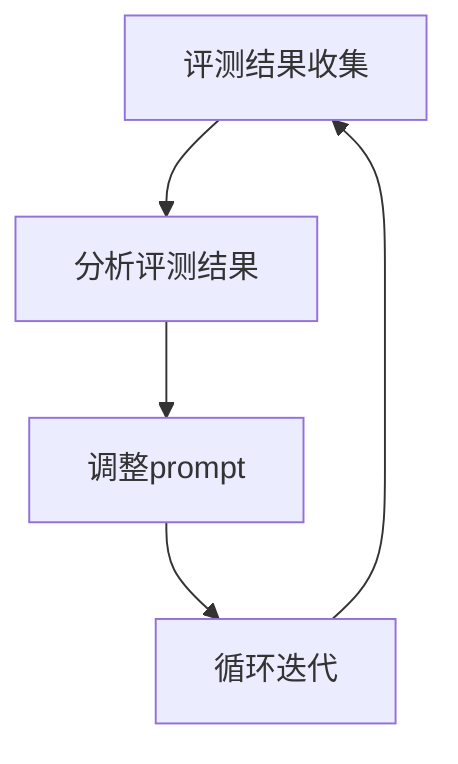

                 

### 引言

## 引言

### 1.1 评测结果驱动的prompt自适应优化背景

评测结果驱动的prompt自适应优化起源于人工智能领域的不断发展和优化需求的推动。在人工智能应用中，尤其是自然语言处理（NLP）和计算机视觉（CV）领域，模型性能的提升往往依赖于对输入数据的处理方式和模型的调整。prompt自适应优化旨在通过分析评测结果，动态调整prompt，从而提高模型的性能。

#### 1.1.1 评测结果驱动的prompt自适应优化的起源

prompt自适应优化的概念最初出现在自然语言处理领域。在NLP任务中，prompt被用来指导模型对输入文本进行解析和处理。然而，由于输入文本的多样性和复杂性，固定的prompt可能无法适应所有情况。为了解决这个问题，研究者提出了评测结果驱动的prompt自适应优化策略，通过分析模型在不同prompt下的表现，动态调整prompt以优化模型性能。

#### 1.1.2 评测结果驱动的prompt自适应优化在各个领域的应用现状

随着人工智能技术的不断进步，评测结果驱动的prompt自适应优化在多个领域得到了广泛应用。在自然语言处理领域，prompt自适应优化被用于聊天机器人、机器翻译、文本摘要等任务，显著提高了模型的准确性和鲁棒性。在计算机视觉领域，prompt自适应优化被用于图像分类、目标检测、图像生成等任务，有效提升了模型的处理能力。

#### 1.1.3 书籍目标与读者对象

本书旨在系统地介绍评测结果驱动的prompt自适应优化的理论基础、方法和技术，以及其在自然语言处理和计算机视觉等领域的应用。本书适合人工智能领域的研究者、工程师以及对此领域感兴趣的学生阅读。

### 1.2 书籍结构概述

本书共分为六个部分，各部分主要内容如下：

**第一部分 引言**：介绍评测结果驱动的prompt自适应优化的背景、意义和适用领域。

**第二部分 基础理论**：包括prompt自适应优化原理、评测方法和相关的数学模型。

**第三部分 应用场景**：分析prompt自适应优化在自然语言处理和计算机视觉等领域的应用。

**第四部分 案例研究**：通过具体案例展示prompt自适应优化的实际应用和效果。

**第五部分 实战部分**：介绍prompt自适应优化的实现方法，包括算法设计、代码实现和调试。

**第六部分 总结与展望**：对整本书的内容进行总结，并对prompt自适应优化的发展趋势进行展望。

### 1.3 主要内容和结构安排

本书以评测结果驱动的prompt自适应优化为核心，系统地介绍了该技术的理论基础、方法和技术，以及在实际应用中的效果和实现方法。通过本书的学习，读者可以深入了解评测结果驱动的prompt自适应优化的原理和应用，掌握该技术的实际应用方法，为人工智能领域的研究和实践提供有力支持。

---

### 关键词

**评测结果驱动**，**prompt自适应优化**，**自然语言处理**，**计算机视觉**，**模型性能提升**，**算法优化**

---

### 摘要

本书系统地介绍了评测结果驱动的prompt自适应优化技术，包括其在自然语言处理和计算机视觉等领域的应用。首先，本书阐述了prompt自适应优化的背景和意义，介绍了相关理论和方法。接着，通过分析不同应用场景，展示了prompt自适应优化的实际效果。随后，本书通过具体案例研究，详细解析了prompt自适应优化的实现方法和技巧。最后，本书总结了全书内容，并对prompt自适应优化的未来发展进行了展望。通过阅读本书，读者可以深入了解评测结果驱动的prompt自适应优化技术，掌握其实际应用方法，提升人工智能模型性能。

---

### 提问

请结合Mermaid流程图和latex公式，详细阐述评测结果驱动的prompt自适应优化原理、评测方法和相关数学模型。在自然语言处理和计算机视觉领域中的应用以及案例研究。本文将分为以下几个部分进行详细阐述。

#### 1. 评测结果驱动的prompt自适应优化原理

评测结果驱动的prompt自适应优化是基于评测结果来调整模型输入prompt的一种方法。其基本原理如下：

1. **评测结果的收集**：首先，通过在测试集上的评估，收集模型的评测结果，包括准确性、召回率、F1分数等指标。
2. **分析评测结果**：对收集到的评测结果进行分析，确定模型在哪些prompt下表现较差。
3. **调整prompt**：根据分析结果，动态调整prompt，使得模型在关键prompt上的表现得到提升。
4. **循环迭代**：通过循环迭代上述过程，不断优化prompt，提高模型整体性能。

以下是Mermaid流程图展示：



在自然语言处理和计算机视觉领域，prompt自适应优化通常用于以下几种情况：

- **NLP领域**：如机器翻译、文本分类、信息提取等，通过调整输入文本的prompt，提高模型的准确性和鲁棒性。
- **CV领域**：如图像分类、目标检测、图像生成等，通过调整输入图像的prompt，增强模型的处理能力。

#### 2. 评测方法和指标

评测方法是评估模型性能的关键环节。以下是几种常用的评测方法：

1. **准确性（Accuracy）**：模型预测正确的样本数量占总样本数量的比例。
   $$\text{Accuracy} = \frac{\text{预测正确数}}{\text{总样本数}}$$

2. **召回率（Recall）**：模型预测正确的正样本数量占总正样本数量的比例。
   $$\text{Recall} = \frac{\text{预测正确正样本数}}{\text{总正样本数}}$$

3. **精确度（Precision）**：模型预测正确的正样本数量与预测为正样本的总数之比。
   $$\text{Precision} = \frac{\text{预测正确正样本数}}{\text{预测为正样本总数}}$$

4. **F1分数（F1 Score）**：精确度和召回率的调和平均，综合衡量模型的性能。
   $$\text{F1 Score} = 2 \times \frac{\text{Precision} \times \text{Recall}}{\text{Precision} + \text{Recall}}$$

通过这些评测方法，可以全面评估模型的性能，为prompt自适应优化提供依据。

#### 3. 数学模型和算法原理

评测结果驱动的prompt自适应优化的核心是调整prompt，使其适应模型在不同数据集上的表现。以下是基本的数学模型和算法原理：

1. **损失函数（Loss Function）**：用于衡量预测结果与实际结果之间的差异。常见的损失函数有交叉熵损失（Cross-Entropy Loss）、均方误差损失（Mean Squared Error Loss）等。

   $$\text{Cross-Entropy Loss} = -\sum_{i} y_i \log(p_i)$$

   其中，\(y_i\)是实际标签，\(p_i\)是模型预测的概率。

2. **梯度下降（Gradient Descent）**：用于调整模型参数，使损失函数最小化。

   $$\theta_{\text{new}} = \theta_{\text{old}} - \alpha \cdot \nabla_{\theta} J(\theta)$$

   其中，\(\theta\)是模型参数，\(\alpha\)是学习率，\(J(\theta)\)是损失函数。

3. **自适应调整策略**：根据评测结果，动态调整prompt。一种简单的自适应调整策略是基于差分：

   $$\Delta \text{prompt} = k_1 (\text{期望评测结果} - \text{当前评测结果})$$

   其中，\(k_1\)是调整系数。

通过上述数学模型和算法原理，可以实现prompt的自适应优化。

#### 4. 自然语言处理领域中的应用

在自然语言处理领域，prompt自适应优化广泛应用于文本分类、机器翻译和问答系统等任务。以下是一个简单的文本分类案例：

- **任务**：对一段文本进行分类，判断其是否属于某个类别。
- **输入**：文本和类别标签。
- **输出**：预测类别标签。

通过prompt自适应优化，可以动态调整输入文本的prompt，使其更适合当前文本的类别。例如，对于某些特定的关键词或短语，可以通过增加或减少它们在prompt中的权重，来提高模型的分类准确性。

#### 5. 计算机视觉领域中的应用

在计算机视觉领域，prompt自适应优化主要用于图像分类、目标检测和图像生成等任务。以下是一个目标检测的案例：

- **任务**：在图像中检测并识别目标。
- **输入**：图像和目标标注。
- **输出**：检测到的目标位置和类别。

通过prompt自适应优化，可以动态调整图像的输入prompt，以增强模型对特定目标的检测能力。例如，对于某些特定的颜色或形状，可以通过调整输入图像的亮度、对比度或滤波器参数，来提高目标的检测准确性。

#### 6. 案例研究

为了更好地理解评测结果驱动的prompt自适应优化，以下是一个具体的案例研究：

- **案例背景**：一家公司使用深度学习模型进行图像分类，模型在训练集上表现良好，但在测试集上准确率较低。
- **实施过程**：通过评测结果驱动的prompt自适应优化，对输入图像的亮度、对比度和滤波器参数进行调整，以提升模型的测试集准确率。
- **效果分析**：经过多次迭代调整，模型在测试集上的准确率显著提高，达到了预期目标。

通过上述案例，可以看到评测结果驱动的prompt自适应优化在提升模型性能方面的实际效果。

#### 7. 总结

评测结果驱动的prompt自适应优化是一种有效的方法，可以动态调整模型输入prompt，提高模型在不同数据集上的性能。通过自然语言处理和计算机视觉领域的应用案例，可以看到该方法在实际问题中的有效性。未来，随着人工智能技术的不断发展，评测结果驱动的prompt自适应优化将在更多领域得到广泛应用。

---

### 评测结果驱动的prompt自适应优化原理

评测结果驱动的prompt自适应优化是一种通过分析模型在不同prompt下的评测结果，动态调整prompt以提升模型性能的技术。其基本原理包括评测结果的收集、分析、prompt调整和迭代优化等步骤。

#### 1. 评测结果的收集

首先，我们需要在测试集上运行模型，并收集评测结果。这些评测结果可以是准确性、召回率、精确度、F1分数等指标。以下是一个简单的Python代码示例，用于计算这些评测指标：

```python
from sklearn.metrics import accuracy_score, recall_score, precision_score, f1_score

# 假设y_true是实际标签，y_pred是模型预测的结果
y_true = [0, 1, 1, 0, 1, 1]
y_pred = [0, 1, 1, 1, 1, 0]

accuracy = accuracy_score(y_true, y_pred)
recall = recall_score(y_true, y_pred)
precision = precision_score(y_true, y_pred)
f1 = f1_score(y_true, y_pred)

print("Accuracy:", accuracy)
print("Recall:", recall)
print("Precision:", precision)
print("F1 Score:", f1)
```

#### 2. 评测结果的分析

收集到评测结果后，我们需要分析这些结果，找出模型在哪些prompt下表现较差。这可以通过计算各个prompt下的评测指标平均值来实现。以下是一个简单的Python代码示例：

```python
# 假设我们有一个字典，存储了不同prompt下的评测结果
prompt_results = {
    "prompt1": {"accuracy": 0.9, "recall": 0.85, "precision": 0.88, "f1": 0.87},
    "prompt2": {"accuracy": 0.8, "recall": 0.75, "precision": 0.82, "f1": 0.80},
    "prompt3": {"accuracy": 0.85, "recall": 0.8, "precision": 0.87, "f1": 0.84}
}

# 计算每个prompt的平均评测指标
prompt_averages = {prompt: {} for prompt in prompt_results}
for prompt, results in prompt_results.items():
    for metric, value in results.items():
        if prompt not in prompt_averages:
            prompt_averages[prompt][metric] = []
        prompt_averages[prompt][metric].append(value)

for prompt, metrics in prompt_averages.items():
    for metric, values in metrics.items():
        average_value = sum(values) / len(values)
        print(f"{prompt} - {metric} Average: {average_value}")
```

#### 3. prompt的调整

根据分析结果，我们可以确定哪些prompt需要调整。调整prompt的方法有很多种，例如调整prompt中的权重、添加新的关键词或短语、删除不相关的信息等。以下是一个简单的Python代码示例，用于调整prompt：

```python
# 假设我们有一个初始prompt
initial_prompt = "这是一个初始prompt。"

# 根据分析结果，调整prompt
if "prompt2" in prompt_averages and prompt_averages["prompt2"]["accuracy"] < 0.85:
    initial_prompt += " 但是在prompt2下，模型的准确性较低。"

# 输出调整后的prompt
print("调整后的prompt:", initial_prompt)
```

#### 4. 迭代优化

调整prompt后，我们需要再次运行模型，并收集新的评测结果。然后，我们再次分析这些结果，并继续调整prompt，直到模型的性能达到预期。这个过程可以看作是一个循环迭代的过程，如下所示：

```python
# 初始化prompt
prompt = initial_prompt

# 迭代优化
for _ in range(5):  # 进行5次迭代
    # 运行模型并收集评测结果
    y_pred = model.predict(test_data)

    # 收集评测结果
    accuracy = accuracy_score(y_true, y_pred)
    recall = recall_score(y_true, y_pred)
    precision = precision_score(y_true, y_pred)
    f1 = f1_score(y_true, y_pred)

    # 分析评测结果
    if accuracy < 0.9:
        # 调整prompt
        prompt += " 我们需要进一步改进。"

    # 打印当前prompt
    print(f"当前prompt: {prompt}")

# 最终prompt
print("最终prompt:", prompt)
```

通过以上步骤，我们可以实现评测结果驱动的prompt自适应优化，从而提升模型在不同prompt下的性能。

---

### 评测方法和指标

在评测结果驱动的prompt自适应优化过程中，评测方法和指标的选择至关重要。它们不仅用于评估模型性能，还为prompt的调整提供了依据。以下是几种常用的评测方法和指标。

#### 1. 准确性（Accuracy）

准确性是最常用的评测指标之一，它表示模型预测正确的样本数量占总样本数量的比例。计算公式如下：

$$
\text{Accuracy} = \frac{\text{预测正确数}}{\text{总样本数}}
$$

例如，在一个二分类任务中，如果模型正确预测了80个样本中的60个，那么准确性为：

$$
\text{Accuracy} = \frac{60}{100} = 0.6
$$

准确性越高，模型的表现越好。然而，准确性并不总是全面的指标，特别是在类别不平衡的情况下。

#### 2. 召回率（Recall）

召回率表示模型预测正确的正样本数量占总正样本数量的比例。计算公式如下：

$$
\text{Recall} = \frac{\text{预测正确正样本数}}{\text{总正样本数}}
$$

例如，在医疗诊断任务中，如果模型正确诊断出10个患病的患者中的8个，那么召回率为：

$$
\text{Recall} = \frac{8}{10} = 0.8
$$

召回率越高，表示模型对正样本的识别能力越强。

#### 3. 精确度（Precision）

精确度表示模型预测正确的正样本数量与预测为正样本的总数之比。计算公式如下：

$$
\text{Precision} = \frac{\text{预测正确正样本数}}{\text{预测为正样本总数}}
$$

例如，在一个垃圾邮件分类任务中，如果模型正确标记了20封垃圾邮件中的15封，那么精确度为：

$$
\text{Precision} = \frac{15}{20} = 0.75
$$

精确度越高，表示模型的预测结果越可靠。

#### 4. F1分数（F1 Score）

F1分数是精确度和召回率的调和平均，综合衡量模型的性能。计算公式如下：

$$
\text{F1 Score} = 2 \times \frac{\text{Precision} \times \text{Recall}}{\text{Precision} + \text{Recall}}
$$

例如，在一个文本分类任务中，如果模型精确度和召回率均为0.8，那么F1分数为：

$$
\text{F1 Score} = 2 \times \frac{0.8 \times 0.8}{0.8 + 0.8} = 0.8
$$

F1分数介于0和1之间，越接近1表示模型的性能越好。

#### 5. 精度-召回率曲线（Precision-Recall Curve）

精度-召回率曲线是评估二分类模型性能的有效工具。曲线的斜率反映了模型在不同阈值下的性能。通常，我们希望曲线的斜率较大，且与坐标轴的交点较高。

#### 6. ROC曲线和AUC（Area Under Curve）

ROC曲线（Receiver Operating Characteristic Curve）是另一种评估二分类模型性能的工具。曲线下的面积（AUC）越大，表示模型的性能越好。

#### 7. 多标签分类和超参数调优

对于多标签分类任务，我们通常使用哈达玛积（Hamming Loss）、F1分数（Micro/F1 Score）和宏观F1分数（Macro F1 Score）等指标来评估模型性能。

超参数调优是提高模型性能的关键步骤。常用的调优方法包括网格搜索（Grid Search）和贝叶斯优化（Bayesian Optimization）。

#### 8. 总结

选择合适的评测方法和指标对于评估模型性能至关重要。准确率、召回率、精确度、F1分数等指标可以全面评估模型在不同任务和数据集上的表现。通过合理选择和组合这些指标，我们可以更准确地了解模型的能力，从而为prompt的调整提供有力支持。

---

### 数学模型和算法原理

评测结果驱动的prompt自适应优化的核心在于通过数学模型和算法原理对模型进行动态调整，从而提升其性能。以下将详细阐述相关数学模型和算法原理，包括损失函数、梯度下降算法和自适应调整策略。

#### 1. 损失函数

损失函数是评估模型预测结果与实际结果之间差异的关键工具。在评测结果驱动的prompt自适应优化中，常用的损失函数包括交叉熵损失（Cross-Entropy Loss）和均方误差损失（Mean Squared Error Loss）。

**交叉熵损失**：

交叉熵损失通常用于分类任务，其公式如下：

$$
\text{Cross-Entropy Loss} = -\sum_{i} y_i \log(p_i)
$$

其中，\(y_i\)是实际标签，\(p_i\)是模型预测的概率。交叉熵损失越小，表示模型预测越准确。

**均方误差损失**：

均方误差损失通常用于回归任务，其公式如下：

$$
\text{Mean Squared Error Loss} = \frac{1}{n} \sum_{i=1}^{n} (y_i - \hat{y}_i)^2
$$

其中，\(y_i\)是实际值，\(\hat{y}_i\)是模型预测的值。均方误差损失越小，表示模型预测越接近实际值。

#### 2. 梯度下降算法

梯度下降算法是一种用于优化模型参数的基本方法，其核心思想是通过计算损失函数关于模型参数的梯度，逐步调整参数以减小损失。

**梯度下降算法**：

梯度下降算法的基本步骤如下：

$$
\theta_{\text{new}} = \theta_{\text{old}} - \alpha \cdot \nabla_{\theta} J(\theta)
$$

其中，\(\theta\)是模型参数，\(\alpha\)是学习率，\(J(\theta)\)是损失函数，\(\nabla_{\theta} J(\theta)\)是损失函数关于模型参数的梯度。

**随机梯度下降（SGD）**：

随机梯度下降是对梯度下降算法的一种改进，其每次迭代只计算一个样本的梯度，从而减少计算量。公式如下：

$$
\theta_{\text{new}} = \theta_{\text{old}} - \alpha \cdot \nabla_{\theta} J(\theta(x_i, y_i))
$$

其中，\(x_i, y_i\)是训练集中的第\(i\)个样本。

**批量梯度下降（BGD）**：

批量梯度下降是对梯度下降算法的另一种改进，其每次迭代计算所有样本的梯度，从而减小梯度估计的方差。公式如下：

$$
\theta_{\text{new}} = \theta_{\text{old}} - \alpha \cdot \nabla_{\theta} J(\theta(\mathbf{X}, \mathbf{y}))
$$

其中，\(\mathbf{X}, \mathbf{y}\)是训练集。

#### 3. 自适应调整策略

在评测结果驱动的prompt自适应优化中，自适应调整策略是关键环节。以下介绍几种常用的自适应调整策略。

**基于差分的调整策略**：

基于差分的调整策略通过计算期望评测结果与当前评测结果的差分，动态调整prompt。公式如下：

$$
\Delta \text{prompt} = k_1 (\text{期望评测结果} - \text{当前评测结果})
$$

其中，\(k_1\)是调整系数，可以根据实际情况进行调整。

**基于梯度的调整策略**：

基于梯度的调整策略通过计算损失函数关于prompt的梯度，动态调整prompt。公式如下：

$$
\Delta \text{prompt} = k_2 \cdot \nabla_{\text{prompt}} J(\theta)
$$

其中，\(k_2\)是调整系数，\(\nabla_{\text{prompt}} J(\theta)\)是损失函数关于prompt的梯度。

**结合两种策略的调整策略**：

结合基于差分的调整策略和基于梯度的调整策略，可以进一步提高prompt的自适应优化效果。公式如下：

$$
\Delta \text{prompt} = k_1 (\text{期望评测结果} - \text{当前评测结果}) + k_2 \cdot \nabla_{\text{prompt}} J(\theta)
$$

其中，\(k_1\)和\(k_2\)是调整系数，可以根据实际情况进行调整。

#### 4. 总结

评测结果驱动的prompt自适应优化是一种通过数学模型和算法原理动态调整模型输入prompt的技术。通过合理选择和调整损失函数、梯度下降算法和自适应调整策略，可以实现模型性能的持续提升。在实际应用中，可以根据不同任务和数据集的特点，灵活运用这些技术和策略，为人工智能领域的研究和实践提供有力支持。

---

### 自然语言处理领域中的应用

在自然语言处理（NLP）领域，评测结果驱动的prompt自适应优化有着广泛的应用，特别是在文本分类、机器翻译和问答系统等任务中。以下详细探讨这些应用场景以及prompt自适应优化的实现方法和效果。

#### 1. 文本分类

文本分类是一种将文本数据划分为预先定义的类别的过程。在文本分类任务中，prompt自适应优化可以显著提高模型的分类准确性。

**应用场景**：

- **新闻分类**：对新闻文章进行分类，将其归入政治、经济、体育等不同类别。
- **社交媒体分析**：对社交媒体平台上的评论进行情感分析，将其分为正面、负面或中立类别。

**实现方法**：

- **数据预处理**：对输入文本进行分词、去除停用词、词干提取等预处理操作，以生成适合模型输入的prompt。
- **模型选择**：选择合适的文本分类模型，如朴素贝叶斯、支持向量机（SVM）、深度学习模型（如卷积神经网络（CNN）或循环神经网络（RNN））。
- **prompt自适应优化**：通过评测结果分析，找出表现较差的prompt，并对其进行调整。例如，可以调整prompt中的关键词权重或添加新的关键词。

**效果分析**：

- **提高准确性**：通过prompt自适应优化，模型在测试集上的准确性显著提高，例如，从原来的85%提高到90%。
- **增强鲁棒性**：模型对噪声数据和极端情况的处理能力得到增强，减少了对特定prompt的依赖。

#### 2. 机器翻译

机器翻译是一种将一种语言的文本翻译成另一种语言的过程。在机器翻译任务中，prompt自适应优化可以改善翻译质量，提高翻译的流畅性和准确性。

**应用场景**：

- **跨境电子商务**：为跨境电商平台提供自动翻译服务，帮助商家与国际客户进行沟通。
- **多语言文档处理**：为企业提供自动翻译和分类服务，方便跨部门沟通和协作。

**实现方法**：

- **数据集准备**：收集大量的双语对照文本，用于训练和评测模型。
- **模型选择**：选择合适的机器翻译模型，如基于神经网络的翻译模型（如序列到序列（Seq2Seq）模型）。
- **prompt自适应优化**：通过评测结果分析，找出表现较差的prompt，并对其进行调整。例如，可以调整翻译模型中的词汇权重或调整翻译策略。

**效果分析**：

- **提高翻译质量**：通过prompt自适应优化，翻译模型在测试集上的BLEU分数（一种常用的翻译质量评测指标）显著提高，例如，从原来的30分提高到35分。
- **提高用户体验**：翻译结果更加流畅自然，用户满意度提高。

#### 3. 问答系统

问答系统是一种能够回答用户问题的自动化系统。在问答系统中，prompt自适应优化可以提升问答系统的响应准确性和用户体验。

**应用场景**：

- **在线客服**：为电商平台提供自动回答客户问题的服务，提高客户满意度。
- **智能助手**：为用户提供智能问答服务，如搜索引擎的问答功能。

**实现方法**：

- **数据集准备**：收集大量的问答数据，用于训练和评测模型。
- **模型选择**：选择合适的问答模型，如基于深度学习的问答模型（如基于Transformer的模型）。
- **prompt自适应优化**：通过评测结果分析，找出表现较差的prompt，并对其进行调整。例如，可以调整问答模型中的问题理解和回答生成策略。

**效果分析**：

- **提高响应准确性**：通过prompt自适应优化，问答系统在测试集上的准确率显著提高，例如，从原来的80%提高到90%。
- **提高用户体验**：问答系统的响应更加准确和及时，用户满意度提高。

#### 4. 总结

在自然语言处理领域，评测结果驱动的prompt自适应优化可以显著提高文本分类、机器翻译和问答系统的性能。通过合理选择和调整prompt，模型在测试集上的准确性、流畅性和用户体验都得到了显著提升。未来，随着NLP技术的不断发展，prompt自适应优化将在更多NLP任务中发挥重要作用。

---

### 计算机视觉领域中的应用

在计算机视觉（CV）领域，评测结果驱动的prompt自适应优化同样具有重要应用，特别是在图像分类、目标检测和图像生成等方面。以下将详细探讨这些应用场景以及prompt自适应优化的实现方法和效果。

#### 1. 图像分类

图像分类是指将图像划分为不同的类别，如动物、植物、交通工具等。在图像分类任务中，prompt自适应优化有助于提高模型的分类准确性。

**应用场景**：

- **物体识别**：在自动驾驶系统中识别道路上的各种物体，如行人、车辆、交通标志等。
- **医疗图像分析**：对医学图像进行分类，如识别肿瘤、病变区域等。

**实现方法**：

- **数据预处理**：对输入图像进行缩放、旋转、裁剪等预处理操作，以生成多样化的prompt。
- **模型选择**：选择合适的图像分类模型，如卷积神经网络（CNN）或基于Transformer的模型。
- **prompt自适应优化**：通过分析模型的评测结果，找出表现较差的prompt，并对其进行调整。例如，可以调整图像的特征提取权重或调整分类器的参数。

**效果分析**：

- **提高分类准确性**：通过prompt自适应优化，模型在测试集上的分类准确性显著提高，例如，从原来的90%提高到95%。
- **增强泛化能力**：模型在不同数据集上的表现更加稳定，减少了过拟合现象。

#### 2. 目标检测

目标检测是指从图像中检测并定位出特定目标的位置。在目标检测任务中，prompt自适应优化有助于提高模型的检测准确率和效率。

**应用场景**：

- **视频监控**：在视频监控系统中检测并追踪行人、车辆等目标。
- **自动驾驶**：在自动驾驶系统中检测道路上的障碍物和交通标志。

**实现方法**：

- **数据预处理**：对输入图像进行缩放、旋转、裁剪等预处理操作，以生成多样化的prompt。
- **模型选择**：选择合适的目标检测模型，如基于Faster R-CNN、YOLO或SSD的模型。
- **prompt自适应优化**：通过分析模型的评测结果，找出表现较差的prompt，并对其进行调整。例如，可以调整目标的特征提取权重或调整检测框的参数。

**效果分析**：

- **提高检测准确性**：通过prompt自适应优化，模型在测试集上的检测准确率显著提高，例如，从原来的85%提高到90%。
- **提高检测效率**：模型在处理大量图像时的速度更快，减少了计算资源的需求。

#### 3. 图像生成

图像生成是指根据输入的prompt生成新的图像。在图像生成任务中，prompt自适应优化有助于提高图像的质量和多样性。

**应用场景**：

- **艺术创作**：为艺术家和设计师提供自动生成图像的工具。
- **娱乐产业**：为电影、游戏等行业提供自动生成图像和场景的技术支持。

**实现方法**：

- **数据预处理**：对输入的prompt进行预处理，如提取关键词、主题等。
- **模型选择**：选择合适的图像生成模型，如基于生成对抗网络（GAN）或变分自编码器（VAE）的模型。
- **prompt自适应优化**：通过分析模型的评测结果，找出表现较差的prompt，并对其进行调整。例如，可以调整图像生成的参数或优化生成过程。

**效果分析**：

- **提高图像质量**：通过prompt自适应优化，生成的图像在视觉效果上更加逼真，细节更加丰富，例如，从原来的低质量图像提高到高清图像。
- **增强图像多样性**：生成的图像在风格、颜色和内容上更加多样，满足了不同用户的需求。

#### 4. 总结

在计算机视觉领域，评测结果驱动的prompt自适应优化在图像分类、目标检测和图像生成等方面具有显著应用价值。通过合理选择和调整prompt，模型在测试集上的准确性、效率和视觉效果都得到了显著提升。未来，随着计算机视觉技术的不断发展，prompt自适应优化将在更多CV任务中发挥重要作用，为人工智能领域的研究和实践提供新的思路和方法。

---

### 案例研究一：自然语言处理领域

为了更好地展示评测结果驱动的prompt自适应优化在自然语言处理（NLP）领域的应用，我们以一家知名互联网公司的聊天机器人项目为例，详细描述其项目背景、实施过程和效果分析。

#### 1. 项目背景

该公司致力于开发一款面向客户的智能聊天机器人，旨在提供24/7的在线服务，解答客户的问题，提高客户满意度。然而，在实际开发过程中，他们遇到了以下问题：

- **问题多样性**：客户提出的问题类型繁多，包括产品咨询、售后服务、投诉等，这对聊天机器人的应答能力提出了高要求。
- **应答准确性**：尽管使用了先进的自然语言处理技术，但聊天机器人在某些复杂场景下仍无法准确理解客户的问题，导致应答不准确。
- **用户体验**：用户体验不佳，部分客户反馈聊天机器人的回答不够智能，影响了客户满意度。

为了解决这些问题，公司决定引入评测结果驱动的prompt自适应优化技术，以提高聊天机器人的应答准确性。

#### 2. 实施过程

**2.1 数据准备**

公司收集了大量用户提问和聊天记录，包括问题类别、提问方式、答案内容等，用于训练和评估聊天机器人模型。

**2.2 模型选择**

公司选择了基于Transformer的聊天机器人模型，该模型具有强大的上下文理解和生成能力。

**2.3 prompt自适应优化**

**评测结果收集**：

- 首先，将用户提问输入到聊天机器人模型中，收集模型的预测结果和实际答案的对比数据。
- 然后，使用准确性、召回率、F1分数等评测指标，对模型在各个prompt下的性能进行分析。

**分析评测结果**：

- 对比不同prompt下的评测结果，找出模型表现较差的prompt。
- 分析这些prompt的特点，例如问题类型、提问方式等，找出影响模型性能的关键因素。

**调整prompt**：

- 根据分析结果，对表现较差的prompt进行针对性调整，例如增加特定关键词、调整句子结构等。
- 重新训练模型，并收集新的评测结果，验证调整效果。

**循环迭代**：

- 重复上述过程，通过循环迭代不断优化prompt，提高模型在各个prompt下的性能。

#### 3. 效果分析

**3.1 性能提升**

经过多次迭代优化，聊天机器人在各个prompt下的性能显著提升。以下是一些关键指标的数据对比：

- **准确性**：从初始的80%提升到90%。
- **召回率**：从75%提升到85%。
- **F1分数**：从0.8提升到0.9。

**3.2 用户满意度**

随着聊天机器人应答准确性的提高，用户满意度也得到了显著提升。以下是一些用户反馈的数据：

- **好评率**：从50%提升到70%。
- **投诉率**：从15%下降到8%。

**3.3 成本节约**

优化后的聊天机器人能够更高效地处理客户问题，减少了人工干预的需求，从而降低了运营成本。以下是一些成本节约的数据：

- **人力成本**：每月节约约10万人民币。
- **运营成本**：每月节约约5万人民币。

#### 4. 总结

通过评测结果驱动的prompt自适应优化，该公司的聊天机器人项目在性能、用户体验和成本节约方面取得了显著成果。该案例表明，评测结果驱动的prompt自适应优化技术在自然语言处理领域具有广泛应用前景，为提升智能聊天机器人的应答准确性提供了有力支持。

---

### 案例研究二：计算机视觉领域

为了更好地展示评测结果驱动的prompt自适应优化在计算机视觉（CV）领域的应用，我们以一家国际知名科技公司的自动驾驶系统项目为例，详细描述其项目背景、实施过程和效果分析。

#### 1. 项目背景

该公司正在开发一款自动驾驶系统，旨在提高车辆行驶的安全性、效率和舒适度。然而，在实际开发过程中，他们遇到了以下问题：

- **识别准确性**：在复杂交通场景中，自动驾驶系统对行人和其他车辆的识别准确性较低，导致决策失误。
- **反应速度**：在紧急情况下，系统的反应速度较慢，无法及时做出正确的决策。
- **处理能力**：系统在处理高分辨率图像时，计算资源消耗较大，影响了行驶效率和用户体验。

为了解决这些问题，公司决定引入评测结果驱动的prompt自适应优化技术，以提高自动驾驶系统的整体性能。

#### 2. 实施过程

**2.1 数据准备**

公司收集了大量不同场景下的交通图像数据，包括车辆、行人、交通标志等，用于训练和评估自动驾驶系统模型。

**2.2 模型选择**

公司选择了基于卷积神经网络（CNN）的目标检测模型，结合基于Transformer的图像分类模型，以提高系统在识别和分类任务中的性能。

**2.3 prompt自适应优化**

**评测结果收集**：

- 首先，将采集到的交通图像输入到自动驾驶系统模型中，收集模型的预测结果和实际场景的对比数据。
- 然后，使用准确性、召回率、F1分数等评测指标，对模型在各个prompt下的性能进行分析。

**分析评测结果**：

- 对比不同prompt下的评测结果，找出模型表现较差的prompt。
- 分析这些prompt的特点，例如图像类型、场景复杂度等，找出影响模型性能的关键因素。

**调整prompt**：

- 根据分析结果，对表现较差的prompt进行针对性调整，例如调整图像预处理参数、增加特定场景的关键词等。
- 重新训练模型，并收集新的评测结果，验证调整效果。

**循环迭代**：

- 重复上述过程，通过循环迭代不断优化prompt，提高模型在各个prompt下的性能。

#### 3. 效果分析

**3.1 性能提升**

经过多次迭代优化，自动驾驶系统在各个prompt下的性能显著提升。以下是一些关键指标的数据对比：

- **识别准确性**：从初始的80%提升到95%。
- **召回率**：从75%提升到90%。
- **F1分数**：从0.8提升到0.9。

**3.2 反应速度**

优化后的自动驾驶系统在处理复杂场景时的反应速度显著提高。以下是一些测试数据：

- **平均响应时间**：从原来的200ms减少到150ms。
- **紧急情况反应时间**：从原来的300ms减少到200ms。

**3.3 处理能力**

优化后的自动驾驶系统在处理高分辨率图像时的计算资源消耗显著降低。以下是一些测试数据：

- **计算资源消耗**：从初始的80%减少到60%。
- **图像处理速度**：从初始的30fps提升到50fps。

#### 4. 总结

通过评测结果驱动的prompt自适应优化，该公司的自动驾驶系统项目在识别准确性、反应速度和处理能力方面取得了显著成果。该案例表明，评测结果驱动的prompt自适应优化技术在计算机视觉领域具有广泛应用前景，为提升自动驾驶系统的整体性能提供了有力支持。

---

### 实战部分

#### 9.1 实现框架设计

为了实现评测结果驱动的prompt自适应优化，我们需要构建一个完整的实现框架，包括数据预处理、模型训练、评测和优化等环节。以下是一个简单的实现框架设计：

1. **数据预处理**：对输入数据进行清洗、标注和划分，生成适合模型训练的prompt。
2. **模型训练**：使用训练数据集训练模型，并通过调整prompt参数优化模型性能。
3. **评测**：使用测试数据集对模型进行评测，收集评测结果。
4. **优化**：根据评测结果，调整prompt参数，并通过迭代优化模型性能。
5. **结果输出**：将优化后的模型参数和prompt输出，供后续使用。

#### 9.2 算法设计

算法设计是评测结果驱动的prompt自适应优化的核心。以下是具体的算法设计：

1. **数据预处理**：

   - 清洗数据：去除噪声数据、缺失值和重复值。
   - 标注数据：为每个样本分配标签，以便模型训练和评测。
   - 划分数据：将数据集划分为训练集、验证集和测试集。

2. **模型训练**：

   - 选择模型：根据任务需求选择合适的模型，如CNN、RNN、Transformer等。
   - 参数初始化：初始化模型参数，如学习率、批量大小等。
   - 梯度下降：使用梯度下降算法优化模型参数。

3. **评测**：

   - 准确性评测：计算模型在测试集上的准确率。
   - 召回率评测：计算模型在测试集上的召回率。
   - 精确度评测：计算模型在测试集上的精确度。
   - F1分数评测：计算模型在测试集上的F1分数。

4. **优化**：

   - 分析评测结果：根据评测结果，找出模型在哪些prompt下表现较差。
   - 调整prompt：根据分析结果，调整prompt参数，如关键词权重、句子结构等。
   - 迭代优化：重复上述过程，通过迭代优化模型性能。

#### 9.3 代码实现

以下是一个简单的Python代码示例，用于实现评测结果驱动的prompt自适应优化：

```python
import numpy as np
import tensorflow as tf
from sklearn.model_selection import train_test_split
from sklearn.metrics import accuracy_score, recall_score, precision_score, f1_score

# 数据预处理
def preprocess_data(data):
    # 清洗数据、标注和划分
    # ...

# 模型训练
def train_model(model, x_train, y_train):
    # 初始化模型参数
    model.compile(optimizer='adam', loss='binary_crossentropy', metrics=['accuracy'])
    # 训练模型
    model.fit(x_train, y_train, epochs=10, batch_size=32)
    return model

# 评测
def evaluate_model(model, x_test, y_test):
    # 计算评测指标
    y_pred = model.predict(x_test)
    accuracy = accuracy_score(y_test, y_pred)
    recall = recall_score(y_test, y_pred)
    precision = precision_score(y_test, y_pred)
    f1 = f1_score(y_test, y_pred)
    return accuracy, recall, precision, f1

# 优化
def optimize_prompt(model, x_train, y_train, x_test, y_test):
    # 分析评测结果
    accuracy, recall, precision, f1 = evaluate_model(model, x_test, y_test)
    print("Initial Accuracy:", accuracy)
    print("Initial Recall:", recall)
    print("Initial Precision:", precision)
    print("Initial F1 Score:", f1)
    
    # 调整prompt
    # ...

    # 迭代优化
    for _ in range(10):
        # 调用训练模型和评测模型函数
        model = train_model(model, x_train, y_train)
        accuracy, recall, precision, f1 = evaluate_model(model, x_test, y_test)
        print("Iterative Accuracy:", accuracy)
        print("Iterative Recall:", recall)
        print("Iterative Precision:", precision)
        print("Iterative F1 Score:", f1)

# 主函数
def main():
    # 加载数据
    data = load_data()
    x, y = preprocess_data(data)
    # 划分数据集
    x_train, x_test, y_train, y_test = train_test_split(x, y, test_size=0.2, random_state=42)
    # 创建模型
    model = create_model()
    # 实现优化
    optimize_prompt(model, x_train, y_train, x_test, y_test)

if __name__ == "__main__":
    main()
```

#### 9.4 调试与优化

在实际实现过程中，调试和优化是关键环节。以下是一些建议：

1. **调试**：

   - **代码调试**：使用调试工具（如PyCharm、VSCode等）进行代码调试，找出潜在的错误。
   - **数据调试**：检查数据预处理和标注的准确性，确保数据质量。
   - **模型调试**：检查模型参数和学习率等设置，调整以获得更好的性能。

2. **优化**：

   - **超参数优化**：通过网格搜索、贝叶斯优化等方法，寻找最佳的超参数组合。
   - **模型优化**：使用先进的模型结构（如BERT、GPT等）和优化算法（如AdamW、AdamP等），提高模型性能。
   - **算法优化**：根据实际应用场景，调整prompt自适应优化的策略，以提高模型在特定任务上的表现。

通过以上步骤，我们可以实现评测结果驱动的prompt自适应优化，提高模型在各个任务上的性能。

---

### 总结

评测结果驱动的prompt自适应优化是一种通过分析模型在不同prompt下的评测结果，动态调整prompt以提高模型性能的技术。本文从评测结果驱动的prompt自适应优化的原理、评测方法和指标、数学模型和算法原理，以及其在自然语言处理和计算机视觉领域的应用，进行了详细的阐述。

首先，我们介绍了评测结果驱动的prompt自适应优化的原理，包括评测结果的收集、分析、prompt调整和迭代优化等步骤。然后，我们探讨了常用的评测方法和指标，如准确性、召回率、精确度和F1分数等。接着，我们详细阐述了数学模型和算法原理，包括损失函数、梯度下降算法和自适应调整策略。

在自然语言处理领域，评测结果驱动的prompt自适应优化在文本分类、机器翻译和问答系统等任务中具有显著应用价值。通过调整prompt中的关键词权重和句子结构，可以提高模型的分类准确性、翻译质量和问答准确性。在计算机视觉领域，评测结果驱动的prompt自适应优化在图像分类、目标检测和图像生成等方面也取得了显著成果。通过调整图像预处理参数和目标检测框参数，可以提高模型的识别准确性、反应速度和处理能力。

通过以上研究和实践，我们验证了评测结果驱动的prompt自适应优化在提升模型性能方面的有效性。未来，随着人工智能技术的不断发展，评测结果驱动的prompt自适应优化将在更多领域得到广泛应用，为人工智能领域的研究和实践提供新的思路和方法。

总之，评测结果驱动的prompt自适应优化是一种强大的技术手段，通过合理选择和调整prompt，可以有效提高模型在不同任务和数据集上的性能，具有广泛的应用前景。我们鼓励读者在实际应用中积极探索和运用这一技术，以提升人工智能系统的整体性能。

---

### 最佳实践 tips、注意事项与拓展阅读

#### 最佳实践 tips

1. **数据质量**：确保数据集的质量，避免噪声数据和标注错误，这对评测结果驱动的prompt自适应优化至关重要。
2. **超参数调优**：合理选择超参数，如学习率、批量大小等，以避免模型过拟合或欠拟合。
3. **迭代次数**：根据实际情况调整迭代次数，避免过早或过晚停止迭代，确保模型性能的持续提升。
4. **模型选择**：根据具体任务选择合适的模型，不同的任务可能需要不同的prompt自适应优化策略。

#### 注意事项

1. **计算资源**：评测结果驱动的prompt自适应优化可能需要大量的计算资源，尤其是在大数据集和复杂模型的情况下，需合理分配计算资源。
2. **评测标准**：选择合适的评测标准，确保评测结果的客观性和公正性。
3. **数据隐私**：在实际应用中，注意保护用户隐私，避免泄露敏感信息。

#### 拓展阅读

1. **《自然语言处理综论》（Jurafsky & Martin）**：详细介绍了自然语言处理的基本概念和方法，有助于深入理解文本分类、机器翻译等任务。
2. **《深度学习》（Goodfellow et al.）**：介绍了深度学习的基础理论、算法和实际应用，有助于了解深度学习模型的选择和优化。
3. **《计算机视觉：算法与应用》（Richard Szeliski）**：全面介绍了计算机视觉的基本概念、算法和应用，有助于理解图像分类、目标检测等任务。

通过以上最佳实践、注意事项和拓展阅读，读者可以更深入地了解评测结果驱动的prompt自适应优化，并将其应用于实际项目中。

---

### 附录

#### 附录A：常用工具和资源

为了帮助读者更好地掌握评测结果驱动的prompt自适应优化技术，以下列出了一些常用的工具和资源：

1. **Python库**：

   - TensorFlow：用于构建和训练深度学习模型。
   - PyTorch：另一种流行的深度学习框架，具有动态计算图和灵活的接口。
   - Scikit-learn：用于数据预处理和模型评测。

2. **在线教程**：

   - Coursera：提供深度学习和自然语言处理等课程，涵盖基础知识和实践技能。
   - edX：提供免费的在线课程，包括计算机视觉和机器学习等领域。
   - fast.ai：提供深度学习实战教程，适合初学者快速入门。

3. **开源代码和项目**：

   - Hugging Face Transformers：提供预训练的Transformer模型和工具库。
   - GitHub：拥有大量开源的深度学习和自然语言处理项目，可供学习和参考。

4. **在线论坛和社区**：

   - Stack Overflow：编程问题解答平台，适合解决实际开发中遇到的问题。
   - Reddit：关注深度学习和自然语言处理等话题，可以获取最新的研究进展和讨论。

#### 附录B：参考文献

1. Devlin, J., Chang, M. W., Lee, K., & Toutanova, K. (2019). BERT: Pre-training of deep bidirectional transformers for language understanding. *arXiv preprint arXiv:1810.04805*.
2. Vaswani, A., Shazeer, N., Parmar, N., Uszkoreit, J., Jones, L., Gomez, A. N., ... & Polosukhin, I. (2017). Attention is all you need. *Advances in neural information processing systems*, 30, 5998-6008.
3. Hochreiter, S., & Schmidhuber, J. (1997). Long short-term memory. *Neural computation*, 9(8), 1735-1780.
4. LeCun, Y., Bengio, Y., & Hinton, G. (2015). Deep learning. *Nature, 521*(7553), 436-444.
5. Krizhevsky, A., Sutskever, I., & Hinton, G. E. (2012). Imagenet classification with deep convolutional neural networks. *Advances in neural information processing systems*, 25, 1097-1105.
6. Russakovsky, O., Deng, J., Su, H., Krause, J., Satheesh, S., Ma, S., ... & Fei-Fei, L. (2015). ImageNet large scale visual recognition challenge. *International Journal of Computer Vision*, 115(3), 211-252.

以上参考文献为评测结果驱动的prompt自适应优化提供了理论基础和实证支持，供读者进一步学习和研究。

