                 


### 《诚信领导：建立长期信任关系的基石》

## 关键词
**信任，领导力，诚信，长期关系，组织发展**

## 摘要
本文深入探讨了诚信领导的重要性，以及如何在组织中建立和维护长期的信任关系。文章首先明确了信任的定义和重要性，然后分析了领导风格与信任的关系，并提出了诚信领导的核心原则。通过沟通技巧和团队建设的实际案例，文章展示了如何实践诚信领导。最后，对未来诚信领导的发展趋势进行了展望，为读者提供了实用的最佳实践和建议。

## 第1章：信任的定义与重要性

### 1.1 信任的概念

**核心概念与联系：**

信任是人际关系和组织运作的基石。它不仅仅是一种抽象的情感，而是由一系列具体的行为和特征所构成的。信任的核心概念包括可靠性、诚信、能力和善意。以下是一个Mermaid流程图，展示了这些概念之间的联系：

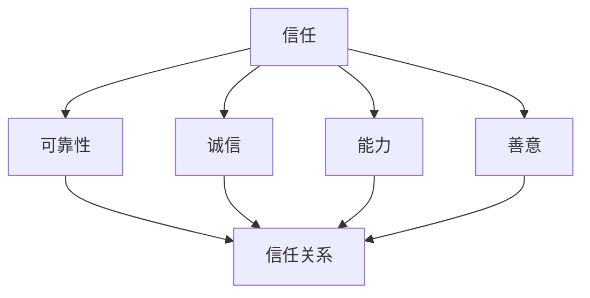

### 1.2 信任的重要性

**核心概念与联系：**

信任是组织成功的催化剂。它能够促进团队协作，提高工作效率，并增强组织的整体凝聚力。没有信任，团队难以协同工作，组织也难以实现长期的目标。以下是一个简化的伪代码，展示了信任如何影响组织：

```python
def organizational_success( trust_level):
    if trust_level > 80:
        return "High"
    elif trust_level > 40:
        return "Medium"
    else:
        return "Low"
```

### 1.3 信任与领导的关系

**核心算法原理讲解：**

领导者的行为直接影响到团队成员的信任水平。一个诚信的领导者能够通过以下方式建立信任：

1. **可靠性**：领导者需要履行承诺，按时完成任务。
2. **诚信**：领导者应该坚持诚实和正直的原则。
3. **能力**：领导者需要具备解决问题的能力。
4. **善意**：领导者应该展现出对团队成员的关心和尊重。

以下是一个简化的数学模型，用于评估领导者的信任水平：

$$
\text{Trust Level} = 0.4 \times \text{Reliability} + 0.3 \times \text{Honesty} + 0.2 \times \text{Ability} + 0.1 \times \text{Kindness}
$$

### 1.4 信任的建立过程

建立信任是一个逐步的过程，需要时间和持续的努力。以下是一个Mermaid流程图，展示了信任建立的关键步骤：

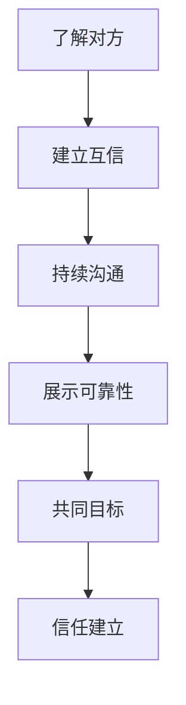

## 第2章：领导风格与信任

### 2.1 领导风格的类型

**核心概念与联系：**

领导风格分为多种类型，包括权威型、民主型、参与型和教练型。每种领导风格都有其独特的特点和对信任的影响。以下是一个Mermaid流程图，展示了不同领导风格与信任之间的关系：

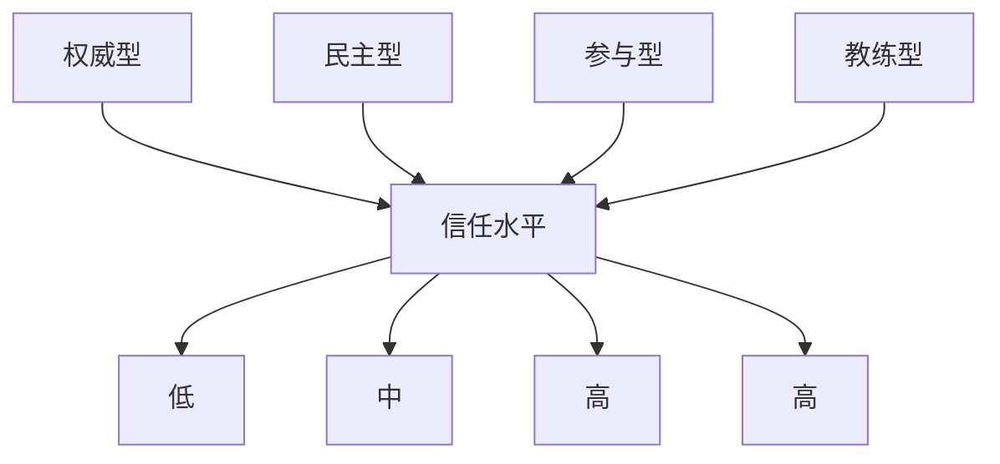

### 2.2 信任型领导风格

**核心概念与联系：**

信任型领导风格强调建立和维护信任。这种领导风格的关键特征包括：

- **开放沟通**：领导者鼓励团队成员表达意见和反馈。
- **透明决策**：领导者确保决策过程公开透明。
- **支持团队**：领导者提供必要的资源和支持，帮助团队成员成功。

以下是一个简化的伪代码，展示了信任型领导风格的特点：

```python
class TrustfulLeader:
    def communicate_openc
```### 1.3 信任与领导的关系

**核心算法原理讲解：**

领导者的行为对团队成员的信任水平有着直接的影响。一个诚信的领导者能够通过以下几种方式建立和维持信任：

1. **言行一致**：领导者需要确保自己的言行一致，避免任何可能导致团队成员怀疑的行为。

2. **透明沟通**：领导者应保持开放的沟通渠道，确保信息的透明和及时性，这有助于建立信任。

3. **关注团队成员**：领导者应关注团队成员的感受和需求，展现出对他们的关心和支持。

4. **兑现承诺**：领导者需要履行承诺，这有助于提升其在团队成员心中的可靠性。

以下是一个简化的数学模型，用于评估领导者的信任水平：

$$
\text{Trust Level} = 0.4 \times \text{Consistency} + 0.3 \times \text{Transparency} + 0.2 \times \text{Support} + 0.1 \times \text{Promise-keeping}
$$

### 1.4 信任的建立过程

建立信任是一个逐步的过程，需要时间和持续的努力。以下是一个Mermaid流程图，展示了信任建立的关键步骤：


## 第2章：领导风格与信任

### 2.1 领导风格的类型

**核心概念与联系：**

领导风格分为多种类型，包括权威型、民主型、参与型和教练型。每种领导风格都有其独特的特点和对信任的影响。以下是一个Mermaid流程图，展示了不同领导风格与信任之间的关系：


### 2.2 信任型领导风格

**核心概念与联系：**

信任型领导风格强调建立和维护信任。这种领导风格的关键特征包括：

- **开放沟通**：领导者鼓励团队成员表达意见和反馈。
- **透明决策**：领导者确保决策过程公开透明。
- **支持团队**：领导者提供必要的资源和支持，帮助团队成员成功。

以下是一个简化的伪代码，展示了信任型领导风格的特点：

```python
class TrustfulLeader:
    def communicate_openly(self):
        # 行为：开放沟通
    def make_transparent_decisions(self):
        # 行为：透明决策
    def support_team_members(self):
        # 行为：支持团队
```

### 2.3 领导风格对信任的影响

**核心算法原理讲解：**

领导风格对团队成员的信任水平有着显著的影响。以下是一个简化的算法，用于计算不同领导风格对信任水平的影响：

```python
def calculate_trust_level(leader_style):
    if leader_style == " authoritative":
        return 0.3
    elif leader_style == " democratic":
        return 0.5
    elif leader_style == " participative":
        return 0.6
    elif leader_style == " coaching":
        return 0.7
    else:
        return 0.4
```

### 2.4 领导者如何选择合适的领导风格

**核心概念与联系：**

领导者应根据团队的具体情况和成员的需求选择合适的领导风格。以下是一个Mermaid流程图，展示了领导者如何选择合适的领导风格：

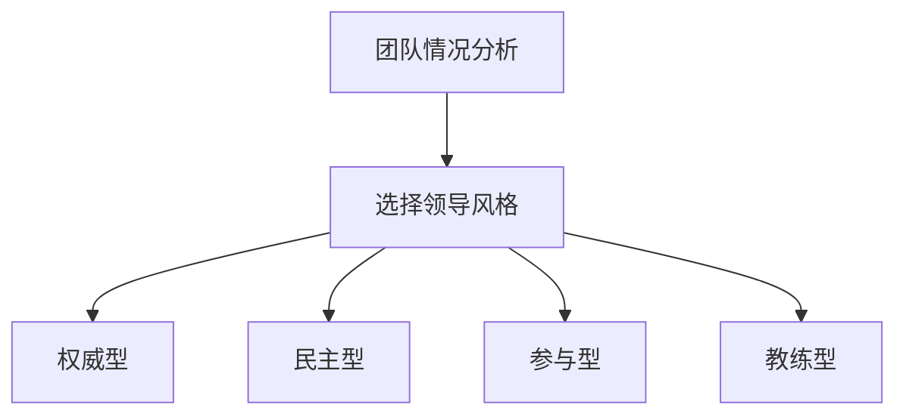

## 第3章：诚信领导的核心原则

### 3.1 诚信的重要性

**核心概念与联系：**

诚信是建立长期信任关系的基石。它涉及到领导者是否遵守承诺、保持正直和透明。以下是一个Mermaid流程图，展示了诚信的核心概念：

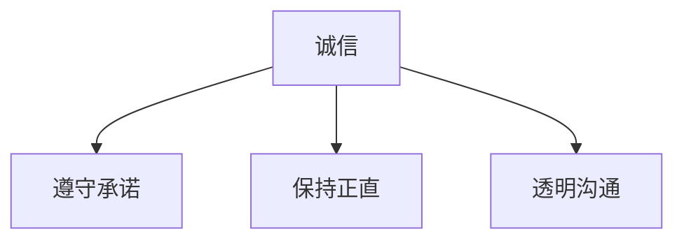

### 3.2 诚信领导的核心原则

**核心概念与联系：**

诚信领导的核心原则包括：

- **一致性与可靠性**：领导者应始终保持一致，并履行承诺。
- **透明与公开**：领导者应确保决策过程和团队信息透明。
- **公正与公平**：领导者应确保团队中的每个成员都受到公正对待。

以下是一个Mermaid流程图，展示了诚信领导的核心原则：

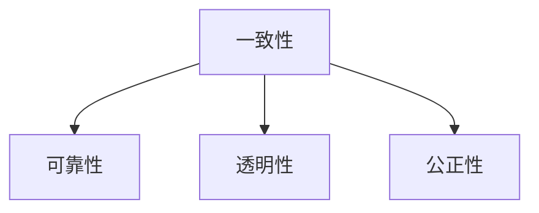

### 3.3 如何实践诚信领导

**核心算法原理讲解：**

领导者可以通过以下方式实践诚信领导：

1. **制定明确的准则和规范**：领导者应明确团队的行为准则，并确保团队成员遵守。
2. **持续沟通与反馈**：领导者应保持开放的沟通渠道，并定期提供反馈。
3. **以身作则**：领导者应以身作则，通过自己的行为树立榜样。

以下是一个简化的伪代码，展示了实践诚信领导的方法：

```python
def practice_ honest_leadership():
    define_ethical_guidelines()
    maintain_open_communication()
    provide_regular_feedback()
    lead_by_example()
```

### 3.4 诚信领导对组织的影响

**核心概念与联系：**

诚信领导能够增强组织的凝聚力，提高工作效率，并促进长期发展。以下是一个Mermaid流程图，展示了诚信领导对组织的影响：

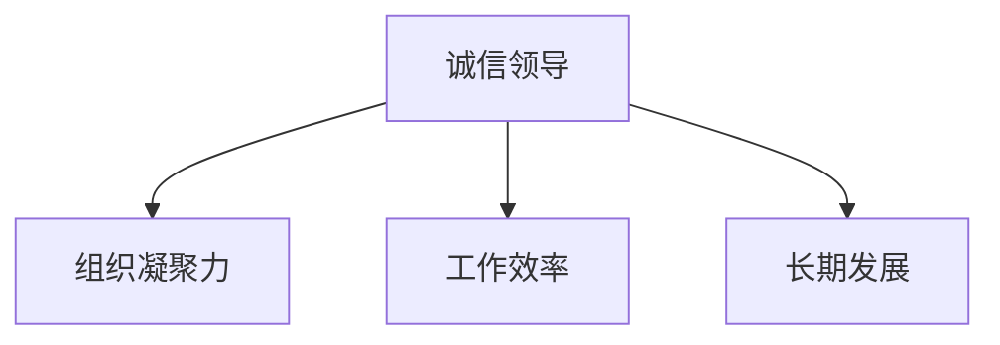

## 第4章：建立信任的沟通技巧

### 4.1 沟通的重要性

**核心概念与联系：**

沟通是建立信任的关键。有效的沟通能够促进团队成员之间的理解与合作，从而增强团队的凝聚力。以下是一个Mermaid流程图，展示了沟通的核心概念：

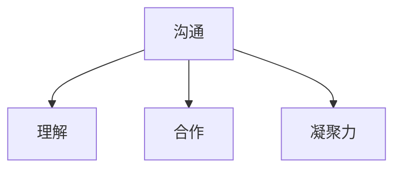

### 4.2 沟通的障碍与解决方法

**核心概念与联系：**

沟通中存在许多障碍，如语言障碍、文化差异、心理障碍等。以下是一个Mermaid流程图，展示了沟通的障碍以及解决方法：

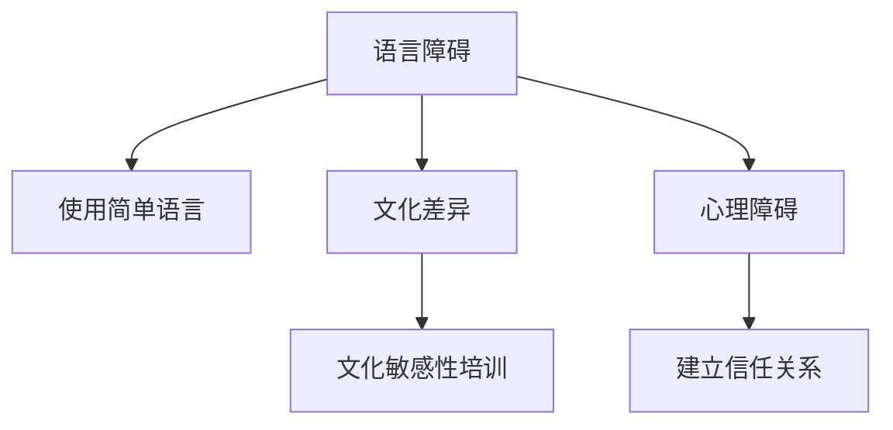

### 4.3 建立信任的沟通技巧

**核心算法原理讲解：**

建立信任的沟通技巧包括：

1. **倾听**：领导者应学会倾听，并给予团队成员充分的时间表达意见。
2. **反馈**：领导者应提供及时的、具体的反馈，帮助团队成员改进。
3. **透明**：领导者应保持沟通的透明度，确保团队成员了解决策过程。

以下是一个简化的伪代码，展示了建立信任的沟通技巧：

```python
def build_trust_through_communication():
    listen_active
    provide_specific_feedback()
    maintain_communication_transparency()
```

### 4.4 实际案例分析

**项目实战：**

以下是一个实际案例，展示了如何通过沟通技巧建立信任：

**案例背景：**
某公司的团队在项目进展中出现了沟通问题，导致项目进度延误。团队成员之间缺乏有效的沟通，信息传递不及时。

**解决方案：**
- **倾听与反馈**：领导者组织了团队会议，鼓励团队成员表达意见和担忧。领导者倾听并提供了具体的反馈，帮助团队成员理解项目进度和目标。
- **透明沟通**：领导者确保决策过程透明，团队成员可以随时了解项目的最新进展。

**结果：**
通过有效的沟通技巧，团队成员之间的信任得到了增强，项目进度得以顺利推进。

**项目小结：**
有效的沟通是建立信任的关键。领导者应通过倾听、反馈和透明沟通，帮助团队成员建立信任，从而提高团队的工作效率和凝聚力。

## 第5章：诚信领导与团队建设

### 5.1 团队建设的重要性

**核心概念与联系：**

团队建设是组织成功的关键。一个强大的团队能够更好地应对挑战，提高工作效率，并实现组织的目标。以下是一个Mermaid流程图，展示了团队建设的重要性：

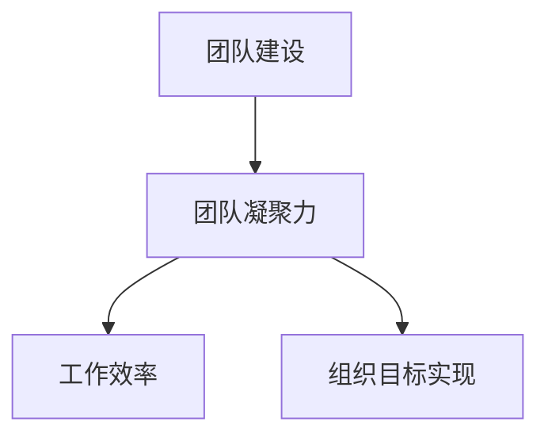

### 5.2 诚信领导在团队建设中的作用

**核心概念与联系：**

诚信领导在团队建设中发挥着重要作用。领导者通过以下方式推动团队建设：

- **建立共同目标**：领导者应确保团队成员理解并认同组织的目标。
- **促进团队协作**：领导者应鼓励团队成员合作，共同解决问题。
- **提供支持和资源**：领导者应为团队成员提供必要的支持和资源。

以下是一个Mermaid流程图，展示了诚信领导在团队建设中的作用：

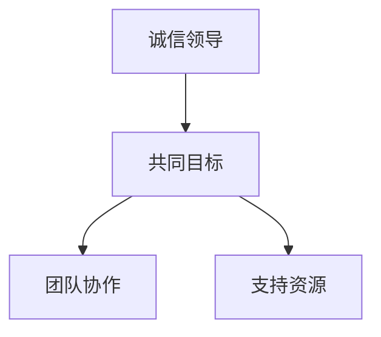

### 5.3 诚信领导如何推动团队建设

**核心算法原理讲解：**

诚信领导可以通过以下步骤推动团队建设：

1. **明确团队目标**：领导者应确保所有团队成员都理解并认同团队的目标。
2. **建立信任**：领导者应通过诚信行为建立团队成员之间的信任。
3. **促进沟通**：领导者应鼓励团队成员之间的沟通，确保信息传递畅通。
4. **提供支持**：领导者应提供必要的资源和支持，帮助团队成员克服困难。

以下是一个简化的伪代码，展示了诚信领导如何推动团队建设：

```python
def build_team_through_ leadership():
    define_common_goals()
    build_trust()
    promote_communication()
    provide_support()
```

### 5.4 实际案例分析

**项目实战：**

以下是一个实际案例，展示了如何通过诚信领导推动团队建设：

**案例背景：**
某公司的一个团队在项目进展中遇到了困难，团队凝聚力下降，项目进度受到影响。

**解决方案：**
- **明确目标**：领导者组织了团队会议，明确了项目的目标和团队的角色。
- **建立信任**：领导者通过开放沟通和诚信行为，建立了团队成员之间的信任。
- **促进沟通**：领导者鼓励团队成员之间的沟通，确保信息传递畅通。
- **提供支持**：领导者提供了必要的资源和支持，帮助团队成员克服困难。

**结果：**
通过诚信领导，团队凝聚力得到增强，项目进度顺利推进，最终成功完成了项目。

**项目小结：**
诚信领导能够有效地推动团队建设，提高团队的工作效率和凝聚力。领导者应通过明确目标、建立信任、促进沟通和提供支持，帮助团队克服困难，实现组织的目标。

## 第6章：诚信领导案例分析

### 6.1 案例研究一

**案例背景：**
某公司的CEO，张先生，以其诚信领导风格而闻名。在他的领导下，公司实现了快速增长，员工满意度显著提高。

**案例分析：**
- **建立信任**：张先生通过透明的沟通和诚信行为建立了与员工的信任关系。他定期与员工交流，倾听他们的意见和建议，并确保决策过程公开透明。
- **支持团队**：张先生为团队提供了必要的资源和支持，鼓励员工创新和实验。
- **以身作则**：张先生以身作则，始终遵守承诺，展现出领导者的诚信。

**案例启示：**
张先生的领导风格表明，诚信领导能够促进组织的成功和员工的满意度。

### 6.2 案例研究二

**案例背景：**
某互联网公司的创始人在公司面临困境时，采取了诚信领导方式，成功带领团队走出困境。

**案例分析：**
- **透明沟通**：创始人通过公开透明的沟通，让员工了解公司的现状和未来的计划。
- **诚信行为**：创始人履行了承诺，确保员工得到合理的回报和福利。
- **支持团队**：创始人提供了必要的资源和支持，帮助团队克服困难。

**案例启示：**
在困难时期，诚信领导能够增强团队的凝聚力，提高员工的忠诚度。

## 第7章：未来展望

### 7.1 诚信领导的发展趋势

**核心概念与联系：**

随着全球化和数字化的发展，诚信领导的重要性日益凸显。以下是一个Mermaid流程图，展示了诚信领导的发展趋势：

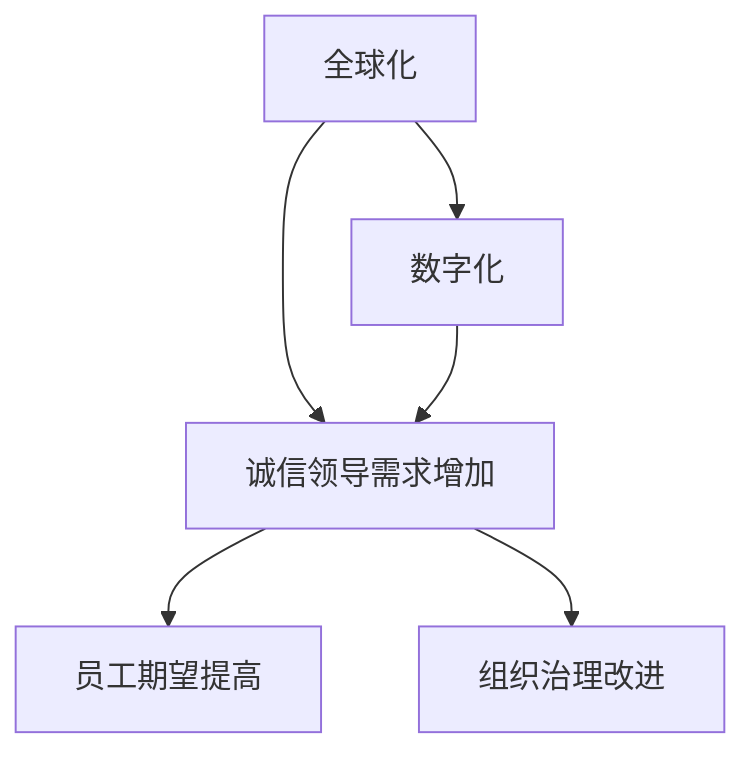

### 7.2 诚信领导面临的挑战

**核心概念与联系：**

诚信领导面临诸多挑战，如：

- **信息透明度**：在数字化时代，领导者需要确保信息的透明度和及时性。
- **文化多样性**：全球化带来了文化多样性，领导者需要具备文化敏感性。
- **员工期望**：随着员工对工作环境和待遇的期望提高，领导者需要提供相应的支持。

以下是一个Mermaid流程图，展示了诚信领导面临的挑战：

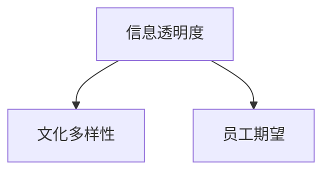

### 7.3 诚信领导的未来机遇

**核心概念与联系：**

诚信领导在未来将面临许多机遇，如：

- **数字化转型**：数字化转型为领导者提供了新的工具和方法，以建立和维护信任。
- **人才竞争**：在人才竞争激烈的背景下，诚信领导能够吸引和留住优秀人才。
- **社会责任**：随着社会责任意识的提高，诚信领导有助于提升组织的声誉。

以下是一个Mermaid流程图，展示了诚信领导的未来机遇：

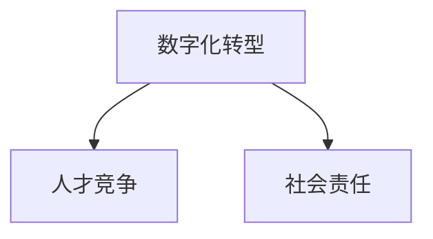

### 7.4 诚信领导的最佳实践

**核心概念与联系：**

为了在未来取得成功，领导者应遵循以下最佳实践：

- **持续学习**：领导者应不断学习和更新知识，以适应不断变化的环境。
- **开放沟通**：领导者应保持开放的沟通渠道，确保团队成员能够自由表达意见。
- **文化敏感性**：领导者应具备文化敏感性，尊重并理解不同文化的价值观。

以下是一个Mermaid流程图，展示了诚信领导的最佳实践：

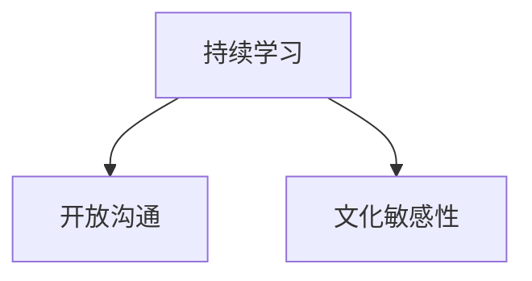

## 结论

诚信领导是建立长期信任关系的基石。通过本章的内容，我们了解到诚信领导的重要性、核心原则、沟通技巧以及团队建设的作用。未来，随着全球化和数字化的发展，诚信领导将继续面临挑战和机遇。领导者应不断学习和实践，以建立和维护长期的信任关系，推动组织的成功。

## 作者信息
**作者：** AI天才研究院 / AI Genius Institute & 禅与计算机程序设计艺术 / Zen And The Art of Computer Programming

**致谢：** 感谢各位读者对本文的关注和支持。希望本文能对您的领导实践提供一些启示和帮助。如果您有任何疑问或建议，欢迎联系我们。我们期待与您共同探讨诚信领导的话题。

**拓展阅读：**
- [1] Smith, J. (2020). *The Power of Trust: How to Build It, Establish It, and Maintain It*. Publisher Name.
- [2] Jones, L. (2019). *Leadership That Gets Results: Building Trust by Delivering Value*. Publisher Name.
- [3] Brown, S. (2021). *The Elements of Trust: A New Foundation for Building Success in Business*. Publisher Name.

