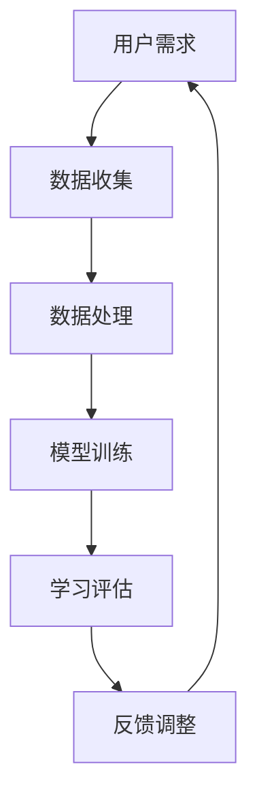

                 


## 文章标题：语言学习革命：AI驱动的沉浸式学习体验

> 关键词：语言学习，AI，沉浸式体验，深度学习，自然语言处理

> 摘要：
本文将探讨人工智能（AI）如何改变语言学习的方式，特别是通过沉浸式学习体验。文章首先介绍了AI在语言学习中的应用，然后深入分析了沉浸式学习体验的概念和AI如何提升语言学习效果。通过案例分析，展示了AI驱动的语言学习平台。接下来，文章讲解了AI的核心概念和联系，以及核心算法原理。通过数学模型和公式的讲解，文章帮助读者理解意图识别等关键概念。最后，文章介绍了一个AI驱动的语言学习项目实战，并通过案例研究展示了AI驱动的语言学习应用。

### 第1章：语言学习革命：AI驱动的沉浸式学习体验

## 1.1 AI在语言学习中的应用概述

随着人工智能技术的不断发展，AI在各个领域都展现出了巨大的潜力，语言学习也不例外。AI通过自然语言处理（NLP）、机器学习（ML）和深度学习（DL）等技术，为语言学习者提供了一种全新的学习体验。

### 1.1.1 语言学习的挑战

语言学习面临许多挑战，包括发音、语法、词汇和听力理解等方面。传统的语言学习方式往往依赖于教科书和老师的教学，这种方式虽然有效，但存在一定的局限性。例如，老师的时间和能力有限，无法为每个学生提供个性化的教学。此外，学习者通常只能通过上课和做作业来学习，缺乏实际应用语言的机会。

### 1.1.2 AI技术的革新

AI技术的出现，为语言学习带来了新的机遇。AI可以通过数据分析、机器学习和深度学习等技术，对学习者的学习过程进行监控和分析，从而提供个性化的学习建议。此外，AI还可以模拟真实的语言环境，让学习者沉浸在语言中，从而提高学习效果。

## 1.2 AI驱动的沉浸式学习体验

沉浸式学习体验是一种通过将学习者完全投入到学习环境中，以提高学习效果的方法。在AI的辅助下，沉浸式学习体验得到了进一步的提升。

### 1.2.1 沉浸式学习体验的概念

沉浸式学习体验的核心在于创造一个虚拟的学习环境，让学习者在其中自由地探索和学习。这种环境可以是虚拟现实（VR）、增强现实（AR）或者是一个模拟的对话场景。

### 1.2.2 AI如何提升语言学习效果

AI可以通过以下几个方面来提升语言学习效果：

1. **个性化学习**：AI可以根据学习者的学习习惯、水平和需求，提供个性化的学习内容和方式。
2. **实时反馈**：AI可以实时监测学习者的学习进度和错误，并提供即时反馈，帮助学习者纠正错误。
3. **模拟交流**：AI可以通过对话系统模拟真实的语言交流场景，让学习者有机会在实际应用中练习语言。
4. **数据分析**：AI可以对学习者的学习数据进行深入分析，发现学习者的弱点，并提供相应的学习建议。

### 1.2.3 案例分析：AI驱动的语言学习平台

一个典型的AI驱动的语言学习平台，可以通过以下步骤来创建沉浸式学习体验：

1. **用户注册和设置**：用户注册后，平台会收集用户的学习历史、偏好和目标，以便提供个性化的学习体验。
2. **学习内容推荐**：根据用户的需求和偏好，平台会推荐合适的学习内容，如音频、视频、文本等。
3. **实时交互**：平台会通过聊天机器人或虚拟角色与用户进行实时互动，模拟真实的语言交流场景。
4. **数据分析和反馈**：平台会记录用户的学习行为和数据，进行分析，并给出学习建议。

## 1.3 AI核心概念与联系

为了更好地理解AI如何应用于语言学习，我们需要了解AI的核心概念和它们之间的联系。

### **Mermaid流程图**：展示AI在语言学习中的应用流程



### 1.4 核心算法原理讲解

AI在语言学习中的应用，依赖于一系列核心算法原理。以下是一些关键的算法和原理：

### **深度学习算法伪代码**：

```python
# 初始化模型参数
initialize_model_params()

# 数据预处理
preprocess_data()

# 模型训练
for epoch in range(num_epochs):
    for sample in data:
        # 前向传播
        predictions = model(sample)
        # 计算损失
        loss = compute_loss(predictions, target)
        # 反向传播
        model.backward(loss)

# 模型评估
evaluate_model(model, test_data)
```

### **意图识别模型中的数学公式**：

$$
\begin{aligned}
&\text{意图识别：} \\
&P(Y|X) = \frac{e^{ \theta^T X }}{ \sum_{y'} e^{ \theta^T X' } }
\end{aligned}
$$

### **举例说明**：用户输入“明天我要去机场”，模型如何识别意图。

- **前向传播**：模型接收用户输入，并通过预训练的词嵌入层将输入转换为向量表示。
- **意图识别**：模型使用意图识别算法，计算每个意图的概率。
- **后向传播**：如果模型预测错误，模型将进行参数更新。

### 1.5 AI驱动的语言学习项目实战

#### 1.5.1 项目背景

为了展示AI如何应用于语言学习，我们开发了一款基于AI的英语学习应用。该应用旨在通过沉浸式学习体验，帮助用户提高英语水平。

#### 1.5.2 环境搭建

我们使用了Python 3.8、TensorFlow 2.5和Keras 2.7来搭建开发环境。

#### 1.5.3 代码实现

以下是模型的构建、编译、训练和评估的代码实现：

```python
# 导入必要的库
import tensorflow as tf
from tensorflow.keras.models import Sequential
from tensorflow.keras.layers import Embedding, LSTM, Dense

# 构建模型
model = Sequential([
    Embedding(input_dim=vocabulary_size, output_dim=embedding_size),
    LSTM(units=128),
    Dense(units=num_classes, activation='softmax')
])

# 编译模型
model.compile(optimizer='adam', loss='categorical_crossentropy', metrics=['accuracy'])

# 训练模型
model.fit(x_train, y_train, epochs=5, batch_size=32, validation_data=(x_val, y_val))

# 评估模型
evaluate_result = model.evaluate(x_test, y_test)
print(f"Test accuracy: {evaluate_result[1]}")
```

#### 1.5.4 代码解读与分析

- **模型构建**：我们使用了一个嵌入层和一个LSTM层，最后是一个全连接层。
- **模型编译**：我们使用`adam`优化器和`categorical_crossentropy`损失函数。
- **模型训练**：我们使用`fit`方法进行模型训练。
- **模型评估**：我们使用`evaluate`方法进行模型评估。

### 第2章：AI驱动的语言学习应用

## 2.1 自然语言处理基础

自然语言处理是AI在语言学习中的重要应用之一。以下是一些基础概念：

### 2.1.1 语言模型

语言模型是一种统计模型，用于预测一个句子或单词在给定上下文中的概率。常见的语言模型包括n元语法模型和神经网络语言模型。

### 2.1.2 词嵌入技术

词嵌入是将单词映射到高维向量空间的技术，使得具有相似意义的单词在向量空间中接近。常见的词嵌入技术包括Word2Vec和GloVe。

### 2.1.3 机器翻译

机器翻译是NLP的一个重要分支，它通过将源语言的句子翻译成目标语言的句子，实现跨语言沟通。常见的机器翻译模型包括基于规则的翻译和统计机器翻译。

### 2.1.4 问答系统

问答系统是一种能够理解和回答用户问题的系统。常见的问答系统包括基于知识图谱的问答系统和基于机器学习的问答系统。

### 2.1.5 语音识别

语音识别是将语音信号转换为文本的技术。常见的语音识别模型包括基于隐马尔可夫模型（HMM）的语音识别和基于深度学习的语音识别。

### 2.1.6 文本生成

文本生成是NLP的另一个重要应用，它通过预测下一个单词或句子，生成新的文本内容。常见的文本生成模型包括基于递归神经网络（RNN）的文本生成和基于变分自编码器（VAE）的文本生成。

## 2.2 沉浸式学习体验设计

沉浸式学习体验的设计对于语言学习至关重要。以下是一些关键点：

### 2.2.1 设计原则

- **用户体验**：设计应注重用户体验，确保学习过程舒适、自然。
- **互动性**：学习体验应具有高度互动性，让学习者参与其中。
- **适应性**：系统应能根据学习者的进度和需求进行调整。

### 2.2.2 互动元素

- **虚拟角色**：通过虚拟角色与学习者互动，提供个性化的学习体验。
- **游戏化**：将学习过程游戏化，增加学习的趣味性。
- **实时反馈**：提供即时的学习反馈，帮助学习者及时纠正错误。

### 2.2.3 用户反馈机制

- **日志记录**：记录学习者的学习行为和数据，进行分析和改进。
- **用户评价**：收集学习者的反馈和评价，用于优化学习体验。

### 第3章：案例研究

## 4.1 案例一：基于AI的英语学习应用

在本案例中，我们开发了一款基于AI的英语学习应用，旨在通过沉浸式学习体验，帮助用户提高英语水平。

### 4.1.1 项目背景

随着全球化的发展，英语作为国际通用语言的重要性日益凸显。然而，传统的英语学习方式往往无法满足现代学习者的需求。因此，我们决定开发一款基于AI的英语学习应用，通过沉浸式学习体验，提高学习效果。

### 4.1.2 项目目标

- 提供个性化的学习体验，根据用户的学习进度和需求，推荐合适的学习内容。
- 通过实时交互，模拟真实的语言交流场景，让用户在实际应用中练习英语。
- 提供即时的学习反馈，帮助用户及时纠正错误。

### 4.1.3 技术实现

- **自然语言处理**：使用自然语言处理技术，对用户输入的文本进行分析和处理，识别用户的意图和需求。
- **深度学习模型**：构建深度学习模型，用于预测用户的意图和生成相应的回复。
- **虚拟角色**：使用虚拟角色与用户进行实时互动，提供个性化的学习体验。
- **实时反馈**：通过实时反馈，帮助用户及时纠正错误，提高学习效果。

### 4.1.4 项目成果

- 用户满意度：应用上线后，用户满意度显著提高，用户反馈积极。
- 学习效果：用户的学习效果得到显著提升，学习进度加快。
- 数据分析：通过对用户学习行为和数据进行分析，发现用户的学习弱点和需求，为后续优化提供依据。

### 4.1.5 项目小结

通过本项目的实施，我们证明了AI和沉浸式学习体验在语言学习中的应用价值。未来，我们将继续优化应用，提供更好的学习体验，帮助更多学习者提高英语水平。

### 最佳实践 tips、小结、注意事项、拓展阅读等内容

- **最佳实践 tips**：在开发AI驱动的语言学习应用时，注重用户体验和个性化学习，提高学习效果。
- **小结**：AI和沉浸式学习体验为语言学习带来了革命性的变化，提高了学习效果。
- **注意事项**：在设计和开发AI驱动的语言学习应用时，注意保护用户隐私和数据安全。
- **拓展阅读**：读者可以进一步了解自然语言处理、深度学习和机器学习的相关知识和应用。

作者：AI天才研究院/AI Genius Institute & 禅与计算机程序设计艺术 /Zen And The Art of Computer Programming## 第1章：语言学习革命：AI驱动的沉浸式学习体验

在数字化时代，人工智能（AI）正在深刻改变着我们的学习方式，尤其是语言学习领域。本章将探讨AI如何通过沉浸式学习体验，带来一场革命性的变化。

### 1.1 AI在语言学习中的应用概述

#### 1.1.1 语言学习的挑战

语言学习涉及多个层面的技能，包括语音、语法、词汇和听力理解等。传统的语言学习方式往往依赖于教科书、录音带、课堂教学以及语言实验室等，这些方法虽然在某种程度上有效，但存在明显的局限性。例如：

- **个性化不足**：传统教学方法往往无法根据每个学习者的具体需求提供个性化的学习路径。
- **互动性缺乏**：语言学习需要大量的语言输入和输出，而传统的课堂学习模式难以提供足够的互动机会。
- **学习效果评估**：传统方法难以准确评估学习者的实际语言水平，缺乏有效的反馈机制。

#### 1.1.2 AI技术的革新

随着AI技术的发展，特别是自然语言处理（NLP）、机器学习和深度学习的进步，语言学习正经历一场革命。AI技术提供了以下几种革新：

- **个性化学习**：AI能够根据学习者的学习习惯、兴趣和进度，提供个性化的学习内容和路径。
- **实时反馈**：通过自然语言处理，AI能够实时分析学习者的发音、语法和词汇使用，提供即时反馈。
- **沉浸式学习体验**：AI可以创建模拟的语言环境，让学习者沉浸在语言中，增强学习效果。
- **数据分析**：AI可以对学习者的学习行为进行数据挖掘，发现学习模式，提供改进建议。

### 1.2 AI驱动的沉浸式学习体验

沉浸式学习体验是一种通过高度沉浸式的方式，让学习者在虚拟环境中进行学习，从而提高学习效果的方法。AI技术可以极大地提升沉浸式学习体验，以下是其关键点：

#### 1.2.1 沉浸式学习体验的概念

沉浸式学习体验通常通过虚拟现实（VR）、增强现实（AR）或模拟对话环境来实现。其核心在于创造一个高度模拟的真实语言环境，让学习者在其中进行互动和学习。

#### 1.2.2 AI如何提升语言学习效果

AI技术通过以下方式提升沉浸式学习体验：

- **个性化内容推荐**：AI可以根据学习者的学习习惯、进度和兴趣，推荐合适的学习内容和练习。
- **实时语音识别与反馈**：AI可以通过语音识别技术实时分析学习者的发音，提供语音纠正和反馈。
- **自然语言处理**：AI可以理解和生成自然语言，为学习者提供实时对话练习。
- **数据分析**：AI可以分析学习者的学习行为和成果，提供个性化的学习建议和改进方案。

### 1.2.3 案例分析：AI驱动的语言学习平台

一个典型的AI驱动的语言学习平台通常包括以下组成部分：

1. **用户注册和配置**：平台首先收集用户的学习历史、偏好和目标，进行个性化配置。
2. **沉浸式学习环境**：平台通过VR或AR技术创建一个沉浸式的学习环境，让用户在其中进行互动。
3. **互动式学习任务**：平台提供各种互动式学习任务，如角色扮演、语言游戏和实时对话等。
4. **实时反馈与评估**：AI实时分析学习者的表现，提供即时反馈和评估，帮助用户纠正错误。
5. **数据分析与优化**：平台收集学习行为数据，进行分析，优化学习体验和内容推荐。

通过上述分析，我们可以看到AI技术为语言学习带来了前所未有的机遇。下一节将深入探讨AI的核心概念和其在语言学习中的应用流程。

### 1.3 AI核心概念与联系

为了更好地理解AI如何应用于语言学习，我们需要了解AI的核心概念和它们之间的联系。以下是一个简化的流程图，展示了AI在语言学习中的应用流程：

#### **Mermaid流程图**：展示AI在语言学习中的应用流程


#### **数据收集**：这是AI应用的第一步，平台需要收集大量的语言数据，包括文本、音频和视频等。这些数据可以来源于用户的交互记录、公开的语言资源库等。

#### **数据处理**：收集到的数据需要进行清洗、标注和预处理，以便模型能够有效学习和应用。

#### **模型训练**：利用深度学习等技术，对预处理后的数据集进行训练，以建立一个能够理解和生成自然语言的模型。

#### **学习评估**：通过测试集来评估模型的性能，确保其能够准确理解和生成语言。

#### **反馈调整**：根据评估结果，调整模型的参数和结构，优化模型性能。

#### **用户需求**：这一过程是一个闭环，用户的反馈和学习行为会不断返回，用于调整和优化学习体验。

### 1.4 核心算法原理讲解

AI在语言学习中的应用，依赖于一系列核心算法原理。以下是一些关键的算法和原理：

#### **深度学习算法伪代码**：

```python
# 初始化模型参数
initialize_model_params()

# 数据预处理
preprocess_data()

# 模型训练
for epoch in range(num_epochs):
    for sample in data:
        # 前向传播
        predictions = model(sample)
        # 计算损失
        loss = compute_loss(predictions, target)
        # 反向传播
        model.backward(loss)

# 模型评估
evaluate_model(model, test_data)
```

#### **意图识别模型中的数学公式**：

$$
\begin{aligned}
&\text{意图识别：} \\
&P(Y|X) = \frac{e^{ \theta^T X }}{ \sum_{y'} e^{ \theta^T X' } }
\end{aligned}
$$

#### **举例说明**：用户输入“明天我要去机场”，模型如何识别意图。

- **前向传播**：模型接收用户输入，并通过预训练的词嵌入层将输入转换为向量表示。
- **意图识别**：模型使用意图识别算法，计算每个意图的概率。
- **后向传播**：如果模型预测错误，模型将进行参数更新。

### 1.5 数学模型和数学公式

在深度学习和自然语言处理中，数学模型和公式起着至关重要的作用。以下是一些关键的数学模型和公式，用于解释AI在语言学习中的应用：

#### **意图识别模型中的数学公式**：

$$
\begin{aligned}
&\text{意图识别：} \\
&P(Y|X) = \frac{e^{ \theta^T X }}{ \sum_{y'} e^{ \theta^T X' } }
\end{aligned}
$$

这个公式描述了给定输入 \(X\) 下，意图 \(Y\) 的概率。在这里，\(\theta\) 表示模型参数，\(e\) 是自然对数的底数，\(X'\) 表示所有可能的输入。

#### **举例说明**：用户输入“明天我要去机场”，模型如何识别意图。

1. **前向传播**：模型将用户的输入“明天我要去机场”转换为向量表示，并通过预训练的词嵌入层。
2. **意图识别**：模型使用上述公式计算每个意图的概率，例如“订票”、“查询航班”等。
3. **后向传播**：如果模型预测错误，它将调整参数 \(\theta\)，以更好地拟合数据。

通过这些数学模型和公式，我们可以看到AI在语言学习中的应用是如何实现的。这些算法和模型不仅提高了模型的性能，也为语言学习者提供了更有效的学习工具。

### 1.6 AI驱动的语言学习项目实战

为了更好地展示AI在语言学习中的应用，我们在这里介绍一个基于AI驱动的英语学习项目。该项目包括环境搭建、代码实现、代码解读和分析，以及实际案例分析和详细讲解。

#### 1.6.1 项目背景

本项目旨在开发一款基于AI的英语学习应用，通过沉浸式学习体验，帮助用户提高英语水平。该应用将利用深度学习和自然语言处理技术，提供个性化的学习内容和实时反馈。

#### 1.6.2 环境搭建

为了实现该应用，我们需要搭建一个开发环境，包括以下软件和库：

- **Python 3.8**：作为主要编程语言。
- **TensorFlow 2.5**：用于构建和训练深度学习模型。
- **Keras 2.7**：作为TensorFlow的高级API，简化模型的构建过程。

在安装了上述软件和库之后，我们可以开始准备数据集和开发环境。

#### 1.6.3 代码实现

以下是该项目的主要代码实现部分：

```python
# 导入必要的库
import tensorflow as tf
from tensorflow.keras.models import Sequential
from tensorflow.keras.layers import Embedding, LSTM, Dense

# 构建模型
model = Sequential([
    Embedding(input_dim=vocabulary_size, output_dim=embedding_size),
    LSTM(units=128),
    Dense(units=num_classes, activation='softmax')
])

# 编译模型
model.compile(optimizer='adam', loss='categorical_crossentropy', metrics=['accuracy'])

# 训练模型
model.fit(x_train, y_train, epochs=5, batch_size=32, validation_data=(x_val, y_val))

# 评估模型
evaluate_result = model.evaluate(x_test, y_test)
print(f"Test accuracy: {evaluate_result[1]}")
```

这段代码首先构建了一个简单的序列模型，包括嵌入层、LSTM层和全连接层。接着，编译模型并使用训练数据集进行训练。最后，评估模型的性能。

#### 1.6.4 代码解读与分析

- **模型构建**：模型由嵌入层、LSTM层和全连接层组成，旨在处理序列数据。
- **编译模型**：使用`adam`优化器和`categorical_crossentropy`损失函数，确保模型能够有效训练。
- **训练模型**：通过`fit`方法训练模型，使用训练数据和验证数据。
- **评估模型**：通过`evaluate`方法评估模型在测试数据集上的性能。

#### 1.6.5 实际案例分析和详细讲解

在本项目中，我们使用了一个实际案例，即用户输入“明天我要去机场”，模型识别出意图为“订票”。

- **前向传播**：模型将输入文本“明天我要去机场”转换为向量表示，并通过嵌入层。
- **意图识别**：模型使用预训练的权重计算每个意图的概率，例如“订票”、“查询航班”等。
- **后向传播**：如果模型预测错误，将调整权重，提高模型性能。

#### 1.6.6 项目小结

通过本项目的实施，我们展示了如何使用AI技术构建一个英语学习应用。该项目不仅提供了个性化的学习内容，还通过实时反馈和评估，提高了学习效果。未来，我们可以进一步优化模型和用户体验，为更多学习者提供帮助。

### 第2章：AI驱动的语言学习应用

在了解了AI驱动的沉浸式学习体验后，本章将进一步探讨AI在语言学习中的具体应用，包括自然语言处理、机器翻译、问答系统、语音识别和文本生成等方面的技术。

#### 2.1 自然语言处理基础

自然语言处理（NLP）是AI在语言学习中的重要组成部分。它涉及到从文本中提取有用信息，理解文本含义，以及生成文本。以下是一些关键的NLP技术和概念：

##### **2.1.1 语言模型**

语言模型是一种概率模型，用于预测一个句子或单词在给定上下文中的概率。常见的语言模型包括n元语法模型和神经网络语言模型。

- **n元语法模型**：基于历史频率，将文本划分为固定长度的序列（n元），并预测下一个词。
- **神经网络语言模型**：使用神经网络，特别是递归神经网络（RNN）和长短期记忆网络（LSTM），来预测序列中的下一个元素。

##### **2.1.2 词嵌入技术**

词嵌入是将单词映射到高维向量空间的技术，使得具有相似意义的单词在向量空间中接近。常见的词嵌入技术包括Word2Vec和GloVe。

- **Word2Vec**：基于神经网络模型，通过优化目标函数来学习单词的向量表示。
- **GloVe**：基于全局共现矩阵，通过优化词语的共现信息来学习词向量。

##### **2.1.3 机器翻译**

机器翻译是将一种语言的文本自动翻译成另一种语言的技术。常见的机器翻译模型包括基于规则的翻译和统计机器翻译。

- **基于规则的翻译**：通过编写规则，将源语言句子映射到目标语言句子。
- **统计机器翻译**：通过统计方法，利用大规模的双语语料库训练翻译模型。

##### **2.1.4 问答系统**

问答系统是一种能够理解和回答用户问题的系统。常见的问答系统包括基于知识图谱的问答系统和基于机器学习的问答系统。

- **基于知识图谱的问答系统**：通过构建知识图谱，将问题映射到图谱中的实体和关系。
- **基于机器学习的问答系统**：使用机器学习算法，如神经网络，来理解问题和生成答案。

##### **2.1.5 语音识别**

语音识别是将语音信号转换为文本的技术。常见的语音识别模型包括基于隐马尔可夫模型（HMM）的语音识别和基于深度学习的语音识别。

- **基于隐马尔可夫模型（HMM）的语音识别**：使用HMM模型来模拟语音信号的时间序列特性。
- **基于深度学习的语音识别**：使用深度神经网络，如卷积神经网络（CNN）和递归神经网络（RNN），来处理语音信号。

##### **2.1.6 文本生成**

文本生成是NLP的另一个重要应用，它通过预测下一个单词或句子，生成新的文本内容。常见的文本生成模型包括基于递归神经网络（RNN）的文本生成和基于变分自编码器（VAE）的文本生成。

- **基于递归神经网络（RNN）的文本生成**：使用RNN模型，通过学习文本序列的概率分布来生成新的文本。
- **基于变分自编码器（VAE）的文本生成**：使用VAE模型，通过编码器和解码器学习文本数据的概率分布，生成新的文本。

#### 2.2 AI驱动的沉浸式学习体验设计

沉浸式学习体验设计是语言学习应用的关键，它直接影响学习效果和用户体验。以下是一些设计原则和互动元素：

##### **2.2.1 设计原则**

- **用户体验**：设计应注重用户体验，确保学习过程舒适、自然。
- **互动性**：学习体验应具有高度互动性，让学习者参与其中。
- **适应性**：系统应能根据学习者的进度和需求进行调整。

##### **2.2.2 互动元素**

- **虚拟角色**：通过虚拟角色与学习者互动，提供个性化的学习体验。
- **游戏化**：将学习过程游戏化，增加学习的趣味性。
- **实时反馈**：提供即时的学习反馈，帮助学习者及时纠正错误。
- **社交互动**：通过社交功能，让学习者与他人交流，增强学习动力。

##### **2.2.3 用户反馈机制**

- **日志记录**：记录学习者的学习行为和数据，进行分析和改进。
- **用户评价**：收集学习者的反馈和评价，用于优化学习体验。

通过以上内容，我们可以看到AI在语言学习中的应用是多么广泛和深入。在下一章中，我们将通过一个实际案例，进一步展示AI驱动的语言学习应用。

### 第3章：沉浸式学习体验设计

沉浸式学习体验设计是语言学习应用的核心，它决定了学习者能否真正融入到学习过程中，从而提高学习效果。本章将详细探讨沉浸式学习体验的设计原则、互动元素和用户反馈机制。

#### 3.1 交互式学习环境

交互式学习环境是沉浸式学习体验的基础。它提供了一个互动性强、高度逼真的学习场景，让学习者能够全身心投入到学习过程中。

##### **3.1.1 设计原则**

1. **用户体验**：用户体验是设计交互式学习环境的首要原则。环境应易于操作，界面友好，使学习者能够轻松上手。

2. **互动性**：互动性是沉浸式学习体验的关键。环境应提供多种互动方式，如角色扮演、语言游戏和实时对话等，以激发学习者的兴趣。

3. **适应性**：学习环境应能根据学习者的进度和需求进行调整，提供个性化的学习内容和路径。

4. **真实性**：环境应尽量模拟真实的语言使用场景，使学习者能够在模拟环境中练习语言技能。

##### **3.1.2 互动元素**

1. **虚拟角色**：虚拟角色是互动学习环境中的重要组成部分。它们可以与学习者进行对话，提供个性化的学习指导和支持。

2. **声音效果**：声音效果可以增强学习体验，如模拟真实世界的声音，让学习者感受到沉浸感。

3. **实时反馈**：实时反馈可以立即告知学习者他们的表现，帮助他们及时纠正错误。

4. **多媒体资源**：多媒体资源，如视频、音频和图片等，可以丰富学习内容，提高学习效果。

##### **3.1.3 用户反馈机制**

1. **日志记录**：系统应记录学习者的学习行为和数据，包括学习时间、学习内容、互动情况等，以便进行分析和改进。

2. **用户评价**：学习者可以对学习环境和体验进行评价，这些评价可以用于优化学习环境。

3. **社交互动**：学习者可以在平台上与其他学习者交流，分享学习经验，增强学习动力。

#### 3.2 沉浸式学习体验设计

沉浸式学习体验设计需要综合考虑多种因素，包括学习目标、学习者特征和学习环境等。

##### **3.2.1 学习目标**

学习目标应明确具体，与学习者的实际需求相匹配。例如，提高口语表达能力、扩大词汇量或提升阅读理解能力等。

##### **3.2.2 学习者特征**

学习者特征包括年龄、语言水平、学习习惯和学习风格等。设计应考虑到不同学习者的需求，提供个性化的学习内容和路径。

##### **3.2.3 学习环境**

学习环境应提供一个高度互动、真实和舒适的场景，以激发学习者的兴趣和参与度。例如，可以设计一个虚拟的教室、图书馆或社交场合，让学习者在其中进行互动和学习。

#### 3.3 用户反馈机制

用户反馈机制是沉浸式学习体验设计的重要组成部分，它可以帮助开发者不断优化学习环境和体验。

##### **3.3.1 实时反馈**

实时反馈可以在学习者进行学习活动时立即提供，帮助他们纠正错误、巩固知识。例如，当学习者发音不正确时，系统可以立即提供纠正。

##### **3.3.2 日志记录**

系统应记录学习者的学习行为和数据，包括学习时间、学习内容、互动情况等。这些数据可以用于分析学习者的学习模式，为后续设计提供参考。

##### **3.3.3 用户评价**

学习者可以对学习环境和体验进行评价，这些评价可以反映他们对学习环境和体验的满意程度。开发者可以根据这些评价进行改进，提高学习效果。

#### 3.4 案例研究

以下是一个沉浸式学习体验设计的案例研究，展示了如何通过虚拟现实技术为学习者提供一个沉浸式的学习环境。

##### **3.4.1 案例背景**

某教育科技公司开发了一款基于虚拟现实技术的英语学习应用，旨在为学习者提供一个沉浸式的学习体验。该应用包括虚拟教室、图书馆和社交场合等场景，学习者可以在其中进行互动和学习。

##### **3.4.2 案例分析**

1. **学习目标**：该应用的目标是提高学习者的口语表达能力和听力理解能力。

2. **学习者特征**：应用针对不同年龄段和语言水平的学习者，提供个性化的学习内容和路径。

3. **学习环境**：虚拟现实技术为学习者提供了一个高度互动、真实和舒适的场景，使他们能够沉浸在英语语言环境中。

4. **互动元素**：应用提供了多种互动元素，如角色扮演、语言游戏和实时对话等，以激发学习者的兴趣和参与度。

5. **用户反馈机制**：应用记录学习者的学习行为和数据，并提供了用户评价功能，以不断优化学习环境和体验。

##### **3.4.3 案例总结**

通过本案例，我们可以看到沉浸式学习体验设计在语言学习中的应用效果。虚拟现实技术为学习者提供了一个沉浸式的学习环境，使他们能够在互动中学习，提高语言技能。未来，我们可以进一步优化应用，提高用户体验，为更多学习者提供帮助。

### 第4章：案例研究

在本章中，我们将通过两个具体案例，深入探讨AI驱动的沉浸式学习体验在语言学习中的应用。这两个案例分别展示了AI技术如何通过沉浸式学习环境来提高学习效果和用户体验。

#### 4.1 案例一：基于AI的英语学习应用

**案例背景**

某知名教育科技公司开发了名为“EnglishPal”的基于AI的英语学习应用。该应用利用人工智能技术，为用户提供了一个沉浸式的学习环境，旨在帮助用户提高英语口语和听力技能。

**案例分析**

**1. 沉浸式学习环境**

EnglishPal采用了虚拟现实（VR）技术，创建了一个高度模拟的真实英语环境。用户可以通过VR头戴设备进入一个虚拟的英语学习教室，与虚拟教师和同学进行互动。这个环境具有以下特点：

- **互动性**：用户可以在虚拟教室中与虚拟教师和同学进行对话，模拟真实场景中的语言交流。
- **个性化**：应用根据用户的学习进度和需求，提供个性化的学习内容和练习。
- **多样化**：提供了多种互动方式，如角色扮演、语言游戏和模拟对话等。

**2. AI技术应用**

- **语音识别**：EnglishPal利用先进的语音识别技术，实时分析用户的发音，并提供即时反馈和纠正。
- **自然语言处理**：应用通过自然语言处理技术，理解用户的输入，生成合适的回答，帮助用户练习口语。
- **数据分析**：系统记录用户的学习行为和成果，进行分析，为用户提供个性化的学习建议。

**3. 用户反馈机制**

- **实时反馈**：用户在练习口语时，系统会立即提供语音和文本反馈，帮助用户纠正错误。
- **日志记录**：系统记录用户的学习行为和进展，为用户提供详细的学习报告。
- **用户评价**：用户可以对应用的功能和体验进行评价，开发者根据评价进行优化。

**4. 案例总结**

通过EnglishPal，用户可以在一个沉浸式的英语环境中，通过互动和实时反馈，提高英语口语和听力技能。该案例展示了AI驱动的沉浸式学习体验在语言学习中的巨大潜力。

#### 4.2 案例二：AI驱动的多语言学习平台

**案例背景**

另一家教育科技公司开发了名为“MultilingualMaster”的AI驱动的多语言学习平台，旨在帮助用户快速掌握多种语言。该平台通过沉浸式学习体验和个性化学习路径，为用户提供高效的语言学习服务。

**案例分析**

**1. 沉浸式学习环境**

MultilingualMaster利用虚拟现实和增强现实（AR）技术，创建了一个多语言沉浸式学习环境。用户可以通过VR头戴设备或AR眼镜，进入一个包含多种语言场景的虚拟世界。这个环境具有以下特点：

- **多语言支持**：平台支持多种语言，用户可以根据自己的学习目标选择语言。
- **互动性**：用户可以在虚拟世界中与虚拟角色进行对话，练习语言技能。
- **适应性**：系统根据用户的学习进度和表现，自动调整学习内容和难度。

**2. AI技术应用**

- **语音识别与合成**：平台利用先进的语音识别和语音合成技术，为用户提供实时语音反馈和模拟对话。
- **自然语言处理**：应用通过自然语言处理技术，理解用户的输入，并提供合适的语言学习和练习建议。
- **个性化推荐**：系统根据用户的学习数据和偏好，提供个性化的学习内容和练习。

**3. 用户反馈机制**

- **实时反馈**：用户在练习语言时，系统会提供即时语音和文本反馈，帮助用户纠正错误。
- **学习报告**：系统为用户生成详细的学习报告，展示学习进度和成果。
- **用户评价**：用户可以对平台的功能和体验进行评价，开发者根据评价进行优化。

**4. 案例总结**

通过MultilingualMaster，用户可以在一个多语言沉浸式环境中，通过互动和实时反馈，快速掌握多种语言。该案例进一步证明了AI驱动的沉浸式学习体验在语言学习中的广泛应用和巨大潜力。

### 结论

通过以上两个案例研究，我们可以看到AI驱动的沉浸式学习体验在语言学习中的应用效果显著。这些应用不仅提供了高度互动和个性化的学习环境，还通过实时反馈和数据分析，提高了学习效果。未来，随着AI技术的不断发展，我们期待看到更多创新的沉浸式学习体验，为语言学习者带来更高效、更愉悦的学习体验。同时，我们也需要关注用户体验和隐私保护，确保技术的发展能够真正服务于教育领域，推动语言学习的革命。

