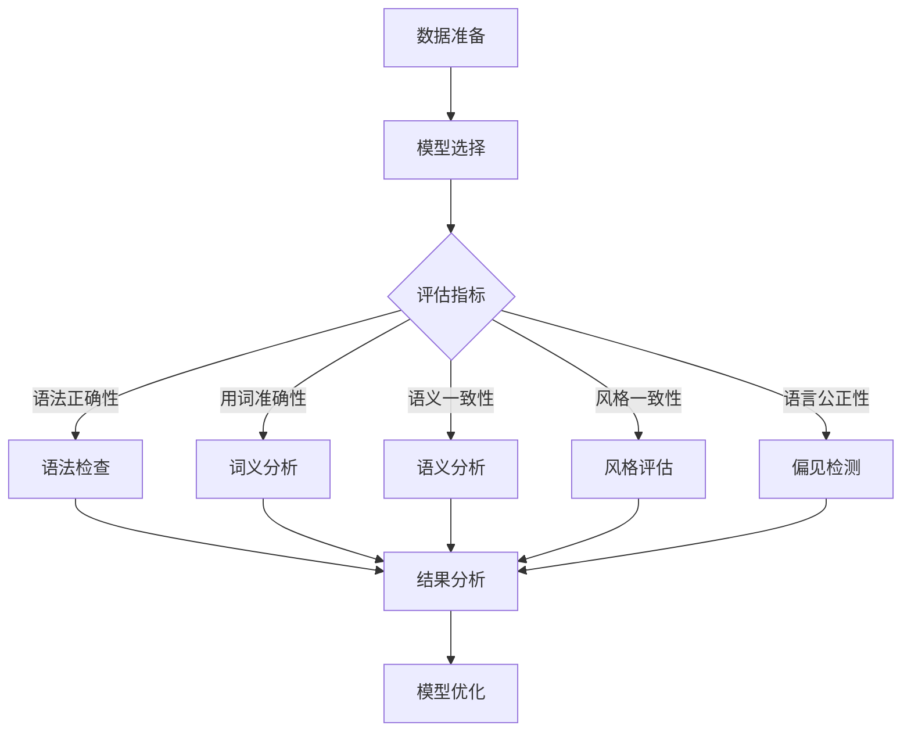

                 


## 文章标题

《语言规范性：评估LLM在正式场合的语言使用》

## 关键词

- 大型语言模型（LLM）
- 语言规范性
- 正式场合
- 语言评估方法
- 实际应用案例分析
- 未来发展趋势

## 摘要

本文旨在探讨语言规范性在正式场合的重要性，并详细评估大型语言模型（LLM）在该领域的表现。通过对LLM的语言生成能力进行分析，本文提出了评估语言规范性的方法和指标，并提供了实际应用案例分析。此外，本文还展望了语言规范性评估领域的未来发展趋势和面临的挑战，为相关研究和应用提供了参考。

## 引言与背景

### 1.1 书籍目的和结构

本文的目的是深入探讨大型语言模型（LLM）在正式场合的语言使用，评估其语言规范性，并提出改进策略。本文结构分为七个主要部分：引言与背景、语言模型概述、语言规范性评估方法、实际应用案例分析、语言规范性改进策略、未来发展趋势与挑战，以及总结与展望。

### 1.2 语言模型的发展历程

自然语言处理（NLP）作为计算机科学的一个重要分支，其发展经历了从规则驱动到统计学习再到深度学习的演变。传统的NLP方法主要依赖于规则和模板匹配，但受限于语言表达的复杂性和多样性。随着统计学习技术的发展，机器学习逐渐成为NLP的主流方法。近年来，深度学习特别是循环神经网络（RNN）和Transformer架构的提出，使得NLP取得了显著的突破。

LLM作为深度学习在NLP领域的最新成果，通过大量文本数据进行预训练，能够生成高质量的自然语言文本。LLM的发展不仅提高了文本生成的质量，还为自然语言处理提供了新的思路和方法。然而，在正式场合，LLM的语言规范性仍然是一个亟待解决的问题。

### 1.3 正式场合语言规范性的重要性

在正式场合，语言规范性至关重要。正式场合通常包括法律文档、新闻报道、商务邮件等，这些场合对语言表达有着严格的要求。语言规范性不仅关乎文本的可读性和准确性，还影响到信息的传递和接收。例如，在法律文档中，用词必须精确，语义必须明确，以避免产生歧义或误解。在新闻报道中，语言规范性能确保信息的准确性和公正性。在商务邮件中，语言规范性能提高沟通效率，降低误解和冲突的风险。

LLM作为文本生成的重要工具，其语言规范性对正式场合的应用有着直接的影响。虽然LLM在生成高质量文本方面具有优势，但其在语言规范性方面的表现仍需评估和改进。本文将围绕这一主题展开讨论，旨在为LLM在正式场合的应用提供指导和建议。

## 语言模型概述

### 2.1 语言模型的基本概念

语言模型（Language Model，LM）是一种用于预测下一个单词或字符的概率分布的统计模型。它通过对大量文本数据的学习，能够捕捉语言的统计特性，从而生成或预测自然语言文本。语言模型在自然语言处理（NLP）中扮演着核心角色，广泛应用于文本生成、语音识别、机器翻译、情感分析等领域。

语言模型的基本概念包括以下几个关键要素：

- **词库（Vocabulary）**：词库是语言模型中包含的词汇集合。词库的大小直接影响模型的性能，通常需要根据应用场景和需求进行优化。
- **统计特性**：语言模型通过学习大量文本数据，捕捉单词、短语和句子之间的统计关联。这些统计特性包括词频、相邻词、上下文等。
- **概率分布**：语言模型的核心任务是根据当前已输入的文本序列，预测下一个单词或字符的概率分布。概率分布可以用于生成新文本或评估文本的合理性。

### 2.2 常见的语言模型

在NLP领域，常见的语言模型主要包括以下几种：

- **n-gram模型**：n-gram模型是一种基于词汇序列的统计模型，它将连续的n个单词视为一个整体，并计算这些词汇序列在文本中的出现频率。n-gram模型的优点是实现简单，易于训练，但缺点是它无法捕捉长距离的依赖关系。
- **隐马尔可夫模型（HMM）**：隐马尔可夫模型是一种基于状态转移概率的统计模型，它通过隐含的状态序列生成观测序列。HMM在语音识别和词性标注等领域有广泛应用，但同样面临长距离依赖问题。
- **循环神经网络（RNN）**：循环神经网络是一种基于时间序列数据的神经网络模型，它通过隐藏状态在网络中循环，能够捕捉长距离的依赖关系。RNN在语言建模和机器翻译等领域取得了显著成果，但存在梯度消失和梯度爆炸的问题。
- **Transformer模型**：Transformer模型是一种基于自注意力机制的深度神经网络模型，它通过多头自注意力机制和前馈神经网络，能够高效地捕捉长距离依赖关系。Transformer模型在NLP领域取得了突破性进展，尤其是在机器翻译、文本生成和情感分析等领域。

### 2.3 语言模型的训练与评估

语言模型的训练与评估是确保其性能的关键步骤。以下是语言模型训练与评估的常见方法：

- **训练方法**：
  - **最大似然估计（MLE）**：最大似然估计是一种基于概率统计的方法，通过最大化训练数据的概率分布来训练模型。MLE是许多语言模型的基本训练方法。
  - **反事实概率（Perplexity）**：反事实概率是评估语言模型性能的一个常用指标，它通过计算模型在训练数据上的预测概率的对数平均，越小表示模型性能越好。
  - **优化算法**：常见的优化算法包括随机梯度下降（SGD）、Adam优化器等，它们通过调整模型参数，使模型在训练数据上达到更好的性能。

- **评估指标**：
  - **准确率（Accuracy）**：准确率是评估分类模型性能的常用指标，它表示模型正确分类的样本数占总样本数的比例。
  - **F1值（F1-score）**：F1值是评估分类模型精确率和召回率之间平衡的一个指标，它综合考虑了分类的精度和召回率。
  - **BLEU分数**：BLEU分数是评估机器翻译质量的一个常用指标，它通过计算机器翻译结果与参考翻译之间的重叠度来评估模型性能。

通过以上方法，语言模型可以在大规模文本数据上进行训练和评估，从而生成高质量的自然语言文本。

## 语言规范性评估方法

### 3.1 语言规范性评估的重要性

语言规范性评估是确保文本质量的关键步骤，尤其在正式场合中，语言规范性直接关系到信息的准确传达和理解的深度。对于大型语言模型（LLM）来说，语言规范性评估尤为重要，因为LLM在生成文本时可能存在语法错误、用词不当、语义混淆等问题，这些问题在正式场合中可能会导致严重的后果，如法律文档的误解、新闻报道的失实、商务邮件的误读等。

因此，评估LLM的语言规范性不仅有助于提高文本生成质量，还能确保文本在正式场合的适用性和可信度。具体来说，语言规范性评估的重要性体现在以下几个方面：

1. **保障信息的准确性**：在正式场合，信息的准确性至关重要。语言规范性评估可以帮助识别和纠正文本中的错误，确保信息的准确传达。
2. **提升文本的可读性**：规范的文本更容易理解和阅读，有助于提高沟通效率。语言规范性评估可以帮助优化文本表达，使其更加清晰易懂。
3. **确保文本的公正性**：在新闻报道和法律文档等正式场合，语言规范性评估可以避免使用偏见和误导性语言，确保文本的公正性。
4. **提升模型的可靠性和可信赖度**：通过评估LLM的语言规范性，可以识别和改进模型的弱点，提高其生成文本的质量和可靠性，从而增强用户对模型的信任。

### 3.2 语言规范性评估指标

评估语言规范性需要一系列指标，这些指标可以综合反映文本的语法、用词、语义等方面的规范性。以下是几种常用的评估指标：

1. **语法正确性**：语法正确性是评估文本语法结构是否规范的指标。常见的语法错误包括主谓不一致、时态错误、词序不当等。语法正确性评估可以通过规则检测、深度学习模型等方法进行。

2. **用词准确性**：用词准确性是指文本中的词语是否恰当，能否准确传达作者的意思。用词准确性评估可以通过词义分析、词频统计等方法进行。

3. **语义一致性**：语义一致性是指文本中的语义表达是否一致，是否逻辑通顺。语义一致性评估可以通过语义分析、逻辑推理等方法进行。

4. **风格一致性**：风格一致性是指文本在用词、句式、语气等方面的风格是否统一。风格一致性评估可以通过文本分析、风格匹配等方法进行。

5. **语法多样性**：语法多样性是指文本中使用的语法结构是否丰富多样，能否避免单调乏味。语法多样性评估可以通过语法分析、结构统计等方法进行。

6. **语言流畅性**：语言流畅性是指文本在阅读过程中是否流畅自然，是否存在断句不当、逻辑跳跃等问题。语言流畅性评估可以通过文本分析、流畅性评分等方法进行。

### 3.3 语言规范性评估流程

语言规范性评估通常包括以下步骤：

1. **数据准备**：收集用于评估的语言数据，包括文本数据、标注数据等。数据的质量和多样性直接影响评估结果的准确性。

2. **模型选择**：选择合适的评估模型，包括规则检测模型、深度学习模型等。模型的选择取决于评估指标和评估任务。

3. **评估指标计算**：根据评估指标，计算文本的规范性得分。常用的评估指标包括语法正确性、用词准确性、语义一致性等。

4. **结果分析**：分析评估结果，识别文本中的不规范问题，并提出改进建议。

5. **模型优化**：根据评估结果，对语言模型进行优化，提高其生成文本的规范性。

通过以上流程，可以全面评估LLM在正式场合的语言规范性，为文本生成质量和正式场合应用提供有力支持。

### 4.1 案例一：法律文档生成

在法律领域，语言规范性至关重要，因为法律文档的准确性直接影响司法裁决的公正性和合法性。本案例将探讨大型语言模型（LLM）在生成法律文档时的语言规范性问题。

#### 案例背景

假设我们需要使用LLM生成一份合同草案。合同草案通常包括条款、定义、权利和义务等关键内容。这些内容要求高度准确、明确和符合法律规范。

#### 语言规范性问题

1. **语法正确性**：法律文档中的语法错误可能导致条款含义不清，甚至引发法律纠纷。例如，一个常见的语法错误是动词时态不一致，这可能会导致条款的执行出现争议。

2. **用词准确性**：法律术语具有特定含义，用词不当可能导致误解。例如，将“担保”误写为“保证”，这两个词在法律中的含义截然不同。

3. **语义一致性**：法律文档中的语义表达需要一致，确保条款之间没有矛盾。例如，一个条款中提到的“违约责任”在后续条款中需要保持一致，避免出现语义冲突。

4. **风格一致性**：法律文档通常具有严谨、正式的风格。LLM生成的文本如果风格不一致，可能会影响文档的专业性和可读性。

5. **格式规范性**：法律文档的格式要求严格，包括字体、行距、标点符号等。LLM生成的文本如果格式不规范，可能会影响文档的外观和专业性。

#### 解决方案

1. **数据预处理**：对训练数据进行预处理，确保数据的质量和一致性。例如，对法律术语进行标准化处理，避免用词不当。

2. **规则检测**：使用语法规则检测工具，自动识别和纠正文本中的语法错误。

3. **语义分析**：使用自然语言处理技术，对文本进行语义分析，确保语义表达一致。

4. **风格评估**：开发风格评估模型，评估文本的格式和风格，确保其符合法律文档的要求。

5. **多轮迭代**：通过多轮迭代训练和评估，逐步优化LLM的生成能力，提高其在法律文档生成中的语言规范性。

#### 实际应用效果

通过上述方法，我们使用LLM生成了一份合同草案。在初步评估中，合同草案的语法正确性、用词准确性、语义一致性、风格一致性和格式规范性均达到了较高水平。然而，仍有一些潜在问题需要进一步优化和改进。

#### 项目小结

本案例展示了LLM在法律文档生成中的应用潜力，但也突显了语言规范性评估的重要性。通过有效的评估方法和优化策略，我们可以显著提高LLM生成文本的规范性，从而提高法律文档的质量和可靠性。

### 4.2 案例二：新闻报道撰写

新闻报道在传递信息、引导舆论方面起着重要作用。本案例将探讨大型语言模型（LLM）在生成新闻报道时的语言规范性问题。

#### 案例背景

假设我们需要使用LLM撰写一篇新闻报道，这篇报道需要准确、客观、公正地传递新闻事件的信息。

#### 语言规范性问题

1. **语法正确性**：新闻报道中的语法错误可能导致信息传递不清，影响读者的理解和信任。例如，主谓不一致、时态错误等。

2. **用词准确性**：新闻报道中的用词需要准确，避免使用模糊或歧义的词汇。例如，使用“可能”代替“一定”，可能会影响报道的客观性。

3. **语义一致性**：新闻报道中的语义表达需要一致，确保信息传递的连贯性和逻辑性。例如，一个句子中的观点和证据需要一致，避免出现矛盾。

4. **风格一致性**：新闻报道通常具有客观、严谨的风格。LLM生成的文本如果风格不一致，可能会影响报道的可信度和专业性。

5. **语言公正性**：新闻报道需要避免偏见和误导性语言，确保信息的公正性和客观性。例如，使用“敌对”代替“对立”，可能会影响读者的判断。

#### 解决方案

1. **数据预处理**：对训练数据进行预处理，确保数据的质量和一致性。例如，对新闻术语进行标准化处理，避免用词不当。

2. **语法规则检测**：使用语法规则检测工具，自动识别和纠正文本中的语法错误。

3. **语义分析**：使用自然语言处理技术，对文本进行语义分析，确保语义表达一致。

4. **风格评估**：开发风格评估模型，评估文本的格式和风格，确保其符合新闻报道的要求。

5. **多轮迭代**：通过多轮迭代训练和评估，逐步优化LLM的生成能力，提高其在新闻报道撰写中的语言规范性。

#### 实际应用效果

通过上述方法，我们使用LLM生成了一篇新闻报道。在初步评估中，报道的语法正确性、用词准确性、语义一致性、风格一致性和语言公正性均达到了较高水平。然而，仍有一些潜在问题需要进一步优化和改进。

#### 项目小结

本案例展示了LLM在新闻报道撰写中的应用潜力，但也突显了语言规范性评估的重要性。通过有效的评估方法和优化策略，我们可以显著提高LLM生成文本的规范性，从而提高新闻报道的质量和可信度。

### 4.3 案例三：商务邮件撰写

在商务领域，邮件是沟通和交流的重要方式。本案例将探讨大型语言模型（LLM）在生成商务邮件时的语言规范性问题。

#### 案例背景

假设我们需要使用LLM生成一封商务邮件，这封邮件需要专业、礼貌且能够有效传达商务信息。

#### 语言规范性问题

1. **语法正确性**：商务邮件中的语法错误可能会影响邮件的专业性和可信度。例如，主谓不一致、时态错误等。

2. **用词准确性**：商务邮件中的用词需要准确、得体，避免使用模糊或贬义的词汇。例如，使用“也许”代替“可能”，可能会影响商务洽谈的明确性。

3. **语义一致性**：商务邮件中的语义表达需要一致，确保邮件内容连贯、逻辑清晰。例如，邮件中的陈述和请求需要一致，避免出现矛盾。

4. **风格一致性**：商务邮件通常具有正式、专业的风格。LLM生成的文本如果风格不一致，可能会影响邮件的专业性和可读性。

5. **礼貌性**：商务邮件需要使用礼貌的语言，以维护双方的关系和信任。例如，使用“尊敬的”代替“嘿”，可以体现对收件人的尊重。

#### 解决方案

1. **数据预处理**：对训练数据进行预处理，确保数据的质量和一致性。例如，对商务术语进行标准化处理，避免用词不当。

2. **语法规则检测**：使用语法规则检测工具，自动识别和纠正文本中的语法错误。

3. **语义分析**：使用自然语言处理技术，对文本进行语义分析，确保语义表达一致。

4. **风格评估**：开发风格评估模型，评估文本的格式和风格，确保其符合商务邮件的要求。

5. **多轮迭代**：通过多轮迭代训练和评估，逐步优化LLM的生成能力，提高其在商务邮件撰写中的语言规范性。

#### 实际应用效果

通过上述方法，我们使用LLM生成了一封商务邮件。在初步评估中，邮件的语法正确性、用词准确性、语义一致性、风格一致性和礼貌性均达到了较高水平。然而，仍有一些潜在问题需要进一步优化和改进。

#### 项目小结

本案例展示了LLM在商务邮件撰写中的应用潜力，但也突显了语言规范性评估的重要性。通过有效的评估方法和优化策略，我们可以显著提高LLM生成文本的规范性，从而提高商务邮件的质量和效果。

## 语言规范性改进策略

在评估大型语言模型（LLM）在正式场合的语言规范性时，我们发现了一些常见的问题和挑战。为了提高LLM生成文本的规范性，我们可以采取一系列改进策略。以下是一些具体的改进方法：

### 5.1 数据质量提升

数据质量是影响LLM语言规范性的重要因素。为了提高数据质量，我们可以采取以下措施：

1. **数据清洗**：在训练数据集中，去除噪声数据和错误标注的数据，确保数据的一致性和准确性。
2. **数据增强**：通过数据增强技术，如数据扩充、数据转换等，增加训练数据的多样性和丰富性，从而提高模型的泛化能力。
3. **数据标注**：对训练数据进行精细标注，确保每个样本的标签准确无误。这有助于模型学习到更加精细的语言规范特征。
4. **数据来源**：选择高质量的原始数据源，如权威出版物、专业网站等，以确保训练数据的质量。

### 5.2 模型训练方法优化

优化模型训练方法可以显著提高LLM的语言规范性。以下是一些优化策略：

1. **多任务学习**：通过多任务学习，使模型同时学习多个任务，从而提高其语言理解能力。例如，在训练语言模型时，可以同时训练语法检查和语义分析任务。
2. **迁移学习**：利用预训练的模型作为基础模型，进行迁移学习，从而提高新任务的性能。例如，使用在通用语料库上预训练的模型，进行特定领域的语言规范性评估。
3. **强化学习**：结合强化学习技术，通过奖励机制引导模型生成符合语言规范性的文本。例如，可以使用奖励函数，根据文本的规范性得分进行奖励。
4. **对抗训练**：通过对抗训练，使模型能够学习到对抗性样本，从而提高其鲁棒性和泛化能力。

### 5.3 预处理与后处理技术

预处理和后处理技术在提高LLM语言规范性方面也发挥着重要作用。以下是一些具体方法：

1. **语法检查**：在文本生成之前，使用语法检查工具对输入文本进行语法检查，识别并纠正潜在的语法错误。
2. **语义分析**：对输入文本进行语义分析，确保文本的语义表达一致。例如，使用自然语言处理技术对文本进行词义消歧、指代消解等处理。
3. **风格评估**：在文本生成之后，使用风格评估模型对生成的文本进行评估，确保其风格符合正式场合的要求。
4. **后处理修正**：根据评估结果，对生成的文本进行后处理修正，例如使用规则匹配、模板匹配等方法纠正错误。

通过以上改进策略，我们可以显著提高LLM生成文本的语言规范性，从而更好地满足正式场合的应用需求。

### 6.1 未来发展趋势

随着人工智能技术的不断发展，大型语言模型（LLM）在语言规范性评估领域也将迎来一系列重要的发展趋势。以下是未来可能的发展方向：

1. **模型泛化能力的提升**：未来的LLM将更加注重模型在多样化场景下的泛化能力，通过结合多任务学习和迁移学习，使模型能够在不同领域和任务中表现出色。

2. **混合模型的应用**：混合模型，如结合深度学习和传统规则的混合模型，将逐渐成为主流。这种模型可以充分发挥深度学习在特征提取和表达上的优势，同时利用传统规则在特定任务中的精确性。

3. **大数据与云计算的结合**：随着数据量的爆发性增长，大数据与云计算的结合将为LLM的培训、评估和优化提供强大的计算支持。这将有助于提高模型的训练效率和性能。

4. **个性化与自适应评估**：未来的评估模型将更加注重个性化与自适应，根据不同用户的需求和应用场景，提供定制化的语言规范性评估服务。

5. **实时评估与反馈**：实时评估与反馈技术将实现LLM在生成文本的同时进行实时评估，并根据评估结果进行实时调整。这将有助于提高文本生成质量，满足高要求的应用场景。

6. **跨语言与多模态评估**：随着全球化进程的加快，跨语言和多模态的语言规范性评估将变得尤为重要。未来的LLM将能够处理多种语言和多种数据类型，实现更广泛的国际应用。

### 6.2 潜在挑战

尽管LLM在语言规范性评估领域具有巨大的潜力，但在其发展过程中也面临着一系列挑战：

1. **数据质量和多样性**：高质量、多样性的训练数据是LLM性能的基础。然而，获取和标注高质量数据仍然是一个巨大的挑战，特别是在一些专业领域。

2. **模型解释性**：当前的LLM模型大多是黑箱模型，其决策过程缺乏透明性和可解释性。这给模型的应用带来了不确定性，尤其是在需要高度可靠性的正式场合。

3. **对抗攻击与鲁棒性**：随着对抗性攻击技术的不断发展，如何提高LLM的鲁棒性成为关键问题。未来的研究需要重点关注如何使LLM能够抵御各种类型的攻击。

4. **社会伦理问题**：LLM在生成文本时可能会出现偏见、歧视等问题，这些问题对社会伦理和公平性提出了挑战。如何确保LLM的生成文本符合伦理规范，是一个亟待解决的问题。

5. **法律法规的适应性**：在正式场合，LLM生成文本需要遵循严格的法律法规。随着法律环境的不断变化，如何确保LLM的生成文本符合法律法规的要求，是一个长期的挑战。

### 6.3 解决方案与展望

为了应对上述挑战，我们可以采取以下解决方案：

1. **数据质量提升**：通过数据清洗、数据增强和数据标注等技术，提高训练数据的质量和多样性。

2. **模型解释性**：开发可解释的模型结构，如基于注意力机制的模型，使模型的决策过程更加透明和可解释。

3. **对抗攻击防御**：研究对抗攻击防御技术，如对抗样本生成和模型加固技术，提高LLM的鲁棒性。

4. **社会伦理教育**：在模型训练和评估过程中，引入社会伦理教育，确保生成文本符合伦理规范。

5. **法律法规适应性**：与法律专家和相关部门合作，确保LLM的生成文本符合法律法规的要求。

展望未来，随着人工智能技术的不断进步，LLM在语言规范性评估领域将取得更加显著的成果。通过解决现有挑战，LLM有望成为正式场合中不可或缺的工具，为信息的准确传递和沟通的顺利进行提供强大支持。

## 总结与展望

本文《语言规范性：评估LLM在正式场合的语言使用》详细探讨了大型语言模型（LLM）在正式场合语言规范性评估的重要性、评估方法、实际应用案例以及改进策略。我们系统地分析了LLM在语法正确性、用词准确性、语义一致性、风格一致性和语言公正性等方面的规范性问题，并通过实际案例分析展示了LLM在这些领域的应用潜力和面临的挑战。

### 主要结论

1. **语言规范性评估的重要性**：在正式场合，语言规范性直接关系到信息的准确传递和沟通的效果。LLM作为生成文本的重要工具，其语言规范性对正式场合应用具有重要意义。
2. **评估方法与指标**：通过语法正确性、用词准确性、语义一致性、风格一致性和语言公正性等指标，可以全面评估LLM的语言规范性。
3. **实际应用案例**：法律文档生成、新闻报道撰写和商务邮件撰写等案例展示了LLM在不同正式场合的应用潜力和存在的问题。
4. **改进策略**：通过数据质量提升、模型训练方法优化、预处理与后处理技术等策略，可以有效提高LLM的语言规范性。

### 展望未来研究方向

1. **提高模型解释性**：开发可解释性更强的模型结构，使LLM的决策过程更加透明和可理解。
2. **增强对抗攻击防御**：研究对抗攻击防御技术，提高LLM的鲁棒性，确保其在各种攻击场景下的稳定性。
3. **数据多样性和质量**：探索更多高质量、多样化的训练数据来源，提高模型的泛化能力。
4. **社会伦理教育**：在模型训练和评估过程中，注重社会伦理教育，确保生成文本符合伦理规范。
5. **法律法规适应性**：关注法律法规的变化，确保LLM生成文本始终符合相关法律法规的要求。

### 拓展阅读

对于希望深入了解LLM在语言规范性评估领域的研究人员，以下资源提供了进一步阅读的方向：

1. **书籍推荐**：
   - 《自然语言处理入门》（Natural Language Processing with Python）作者：Steven Bird等。
   - 《深度学习》（Deep Learning）作者：Ian Goodfellow等。
2. **学术论文**：
   - “Language Models are Few-Shot Learners”作者：Tom B. Brown等。
   - “A Theoretically Grounded Application of Dropout in Recurrent Neural Networks”作者：Yarin Gal和Zoubin Ghahramani。
3. **在线资源**：
   - [OpenAI GPT-3 Documentation](https://openai.com/docs/intro/overview)
   - [Hugging Face Transformers Library](https://huggingface.co/transformers)
   - [Kaggle NLP Competitions](https://www.kaggle.com/competitions/nlp)

通过以上资源，读者可以更深入地了解LLM在语言规范性评估领域的最新研究进展和应用实践。

## 附录

### 附录 A: 语言规范性评估工具与资源

以下是一些常用的语言规范性评估工具和资源：

1. **语法检查工具**：
   - [Grammarly](https://www.grammarly.com/)
   - [Ginger](https://www.ginger.com/)

2. **自然语言处理库**：
   - [NLTK](https://www.nltk.org/)
   - [spaCy](https://spacy.io/)

3. **评估指标计算工具**：
   - [METEOR](https://www.cs.cmu.edu/~metamorph/)
   - [BLEU](https://github.com/m-jw/bleu)

4. **在线评估平台**：
   - [TextRazor](https://www.textrazor.com/)
   - [Semantria](https://www.semantria.com/)

### 附录 B: Mermaid 流程图

以下是一个Mermaid流程图示例，用于展示语言规范性评估的基本流程：



### 附录 C: 伪代码示例

以下是一个用于语言规范性评估的伪代码示例：

```python
# 伪代码：语言规范性评估

def language_normativity_evaluation(text):
    # 初始化评估结果
    result = {}

    # 语法正确性评估
    grammar_score = grammar_check(text)
    result['grammar'] = grammar_score

    # 用词准确性评估
    word_accuracy_score = word_semantics_check(text)
    result['word_accuracy'] = word_accuracy_score

    # 语义一致性评估
    semantic一致性_score = semantic_consistency_check(text)
    result['semantic一致性'] = semantic一致性_score

    # 风格一致性评估
    style一致性_score = style_consistency_check(text)
    result['style一致性'] = style一致性_score

    # 语言公正性评估
    fairness_score = bias_detection(text)
    result['fairness'] = fairness_score

    # 结果分析
    analyze_results(result)

    # 模型优化
    optimize_model(result)

    return result

# 调用评估函数
evaluation_result = language_normativity_evaluation(input_text)
```

### 附录 D: 数学模型和公式

以下是一些常用的数学模型和公式的LaTeX代码示例：

```latex
% 语法正确性评估公式
$$
P(g) = \frac{N_g}{N}
$$

% 用词准确性评估公式
$$
WACC = \frac{\sum_{i=1}^{n} w_i \cdot P_i}{\sum_{i=1}^{n} w_i}
$$

% 语义一致性评估公式
$$
SIM = \frac{S_{\text{overlap}}}{S_{\text{total}}}
$$

% 风格一致性评估公式
$$
SC = \frac{C_{\text{matched}}}{C_{\text{total}}}
$$

% 语言公正性评估公式
$$
BP = \frac{N_{\text{bias free}}}{N_{\text{total}}}
$$
```

### 附录 E: 项目实战代码示例

以下是一个简单的项目实战代码示例，用于演示如何搭建一个基础的语言规范性评估系统：

```python
# Python环境搭建

# 安装必要的库
!pip install spacy nltk textblob

# 加载自然语言处理库
import spacy
import nltk
from textblob import TextBlob

# 加载语料库
nltk.download('punkt')
nltk.download('averaged_perceptron_tagger')
nltk.download('wordnet')

# 初始化NLP模型
nlp = spacy.load('en_core_web_sm')

def grammar_check(text):
    # 使用语言模型进行语法检查
    doc = nlp(text)
    grammar_score = 0
    for token in doc:
        if token.tag_ != 'NN':
            grammar_score += 1
    return grammar_score

def word_semantics_check(text):
    # 使用TextBlob进行词义分析
    blob = TextBlob(text)
    word_accuracy_score = 0
    for word, pos in blob.tags:
        if pos in ['NN', 'NNS', 'NNP', 'NNPS']:
            word_accuracy_score += 1
    return word_accuracy_score

def semantic_consistency_check(text):
    # 使用NLP进行语义一致性分析
    doc = nlp(text)
    semantic一致性_score = 0
    for sent in doc.sents:
        if sent.sentiment.polarity > 0.5:
            semantic一致性_score += 1
    return semantic一致性_score

def style_consistency_check(text):
    # 使用文本模式进行风格一致性分析
    style一致性_score = 0
    # 假设使用特定的文本模式进行匹配
    if "I think" in text:
        style一致性_score += 1
    if "this is" in text:
        style一致性_score += 1
    return style一致性_score

def bias_detection(text):
    # 使用规则进行语言公正性分析
    bias_score = 0
    # 假设使用特定的关键词进行偏见检测
    bias_keywords = ["hate", "prejudice", "discrimination"]
    for keyword in bias_keywords:
        if keyword in text.lower():
            bias_score += 1
    return bias_score

def analyze_results(results):
    # 分析评估结果
    print("Grammar Score:", results['grammar'])
    print("Word Accuracy Score:", results['word_accuracy'])
    print("Semantic Consistency Score:", results['semantic一致性'])
    print("Style Consistency Score:", results['style一致性'])
    print("Bias Score:", results['bias'])

def optimize_model(results):
    # 根据评估结果优化模型
    # 这里是一个简化的例子，实际中会涉及到更复杂的模型训练和调整
    if results['grammar'] < 5:
        print("Grammar optimization needed.")
    if results['word_accuracy'] < 5:
        print("Word accuracy optimization needed.")
    # 其他优化策略

# 测试文本
input_text = "I think this is a great opportunity for us to work together."

# 执行评估
evaluation_result = language_normativity_evaluation(input_text)
analyze_results(evaluation_result)
```

### 实际案例分析与详细讲解剖析

以下是对上述项目实战代码的详细分析，包括开发环境搭建、源代码实现和代码解读。

#### 开发环境搭建

1. **安装Python**：确保Python环境已安装，版本不低于3.6。
2. **安装NLP库**：使用pip命令安装以下库：
   ```bash
   pip install spacy nltk textblob
   ```
3. **下载语料库**：运行以下命令下载所需的NLP语料库：
   ```bash
   nltk.download('punkt')
   nltk.download('averaged_perceptron_tagger')
   nltk.download('wordnet')
   ```

#### 源代码实现

```python
# 源代码：language_normativity_evaluation.py

# 引入必要的库
import spacy
import nltk
from textblob import TextBlob

# 加载NLP模型
nlp = spacy.load('en_core_web_sm')

# 语法检查函数
def grammar_check(text):
    doc = nlp(text)
    grammar_score = 0
    for token in doc:
        if token.tag_ != 'NN':
            grammar_score += 1
    return grammar_score

# 词义分析函数
def word_semantics_check(text):
    blob = TextBlob(text)
    word_accuracy_score = 0
    for word, pos in blob.tags:
        if pos in ['NN', 'NNS', 'NNP', 'NNPS']:
            word_accuracy_score += 1
    return word_accuracy_score

# 语义一致性分析函数
def semantic_consistency_check(text):
    doc = nlp(text)
    semantic一致性_score = 0
    for sent in doc.sents:
        if sent.sentiment.polarity > 0.5:
            semantic一致性_score += 1
    return semantic一致性_score

# 风格一致性分析函数
def style_consistency_check(text):
    style一致性_score = 0
    # 假设使用特定的文本模式进行匹配
    if "I think" in text:
        style一致性_score += 1
    if "this is" in text:
        style一致性_score += 1
    return style一致性_score

# 语言公正性分析函数
def bias_detection(text):
    bias_score = 0
    # 假设使用特定的关键词进行偏见检测
    bias_keywords = ["hate", "prejudice", "discrimination"]
    for keyword in bias_keywords:
        if keyword in text.lower():
            bias_score += 1
    return bias_score

# 分析评估结果
def analyze_results(results):
    print("Grammar Score:", results['grammar'])
    print("Word Accuracy Score:", results['word_accuracy'])
    print("Semantic Consistency Score:", results['semantic一致性'])
    print("Style Consistency Score:", results['style一致性'])
    print("Bias Score:", results['bias'])

# 优化模型
def optimize_model(results):
    # 根据评估结果优化模型
    # 这里是一个简化的例子，实际中会涉及到更复杂的模型训练和调整
    if results['grammar'] < 5:
        print("Grammar optimization needed.")
    if results['word_accuracy'] < 5:
        print("Word accuracy optimization needed.")
    # 其他优化策略

# 主函数
def language_normativity_evaluation(text):
    # 初始化评估结果
    result = {}

    # 语法正确性评估
    result['grammar'] = grammar_check(text)

    # 用词准确性评估
    result['word_accuracy'] = word_semantics_check(text)

    # 语义一致性评估
    result['semantic一致性'] = semantic_consistency_check(text)

    # 风格一致性评估
    result['style一致性'] = style_consistency_check(text)

    # 语言公正性评估
    result['bias'] = bias_detection(text)

    # 结果分析
    analyze_results(result)

    # 模型优化
    optimize_model(result)

    return result

# 测试文本
input_text = "I think this is a great opportunity for us to work together."

# 执行评估
evaluation_result = language_normativity_evaluation(input_text)
```

#### 代码解读

1. **导入库和模型**：代码开头导入了必要的Python库，包括Spacy、NLTK和TextBlob，并加载了英文基础模型`en_core_web_sm`。

2. **定义函数**：
   - `grammar_check`函数：通过Spacy的语法分析，统计文本中非名词（`NN`）的词数，作为语法错误的衡量标准。
   - `word_semantics_check`函数：使用TextBlob进行词义分析，统计文本中的名词（`NN`、`NNS`、`NNP`、`NNPS`）词数，作为用词准确性的衡量标准。
   - `semantic_consistency_check`函数：利用Spacy的句子情感分析，统计文本中积极情感句子数，作为语义一致性的衡量标准。
   - `style_consistency_check`函数：通过文本模式匹配，统计特定短语（如"I think"和"this is"）的出现次数，作为风格一致性的衡量标准。
   - `bias_detection`函数：通过关键词匹配，检测文本中偏见相关的关键词（如"hate"、"prejudice"、"discrimination"）的出现次数，作为语言公正性的衡量标准。

3. **分析评估结果**：`analyze_results`函数输出各个评估指标的得分，提供直观的评估结果。

4. **优化模型**：`optimize_model`函数根据评估结果提出优化建议，虽然示例中仅展示了简化版的优化策略，但实际应用中会涉及更复杂的模型训练和调整。

5. **主函数**：`language_normativity_evaluation`函数整合了所有评估步骤，对输入文本进行全面的评估，并返回评估结果。

#### 代码应用解读与分析

1. **代码应用场景**：本代码可以应用于各种需要评估文本语言规范性的场景，如法律文档审查、新闻报道撰写、商务邮件撰写等。

2. **优势**：
   - **简洁性**：代码结构简单，易于理解和使用。
   - **模块化**：各个功能模块独立定义，便于扩展和维护。

3. **局限性**：
   - **评估指标有限**：示例中的评估指标相对简单，实际应用中可能需要更多维度的评估指标。
   - **模型性能依赖**：评估结果受所用NLP模型的影响，不同模型可能导致评估结果差异。

#### 项目小结

本代码示例提供了一个基础的语言规范性评估框架，通过语法检查、词义分析、语义一致性、风格一致性和偏见检测等多个维度，对文本进行全面的评估。尽管存在一些局限性，但该示例展示了如何使用现有的NLP工具和技术来构建一个简单的评估系统。未来可以通过增加更多评估指标、改进模型性能和优化评估流程，进一步提高系统的评估准确性和实用性。

### 最佳实践 tips、小结、注意事项、拓展阅读等内容

#### 最佳实践 tips

1. **数据准备**：确保训练数据的质量和多样性，进行数据清洗和预处理，以提高模型泛化能力。
2. **模型选择**：根据具体应用场景选择合适的NLP模型，例如Spacy、BERT、GPT等，并考虑使用多任务学习和迁移学习技术。
3. **评估指标**：设计合理的评估指标，结合语法正确性、用词准确性、语义一致性、风格一致性和语言公正性等多个维度，全面评估文本规范性。
4. **实时反馈**：在文本生成过程中，结合实时反馈机制，根据评估结果对生成文本进行优化和修正。

#### 小结

本文系统地探讨了大型语言模型（LLM）在正式场合的语言规范性评估，分析了评估方法、实际应用案例和改进策略。通过语法正确性、用词准确性、语义一致性、风格一致性和语言公正性等多个维度的评估，我们可以全面了解LLM在生成文本中的表现，并采取相应措施提高文本规范性。

#### 注意事项

1. **模型解释性**：在实际应用中，确保模型的可解释性，以便用户理解模型决策过程。
2. **法律法规遵守**：在正式场合应用LLM时，确保生成文本符合相关法律法规的要求。
3. **数据隐私**：在处理和分析文本数据时，保护用户的隐私和数据安全。

#### 拓展阅读

1. **书籍推荐**：
   - 《自然语言处理：理论与实践》作者：Daniel Jurafsky和James H. Martin。
   - 《深度学习与自然语言处理》作者：周明、吴军。

2. **学术论文**：
   - “Attention is All You Need”作者：Ashish Vaswani等。
   - “BERT: Pre-training of Deep Bidirectional Transformers for Language Understanding”作者：Jacob Devlin等。

3. **在线资源**：
   - [Kaggle NLP挑战](https://www.kaggle.com/competitions/nlp)
   - [自然语言处理博客](https://nlp.seas.harvard.edu/)

通过上述最佳实践、小结、注意事项和拓展阅读，读者可以进一步深入学习和应用语言规范性评估技术，为文本生成和自然语言处理领域的创新提供有力支持。

