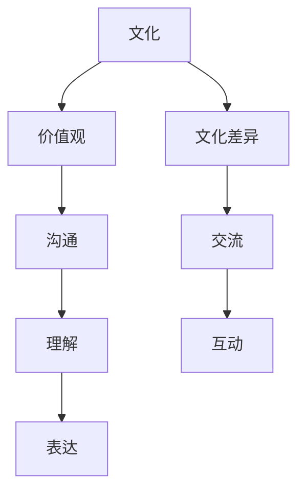
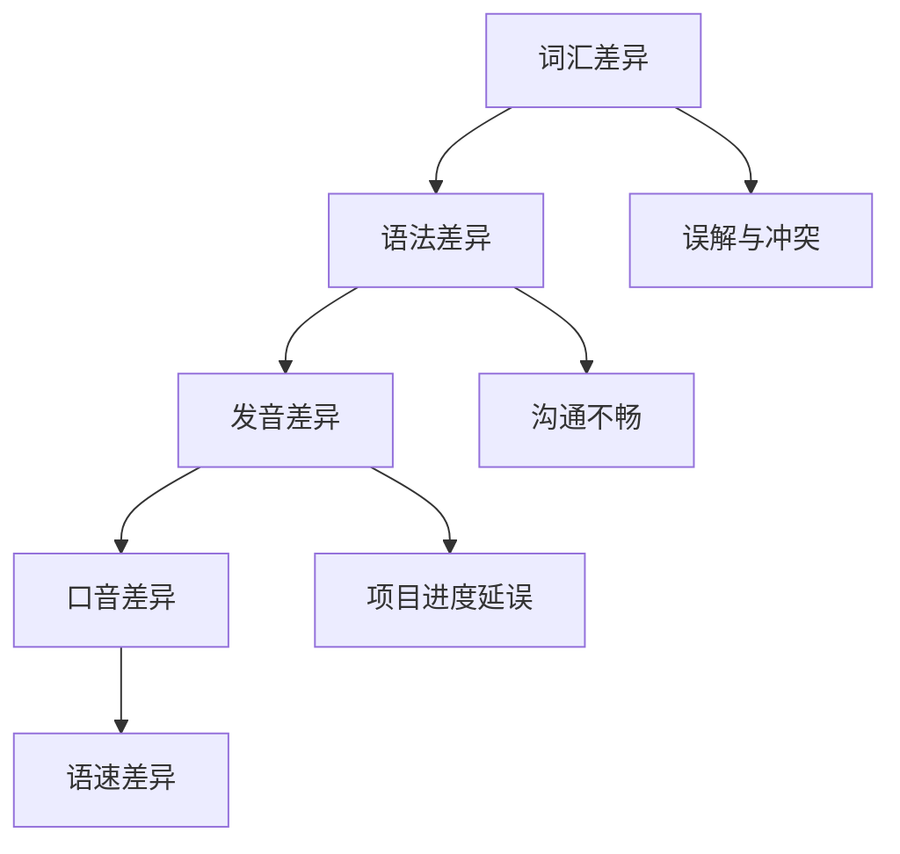
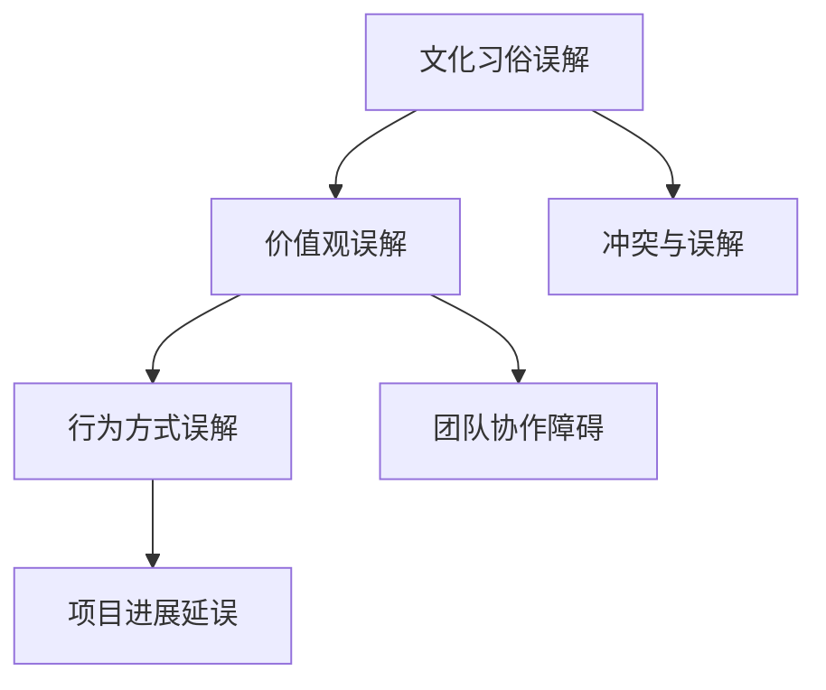
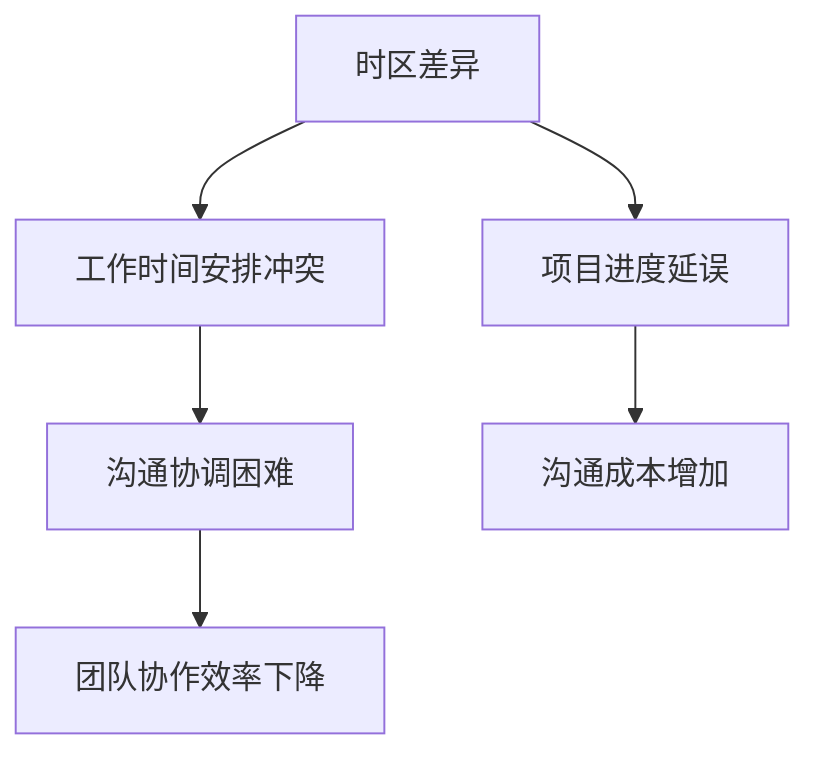
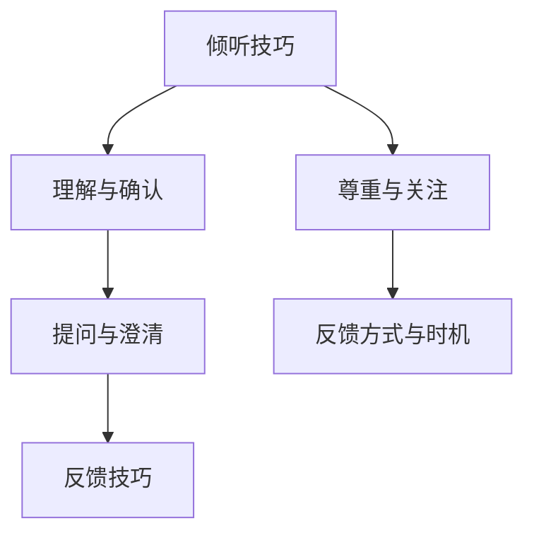
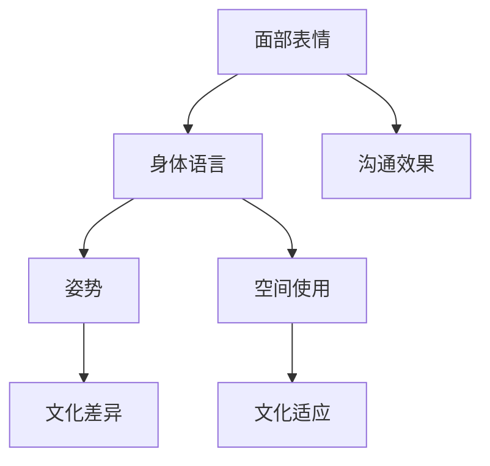
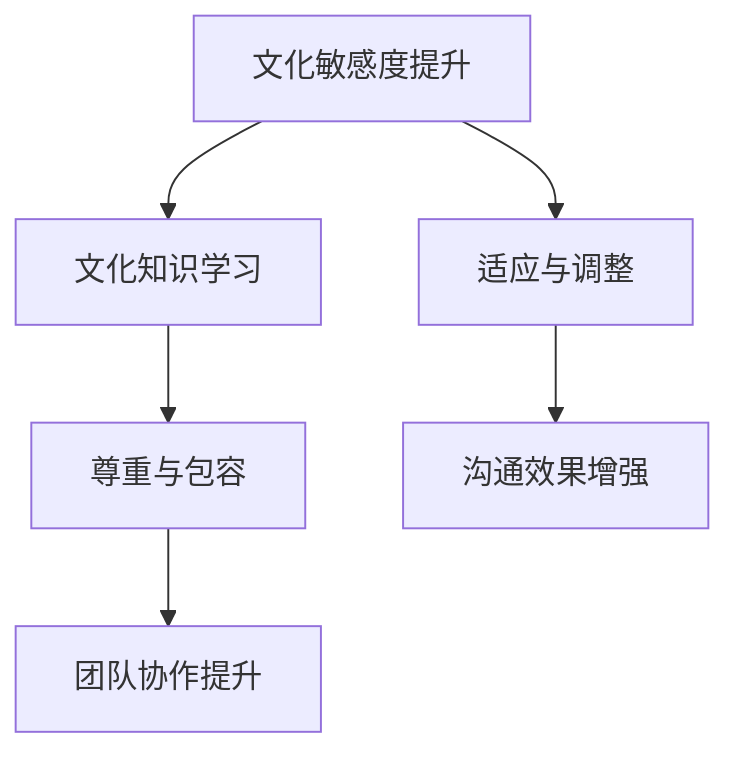

                 


### 引言

随着全球化的深入发展，国际团队协作已成为现代企业运作中不可或缺的一部分。在这样的背景下，跨文化沟通能力的重要性日益凸显。有效跨文化沟通不仅有助于消除误解和冲突，还能提升团队协作效率，促进项目成功。然而，跨文化沟通并非易事，它涉及到语言、文化、价值观等多方面的因素，需要深入理解和实践。

本文旨在探讨跨文化沟通的核心概念和关键技巧，帮助读者在国际团队中更有效地开展工作。我们将首先介绍跨文化沟通的基本知识，包括文化差异、语言障碍等。随后，我们将分析国际团队中常见的沟通障碍，并提出相应的解决方案。文章还将结合实际案例，探讨跨文化沟通技巧在不同场景下的应用，并总结出一些最佳实践。

文章结构如下：

1. **跨文化沟通的基础知识**：介绍文化差异、语言障碍等基本概念，并探讨其影响。
2. **国际团队中的沟通障碍**：分析语言、文化、时区等障碍，并提出应对策略。
3. **提高跨文化沟通技巧的策略**：提供倾听与反馈、非言语沟通等方面的技巧。
4. **实际案例分析**：通过具体案例展示跨文化沟通技巧的应用。
5. **跨文化沟通技巧的应用场景**：探讨商务谈判、国际市场营销等场景下的沟通策略。
6. **跨文化沟通技巧的培养**：介绍如何在国际团队中培养和提升跨文化沟通能力。
7. **结论与未来展望**：总结跨文化沟通的挑战与机遇，并对未来发展趋势进行展望。

通过这篇文章，我们希望读者能够对跨文化沟通有一个全面而深入的理解，并在实际工作中运用这些技巧，提高国际团队协作的效率。

---

### 关键词

- **跨文化沟通**
- **国际团队协作**
- **文化差异**
- **语言障碍**
- **沟通技巧**
- **文化敏感度**

---

### 摘要

本文探讨了跨文化沟通在国际团队协作中的重要性。首先，我们介绍了跨文化沟通的基本概念和影响，如文化差异和语言障碍。接着，分析了国际团队中常见的沟通障碍，并提出了提高跨文化沟通技巧的策略。通过实际案例分析和应用场景探讨，我们总结了跨文化沟通的最佳实践。文章最后，对未来跨文化沟通的发展趋势进行了展望。通过本文，读者可以更好地理解跨文化沟通的复杂性，掌握有效沟通的技巧，提升国际团队协作的效率。

---

## 第1章：跨文化沟通的基础知识

### 1.1 跨文化沟通的定义

跨文化沟通指的是在跨文化背景下进行的交流与互动，它涉及到不同文化背景的人们在交流过程中的理解与表达。这种沟通不仅限于言语，还包括非言语行为、文化习俗、价值观和信仰等多方面因素。有效的跨文化沟通能够帮助团队克服文化差异带来的障碍，提高协作效率。

**核心概念**：

- **文化**：指一个社会群体的共享价值观、信念、习俗和行为方式。
- **跨文化沟通**：在跨文化背景下进行的交流与互动。
- **文化差异**：不同文化群体在价值观、信仰、习俗等方面的差异。

**联系架构 Mermaid 流程图**：



### 1.2 文化差异的影响

文化差异对跨文化沟通有着深远的影响。首先，不同文化背景的人在交流时可能存在语言障碍，如词汇、语法和语用上的差异。其次，文化差异也会影响人们的沟通风格、时间观念和决策过程。例如，在一些文化中，直接表达可能被视为不礼貌，而在其他文化中，间接表达可能更受欢迎。

**核心算法原理讲解**：

- **文化差异识别算法**：
  ```python
  def identify_cultural_differences(culture1, culture2):
      similarities = []
      differences = []
      
      for attribute in ['communication_style', 'time_perception', 'decision_making']:
          if culture1[attribute] == culture2[attribute]:
              similarities.append(attribute)
          else:
              differences.append(attribute)
      
      return similarities, differences
  ```

**数学模型和公式**：

- **文化相似度计算**：
  $$\text{similarity} = \frac{\text{相同属性的数量}}{\text{总属性数量}}$$

**详细讲解与举例说明**：

- **举例**：在一个由美国和日本团队成员组成的项目团队中，通过文化差异识别算法可以发现沟通风格和决策过程是主要差异。美国团队成员倾向于直接沟通和快速决策，而日本团队成员则更倾向于间接沟通和慎重决策。这种文化差异可能会影响团队的协作效率和沟通效果。

### 1.3 跨文化沟通的重要性

跨文化沟通在促进国际团队协作和业务发展方面具有重要作用。首先，它有助于消除误解和冲突，提升团队的凝聚力和协作效率。其次，有效的跨文化沟通能够增强团队的创新能力和竞争力，为企业开拓国际市场提供支持。

**核心算法原理讲解**：

- **跨文化沟通效果评估算法**：
  ```python
  def evaluate_communication效果的技巧(communication_skills, cultural_differences):
      score = 0
      
      if communication_skills.includes('active_listening') and not cultural_differences:
          score += 10
      elif communication_skills.includes('clear_expression') and cultural_differences.includes('low_context'):
          score += 5
      else:
          score += 0
      
      return score
  ```

**数学模型和公式**：

- **沟通效果评分**：
  $$\text{沟通效果评分} = \text{技巧分数} \times \text{文化差异分数}$$

**详细讲解与举例说明**：

- **举例**：在一个由不同文化背景的成员组成的项目团队中，如果团队成员具备良好的倾听和清晰表达技巧，并且能够识别和尊重文化差异，那么团队的沟通效果评分将会较高。这种高效的跨文化沟通有助于项目的顺利进行。

---

通过本章的学习，读者将了解跨文化沟通的基本概念、文化差异的影响以及其重要性。这些知识将为后续章节中更深入地探讨跨文化沟通技巧提供基础。

---

## 第2章：国际团队中的沟通障碍

### 2.1 语言障碍

在国际团队中，语言障碍是一个常见且重要的沟通障碍。语言障碍不仅包括不同语言之间的词汇和语法差异，还包括发音、口音和语速等方面的差异。这些差异可能导致误解、沟通不畅，甚至影响团队协作和项目进度。

**核心概念与联系架构 Mermaid 流程图**：



**核心算法原理讲解**：

- **语言障碍识别算法**：
  ```python
  def identify_language_barriers(speaker1_language, speaker2_language):
      barriers = []
      
      if speaker1_language != speaker2_language:
          barriers.append('language_difference')
      
      return barriers
  ```

**数学模型和公式**：

- **语言障碍指数**：
  $$\text{language_barrier_index} = \frac{\text{存在的语言障碍数量}}{\text{可能的语言障碍数量}}$$

**详细讲解与举例说明**：

- **举例**：在一个由英语为母语和西班牙语为母语的团队成员组成的项目团队中，通过语言障碍识别算法可以发现存在语言差异。这种语言障碍可能导致项目沟通中产生误解，进而影响项目的进度和质量。

### 2.2 文化误解

文化误解是指由于不同文化背景的个体在交流过程中，对对方的文化习俗、价值观和行为方式产生错误理解。文化误解可能导致不必要的冲突和误解，影响团队的合作和项目进展。

**核心概念与联系架构 Mermaid 流程图**：



**核心算法原理讲解**：

- **文化误解识别算法**：
  ```python
  def identify_cultural_misunderstandings(culture1, culture2):
      misunderstandings = []
      
      for aspect in ['customs', 'values', 'behaviors']:
          if culture1[aspect] != culture2[aspect]:
              misunderstandings.append(aspect)
      
      return misunderstandings
  ```

**数学模型和公式**：

- **文化误解指数**：
  $$\text{cultural_misunderstanding_index} = \frac{\text{存在的文化误解数量}}{\text{可能的文化误解数量}}$$

**详细讲解与举例说明**：

- **举例**：在一个由中国文化背景和西方文化背景的团队成员组成的项目团队中，可能存在对文化习俗和价值观的不同理解。例如，中国文化中强调集体主义，而西方文化中强调个人主义。这种文化误解可能导致团队成员在决策过程中产生分歧，影响项目的顺利进行。

### 2.3 时区与工作节奏差异

时区与工作节奏差异是国际团队协作中另一个常见的沟通障碍。由于团队成员分布在不同的时区，工作时间安排和沟通协调可能变得复杂。此外，不同文化背景的团队成员可能有不同的工作节奏，例如一些文化更倾向于加班工作，而另一些文化则更注重工作与生活的平衡。

**核心概念与联系架构 Mermaid 流程图**：



**核心算法原理讲解**：

- **时区差异识别算法**：
  ```python
  def identify_time_zone_differences(team_members):
      differences = []
      
      for member in team_members:
          if member['time_zone'] != 'UTC':
              differences.append(member['time_zone'])
      
      return differences
  ```

**数学模型和公式**：

- **时区差异指数**：
  $$\text{time_zone_difference_index} = \frac{\text{不同时区的数量}}{\text{总成员数量}}$$

**详细讲解与举例说明**：

- **举例**：在一个由美国、欧洲和亚洲团队成员组成的项目团队中，通过时区差异识别算法可以发现不同成员之间存在时区差异。这种时区差异可能导致工作时间安排冲突和沟通协调困难，进而影响项目的进度和效率。

通过本章的学习，读者将了解国际团队中常见的沟通障碍，包括语言障碍、文化误解和时区与工作节奏差异，以及如何识别和应对这些障碍。这些知识将有助于读者在实际工作中提高跨文化沟通的效率。

---

## 第3章：提高跨文化沟通技巧的策略

### 3.1 倾听与反馈技巧

倾听与反馈是跨文化沟通中至关重要的技巧。有效的倾听不仅能够帮助我们更好地理解对方，还能展示我们的尊重和关注。而及时的反馈则能够确保信息的准确传达，减少误解和冲突。

**核心概念与联系架构 Mermaid 流程图**：



**核心算法原理讲解**：

- **倾听与反馈算法**：
  ```python
  def effective_communication(speaker, listener):
      listener.listeners(speaker.message)
      listener.provides_feedback(speaker)
      
  class Listener:
      def listeners(self, message):
          print(f"Listener: {message}")
          
      def provides_feedback(self, speaker):
          print(f"Listener: {self.get_feedback(speaker.message)}")
          
      def get_feedback(self, message):
          # 根据需要提供反馈
          return "Understood and agreed."
  ```

**数学模型和公式**：

- **沟通效果评分**：
  $$\text{communication_score} = \text{倾听技巧得分} + \text{反馈技巧得分}$$

**详细讲解与举例说明**：

- **举例**：在一个由中美团队成员组成的项目团队中，中方成员在会议中提出一个想法，美方成员通过有效的倾听技巧，确认理解了中方成员的意思，并给出了积极的反馈。这种良好的沟通方式有助于减少误解，提高团队的协作效率。

### 3.2 非言语沟通

非言语沟通在跨文化沟通中扮演着重要角色。它包括面部表情、身体语言、姿势和空间使用等多方面因素。不同文化对非言语沟通的理解和使用存在差异，因此，了解和适应这些差异对于有效跨文化沟通至关重要。

**核心概念与联系架构 Mermaid 流程图**：



**核心算法原理讲解**：

- **非言语沟通适应算法**：
  ```python
  def adapt_nonverbal_communication(culture1, culture2):
      adaptations = []
      
      for aspect in ['facial_expression', 'body_language', 'posture', 'space_usage']:
          if culture1[aspect] != culture2[aspect]:
              adaptations.append(aspect)
      
      return adaptations
  ```

**数学模型和公式**：

- **非言语沟通适应度**：
  $$\text{nonverbal_communication_adaptation} = \frac{\text{成功适应的方面数量}}{\text{总方面数量}}$$

**详细讲解与举例说明**：

- **举例**：在一个由日本和印度团队成员组成的项目团队中，通过非言语沟通适应算法可以发现面部表情和姿势方面的差异。日本团队成员更倾向于保持平和的表情，而印度团队成员则可能表现出更多的热情和兴奋。了解这些差异后，团队成员可以相应调整自己的非言语行为，以更好地适应不同的文化背景。

### 3.3 文化敏感度提升

提升文化敏感度是有效跨文化沟通的关键。文化敏感度指的是对其他文化的理解、尊重和适应能力。通过提升文化敏感度，团队成员可以更好地理解彼此的文化背景，减少误解和冲突，提高团队的协作效率。

**核心概念与联系架构 Mermaid 流程图**：



**核心算法原理讲解**：

- **文化敏感度提升算法**：
  ```python
  def enhance_cultural_sensitivity(culture1, culture2):
      sensitivity = []
      
      for aspect in ['values', 'beliefs', 'behaviors']:
          if culture1[aspect] != culture2[aspect]:
              sensitivity.append(aspect)
          
      return sensitivity
  ```

**数学模型和公式**：

- **文化敏感度评分**：
  $$\text{cultural_sensitivity_score} = \text{理解得分} + \text{尊重得分} + \text{适应得分}$$

**详细讲解与举例说明**：

- **举例**：在一个由中国和德国团队成员组成的项目团队中，通过文化敏感度提升算法可以发现价值观和行为方式方面的差异。团队可以通过学习和理解这些差异，提升文化敏感度，例如在决策过程中更加注重合作和共识，以适应不同的文化背景。

通过本章的学习，读者将掌握提高跨文化沟通技巧的策略，包括倾听与反馈技巧、非言语沟通和提升文化敏感度。这些策略将有助于读者在实际工作中有效应对跨文化沟通的挑战，提升团队的协作效率。

---

## 第4章：实际案例分析

### 4.1 跨文化沟通案例分析

本节将通过实际案例展示跨文化沟通技巧在国际团队中的应用。这些案例将涵盖从项目启动到项目完成的全过程，展示如何通过有效的跨文化沟通技巧解决沟通障碍，提升团队协作效率。

#### 案例背景

一个国际软件开发团队由来自中国、美国、印度和德国的四名成员组成，他们的任务是开发一款全球性电商平台。团队成员分别负责不同的模块，包括前端开发、后端开发、数据库设计和用户体验。由于团队成员来自不同的文化背景，沟通中的文化差异和语言障碍是一个重要挑战。

#### 案例过程

1. **项目启动会议**

   在项目启动会议上，团队成员首先通过自我介绍和项目目标陈述来建立初步的了解。为了确保沟通的顺畅，项目领导者强调了跨文化沟通的重要性，并提出了以下策略：

   - **倾听与反馈**：团队成员在交流过程中，注重倾听对方的意见，并及时给予反馈，确保信息的准确传达。
   - **非言语沟通**：团队成员注意调整自己的非言语行为，如面部表情、身体语言和姿势，以适应不同的文化背景。
   - **文化敏感度提升**：团队成员通过学习彼此的文化背景和价值观，提升文化敏感度，减少误解和冲突。

2. **日常沟通**

   在日常工作中，团队成员通过多种沟通工具保持紧密联系，包括电子邮件、即时通讯软件和视频会议。为了克服语言障碍，团队成员在必要时使用翻译工具，并确保信息的准确传达。以下是一些具体的实践：

   - **翻译工具**：在重要会议和讨论中，团队成员使用翻译工具，确保所有成员都能理解关键信息。
   - **明确目标**：每次会议结束后，团队成员都会明确下一步的行动计划和目标，确保每个人都清楚自己的职责和任务。
   - **定期回顾**：团队定期进行项目回顾，讨论遇到的挑战和解决方案，以及如何改进跨文化沟通。

3. **项目协作与冲突解决**

   在项目协作过程中，团队成员遇到了一些冲突，尤其是在需求和优先级方面。为了解决这些冲突，团队采取了以下策略：

   - **积极倾听**：在讨论需求时，团队成员积极倾听对方的意见，确保理解对方的立场和需求。
   - **文化敏感度**：团队成员在讨论时，注重文化差异，避免使用可能引起误解的词汇和表达方式。
   - **共识决策**：在解决冲突时，团队通过共识决策，确保每个成员的意见都能得到尊重和考虑。

#### 案例结果

通过有效的跨文化沟通技巧，项目团队成功地克服了语言障碍和文化差异，提高了协作效率。以下是一些具体的成果：

- **项目进度**：项目按计划顺利推进，团队成员能够按时完成各自的模块任务，确保项目按时交付。
- **沟通质量**：团队成员之间的沟通顺畅，信息传达准确，减少了误解和冲突。
- **团队凝聚力**：团队成员之间的信任和合作增强，团队的凝聚力得到提升。
- **客户满意度**：项目的最终产品得到了客户的高度评价，客户满意度显著提高。

#### 案例总结

通过这个案例，我们可以看到跨文化沟通技巧在国际团队中的应用效果。有效的跨文化沟通不仅能够克服语言障碍和文化差异，还能提升团队协作效率，确保项目成功。以下是一些关键经验：

- **倾听与反馈**：积极倾听和及时反馈是跨文化沟通的核心技巧。
- **非言语沟通**：注意调整非言语行为，以适应不同的文化背景。
- **文化敏感度提升**：通过学习和理解彼此的文化背景，提升文化敏感度。
- **共识决策**：在解决冲突时，通过共识决策，确保每个成员的意见都能得到尊重和考虑。

通过这些技巧和策略，国际团队能够更有效地开展工作，实现项目的成功。

---

### 4.2 跨文化沟通在大型国际会议中的应用

国际会议是跨文化沟通的另一个重要场景。在大型国际会议上，来自不同国家和文化背景的参会者聚集在一起，交流思想、分享成果。有效的跨文化沟通不仅能够提升会议的质量，还能增进参会者之间的理解和信任。

#### 案例背景

某国际科技会议邀请了来自全球各地的学者和专家，包括美国、欧洲、亚洲和非洲。会议议题涵盖了人工智能、物联网、大数据等前沿科技领域。由于参会者的文化背景和语言差异，会议组织者面临巨大的跨文化沟通挑战。

#### 案例过程

1. **会议准备工作**

   为了确保会议的顺利进行，组织者采取了以下措施：

   - **语言支持**：提供多语言翻译服务，包括口头翻译和书面翻译，确保所有参会者都能理解会议内容。
   - **文化适应**：在会议安排中考虑不同文化背景的参会者，例如在会议中安排适当的休息时间，避免与重要宗教节日冲突。
   - **沟通策略培训**：为参会者提供跨文化沟通技巧的培训，帮助他们更好地理解其他文化背景的参会者。

2. **会议期间沟通**

   在会议期间，组织者通过以下方式确保跨文化沟通的有效性：

   - **多渠道沟通**：利用电子邮件、即时通讯软件和社交媒体等多渠道保持沟通，确保参会者能够方便地获取信息和参与讨论。
   - **开放讨论**：鼓励参会者积极参与讨论，尊重每个人的发言权利，确保不同文化背景的参会者都能表达自己的观点。
   - **非言语沟通**：参会者注意调整自己的非言语行为，如面部表情、身体语言和姿势，以适应不同的文化背景。

3. **会议总结与反馈**

   会议结束后，组织者收集了参会者的反馈，以下是一些主要反馈：

   - **沟通顺畅**：大多数参会者认为会议的沟通非常顺畅，他们能够理解其他参会者的发言，并有效地参与讨论。
   - **文化适应**：参会者对会议的组织和文化适应措施表示满意，他们认为这些措施有助于提升会议的整体质量。
   - **建议改进**：部分参会者提出了一些建议，如增加更多的互动环节，提供更多文化背景介绍，以进一步提升跨文化沟通效果。

#### 案例结果

通过有效的跨文化沟通策略，会议取得了显著的成功。以下是一些具体的成果：

- **参会者满意度**：参会者对会议的整体满意度较高，他们认为会议提供了丰富的信息和有价值的讨论。
- **知识传播**：会议成功促进了前沿科技知识的传播，参会者之间的交流与合作得到了增强。
- **国际声誉**：会议的组织者和参会者都获得了国际声誉，会议成为了一个重要的国际科技交流平台。

#### 案例总结

通过这个案例，我们可以看到跨文化沟通在国际会议中的应用效果。有效的跨文化沟通不仅能够提升会议的质量，还能促进参会者之间的理解和信任。以下是一些关键经验：

- **语言支持**：提供多语言翻译服务，确保所有参会者都能理解会议内容。
- **文化适应**：考虑不同文化背景的参会者，确保会议安排符合他们的需求。
- **沟通策略培训**：为参会者提供跨文化沟通技巧的培训，帮助他们更好地理解其他文化背景的参会者。
- **开放讨论**：鼓励参会者积极参与讨论，尊重每个人的发言权利。

通过这些技巧和策略，国际会议能够更有效地进行，实现知识传播和交流的目标。

---

## 第5章：跨文化沟通技巧的应用场景

### 5.1 商务谈判

商务谈判是跨文化沟通的一个关键应用场景，尤其是在涉及跨国业务和国际合作伙伴的情况下。有效的跨文化沟通在商务谈判中起着至关重要的作用，它不仅能够帮助谈判者理解对方的立场和需求，还能建立信任和合作关系，提高谈判成功率。

#### 案例背景

一家中国的电子产品制造商与一家美国科技公司计划就一项技术合作进行谈判。双方团队成员来自不同的文化背景，中国团队注重集体利益和长期关系，而美国团队则更注重个人利益和短期成果。

#### 案例过程

1. **前期准备**

   在谈判前，双方团队进行了充分的准备，包括：

   - **了解对方文化**：团队成员通过研究和交流，了解了对方的文化背景、价值观和沟通风格。
   - **制定谈判策略**：根据文化差异，双方团队制定了相应的谈判策略，例如在谈判过程中注重建立信任、避免直接冲突等。
   - **翻译支持**：为了确保沟通的准确性，双方都安排了专业翻译人员参与谈判。

2. **谈判过程**

   谈判过程中，双方团队采取了以下措施：

   - **倾听与反馈**：在谈判过程中，双方团队注重倾听对方的意见，并及时给予反馈，确保信息的准确传达。
   - **文化适应**：团队成员在谈判时，注意调整自己的沟通方式，尊重对方的文化习惯，例如在表达观点时采用间接方式。
   - **建立信任**：双方团队通过分享彼此的成功经验和专业知识，建立信任关系，为谈判的成功奠定了基础。

3. **谈判结果**

   经过几轮谈判，双方最终达成了合作协议。以下是一些具体成果：

   - **合作成功**：双方团队成功建立了合作关系，实现了技术合作项目的顺利启动。
   - **信任建立**：双方团队在谈判过程中建立了深厚的信任，为未来的合作奠定了坚实基础。
   - **谈判效果**：谈判过程中的跨文化沟通技巧有效促进了双方的理解和合作，提高了谈判的成功率。

#### 案例总结

通过这个案例，我们可以看到跨文化沟通技巧在商务谈判中的应用效果。以下是一些关键经验：

- **了解对方文化**：通过研究和交流，了解对方的文化背景、价值观和沟通风格。
- **制定谈判策略**：根据文化差异，制定相应的谈判策略，注重建立信任和避免直接冲突。
- **倾听与反馈**：在谈判过程中，注重倾听对方的意见，并及时给予反馈，确保信息的准确传达。
- **文化适应**：在谈判时，尊重对方的文化习惯，采用合适的沟通方式。

通过这些技巧和策略，谈判者能够更有效地进行商务谈判，提高谈判的成功率，实现合作共赢。

### 5.2 国际市场营销

国际市场营销是另一个重要的跨文化沟通应用场景。在全球化的今天，企业需要进入不同的市场，与来自不同文化背景的消费者和合作伙伴进行交流。有效的跨文化沟通有助于企业更好地理解市场需求、制定营销策略，并成功推广产品。

#### 案例背景

一家中国电子产品制造商计划进入欧洲市场，推出一款智能手表。由于欧洲市场的消费者文化背景和消费习惯与中国市场存在显著差异，企业需要进行跨文化沟通以适应新的市场环境。

#### 案例过程

1. **市场调研**

   在进入欧洲市场前，企业进行了详细的调研，包括：

   - **文化分析**：分析了欧洲市场的文化特点、消费者行为和价值观。
   - **竞争对手分析**：研究了欧洲市场上同类产品的竞争情况，了解竞争对手的营销策略。
   - **消费者需求**：通过问卷调查和访谈，了解欧洲市场消费者的需求和期望。

2. **营销策略制定**

   根据市场调研结果，企业制定了以下营销策略：

   - **文化适应**：在产品设计和宣传中，注重欧洲市场的文化特点，例如在手表设计中融入欧洲文化元素。
   - **本地化营销**：在广告宣传和社交媒体上，使用本地化的语言和沟通方式，确保信息的准确传达。
   - **合作推广**：与欧洲当地的合作伙伴合作，利用他们的资源和渠道，推广产品。

3. **营销执行与反馈**

   在营销执行过程中，企业采取了以下措施：

   - **实时监控**：通过数据分析，实时监控营销活动的效果，及时调整策略。
   - **消费者反馈**：积极收集消费者的反馈意见，了解产品在市场上的表现和消费者的需求。
   - **改进与优化**：根据消费者的反馈，不断改进产品设计和营销策略，提升消费者满意度。

#### 案例结果

通过有效的跨文化沟通策略，企业在欧洲市场取得了显著的成功：

- **市场份额提升**：智能手表在欧洲市场的销量逐步提升，企业在欧洲市场上的份额显著增加。
- **品牌认知度提升**：通过本地化营销和合作推广，企业品牌在欧洲市场的认知度得到提升。
- **消费者满意度提升**：消费者对产品的满意度和忠诚度显著提高，为企业长期发展奠定了基础。

#### 案例总结

通过这个案例，我们可以看到跨文化沟通在国际市场营销中的应用效果。以下是一些关键经验：

- **市场调研**：通过文化分析和竞争对手分析，了解目标市场的特点和消费者需求。
- **文化适应**：在产品设计和营销中，注重文化适应，确保信息的准确传达。
- **本地化营销**：使用本地化的语言和沟通方式，与当地消费者建立联系。
- **合作推广**：与当地合作伙伴合作，利用他们的资源和渠道，提高营销效果。

通过这些技巧和策略，企业能够更好地适应国际市场，实现品牌的国际化发展。

### 5.3 跨文化沟通在跨国项目管理中的应用

跨国项目管理是另一个重要的跨文化沟通应用场景。在跨国项目中，团队成员来自不同的国家和文化背景，如何确保项目顺利进行，提高项目效率，是项目管理的重要挑战。有效的跨文化沟通在跨国项目管理中起着关键作用。

#### 案例背景

一家跨国科技公司启动了一个大型软件开发项目，项目团队成员分别来自美国、印度、中国和德国。项目目标是开发一款全球性的企业资源规划（ERP）系统，涵盖多个业务模块。

#### 案例过程

1. **项目启动**

   项目启动阶段，项目经理采取了以下措施：

   - **文化培训**：为所有团队成员提供文化培训，帮助他们了解不同文化的特点和沟通风格。
   - **沟通计划**：制定详细的沟通计划，包括会议安排、沟通渠道和沟通频率。
   - **团队建设**：组织团队建设活动，促进团队成员之间的了解和合作。

2. **项目执行**

   在项目执行过程中，项目经理通过以下方式确保跨文化沟通：

   - **透明沟通**：确保项目进度、问题和决策对所有团队成员都是透明的，减少误解和冲突。
   - **多渠道沟通**：利用视频会议、电子邮件、即时通讯等工具，确保沟通的及时性和有效性。
   - **文化敏感性**：在沟通时，注意尊重不同文化的习惯和价值观，避免使用可能引起误解的词汇和表达方式。

3. **项目监控与调整**

   项目经理通过以下措施监控项目进展和调整沟通策略：

   - **定期评估**：定期评估项目进展和沟通效果，及时发现和解决问题。
   - **调整策略**：根据项目的实际情况和团队成员的反馈，调整沟通策略，优化沟通方式。

#### 案例结果

通过有效的跨文化沟通，项目团队成功完成了跨国项目：

- **项目交付**：项目按时交付，所有模块均达到预期标准。
- **团队协作**：团队成员之间的协作效率提高，项目团队的凝聚力增强。
- **客户满意度**：客户对项目的最终产品非常满意，项目取得了良好的市场反响。

#### 案例总结

通过这个案例，我们可以看到跨文化沟通在跨国项目管理中的应用效果。以下是一些关键经验：

- **文化培训**：为团队成员提供文化培训，帮助他们了解不同文化的特点和沟通风格。
- **沟通计划**：制定详细的沟通计划，确保沟通的及时性和有效性。
- **透明沟通**：确保项目进度、问题和决策对所有团队成员都是透明的。
- **多渠道沟通**：利用多种沟通工具，确保沟通的及时性和有效性。
- **文化敏感性**：在沟通时，注意尊重不同文化的习惯和价值观。

通过这些技巧和策略，跨国项目能够更顺利地执行，实现项目目标。

通过本章的案例讨论，我们可以看到跨文化沟通在不同应用场景中的重要性。无论是商务谈判、国际市场营销还是跨国项目管理，有效的跨文化沟通都是成功的关键。通过了解和应用这些跨文化沟通技巧，企业和团队能够更好地应对全球化带来的挑战，实现国际合作和共赢。

---

## 第6章：跨文化沟通技巧的培养

在国际团队中有效工作不仅需要了解跨文化沟通的理论知识，更需要通过实践不断提升自己的沟通技巧。以下是一些培养跨文化沟通能力的方法和技巧，帮助团队成员在国际团队中更加自如地开展工作。

### 6.1 学习文化知识

了解不同文化的背景、价值观和沟通风格是跨文化沟通的基础。团队成员可以通过以下方式学习文化知识：

- **阅读相关书籍**：选择一些关于跨文化沟通和文化差异的书籍，如《跨文化沟通：构建和谐的国际团队》和《文化差异与沟通技巧》等，深入了解不同文化的特点。
- **参加培训课程**：参加专业的跨文化沟通培训课程，通过专家的讲解和实践案例，提升自己的跨文化沟通能力。
- **网络资源**：利用网络资源，如在线课程、博客和论坛等，获取最新的跨文化沟通研究和实践信息。

### 6.2 提升语言能力

语言是跨文化沟通的重要工具，提升语言能力有助于更好地理解和表达。以下是一些提升语言能力的方法：

- **语言学习**：参加语言学习课程，特别是针对目标文化的语言课程，提高口语和写作能力。
- **语言实践**：与来自不同文化背景的同事进行语言交流，增加实际运用语言的机会。
- **语言辅助工具**：使用翻译工具和语言学习应用程序，如Google Translate和Duolingo等，辅助语言学习。

### 6.3 增强倾听与反馈技巧

倾听与反馈是有效沟通的关键，以下是一些增强倾听与反馈技巧的方法：

- **主动倾听**：在交流过程中，集中注意力，认真倾听对方的发言，不要急于打断。
- **提问与澄清**：在对方发言结束后，通过提问和澄清，确保自己理解了对方的观点和需求。
- **及时反馈**：在交流过程中，及时给予反馈，表明自己已经理解对方的观点，并分享自己的看法。

### 6.4 注意非言语沟通

非言语沟通在国际团队中同样重要，以下是一些注意非言语沟通的方法：

- **文化适应**：了解并适应不同文化的非言语习惯，如面部表情、身体语言和空间使用等。
- **自我调整**：在跨文化沟通时，注意调整自己的非言语行为，以适应对方的文化背景。
- **观察学习**：观察和学习来自不同文化背景的人如何进行非言语沟通，从中获取启示和经验。

### 6.5 参与团队建设活动

团队建设活动有助于增强团队成员之间的信任和合作，以下是一些参与团队建设活动的方法：

- **文化交流活动**：组织文化交流活动，如国际节日庆祝、文化体验等活动，增进团队成员之间的了解和友谊。
- **团队培训**：参加团队培训课程，通过角色扮演、小组讨论和模拟练习等，提升团队合作能力。
- **团队建设游戏**：组织团队建设游戏，如团队协作游戏、团队拓展训练等，增强团队凝聚力和合作精神。

### 6.6 持续反思与改进

跨文化沟通是一个持续的过程，团队成员需要不断反思和改进自己的沟通技巧。以下是一些持续反思与改进的方法：

- **定期反馈**：定期向团队成员和上级反馈自己的沟通情况，了解对方的意见和建议。
- **自我反思**：在每次沟通后，反思自己的表现，识别不足之处，并思考如何改进。
- **学习和实践**：不断学习和实践跨文化沟通技巧，通过实际工作场景提升自己的沟通能力。

通过以上方法，团队成员可以不断提升自己的跨文化沟通能力，更好地适应国际团队的工作环境，提高团队协作效率，实现项目目标。

---

## 第7章：结论与未来展望

### 跨文化沟通的挑战与机遇

跨文化沟通在国际团队协作中具有显著的重要性，但同时也面临着诸多挑战。首先，文化差异和语言障碍是跨文化沟通的主要障碍，这些差异可能导致误解、冲突和沟通不畅。其次，不同文化背景下的人们在沟通风格、价值观和决策过程上存在显著差异，这需要团队成员在沟通时进行适当的调整和适应。此外，时区和工作节奏差异也对跨文化沟通产生了影响，使得沟通协调变得更加复杂。

然而，跨文化沟通也为团队成员带来了机遇。通过有效的跨文化沟通，国际团队能够更好地理解彼此的需求和期望，提高协作效率，减少冲突，实现项目目标。跨文化沟通能够促进知识共享和创新，为企业开拓国际市场和提升竞争力提供支持。

### 未来发展趋势

随着全球化的进一步加深，跨文化沟通在未来将面临更多的发展机遇和挑战。以下是一些未来发展趋势：

1. **技术赋能**：随着人工智能、大数据和云计算等技术的发展，跨文化沟通工具将变得更加智能和高效，如实时翻译工具、情感分析系统和自动化沟通平台等。

2. **文化敏感度提升**：企业将更加注重培养团队成员的文化敏感度，通过培训和文化交流活动，提高团队成员对跨文化沟通的认识和技能。

3. **文化适应性管理**：企业将采取更灵活和适应性强的管理策略，以适应不同文化背景的团队成员，促进团队合作和沟通。

4. **跨文化团队领导力**：具备跨文化领导力的领导者将在国际团队中发挥关键作用，他们能够理解并应对跨文化沟通中的挑战，提升团队的整体协作效率。

### 对读者的建议

对于在国际团队中工作的读者，以下是一些建议：

1. **持续学习**：不断学习跨文化沟通的理论知识和实践技巧，通过阅读、培训和交流，提升自己的跨文化沟通能力。

2. **主动沟通**：在跨文化沟通中，主动倾听和积极反馈至关重要。通过主动沟通，确保信息的准确传达，减少误解和冲突。

3. **文化适应**：了解并尊重不同文化的价值观和沟通习惯，在沟通中注意文化适应，以提升沟通效果。

4. **团队协作**：积极参与团队建设活动，增强团队凝聚力和合作精神，提高跨文化团队的协作效率。

通过遵循这些建议，读者能够更好地应对跨文化沟通的挑战，提升自己的跨文化沟通能力，在国际团队中更有效地开展工作。

---

通过本文的讨论，我们深入探讨了跨文化沟通的核心概念、关键技巧和应用场景，帮助读者更好地理解跨文化沟通的复杂性和重要性。希望本文能够为读者在国际团队中有效工作提供有价值的指导和启示。在全球化背景下，跨文化沟通不仅是一项重要的技能，更是实现国际合作和共赢的关键。让我们共同努力，提升跨文化沟通能力，迎接全球化带来的机遇与挑战。作者：AI天才研究院/AI Genius Institute & 禅与计算机程序设计艺术 /Zen And The Art of Computer Programming。

