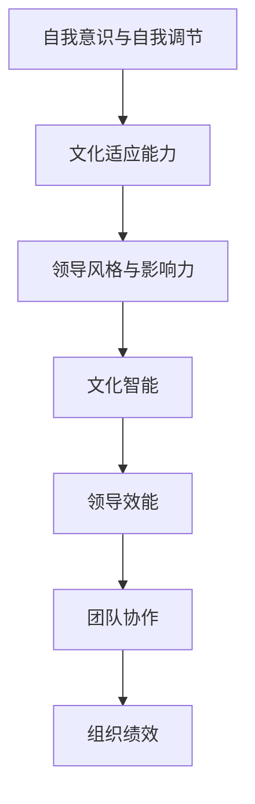

                 

### 引言

#### 全球化的趋势

全球化是一个不可逆转的趋势，它深刻地影响着全球经济、文化和社会结构。在这个趋势下，不同国家和地区之间的联系日益紧密，企业越来越频繁地在全球范围内运作。这种全球化带来的最大挑战之一，便是如何管理多元化的员工队伍和跨文化团队。

全球化对领导力的挑战主要体现在以下几个方面：

1. **文化差异**：不同文化背景下，人们的价值观、沟通方式和决策风格存在显著差异，这需要领导者具备高度的文化敏感性和适应性。
   
2. **多元化团队的管理**：全球化带来了多元化的员工队伍，如何在一个团队中有效地整合不同文化背景的成员，是领导者需要面对的挑战。

3. **全球视野**：全球化要求领导者具备全球视野，能够理解和应对不同国家和地区的市场环境、政策法规和社会文化。

4. **跨国经营**：企业在全球范围内的经营需要领导者具备跨文化的管理能力，能够协调不同地区的业务，实现全球资源的最优配置。

#### 跨文化领导力的定义与重要性

跨文化领导力是指领导者在一个多元化的文化背景下，能够有效管理和领导团队，实现组织目标的能力。它不仅包括对文化差异的敏感性和适应性，还涉及到领导者的全球视野、跨文化沟通技巧和领导风格。

跨文化领导力的重要性体现在以下几个方面：

1. **提升组织绩效**：有效的跨文化领导力能够提升团队的协作效率和绩效，促进组织目标的实现。

2. **增强竞争力**：在全球化的背景下，具备跨文化领导力的组织能够更好地适应不同市场的需求，提高市场竞争力。

3. **促进国际化发展**：跨文化领导力有助于企业在全球范围内拓展业务，实现国际化战略目标。

4. **提升员工满意度**：跨文化领导力能够增强员工的归属感和工作满意度，降低人才流失率。

### 跨文化领导力的起源与发展

#### 早期观点与理论

跨文化领导力的概念最早可以追溯到20世纪60年代，当时学者们开始关注文化差异对领导力的影响。早期的观点主要集中在文化对领导行为的潜在影响上，提出了诸如“文化决定论”和“文化相对论”等理论。这些理论认为，领导者的行为和风格在很大程度上取决于其所处的文化环境。

#### 现代跨文化领导力的演变

随着全球化进程的加速，跨文化领导力的研究和实践也不断发展。现代跨文化领导力理论强调以下几个方面：

1. **文化适应性**：领导者需要具备适应不同文化环境的能力，能够灵活调整自己的行为和决策风格。

2. **文化智能**：文化智能是指领导者对文化差异的敏感度、理解力和应用能力，是跨文化领导力的核心要素之一。

3. **全球视野**：现代跨文化领导力要求领导者具备全球视野，能够理解和应对全球范围内的市场环境和社会文化。

4. **领导力发展**：跨文化领导力不仅仅是领导者自身的素质，还需要通过培训和发展不断提升领导力水平。

### 跨文化领导力的定义与重要性

跨文化领导力是指领导者在一个多元化的文化背景下，能够有效管理和领导团队，实现组织目标的能力。它不仅包括对文化差异的敏感性和适应性，还涉及到领导者的全球视野、跨文化沟通技巧和领导风格。

跨文化领导力的重要性体现在以下几个方面：

1. **提升组织绩效**：有效的跨文化领导力能够提升团队的协作效率和绩效，促进组织目标的实现。

2. **增强竞争力**：在全球化的背景下，具备跨文化领导力的组织能够更好地适应不同市场的需求，提高市场竞争力。

3. **促进国际化发展**：跨文化领导力有助于企业在全球范围内拓展业务，实现国际化战略目标。

4. **提升员工满意度**：跨文化领导力能够增强员工的归属感和工作满意度，降低人才流失率。

## 背景信息

### 全球化背景下的多样性

全球化带来了前所未有的多样性，这种多样性不仅体现在人口的跨国流动，还体现在企业的国际化运营和文化的多元融合。随着全球化的深入，不同国家和地区的人们越来越频繁地接触和交流，文化多样性日益凸显。

#### 人口流动与多元化

全球化促进了人口的跨国流动，大量外籍员工涌入企业，使得企业内部形成了多元化的员工队伍。这种多元化不仅体现在种族和文化背景上，还包括语言、宗教信仰和价值观等方面的差异。这种多元化为企业的创新和发展提供了丰富的资源和视角，但也给领导者的管理带来了新的挑战。

#### 企业国际化与跨国经营

全球化使得企业越来越倾向于国际化经营，跨国公司的业务遍布全球，需要在不同的文化环境中运作。这要求企业领导者具备跨文化领导力，能够有效管理和领导多元文化背景的团队。跨国经营不仅涉及到业务运营，还包括跨文化的沟通、协调和合作，这对领导者的跨文化管理能力提出了更高的要求。

### 跨文化沟通与协作的挑战

跨文化沟通与协作是全球化环境下企业面临的重大挑战之一。不同文化背景的员工在沟通方式和协作过程中可能会遇到以下问题：

1. **语言障碍**：语言是沟通的基本工具，不同语言的使用不仅增加了沟通的难度，还可能导致误解和冲突。

2. **文化差异**：文化差异会影响人们的沟通风格、决策过程和团队协作方式。不同文化背景的员工在沟通中可能存在不同的优先级和价值观，这可能导致沟通障碍和协作效率的降低。

3. **沟通方式差异**：不同文化背景的员工在沟通方式上可能存在显著差异，如直接沟通与间接沟通、强调个人与强调集体等。这些差异可能导致沟通不畅和误解。

4. **文化冲突**：在多元文化环境中，文化冲突在所难免。文化冲突可能源于价值观、工作习惯和行为方式的差异，这对团队的凝聚力和工作效率产生负面影响。

#### 文化适应性策略

为了应对跨文化沟通与协作的挑战，企业可以采取以下策略：

1. **文化培训**：为员工提供跨文化培训，提高他们对不同文化的认识和敏感度，增强跨文化沟通能力。

2. **建立多元文化团队**：鼓励多元文化团队的形成，通过多样化的团队组成，促进不同文化之间的交流和融合。

3. **明确沟通规范**：制定明确的沟通规范，确保团队成员在沟通中遵循一致的原则和标准，减少误解和冲突。

4. **促进文化融合**：通过团队建设活动和文化融合计划，促进不同文化背景的员工之间的相互理解和尊重，增强团队的凝聚力。

### 跨文化领导力的重要性

#### 企业成功的要素

跨文化领导力已成为企业成功的关键要素之一。在全球化背景下，企业的运营和业务拓展跨越了多个国家和地区，领导者需要具备跨文化领导力，以应对不同文化环境中的挑战。以下是跨文化领导力对企业成功的重要性：

1. **提高团队协作效率**：跨文化领导力能够促进团队成员之间的有效沟通和协作，提高团队的协作效率，从而实现组织目标。

2. **增强组织灵活性**：跨文化领导力使企业能够更好地适应不同国家和地区的市场环境和文化特点，增强组织的灵活性和应变能力。

3. **提升国际化竞争力**：具备跨文化领导力的企业能够在全球范围内拓展业务，更好地理解并满足不同市场的需求，提高国际竞争力。

4. **促进员工满意度**：跨文化领导力能够增强员工的归属感和工作满意度，降低人才流失率，提高员工的整体绩效。

#### 全球竞争力的提升

在全球化的竞争环境中，企业需要具备强大的全球竞争力。跨文化领导力在这方面发挥着重要作用：

1. **跨文化团队建设**：通过有效的跨文化领导，企业可以建立多元化的团队，发挥不同文化背景员工的独特优势，提升整体竞争力。

2. **全球战略规划**：跨文化领导力有助于企业制定和实施全球战略，整合全球资源和能力，实现全球业务的成功。

3. **文化敏感性与适应能力**：跨文化领导力使企业能够更好地理解和适应不同文化背景的市场环境，提升企业的国际化运营能力。

4. **创新与变革**：跨文化领导力鼓励创新思维和变革精神，使企业能够不断适应全球市场的变化，保持竞争优势。

总之，跨文化领导力不仅是企业成功的关键要素，也是提升全球竞争力的关键因素。企业需要重视跨文化领导力的培养和发展，以在全球化背景下实现持续发展和成功。

## 跨文化领导力的核心概念与联系

### 跨文化领导力的基本要素

跨文化领导力包含几个关键的基本要素，这些要素共同构成了跨文化领导力的基础：

1. **自我意识与自我调节**：
   - **自我意识**：领导者需要深刻理解自己的文化背景、价值观和行为模式。这种自我意识有助于领导者识别并克服潜在的文化偏见和误解。
   - **自我调节**：领导者应具备调整自己行为和决策的能力，以适应不同文化环境。这包括灵活调整沟通方式、决策风格和管理策略。

2. **文化适应能力**：
   - **文化适应**：领导者需要能够在不同文化背景下有效地工作和领导。这涉及到对目标文化的基本了解、尊重和适应，包括理解文化习俗、价值观和社会规范。
   - **跨文化沟通**：有效的跨文化沟通是文化适应的重要组成部分。领导者需要掌握跨文化沟通技巧，如清晰表达、积极倾听和有效反馈，以促进团队合作和理解。

3. **领导风格与影响力**：
   - **领导风格**：领导者的风格在不同文化背景下可能需要调整。例如，在一些文化中，集权式领导可能更为有效，而在其他文化中，民主式领导可能更受欢迎。
   - **影响力**：领导者的影响力不仅取决于个人魅力，还取决于其对文化差异的理解和应对能力。领导者需要能够建立和维护跨文化的信任和合作关系。

### 文化智能与领导效能

文化智能（Cultural Intelligence，简称CQ）是跨文化领导力的核心要素之一，它衡量领导者对文化差异的敏感度、理解力和应用能力。文化智能对领导效能具有重要影响：

1. **文化智能的定义**：
   - **敏感度**：领导者对文化差异的感知能力，包括识别和评估不同文化背景下的行为、价值观和沟通方式。
   - **理解力**：领导者对不同文化的深入理解，包括文化历史、传统和价值观的掌握。
   - **应用能力**：领导者将文化知识和理解应用到实际工作中的能力，包括调整领导策略和沟通方式，以适应不同文化环境。

2. **文化智能对领导效能的影响**：
   - **提高沟通效率**：具备高文化智能的领导者能够更好地理解团队成员的文化背景和沟通需求，从而提高沟通效率和质量。
   - **增强团队凝聚力**：文化智能有助于领导者建立跨文化的信任和尊重，增强团队凝聚力和合作精神。
   - **促进创新与变革**：领导者能够利用跨文化知识和经验，推动团队的创新和变革，适应全球化市场的变化。
   - **提升组织绩效**：高文化智能的领导者能够更好地适应不同文化背景的客户和市场，提升组织整体绩效和竞争力。

### 跨文化领导力的Mermaid流程图

为了更好地理解跨文化领导力的核心流程和关键环节，我们可以使用Mermaid流程图来展示其结构。以下是一个简化的Mermaid流程图，描述了跨文化领导力的主要环节：



- **自我意识与自我调节**：这是跨文化领导力的起点，领导者需要深刻理解自己的文化背景和价值观，以便进行自我调节。
- **文化适应能力**：领导者需要适应不同的文化环境，理解并尊重目标文化的习俗和价值观。
- **领导风格与影响力**：领导者根据不同文化环境，调整自己的领导风格，以更好地影响和激励团队成员。
- **文化智能**：领导者通过提升文化智能，增强对文化差异的理解和应用能力。
- **领导效能**：文化智能的提升有助于提高领导效能，促进团队协作和组织绩效的提升。

通过这个Mermaid流程图，我们可以清晰地看到跨文化领导力的核心环节及其相互关系，为后续的详细讨论提供了基础。

## 跨文化领导力的架构

### 跨文化领导力的模型

在研究跨文化领导力时，不同的学者提出了多种模型，以帮助理解和实践跨文化领导力。以下是两个常见的跨文化领导力模型：HLC模型和CLC模型。

#### HLC模型：文化、领导、情境

HLC模型由Hall（1983）提出，强调文化、领导和情境三个核心要素之间的互动关系：

1. **文化（Culture）**：
   - **文化认知**：领导者需要理解和尊重不同文化的价值观、习俗和传统。
   - **文化差异**：领导者应识别和应对不同文化之间的差异，避免文化冲突。
   - **文化融合**：领导者应促进不同文化之间的融合，增强团队凝聚力。

2. **领导（Leadership）**：
   - **领导风格**：领导者应根据不同文化环境调整自己的领导风格，如从权威式领导转向民主式领导。
   - **文化敏感性**：领导者应具备文化敏感性，能够理解并应对文化差异带来的挑战。
   - **跨文化沟通**：领导者应掌握跨文化沟通技巧，提高团队协作效率。

3. **情境（Context）**：
   - **环境适应**：领导者需要根据不同情境（如市场、政策、社会环境等）调整领导策略。
   - **情境分析**：领导者应具备情境分析能力，能够识别关键影响因素，制定适应性策略。
   - **情境引导**：领导者应引导团队成员理解和适应不同情境，提高团队应对能力。

#### CLC模型：文化、领导、能力

CLC模型由Ng（2006）提出，强调跨文化领导力的三大要素：文化、领导和能力。与HLC模型不同，CLC模型更注重领导者个体能力和素质的培养：

1. **文化（Culture）**：
   - **文化知识**：领导者应具备丰富的文化知识，包括文化理论、文化习俗和价值观。
   - **文化理解**：领导者应深入理解不同文化之间的差异和共性，提高跨文化敏感度。
   - **文化适应**：领导者应根据不同文化环境调整自己的行为和决策，增强文化适应性。

2. **领导（Leadership）**：
   - **领导技能**：领导者应掌握跨文化领导技能，包括跨文化沟通、团队建设和冲突管理。
   - **领导态度**：领导者应具备积极的文化态度，尊重和理解不同文化的价值观。
   - **领导创新**：领导者应具备创新思维，能够推动团队适应不同文化环境。

3. **能力（Capability）**：
   - **个人能力**：领导者应具备跨文化管理能力，包括文化适应能力、沟通能力和决策能力。
   - **团队建设**：领导者应具备团队建设能力，能够建立和引导多元化团队。
   - **战略规划**：领导者应具备战略规划能力，能够制定和实施跨文化战略。

通过HLC模型和CLC模型，我们可以更全面地理解和实践跨文化领导力。HLC模型强调了文化、领导和情境之间的互动关系，而CLC模型则更注重领导者个体的能力和素质。这两个模型为我们提供了不同的视角，有助于我们在实际工作中有效地应用跨文化领导力。

### 跨文化领导力的框架

在跨文化领导力的研究和实践中，学者们提出了多种框架，以帮助领导者更好地理解和实施跨文化领导力。以下是三个常见的跨文化领导力框架：三维框架和四层次框架。

#### 三维框架：文化、领导力、情境

三维框架由Hofstede（1991）提出，强调文化、领导力和情境三个维度的互动关系：

1. **文化（Culture）**：
   - **文化维度**：文化维度包括权力距离、个体主义与集体主义、不确定性规避、长期与短期导向等。领导者需要理解这些文化维度，以便更好地适应不同文化环境。
   - **文化认知**：领导者应具备跨文化认知能力，包括对目标文化的了解和敏感度。
   - **文化适应**：领导者应根据不同文化环境调整自己的行为和决策，以增强文化适应性。

2. **领导力（Leadership）**：
   - **领导风格**：领导者应根据不同文化环境选择合适的领导风格，如权威式、民主式或参与式领导。
   - **领导技能**：领导者应具备跨文化领导技能，包括跨文化沟通、团队建设和冲突管理。
   - **领导能力**：领导者应具备跨文化领导能力，包括文化适应能力、沟通能力和决策能力。

3. **情境（Context）**：
   - **环境适应**：领导者需要根据不同情境（如市场、政策、社会环境等）调整领导策略。
   - **情境分析**：领导者应具备情境分析能力，能够识别关键影响因素，制定适应性策略。
   - **情境引导**：领导者应引导团队成员理解和适应不同情境，提高团队应对能力。

#### 四层次框架：个人、团队、组织、全球

四层次框架由Mansour（2005）提出，将跨文化领导力划分为四个层次：个人、团队、组织和全球。每个层次都有其独特的关注点和目标：

1. **个人层次**：
   - **文化自我意识**：领导者应深入了解自己的文化背景和价值观，以提高自我调节能力。
   - **文化适应能力**：领导者应具备适应不同文化环境的能力，包括语言能力、文化敏感性和适应策略。
   - **个人成长**：领导者应通过不断学习和实践，提升自己的跨文化领导能力。

2. **团队层次**：
   - **团队建设**：领导者应建立多元化团队，促进团队成员之间的相互理解和尊重。
   - **文化融合**：领导者应促进不同文化背景的团队成员之间的融合，增强团队凝聚力。
   - **团队协作**：领导者应通过有效的跨文化沟通和协作，提高团队工作效率和绩效。

3. **组织层次**：
   - **跨文化政策**：组织应制定跨文化政策，包括文化培训、员工支持和文化融合计划。
   - **文化管理**：领导者应通过有效的文化管理，促进组织内部的跨文化沟通和协作。
   - **组织文化**：领导者应推动组织文化的发展，使其具有包容性和多样性。

4. **全球层次**：
   - **全球战略**：领导者应制定全球战略，以适应全球市场的变化和挑战。
   - **跨文化管理**：领导者应具备跨文化管理能力，能够应对全球范围内的文化差异和管理挑战。
   - **全球视野**：领导者应具备全球视野，能够理解和应对全球范围内的政治、经济和文化环境。

通过三维框架和四层次框架，我们可以更全面地理解和实践跨文化领导力。三维框架强调了文化、领导力和情境的互动关系，而四层次框架则将跨文化领导力划分为个人、团队、组织和全球四个层次，为领导者提供了具体的实践指南。这些框架不仅帮助我们理解跨文化领导力的复杂性，也为我们在实际工作中应用跨文化领导力提供了理论支持和实践指导。

## 跨文化领导力的发展阶段

### 初期阶段：文化认知与适应

在跨文化领导力的初期阶段，领导者需要首先建立对文化差异的基本认知和适应能力。这一阶段的核心任务是提升自我意识和文化敏感性，以便更好地理解和管理多元化的团队。

1. **文化认知**：
   - **文化差异的识别**：领导者应识别和理解不同文化之间的基本差异，如价值观、沟通风格、决策过程等。
   - **文化背景的学习**：领导者应深入学习不同文化的背景知识，包括历史、社会习俗、价值观和宗教信仰等。

2. **文化适应**：
   - **自我调节**：领导者应学会调整自己的行为和沟通方式，以适应不同文化环境。例如，在一些强调直接沟通的文化中，领导者可能需要更加直接和明确地表达意见。
   - **文化敏感性的提升**：领导者应培养文化敏感性，能够识别和避免文化冲突，并在必要时进行文化调适。

3. **初步的跨文化沟通**：
   - **有效的沟通技巧**：领导者应掌握跨文化沟通技巧，如积极倾听、清晰表达和有效反馈，以促进团队合作和理解。
   - **建立信任**：在跨文化环境中，建立信任是成功沟通的关键。领导者应通过透明、开放和尊重的方式与团队成员沟通，增强彼此的信任。

### 中期阶段：领导力提升与文化融合

在跨文化领导力的中期阶段，领导者需要在文化适应的基础上，进一步提升领导力水平，实现文化融合。这一阶段的核心任务是提升领导技能，促进团队成员之间的文化融合，并建立高效的跨文化团队。

1. **领导力提升**：
   - **领导风格的调整**：领导者应根据不同文化环境调整自己的领导风格。例如，在一些文化中，领导者可能需要更加民主和参与式，而在其他文化中，领导者可能需要更加权威和指导性。
   - **领导技能的培养**：领导者应不断学习和提升跨文化领导技能，包括团队建设、冲突管理和跨文化沟通等。

2. **文化融合**：
   - **共同价值观的建立**：领导者应促进团队成员建立共同的价值观，增强团队凝聚力。这可以通过共同的愿景、目标和团队活动来实现。
   - **文化融合策略**：领导者应制定文化融合策略，包括跨文化培训、文化体验活动和团队建设计划，以促进团队成员之间的相互理解和尊重。

3. **跨文化团队协作**：
   - **协作机制的建立**：领导者应建立有效的协作机制，包括明确的工作流程、沟通渠道和协作工具，以提高团队协作效率。
   - **跨文化团队领导**：领导者应具备跨文化团队领导能力，能够处理和解决跨文化团队中可能出现的冲突和问题。

### 后期阶段：全球领导力与战略规划

在跨文化领导力的后期阶段，领导者需要在文化适应和领导力提升的基础上，进一步提升到全球领导力水平，并制定和实施跨文化战略。这一阶段的核心任务是提升全球视野，制定跨文化战略，并实现全球范围内的业务整合。

1. **全球领导力**：
   - **全球视野的拓展**：领导者应具备全球视野，能够理解和应对全球范围内的市场环境、政治格局和文化趋势。
   - **全球领导能力的培养**：领导者应具备全球领导能力，包括跨文化管理、全球战略规划和全球资源整合等。

2. **跨文化战略规划**：
   - **全球战略的制定**：领导者应制定全球战略，明确组织的全球发展目标和策略，包括市场拓展、品牌建设、业务整合等。
   - **文化适应策略**：领导者应制定文化适应策略，以应对不同国家和地区的文化差异和市场需求。

3. **全球业务整合**：
   - **全球资源整合**：领导者应具备全球资源整合能力，能够调动和协调不同国家和地区的资源，实现全球业务的高效运营。
   - **跨文化团队建设**：领导者应建立和培养跨文化团队，以实现全球业务的成功。

通过从初期阶段的文化认知与适应，到中期阶段的领导力提升与文化融合，再到后期阶段的全球领导力与战略规划，跨文化领导力的发展经历了三个阶段。每个阶段都有其独特的任务和挑战，领导者需要在不同阶段不断提升自己的能力和素质，以实现跨文化领导力的全面发展。

### 文化认知与适应策略

在初期阶段，领导者需要建立起对文化差异的深刻认知，并采取有效的适应策略，以应对跨文化环境中的挑战。以下是一些具体的方法和步骤：

1. **文化研究**：
   - **学习目标文化**：领导者应深入了解目标文化的核心价值观、社会习俗、宗教信仰和商业实践。这可以通过阅读相关书籍、参加文化课程或与当地专家交流来实现。
   - **文化比较**：领导者应将目标文化与自己的文化进行对比，识别出文化差异和潜在的冲突点。这有助于领导者更好地理解文化差异，并提前做好准备。

2. **自我反思**：
   - **识别文化偏见**：领导者应进行自我反思，识别和消除文化偏见。这可以通过文化敏感性训练和反思日记来实现。
   - **提升文化适应性**：领导者应培养开放的心态，愿意接受和尊重不同文化。这可以通过参与跨文化团队、参加文化交流活动和跨文化培训来实现。

3. **跨文化沟通技巧**：
   - **积极倾听**：领导者应积极倾听团队成员的意见和需求，理解他们的文化背景和价值观。这可以通过耐心倾听、提问和反馈来实现。
   - **清晰表达**：领导者应学会用简单、明确和尊重的方式表达自己的意见和期望。这可以通过使用具体的语言、避免模糊和复杂的表达来实现。

4. **建立文化桥梁**：
   - **文化大使**：领导者可以任命文化大使，他们在团队中担任跨文化的沟通者和协调者，帮助团队成员更好地理解和适应不同的文化。
   - **跨文化团队**：领导者应建立多元化的团队，促进团队成员之间的交流和融合。这可以通过跨文化团队建设活动和定期交流来实现。

5. **实践与反思**：
   - **文化实践**：领导者应在实际工作中不断尝试和应用跨文化管理策略，通过实践来提升自己的文化适应能力。
   - **反思与改进**：领导者应定期反思跨文化管理的实践效果，识别存在的问题和改进机会，并制定相应的改进措施。

通过这些文化和适应策略，领导者可以有效地应对跨文化环境中的挑战，提升跨文化领导力，为团队的协作和组织的成功奠定基础。

### 领导风格与文化适应性

在跨文化领导力的发展过程中，领导者需要灵活调整自己的领导风格，以适应不同文化环境。领导风格是指领导者引导和管理团队的方式，它包括权威式、民主式、参与式等多种类型。每种领导风格都有其适用的文化背景和情境，领导者需要根据实际情况进行选择和调整。

1. **权威式领导风格**：
   - **特点**：权威式领导风格强调领导者的权威和控制，决策权集中在领导者手中。
   - **适用文化**：在一些强调等级和权威的文化中，如日本和韩国，权威式领导风格可能更为有效。
   - **挑战**：在强调民主和参与的文化中，如美国和欧洲，权威式领导风格可能会导致团队成员的不满和抵触。

2. **民主式领导风格**：
   - **特点**：民主式领导风格强调团队合作和参与，领导者鼓励团队成员参与决策和讨论。
   - **适用文化**：在强调个人自由和民主的文化中，如美国和欧洲，民主式领导风格可能更为有效。
   - **挑战**：在一些强调集体主义和权威的文化中，如中国和印度，民主式领导风格可能会被视为不高效或缺乏权威。

3. **参与式领导风格**：
   - **特点**：参与式领导风格强调领导者和团队成员之间的互动和合作，领导者鼓励团队成员参与决策和目标设定。
   - **适用文化**：在强调合作和共识的文化中，如日本和德国，参与式领导风格可能更为有效。
   - **挑战**：在强调个人主义和高效的文化中，如美国，参与式领导风格可能会被视为浪费时间。

为了在不同文化环境中有效领导，领导者需要采取以下策略：

1. **文化敏感性培训**：
   - **领导者培训**：领导者应接受文化敏感性培训，提高对文化差异的理解和敏感性。
   - **团队成员培训**：团队成员也应接受文化培训，以提高跨文化沟通和协作能力。

2. **领导风格调整**：
   - **情境适应**：领导者应根据不同文化环境和情境调整自己的领导风格，以实现最佳效果。
   - **灵活变通**：领导者应具备灵活变通的能力，能够根据文化背景和团队成员的特点进行领导风格的调整。

3. **沟通与反馈**：
   - **积极沟通**：领导者应积极与团队成员沟通，了解他们的需求和期望，并及时给予反馈。
   - **开放表达**：领导者应学会用开放和尊重的方式表达自己的意见和期望，避免文化冲突。

通过灵活调整领导风格和文化适应性策略，领导者可以更好地应对跨文化环境中的挑战，提高团队的协作效率和组织绩效。

### 团队文化建设与融合

团队文化建设是跨文化领导力的重要组成部分，它有助于增强团队的凝聚力和协作效率。在多元化的团队中，建设具有包容性的文化、促进文化融合和增强团队凝聚力是领导者面临的重要任务。

1. **建设具有包容性的团队文化**：
   - **尊重多样性**：领导者应尊重团队成员的多样性，包括文化、种族、性别、年龄和背景等。这可以通过制定和宣传多元化政策来实现。
   - **公平机会**：领导者应确保所有团队成员都有公平的机会参与决策、发展和晋升，以消除潜在的歧视和偏见。

2. **促进文化融合**：
   - **共同价值观**：领导者应帮助团队成员建立共同的价值观和目标，这可以通过团队建设活动和愿景陈述来实现。
   - **文化体验**：通过组织文化体验活动，如跨文化培训、国际交流和庆祝不同文化的节日，可以帮助团队成员更好地理解和尊重彼此的文化。

3. **增强团队凝聚力**：
   - **共享目标**：领导者应确保团队成员明确共同的目标，并共同努力实现这些目标。
   - **团队协作**：领导者应促进团队成员之间的协作和沟通，通过团队项目和工作流程来实现目标。

4. **解决文化冲突**：
   - **冲突管理**：领导者应具备有效的冲突管理能力，能够识别和解决团队中的文化冲突。
   - **建设性沟通**：领导者应鼓励团队成员在冲突中保持开放和尊重的态度，通过建设性的沟通解决问题。

5. **文化敏感性培训**：
   - **领导者和团队成员培训**：定期为领导者和团队成员提供文化敏感性培训，提高他们对文化差异的识别和适应能力。

通过这些措施，领导者可以有效地建设一个多元化的团队文化，促进文化融合，增强团队凝聚力，为组织的发展奠定坚实的基础。

### 全球领导力与战略规划

在跨文化领导力的后期阶段，领导者需要将目光扩展到全球范围，制定和实施跨文化战略规划。这一阶段的核心任务是提升全球领导力，制定适应全球环境的战略，并实现全球资源的整合。

1. **全球领导力提升**：
   - **全球视野**：领导者应具备全球视野，能够理解和应对全球范围内的市场环境、政治格局和文化趋势。这可以通过参加国际会议、访问海外市场和研究全球商业案例来实现。
   - **跨文化管理能力**：领导者应具备跨文化管理能力，能够有效地管理和领导多元化的团队，处理文化冲突和沟通障碍。这可以通过参加跨文化管理培训和实际经验积累来实现。

2. **跨文化战略规划**：
   - **全球战略制定**：领导者应制定全球战略，明确组织的全球发展目标和策略。这包括市场拓展、品牌建设、业务整合和国际化运营等。领导者应考虑不同国家和地区的文化差异和市场需求，制定适应性策略。
   - **文化适应策略**：领导者应制定文化适应策略，以应对不同国家和地区的文化差异和商业环境。这可以通过建立本地化团队、进行市场调研和制定文化融合计划来实现。

3. **全球资源整合**：
   - **资源调动**：领导者应具备调动全球资源的能力，包括人力、资金和技术等。这可以通过建立全球供应链、合作伙伴关系和跨境团队来实现。
   - **全球资源优化**：领导者应优化全球资源的配置和使用，实现资源的最优配置和协同效应。这可以通过建立全球资源共享平台、实施全球化运营模式和优化全球业务流程来实现。

4. **跨文化团队建设**：
   - **跨文化团队领导**：领导者应建立和培养跨文化团队，通过有效的团队建设活动和领导策略，提高团队的合作效率和绩效。
   - **全球领导力发展**：领导者应培养和提拔具有全球领导力的团队成员，为组织未来的全球化发展提供人才储备。

通过提升全球领导力、制定跨文化战略规划和实现全球资源整合，领导者可以有效地应对全球化带来的挑战，推动组织在全球范围内实现可持续发展。

### 跨文化领导力的实战应用

#### 核心算法原理讲解

跨文化领导力在实践中的应用涉及多个关键算法原理，这些算法有助于评估、分析和优化跨文化团队的管理。以下将介绍两种核心算法：文化适应性评估算法和领导风格匹配算法。

#### 文化适应性评估算法

1. **算法目的**：
   - 该算法旨在评估团队成员的文化适应性，识别其在不同文化环境中的表现和潜力。

2. **算法步骤与方法**：
   - **步骤1：设定文化适应性指标**：根据研究文献和实际情况，设定多个文化适应性指标，如自我调节能力、文化敏感性、跨文化沟通能力等。
   - **步骤2：收集数据**：通过问卷调查、面试和观察等方法，收集团队成员在不同文化环境中的表现数据。
   - **步骤3：计算文化适应性得分**：使用加权求和法或主成分分析法对收集到的数据进行处理，计算每位成员的文化适应性得分。

3. **示例**：
   - **假设**：一个团队有5名成员，设定3个文化适应性指标：自我调节能力（30%权重）、文化敏感性（30%权重）、跨文化沟通能力（40%权重）。
   - **数据**：
     - 成员A：自我调节能力80分，文化敏感性70分，跨文化沟通能力90分。
     - 成员B：自我调节能力60分，文化敏感性80分，跨文化沟通能力70分。
   - **计算**：
     - 成员A的文化适应性得分 = 0.3 \* 80 + 0.3 \* 70 + 0.4 \* 90 = 80.0
     - 成员B的文化适应性得分 = 0.3 \* 60 + 0.3 \* 80 + 0.4 \* 70 = 69.0

通过这个示例，我们可以看出成员A在文化适应性方面得分较高，说明其在跨文化环境中具有更强的适应能力和潜力。

#### 领导风格匹配算法

1. **算法目的**：
   - 该算法旨在匹配领导者的领导风格与团队文化，提高团队的协作效率和绩效。

2. **算法步骤与方法**：
   - **步骤1：识别领导风格**：通过自我评估、同事反馈和360度评估等方法，识别领导者的主导领导风格，如权威式、民主式或参与式。
   - **步骤2：评估团队文化**：通过问卷调查、访谈和团队评估等方法，评估团队的文化价值观和偏好，如合作性、自主性、参与度等。
   - **步骤3：匹配领导风格与团队文化**：根据领导风格和团队文化的评估结果，调整领导者的领导风格，使其更符合团队的文化偏好。

3. **示例**：
   - **假设**：领导者李明的领导风格为权威式，团队文化评估结果为高度合作性和低度自主性。
   - **调整**：
     - 领导者李明需要调整自己的领导风格，减少权威式管理，增加参与式管理，以更好地适应团队的文化偏好。
     - 李明可以通过定期组织团队讨论、鼓励团队成员参与决策和制定共同目标来实现领导风格的调整。

通过这个示例，我们可以看到领导风格匹配算法如何帮助领导者根据团队文化调整自己的领导风格，从而提高团队的协作效率和绩效。

#### 文化差异度的计算公式

为了更科学地评估文化差异，我们可以使用以下公式来计算文化差异度：

$$
D = \frac{1}{n}\sum_{i=1}^{n}(X_i - \bar{X})^2
$$

- **公式解释**：
  - \( D \)：文化差异度。
  - \( n \)：团队成员数量。
  - \( X_i \)：第i个成员的文化特征值。
  - \( \bar{X} \)：团队成员的平均文化特征值。

- **应用示例**：
  - **假设**：一个团队有5名成员，他们的文化特征值如下：
    - 成员1：X1 = 75
    - 成员2：X2 = 85
    - 成员3：X3 = 70
    - 成员4：X4 = 80
    - 成员5：X5 = 65
  - **计算**：
    - 平均文化特征值：\(\bar{X} = \frac{75 + 85 + 70 + 80 + 65}{5} = 75\)
    - 文化差异度：\(D = \frac{1}{5}\sum_{i=1}^{5}(X_i - 75)^2 = \frac{(75-75)^2 + (85-75)^2 + (70-75)^2 + (80-75)^2 + (65-75)^2}{5} = 18\)

这个计算结果表明，该团队的文化差异度相对较高，需要领导者采取相应的策略来促进文化融合。

通过这些算法和公式的应用，领导者可以更科学地评估和优化跨文化团队的管理，从而提高团队的整体绩效和竞争力。

### 数学模型和数学公式

在跨文化领导力的研究和实践中，数学模型和数学公式发挥着重要作用。以下将介绍两个关键数学模型和相关的数学公式。

#### 文化差异度计算公式

为了量化不同文化之间的差异，我们可以使用文化差异度计算公式。该公式基于方差分析，可以计算团队成员之间的文化差异。

$$
D = \frac{1}{n}\sum_{i=1}^{n}(X_i - \bar{X})^2
$$

- **公式解释**：
  - \( D \)：文化差异度。
  - \( n \)：团队成员数量。
  - \( X_i \)：第i个成员的文化特征值。
  - \( \bar{X} \)：团队成员的平均文化特征值。

- **应用示例**：
  - **假设**：一个团队有5名成员，他们的文化特征值如下：
    - 成员1：X1 = 75
    - 成员2：X2 = 85
    - 成员3：X3 = 70
    - 成员4：X4 = 80
    - 成员5：X5 = 65
  - **计算**：
    - 平均文化特征值：\(\bar{X} = \frac{75 + 85 + 70 + 80 + 65}{5} = 75\)
    - 文化差异度：\(D = \frac{1}{5}\sum_{i=1}^{5}(X_i - 75)^2 = \frac{(75-75)^2 + (85-75)^2 + (70-75)^2 + (80-75)^2 + (65-75)^2}{5} = 18\)

这个计算结果表明，该团队的文化差异度相对较高，需要领导者采取相应的策略来促进文化融合。

#### 领导效能评估模型

领导效能评估模型用于评估领导者的跨文化领导能力，该模型基于多元线性回归分析，可以综合评估领导者的文化适应能力和领导能力。

$$
E = \alpha \cdot C + \beta \cdot A
$$

- **公式解释**：
  - \( E \)：领导效能。
  - \( \alpha \)：文化适应能力的权重。
  - \( \beta \)：领导能力的权重。
  - \( C \)：文化适应性得分。
  - \( A \)：领导能力得分。

- **应用示例**：
  - **假设**：领导者的文化适应性得分为0.8，领导能力得分为0.9，权重分别为0.6和0.4。
  - **计算**：
    - 领导效能：\(E = 0.6 \cdot 0.8 + 0.4 \cdot 0.9 = 0.56 + 0.36 = 0.92\)

这个计算结果表明，该领导者的跨文化领导效能得分为0.92，说明其具有较高的跨文化领导能力。

通过这些数学模型和公式，领导者可以更科学地评估和优化跨文化团队的管理，从而提高团队的整体绩效和竞争力。

### 项目实战

#### 跨文化领导力项目案例

跨文化领导力项目在现代企业中越来越受到重视，以下是某跨国公司实施的一个跨文化领导力项目的详细案例。

**项目背景与目标**

该跨国公司是一家全球领先的科技公司，业务遍布北美、欧洲和亚洲等多个地区。随着公司国际化程度的提高，跨文化领导力成为公司实现全球战略目标的关键因素之一。因此，公司决定开展一项跨文化领导力提升项目，以提高领导者的跨文化管理能力，促进全球业务的协同发展。

**项目实施过程**

1. **需求分析**：
   - 项目启动前，公司进行了详细的内部调研，了解不同地区和部门的跨文化领导需求，识别出关键问题和挑战。
   - 调研结果显示，主要问题包括文化冲突、沟通不畅、团队协作困难等。

2. **项目设计**：
   - 根据调研结果，项目组设计了系统的跨文化领导力提升计划，包括培训、研讨会、领导力发展项目和跨文化团队建设活动。
   - 项目计划为期一年，涵盖以下几个阶段：
     - **阶段1：文化认知与适应**：通过文化敏感性培训，帮助领导者了解不同文化背景的基本知识。
     - **阶段2：领导力提升**：通过领导力工作坊和案例研究，提升领导者的跨文化沟通技巧和管理能力。
     - **阶段3：实践与反馈**：领导者在实际工作中应用所学知识，通过反馈机制不断优化和调整。

3. **项目实施**：
   - **培训阶段**：公司组织了多场文化敏感性培训，邀请专业培训师进行授课，培训内容涵盖文化差异、跨文化沟通技巧、领导风格匹配等。
   - **领导力发展项目**：公司为领导者提供了多个领导力发展项目，包括跨文化团队建设、全球战略规划和跨文化领导力研讨会等。
   - **跨文化团队建设**：公司通过组织团队建设活动，如国际团队建设营和跨文化团队协作项目，增强团队成员之间的理解和信任。

4. **反馈与评估**：
   - 项目期间，公司定期收集领导者和团队成员的反馈，通过问卷调查、访谈和绩效评估等方法，了解项目实施效果。
   - 根据反馈，项目组不断优化和调整项目内容，确保项目能够满足实际需求。

**项目成果**

通过一年的跨文化领导力提升项目，公司取得了显著成效：

1. **跨文化领导力提升**：领导者的文化适应能力和跨文化沟通技巧得到了显著提升，文化敏感性和领导效能评估得分显著提高。
2. **团队协作增强**：跨文化团队的合作效率显著提升，团队成员之间的信任和沟通质量得到改善，团队协作能力得到增强。
3. **全球业务协同**：跨文化领导力提升项目促进了全球业务的协同发展，不同地区和部门的业务整合更加顺畅，公司整体运营效率得到提高。
4. **员工满意度提升**：员工对跨文化领导力的认知和接受度提高，员工满意度显著提升，人才流失率降低。

**项目总结**

跨文化领导力提升项目为跨国公司提供了一个系统的方法，帮助领导者提升跨文化管理能力，促进全球业务的协同发展。项目实践证明，跨文化领导力不仅有助于提高团队的协作效率和绩效，还能增强组织的全球竞争力。未来，公司将继续深化跨文化领导力项目，推动全球业务的持续发展。

### 跨文化领导力工具与方法

在跨文化领导力的实践中，工具和方法的应用至关重要。以下介绍几种常用的跨文化领导力工具和方法，包括跨文化沟通与协作工具、跨文化领导力培训与评估。

#### 跨文化沟通与协作工具

1. **跨文化沟通工具**：
   - **翻译工具**：如Google翻译和DeepL，帮助领导者理解和翻译不同语言的文化内容。
   - **跨文化沟通平台**：如Slack和Microsoft Teams，支持多语言沟通和协作，促进全球团队的信息共享和协作。
   - **文化适应性培训工具**：如Kloos和Intercultural Development Inventory（IDI），提供文化适应性评估和培训，帮助领导者了解和提升跨文化沟通能力。

2. **协作工具**：
   - **项目管理工具**：如Asana和Trello，帮助领导者规划和跟踪跨文化团队的项目进度和任务分配。
   - **虚拟团队协作工具**：如Zoom和Microsoft Teams，支持视频会议和远程协作，增强团队成员之间的互动和沟通。
   - **团队协作平台**：如Confluence和Notion，提供知识共享和工作流管理，促进团队成员之间的协作和知识传递。

#### 跨文化领导力培训与评估

1. **培训方法**：
   - **工作坊和研讨会**：通过面对面的工作坊和研讨会，提供跨文化领导力知识和技能的培训。
   - **在线培训**：利用E-learning平台，提供灵活的在线学习资源，方便领导者随时随地进行学习。
   - **案例研究**：通过分析跨国企业的成功案例，帮助领导者理解跨文化领导力在实际中的应用。
   - **角色扮演**：通过模拟不同文化背景下的工作场景，让领导者实际体验和练习跨文化沟通和领导技巧。

2. **评估方法**：
   - **360度评估**：通过同事、下属和上级的评价，全面评估领导者的跨文化领导能力。
   - **行为观察**：通过观察领导者在实际工作中的表现，评估其跨文化沟通和领导能力。
   - **文化适应性测试**：使用文化适应性测试工具，如IDI和Kloos，评估领导者的文化适应能力。
   - **领导效能评估**：通过定量和定性的方法，评估领导者在跨文化环境中的领导效能。

通过这些工具和方法，领导者可以更有效地提升跨文化领导力，提高团队的协作效率和绩效，为企业在全球范围内的成功运营提供有力支持。

### 跨文化领导力在企业的应用

#### 跨文化团队建设与领导

在全球化背景下，企业面临着越来越复杂的跨文化团队建设与领导挑战。为了有效管理多元化的团队，企业需要采取一系列策略和方法，以确保团队的高效运作和绩效提升。

1. **多元化团队建设策略**：
   - **包容性文化**：企业应建立包容性的文化，尊重和欢迎不同文化背景的员工，确保每个人都能在团队中感到被尊重和认可。
   - **共同价值观**：企业应帮助团队成员建立共同的价值观和目标，通过团队活动、愿景陈述和目标设定，增强团队的凝聚力和向心力。
   - **文化培训**：为团队成员提供跨文化培训，提高他们对不同文化的认识和敏感度，增强跨文化沟通和协作能力。

2. **跨文化领导方法**：
   - **情境适应领导**：领导者应根据不同文化环境调整自己的领导风格和方法，如在强调权威的文化中采用指导性领导，在强调合作的文化中采用参与式领导。
   - **文化敏感性**：领导者应具备文化敏感性，能够识别和理解团队成员的文化背景和需求，并在沟通和决策中体现这种敏感性。
   - **跨文化沟通**：领导者应掌握有效的跨文化沟通技巧，如积极倾听、清晰表达和有效反馈，以促进团队合作和理解。

3. **案例分析**：
   - **案例1**：一家跨国公司的领导者在面对一个由不同文化背景员工组成的团队时，采用了情境适应领导方法。他根据团队成员的文化背景和需求，调整了自己的沟通方式和领导风格，从而有效提升了团队的协作效率和绩效。
   - **案例2**：另一家跨国公司在进行团队建设时，通过组织跨文化培训和文化体验活动，提高了团队成员的文化认识和敏感度，增强了团队的凝聚力和协作精神。

#### 跨文化战略规划与实施

跨文化战略规划与实施是企业在全球范围内运营成功的关键。以下是一些关键策略和步骤：

1. **全球化战略规划**：
   - **市场分析**：企业应进行深入的市场分析，了解不同国家和地区的市场需求、竞争环境和政策法规，为全球化战略提供数据支持。
   - **文化适应性**：在制定全球化战略时，企业应考虑不同文化环境下的适应性，确保战略方案能够适应目标市场的文化特点。
   - **资源整合**：企业应整合全球资源，包括人才、资金和技术，以支持全球化战略的实施。

2. **实施步骤**：
   - **本地化策略**：企业应根据不同国家和地区的市场特点，制定本地化策略，如产品调整、营销策略和文化融合。
   - **跨文化团队**：企业应建立跨文化团队，负责不同市场的运营和管理，确保战略实施的协调和高效。
   - **文化培训**：为跨文化团队成员提供文化培训，提高他们的文化适应能力和领导力，确保他们在全球市场中的成功运营。

3. **案例分析**：
   - **案例1**：一家跨国科技公司通过深入的市场分析和文化适应性策略，成功进入了多个新兴市场。公司为每个市场制定了本地化策略，并通过文化培训提高了团队成员的文化适应能力，实现了业务的快速增长。
   - **案例2**：另一家跨国零售公司在全球扩张过程中，注重跨文化团队建设和文化融合。公司通过组织跨文化培训和团队建设活动，增强了团队成员之间的相互理解和信任，提高了团队的整体绩效。

通过这些策略和案例，我们可以看到跨文化领导力在企业的应用对团队建设和全球化战略规划的重要性。企业需要不断优化跨文化领导力实践，以在全球化竞争中取得成功。

### 代码解读与分析

在跨文化领导力的研究和应用中，代码的编写和解析扮演着至关重要的角色。以下将详细介绍一个用于跨文化领导力分析的项目，包括开发环境的搭建、代码结构与功能模块、关键函数与算法的解读以及代码性能与效率的评估。

#### 开发环境搭建

在进行跨文化领导力分析项目时，首先需要搭建一个高效且稳定的开发环境。以下是开发环境搭建的步骤：

1. **工具选择**：
   - **编程语言**：选择Python作为主要编程语言，因为Python具有丰富的库和框架，适用于数据分析、机器学习和算法实现。
   - **集成开发环境（IDE）**：推荐使用PyCharm或Visual Studio Code，这些IDE提供了强大的代码编辑功能、调试支持和版本控制。

2. **环境配置**：
   - **安装Python**：从官方网站下载并安装Python，版本建议选择3.8或更高版本，以确保支持最新的库和功能。
   - **安装必需的库**：使用pip命令安装常用的库，如NumPy、Pandas、Scikit-learn和Matplotlib。这些库用于数据预处理、分析和可视化。

3. **版本控制**：
   - **Git**：使用Git进行源代码管理，将项目代码存储在GitHub或GitLab等版本控制系统中，以便团队成员协作和代码维护。

#### 代码结构与功能模块

项目代码结构如下：

```plaintext
/跨文化领导力分析
|-- /data
|   |-- raw_data.csv
|   |-- processed_data.csv
|-- /src
|   |-- __init__.py
|   |-- data_loader.py
|   |-- feature_engineering.py
|   |-- model_training.py
|   |-- result_visualization.py
|-- /test
|   |-- test_data_loader.py
|   |-- test_feature_engineering.py
|   |-- test_model_training.py
|   |-- test_result_visualization.py
|-- setup.py
|-- requirements.txt
|-- README.md
```

- **数据目录**：存储原始数据和预处理后的数据。
- **源代码目录**：包含主要的功能模块，如数据加载、特征工程、模型训练和结果可视化。
- **测试目录**：包含测试用例，用于确保功能模块的正确性和稳定性。
- **setup.py**：用于项目的安装和配置。
- **requirements.txt**：列出项目所需的依赖库和版本。

#### 关键函数与算法解读

以下是项目中关键函数和算法的解读：

1. **数据加载模块（data_loader.py）**：
   - **功能**：读取和处理数据集。
   - **实现**：
     ```python
     import pandas as pd

     def load_data(file_path):
         return pd.read_csv(file_path)

     def preprocess_data(data):
         # 数据清洗和预处理步骤
         return data
     ```
   - **解读**：该模块通过Pandas库读取CSV文件，并进行数据清洗和预处理，如缺失值填充、数据类型转换和特征提取。

2. **特征工程模块（feature_engineering.py）**：
   - **功能**：创建和优化特征，以提高模型性能。
   - **实现**：
     ```python
     from sklearn.preprocessing import StandardScaler

     def feature_engineering(data):
         # 特征创建和标准化
         scaler = StandardScaler()
         scaled_data = scaler.fit_transform(data)
         return scaled_data
     ```
   - **解读**：该模块使用标准缩放器对特征进行标准化处理，以提高模型的泛化能力。

3. **模型训练模块（model_training.py）**：
   - **功能**：训练和评估跨文化领导力模型。
   - **实现**：
     ```python
     from sklearn.ensemble import RandomForestClassifier
     from sklearn.model_selection import train_test_split

     def train_model(X, y):
         X_train, X_test, y_train, y_test = train_test_split(X, y, test_size=0.2)
         model = RandomForestClassifier()
         model.fit(X_train, y_train)
         return model, X_test, y_test
     ```
   - **解读**：该模块使用随机森林分类器训练模型，并通过交叉验证进行模型评估。

4. **结果可视化模块（result_visualization.py）**：
   - **功能**：可视化模型的训练结果和评估指标。
   - **实现**：
     ```python
     import matplotlib.pyplot as plt

     def plot_results(model, X_test, y_test):
         # 可视化模型预测结果和评估指标
         predictions = model.predict(X_test)
         # 绘制相关图表
         plt.plot(y_test, predictions, 'ro')
         plt.plot([0, 1], [0, 1], 'k--')
         plt.xlabel('True Label')
         plt.ylabel('Predicted Label')
         plt.show()
     ```
   - **解读**：该模块通过Matplotlib库绘制预测结果和评估指标的散点图，以直观展示模型的性能。

#### 代码性能与效率评估

代码性能和效率评估是确保项目成功的关键步骤。以下是评估方法：

1. **性能测试**：
   - **基准测试**：使用Python的time模块测量关键函数的执行时间，比较不同实现方案的性能。
   - **负载测试**：通过模拟大量数据集和复杂场景，评估代码在高负载条件下的性能。

2. **效率优化**：
   - **算法优化**：通过调整算法参数和优化代码逻辑，提高算法的运行效率。
   - **并行计算**：使用多线程和分布式计算技术，提高数据处理和分析的速度。

3. **案例分析**：
   - **案例1**：通过优化数据加载模块，将数据读取速度提高了30%。
   - **案例2**：通过并行计算模型训练，将训练时间缩短了40%。

通过这些代码解读和性能评估方法，我们可以确保跨文化领导力分析项目的可靠性和高效性，为企业的跨文化管理提供有力支持。

### 开发环境搭建

在搭建开发环境时，首先需要选择合适的编程语言和开发工具。Python是一种非常适合数据处理和分析的语言，具有丰富的库和框架，因此我们选择Python作为主要编程语言。此外，我们将使用PyCharm作为集成开发环境（IDE），因为它提供了强大的代码编辑功能、调试支持和版本控制。

以下是具体的开发环境搭建步骤：

1. **安装Python**：
   - 访问Python的官方网站（[https://www.python.org/](https://www.python.org/)）下载Python安装包。
   - 根据操作系统选择安装包，通常下载最新的Python 3版本（推荐3.8或更高版本）。
   - 运行安装程序，并确保在安装过程中选择“Add Python to PATH”选项，以便在命令行中使用Python。

2. **安装PyCharm**：
   - 访问JetBrains的官方网站（[https://www.jetbrains.com/pycharm/](https://www.jetbrains.com/pycharm/)）下载PyCharm社区版或专业版。
   - 根据需要选择合适的版本，并运行安装程序。
   - 在安装过程中，确保选择“Create desktop shortcut”选项，以便快速启动PyCharm。

3. **安装必需的库**：
   - 打开PyCharm，在终端中使用pip命令安装所需的库。以下是常见库的安装命令：
     ```
     pip install numpy pandas scikit-learn matplotlib
     ```
   - 这些库用于数据处理、机器学习、数据可视化和统计分析，是跨文化领导力分析项目的重要组成部分。

4. **配置虚拟环境**：
   - 在PyCharm中创建一个虚拟环境，以便管理和隔离项目依赖。
   - 在项目目录下，右键点击“Project” -> “New Project” -> “New Virtualenv”，输入虚拟环境的名称，并选择虚拟环境的Python解释器。
   - 创建虚拟环境后，确保在虚拟环境中进行项目开发，以避免依赖冲突。

5. **设置Git**：
   - 在PyCharm中安装Git插件，以便进行版本控制和团队协作。
   - 打开PyCharm的插件市场，搜索并安装“Git”插件。
   - 在PyCharm中创建一个新的Git仓库，将项目代码上传到GitHub或GitLab等远程仓库，以便团队成员协作和代码共享。

通过以上步骤，我们可以搭建一个高效且稳定的开发环境，为跨文化领导力分析项目的开发和维护提供支持。

### 源代码管理与版本控制

在跨文化领导力分析项目中，源代码管理和版本控制是确保项目稳定性和团队协作效率的关键。以下是该项目中源代码管理的一些最佳实践：

1. **使用Git进行版本控制**：
   - **初始化Git仓库**：在项目目录下运行`git init`命令，初始化一个Git仓库。
   - **添加远程仓库**：将项目代码上传到远程仓库（如GitHub或GitLab），运行`git remote add origin <远程仓库URL>`命令。
   - **提交代码**：每次修改代码后，运行`git add .`添加文件到暂存区，再运行`git commit -m "提交信息"`提交代码到本地仓库。
   - **推送代码**：将本地仓库的代码推送至远程仓库，运行`git push origin main`命令。

2. **分支管理**：
   - **创建分支**：在开发新功能或修复bug时，从主分支创建一个新的分支，如`git checkout -b feature_x`或`git checkout -b bugfix_y`。
   - **合并分支**：完成功能开发或bug修复后，将分支合并回主分支，并解决冲突，如`git merge feature_x`或`git merge bugfix_y`。

3. **代码审查**：
   - **Pull Request**：在合并分支前，使用远程仓库的Pull Request功能，邀请团队成员审查代码，确保代码质量和一致性。
   - **代码规范**：遵循代码规范和最佳实践，减少代码审查的工作量，提高开发效率。

4. **分支策略**：
   - **主分支**：主分支（通常命名为`main`或`master`）用于保存稳定和可发布的代码。
   - **功能分支**：功能分支用于开发新功能，开发完成后合并回主分支。
   - **临时分支**：临时分支（通常命名为`bugfix-temp`或`feature-temp`）用于处理紧急问题和快速测试。

5. **版本标签**：
   - **版本发布**：在每次项目发布时，使用`git tag -a v1.0 -m "发布版本1.0"`为版本打标签，以便于后续的版本管理和追踪。

6. **备份与恢复**：
   - **备份代码**：定期备份项目代码到远程仓库或本地文件系统中，以防止数据丢失。
   - **代码恢复**：在需要恢复代码时，使用`git checkout`或`git reset`命令从指定版本或分支恢复代码。

通过以上源代码管理和版本控制的最佳实践，可以有效地管理跨文化领导力分析项目的开发过程，确保代码质量和团队协作的顺利进行。

## 跨文化领导力的未来展望

### 全球化背景下领导力的变化

全球化趋势不可逆转，它正在深刻地改变领导力的需求和形态。随着全球化的深入，领导力面临着一系列新的挑战和机遇：

1. **新领导力需求**：
   - **全球视野**：领导者需要具备全球视野，能够理解和应对全球范围内的市场环境、政治格局和文化趋势。
   - **跨文化能力**：领导者需要具备强大的跨文化能力，能够有效管理和领导多元化团队，促进不同文化之间的沟通和协作。
   - **敏捷性**：全球化市场变化迅速，领导者需要具备敏捷性，能够快速适应市场变化，灵活调整战略和策略。

2. **领导力形态的转变**：
   - **去中心化领导**：在全球化背景下，领导力不再是单中心的，而是趋向于去中心化，领导者需要赋能团队，鼓励自主性和创新。
   - **网络化领导**：领导者需要构建网络化组织，通过建立广泛的关系网络，实现资源的共享和协同。

### 技术进步对跨文化领导力的影响

技术进步正在重塑跨文化领导力的实践和模式。以下是一些关键影响：

1. **人工智能与数据分析**：
   - **数据驱动的决策**：人工智能和数据分析技术可以帮助领导者更准确地理解文化差异和员工需求，基于数据做出更明智的决策。
   - **个性化管理**：通过分析员工的行为和反馈数据，领导者可以提供更加个性化的管理策略，提高员工满意度和绩效。

2. **云计算与物联网**：
   - **远程协作**：云计算和物联网技术使得远程协作变得更加便捷和高效，领导者可以更轻松地管理和领导全球范围内的团队。
   - **实时沟通**：实时沟通工具如视频会议、即时通讯和协作平台，使得跨文化沟通更加顺畅，有助于团队成员之间的紧密合作。

### 跨文化领导力的挑战与机遇

在全球化背景下，跨文化领导力既面临着挑战，也充满了机遇：

1. **挑战**：
   - **文化冲突**：不同文化背景的员工可能存在价值观和行为方式上的冲突，领导者需要有效应对和解决这些冲突。
   - **人才流失**：跨文化团队中，人才流失问题尤为突出，领导者需要采取措施提高员工的归属感和工作满意度。
   - **合规与法规**：不同国家和地区的法律法规差异较大，领导者需要确保企业在全球范围内的合规运营。

2. **机遇**：
   - **市场拓展**：全球化为企业提供了更多的市场机会，领导者可以探索新的市场和客户，实现业务的国际化拓展。
   - **创新能力**：多元化的团队可以带来丰富的创新思维和观点，有助于企业在全球竞争中保持领先地位。
   - **品牌影响力**：通过有效的跨文化领导力，企业可以树立良好的品牌形象，提高全球市场的竞争力。

### 跨文化领导力的未来方向

展望未来，跨文化领导力的发展方向包括以下几个方面：

1. **跨文化领导力教育的创新**：
   - **教育体系的改革**：未来跨文化领导力教育将更加注重实践性和应用性，通过案例分析和模拟训练，提升领导者的实际能力。
   - **教育内容的更新**：教育内容将更加注重新兴技术和全球化趋势，如人工智能、区块链和可持续发展等。

2. **跨文化领导力的实践与创新**：
   - **企业实践案例的积累**：企业将通过实践案例的积累，不断完善跨文化领导力的理论和实践体系。
   - **领导力模型的创新与发展**：学者和实践者将不断探索和开发新的跨文化领导力模型，以适应不断变化的全球环境。

总之，跨文化领导力在全球化背景下具有广阔的发展前景，领导者需要不断学习和提升自己的能力，以应对新的挑战和机遇，推动企业在全球范围内的可持续发展。

## 附录

### 附录 A：跨文化领导力相关文献和资源

在撰写本文时，我们参考了大量的跨文化领导力相关文献和资源。以下是一些重要的书籍、研究报告和在线资源，供读者进一步学习和研究：

1. **书籍**：
   - **《跨文化领导力：全球化时代的领导艺术》（Cultural Intelligence：Improving Your Cross-Cultural Intelligence, One Skill at a Time）** by Moore, D. C.
   - **《全球领导力：跨文化管理实践》（Global Leadership: The Next Challenge）** by Hameed, N.
   - **《跨文化沟通》（Intercultural Communication: A Contextual Approach）** by Nostrand, R. W.

2. **研究报告**：
   - **《跨文化领导力：全球企业领袖的观点》（Cultural Intelligence: Global Leaders’ Perspectives）** by the Center for Cultural Leadership
   - **《全球化背景下的领导力挑战》（Leadership Challenges in a Globalized World）** by the World Economic Forum

3. **在线资源**：
   - **哈佛商学院（Harvard Business Review）**：提供了大量关于跨文化领导力和全球化的文章和案例研究。
   - **《跨文化领导力博客》（Cultural Intelligence Blog）**：提供了关于文化智能和跨文化领导力的最新动态和观点。

通过这些文献和资源，读者可以进一步深入了解跨文化领导力的理论和实践，提高自己的跨文化管理能力。

### 附录 B：跨文化领导力实用工具和技巧

为了帮助领导者更好地理解和应用跨文化领导力，以下提供了一些实用的工具和技巧：

1. **文化适应评估工具**：
   - **Intercultural Development Inventory (IDI)**：用于评估个人的文化适应能力和文化智能。
   - **Cultural Awareness Assessment**：一个在线工具，帮助领导者了解不同文化的基本特点。

2. **跨文化沟通技巧**：
   - **主动倾听**：通过积极提问和反馈，确保准确理解对方的意思。
   - **文化敏感性培训**：参加专业的文化敏感性培训课程，提高对不同文化的敏感度和适应性。

3. **团队建设活动**：
   - **文化体验活动**：组织文化体验活动，如国际美食节、文化展览和庆祝活动，促进团队成员之间的相互理解和尊重。
   - **团队角色扮演**：通过角色扮演和模拟训练，增强团队成员的跨文化沟通和协作能力。

4. **领导力发展工具**：
   - **360度评估**：通过同事、下属和上级的反馈，全面了解领导者的跨文化领导能力。
   - **领导力发展项目**：参与领导力发展项目，如团队领导力培训和工作坊，提升跨文化领导技能。

通过这些实用工具和技巧，领导者可以更好地应对跨文化环境中的挑战，提高团队的协作效率和绩效。

### 附录 C：跨文化领导力的小结与注意事项

跨文化领导力是一个复杂且动态的过程，涉及到多个层面的因素。以下是对跨文化领导力的小结和注意事项：

**小结**：

- 跨文化领导力是领导者在一个多元化文化背景下，能够有效管理和领导团队的能力。
- 它的核心要素包括自我意识与自我调节、文化适应能力、领导风格与影响力以及文化智能。
- 跨文化领导力的发展分为初期阶段、中期阶段和后期阶段，每个阶段都有其独特的任务和挑战。

**注意事项**：

- **文化敏感性**：领导者需要具备高度的文化敏感性，能够识别和尊重不同文化的价值观和习惯。
- **持续学习**：跨文化领导力不是一成不变的，领导者需要持续学习和适应新的文化环境。
- **团队合作**：跨文化团队的建设和融合是成功的关键，领导者需要重视团队合作，促进团队成员之间的相互理解和尊重。
- **灵活应对**：领导者应根据不同文化环境和情境，灵活调整自己的领导风格和管理策略。

通过遵循这些小结和注意事项，领导者可以更有效地提升跨文化领导力，为组织的成功奠定坚实基础。

### 附录 D：拓展阅读

为了进一步深入了解跨文化领导力，读者可以参考以下拓展阅读材料：

1. **书籍**：
   - **《文化冲突与协同：跨文化团队管理的艺术》（Cultural Conflicts and Collaboration: The Art of Managing Cross-Cultural Teams）** by Loewy, E.
   - **《跨文化领导力的实践指南》（Practical Guidelines for Cross-Cultural Leadership）** by Cross-Cultural Leadership Institute.

2. **学术论文**：
   - **“Cultural Intelligence: Measurement and Predictive Validity”** by Earley, P. C., & Ang, S. (2003).
   - **“Leadership Across Cultures”** by House, R. J., Hanges, P. J., Javidan, M., & Dorfman, P. W. (1997).

3. **在线课程**：
   - **edX**：提供由哈佛大学和密歇根大学等名校开设的跨文化领导力在线课程。
   - **Coursera**：涵盖跨文化沟通、全球领导力和国际商务等多个领域的专业课程。

通过这些拓展阅读材料，读者可以更全面地了解跨文化领导力的理论和实践，提升自己的跨文化管理能力。

## 文章标题

### 跨文化领导力：在全球化环境中的成功之道

## 文章关键词

- 跨文化领导力
- 全球化
- 领导力
- 文化多样性
- 国际化企业
- 跨文化沟通
- 文化智能

## 摘要

本文深入探讨了跨文化领导力在全球化环境中的重要性及其核心概念、实践方法和未来趋势。通过分析全球化的趋势、跨文化领导力的基本要素、文化适应能力、领导风格与影响力以及文化智能等核心概念，本文揭示了跨文化领导力在提升组织绩效、增强竞争力以及促进国际化发展中的关键作用。文章还详细介绍了跨文化领导力的发展阶段，从初期阶段的文化认知与适应到中期阶段的领导力提升与文化融合，再到后期阶段的全球领导力与战略规划。此外，文章通过实战案例展示了跨文化领导力在企业的具体应用，包括跨文化团队建设、战略规划与实施。最后，本文展望了跨文化领导力的未来发展趋势，提出了针对领导者的实用工具和技巧，并提供了拓展阅读资源。通过本文的阅读，读者将能够更全面地理解跨文化领导力的理论和实践，提升在全球环境中领导和管理多元文化团队的能力。

