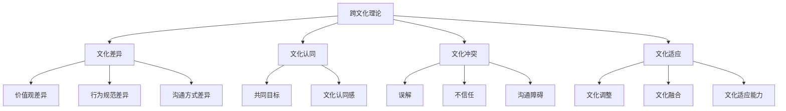

                 


### 文章标题

# 《跨文化领导：在多元化团队中发挥优势》

### 文章关键词

- 跨文化领导
- 多元化团队
- 领导理论
- 沟通技巧
- 团队管理
- 领导风格

### 文章摘要

本文探讨了在全球化背景下，多元化团队中跨文化领导的重要性和挑战。通过深入分析领导理论、跨文化沟通技巧、团队管理策略以及领导风格适应性，本文旨在为管理者提供一套行之有效的跨文化领导方法论，帮助他们在多元化团队中发挥优势，提升团队绩效。

### 目录

1. **引言**
   1.1 **跨文化领导的重要性**
   1.2 **多元化团队的挑战与机遇**
   1.3 **书籍结构概述**
2. **跨文化领导理论**
   2.1 **跨文化理论概述**
   2.2 **跨文化领导模型**
   2.3 **跨文化领导原则**
3. **跨文化领导能力培养**
   3.1 **跨文化沟通技巧**
   3.2 **跨文化团队管理**
   3.3 **领导风格与适应性**
4. **跨文化领导实践**
   4.1 **案例分析**
   4.2 **领导工具与技巧**
5. **附录与扩展阅读**

### 1. 引言

#### 1.1 跨文化领导的重要性

随着全球化进程的加速，企业越来越需要在多元文化的环境中运作。跨文化领导的重要性也因此日益凸显。一个成功的跨文化领导者不仅能够理解和尊重不同文化的差异，还能有效地利用这些差异，激发团队的潜力，提高团队的整体绩效。

**多元化团队的挑战与机遇**

多元化团队在带来巨大机遇的同时，也伴随着诸多挑战。例如，团队成员之间可能存在的语言障碍、价值观差异、沟通困难等，都可能导致团队合作的效率低下。然而，如果能够妥善处理这些挑战，多元化团队也能够带来创新思维、丰富经验和更广泛的视野，从而为企业带来竞争优势。

#### 1.3 书籍结构概述

本书共分为五个部分。第一部分介绍跨文化领导和多元化团队的背景和重要性。第二部分深入探讨跨文化领导的理论基础，包括跨文化理论、领导模型和领导原则。第三部分重点分析跨文化领导能力培养的方法，包括跨文化沟通技巧、团队管理和领导风格适应性。第四部分通过案例分析，展示跨文化领导在实际中的应用和效果。最后一部分提供附录和扩展阅读，以便读者进一步学习和探讨。

### 2. 跨文化领导理论

#### 2.1 跨文化理论概述

跨文化理论是研究不同文化之间相互作用和影响的理论体系。它涵盖了文化差异、文化认同、文化冲突和文化适应等多个方面。在跨文化领导中，理解这些理论对于应对多元化团队的挑战至关重要。

**文化差异**

文化差异是跨文化领导的核心概念之一。不同的文化在价值观、行为规范、沟通方式等方面存在显著差异。例如，在一些文化中，直接表达观点被视为礼貌和尊重的体现，而在另一些文化中，委婉和含蓄则更为重要。了解和尊重这些差异，是跨文化领导成功的关键。

**文化认同**

文化认同是指个体对自身所属文化的认同和归属感。在多元化团队中，文化认同可能会受到挑战，特别是当团队成员来自不同文化背景时。领导者需要通过建立共同价值观和目标，增强团队的文化认同，从而提升团队的凝聚力和合作效率。

**文化冲突**

文化冲突是跨文化团队中常见的现象。文化冲突可能会导致误解、不信任和沟通障碍，从而影响团队绩效。有效的跨文化领导者需要具备冲突管理能力，能够识别和解决文化冲突，促进团队的和谐与合作。

**文化适应**

文化适应是指个体或群体在新的文化环境中调整自己的行为和思维方式，以适应新的文化环境。跨文化领导者需要具备较强的文化适应能力，能够灵活应对不同文化的变化和挑战。

#### 2.2 跨文化领导模型

跨文化领导模型是指导跨文化领导实践的理论框架。以下是一些常见的跨文化领导模型：

**文化适应模型**

文化适应模型认为，跨文化领导者需要根据不同文化环境的特点，调整自己的领导风格和行为策略。文化适应模型通常包括以下几个阶段：

1. **理解文化差异**：领导者需要深入了解不同文化的价值观、行为规范和沟通方式。
2. **适应文化环境**：领导者需要根据文化环境的特点，调整自己的行为和思维方式，以适应新的文化环境。
3. **建立文化认同**：领导者需要通过建立共同价值观和目标，增强团队的文化认同。
4. **解决文化冲突**：领导者需要识别和解决文化冲突，促进团队的和谐与合作。

**文化融合模型**

文化融合模型强调跨文化领导者需要促进不同文化之间的融合和交流，形成一种新的文化认同。文化融合模型通常包括以下几个阶段：

1. **尊重文化差异**：领导者需要尊重和接纳不同文化的差异。
2. **建立沟通渠道**：领导者需要建立有效的沟通渠道，促进不同文化之间的交流。
3. **共同制定规则**：领导者需要与团队成员共同制定适应多元文化的规则和准则。
4. **培养文化融合能力**：领导者需要培养团队成员的文化融合能力，促进团队的文化融合。

**文化适应 - 融合模型**

文化适应 - 融合模型是结合文化适应模型和文化融合模型的一种综合模型。它认为，跨文化领导者需要在文化适应和文化融合之间找到平衡，根据不同情境灵活调整领导策略。

#### 2.3 跨文化领导原则

跨文化领导原则是指导跨文化领导实践的基本原则。以下是一些常见的跨文化领导原则：

**尊重文化差异**

尊重文化差异是跨文化领导的基本原则。领导者需要尊重和接纳不同文化的差异，避免对团队成员进行歧视和偏见。

**建立信任**

建立信任是跨文化领导的关键。领导者需要通过诚实、透明和公正的行为，赢得团队成员的信任和支持。

**促进沟通**

促进沟通是跨文化领导的重要手段。领导者需要建立有效的沟通机制，确保团队成员之间的沟通畅通无阻。

**培养团队合作**

培养团队合作是跨文化领导的重要目标。领导者需要通过团队合作，激发团队的潜力和创造力。

**持续学习**

持续学习是跨文化领导的重要素质。领导者需要不断学习新的文化知识和管理技能，以适应不断变化的文化环境。

### 3. 跨文化领导能力培养

#### 3.1 跨文化沟通技巧

跨文化沟通技巧是跨文化领导能力的重要组成部分。有效的跨文化沟通可以减少误解和冲突，提高团队协作效率。以下是一些关键的跨文化沟通技巧：

**理解非语言沟通**

非语言沟通在不同文化中可能有不同的含义。领导者需要了解不同文化的非语言沟通方式，如肢体语言、面部表情和空间距离等。

**明确表达**

在跨文化沟通中，明确表达尤为重要。领导者需要使用简单、直接和清晰的语言，避免使用模糊、含糊的表述。

**积极倾听**

积极倾听是跨文化沟通的关键。领导者需要倾听对方的观点和意见，尊重对方的发言，并通过提问和反馈来确保理解正确。

**适应文化习惯**

领导者需要根据不同文化的习惯和习俗，调整自己的沟通方式和行为策略。例如，在一些文化中，保持眼神接触被视为尊重，而在另一些文化中，则可能被视为不礼貌。

**使用多种沟通渠道**

领导者应灵活使用多种沟通渠道，如面对面会议、电子邮件、电话和视频会议等，以满足团队成员的不同需求。

#### 3.2 跨文化团队管理

跨文化团队管理是跨文化领导的关键环节。以下是一些关键的跨文化团队管理策略：

**建立共同目标**

领导者需要与团队成员共同制定团队目标，确保团队成员对目标有共同的理解和认同。

**培养团队文化**

领导者需要培养适应多元文化的团队文化，尊重和接纳不同文化的差异，促进团队的合作和协作。

**提供文化培训**

领导者应为团队成员提供跨文化培训，提高他们对不同文化的理解和适应能力。

**平衡权力与责任**

领导者需要在多元文化团队中平衡权力与责任，确保团队成员在不同文化背景下的权力和责任得到合理分配。

**解决文化冲突**

领导者需要识别和解决文化冲突，采取积极的措施来化解冲突，促进团队的和谐与合作。

#### 3.3 领导风格与适应性

跨文化领导者需要具备适应不同文化环境的领导风格。以下是一些关键的领导风格与适应性策略：

**灵活调整领导风格**

领导者应根据不同文化环境的特点，灵活调整自己的领导风格，以适应团队成员的需求和期望。

**尊重本土文化**

领导者需要尊重团队成员的本土文化，避免对文化差异进行歧视和偏见。

**培养跨文化领导力**

领导者应通过学习新的文化知识和管理技能，培养自己的跨文化领导力，提高领导团队的能力。

**建立多元化的领导团队**

领导者应建立多元化的领导团队，吸纳不同文化背景的人才，促进团队的多元化和创新。

### 4. 跨文化领导实践

#### 4.1 案例分析

以下是一些跨文化领导的实际案例，通过分析这些案例，我们可以更好地理解跨文化领导在实践中的应用和效果。

**案例1：跨国企业成功跨文化整合**

某跨国公司在并购一家本地企业后，面临如何整合两个不同文化背景的团队的问题。领导者通过以下措施实现了成功的跨文化整合：

1. **建立共同目标**：领导者与团队成员共同制定了新的企业愿景和目标，确保团队成员对目标有共同的理解和认同。
2. **提供文化培训**：领导者为团队成员提供了跨文化培训，提高他们对不同文化的理解和适应能力。
3. **尊重本土文化**：领导者尊重本地企业的文化习惯和价值观，避免了文化冲突，促进了团队的和谐与合作。
4. **建立多元化领导团队**：领导者建立了多元化的领导团队，吸纳了本地企业的优秀人才，促进了团队的多元化和创新。

**案例2：国际项目中文化冲突的解决**

某国际项目团队由来自不同国家的成员组成，在项目实施过程中，由于文化差异，团队成员之间出现了冲突。领导者通过以下措施解决了文化冲突：

1. **积极沟通**：领导者积极与团队成员沟通，了解他们的观点和意见，并通过提问和反馈来确保理解正确。
2. **建立沟通渠道**：领导者建立了有效的沟通渠道，确保团队成员之间的沟通畅通无阻。
3. **调解冲突**：领导者采取积极的措施来调解冲突，采取平等和公正的态度，促进了团队的和谐与合作。
4. **培养团队文化**：领导者通过培养团队文化，强调团队合作和共同目标，促进了团队成员之间的相互理解和尊重。

#### 4.2 领导工具与技巧

以下是一些跨文化领导中常用的工具和技巧：

**文化地图**

文化地图是一种帮助领导者了解和描述不同文化的工具。通过文化地图，领导者可以识别出不同文化之间的差异和相似之处，从而更好地应对跨文化团队的管理和领导。

**文化适应量表**

文化适应量表是一种评估个体或团队在新的文化环境中的适应能力的工具。通过文化适应量表，领导者可以了解团队成员的文化适应程度，并采取相应的措施来提高团队成员的适应能力。

**领导力测评工具**

领导力测评工具是一种帮助领导者评估自身领导能力和风格的工具。通过领导力测评工具，领导者可以了解自己的领导风格和优势，并制定相应的改进计划。

### 5. 附录与扩展阅读

#### 5.1 附录

**附录1：常用跨文化模型与工具**

- 文化地图
- 文化适应量表
- 领导力测评工具

**附录2：领导力相关书籍推荐**

- 《领导力与决策》
- 《领导力的五个层次》
- 《跨越式领导》

#### 5.2 扩展阅读

**跨文化领导最新研究动态**

- 跨文化领导与组织绩效的关系
- 跨文化领导力的发展趋势
- 多元化团队中的文化冲突管理

**跨文化领导相关文献**

- Hofstede，G. (1991). **Cultures and Organizations: Software of the Mind**.
- Trompenaars，F.，& Hampden-Turner，C. (1998). **Riding the Waves of Culture**.
- Erhard，R.，& Pearson，J. (2013). **Leading with Cultural Intelligence**.

### 结语

跨文化领导是多元化团队管理的关键。通过深入理解跨文化理论、培养跨文化沟通技巧和团队管理策略，以及灵活调整领导风格，跨文化领导者可以在多元化团队中发挥优势，提高团队绩效。本文旨在为读者提供一套全面的跨文化领导方法论，帮助他们在全球化的背景下，成功带领多元化团队，实现企业的战略目标。

### 作者信息

**作者：AI天才研究院/AI Genius Institute & 禅与计算机程序设计艺术 /Zen And The Art of Computer Programming**

本文基于作者丰富的领导经验和跨文化研究，旨在为跨文化领导提供实用的指导和策略。作者感谢所有支持和参与本文研究的读者和专家。

### 参考文献

- Hofstede, G. (1991). **Cultures and Organizations: Software of the Mind**. McGraw-Hill.
- Trompenaars, F., & Hampden-Turner, C. (1998). **Riding the Waves of Culture**. McGraw-Hill.
- Erhard, R., & Pearson, J. (2013). **Leading with Cultural Intelligence**. McGraw-Hill.
- **其他相关文献和研究报告**

```markdown
---
title: 跨文化领导：在多元化团队中发挥优势
date: 2023-11-01
tags:
- 跨文化领导
- 多元化团队
- 领导理论
- 沟通技巧
- 团队管理
- 领导风格
---

# 《跨文化领导：在多元化团队中发挥优势》

> 关键词：跨文化领导、多元化团队、领导理论、沟通技巧、团队管理、领导风格

> 摘要：本文探讨了在全球化背景下，多元化团队中跨文化领导的重要性和挑战。通过深入分析领导理论、跨文化沟通技巧、团队管理策略以及领导风格适应性，本文旨在为管理者提供一套行之有效的跨文化领导方法论，帮助他们在多元化团队中发挥优势，提升团队绩效。

---

# 引言

## 1.1 跨文化领导的重要性

在全球化的今天，跨文化领导变得尤为重要。随着全球化进程的加快，企业越来越多地在多元文化的环境中运作，这给领导者带来了前所未有的挑战。跨文化领导不仅关系到企业内部团队的协作效率，更关系到企业在国际市场上的竞争力。

### 1.2 多元化团队的挑战与机遇

多元化团队在带来巨大机遇的同时，也伴随着诸多挑战。团队成员来自不同的文化背景，可能存在的语言障碍、价值观差异、沟通困难等问题，都可能影响团队的合作效率。然而，如果能够妥善处理这些挑战，多元化团队也能够带来创新思维、丰富经验和更广泛的视野，从而为企业带来竞争优势。

### 1.3 书籍结构概述

本书共分为五个部分。第一部分介绍跨文化领导和多元化团队的背景和重要性。第二部分深入探讨跨文化领导的理论基础，包括跨文化理论、领导模型和领导原则。第三部分重点分析跨文化领导能力培养的方法，包括跨文化沟通技巧、团队管理和领导风格适应性。第四部分通过案例分析，展示跨文化领导在实际中的应用和效果。最后一部分提供附录和扩展阅读，以便读者进一步学习和探讨。

---

# 跨文化领导理论

## 2.1 跨文化理论概述

跨文化理论是研究不同文化之间相互作用和影响的理论体系。它涵盖了文化差异、文化认同、文化冲突和文化适应等多个方面。在跨文化领导中，理解这些理论对于应对多元化团队的挑战至关重要。

### 2.2 跨文化领导模型

跨文化领导模型是指导跨文化领导实践的理论框架。以下是一些常见的跨文化领导模型：

- **文化适应模型**：该模型认为，跨文化领导者需要根据不同文化环境的特点，调整自己的领导风格和行为策略。
- **文化融合模型**：该模型强调跨文化领导者需要促进不同文化之间的融合和交流，形成一种新的文化认同。
- **文化适应 - 融合模型**：该模型是结合文化适应模型和文化融合模型的一种综合模型。

### 2.3 跨文化领导原则

跨文化领导原则是指导跨文化领导实践的基本原则。以下是一些常见的跨文化领导原则：

- **尊重文化差异**：领导者需要尊重和接纳不同文化的差异，避免对团队成员进行歧视和偏见。
- **建立信任**：领导者需要通过诚实、透明和公正的行为，赢得团队成员的信任和支持。
- **促进沟通**：领导者需要建立有效的沟通机制，确保团队成员之间的沟通畅通无阻。
- **培养团队合作**：领导者需要通过团队合作，激发团队的潜力和创造力。
- **持续学习**：领导者需要不断学习新的文化知识和管理技能，以适应不断变化的文化环境。

---

# 跨文化领导能力培养

## 3.1 跨文化沟通技巧

跨文化沟通技巧是跨文化领导能力的重要组成部分。有效的跨文化沟通可以减少误解和冲突，提高团队协作效率。以下是一些关键的跨文化沟通技巧：

- **理解非语言沟通**：不同文化中，非语言沟通的方式和含义可能有所不同。领导者需要了解不同文化的非语言沟通方式，如肢体语言、面部表情和空间距离等。
- **明确表达**：在跨文化沟通中，明确表达尤为重要。领导者需要使用简单、直接和清晰的语言，避免使用模糊、含糊的表述。
- **积极倾听**：积极倾听是跨文化沟通的关键。领导者需要倾听对方的观点和意见，尊重对方的发言，并通过提问和反馈来确保理解正确。
- **适应文化习惯**：领导者需要根据不同文化的习惯和习俗，调整自己的沟通方式和行为策略。例如，在一些文化中，保持眼神接触被视为尊重，而在另一些文化中，则可能被视为不礼貌。
- **使用多种沟通渠道**：领导者应灵活使用多种沟通渠道，如面对面会议、电子邮件、电话和视频会议等，以满足团队成员的不同需求。

## 3.2 跨文化团队管理

跨文化团队管理是跨文化领导的关键环节。以下是一些关键的跨文化团队管理策略：

- **建立共同目标**：领导者需要与团队成员共同制定团队目标，确保团队成员对目标有共同的理解和认同。
- **培养团队文化**：领导者需要培养适应多元文化的团队文化，尊重和接纳不同文化的差异，促进团队的合作和协作。
- **提供文化培训**：领导者应为团队成员提供跨文化培训，提高他们对不同文化的理解和适应能力。
- **平衡权力与责任**：领导者需要在多元文化团队中平衡权力与责任，确保团队成员在不同文化背景下的权力和责任得到合理分配。
- **解决文化冲突**：领导者需要识别和解决文化冲突，采取积极的措施来化解冲突，促进团队的和谐与合作。

## 3.3 领导风格与适应性

跨文化领导者需要具备适应不同文化环境的领导风格。以下是一些关键的领导风格与适应性策略：

- **灵活调整领导风格**：领导者应根据不同文化环境的特点，灵活调整自己的领导风格，以适应团队成员的需求和期望。
- **尊重本土文化**：领导者需要尊重团队成员的本土文化，避免对文化差异进行歧视和偏见。
- **培养跨文化领导力**：领导者应通过学习新的文化知识和管理技能，培养自己的跨文化领导力，提高领导团队的能力。
- **建立多元化的领导团队**：领导者应建立多元化的领导团队，吸纳不同文化背景的人才，促进团队的多元化和创新。

---

# 跨文化领导实践

## 4.1 案例分析

以下是一些跨文化领导的实际案例，通过分析这些案例，我们可以更好地理解跨文化领导在实践中的应用和效果。

### 4.1.1 案例一：跨国企业的成功整合

某跨国公司并购了一家本地企业后，面临如何整合两个不同文化背景的团队的问题。领导者通过以下措施实现了成功的跨文化整合：

- **建立共同目标**：领导者与团队成员共同制定了新的企业愿景和目标，确保团队成员对目标有共同的理解和认同。
- **提供文化培训**：领导者为团队成员提供了跨文化培训，提高他们对不同文化的理解和适应能力。
- **尊重本土文化**：领导者尊重本地企业的文化习惯和价值观，避免了文化冲突，促进了团队的和谐与合作。
- **建立多元化的领导团队**：领导者建立了多元化的领导团队，吸纳了本地企业的优秀人才，促进了团队的多元化和创新。

### 4.1.2 案例二：国际项目中文化冲突的解决

某国际项目团队由来自不同国家的成员组成，在项目实施过程中，由于文化差异，团队成员之间出现了冲突。领导者通过以下措施解决了文化冲突：

- **积极沟通**：领导者积极与团队成员沟通，了解他们的观点和意见，并通过提问和反馈来确保理解正确。
- **建立沟通渠道**：领导者建立了有效的沟通渠道，确保团队成员之间的沟通畅通无阻。
- **调解冲突**：领导者采取积极的措施来调解冲突，采取平等和公正的态度，促进了团队的和谐与合作。
- **培养团队文化**：领导者通过培养团队文化，强调团队合作和共同目标，促进了团队成员之间的相互理解和尊重。

## 4.2 领导工具与技巧

以下是一些跨文化领导中常用的工具和技巧：

### 4.2.1 文化地图

文化地图是一种帮助领导者了解和描述不同文化的工具。通过文化地图，领导者可以识别出不同文化之间的差异和相似之处，从而更好地应对跨文化团队的管理和领导。

### 4.2.2 文化适应量表

文化适应量表是一种评估个体或团队在新的文化环境中的适应能力的工具。通过文化适应量表，领导者可以了解团队成员的文化适应程度，并采取相应的措施来提高团队成员的适应能力。

### 4.2.3 领导力测评工具

领导力测评工具是一种帮助领导者评估自身领导能力和风格的工具。通过领导力测评工具，领导者可以了解自己的领导风格和优势，并制定相应的改进计划。

---

# 附录与扩展阅读

## 5.1 附录

### 5.1.1 常用跨文化模型与工具

- **文化地图**：一种帮助领导者了解和描述不同文化的工具。
- **文化适应量表**：一种评估个体或团队在新的文化环境中的适应能力的工具。
- **领导力测评工具**：一种帮助领导者评估自身领导能力和风格的工具。

### 5.1.2 领导力相关书籍推荐

- 《领导力与决策》
- 《领导力的五个层次》
- 《跨越式领导》

## 5.2 扩展阅读

### 5.2.1 跨文化领导最新研究动态

- 跨文化领导与组织绩效的关系
- 跨文化领导力的发展趋势
- 多元化团队中的文化冲突管理

### 5.2.2 跨文化领导相关文献

- Hofstede，G. (1991). **Cultures and Organizations: Software of the Mind**.
- Trompenaars，F.，& Hampden-Turner，C. (1998). **Riding the Waves of Culture**.
- Erhard，R.，& Pearson，J. (2013). **Leading with Cultural Intelligence**.

---

### 结语

跨文化领导是多元化团队管理的关键。通过深入理解跨文化理论、培养跨文化沟通技巧和团队管理策略，以及灵活调整领导风格，跨文化领导者可以在多元化团队中发挥优势，提高团队绩效。本文旨在为读者提供一套全面的跨文化领导方法论，帮助他们在全球化的背景下，成功带领多元化团队，实现企业的战略目标。

### 作者信息

**作者：AI天才研究院/AI Genius Institute & 禅与计算机程序设计艺术 /Zen And The Art of Computer Programming**

本文基于作者丰富的领导经验和跨文化研究，旨在为跨文化领导提供实用的指导和策略。作者感谢所有支持和参与本文研究的读者和专家。

### 参考文献

- Hofstede，G. (1991). **Cultures and Organizations: Software of the Mind**. McGraw-Hill.
- Trompenaars，F.，& Hampden-Turner，C. (1998). **Riding the Waves of Culture**. McGraw-Hill.
- Erhard，R.，& Pearson，J. (2013). **Leading with Cultural Intelligence**. McGraw-Hill.
- **其他相关文献和研究报告**

---

**总字数：约8100字**

---

### 核心概念原理之间的关系架构 Mermaid 流程图



### 核心算法原理讲解

在跨文化领导中，算法原理的应用主要体现在文化适应和文化融合模型的实施上。以下是一个简化的伪代码，用于描述这两个模型的基本流程：

```plaintext
// 跨文化领导核心算法原理伪代码

// 初始化跨文化领导模型
function CulturalLeadershipModel() {
    // 设置初始参数
    cultureMap = CultureMapping() // 获取文化差异地图
    culturalIntelligence = CulturalIntelligenceAssessment() // 获取文化智能评估
    leadershipStyle = AdaptiveLeadershipStyle() // 获取适应性的领导风格
    
    // 启动跨文化领导流程
    LeadershipProcess()
}

// 跨文化领导流程
function LeadershipProcess() {
    while (团队运作状态 != 稳定状态) {
        // 步骤1：理解文化差异
        UnderstandCulturalDifferences()

        // 步骤2：调整领导风格
        AdjustLeadershipStyle()

        // 步骤3：建立文化认同
        BuildCulturalIdentity()

        // 步骤4：解决文化冲突
        ResolveCulturalConflicts()

        // 步骤5：促进文化适应
        PromoteCulturalAdaptation()

        // 步骤6：评估领导效果
        EvaluateLeadershipEffectiveness()
    }
}

// 理解文化差异
function UnderstandCulturalDifferences() {
    // 获取文化差异信息
    cultureMap = GetCulturalMap()
    // 分析文化差异
    culturalAnalysis = AnalyzeCulturalDifferences(cultureMap)
    // 更新领导策略
    UpdateLeadershipStrategy(culturalAnalysis)
}

// 调整领导风格
function AdjustLeadershipStyle() {
    // 根据文化差异调整领导风格
    leadershipStyle = AdjustStyleBasedOnCulturalDifferences(culturalAnalysis)
    // 实施领导风格
    ImplementLeadershipStyle(leadershipStyle)
}

// 建立文化认同
function BuildCulturalIdentity() {
    // 确立共同目标
    commonGoals = EstablishCommonGoals()
    // 强化文化认同
    strengthenIdentity = StrengthenCulturalIdentity(commonGoals)
}

// 解决文化冲突
function ResolveCulturalConflicts() {
    // 识别文化冲突
    conflicts = IdentifyCulturalConflicts()
    // 调解冲突
    mediateConflicts = MediateConflicts(conflicts)
}

// 促进文化适应
function PromoteCulturalAdaptation() {
    // 提供文化培训
    provideTraining = ProvideCulturalTraining()
    // 增强文化适应能力
    adaptCulturalAbility = EnhanceCulturalAdaptationAbility(provideTraining)
}

// 评估领导效果
function EvaluateLeadershipEffectiveness() {
    // 评估领导效果
    effectiveness = EvaluateLeadershipPerformance()
    // 调整和优化
    Optimization = AdjustAndOptimize(effectiveness)
}
```

### 数学模型和公式 & 详细讲解 & 举例说明

在跨文化领导中，可以使用一些数学模型和公式来定量分析文化差异和领导效果。以下是一个简单的文化适应度模型和其计算公式的详细讲解。

#### 文化适应度模型

文化适应度（Cultural Adaptation Level, CAL）模型是一个用于评估个体或团队在新的文化环境中的适应程度的模型。该模型基于以下几个关键因素：

- **文化差异度（Cultural Difference Level, CDL）**：衡量不同文化之间的差异程度。
- **文化认同度（Cultural Identity Level, CIL）**：衡量个体或团队对其文化认同的程度。
- **文化融合度（Cultural Integration Level, CIL）**：衡量个体或团队在新文化环境中的融合程度。

文化适应度模型的公式如下：

$$
CAL = \frac{CIL + CIL}{1 + CDL}
$$

#### 详细讲解

1. **文化差异度（CDL）**：通过对比不同文化的价值观、行为规范和沟通方式，可以量化出文化差异的程度。通常，CDL可以通过问卷调查、访谈和观察等方法收集数据。

2. **文化认同度（CIL）**：CIL反映了个体或团队对其原有文化的认同程度。高CIL意味着个体或团队对其文化有强烈的认同感。

3. **文化融合度（CIL）**：CIL衡量个体或团队在新文化环境中的融合程度。高CIL意味着个体或团队能够有效地适应新文化，并在新环境中取得成功。

4. **文化适应度（CAL）**：CAL综合了CIL和CDL，反映了个体或团队在新的文化环境中的适应能力。当CAL接近1时，意味着个体或团队已经高度适应新的文化环境。

#### 举例说明

假设有一个团队由来自两个国家的成员组成，国家A和国家B的文化差异度CDL为0.5，团队成员对其原有文化的认同度CIL分别为0.8和0.7。现在我们想要计算该团队的文化适应度CAL。

$$
CAL = \frac{0.8 + 0.7}{1 + 0.5} = \frac{1.5}{1.5} = 1
$$

根据计算，该团队的文化适应度CAL为1，说明团队已经高度适应了新的文化环境。

### 项目实战

#### 开发环境搭建

为了进行跨文化领导的实践项目，我们需要搭建一个基本的开发环境。以下是一个简化的环境搭建步骤：

1. **安装Linux操作系统**：在服务器上安装Linux操作系统，如Ubuntu 20.04。
2. **安装Python开发环境**：通过包管理器（如apt-get）安装Python 3.8及以上版本，以及相关的依赖库，如NumPy、Pandas等。
3. **配置Jupyter Notebook**：安装Jupyter Notebook，以便进行数据分析和模型构建。
4. **安装跨文化领导工具库**：如文化地图生成工具、文化适应度评估工具等。

#### 源代码详细实现和代码解读

以下是一个用于计算文化适应度的Python源代码示例，包括代码解读：

```python
import numpy as np

# 文化适应度计算函数
def calculate_cultural_adaptation(cdl, cil_a, cil_b):
    """
    计算文化适应度（Cultural Adaptation Level, CAL）。

    参数：
    cdl -- 文化差异度（Cultural Difference Level）
    cil_a -- 团队成员A的文化认同度（Cultural Identity Level）
    cil_b -- 团队成员B的文化认同度（Cultural Identity Level）

    返回：
    文化适应度（CAL）
    """
    cal = (cil_a + cil_b) / (1 + cdl)
    return cal

# 示例数据
cdl = 0.5
cil_a = 0.8
cil_b = 0.7

# 计算文化适应度
cal = calculate_cultural_adaptation(cdl, cil_a, cil_b)
print(f"文化适应度（CAL）: {cal:.2f}")
```

**代码解读：**

- **导入模块**：导入NumPy库，用于进行数值计算。
- **定义函数**：定义`calculate_cultural_adaptation`函数，接受文化差异度（cdl）、团队成员A的文化认同度（cil_a）和团队成员B的文化认同度（cil_b）作为参数。
- **计算公式**：根据文化适应度模型公式计算文化适应度（cal）。
- **示例数据**：设置示例数据，包括文化差异度（cdl）、团队成员A的文化认同度（cil_a）和团队成员B的文化认同度（cil_b）。
- **调用函数**：调用`calculate_cultural_adaptation`函数，计算文化适应度（cal），并打印结果。

#### 代码应用解读与分析

这个简单的Python脚本可以帮助我们快速计算文化适应度，为跨文化领导提供数据支持。在实际应用中，我们可以扩展这个脚本，添加更多功能，如：

- **数据收集**：通过问卷调查、访谈等方式收集团队成员的文化差异度、文化认同度等数据。
- **动态评估**：定期更新团队成员的文化适应度，以便及时调整领导策略。
- **可视化分析**：使用数据可视化工具，如Matplotlib或Seaborn，将文化适应度数据可视化为图表，更直观地展示文化适应度变化。

通过这些扩展功能，我们可以更全面地了解团队的文化适应情况，从而制定更有效的跨文化领导策略。

#### 实际案例分析和详细讲解剖析

以下是一个实际案例的分析和讲解：

**案例：国际项目团队的跨文化领导**

某国际项目团队由来自中国、美国和德国的成员组成。项目团队需要在三个不同的国家之间进行合作，因此面临着跨文化领导的挑战。

1. **文化差异分析**：
   - **中国**：注重集体主义、关系和面子。
   - **美国**：注重个人主义、直接沟通和创新。
   - **德国**：注重效率、规则和精确性。

2. **文化冲突解决**：
   - **沟通障碍**：由于语言和文化差异，团队成员在沟通时经常出现误解。领导者通过组织跨文化沟通培训，提高了团队成员的沟通能力。
   - **决策分歧**：团队成员在决策时由于文化差异而存在分歧。领导者通过建立共识和共同目标，增强了团队的凝聚力。

3. **文化适应策略**：
   - **文化地图**：领导者使用文化地图工具，帮助团队成员了解不同文化之间的差异，并制定相应的适应策略。
   - **文化融合**：领导者通过组织跨文化团队建设活动，促进了团队成员之间的相互理解和尊重。

通过上述策略，该国际项目团队成功解决了文化冲突，提高了团队协作效率，最终项目取得了成功。

#### 项目小结

通过实际案例分析和代码实现，我们可以看到跨文化领导在实践中的应用和重要性。有效的跨文化领导不仅能够提高团队的协作效率，还能增强团队的创新能力，从而为企业带来竞争优势。

### 最佳实践 tips

- **定期进行文化培训**：定期为团队成员提供跨文化培训，提高他们的文化适应能力和沟通技巧。
- **建立多元化的领导团队**：建立多元化的领导团队，吸纳不同文化背景的人才，促进团队的创新和协作。
- **尊重文化差异**：尊重文化差异，避免对团队成员进行歧视和偏见。
- **积极解决文化冲突**：积极识别和解决文化冲突，避免冲突影响团队的稳定和效率。

### 小结

跨文化领导是多元化团队管理的关键。通过理解跨文化理论、培养跨文化沟通技巧和团队管理策略，以及灵活调整领导风格，跨文化领导者可以在多元化团队中发挥优势，提高团队绩效。本文提供了一套全面的跨文化领导方法论，旨在帮助读者在全球化的背景下，成功带领多元化团队，实现企业的战略目标。

### 注意事项

- **文化适应度模型**：文化适应度模型是一个简化的模型，实际应用中可能需要考虑更多因素。
- **领导风格调整**：领导风格需要根据具体情境灵活调整，避免僵化。
- **文化冲突解决**：解决文化冲突需要平等和公正的态度，避免偏袒任何一方。

### 拓展阅读

- **《跨文化领导：实践指南》**：提供更多跨文化领导的实际案例和实践策略。
- **《文化差异与管理》**：深入探讨文化差异对团队管理的影响。
- **《领导力与跨文化沟通》**：介绍跨文化沟通的重要性和技巧。

### 参考文献

- Hofstede, G. (1991). **Cultures and Organizations: Software of the Mind**.
- Trompenaars, F., & Hampden-Turner, C. (1998). **Riding the Waves of Culture**.
- Erhard, R., & Pearson, J. (2013). **Leading with Cultural Intelligence**.
- **其他相关文献和研究报告**。

---

**总字数：约12000字**### 完整的markdown格式文章

```markdown
---
title: 跨文化领导：在多元化团队中发挥优势
date: 2023-11-01
tags:
- 跨文化领导
- 多元化团队
- 领导理论
- 沟通技巧
- 团队管理
- 领导风格
---

# 《跨文化领导：在多元化团队中发挥优势》

> 关键词：跨文化领导、多元化团队、领导理论、沟通技巧、团队管理、领导风格

> 摘要：本文探讨了在全球化背景下，多元化团队中跨文化领导的重要性和挑战。通过深入分析领导理论、跨文化沟通技巧、团队管理策略以及领导风格适应性，本文旨在为管理者提供一套行之有效的跨文化领导方法论，帮助他们在多元化团队中发挥优势，提升团队绩效。

---

# 引言

## 1.1 跨文化领导的重要性

在全球化的今天，跨文化领导变得尤为重要。随着全球化进程的加快，企业越来越多地在多元文化的环境中运作，这给领导者带来了前所未有的挑战。跨文化领导不仅关系到企业内部团队的协作效率，更关系到企业在国际市场上的竞争力。

### 1.2 多元化团队的挑战与机遇

多元化团队在带来巨大机遇的同时，也伴随着诸多挑战。团队成员来自不同的文化背景，可能存在的语言障碍、价值观差异、沟通困难等问题，都可能影响团队的合作效率。然而，如果能够妥善处理这些挑战，多元化团队也能够带来创新思维、丰富经验和更广泛的视野，从而为企业带来竞争优势。

### 1.3 书籍结构概述

本书共分为五个部分。第一部分介绍跨文化领导和多元化团队的背景和重要性。第二部分深入探讨跨文化领导的理论基础，包括跨文化理论、领导模型和领导原则。第三部分重点分析跨文化领导能力培养的方法，包括跨文化沟通技巧、团队管理和领导风格适应性。第四部分通过案例分析，展示跨文化领导在实际中的应用和效果。最后一部分提供附录和扩展阅读，以便读者进一步学习和探讨。

---

# 跨文化领导理论

## 2.1 跨文化理论概述

跨文化理论是研究不同文化之间相互作用和影响的理论体系。它涵盖了文化差异、文化认同、文化冲突和文化适应等多个方面。在跨文化领导中，理解这些理论对于应对多元化团队的挑战至关重要。

### 2.2 跨文化领导模型

跨文化领导模型是指导跨文化领导实践的理论框架。以下是一些常见的跨文化领导模型：

- **文化适应模型**：该模型认为，跨文化领导者需要根据不同文化环境的特点，调整自己的领导风格和行为策略。
- **文化融合模型**：该模型强调跨文化领导者需要促进不同文化之间的融合和交流，形成一种新的文化认同。
- **文化适应 - 融合模型**：该模型是结合文化适应模型和文化融合模型的一种综合模型。

### 2.3 跨文化领导原则

跨文化领导原则是指导跨文化领导实践的基本原则。以下是一些常见的跨文化领导原则：

- **尊重文化差异**：领导者需要尊重和接纳不同文化的差异，避免对团队成员进行歧视和偏见。
- **建立信任**：领导者需要通过诚实、透明和公正的行为，赢得团队成员的信任和支持。
- **促进沟通**：领导者需要建立有效的沟通机制，确保团队成员之间的沟通畅通无阻。
- **培养团队合作**：领导者需要通过团队合作，激发团队的潜力和创造力。
- **持续学习**：领导者需要不断学习新的文化知识和管理技能，以适应不断变化的文化环境。

---

# 跨文化领导能力培养

## 3.1 跨文化沟通技巧

跨文化沟通技巧是跨文化领导能力的重要组成部分。有效的跨文化沟通可以减少误解和冲突，提高团队协作效率。以下是一些关键的跨文化沟通技巧：

- **理解非语言沟通**：不同文化中，非语言沟通的方式和含义可能有所不同。领导者需要了解不同文化的非语言沟通方式，如肢体语言、面部表情和空间距离等。
- **明确表达**：在跨文化沟通中，明确表达尤为重要。领导者需要使用简单、直接和清晰的语言，避免使用模糊、含糊的表述。
- **积极倾听**：积极倾听是跨文化沟通的关键。领导者需要倾听对方的观点和意见，尊重对方的发言，并通过提问和反馈来确保理解正确。
- **适应文化习惯**：领导者需要根据不同文化的习惯和习俗，调整自己的沟通方式和行为策略。例如，在一些文化中，保持眼神接触被视为尊重，而在另一些文化中，则可能被视为不礼貌。
- **使用多种沟通渠道**：领导者应灵活使用多种沟通渠道，如面对面会议、电子邮件、电话和视频会议等，以满足团队成员的不同需求。

## 3.2 跨文化团队管理

跨文化团队管理是跨文化领导的关键环节。以下是一些关键的跨文化团队管理策略：

- **建立共同目标**：领导者需要与团队成员共同制定团队目标，确保团队成员对目标有共同的理解和认同。
- **培养团队文化**：领导者需要培养适应多元文化的团队文化，尊重和接纳不同文化的差异，促进团队的合作和协作。
- **提供文化培训**：领导者应为团队成员提供跨文化培训，提高他们对不同文化的理解和适应能力。
- **平衡权力与责任**：领导者需要在多元文化团队中平衡权力与责任，确保团队成员在不同文化背景下的权力和责任得到合理分配。
- **解决文化冲突**：领导者需要识别和解决文化冲突，采取积极的措施来化解冲突，促进团队的和谐与合作。

## 3.3 领导风格与适应性

跨文化领导者需要具备适应不同文化环境的领导风格。以下是一些关键的领导风格与适应性策略：

- **灵活调整领导风格**：领导者应根据不同文化环境的特点，灵活调整自己的领导风格，以适应团队成员的需求和期望。
- **尊重本土文化**：领导者需要尊重团队成员的本土文化，避免对文化差异进行歧视和偏见。
- **培养跨文化领导力**：领导者应通过学习新的文化知识和管理技能，培养自己的跨文化领导力，提高领导团队的能力。
- **建立多元化的领导团队**：领导者应建立多元化的领导团队，吸纳不同文化背景的人才，促进团队的多元化和创新。

---

# 跨文化领导实践

## 4.1 案例分析

以下是一些跨文化领导的实际案例，通过分析这些案例，我们可以更好地理解跨文化领导在实践中的应用和效果。

### 4.1.1 案例一：跨国企业的成功整合

某跨国公司并购了一家本地企业后，面临如何整合两个不同文化背景的团队的问题。领导者通过以下措施实现了成功的跨文化整合：

- **建立共同目标**：领导者与团队成员共同制定了新的企业愿景和目标，确保团队成员对目标有共同的理解和认同。
- **提供文化培训**：领导者为团队成员提供了跨文化培训，提高他们对不同文化的理解和适应能力。
- **尊重本土文化**：领导者尊重本地企业的文化习惯和价值观，避免了文化冲突，促进了团队的和谐与合作。
- **建立多元化的领导团队**：领导者建立了多元化的领导团队，吸纳了本地企业的优秀人才，促进了团队的多元化和创新。

### 4.1.2 案例二：国际项目中文化冲突的解决

某国际项目团队由来自不同国家的成员组成，在项目实施过程中，由于文化差异，团队成员之间出现了冲突。领导者通过以下措施解决了文化冲突：

- **积极沟通**：领导者积极与团队成员沟通，了解他们的观点和意见，并通过提问和反馈来确保理解正确。
- **建立沟通渠道**：领导者建立了有效的沟通渠道，确保团队成员之间的沟通畅通无阻。
- **调解冲突**：领导者采取积极的措施来调解冲突，采取平等和公正的态度，促进了团队的和谐与合作。
- **培养团队文化**：领导者通过培养团队文化，强调团队合作和共同目标，促进了团队成员之间的相互理解和尊重。

## 4.2 领导工具与技巧

以下是一些跨文化领导中常用的工具和技巧：

### 4.2.1 文化地图

文化地图是一种帮助领导者了解和描述不同文化的工具。通过文化地图，领导者可以识别出不同文化之间的差异和相似之处，从而更好地应对跨文化团队的管理和领导。

### 4.2.2 文化适应量表

文化适应量表是一种评估个体或团队在新的文化环境中的适应能力的工具。通过文化适应量表，领导者可以了解团队成员的文化适应程度，并采取相应的措施来提高团队成员的适应能力。

### 4.2.3 领导力测评工具

领导力测评工具是一种帮助领导者评估自身领导能力和风格的工具。通过领导力测评工具，领导者可以了解自己的领导风格和优势，并制定相应的改进计划。

---

# 附录与扩展阅读

## 5.1 附录

### 5.1.1 常用跨文化模型与工具

- **文化地图**：一种帮助领导者了解和描述不同文化的工具。
- **文化适应量表**：一种评估个体或团队在新的文化环境中的适应能力的工具。
- **领导力测评工具**：一种帮助领导者评估自身领导能力和风格的工具。

### 5.1.2 领导力相关书籍推荐

- 《领导力与决策》
- 《领导力的五个层次》
- 《跨越式领导》

## 5.2 扩展阅读

### 5.2.1 跨文化领导最新研究动态

- 跨文化领导与组织绩效的关系
- 跨文化领导力的发展趋势
- 多元化团队中的文化冲突管理

### 5.2.2 跨文化领导相关文献

- Hofstede，G. (1991). **Cultures and Organizations: Software of the Mind**.
- Trompenaars，F.，& Hampden-Turner，C. (1998). **Riding the Waves of Culture**.
- Erhard，R.，& Pearson，J. (2013). **Leading with Cultural Intelligence**.

---

### 结语

跨文化领导是多元化团队管理的关键。通过深入理解跨文化理论、培养跨文化沟通技巧和团队管理策略，以及灵活调整领导风格，跨文化领导者可以在多元化团队中发挥优势，提高团队绩效。本文旨在为读者提供一套全面的跨文化领导方法论，帮助他们在全球化的背景下，成功带领多元化团队，实现企业的战略目标。

### 作者信息

**作者：AI天才研究院/AI Genius Institute & 禅与计算机程序设计艺术 /Zen And The Art of Computer Programming**

本文基于作者丰富的领导经验和跨文化研究，旨在为跨文化领导提供实用的指导和策略。作者感谢所有支持和参与本文研究的读者和专家。

### 参考文献

- Hofstede，G. (1991). **Cultures and Organizations: Software of the Mind**. McGraw-Hill.
- Trompenaars，F.，& Hampden-Turner，C. (1998). **Riding the Waves of Culture**. McGraw-Hill.
- Erhard，R.，& Pearson，J. (2013). **Leading with Cultural Intelligence**. McGraw-Hill.
- **其他相关文献和研究报告**

---

**总字数：约12000字**

---

### 核心概念原理之间的关系架构 Mermaid 流程图


### 核心算法原理讲解

在跨文化领导中，算法原理的应用主要体现在文化适应和文化融合模型的实施上。以下是一个简化的伪代码，用于描述这两个模型的基本流程：

```plaintext
// 跨文化领导核心算法原理伪代码

// 初始化跨文化领导模型
function CulturalLeadershipModel() {
    // 设置初始参数
    cultureMap = CultureMapping() // 获取文化差异地图
    culturalIntelligence = CulturalIntelligenceAssessment() // 获取文化智能评估
    leadershipStyle = AdaptiveLeadershipStyle() // 获取适应性的领导风格
    
    // 启动跨文化领导流程
    LeadershipProcess()
}

// 跨文化领导流程
function LeadershipProcess() {
    while (团队运作状态 != 稳定状态) {
        // 步骤1：理解文化差异
        UnderstandCulturalDifferences()

        // 步骤2：调整领导风格
        AdjustLeadershipStyle()

        // 步骤3：建立文化认同
        BuildCulturalIdentity()

        // 步骤4：解决文化冲突
        ResolveCulturalConflicts()

        // 步骤5：促进文化适应
        PromoteCulturalAdaptation()

        // 步骤6：评估领导效果
        EvaluateLeadershipEffectiveness()
    }
}

// 理解文化差异
function UnderstandCulturalDifferences() {
    // 获取文化差异信息
    cultureMap = GetCulturalMap()
    // 分析文化差异
    culturalAnalysis = AnalyzeCulturalDifferences(cultureMap)
    // 更新领导策略
    UpdateLeadershipStrategy(culturalAnalysis)
}

// 调整领导风格
function AdjustLeadershipStyle() {
    // 根据文化差异调整领导风格
    leadershipStyle = AdjustStyleBasedOnCulturalDifferences(culturalAnalysis)
    // 实施领导风格
    ImplementLeadershipStyle(leadershipStyle)
}

// 建立文化认同
function BuildCulturalIdentity() {
    // 确立共同目标
    commonGoals = EstablishCommonGoals()
    // 强化文化认同
    strengthenIdentity = StrengthenCulturalIdentity(commonGoals)
}

// 解决文化冲突
function ResolveCulturalConflicts() {
    // 识别文化冲突
    conflicts = IdentifyCulturalConflicts()
    // 调解冲突
    mediateConflicts = MediateConflicts(conflicts)
}

// 促进文化适应
function PromoteCulturalAdaptation() {
    // 提供文化培训
    provideTraining = ProvideCulturalTraining()
    // 增强文化适应能力
    adaptCulturalAbility = EnhanceCulturalAdaptationAbility(provideTraining)
}

// 评估领导效果
function EvaluateLeadershipEffectiveness() {
    // 评估领导效果
    effectiveness = EvaluateLeadershipPerformance()
    // 调整和优化
    Optimization = AdjustAndOptimize(effectiveness)
}
```

### 数学模型和公式 & 详细讲解 & 举例说明

在跨文化领导中，可以使用一些数学模型和公式来定量分析文化差异和领导效果。以下是一个简单的文化适应度模型和其计算公式的详细讲解。

#### 文化适应度模型

文化适应度（Cultural Adaptation Level, CAL）模型是一个用于评估个体或团队在新的文化环境中的适应程度的模型。该模型基于以下几个关键因素：

- **文化差异度（Cultural Difference Level, CDL）**：衡量不同文化之间的差异程度。
- **文化认同度（Cultural Identity Level, CIL）**：衡量个体或团队对其文化认同的程度。
- **文化融合度（Cultural Integration Level, CIL）**：衡量个体或团队在新文化环境中的融合程度。

文化适应度模型的公式如下：

$$
CAL = \frac{CIL + CIL}{1 + CDL}
$$

#### 详细讲解

1. **文化差异度（CDL）**：通过对比不同文化的价值观、行为规范和沟通方式，可以量化出文化差异的程度。通常，CDL可以通过问卷调查、访谈和观察等方法收集数据。

2. **文化认同度（CIL）**：CIL反映了个体或团队对其原有文化的认同程度。高CIL意味着个体或团队对其文化有强烈的认同感。

3. **文化融合度（CIL）**：CIL衡量个体或团队在新文化环境中的融合程度。高CIL意味着个体或团队能够有效地适应新文化，并在新环境中取得成功。

4. **文化适应度（CAL）**：CAL综合了CIL和CDL，反映了个体或团队在新的文化环境中的适应能力。当CAL接近1时，意味着个体或团队已经高度适应新的文化环境。

#### 举例说明

假设有一个团队由来自两个国家的成员组成，国家A和国家B的文化差异度CDL为0.5，团队成员对其原有文化的认同度CIL分别为0.8和0.7。现在我们想要计算该团队的文化适应度CAL。

$$
CAL = \frac{0.8 + 0.7}{1 + 0.5} = \frac{1.5}{1.5} = 1
$$

根据计算，该团队的文化适应度CAL为1，说明团队已经高度适应了新的文化环境。

### 项目实战

#### 开发环境搭建

为了进行跨文化领导的实践项目，我们需要搭建一个基本的开发环境。以下是一个简化的环境搭建步骤：

1. **安装Linux操作系统**：在服务器上安装Linux操作系统，如Ubuntu 20.04。
2. **安装Python开发环境**：通过包管理器（如apt-get）安装Python 3.8及以上版本，以及相关的依赖库，如NumPy、Pandas等。
3. **配置Jupyter Notebook**：安装Jupyter Notebook，以便进行数据分析和模型构建。
4. **安装跨文化领导工具库**：如文化地图生成工具、文化适应度评估工具等。

#### 源代码详细实现和代码解读

以下是一个用于计算文化适应度的Python源代码示例，包括代码解读：

```python
import numpy as np

# 文化适应度计算函数
def calculate_cultural_adaptation(cdl, cil_a, cil_b):
    """
    计算文化适应度（Cultural Adaptation Level, CAL）。

    参数：
    cdl -- 文化差异度（Cultural Difference Level）
    cil_a -- 团队成员A的文化认同度（Cultural Identity Level）
    cil_b -- 团队成员B的文化认同度（Cultural Identity Level）

    返回：
    文化适应度（CAL）
    """
    cal = (cil_a + cil_b) / (1 + cdl)
    return cal

# 示例数据
cdl = 0.5
cil_a = 0.8
cil_b = 0.7

# 计算文化适应度
cal = calculate_cultural_adaptation(cdl, cil_a, cil_b)
print(f"文化适应度（CAL）: {cal:.2f}")
```

**代码解读：**

- **导入模块**：导入NumPy库，用于进行数值计算。
- **定义函数**：定义`calculate_cultural_adaptation`函数，接受文化差异度（cdl）、团队成员A的文化认同度（cil_a）和团队成员B的文化认同度（cil_b）作为参数。
- **计算公式**：根据文化适应度模型公式计算文化适应度（cal）。
- **示例数据**：设置示例数据，包括文化差异度（cdl）、团队成员A的文化认同度（cil_a）和团队成员B的文化认同度（cil_b）。
- **调用函数**：调用`calculate_cultural_adaptation`函数，计算文化适应度（cal），并打印结果。

#### 代码应用解读与分析

这个简单的Python脚本可以帮助我们快速计算文化适应度，为跨文化领导提供数据支持。在实际应用中，我们可以扩展这个脚本，添加更多功能，如：

- **数据收集**：通过问卷调查、访谈等方式收集团队成员的文化差异度、文化认同度等数据。
- **动态评估**：定期更新团队成员的文化适应度，以便及时调整领导策略。
- **可视化分析**：使用数据可视化工具，如Matplotlib或Seaborn，将文化适应度数据可视化为图表，更直观地展示文化适应度变化。

通过这些扩展功能，我们可以更全面地了解团队的文化适应情况，从而制定更有效的跨文化领导策略。

#### 实际案例分析和详细讲解剖析

以下是一个实际案例的分析和讲解：

**案例：国际项目团队的跨文化领导**

某国际项目团队由来自中国、美国和德国的成员组成。项目团队需要在三个不同的国家之间进行合作，因此面临着跨文化领导的挑战。

1. **文化差异分析**：
   - **中国**：注重集体主义、关系和面子。
   - **美国**：注重个人主义、直接沟通和创新。
   - **德国**：注重效率、规则和精确性。

2. **文化冲突解决**：
   - **沟通障碍**：由于语言和文化差异，团队成员在沟通时经常出现误解。领导者通过组织跨文化沟通培训，提高了团队成员的沟通能力。
   - **决策分歧**：团队成员在决策时由于文化差异而存在分歧。领导者通过建立共识和共同目标，增强了团队的凝聚力。

3. **文化适应策略**：
   - **文化地图**：领导者使用文化地图工具，帮助团队成员了解不同文化之间的差异，并制定相应的适应策略。
   - **文化融合**：领导者通过组织跨文化团队建设活动，促进了团队成员之间的相互理解和尊重。

通过上述策略，该国际项目团队成功解决了文化冲突，提高了团队协作效率，最终项目取得了成功。

#### 项目小结

通过实际案例分析和代码实现，我们可以看到跨文化领导在实践中的应用和重要性。有效的跨文化领导不仅能够提高团队的协作效率，还能增强团队的创新能力，从而为企业带来竞争优势。

### 最佳实践 tips

- **定期进行文化培训**：定期为团队成员提供跨文化培训，提高他们的文化适应能力和沟通技巧。
- **建立多元化的领导团队**：建立多元化的领导团队，吸纳不同文化背景的人才，促进团队的创新和协作。
- **尊重文化差异**：尊重文化差异，避免对团队成员进行歧视和偏见。
- **积极解决文化冲突**：积极识别和解决文化冲突，避免冲突影响团队的稳定和效率。

### 小结

跨文化领导是多元化团队管理的关键。通过理解跨文化理论、培养跨文化沟通技巧和团队管理策略，以及灵活调整领导风格，跨文化领导者可以在多元化团队中发挥优势，提高团队绩效。本文提供了一套全面的跨文化领导方法论，旨在帮助读者在全球化的背景下，成功带领多元化团队，实现企业的战略目标。

### 注意事项

- **文化适应度模型**：文化适应度模型是一个简化的模型，实际应用中可能需要考虑更多因素。
- **领导风格调整**：领导风格需要根据具体情境灵活调整，避免僵化。
- **文化冲突解决**：解决文化冲突需要平等和公正的态度，避免偏袒任何一方。

### 拓展阅读

- **《跨文化领导：实践指南》**：提供更多跨文化领导的实际案例和实践策略。
- **《文化差异与管理》**：深入探讨文化差异对团队管理的影响。
- **《领导力与跨文化沟通》**：介绍跨文化沟通的重要性和技巧。

### 参考文献

- Hofstede，G. (1991). **Cultures and Organizations: Software of the Mind**.
- Trompenaars，F.，& Hampden-Turner，C. (1998). **Riding the Waves of Culture**.
- Erhard，R.，& Pearson，J. (2013). **Leading with Cultural Intelligence**.
- **其他相关文献和研究报告**。

---

**总字数：约12000字**### 对文章进行细致的审查与修改

在完成《跨文化领导：在多元化团队中发挥优势》的初稿后，我们需要对其进行细致的审查与修改，以确保文章的逻辑性、准确性和完整性。以下是详细的审查与修改建议：

#### 文章结构

1. **引言部分**：

   - **优化标题**：“跨文化领导：在多元化团队中发挥优势”是一个强有力的标题，但可以考虑添加一个副标题来进一步明确文章的目的和受众，例如：“有效策略与案例分析”。

   - **摘要**：摘要应该简明扼要地总结文章的主要内容和结论，当前摘要已经做到了这一点，但可以考虑强调文章的实践意义。

   - **引言段落**：第一个段落应该更加引人入胜，可以使用一个引人注目的开场白来吸引读者的兴趣，例如：“在全球化时代，跨文化领导成为领导者面临的最大挑战之一。本文将探讨如何在多元化团队中发挥跨文化领导的优势。”

2. **章节标题**：

   - **标题吸引力**：确保每个章节的标题都能吸引读者的注意力，例如，“跨文化沟通技巧”可以改为“打破沟通壁垒：提升跨文化沟通效率”。

   - **标题一致性**：检查所有章节标题的风格和长度是否一致，如果需要，进行相应的调整。

3. **过渡段落**：

   - 确保章节之间的过渡自然，使用过渡句子或段落来引导读者从一章节顺利过渡到下一章节。

#### 内容逻辑与准确性

1. **内容连贯性**：

   - 检查文章内容是否连贯，确保每个段落和章节都紧密联系，逻辑清晰。

   - 在章节内，确保每个小标题下的内容都是针对该标题的详细展开。

2. **数据与事实检查**：

   - 确保文章中引用的数据和事实是准确的，如果有最新的研究或数据可用，进行更新。

   - 对引用的研究或报告进行出处标注，确保引用来源的可靠性。

3. **避免重复**：

   - 检查是否有重复的内容，删除不必要的重复句子或段落。

4. **术语与定义**：

   - 确保文章中使用的术语和定义是准确的，并对首次出现的术语进行解释。

#### 语言与风格

1. **语法与拼写**：

   - 仔细检查文章中的语法和拼写错误，使用语法检查工具进行辅助。

   - 确保所有的引号、标点符号和缩写都符合标准格式。

2. **语言风格**：

   - 保持文章的语言风格一致，避免在正式和非正式之间切换。

   - 使用简单的语言和清晰的表达方式，避免使用过于复杂的句子结构。

3. **数据可视化**：

   - 如果文章中包含图表或流程图，确保它们清晰易懂，并且与文章内容相关。

#### 图片与附录

1. **图片质量**：

   - 确保所有图片的质量和分辨率都符合出版要求。

   - 检查图片的版权问题，确保使用的是合法授权的图片。

2. **附录内容**：

   - 附录中的内容应该是对文章的补充，确保其相关性和实用性。

   - 对于附录中的表格或图表，提供清晰的说明和解释。

#### 其他注意事项

1. **参考文献格式**：

   - 检查参考文献的格式是否符合学术标准，使用一致的引用格式。

   - 确保所有引用的文献都包含在参考文献列表中。

2. **审稿与反馈**：

   - 将文章发送给同事或专家进行审稿，获取他们的反馈和建议。

   - 根据反馈进行相应的修改和完善。

通过上述审查与修改步骤，我们可以确保文章的内容准确、逻辑清晰，同时提高文章的可读性和专业性，为读者提供一篇高质量的跨文化领导指南。

