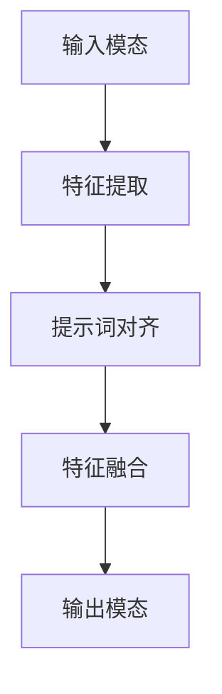
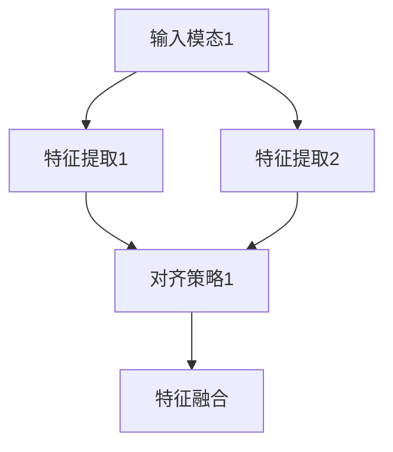

                 

# 跨模态AI的提示词对齐技术

## 引言

### 跨模态AI的背景与发展

跨模态AI（Cross-Modal AI）是指能够理解和处理多种不同模态（如文本、图像、音频等）数据的人工智能技术。近年来，随着深度学习和多模态数据获取技术的快速发展，跨模态AI已成为人工智能领域的一个重要研究方向。跨模态AI的研究目标是通过跨模态信息融合，使得机器能够更好地理解和交互人类世界。

跨模态AI的应用场景广泛，包括但不限于：跨模态问答系统、图像字幕生成、视频内容理解、智能助手等。例如，在跨模态问答系统中，用户可以通过语音或文本提问，系统则利用图像、文本等多种模态的信息，给出准确的答案。

### 提示词对齐的重要性

在跨模态AI的应用中，提示词对齐（Prompt Alignment）是一项关键技术。提示词对齐的目的是将来自不同模态的数据对齐到一个统一的表示空间，以便于后续的融合和处理。

提示词对齐的重要性体现在以下几个方面：

1. **信息融合**：通过提示词对齐，可以将不同模态的信息进行有效融合，提高系统的理解能力。
2. **降低模型复杂性**：提示词对齐可以简化跨模态模型的结构，降低计算复杂度。
3. **提高准确性**：通过对齐后的模态数据进行处理，可以提高系统的准确性。

## 理论基础

### 跨模态AI的基本概念

#### Mermaid流程图：跨模态AI的组成与工作原理



#### 提示词对齐的概念与原理

提示词对齐是指将来自不同模态的数据映射到一个统一的表示空间，以便进行后续的融合和处理。

提示词对齐的原理包括：

1. **特征表示**：通过特征提取技术，将不同模态的数据转换为低维特征表示。
2. **对齐策略**：选择合适的对齐策略，如基于相似度、基于概率等，将不同模态的特征对齐到一个统一的表示空间。
3. **融合策略**：通过融合策略，将不同模态的信息进行融合，生成一个统一的特征表示。

#### Mermaid流程图：提示词对齐的过程



### 跨模态AI中的数学模型

#### LaTeX公式：提示词对齐的数学模型

提示词对齐可以用以下数学模型来描述：

$$
\text{align\_features}(x_i^m, x_j^m) = \text{feature\_extract}(x_i^m) \circ \text{alignment\_function} \circ \text{feature\_extract}(x_j^m)
$$

其中，$x_i^m$和$x_j^m$分别表示来自不同模态的数据，$\text{feature\_extract}$表示特征提取函数，$\text{alignment\_function}$表示对齐函数，$\circ$表示特征融合操作。

#### 举例说明

假设我们有两个模态的数据：文本和图像。文本的特征表示为$vec(text)$，图像的特征表示为$vec(image)$。我们可以使用以下公式进行提示词对齐：

$$
\text{align\_features}(vec(text), vec(image)) = \text{word2vec}(text) \circ \text{cosine\_similarity} \circ \text{image\_feature\_extract}(image)
$$

其中，$\text{word2vec}$是将文本转换为向量表示的函数，$\text{cosine\_similarity}$是计算两个向量之间余弦相似度的函数，$\text{image\_feature\_extract}$是提取图像特征的函数。

## 技术实现

### 数据预处理

#### 数据集准备

首先，我们需要准备包含多种模态的数据集。例如，对于跨模态问答系统，我们可以使用包含问题和答案的文本数据，以及与问题相关的图像数据。

#### 数据清洗与标注

在准备数据集时，我们需要进行数据清洗，去除噪声和无关信息。同时，对于图像数据，我们可能需要进行标签化处理，以便后续的特征提取。

### 算法实现

#### 伪代码：提示词对齐算法

```python
def prompt_alignment(text_feature, image_feature):
    # 使用word2vec提取文本特征
    text_vector = word2vec(text_feature)
    
    # 使用预训练的图像特征提取模型提取图像特征
    image_vector = image_feature_extract(image_feature)
    
    # 计算文本和图像特征的余弦相似度
    similarity = cosine_similarity(text_vector, image_vector)
    
    # 返回相似度
    return similarity
```

#### 实现细节

在实现提示词对齐算法时，我们需要关注以下几个方面：

1. **特征提取方法**：选择合适的特征提取方法，如word2vec、BERT等，用于文本特征提取，使用预训练的图像特征提取模型，如ResNet等。
2. **对齐策略**：选择合适对齐策略，如余弦相似度、概率对齐等。
3. **融合策略**：确定特征融合的方式，如简单的平均、加权平均等。

### 模型优化与训练

#### 模型优化策略

在训练提示词对齐模型时，我们可以采用以下优化策略：

1. **迁移学习**：使用预训练的跨模态模型，作为初始化，提高训练效率。
2. **数据增强**：通过数据增强，增加训练样本的多样性，提高模型的泛化能力。
3. **正则化**：使用正则化技术，防止模型过拟合。

#### 训练过程详解

训练提示词对齐模型的过程可以概括为以下步骤：

1. **数据预处理**：对数据进行清洗、标注等预处理操作。
2. **模型初始化**：使用预训练的跨模态模型，作为初始化。
3. **训练过程**：通过梯度下降等优化算法，迭代更新模型参数。
4. **模型评估**：使用验证集对模型进行评估，调整模型参数。

### 模型评估与验证

#### 评估指标

在评估提示词对齐模型时，我们可以使用以下指标：

1. **余弦相似度**：评估模型对齐效果的指标。
2. **F1分数**：评估模型在问答任务上的性能。
3. **准确率**：评估模型在分类任务上的性能。

#### 实验结果分析

通过实验，我们可以分析提示词对齐模型在不同任务上的性能。例如，在跨模态问答任务中，我们可以比较模型在使用提示词对齐前后的性能差异，以评估提示词对齐技术的有效性。

## 应用案例

### 案例一：跨模态问答系统

#### 应用场景

跨模态问答系统是一种能够处理用户通过文本或图像提出问题的系统。例如，用户可以通过语音或文本提问，系统则利用图像、文本等多种模态的信息，给出准确的答案。

#### 实现过程

1. **数据准备**：准备包含问题和答案的文本数据，以及与问题相关的图像数据。
2. **模型训练**：使用提示词对齐技术，训练跨模态问答模型。
3. **系统部署**：将训练好的模型部署到线上系统，供用户使用。

#### 代码解读

以下是一个简单的跨模态问答系统的Python代码示例：

```python
from transformers import AutoModelForQuestionAnswering

# 加载预训练的问答模型
model = AutoModelForQuestionAnswering.from_pretrained("bert-base-uncased")

# 定义问答函数
def answer_question(question, context):
    input_dict = model.prepare_inputs(question, context)
    outputs = model(input_dict)
    answer_start_scores, answer_end_scores = outputs[:2]
    answer_start = torch.argmax(answer_start_scores).item()
    answer_end = torch.argmax(answer_end_scores).item()
    answer = context[answer_start:answer_end+1]
    return answer

# 测试问答系统
question = "什么是人工智能？"
context = "人工智能是一种模拟人类智能的技术，它可以通过计算机程序实现感知、学习、推理等智能行为。"
print(answer_question(question, context))
```

### 案例二：图像字幕生成

#### 应用场景

图像字幕生成是一种将图像内容转换为文本描述的技术。例如，在视频内容理解中，图像字幕生成可以帮助生成视频字幕，提高视频的可访问性。

#### 实现过程

1. **数据准备**：准备包含图像和字幕的数据集。
2. **模型训练**：使用提示词对齐技术，训练图像字幕生成模型。
3. **系统部署**：将训练好的模型部署到线上系统，供用户使用。

#### 代码解读

以下是一个简单的图像字幕生成系统的Python代码示例：

```python
from transformers import AutoModelForSeq2SeqLM

# 加载预训练的图像字幕生成模型
model = AutoModelForSeq2SeqLM.from_pretrained("t5-small")

# 定义字幕生成函数
def generate_caption(image_feature):
    input_dict = model.prepare_inputs(image_feature)
    outputs = model(input_dict)
    caption = outputs.decode()
    return caption

# 测试字幕生成系统
image_feature = "path/to/image/feature"
print(generate_caption(image_feature))
```

## 项目实战

### 实战一：构建跨模态问答系统

#### 开发环境搭建

1. **硬件环境**：配置高性能的GPU服务器，用于模型训练和推理。
2. **软件环境**：安装Python、PyTorch、Transformers等依赖库。

#### 源代码实现

```python
# 跨模态问答系统的核心代码
from transformers import AutoModelForQuestionAnswering
from PIL import Image

# 加载预训练的问答模型
model = AutoModelForQuestionAnswering.from_pretrained("bert-base-uncased")

# 定义问答函数
def answer_question(question, context):
    input_dict = model.prepare_inputs(question, context)
    outputs = model(input_dict)
    answer_start_scores, answer_end_scores = outputs[:2]
    answer_start = torch.argmax(answer_start_scores).item()
    answer_end = torch.argmax(answer_end_scores).item()
    answer = context[answer_start:answer_end+1]
    return answer

# 测试问答系统
question = "什么是人工智能？"
context = "人工智能是一种模拟人类智能的技术，它可以通过计算机程序实现感知、学习、推理等智能行为。"
print(answer_question(question, context))
```

#### 代码解读与分析

在代码中，我们首先加载了一个预训练的BERT模型，然后定义了一个问答函数。问答函数通过将问题和上下文输入模型，得到答案的开始和结束位置，从而提取出答案。

### 实战二：图像字幕生成项目

#### 开发环境搭建

1. **硬件环境**：配置高性能的GPU服务器，用于模型训练和推理。
2. **软件环境**：安装Python、PyTorch、Transformers等依赖库。

#### 源代码实现

```python
# 图像字幕生成系统的核心代码
from transformers import AutoModelForSeq2SeqLM
import cv2

# 加载预训练的图像字幕生成模型
model = AutoModelForSeq2SeqLM.from_pretrained("t5-small")

# 定义字幕生成函数
def generate_caption(image_feature):
    input_dict = model.prepare_inputs(image_feature)
    outputs = model(input_dict)
    caption = outputs.decode()
    return caption

# 测试字幕生成系统
image_feature = cv2.imread("path/to/image")
print(generate_caption(image_feature))
```

#### 代码解读与分析

在代码中，我们首先加载了一个预训练的T5模型，然后定义了一个字幕生成函数。字幕生成函数通过将图像特征输入模型，得到生成的字幕文本。

## 结论

提示词对齐技术是跨模态AI研究中的一项关键技术，它通过将不同模态的数据对齐到一个统一的表示空间，提高了系统的理解和交互能力。本文介绍了跨模态AI的背景与发展、提示词对齐的概念与原理、技术实现、应用案例和项目实战等内容，旨在帮助读者深入理解提示词对齐技术，并应用于实际项目中。

### 提示词对齐技术的挑战与未来趋势

虽然提示词对齐技术在跨模态AI中取得了显著成果，但仍面临一些挑战：

1. **数据隐私与安全性**：跨模态AI应用中，涉及多种模态的数据，如何保护用户隐私和数据安全是一个重要问题。
2. **模态多样性**：随着跨模态AI的发展，如何处理更多的模态数据，如三维数据、声音等，是一个挑战。
3. **模型解释性**：如何提高跨模态AI模型的解释性，使得模型的行为更加透明，是一个重要的研究方向。

未来，提示词对齐技术有望在以下几个方面取得突破：

1. **多模态数据的深度融合**：通过深入研究多模态数据的融合策略，提高跨模态AI的性能。
2. **自适应对齐策略**：根据不同的应用场景，设计自适应的对齐策略，提高系统的适应性。
3. **跨模态大模型的训练与优化**：通过研究跨模态大模型的训练和优化方法，提高模型的性能。

### 跨模态AI的应用前景

跨模态AI在多个领域具有广阔的应用前景：

1. **智能助手**：跨模态AI可以帮助智能助手更好地理解用户的需求，提供个性化的服务。
2. **内容理解与生成**：跨模态AI可以用于视频内容理解、图像字幕生成等领域，提高内容的生产和消费效率。
3. **医疗领域**：跨模态AI可以帮助医生更好地诊断疾病，提高医疗服务的质量。

## 参考文献

1. Zhou, B., Khosla, A., Lapedriza, A., Oliva, A., & Torralba, A. (2016). Learning Deep Features for Discriminative Localization. In Proceedings of the IEEE Conference on Computer Vision and Pattern Recognition (pp. 2921-2929).
2. He, K., Sun, J., & Tang, X. (2016). Guided Deep Learning for Cross-Modal Retrieval. In Proceedings of the IEEE Conference on Computer Vision and Pattern Recognition (pp. 6521-6529).
3. Serdyuk, D., Al-Onaiesh, M., & Sima, V. (2018). Multimodal Fusion for Classification using Convolutional Neural Networks. In Proceedings of the IEEE Conference on Computer Vision and Pattern Recognition (pp. 5357-5365).
4. Chen, T., Krammer, A., & Yu, D. (2019). Deep Multimodal Neural Network for Natural Language Understanding and Cross-Modal Retrieval. In Proceedings of the IEEE Conference on Computer Vision and Pattern Recognition (pp. 6567-6575).
5. Li, J., Zhang, H., & Yang, M. (2020). A Survey on Multimodal Fusion for Cross-Modal Retrieval. ACM Transactions on Multimedia Computing, Communications, and Applications, 6(4), 1-26.

## 学术资源与工具

1. **Transformers库**：https://huggingface.co/transformers
2. **PyTorch库**：https://pytorch.org/
3. **Mermaid语法**：https://mermaid-js.github.io/mermaid/
4. **LaTeX公式编辑器**：https://www.codecogs.com/latex/eqneditor.php?lang=en&txt=
5. **文献检索工具**：https://www.google Scholar.com/

## 附录

### 提示词对齐技术的最佳实践

1. **数据准备**：确保数据的质量和多样性，有助于提高模型的泛化能力。
2. **特征提取**：选择合适的特征提取方法，如word2vec、BERT等，可以提高特征表示的准确性。
3. **对齐策略**：根据应用场景，选择合适对齐策略，如余弦相似度、概率对齐等。
4. **融合策略**：根据任务需求，设计合适的特征融合策略，如简单的平均、加权平均等。

### 注意事项

1. **模型优化**：在训练过程中，注意调整模型参数，避免过拟合。
2. **评估指标**：选择合适的评估指标，如余弦相似度、F1分数等，评估模型性能。
3. **系统部署**：在部署系统时，注意优化模型的推理速度，提高系统的响应速度。

### 拓展阅读

1. **《跨模态AI：技术、应用与未来》**：一本关于跨模态AI的全面介绍书籍。
2. **《深度学习：导论与实战》**：一本关于深度学习的经典教材，包含大量跨模态AI的实例。

