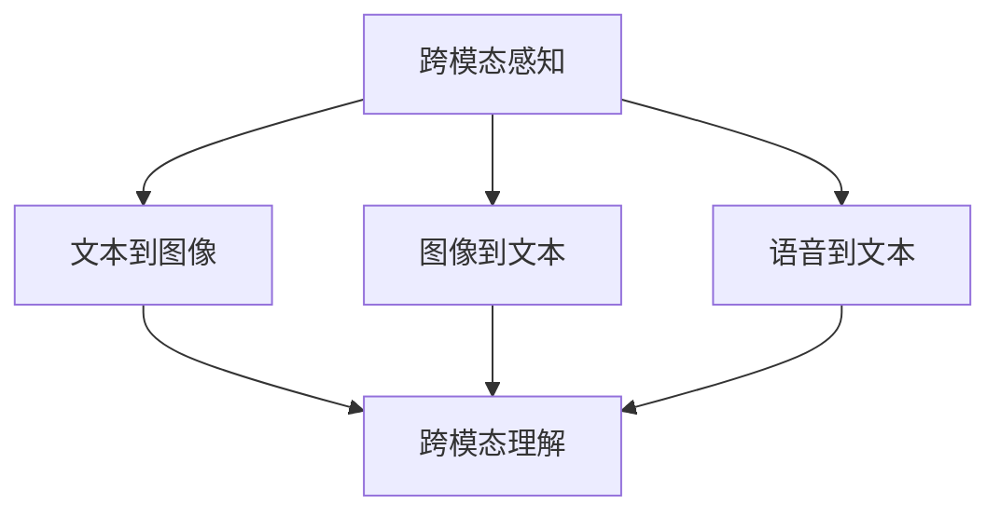

                 

# 跨模态提示词：整合文本、图像和语音的挑战

## 关键词
- 跨模态提示词
- 文本-图像-语音整合
- 生成对抗网络（GAN）
- 循环一致模型（CycleGAN）
- 注意力机制
- 跨模态对话系统
- 图像识别与检索
- 视频分析
- 项目实战

## 摘要
本文探讨了跨模态提示词在整合文本、图像和语音领域中的挑战和解决方案。首先，我们介绍了跨模态提示词的定义和跨模态交互的基本原理。接着，详细讲解了文本到图像、图像到文本和语音到文本的生成模型。然后，我们介绍了跨模态对话系统、图像识别与检索以及视频分析的应用。最后，通过一个跨模态信息检索系统的项目实战，展示了如何实现和部署跨模态整合应用。

## 第一部分：引言与核心概念

### 第1章 引言

#### 1.1 跨模态提示词的定义
跨模态提示词是指能够引导模型在不同模态（文本、图像、语音）之间进行交互的提示性输入。这些提示词在机器学习和人工智能领域中，尤其重要，因为它们能够促进模型理解和整合不同模态的信息。

#### 1.2 跨模态交互的重要性
随着人工智能技术的发展，跨模态交互成为了研究的热点。它不仅能够提升模型的性能，还能够拓展人工智能的应用场景。跨模态交互在智能助手、图像识别、视频分析等领域具有广泛的应用前景。

### 第2章 跨模模态交互的基本原理

#### 2.1 跨模态感知
跨模态感知是指模型能够理解和处理不同模态的信息。文本到图像的转换、图像到文本的转换和语音到文本的转换是跨模态感知的核心任务。

#### 2.2 跨模态理解
跨模态理解是指模型能够在不同模态之间建立联系，理解信息的一致性和连贯性。对话生成、图像和文本语义的一致性、语音情感识别是跨模态理解的关键挑战。

### Mermaid 流程图


## 第二部分：核心算法原理讲解

### 第3章 文本到图像的生成模型

#### 3.1 生成对抗网络（GAN）
生成对抗网络（GAN）是一种通过竞争学习生成数据分布的模型。它由生成器和判别器两个部分组成。生成器尝试生成逼真的图像，判别器则判断图像是真实还是生成的。通过这种对抗过程，生成器能够不断提高生成图像的质量。

```python
# GAN的伪代码
class Generator(nn.Module):
    def forward(self, z):
        # 噪声向量z通过生成器生成图像
        return x_g = self(z)

class Discriminator(nn.Module):
    def forward(self, x):
        # 判别器判断图像x的真实性
        return validity = self(x)
```

#### 3.2 循环一致模型（CycleGAN）
循环一致模型（CycleGAN）是一种能够学习不同域之间映射关系的生成模型。它通过循环一致性损失，使得生成的图像能够映射回原始域，并保持原有的内容。

```python
# CycleGAN的伪代码
def cycle_loss(real_images, generated_images, lambda1):
    # 计算真实图像和生成图像之间的循环一致性损失
    return loss_cycle = lambda1 * (real_images - generated_images)
```

### 第4章 图像到文本的生成模型

#### 4.1 图像文本一致性模型
图像文本一致性模型旨在学习图像和文本之间的对应关系，确保生成的文本与图像内容一致。

```python
# 图像文本一致性模型的伪代码
class ImageTextConsistencyModel(nn.Module):
    def forward(self, image, text_embedding):
        # 图像和文本嵌入通过模型处理，生成一致性评分
        return consistency_score = self(image, text_embedding)
```

#### 4.2 图像描述生成模型
图像描述生成模型通过学习图像的特征，生成与图像内容相关的文本描述。

```python
# 图像描述生成模型的伪代码
class ImageCaptionGenerator(nn.Module):
    def forward(self, image, hidden_state):
        # 图像特征和隐藏状态通过模型生成文本描述
        return caption = self(image, hidden_state)
```

### 第5章 语音到文本的生成模型

#### 5.1 基于深度学习的语音识别
基于深度学习的语音识别利用神经网络模型对语音信号进行处理，实现语音到文本的转换。

```python
# 基于深度学习的语音识别的伪代码
class SpeechRecognitionModel(nn.Module):
    def forward(self, audio_signal, hidden_state):
        # 语音信号和隐藏状态通过模型处理，生成文本
        return transcript = self(audio_signal, hidden_state)
```

#### 5.2 基于注意力机制的语音识别
基于注意力机制的语音识别通过关注重要的语音特征，提高识别的准确性。

```python
# 基于注意力机制的语音识别的伪代码
class AttentionBasedRecognitionModel(nn.Module):
    def forward(self, audio_signal, hidden_state):
        # 语音信号和隐藏状态通过注意力机制处理，生成文本
        return transcript = self(audio_signal, hidden_state)
```

## 第三部分：跨模态整合应用

### 第6章 跨模态对话系统

#### 6.1 跨模态对话系统的架构
跨模态对话系统由多个模块组成，包括语音识别、文本理解、文本生成和语音合成等。它们共同工作，实现跨模态的交互。

#### 6.2 跨模态对话的挑战
跨模态对话系统面临的主要挑战包括上下文一致性和多模态信息的融合。为了解决这些问题，研究人员提出了各种策略和技术。

### 第7章 跨模态图像识别与检索

#### 7.1 图像识别中的文本辅助
文本辅助图像识别通过结合图像和文本信息，提高识别的准确性。

#### 7.2 图像识别中的语音辅助
语音辅助图像识别利用语音信息来辅助图像识别，拓展了图像识别的应用场景。

### 第8章 跨模态视频分析

#### 8.1 视频中的文本识别
视频文本识别通过分析视频帧，提取文本信息。

#### 8.2 视频中的语音分析
视频语音分析通过处理视频中的语音信号，实现语音识别和情感分析。

## 第四部分：项目实战

### 第9章 跨模态信息检索系统开发

#### 9.1 项目概述
项目旨在开发一个跨模态信息检索系统，支持文本、图像和语音的检索。

#### 9.2 环境搭建
介绍了项目的开发环境，包括Python、PyTorch和TensorFlow等。

#### 9.3 系统设计
详细阐述了系统的设计，包括数据预处理、模型训练和推理等。

#### 9.4 代码实现
展示了如何使用Python代码实现跨模态信息检索系统的各个模块。

#### 9.5 代码解读
对关键代码段进行了解读，帮助读者理解系统的实现细节。

#### 9.6 应用解读与分析
分析了系统的应用场景，并讨论了性能和效果。

#### 9.7 项目小结
总结了项目的成果和经验，为未来的研究提供了启示。

### 第10章 跨模模态交互应用案例

#### 10.1 案例介绍
介绍了跨模态交互在某个特定领域的应用案例。

#### 10.2 案例实现
详细讲解了案例的实现过程，包括算法选择、数据预处理和模型训练等。

#### 10.3 案例分析
分析了案例的实际效果，讨论了可能改进的方向。

#### 10.4 案例小结
总结了案例的成果和经验，为类似项目提供了参考。

## 附录

### 附录 A：跨模态技术资源

#### A.1 开源框架与工具
列举了常用的开源框架和工具，包括PyTorch、TensorFlow、OpenCV和Kaldi等。

#### A.2 学习资源推荐
推荐了相关的书籍、论文集和在线课程，为读者提供了深入学习的途径。

## 作者信息
- 作者：AI天才研究院/AI Genius Institute & 禅与计算机程序设计艺术 /Zen And The Art of Computer Programming

[本文由AI天才研究院/AI Genius Institute撰写，旨在探讨跨模态提示词在整合文本、图像和语音领域中的挑战和解决方案。文章内容仅供参考，具体实现需根据实际需求进行调整。]

---

### 最佳实践 Tips

- **注意事项**：在进行跨模态整合应用时，需特别注意数据的质量和多样性，这对模型的性能至关重要。
- **拓展阅读**：
  - 《深度学习》（Goodfellow, Bengio, Courville） - 介绍深度学习的基础知识，包括GAN和循环一致模型。
  - 《语音识别》（Povey, Bourlard, Agirre） - 涵盖语音识别的理论和实践。
  - 《计算机视觉：算法与应用》（Kanade, Fei-Fei） - 介绍图像识别和描述生成的方法。
- **小结**：跨模态提示词是整合文本、图像和语音的关键技术，具有广泛的应用前景。通过本文的介绍，读者可以了解到跨模态整合的基本原理和应用场景，以及如何进行项目实战。希望本文能为读者提供有价值的参考。

