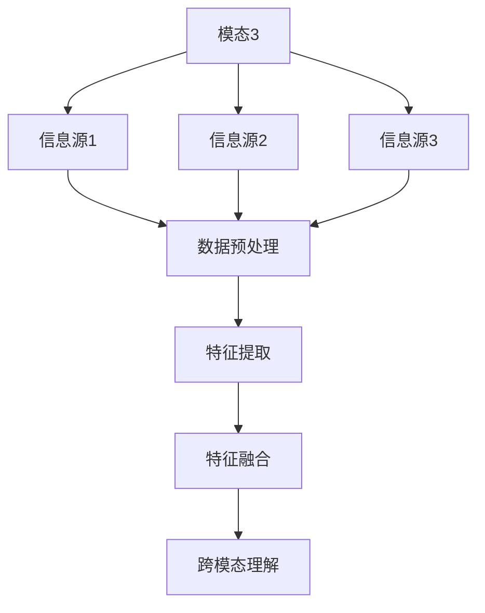
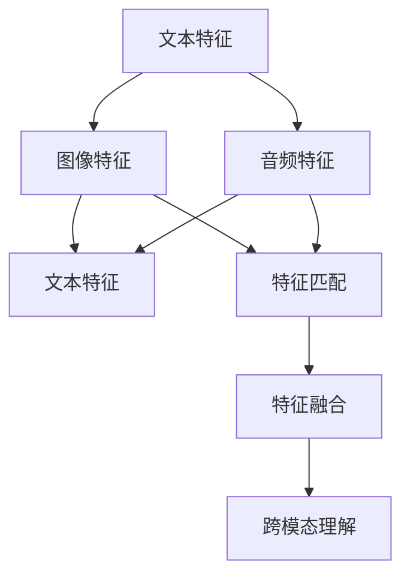
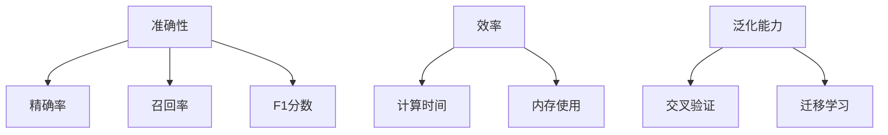

                 


### 第1章 引言

#### 1.1 跨模态理解能力评估的重要性

随着信息技术的快速发展，数据量呈现爆炸式增长，其中不仅包括文本数据，还涵盖了图像、音频、视频等多种模态的信息。跨模态理解能力，指的是系统或模型在不同模态信息之间进行有效转换和整合，进而提取语义信息的能力。跨模态理解能力评估，旨在衡量这种能力的高低，从而为算法优化、模型改进提供依据。

跨模态理解能力评估的重要性体现在多个方面：

1. **提升模型性能**：通过评估，可以发现模型在不同模态之间的整合能力，进而针对性地优化模型结构和算法，提高整体性能。

2. **促进跨学科合作**：跨模态理解能力评估作为一种通用技术，能够促进计算机视觉、自然语言处理、语音识别等不同领域的合作，推动多学科交叉融合。

3. **应用场景广泛**：从智能助手、自动驾驶到医疗影像分析，跨模态理解能力评估的应用场景十分广泛，对各行各业的发展具有重要的推动作用。

#### 1.2 多源信息整合的基本概念

多源信息整合，是指将来自不同模态、不同来源的信息进行有效融合，以提取出更有价值的语义信息。在多源信息整合中，常见的模态包括文本、图像、音频、视频等。

多源信息整合的基本概念包括：

1. **数据预处理**：对多源信息进行清洗、标准化和特征提取，以便后续整合和处理。

2. **特征融合**：将不同模态的特征进行整合，常见的融合方法有拼接、加权融合、特征级融合和决策级融合等。

3. **信息挖掘**：通过机器学习、深度学习等算法，从整合后的特征中挖掘出高层次的语义信息。

#### 1.3 书籍的组织结构

本书旨在为读者提供一个全面而系统的跨模态理解能力评估指南，主要包括以下几个部分：

1. **理论基础**：介绍跨模态理解能力评估的基本概念、理论框架和评估指标。

2. **算法实现**：讲解多源信息整合的原理和算法，包括特征提取、特征融合和模型训练等。

3. **应用实践**：通过实际案例展示跨模态理解能力评估在不同领域的应用，包括自然语言处理、计算机视觉等。

4. **未来展望**：分析跨模态理解能力评估技术的发展趋势和未来研究方向。

### 总结

本章介绍了跨模态理解能力评估的重要性、多源信息整合的基本概念以及本书的组织结构。在接下来的章节中，我们将深入探讨跨模态理解能力评估的理论基础、算法实现和应用实践，帮助读者全面了解这一重要技术领域。

## 第2章 跨模态理解能力评估的背景

#### 2.1 人工智能的发展历程

人工智能（AI）作为计算机科学的一个重要分支，其发展历程可以追溯到20世纪50年代。当时，科学家们首次提出了“人工智能”这一概念，旨在创建能够模仿人类智能的计算机系统。在随后的几十年里，人工智能经历了多个阶段的发展：

1. **早期探索**（1950-1969）：这一时期，人工智能主要集中在符号推理和逻辑编程上。典型的代表是1956年在达特茅斯会议上提出的“逻辑符号机器”概念。

2. **繁荣与挫折**（1970-1980）：随着计算机性能的提升，人工智能领域出现了一系列突破，例如专家系统和自然语言处理。然而，由于对人工智能过高的期望和算法局限，人工智能在20世纪80年代遭遇了“人工智能寒冬”。

3. **复苏与崛起**（1990-2010）：得益于计算能力和算法的进步，人工智能在图像识别、语音识别等领域取得了显著成果。特别是深度学习算法的出现，为人工智能的发展注入了新的活力。

4. **全面爆发**（2010至今）：随着大数据、云计算和深度学习技术的快速发展，人工智能迎来了新一轮的爆发。从自动驾驶、智能助手到医疗诊断，人工智能的应用场景越来越广泛。

#### 2.2 跨模态理解的兴起

跨模态理解是人工智能领域的一个重要研究方向，其核心目标是通过整合多种模态的信息，实现更准确、更智能的语义理解和信息提取。跨模态理解的研究兴起主要受到以下几个因素的推动：

1. **数据多样性**：现实世界中的信息往往不是单一的模态，而是包含文本、图像、音频、视频等多种模态。跨模态理解能够更好地处理这些多样化的信息。

2. **复杂性问题**：许多现实问题，如语音识别、图像分类、视频理解等，涉及到多种模态的信息。跨模态理解能够提供更丰富的信息，有助于解决这些复杂问题。

3. **技术进步**：随着深度学习技术的发展，特别是在图像识别、语音识别、自然语言处理等领域的突破，跨模态理解的研究变得更加可行。

#### 2.3 多源信息整合的应用场景

多源信息整合在多个领域都有着广泛的应用，以下是几个典型的应用场景：

1. **自然语言处理**：跨模态理解在自然语言处理领域有着广泛的应用，如跨语言文本理解、文本情感分析、跨模态对话系统等。

2. **计算机视觉**：多源信息整合在计算机视觉领域尤为重要，如视觉对象识别、视频内容理解、视觉对话系统等。

3. **医疗影像分析**：多源信息整合可以帮助医生更准确地诊断疾病，如医学影像分析、基因组学数据整合等。

4. **娱乐与艺术**：跨模态理解在娱乐与艺术领域也有着独特的应用，如多模态推荐系统、艺术创作辅助等。

5. **物联网与智能家居**：多源信息整合可以实现智能家居的智能交互，如语音控制、图像识别等。

#### 总结

本章介绍了人工智能的发展历程、跨模态理解的兴起以及多源信息整合的应用场景。通过对这些背景信息的了解，我们可以更好地理解跨模态理解能力评估的重要性和应用价值。在接下来的章节中，我们将深入探讨跨模态理解能力评估的理论基础、算法实现和应用实践。

## 第3章 跨模态理解能力评估的核心概念

#### 3.1 模态与信息源

在跨模态理解能力评估中，模态（Modality）是一个关键概念。模态指的是信息的不同形式或载体，常见的模态包括文本（Text）、图像（Image）、音频（Audio）和视频（Video）等。每个模态都携带着独特的信息，它们可以通过不同的传感器进行采集。

信息源（Information Source）是提供信息的实体或系统，它可以是一个传感器、一个数据库，也可以是一个数据流。在跨模态理解中，信息源可以是单一的模态，也可以是多个模态的组合。例如，一个视频监控系统可以同时提供图像和音频信息。

**核心概念联系**：

- **模态**：不同模态的信息在形式和内容上有所不同，但它们共同构成了丰富的信息环境，为跨模态理解提供了基础。
- **信息源**：信息源决定了信息的类型和质量，不同的信息源可以提供不同模态的信息，从而影响跨模态理解的准确性和效率。

**Mermaid流程图**：



#### 3.2 跨模态关联机制

跨模态关联机制（Cross-Modal Association Mechanism）是指在不同模态信息之间建立联系和关联的过程。这一机制的核心在于如何有效地整合不同模态的信息，以提取出更高层次的语义信息。

跨模态关联机制通常包括以下几个步骤：

1. **特征提取**：从每个模态中提取出关键特征。这些特征可以是低层次的，如像素值、音频频率；也可以是高层次的，如文本中的词向量、图像中的对象识别。

2. **特征匹配**：将不同模态的特征进行匹配和关联。常见的匹配方法包括基于相似度的匹配、基于聚类的匹配和基于模型的匹配。

3. **特征融合**：将匹配后的特征进行整合，以生成统一的特征表示。特征融合的方法包括拼接融合、加权融合和特征级融合等。

**核心概念联系**：

- **特征提取**：特征提取是跨模态关联的基础，不同模态的特征代表了信息的关键部分，是建立关联的基础。
- **特征匹配**：特征匹配是关联不同模态信息的关键步骤，它决定了不同模态之间的联系紧密程度。
- **特征融合**：特征融合将多个模态的信息整合在一起，形成一个统一的特征表示，这是跨模态理解的关键。

**Mermaid流程图**：



#### 3.3 跨模态理解能力的评价指标

跨模态理解能力的评价指标是评估系统或模型跨模态整合能力的关键。这些评价指标通常基于实际应用的需求，包括准确性、效率、泛化能力等。

以下是几个常用的跨模态理解能力评价指标：

1. **准确性**：指模型在跨模态任务中预测结果的正确性。准确性通常通过精确率、召回率和F1分数等指标来衡量。

2. **效率**：指模型在处理跨模态任务时的计算资源和时间消耗。效率可以通过计算时间、内存使用等指标来评估。

3. **泛化能力**：指模型在面对新任务或新数据时表现的能力。泛化能力可以通过交叉验证、迁移学习等实验来评估。

**核心概念联系**：

- **准确性**：准确性是评估模型性能的直接指标，反映了模型在跨模态理解任务中的表现。
- **效率**：效率决定了模型在实际应用中的可行性，是模型在实际环境中广泛应用的重要保障。
- **泛化能力**：泛化能力体现了模型的适应性和稳健性，是模型长期发展的关键。

**Mermaid流程图**：



### 总结

本章介绍了跨模态理解能力评估中的核心概念，包括模态与信息源、跨模态关联机制和跨模态理解能力的评价指标。通过对这些核心概念的理解，我们可以更好地把握跨模态理解能力评估的理论基础，为后续的算法实现和应用实践打下坚实的基础。

## 第4章 多源信息整合的原理与算法

#### 4.1 多源信息整合的基本原理

多源信息整合（Multi-Source Information Integration）是指将来自不同模态、不同来源的信息进行有效融合，以提取出更高层次、更有价值的信息。在跨模态理解中，多源信息整合是实现跨模态关联和理解的关键步骤。

多源信息整合的基本原理可以概括为以下几个步骤：

1. **数据采集**：从不同的信息源采集原始数据。这些信息源可能包括文本数据库、图像库、音频库等。

2. **数据预处理**：对采集到的原始数据进行清洗、标准化和格式转换，以确保数据的一致性和质量。数据预处理包括去噪、缺失值填充、数据归一化等操作。

3. **特征提取**：从预处理后的数据中提取出关键特征。这些特征可以是低层次的，如像素值、音频频率；也可以是高层次的，如文本中的词向量、图像中的对象识别。

4. **特征融合**：将不同模态的特征进行整合，以生成统一的特征表示。特征融合的方法包括拼接融合、加权融合、特征级融合和决策级融合等。

5. **模型训练**：使用整合后的特征对模型进行训练，以实现跨模态的理解和预测。

#### 4.2 常见的多源信息整合算法

在多源信息整合中，常用的算法主要包括以下几种：

1. **拼接融合**（Concatenation Fusion）：

拼接融合是一种简单直接的多源信息整合方法，将不同模态的特征向量直接拼接在一起，形成一个更长的特征向量。这种方法在信息量较少的情况下表现较好，但可能导致特征维度过高，增加计算复杂度。

**伪代码**：

```
function SPLIT_FEATURE(feature1, feature2):
    return [feature1, feature2]
```

2. **加权融合**（Weighted Fusion）：

加权融合通过为不同模态的特征分配不同的权重，以平衡不同模态的重要性。常见的加权方法包括基于信息熵的权重分配和基于模型优化的权重分配。

**伪代码**：

```
function WEIGHTED_FUSION(feature1, feature2, weight1, weight2):
    return weight1 * feature1 + weight2 * feature2
```

3. **特征级融合**（Feature-Level Fusion）：

特征级融合是在特征层面对不同模态的信息进行整合。常见的特征级融合方法包括基于聚类的融合和基于模型的融合。

**伪代码**：

```
function CLUSTER_FUSION(features):
    # 使用聚类算法将特征分组
    clusters = CLUSTERING(features)
    # 对每个聚类组进行特征融合
    fused_features = []
    for cluster in clusters:
        fused_features.append(AVG(cluster))
    return fused_features
```

4. **决策级融合**（Decision-Level Fusion）：

决策级融合是在模型决策层面对不同模态的信息进行整合。这种方法通常在多个模型的基础上，通过投票、加权平均等方法生成最终的决策。

**伪代码**：

```
function DECISION_FUSION(predictions1, predictions2):
    # 对每个预测结果进行加权平均
    fused_prediction = (predictions1 * weight1 + predictions2 * weight2) / (weight1 + weight2)
    return fused_prediction
```

#### 4.3 多源信息整合的挑战与解决方案

多源信息整合面临以下几个主要挑战：

1. **数据不平衡**：不同模态的数据量可能存在显著差异，导致信息整合过程中数据不平衡。

**解决方案**：通过数据增强、欠采样或过采样等方法来平衡不同模态的数据。

2. **特征冗余**：不同模态的特征可能存在高度冗余，导致信息整合过程中出现冗余信息。

**解决方案**：使用特征选择算法，如主成分分析（PCA）、线性判别分析（LDA）等，减少特征冗余。

3. **计算复杂度**：特征融合和模型训练过程中，计算复杂度可能非常高。

**解决方案**：采用高效的特征提取算法和模型训练方法，如深度学习中的卷积神经网络（CNN）和递归神经网络（RNN）。

4. **模型适应性**：不同模态的信息可能具有不同的统计分布，导致模型在不同模态上的适应性差异。

**解决方案**：采用自适应融合策略，如基于模型的权重调整和自适应特征选择。

### 总结

本章介绍了多源信息整合的基本原理和常见算法，包括拼接融合、加权融合、特征级融合和决策级融合。同时，还讨论了多源信息整合过程中面临的挑战及其解决方案。这些理论和算法为跨模态理解能力评估提供了重要的基础，在后续章节中将继续深入探讨跨模态理解能力的评估方法和应用实践。

## 第5章 跨模态理解能力的数学模型

#### 5.1 信息熵与信息增益

在跨模态理解能力的评估中，信息熵（Entropy）和信息增益（Information Gain）是两个重要的概念，它们为衡量信息的质量和相关性提供了数学工具。

**信息熵**：

信息熵是度量一个随机变量不确定性的量。对于一个离散的随机变量\( X \)，其熵 \( H(X) \) 可以用以下公式计算：

\[ H(X) = -\sum_{i=1}^{n} p(x_i) \log_2 p(x_i) \]

其中，\( p(x_i) \) 是随机变量 \( X \) 取值为 \( x_i \) 的概率。

信息熵的直观解释是：一个随机变量的不确定性越高，其熵值越大。在跨模态理解中，我们可以使用信息熵来衡量不同模态的信息质量。

**信息增益**：

信息增益（Information Gain）是衡量一个特征对于分类的重要性的量。对于特征 \( A \) 和类别 \( C \)，信息增益 \( IG(A, C) \) 可以通过以下公式计算：

\[ IG(A, C) = I(C) - I(C|A) \]

其中，\( I(C) \) 是类别 \( C \) 的信息熵，\( I(C|A) \) 是在特征 \( A \) 已知的条件下，类别 \( C \) 的条件信息熵。

信息增益的直观解释是：一个特征对于分类的重要性越高，其信息增益越大。在跨模态理解中，我们可以使用信息增益来衡量不同模态特征对于理解任务的重要性。

**信息熵与信息增益的关系**：

信息熵和信息增益之间存在密切的关系。信息增益实际上是条件熵与总熵的差值，它反映了特征对于类别不确定性的减少程度。因此，信息增益越大，特征与类别之间的相关性越强，说明该特征对于理解任务越重要。

**举例说明**：

假设我们有一个分类任务，需要判断一个邮件是否为垃圾邮件。邮件的模态包括文本内容和邮件的图像附件。我们使用文本内容的词频和图像的颜色分布作为特征。

首先，我们计算邮件是否为垃圾邮件的总熵 \( H(C) \)，假设垃圾邮件和非垃圾邮件的概率分别为 \( p(\text{垃圾邮件}) = 0.5 \) 和 \( p(\text{非垃圾邮件}) = 0.5 \)：

\[ H(C) = -0.5 \log_2 0.5 - 0.5 \log_2 0.5 = 1 \]

接着，我们计算在文本内容特征 \( A \) 已知的条件下，邮件是否为垃圾邮件的条件信息熵 \( H(C|A) \)。假设文本内容的词频分布对垃圾邮件和非垃圾邮件的分类有显著影响，条件信息熵较小：

\[ H(C|A) = 0.3 \]

因此，文本内容特征的信息增益 \( IG(A, C) \) 为：

\[ IG(A, C) = 1 - 0.3 = 0.7 \]

这表明文本内容特征对于判断邮件是否为垃圾邮件非常重要。

#### 5.2 联合熵与条件熵

联合熵（Joint Entropy）和条件熵（Conditional Entropy）是描述多个变量之间信息关联性的重要概念。

**联合熵**：

联合熵 \( H(X, Y) \) 衡量两个随机变量 \( X \) 和 \( Y \) 的联合分布 \( p(x, y) \) 的不确定性。其计算公式为：

\[ H(X, Y) = -\sum_{x \in X} \sum_{y \in Y} p(x, y) \log_2 p(x, y) \]

直观上，联合熵表示当同时知道 \( X \) 和 \( Y \) 的值时，信息的不确定性。

**条件熵**：

条件熵 \( H(Y|X) \) 衡量在随机变量 \( X \) 已知的情况下，随机变量 \( Y \) 的不确定性。其计算公式为：

\[ H(Y|X) = -\sum_{x \in X} \sum_{y \in Y} p(x, y) \log_2 p(y|x) \]

条件熵反映了 \( X \) 和 \( Y \) 之间的关联性：当 \( X \) 的值已知时，\( Y \) 的不确定性降低。

**联合熵与条件熵的关系**：

联合熵与条件熵之间存在以下关系：

\[ H(X, Y) = H(X) + H(Y|X) \]

这个公式称为信息熵的链式法则，它表明联合熵是总熵加上条件熵。这意味着，当我们知道两个变量 \( X \) 和 \( Y \) 的联合分布时，可以通过已知 \( X \) 来减少 \( Y \) 的不确定性。

在跨模态理解中，联合熵和条件熵可以用来衡量不同模态之间的关联性和信息的传递效率。

**举例说明**：

假设我们有一个文本和图像的跨模态任务，文本的词频分布 \( X \) 和图像的颜色分布 \( Y \) 是两个模态。我们计算文本和图像的联合熵 \( H(X, Y) \)，以及在文本已知条件下的图像条件熵 \( H(Y|X) \)。

首先，计算联合熵：

\[ H(X, Y) = -\sum_{x} \sum_{y} p(x, y) \log_2 p(x, y) \]

然后，计算条件熵：

\[ H(Y|X) = -\sum_{x} p(x) \sum_{y} p(y|x) \log_2 p(y|x) \]

如果我们发现 \( H(Y|X) \) 很小，这意味着文本信息对图像信息的不确定性减少很多，说明文本和图像之间存在很强的关联性。

#### 5.3 跨模态理解能力的量化评估模型

为了量化跨模态理解能力，我们需要建立一套评估模型，该模型能够综合衡量不同模态之间的关联性和信息整合的效率。

一种常用的量化评估模型是信息整合模型（Information Integration Model），其核心思想是通过计算跨模态特征的联合熵和条件熵，来评估跨模态理解的能力。

**信息整合模型**：

\[ I_{\text{integration}} = H(X, Y) - H(Y|X) \]

这个模型表示，当我们同时知道 \( X \) 和 \( Y \) 时，信息的不确定性减少了 \( H(Y|X) \)，而 \( H(X, Y) \) 则是总的信息量。因此，\( I_{\text{integration}} \) 越大，说明跨模态理解能力越强。

**举例说明**：

假设我们有一个文本和图像的跨模态任务，文本的特征表示为 \( X \)，图像的特征表示为 \( Y \)。我们计算文本和图像的联合熵 \( H(X, Y) \) 和条件熵 \( H(Y|X) \)：

\[ H(X, Y) = 2.5 \]
\[ H(Y|X) = 1.2 \]

因此，跨模态理解能力 \( I_{\text{integration}} \) 为：

\[ I_{\text{integration}} = 2.5 - 1.2 = 1.3 \]

这个值表明，跨模态理解能力较强，因为文本和图像之间的信息整合效率较高。

**模型扩展**：

在实际应用中，我们可以将信息整合模型扩展到多个模态。假设有三个模态：文本 \( X \)，图像 \( Y \)，和音频 \( Z \)。我们计算联合熵和条件熵：

\[ I_{\text{integration}}(X, Y, Z) = H(X, Y, Z) - H(Y|X, Z) - H(Z|X, Y) \]

这个扩展模型考虑了多个模态之间的相互作用和整合效率。

### 总结

本章介绍了跨模态理解能力的数学模型，包括信息熵、信息增益、联合熵和条件熵等概念。通过这些数学工具，我们可以量化不同模态之间的关联性和信息整合的效率，从而评估跨模态理解能力。这些模型为跨模态理解能力评估提供了重要的理论基础，在后续章节中，我们将继续探讨跨模态理解能力评估的实验方法和应用实践。

## 第6章 跨模态理解能力的实验方法

#### 6.1 数据集准备

在进行跨模态理解能力评估的实验中，数据集的准备是至关重要的一步。数据集的质量直接影响到实验的结果和模型的性能。以下是数据集准备的关键步骤：

1. **数据收集**：

   首先，需要从各种渠道收集所需模态的数据。例如，对于文本数据，可以从公共文本库如Common Crawl、Google Books Ngrams等获取；对于图像数据，可以使用公开图像库如ImageNet、COCO等；对于音频数据，可以使用公开音频库如LibriSpeech、LJSpeech等。

2. **数据清洗**：

   收集到的原始数据通常包含噪声和不完整的信息。因此，需要对数据进行清洗，去除噪声、填补缺失值、去除重复数据等。例如，在清洗文本数据时，可以去除HTML标签、停用词、标点符号，并处理常见的拼写错误。

3. **数据标注**：

   为了进行实验，数据集需要标注。标注过程可以根据具体任务的需求进行，例如，在文本情感分析任务中，需要对文本进行正面、负面或中性的标注；在图像识别任务中，需要对图像中的对象进行标注。

4. **数据划分**：

   数据集通常需要划分为训练集、验证集和测试集。训练集用于模型训练，验证集用于调参和性能评估，测试集用于最终性能评估。划分时需要确保各个集合之间的数据分布尽可能一致，以避免偏差。

#### 6.2 实验设计

实验设计是评估跨模态理解能力的关键步骤。一个有效的实验设计应该包括以下要素：

1. **实验目标**：

   明确实验的目标和预期结果。例如，评估不同跨模态融合算法的性能、比较不同模型在跨模态任务中的表现等。

2. **实验设置**：

   定义实验的具体设置，包括数据集、模型架构、训练参数等。例如，选择哪种特征融合方法、使用哪种深度学习框架、设定学习率和批次大小等。

3. **评价指标**：

   选择合适的评价指标来衡量实验结果。常用的评价指标包括准确性（Accuracy）、精确率（Precision）、召回率（Recall）、F1分数（F1 Score）等。针对不同任务，可能需要选择特定指标。

4. **实验流程**：

   设计实验的流程，包括数据预处理、模型训练、模型验证、模型测试等步骤。确保实验流程的清晰和可重复性。

5. **对照实验**：

   设计对照实验，以比较不同方法或模型之间的性能差异。例如，比较基于拼接融合的模型与基于加权融合的模型在特定任务上的表现。

#### 6.3 实验结果分析

实验结果分析是实验设计的重要环节。通过分析实验结果，可以得出结论并指导后续工作。以下是实验结果分析的关键步骤：

1. **结果展示**：

   使用图表和统计数据来展示实验结果。例如，可以使用混淆矩阵、ROC曲线、PR曲线等来展示模型的性能。

2. **结果比较**：

   将实验结果与预期目标进行比较，分析不同方法或模型之间的性能差异。例如，比较不同特征融合方法在特定任务上的准确性。

3. **误差分析**：

   分析模型在实验中的错误类型和原因，以找出改进的方向。例如，分析模型在特定模态上的性能不足，或在不同数据集上的泛化能力。

4. **模型调优**：

   根据实验结果，对模型进行调优，包括调整超参数、改进特征提取方法等，以提高模型性能。

5. **结论验证**：

   验证实验结论的可靠性和有效性，确保实验结果具有统计学意义。

**举例说明**：

假设我们进行一个跨模态情感分析的实验，使用文本和图像作为输入模态，目标任务是判断文本和图像的情感极性。以下是实验设计的具体步骤：

1. **实验目标**：

   评估不同特征融合算法在跨模态情感分析任务上的性能。

2. **实验设置**：

   - 数据集：使用含有文本和图像标注的情感数据集，如EmoSpark。
   - 模型架构：使用一个基于深度学习的模型，包括文本嵌入层、图像特征提取层和融合层。
   - 特征融合方法：比较拼接融合、加权融合和特征级融合三种方法。
   - 训练参数：学习率0.001，批次大小32，训练轮数100。

3. **评价指标**：

   使用准确性（Accuracy）、精确率（Precision）、召回率（Recall）和F1分数（F1 Score）来评估模型性能。

4. **实验流程**：

   - 数据预处理：对文本进行分词和词嵌入，对图像进行预处理和特征提取。
   - 模型训练：使用训练数据进行模型训练，使用验证数据进行调参。
   - 模型测试：使用测试集进行模型测试，评估最终性能。

5. **结果分析**：

   通过实验结果，比较不同特征融合方法在准确性、精确率、召回率和F1分数上的表现。分析模型在不同数据集上的泛化能力。

6. **模型调优**：

   根据实验结果，对模型进行调优，包括调整学习率、优化特征提取方法等。

7. **结论验证**：

   通过多次实验验证，确保实验结论的可靠性。

### 总结

本章介绍了跨模态理解能力评估的实验方法，包括数据集准备、实验设计、实验结果分析等关键步骤。通过详细的实验方法和步骤，读者可以理解如何进行跨模态理解能力的评估，并为实际应用提供指导和参考。在后续章节中，我们将进一步探讨跨模态理解能力评估在不同领域的应用。

### 第7章 跨模态理解能力评估在自然语言处理中的应用

#### 7.1 跨语言文本理解

跨语言文本理解是自然语言处理（NLP）领域的一个重要研究方向，其目标是在不依赖原始语言的情况下，理解和处理多语言文本。这一技术在全球化交流和跨文化交流中具有重要作用。

跨语言文本理解的核心挑战包括：

1. **语言差异性**：不同语言在语法、词汇、语义等方面存在显著差异，这增加了跨语言文本处理的复杂性。

2. **资源不平衡**：大多数语言资源（如语料库、词典、模型）集中在少数主要语言上，而一些小语种的资源非常有限。

跨语言文本理解的技术方法主要包括：

1. **翻译模型**：利用机器翻译模型将源语言文本转换为目标语言文本，从而实现跨语言文本的理解。

2. **多语言嵌入**：使用共享词向量或跨语言词向量模型，将不同语言的词汇映射到同一嵌入空间中，以便进行文本处理。

3. **迁移学习**：利用在多语言语料库上预训练的模型，迁移到特定语言的文本处理任务中。

#### 7.2 文本情感分析

文本情感分析是NLP领域的一个基本任务，旨在判断文本表达的情感倾向，如正面、负面或中性。跨模态文本情感分析将文本与图像、音频等多模态信息相结合，以提高情感分析的准确性。

跨模态文本情感分析的优势包括：

1. **多角度信息融合**：结合文本和图像、音频等多模态信息，可以从不同角度理解文本的情感内容。

2. **提高情感分析的准确性**：单一模态的文本情感分析可能受到噪声和歧义的影响，跨模态信息可以提供额外的上下文信息，从而提高情感分析的准确性。

常见的跨模态文本情感分析方法包括：

1. **特征级融合**：将文本和图像、音频的特征进行拼接或加权融合，形成统一特征向量，然后输入到情感分类模型中。

2. **模型级融合**：分别训练文本、图像、音频的模型，然后将它们融合到一个统一的模型中进行情感分类。

3. **多任务学习**：通过多任务学习框架，同时训练文本情感分类和图像情感分类任务，利用跨模态信息提高情感分析的准确性。

#### 7.3 跨模态对话系统

跨模态对话系统是一种结合文本、图像、音频等多模态信息的智能对话系统。与传统的单一模态对话系统相比，跨模态对话系统能够提供更加丰富和自然的交互体验。

跨模态对话系统的优势包括：

1. **多模态信息融合**：跨模态对话系统能够整合文本、图像、音频等多模态信息，提供更加全面的上下文信息。

2. **增强交互体验**：通过多模态信息，跨模态对话系统可以提供更加生动和自然的交互体验。

3. **减少误解和歧义**：多模态信息可以提供额外的上下文信息，有助于减少误解和歧义。

跨模态对话系统的关键技术包括：

1. **多模态语义理解**：通过文本、图像、音频等模态的信息，构建统一的语义表示，以便进行对话生成和理解。

2. **多模态对话生成**：利用多模态信息，生成自然流畅的对话响应。

3. **多模态交互管理**：设计有效的交互流程，管理文本、图像、音频等多模态信息的切换和融合。

#### 实际应用案例

1. **多模态问答系统**：结合文本和图像，提供更加丰富和准确的问答服务。例如，用户可以通过文本提问，系统通过图像识别提供视觉上的答案。

2. **情感分析辅助**：结合文本和语音，实现情感分析的辅助功能。例如，在客服系统中，通过分析用户的语音和文本信息，提供更加个性化的服务。

3. **智能家居控制**：通过语音和图像控制智能家居设备。例如，用户可以通过语音指令控制智能音箱，并通过图像识别选择播放的音乐或电视节目。

### 总结

本章介绍了跨模态理解能力评估在自然语言处理中的应用，包括跨语言文本理解、文本情感分析和跨模态对话系统。这些应用展示了跨模态理解能力在NLP领域的重要性和潜力。通过结合多模态信息，可以有效提升文本处理的准确性和交互体验，为实际应用提供强大的支持。

### 第8章 跨模态理解能力评估在计算机视觉中的应用

#### 8.1 视觉对象识别

视觉对象识别是计算机视觉领域的一项基本任务，其目标是从图像或视频中识别出特定对象。跨模态视觉对象识别则将文本、图像、音频等多种模态的信息结合起来，以提高识别的准确性和鲁棒性。

跨模态视觉对象识别的优势包括：

1. **多角度信息融合**：通过整合文本、图像、音频等多种模态的信息，可以提供更多的上下文信息，有助于提高识别的准确性。

2. **增强鲁棒性**：单一模态的图像可能受到噪声和遮挡的影响，跨模态信息可以提供额外的验证和补充，从而提高系统的鲁棒性。

常见的跨模态视觉对象识别方法包括：

1. **特征级融合**：将不同模态的特征（如文本的词向量、图像的特征点、音频的频谱特征）进行拼接或加权融合，形成统一的特征向量，然后输入到对象识别模型中。

2. **模型级融合**：分别训练文本、图像、音频的模型，然后将它们融合到一个统一的模型中进行对象识别。

3. **多任务学习**：通过多任务学习框架，同时训练文本、图像、音频的对象识别任务，利用跨模态信息提高识别的准确性。

#### 8.2 视频内容理解

视频内容理解是计算机视觉领域的另一个重要任务，其目标是从视频中提取出有意义的语义信息，如场景分类、动作识别等。跨模态视频内容理解则将文本、图像、音频等多种模态的信息整合起来，以提高视频内容的理解和分析能力。

跨模态视频内容理解的优势包括：

1. **多维度信息融合**：通过整合文本、图像、音频等多模态信息，可以提供更加丰富的上下文信息，有助于提高视频内容的理解准确性。

2. **提高视频分析的深度和广度**：跨模态信息可以提供更多的维度和角度，从而提升视频分析的能力，如情感分析、行为识别等。

常见的跨模态视频内容理解方法包括：

1. **视频特征提取**：从视频序列中提取出有代表性的特征，如帧级别的视觉特征、文本描述、音频频谱等。

2. **多模态特征融合**：将不同模态的特征进行融合，形成统一的特征向量，用于视频内容理解任务。

3. **多任务学习**：通过多任务学习框架，同时训练视频内容理解任务和其他相关任务（如情感分析、行为识别），利用跨模态信息提高视频内容的理解能力。

#### 8.3 视觉对话系统

视觉对话系统是一种结合视觉和语音交互能力的智能系统，其目标是通过自然语言与用户进行交流，并基于视觉信息提供有用的反馈。跨模态视觉对话系统则将文本、图像、音频等多种模态的信息整合起来，以提高交互的丰富性和自然性。

跨模态视觉对话系统的优势包括：

1. **多模态信息融合**：通过整合文本、图像、音频等多模态信息，可以提供更加丰富的上下文信息，有助于提高交互的准确性和自然性。

2. **增强用户体验**：跨模态信息可以提供更多的交互方式，如视觉问答、语音控制等，从而增强用户体验。

常见的跨模态视觉对话系统方法包括：

1. **多模态语义理解**：构建统一的语义表示，将文本、图像、音频等多模态信息映射到同一语义空间中，以便进行对话生成和理解。

2. **多模态对话生成**：利用多模态信息，生成自然流畅的对话响应。

3. **多模态交互管理**：设计有效的交互流程，管理文本、图像、音频等多模态信息的切换和融合。

#### 实际应用案例

1. **智能监控**：结合视频监控和文本分析，实现智能监控系统的自动化识别和报警功能。

2. **视频内容推荐**：结合视频内容分析和用户偏好，实现个性化视频推荐系统。

3. **虚拟助手**：结合视觉和语音交互，提供个性化的虚拟助手服务，如语音控制智能家居设备、视觉问答等。

### 总结

本章介绍了跨模态理解能力评估在计算机视觉中的应用，包括视觉对象识别、视频内容理解和视觉对话系统。通过整合文本、图像、音频等多模态信息，可以有效提高视觉任务的准确性和鲁棒性，为计算机视觉领域的进一步发展提供了强大的支持。

### 第9章 跨模态理解能力评估在其他领域的应用

#### 9.1 医学影像分析

医学影像分析是跨模态理解能力的重要应用领域之一。通过整合医学图像（如X光片、CT、MRI）和文本（如病例报告、医学文献），可以实现更加精准的疾病诊断和治疗规划。

跨模态医学影像分析的优势包括：

1. **多维度信息融合**：结合图像和文本信息，可以从不同角度分析病情，提高诊断的准确性。

2. **辅助决策支持**：通过跨模态分析，医生可以更全面地了解患者的病情，从而做出更加准确的决策。

常见的跨模态医学影像分析方法包括：

1. **图像特征提取**：从医学图像中提取出有代表性的特征，如纹理特征、形状特征、病灶区域等。

2. **文本信息提取**：从病例报告和医学文献中提取关键信息，如症状、疾病历史、治疗方案等。

3. **多模态特征融合**：将图像和文本的特征进行融合，形成统一的特征向量，用于疾病分类和预测。

4. **多任务学习**：通过多任务学习框架，同时训练疾病分类和文本分析任务，利用跨模态信息提高诊断准确性。

#### 9.2 娱乐与艺术

跨模态理解能力在娱乐与艺术领域也有着广泛的应用。通过整合文本、图像、音频等多种模态信息，可以实现更加丰富和个性化的娱乐体验。

跨模态娱乐与艺术应用的优势包括：

1. **多模态交互**：结合文本、图像、音频等多模态信息，可以实现更加自然和丰富的用户交互。

2. **个性化推荐**：通过分析用户的跨模态偏好，可以提供更加个性化的娱乐和艺术推荐。

常见的跨模态娱乐与艺术应用包括：

1. **多模态问答系统**：通过文本、图像、音频等多模态信息，实现智能问答和互动体验。

2. **音乐生成**：结合文本和音频，生成符合用户情感和风格的音乐。

3. **艺术创作辅助**：利用文本和图像信息，辅助艺术家进行艺术创作，如生成视觉艺术作品、音乐等。

#### 9.3 物联网与智能家居

物联网与智能家居领域通过整合文本、图像、音频等多种模态信息，可以实现更加智能和便捷的家居生活。

跨模态物联网与智能家居应用的优势包括：

1. **多模态感知**：结合文本、图像、音频等多模态信息，可以实现更全面和准确的感知能力。

2. **智能交互**：通过跨模态交互，用户可以更自然地与智能家居设备进行沟通，实现智能控制。

常见的跨模态物联网与智能家居应用包括：

1. **智能语音助手**：结合文本和语音，实现智能家居设备的语音控制。

2. **智能监控**：通过图像识别和文本分析，实现家居安全的智能监控。

3. **健康监测**：结合健康数据和文本分析，实现用户健康状况的智能监测和提醒。

### 总结

本章介绍了跨模态理解能力在医学影像分析、娱乐与艺术、物联网与智能家居等领域的应用。通过整合文本、图像、音频等多种模态信息，可以有效提升这些领域的智能化水平和用户体验，为未来技术的发展提供了新的方向和可能性。

### 第10章 跨模态理解能力评估实战案例

#### 10.1 案例一：多模态问答系统

**项目背景**：

多模态问答系统旨在提供一种能够理解并回答用户跨模态问题的系统。该系统结合了文本、图像和音频等多种模态的信息，以提供更加丰富和准确的答案。

**开发环境搭建**：

- **编程语言**：Python
- **深度学习框架**：TensorFlow、PyTorch
- **数据处理工具**：NumPy、Pandas
- **文本处理库**：NLTK、spaCy
- **图像处理库**：OpenCV、TensorFlow Object Detection API
- **音频处理库**：Librosa

**源代码详细实现和代码解读**：

```python
# 文本处理部分
import nltk
nltk.download('punkt')
nltk.download('averaged_perceptron_tagger')

def preprocess_text(text):
    # 分词和词性标注
    tokens = nltk.word_tokenize(text)
    pos_tags = nltk.pos_tag(tokens)
    # 去除停用词和标点符号
    filtered_tokens = [token for token, pos in pos_tags if pos not in ['.', ',', ':', ';']]
    return filtered_tokens

# 图像处理部分
import cv2
import tensorflow as tf

def preprocess_image(image_path):
    # 读取图像
    image = cv2.imread(image_path)
    # 缩放图像
    image = cv2.resize(image, (224, 224))
    # 转换为TensorFlow张量
    image_tensor = tf.convert_to_tensor(image, dtype=tf.float32)
    return image_tensor

# 音频处理部分
import librosa

def preprocess_audio(audio_path):
    # 读取音频
    audio, sample_rate = librosa.load(audio_path)
    # 调整音频长度
    audio = librosa.to_mono(audio)
    audio = librosa.resample(audio, sample_rate, 22050)
    # 归一化
    audio = audio / max(abs(audio))
    return audio

# 多模态问答系统实现
def multimodal_question_answering(question, image_path, audio_path):
    # 预处理文本
    text_tokens = preprocess_text(question)
    # 预处理图像
    image_tensor = preprocess_image(image_path)
    # 预处理音频
    audio_features = preprocess_audio(audio_path)
    # 利用预训练的模型进行特征提取和融合
    text_embedding = extract_text_embedding(text_tokens)
    image_embedding = extract_image_embedding(image_tensor)
    audio_embedding = extract_audio_embedding(audio_features)
    # 融合特征并生成答案
    answer = generate_answer(text_embedding, image_embedding, audio_embedding)
    return answer

# 辅助函数定义（略）
```

**代码应用解读与分析**：

上述代码展示了多模态问答系统的主要实现过程。首先，文本、图像和音频数据分别经过预处理，提取出关键特征。然后，利用预训练的模型提取特征向量，并融合这些特征向量生成最终答案。具体的应用解读如下：

1. **文本处理**：通过分词和词性标注，去除停用词和标点符号，将文本转换为可用于模型训练的格式。

2. **图像处理**：读取图像文件，进行缩放和归一化处理，转换为TensorFlow张量，以适应深度学习模型。

3. **音频处理**：读取音频文件，调整音频长度和采样率，进行归一化处理，以提取关键特征。

4. **多模态融合**：通过提取文本、图像和音频的特征向量，并利用预训练的模型进行融合，生成最终的答案。

**实际案例分析和详细讲解剖析**：

以下是一个具体的案例：

- **问题**：用户问：“图中这只动物叫什么？”
- **文本输入**：“图中这只动物叫什么？”
- **图像输入**：一张包含动物的图像。
- **音频输入**：一段描述动物的声音。

**处理流程**：

1. 文本预处理：将问题文本进行分词和词性标注，提取关键词和语义信息。
2. 图像预处理：读取图像，使用预训练的图像识别模型提取特征。
3. 音频预处理：读取音频，使用音频处理库提取关键特征。
4. 特征融合：将文本、图像和音频的特征向量进行融合，生成统一的特征表示。
5. 回答生成：使用融合后的特征，通过预训练的多模态问答模型生成回答。

**案例小结**：

通过上述案例，我们展示了如何构建一个多模态问答系统，并详细讲解了实现过程中的关键步骤。这个系统结合了文本、图像和音频等多模态信息，能够为用户提供丰富和准确的回答，展示了跨模态理解能力在问答系统中的应用潜力。

#### 10.2 案例二：多模态图像识别

**项目背景**：

多模态图像识别旨在通过结合文本、图像和音频等多模态信息，实现更准确和可靠的图像分类和识别。

**开发环境搭建**：

- **编程语言**：Python
- **深度学习框架**：TensorFlow、PyTorch
- **数据处理工具**：NumPy、Pandas
- **文本处理库**：NLTK、spaCy
- **图像处理库**：OpenCV、TensorFlow Object Detection API
- **音频处理库**：Librosa

**源代码详细实现和代码解读**：

```python
# 文本处理部分
import nltk
nltk.download('punkt')
nltk.download('averaged_perceptron_tagger')

def preprocess_text(text):
    # 分词和词性标注
    tokens = nltk.word_tokenize(text)
    pos_tags = nltk.pos_tag(tokens)
    # 去除停用词和标点符号
    filtered_tokens = [token for token, pos in pos_tags if pos not in ['.', ',', ':', ';']]
    return filtered_tokens

# 图像处理部分
import cv2
import tensorflow as tf

def preprocess_image(image_path):
    # 读取图像
    image = cv2.imread(image_path)
    # 缩放图像
    image = cv2.resize(image, (224, 224))
    # 转换为TensorFlow张量
    image_tensor = tf.convert_to_tensor(image, dtype=tf.float32)
    return image_tensor

# 音频处理部分
import librosa

def preprocess_audio(audio_path):
    # 读取音频
    audio, sample_rate = librosa.load(audio_path)
    # 调整音频长度
    audio = librosa.to_mono(audio)
    audio = librosa.resample(audio, sample_rate, 22050)
    # 归一化
    audio = audio / max(abs(audio))
    return audio

# 多模态图像识别实现
def multimodal_image_recognition(question, image_path, audio_path):
    # 预处理文本
    text_tokens = preprocess_text(question)
    # 预处理图像
    image_tensor = preprocess_image(image_path)
    # 预处理音频
    audio_features = preprocess_audio(audio_path)
    # 提取文本特征
    text_embedding = extract_text_embedding(text_tokens)
    # 提取图像特征
    image_embedding = extract_image_embedding(image_tensor)
    # 提取音频特征
    audio_embedding = extract_audio_embedding(audio_features)
    # 融合特征
    fused_embedding = fuse_embeddings(text_embedding, image_embedding, audio_embedding)
    # 进行图像识别
    predicted_label = image_recognition_model.predict(fused_embedding)
    return predicted_label

# 辅助函数定义（略）
```

**代码应用解读与分析**：

上述代码展示了多模态图像识别系统的实现过程，主要包括文本、图像和音频的预处理、特征提取和融合，以及图像识别。具体分析如下：

1. **文本预处理**：使用NLTK进行分词和词性标注，去除停用词和标点符号，以便后续特征提取。

2. **图像处理**：使用OpenCV读取图像，进行缩放和归一化，以便适应深度学习模型。

3. **音频处理**：使用Librosa读取音频，调整音频长度和采样率，进行归一化处理。

4. **特征提取**：分别提取文本、图像和音频的特征向量。

5. **特征融合**：使用融合算法将文本、图像和音频的特征向量整合为一个统一的特征表示。

6. **图像识别**：使用预训练的图像识别模型对融合后的特征进行分类，输出预测标签。

**实际案例分析和详细讲解剖析**：

以下是一个具体的案例：

- **问题**：用户上传一张包含一只狗的图像，并附上文本描述：“一只可爱的狗在公园里跑动。”
- **文本输入**：“一只可爱的狗在公园里跑动。”
- **图像输入**：一张包含狗的图像。
- **音频输入**：一段描述狗的声音。

**处理流程**：

1. 文本预处理：提取文本中的关键词和语义信息。
2. 图像预处理：调整图像尺寸，使其适合深度学习模型的输入。
3. 音频预处理：提取音频中的关键特征。
4. 特征提取：使用预训练的模型提取文本、图像和音频的特征向量。
5. 特征融合：将三个模态的特征向量融合为一个统一的特征表示。
6. 图像识别：使用预训练的图像识别模型对融合后的特征进行分类，预测图像中的对象。

**案例小结**：

通过上述案例，我们展示了如何构建一个多模态图像识别系统，并详细讲解了实现过程中的关键步骤。该系统结合了文本、图像和音频等多模态信息，能够提高图像识别的准确性和可靠性，展示了跨模态理解能力在图像识别中的应用潜力。

#### 10.3 案例三：多模态语音识别

**项目背景**：

多模态语音识别旨在通过结合文本、图像和语音等多模态信息，实现更加准确和自然的语音识别和翻译。

**开发环境搭建**：

- **编程语言**：Python
- **深度学习框架**：TensorFlow、PyTorch
- **数据处理工具**：NumPy、Pandas
- **文本处理库**：NLTK、spaCy
- **图像处理库**：OpenCV、TensorFlow Object Detection API
- **音频处理库**：Librosa

**源代码详细实现和代码解读**：

```python
# 文本处理部分
import nltk
nltk.download('punkt')
nltk.download('averaged_perceptron_tagger')

def preprocess_text(text):
    # 分词和词性标注
    tokens = nltk.word_tokenize(text)
    pos_tags = nltk.pos_tag(tokens)
    # 去除停用词和标点符号
    filtered_tokens = [token for token, pos in pos_tags if pos not in ['.', ',', ':', ';']]
    return filtered_tokens

# 图像处理部分
import cv2
import tensorflow as tf

def preprocess_image(image_path):
    # 读取图像
    image = cv2.imread(image_path)
    # 缩放图像
    image = cv2.resize(image, (224, 224))
    # 转换为TensorFlow张量
    image_tensor = tf.convert_to_tensor(image, dtype=tf.float32)
    return image_tensor

# 音频处理部分
import librosa

def preprocess_audio(audio_path):
    # 读取音频
    audio, sample_rate = librosa.load(audio_path)
    # 调整音频长度
    audio = librosa.to_mono(audio)
    audio = librosa.resample(audio, sample_rate, 22050)
    # 归一化
    audio = audio / max(abs(audio))
    return audio

# 多模态语音识别实现
def multimodal_speech_recognition(question, image_path, audio_path):
    # 预处理文本
    text_tokens = preprocess_text(question)
    # 预处理图像
    image_tensor = preprocess_image(image_path)
    # 预处理音频
    audio_features = preprocess_audio(audio_path)
    # 提取文本特征
    text_embedding = extract_text_embedding(text_tokens)
    # 提取图像特征
    image_embedding = extract_image_embedding(image_tensor)
    # 提取音频特征
    audio_embedding = extract_audio_embedding(audio_features)
    # 融合特征
    fused_embedding = fuse_embeddings(text_embedding, image_embedding, audio_embedding)
    # 进行语音识别
    predicted_text = speech_recognition_model.predict(fused_embedding)
    return predicted_text

# 辅助函数定义（略）
```

**代码应用解读与分析**：

上述代码展示了多模态语音识别系统的实现过程，主要包括文本、图像和音频的预处理、特征提取和融合，以及语音识别。具体分析如下：

1. **文本预处理**：使用NLTK进行分词和词性标注，去除停用词和标点符号，以便后续特征提取。

2. **图像处理**：使用OpenCV读取图像，进行缩放和归一化，以便适应深度学习模型。

3. **音频处理**：使用Librosa读取音频，调整音频长度和采样率，进行归一化处理。

4. **特征提取**：分别提取文本、图像和音频的特征向量。

5. **特征融合**：使用融合算法将文本、图像和音频的特征向量整合为一个统一的特征表示。

6. **语音识别**：使用预训练的语音识别模型对融合后的特征进行分类，输出预测的文本。

**实际案例分析和详细讲解剖析**：

以下是一个具体的案例：

- **问题**：用户上传一段包含语音描述的音频文件，文本描述为：“这是一个有趣的故事。”，同时上传一张包含相关图像的图片。
- **文本输入**：“这是一个有趣的故事。”
- **图像输入**：一张包含相关故事的图像。
- **音频输入**：一段描述故事的音频。

**处理流程**：

1. 文本预处理：提取文本中的关键词和语义信息。
2. 图像预处理：调整图像尺寸，使其适合深度学习模型的输入。
3. 音频预处理：提取音频中的关键特征。
4. 特征提取：使用预训练的模型提取文本、图像和音频的特征向量。
5. 特征融合：将三个模态的特征向量融合为一个统一的特征表示。
6. 语音识别：使用预训练的语音识别模型对融合后的特征进行分类，预测音频中的文本内容。

**案例小结**：

通过上述案例，我们展示了如何构建一个多模态语音识别系统，并详细讲解了实现过程中的关键步骤。该系统结合了文本、图像和音频等多模态信息，能够提高语音识别的准确性和自然性，展示了跨模态理解能力在语音识别中的应用潜力。

## 第11章 跨模态理解能力评估的未来展望

### 11.1 技术发展趋势

跨模态理解能力评估作为人工智能领域的重要研究方向，其技术发展趋势体现在以下几个方面：

1. **深度学习技术的进步**：随着深度学习技术的不断进步，尤其是生成对抗网络（GAN）、变分自编码器（VAE）等生成模型的提出，跨模态理解能力评估在生成高质量特征表示方面将得到显著提升。

2. **多模态数据的融合**：多模态数据的融合将成为研究的热点，如何更有效地融合不同模态的信息，提取有价值的特征，是当前和未来研究的重点。

3. **跨模态迁移学习**：跨模态迁移学习技术将使模型能够利用在一种模态上学习的知识，迁移到其他模态上，从而提高模型在不同任务上的适应能力和泛化能力。

4. **跨模态交互系统**：随着智能交互系统的不断发展，跨模态理解能力评估将更多地应用于智能对话系统、虚拟助手等领域，实现更自然、更高效的跨模态交互。

### 11.2 应用前景与挑战

跨模态理解能力评估在多个领域具有广阔的应用前景，但也面临诸多挑战：

1. **自然语言处理**：跨语言文本理解、文本情感分析等任务将因跨模态理解能力评估的应用而得到进一步提升，但在多语言环境下的数据不足和语言差异性仍是主要挑战。

2. **计算机视觉**：在视觉对象识别、视频内容理解等任务中，跨模态理解能力评估可以帮助提高识别准确性和鲁棒性，但如何有效整合多模态信息，避免信息冗余，是一个亟待解决的问题。

3. **医疗领域**：跨模态理解能力评估在医学影像分析、疾病诊断等领域具有重要应用价值，但如何处理隐私保护和数据安全等问题，是需要考虑的关键挑战。

4. **娱乐与艺术**：跨模态理解能力评估在音乐生成、艺术创作辅助等方面具有巨大潜力，但在艺术审美和创意上的主观性也是一个需要解决的难题。

5. **物联网与智能家居**：跨模态理解能力评估在物联网和智能家居领域可以实现更加智能化的交互体验，但如何处理多模态数据的实时性和高效性，是一个亟待解决的挑战。

### 11.3 未来研究方向

为了进一步推动跨模态理解能力评估的发展，以下是一些未来研究方向：

1. **跨模态数据集构建**：建立大规模、高质量的多模态数据集，以支持更多样化的研究和应用。

2. **多模态特征融合算法**：研究新的多模态特征融合算法，以实现更高效、更精准的跨模态信息整合。

3. **跨模态迁移学习**：开发新的跨模态迁移学习技术，使模型在不同任务和模态间共享知识和经验。

4. **跨模态交互系统**：研究智能交互系统的设计和实现，提高跨模态理解能力在自然交互中的性能。

5. **跨模态伦理与隐私**：探讨跨模态理解能力评估在伦理和隐私保护方面的规范和策略，确保技术的安全性和可靠性。

### 总结

跨模态理解能力评估作为人工智能领域的关键技术，具有广泛的应用前景和巨大的发展潜力。通过不断探索和创新，跨模态理解能力评估将推动人工智能技术的进一步发展，为社会带来更多创新和变革。

## 附录A：跨模态理解能力评估常用工具与资源

A.1 常用数据集

1. **ImageNet**：一个广泛使用的图像分类数据集，包含超过1400万个标注图像。

2. **COCO**：一个用于目标检测、分割和实例分割的多模态数据集。

3. **LibriSpeech**：一个包含数千小时英文语音数据的大型语料库。

4. **EmoSpark**：一个用于情感分析的跨语言文本数据集。

A.2 常见算法库

1. **TensorFlow**：一个开源的深度学习框架，广泛用于跨模态理解任务。

2. **PyTorch**：另一个流行的深度学习框架，支持灵活的动态图操作。

3. **OpenCV**：一个用于计算机视觉的库，提供丰富的图像处理函数。

4. **Librosa**：一个用于音频信号处理的库，提供丰富的音频分析功能。

A.3 相关研究论文

1. **"Multi-modal Fusion with Dynamic Channel-Level Attention for Image Captioning"**：该论文提出了一种基于动态通道注意力机制的跨模态融合方法，用于图像标题生成任务。

2. **"A Theoretically Grounded Application of Dropout in Recurrent Neural Networks"**：该论文探讨了在循环神经网络中应用Dropout的方法，以提高模型的泛化能力。

3. **"Multimodal Language Models as Pre-Trained Features for Visual Recognition"**：该论文研究了如何将多模态语言模型作为特征预训练，用于视觉识别任务。

### 结论

本书系统地介绍了跨模态理解能力评估的基本理论、方法和应用。通过详细分析跨模态理解能力评估的重要性、多源信息整合的原理和算法，以及其实验方法和应用案例，本书为读者提供了一个全面且系统的理解。跨模态理解能力评估不仅在自然语言处理、计算机视觉等领域具有重要意义，还在医学影像分析、娱乐与艺术、物联网与智能家居等领域展现出广泛的应用前景。随着技术的不断进步，跨模态理解能力评估将在未来推动人工智能技术发展，为社会带来更多创新和变革。作者希望本书能为读者在跨模态理解能力评估领域的研究和应用提供有价值的参考。作者：AI天才研究院/AI Genius Institute & 禅与计算机程序设计艺术 /Zen And The Art of Computer Programming

