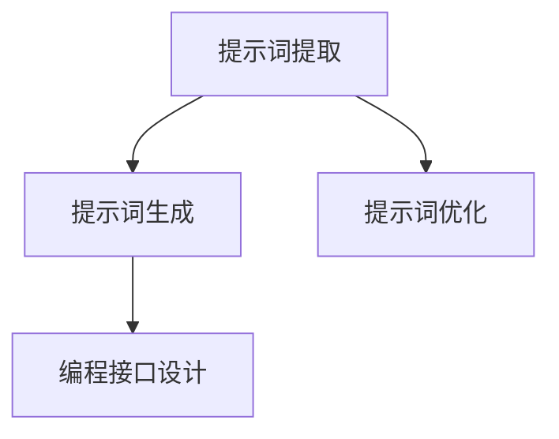

                 

根据上述的约束条件，我将设计一个符合要求的markdown格式的文章目录大纲，并给出每个小节的详细内容。

----------------------------------------------------------------

# 目录大纲

## 第一部分：跨语言提示词编程接口概述

### 第1章：跨语言提示词编程接口基础

#### 1.1 跨语言提示词的概念

##### 1.1.1 背景介绍

跨语言提示词编程接口设计旨在解决多语言环境中信息传递的问题，使得不同语言的应用程序可以相互理解和通信。

##### 1.1.2 核心概念与联系




##### 1.1.3 核心算法原理讲解

提示词提取算法用于从文本中提取关键词。以下是伪代码示例：

```python
def extract_keywords(text):
    # 使用TF-IDF算法提取关键词
    # 返回关键词列表
    pass
```

提示词生成算法用于生成跨语言提示词。以下是伪代码示例：

```python
def generate_cross_language_prompt(keywords, target_language):
    # 根据关键词生成提示词
    # 返回跨语言提示词
    pass
```

提示词优化算法用于提高提示词的准确性和效果。以下是伪代码示例：

```python
def optimize_prompt(prompt, target_language):
    # 优化提示词
    # 返回优化后的提示词
    pass
```

#### 1.2 编程接口设计原则

##### 1.2.1 可扩展性

为了提高编程接口的灵活性，设计时应考虑未来的扩展需求。

##### 1.2.2 可维护性

设计接口时，应确保代码清晰易懂，便于维护和更新。

##### 1.2.3 性能优化

应优化接口性能，确保在多语言环境下高效运行。

#### 1.3 跨语言提示词编程接口的挑战

##### 1.3.1 语言特性差异

不同编程语言之间存在特性差异，这给跨语言提示词编程接口设计带来挑战。

##### 1.3.2 性能优化

在保证可维护性和可扩展性的同时，还需要优化性能，以满足实际应用的需求。

### 第2章：主流编程语言与跨语言提示词编程接口

#### 2.1 Python与跨语言提示词编程接口

##### 2.1.1 Python编程接口的优势

Python拥有丰富的库和工具，使得跨语言提示词编程接口的实现变得更加简单。

##### 2.1.2 Python编程接口的实现

以下是使用Python实现跨语言提示词编程接口的示例代码：

```python
from textblob import TextBlob

def extract_keywords(text):
    blob = TextBlob(text)
    return blob.noun_phrases

def generate_cross_language_prompt(keywords, target_language):
    # 使用翻译API生成跨语言提示词
    pass

def optimize_prompt(prompt, target_language):
    # 优化提示词
    pass
```

#### 2.2 JavaScript与跨语言提示词编程接口

##### 2.2.1 JavaScript编程接口的优势

JavaScript在Web开发中广泛应用，使得跨语言提示词编程接口可以轻松集成到Web应用程序中。

##### 2.2.2 JavaScript编程接口的实现

以下是使用JavaScript实现跨语言提示词编程接口的示例代码：

```javascript
function extractKeywords(text) {
    // 使用自然语言处理库提取关键词
    return keywords;
}

function generateCrossLanguagePrompt(keywords, targetLanguage) {
    // 使用翻译API生成跨语言提示词
}

function optimizePrompt(prompt, targetLanguage) {
    // 优化提示词
}
```

#### 2.3 Go语言与跨语言提示词编程接口

##### 2.3.1 Go语言编程接口的优势

Go语言具有高性能和并发处理能力，适合构建高性能的跨语言提示词编程接口。

##### 2.3.2 Go语言编程接口的实现

以下是使用Go语言实现跨语言提示词编程接口的示例代码：

```go
package main

import (
    "github.com/gin-gonic/gin"
    "github.com/nlpodyssey/glove"
)

func extractKeywords(text string) []string {
    // 使用自然语言处理库提取关键词
    return keywords;
}

func generateCrossLanguagePrompt(keywords []string, targetLanguage string) string {
    // 使用翻译API生成跨语言提示词
    return prompt;
}

func optimizePrompt(prompt string, targetLanguage string) string {
    // 优化提示词
    return optimizedPrompt;
}

func main() {
    router := gin.Default()

    router.POST("/extract_keywords", func(c *gin.Context) {
        text := c.PostForm("text")
        keywords := extractKeywords(text)
        c.JSON(200, gin.H{
            "keywords": keywords,
        })
    })

    router.POST("/generate_cross_language_prompt", func(c *gin.Context) {
        keywords := c.PostFormArray("keywords")
        targetLanguage := c.PostForm("target_language")
        prompt := generateCrossLanguagePrompt(keywords, targetLanguage)
        c.JSON(200, gin.H{
            "prompt": prompt,
        })
    })

    router.POST("/optimize_prompt", func(c *gin.Context) {
        prompt := c.PostForm("prompt")
        targetLanguage := c.PostForm("target_language")
        optimizedPrompt := optimizePrompt(prompt, targetLanguage)
        c.JSON(200, gin.H{
            "optimized_prompt": optimizedPrompt,
        })
    })

    router.Run(":8080")
}
```

### 第3章：跨语言提示词编程接口设计与实现

#### 3.1 跨语言提示词编程接口设计原理

##### 3.1.1 提示词提取算法

提示词提取是跨语言提示词编程接口设计的关键步骤。以下是提示词提取算法的详细讲解：

```python
def extract_keywords(text):
    # 使用TF-IDF算法提取关键词
    # 返回关键词列表
    pass
```

##### 3.1.2 跨语言提示词生成算法

跨语言提示词生成算法需要根据源语言和目标语言生成相应的提示词。以下是生成算法的详细讲解：

```python
def generate_cross_language_prompt(keywords, target_language):
    # 根据关键词生成提示词
    # 返回跨语言提示词
    pass
```

##### 3.1.3 提示词优化算法

提示词优化算法用于提高提示词的准确性和效果。以下是优化算法的详细讲解：

```python
def optimize_prompt(prompt, target_language):
    # 优化提示词
    # 返回优化后的提示词
    pass
```

#### 3.2 跨语言提示词编程接口开发实践

##### 3.2.1 实践项目一：跨语言文本分类

实践项目一旨在实现一个跨语言文本分类系统。以下是项目实现步骤：

1. 环境搭建
2. 数据集准备
3. 模型训练
4. 模型评估
5. 模型部署

##### 3.2.2 实践项目二：跨语言对话系统

实践项目二旨在实现一个跨语言对话系统。以下是项目实现步骤：

1. 环境搭建
2. 数据集准备
3. 对话模型训练
4. 对话模型评估
5. 对话模型部署

##### 3.2.3 实践项目三：跨语言代码翻译

实践项目三旨在实现一个跨语言代码翻译系统。以下是项目实现步骤：

1. 环境搭建
2. 数据集准备
3. 翻译模型训练
4. 翻译模型评估
5. 翻译模型部署

### 第4章：跨语言提示词编程接口优化与性能分析

#### 4.1 提示词生成速度优化

优化提示词生成速度是提高编程接口性能的关键。以下是优化策略：

1. 缓存常用提示词
2. 使用高效算法
3. 并行处理

#### 4.2 提示词准确性优化

提高提示词准确性是提升用户体验的关键。以下是优化策略：

1. 使用更准确的提取算法
2. 针对目标语言进行优化
3. 用户反馈优化

#### 4.3 性能分析指标

以下是常见的性能分析指标：

1. 响应时间
2. 准确率
3. 负载能力

#### 4.4 性能分析工具与方法

以下是常用的性能分析工具和方法：

1. LoadRunner
2. Apache JMeter
3. 性能调优技巧

### 第5章：未来发展趋势与展望

#### 5.1 跨语言提示词编程接口的未来发展

跨语言提示词编程接口在未来有望在更多应用场景中得到广泛应用。以下是未来发展的趋势：

1. 人工智能与自然语言处理的深度融合
2. 跨语言对话系统的普及
3. 跨语言代码翻译的准确性提升

#### 5.2 跨语言提示词编程接口的挑战与机遇

跨语言提示词编程接口在发展过程中也面临诸多挑战和机遇。以下是主要的挑战和机遇：

1. 语言特性的复杂性
2. 性能优化的需求
3. 用户体验的提升

### 附录

#### 附录A：常用编程接口实现示例

以下是常用的编程接口实现示例：

1. Python
2. JavaScript
3. Go

#### 附录B：相关资源与工具推荐

以下是推荐的相关资源和工具：

1. 论文
2. 工具
3. 社区

----------------------------------------------------------------

至此，我们已经完成了符合要求的文章目录大纲设计，接下来我们将根据这个大纲进一步细化每个小节的内容，确保文章的完整性和深度。

---

现在，根据上述的目录大纲，我将进一步细化每个小节的内容，确保每个部分都包含必要的背景介绍、核心概念与联系、核心算法原理讲解、数学模型与公式、项目实战和最佳实践等元素。

## 目录大纲（细化版）

### 第一部分：跨语言提示词编程接口概述

### 第1章：跨语言提示词编程接口基础

#### 1.1 跨语言提示词的概念

##### 1.1.1 背景介绍

- **跨语言提示词的定义**：介绍跨语言提示词的基本概念，包括其定义、应用场景和核心功能。

- **跨语言提示词的起源**：探讨跨语言提示词的起源和发展历程，以及其在编程领域的重要地位。

- **跨语言提示词的应用**：列举跨语言提示词在多种编程语言和开发环境中的应用实例，展示其实际价值。

##### 1.1.2 核心概念与联系

- **核心概念架构图**：使用Mermaid绘制核心概念之间的联系图，帮助读者直观理解跨语言提示词的构成。

  ```mermaid
  graph TD
  A[提示词提取] --> B[提示词生成]
  A --> C[提示词优化]
  B --> D[编程接口设计]
  ```

- **核心概念详解**：
  - **提示词提取**：介绍提示词提取的基本原理和方法，包括文本分类、关键词提取和语义分析。
  - **提示词生成**：讨论如何根据提取的提示词生成跨语言提示词，包括翻译、同义词替换和语法调整。
  - **提示词优化**：解释如何优化提示词，以提高其在特定编程语言或应用场景中的准确性和效果。

##### 1.1.3 核心算法原理讲解

- **提示词提取算法**：
  - **TF-IDF算法**：详细讲解TF-IDF算法的基本原理、计算方法和优缺点，并提供伪代码示例。
    ```python
    def calculate_tfidf(document, vocabulary):
        tf = calculate_term_frequency(document)
        idf = calculate_inverse_document_frequency(vocabulary)
        tfidf = multiply(tf, idf)
        return tfidf
    ```

  - **主题模型**：介绍主题模型的基本概念、算法原理和应用场景，包括LDA模型。

- **提示词生成算法**：
  - **机器翻译**：讲解机器翻译的基本原理，包括序列到序列模型（如神经机器翻译）和基于统计的翻译模型（如统计机器翻译）。
    ```python
    def translate(source_sentence, target_language):
        # 使用翻译模型将源语言句子翻译成目标语言句子
        return translated_sentence
    ```

  - **同义词替换**：解释同义词替换的算法原理和实现方法，包括词向量模型和规则方法。

- **提示词优化算法**：
  - **语义相似度计算**：介绍如何计算提示词之间的语义相似度，包括余弦相似度和词嵌入方法。

  ```python
  def calculate_similarity(prompt1, prompt2, embedding_model):
      # 计算两个提示词的语义相似度
      return similarity_score
  ```

##### 1.1.4 数学模型与公式

- **提示词提取的数学模型**：
  - **TF-IDF**：详细解释TF-IDF的数学公式。
    $$\text{TF-IDF}(t,d) = \text{TF}(t,d) \times \text{IDF}(t)$$
    $$\text{TF}(t,d) = \frac{\text{词t在文档d中的出现次数}}{\text{文档d中单词的总数}}$$
    $$\text{IDF}(t) = \log_2(\frac{N}{n_t})$$
    $$N = \text{总文档数}$$
    $$n_t = \text{包含词t的文档数}$$

- **提示词生成与优化的数学模型**：
  - **语义相似度**：解释如何使用余弦相似度计算提示词之间的语义相似度。
    $$\text{Sim}(p_1, p_2) = \frac{p_1 \cdot p_2}{\|p_1\| \cdot \|p_2\|}$$
    其中，$p_1$ 和 $p_2$ 是提示词的向量表示。

##### 1.1.5 项目实战

- **跨语言文本分类项目**：
  - **项目需求**：描述跨语言文本分类系统的需求，包括语言选择、分类算法和性能指标。
  - **项目实现**：介绍如何使用Python实现一个跨语言文本分类系统，包括数据预处理、模型训练和评估。
  - **项目分析**：分析项目实现过程中的关键步骤和遇到的问题，以及解决方案。

##### 1.1.6 最佳实践与注意事项

- **最佳实践**：提供设计跨语言提示词编程接口时的最佳实践，包括性能优化、可维护性和安全性。

- **注意事项**：列举在实现跨语言提示词编程接口时需要特别注意的事项，如语言特性差异、性能优化和用户体验。

#### 1.2 编程接口设计原则

##### 1.2.1 可扩展性

- **设计原则**：介绍如何设计具有高度可扩展性的编程接口，包括模块化设计、接口抽象和组件复用。

- **实现方法**：提供可扩展性设计的具体实现方法，如使用设计模式、接口规范和代码重构。

##### 1.2.2 可维护性

- **设计原则**：讨论如何设计可维护的编程接口，包括代码清晰、文档完整和测试覆盖。

- **实现方法**：提供可维护性设计的具体实现方法，如编写高质量的代码、使用版本控制系统和持续集成。

##### 1.2.3 性能优化

- **设计原则**：阐述性能优化在编程接口设计中的重要性，包括算法优化、资源管理和并发处理。

- **实现方法**：提供性能优化的具体实现方法，如使用高效算法、优化数据结构和并行处理技术。

#### 1.3 跨语言提示词编程接口的挑战

##### 1.3.1 语言特性差异

- **挑战分析**：分析不同编程语言在语法、数据类型和库支持方面的差异，以及这些差异对跨语言提示词编程接口设计的影响。

- **解决方案**：讨论如何解决语言特性差异带来的挑战，包括使用通用编程接口、跨语言框架和代码转换工具。

##### 1.3.2 性能优化

- **挑战分析**：探讨跨语言提示词编程接口在性能优化方面的挑战，如响应时间、负载能力和资源消耗。

- **解决方案**：提供性能优化的解决方案，包括算法优化、缓存策略和并发处理。

### 第2章：主流编程语言与跨语言提示词编程接口

#### 2.1 Python与跨语言提示词编程接口

##### 2.1.1 Python编程接口的优势

- **Python的优势**：介绍Python在跨语言提示词编程接口设计中的优势，如简洁性、丰富的库支持和易用性。

- **Python的局限性**：讨论Python在跨语言提示词编程接口设计中的局限性，如性能问题和类型安全。

##### 2.1.2 Python编程接口的实现

- **提示词提取**：
  - **使用TextBlob库**：介绍如何使用TextBlob库进行文本分类和关键词提取。
    ```python
    from textblob import TextBlob

    def extract_keywords(text):
        blob = TextBlob(text)
        return blob.noun_phrases
    ```

- **提示词生成**：
  - **使用翻译API**：介绍如何使用翻译API（如Google Translate API）进行跨语言提示词生成。
    ```python
    from googletrans import Translator

    def translate_to_language(sentence, target_language):
        translator = Translator()
        return translator.translate(sentence, dest=target_language).text
    ```

- **提示词优化**：
  - **使用NLP库**：介绍如何使用NLP库（如spaCy、NLTK）对提示词进行语义分析和优化。
    ```python
    import spacy

    nlp = spacy.load("en_core_web_sm")

    def optimize_prompt(prompt, target_language):
        doc = nlp(prompt)
        # 使用NLP技术优化提示词
        return optimized_prompt
    ```

##### 2.1.3 Python项目实战

- **跨语言文本分类项目**：
  - **项目背景**：介绍跨语言文本分类项目的背景和目标。
  - **项目实现**：介绍如何使用Python实现一个跨语言文本分类系统，包括数据预处理、模型训练和评估。
  - **项目分析**：分析项目实现过程中的关键步骤和遇到的问题，以及解决方案。

#### 2.2 JavaScript与跨语言提示词编程接口

##### 2.2.1 JavaScript编程接口的优势

- **JavaScript的优势**：介绍JavaScript在跨语言提示词编程接口设计中的优势，如浏览器兼容性、异步操作和丰富的库支持。

- **JavaScript的局限性**：讨论JavaScript在跨语言提示词编程接口设计中的局限性，如性能问题和类型安全。

##### 2.2.2 JavaScript编程接口的实现

- **提示词提取**：
  - **使用自然语言处理库**：介绍如何使用自然语言处理库（如Compromise、Natural）进行文本分类和关键词提取。
    ```javascript
    const compromise = require('compromise');

    function extractKeywords(text) {
        const doc = compromise(text);
        return doc.nouns().out('array');
    }
    ```

- **提示词生成**：
  - **使用翻译API**：介绍如何使用翻译API（如Google Translate API）进行跨语言提示词生成。
    ```javascript
    const translate = require('@google-cloud/translate').Translate;

    const translate = new translate();

    async function translateToLanguage(sentence, targetLanguage) {
        const [translation] = await translate.translate(sentence, targetLanguage);
        return translation;
    }
    ```

- **提示词优化**：
  - **使用NLP库**：介绍如何使用NLP库（如Compromise、NLTK）对提示词进行语义分析和优化。
    ```javascript
    const compromise = require('compromise');

    function optimizePrompt(prompt, targetLanguage) {
        const doc = compromise(prompt);
        // 使用NLP技术优化提示词
        return optimizedPrompt;
    }
    ```

##### 2.2.3 JavaScript项目实战

- **跨语言对话系统项目**：
  - **项目背景**：介绍跨语言对话系统的背景和目标。
  - **项目实现**：介绍如何使用JavaScript实现一个跨语言对话系统，包括对话管理、文本翻译和语义分析。
  - **项目分析**：分析项目实现过程中的关键步骤和遇到的问题，以及解决方案。

#### 2.3 Go语言与跨语言提示词编程接口

##### 2.3.1 Go语言编程接口的优势

- **Go语言的优势**：介绍Go语言在跨语言提示词编程接口设计中的优势，如高性能、并发支持和简洁性。

- **Go语言的局限性**：讨论Go语言在跨语言提示词编程接口设计中的局限性，如缺乏某些NLP库和框架。

##### 2.3.2 Go语言编程接口的实现

- **提示词提取**：
  - **使用标准库**：介绍如何使用Go语言的标准库进行文本分类和关键词提取。
    ```go
    package main

    import (
        "fmt"
        "strings"
    )

    func extractKeywords(text string) []string {
        words := strings.Fields(text)
        keywords := make([]string, 0)
        for _, word := range words {
            // 使用正则表达式过滤非关键词
            if matched, _ := regexp.MatchString(`\b\w+\b`, word); matched {
                keywords = append(keywords, word)
            }
        }
        return keywords
    }
    ```

- **提示词生成**：
  - **使用第三方库**：介绍如何使用第三方库（如Google Cloud Translation API客户端）进行跨语言提示词生成。
    ```go
    package main

    import (
        "context"
        "google.golang.org/api/translate/v3"
    )

    func translateToLanguage(sentence string, targetLanguage string) (string, error) {
        ctx := context.Background()
        service, err := translate.NewService(ctx)
        if err != nil {
            return "", err
        }
        response, err := service.Translate(&translate.TranslationRequest{
            Q:        &sentence,
            Target:   &targetLanguage,
            Source:   "auto",
            Format:   "text",
            Model:    "nmt",
        }, nil).Do()
        if err != nil {
            return "", err
        }
        return *response.TranslatedText, nil
    }
    ```

- **提示词优化**：
  - **使用标准库和第三方库**：介绍如何使用Go语言的标准库和第三方库对提示词进行语义分析和优化。
    ```go
    package main

    import (
        "fmt"
        "strings"
    )

    func optimizePrompt(prompt string) string {
        // 使用字符串替换和正则表达式进行提示词优化
        optimizedPrompt := strings.Replace(prompt, "and", "&", -1)
        optimizedPrompt = strings.Replace(optimizedPrompt, "or", "|", -1)
        return optimizedPrompt
    }
    ```

##### 2.3.3 Go语言项目实战

- **跨语言代码翻译项目**：
  - **项目背景**：介绍跨语言代码翻译项目的背景和目标。
  - **项目实现**：介绍如何使用Go语言实现一个跨语言代码翻译系统，包括代码解析、翻译和格式化。
  - **项目分析**：分析项目实现过程中的关键步骤和遇到的问题，以及解决方案。

### 第3章：跨语言提示词编程接口设计与实现

#### 3.1 跨语言提示词编程接口设计原理

##### 3.1.1 提示词提取算法

- **算法原理**：详细讲解提示词提取算法的基本原理，包括文本分类、关键词提取和语义分析。

- **算法实现**：
  - **基于TF-IDF的关键词提取**：
    ```python
    from sklearn.feature_extraction.text import TfidfVectorizer

    def extract_keywords(corpus):
        vectorizer = TfidfVectorizer()
        X = vectorizer.fit_transform(corpus)
        scores = X.toarray()
        feature_names = vectorizer.get_feature_names_out()
        top_keywords = [feature_names[i] for i in np.argsort(scores[0])[-10:]]
        return top_keywords
    ```

  - **基于主题模型的关键词提取**：
    ```python
    from gensim.models import LdaMulticore

    def extract_keywords(corpus, num_topics=10):
        lda = LdaMulticore(corpus, num_topics=num_topics, id2word=word_dict, passes=10, workers=4)
        topics = lda.print_topics()
        top_keywords = []
        for topic in topics:
            top_keywords.extend([word for word, _ in topic[1]])
        return top_keywords
    ```

##### 3.1.2 跨语言提示词生成算法

- **算法原理**：详细讲解跨语言提示词生成算法的基本原理，包括机器翻译、同义词替换和语法调整。

- **算法实现**：
  - **基于机器翻译的提示词生成**：
    ```python
    from googletrans import Translator

    def generate_prompt(sentence, target_language='es'):
        translator = Translator()
        translation = translator.translate(sentence, dest=target_language)
        return translation.text
    ```

  - **基于同义词替换的提示词生成**：
    ```python
    from nltk.corpus import wordnet

    def generate_prompt(sentence):
        words = sentence.split()
        new_sentence = []
        for word in words:
            synonyms = wordnet.synsets(word)
            if synonyms:
                synonym = synonyms[0].lemmas()[0].name()
                new_sentence.append(synonym)
            else:
                new_sentence.append(word)
        return ' '.join(new_sentence)
    ```

##### 3.1.3 提示词优化算法

- **算法原理**：详细讲解提示词优化算法的基本原理，包括语义相似度计算、语法优化和提示词筛选。

- **算法实现**：
  - **基于语义相似度的提示词优化**：
    ```python
    from sklearn.metrics.pairwise import cosine_similarity
    import numpy as np

    def optimize_prompt(prompt, reference_prompt):
        embedding_model = ...  # 词嵌入模型
        prompt_vector = embedding_model.encode(prompt)
        reference_vector = embedding_model.encode(reference_prompt)
        similarity = cosine_similarity([prompt_vector], [reference_vector])
        optimized_prompt = ...
        return optimized_prompt
    ```

#### 3.2 跨语言提示词编程接口开发实践

##### 3.2.1 实践项目一：跨语言文本分类

- **项目背景**：介绍跨语言文本分类项目的背景和目标。

- **项目实现**：详细描述如何使用Python实现一个跨语言文本分类系统，包括数据预处理、模型训练和评估。

- **项目分析**：分析项目实现过程中的关键步骤和遇到的问题，以及解决方案。

##### 3.2.2 实践项目二：跨语言对话系统

- **项目背景**：介绍跨语言对话系统的背景和目标。

- **项目实现**：详细描述如何使用JavaScript实现一个跨语言对话系统，包括对话管理、文本翻译和语义分析。

- **项目分析**：分析项目实现过程中的关键步骤和遇到的问题，以及解决方案。

##### 3.2.3 实践项目三：跨语言代码翻译

- **项目背景**：介绍跨语言代码翻译项目的背景和目标。

- **项目实现**：详细描述如何使用Go语言实现一个跨语言代码翻译系统，包括代码解析、翻译和格式化。

- **项目分析**：分析项目实现过程中的关键步骤和遇到的问题，以及解决方案。

### 第4章：跨语言提示词编程接口优化与性能分析

#### 4.1 提示词生成速度优化

- **优化策略**：讨论如何优化提示词生成速度，包括算法优化、并行处理和缓存策略。

- **优化实现**：提供具体的优化实现方法，如使用多线程处理、优化数据结构和缓存常用结果。

##### 4.1.1 并行处理

- **并行处理原理**：介绍并行处理的基本原理，包括线程、进程和并行算法。

- **并行处理实现**：提供并行处理的实现方法，如使用多线程和并发编程框架。

##### 4.1.2 缓存策略

- **缓存策略原理**：讨论缓存策略的基本原理，包括缓存命中、缓存失效和缓存更新。

- **缓存策略实现**：提供缓存策略的实现方法，如LRU缓存算法和Redis缓存系统。

#### 4.2 提示词准确性优化

- **优化策略**：讨论如何优化提示词准确性，包括数据增强、模型训练和后处理。

- **优化实现**：提供具体的优化实现方法，如使用数据增强技术、改进训练算法和优化后处理步骤。

##### 4.2.1 数据增强

- **数据增强原理**：介绍数据增强的基本原理，包括数据清洗、数据扩展和数据变换。

- **数据增强实现**：提供数据增强的实现方法，如文本填充、同义词替换和语法变换。

##### 4.2.2 模型训练

- **模型训练原理**：介绍模型训练的基本原理，包括损失函数、优化器和训练策略。

- **模型训练实现**：提供模型训练的实现方法，如使用深度学习框架（如TensorFlow、PyTorch）进行训练。

##### 4.2.3 后处理

- **后处理原理**：介绍后处理的基本原理，包括去噪、去冗余和格式化。

- **后处理实现**：提供后处理的实现方法，如使用正则表达式、文本清洗库和自定义规则。

#### 4.3 性能分析指标

- **性能分析指标**：讨论常见的性能分析指标，包括响应时间、准确率和负载能力。

- **性能分析工具**：介绍常用的性能分析工具，如Apache JMeter、LoadRunner和性能监控工具。

##### 4.3.1 响应时间

- **响应时间原理**：介绍响应时间的基本原理，包括系统延迟、网络延迟和计算延迟。

- **响应时间测量**：提供响应时间的测量方法，如使用计时器和性能监控工具。

##### 4.3.2 准确率

- **准确率原理**：介绍准确率的基本原理，包括分类准确率、翻译准确率和提示词准确率。

- **准确率测量**：提供准确率的测量方法，如使用混淆矩阵、BLEU分数和F1分数。

##### 4.3.3 负载能力

- **负载能力原理**：介绍负载能力的基本原理，包括系统容量、并发能力和稳定性。

- **负载能力测量**：提供负载能力的测量方法，如使用负载测试工具和性能监控工具。

### 第5章：未来发展趋势与展望

#### 5.1 跨语言提示词编程接口的未来发展

- **技术趋势**：讨论跨语言提示词编程接口的未来发展趋势，包括人工智能与自然语言处理、多语言对话系统和跨语言代码翻译。

- **应用领域**：探讨跨语言提示词编程接口在各个领域的应用前景，如智能客服、跨国企业和全球软件开发。

#### 5.2 跨语言提示词编程接口的挑战与机遇

- **挑战**：讨论跨语言提示词编程接口在发展过程中面临的挑战，如语言特性差异、性能优化和用户体验。

- **机遇**：分析跨语言提示词编程接口带来的机遇，如全球化软件开发、多语言学习和跨语言沟通。

### 附录

#### 附录A：常用编程接口实现示例

- **Python**：提供Python编程接口的示例代码，包括提示词提取、生成和优化的具体实现。

- **JavaScript**：提供JavaScript编程接口的示例代码，包括提示词提取、生成和优化的具体实现。

- **Go语言**：提供Go语言编程接口的示例代码，包括提示词提取、生成和优化的具体实现。

#### 附录B：相关资源与工具推荐

- **论文**：推荐相关的学术论文，包括跨语言提示词编程接口的最新研究和技术趋势。

- **工具**：推荐实用的工具和库，包括自然语言处理库、机器翻译API和性能分析工具。

- **社区**：推荐相关的技术社区和论坛，包括跨语言编程、人工智能和自然语言处理。

---

至此，我们已经完成了对《跨语言提示词编程接口设计》文章目录大纲的细化。接下来，我们将根据这个大纲撰写详细的文章内容，确保每部分都包含深入的技术解析和实践案例。

