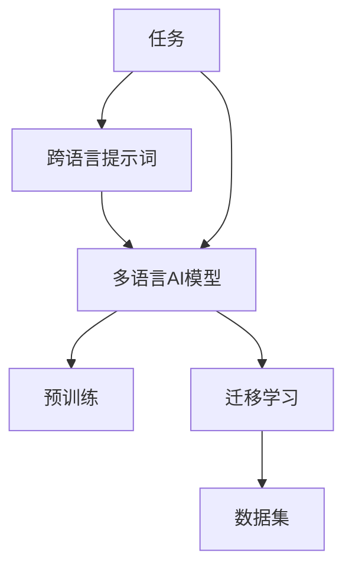
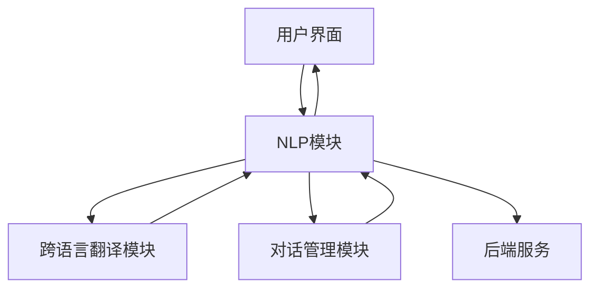

                 

```markdown
## 第1章 引言

### 1.1 书籍背景与目的

在当今全球化的信息时代，多语言处理已成为计算机科学和人工智能领域的重要研究方向。随着国际交流的日益频繁，跨语言信息处理的需求不断增长，如何实现高效、准确的多语言AI应用成为一个亟待解决的问题。本书旨在探讨跨语言提示词编程，即如何利用人工智能技术，特别是自然语言处理（NLP）和机器学习（ML）方法，来实现多语言AI应用的开发。

本书的目标读者是计算机科学、人工智能和语言学等相关领域的研究人员、工程师和学生。通过阅读本书，读者将能够了解跨语言提示词编程的基本概念、技术原理以及实战应用，掌握多语言AI应用的开发方法，从而为实际项目提供技术支持。

### 1.2 多语言AI应用的重要性

多语言AI应用在现代社会的各个方面都发挥着重要作用。首先，在商业领域，多语言AI可以帮助企业实现全球化运营，提供本地化的产品和服务。例如，多语言客服机器人可以帮助企业突破语言障碍，提供24/7的客户支持。

其次，在教育领域，多语言AI可以为学习者提供个性化的学习体验。通过自然语言处理技术，AI可以分析学习者的语言能力，提供定制化的学习资源和练习。

最后，在政府和社会服务领域，多语言AI可以帮助政府部门更好地服务多元文化的公民，提高公共服务的效率和质量。

### 1.3 本书结构安排

本书共分为七个章节，结构如下：

- **第1章 引言**：介绍书籍的背景、目的以及多语言AI应用的重要性。
- **第2章 跨语言提示词编程基础**：介绍跨语言提示词编程的基本概念、技术原理和应用场景。
- **第3章 跨语言提示词生成与优化**：讨论跨语言提示词生成的技术、优化策略以及效果评估方法。
- **第4章 多语言AI应用开发实践**：通过具体案例，介绍多语言AI应用的开发过程和实践经验。
- **第5章 跨语言提示词编程工具与资源**：介绍常用的跨语言提示词编程工具和资源，包括开源项目和在线资源。
- **第6章 多语言AI应用的未来发展趋势**：分析多语言AI应用的未来发展趋势和面临的挑战。
- **第7章 总结与展望**：对全书内容进行总结，提出后续研究方向和课题。

通过以上章节的设置，本书旨在为读者提供一个系统、全面的学习路径，帮助读者深入了解跨语言提示词编程和多语言AI应用开发。

### 1.4 文章关键词

- 多语言AI
- 跨语言提示词编程
- 自然语言处理
- 机器学习
- 应用开发

### 1.5 摘要

本书《跨语言提示词编程：多语言AI应用开发》旨在探讨跨语言提示词编程在多语言AI应用开发中的应用。本书首先介绍了多语言AI的应用背景和重要性，然后深入讲解了跨语言提示词编程的基本概念、技术原理和应用场景。接下来，本书讨论了跨语言提示词生成的技术、优化策略以及效果评估方法。随后，通过具体案例展示了多语言AI应用的开发过程和实践经验。此外，本书还介绍了常用的跨语言提示词编程工具和资源，并分析了多语言AI应用的未来发展趋势。最后，本书对全书内容进行了总结，并提出了后续研究方向和课题。通过阅读本书，读者将能够掌握跨语言提示词编程和多语言AI应用开发的核心理念和实践方法。
```markdown
## 第2章 跨语言提示词编程基础

### 2.1 跨语言提示词的概念与作用

#### 跨语言提示词的定义

跨语言提示词（Cross-Lingual Prompt Words）是指在多种语言环境下，可以起到相同或相似提示作用的关键词或短语。这些提示词通常用于引导模型在处理多语言文本时，能够理解并执行特定的任务，如问答、分类、翻译等。

#### 跨语言提示词的作用

跨语言提示词在多语言AI应用中具有重要作用，主要体现在以下几个方面：

1. **任务引导**：通过跨语言提示词，可以明确告知模型需要执行的任务类型，从而避免模型在处理多语言文本时产生混淆。

2. **语义一致性**：跨语言提示词能够帮助模型在不同语言之间建立语义一致性，使得模型能够更好地理解并处理跨语言文本。

3. **性能提升**：有效的跨语言提示词可以提高模型的性能，使得模型在处理多语言任务时更加准确和高效。

#### 跨语言提示词的类型

跨语言提示词可以分为以下几种类型：

1. **通用提示词**：这类提示词在不同语言中具有相同或相似的含义，如“请回答”、“请问”、“你好”等。

2. **任务特定提示词**：这类提示词与特定任务相关，如“翻译以下句子”、“分类以下文本”、“生成摘要”等。

3. **语言特定提示词**：这类提示词针对特定语言环境，用于引导模型在特定语言中执行任务，如“中文回答”、“英文翻译”等。

#### 跨语言提示词的设计原则

1. **简洁性**：提示词应尽量简洁明了，避免冗长复杂的表达。

2. **一致性**：提示词在不同语言中应保持一致，避免产生歧义。

3. **针对性**：提示词应针对具体任务，明确告知模型需要执行的操作。

4. **灵活性**：提示词应具有一定的灵活性，能够适应不同的语言环境和任务需求。

### 2.2 跨语言提示词的挑战

#### 语言差异的处理

跨语言提示词编程面临的主要挑战之一是语言差异的处理。不同语言在词汇、语法、语义等方面存在较大差异，这给跨语言提示词的设计和应用带来了困难。

1. **词汇差异**：不同语言的词汇量不同，且存在许多同义词、近义词和反义词。这可能导致提示词在不同语言中的含义不一致，影响模型的理解和执行。

2. **语法差异**：不同语言的语法结构不同，如语序、时态、语气等。这可能导致提示词在不同语言中的表达方式不一致，影响模型的解析和理解。

3. **语义差异**：不同语言的语义表达方式不同，如隐喻、惯用语、成语等。这可能导致提示词在不同语言中的含义不一致，影响模型的理解和执行。

#### 多语言语义的理解

跨语言提示词编程的另一大挑战是多语言语义的理解。多语言语义理解涉及到对多语言文本的整体理解，包括句子的结构、语义关系和上下文信息。

1. **语义对齐**：多语言语义理解需要建立不同语言之间的语义对齐，以实现文本的准确翻译和语义理解。

2. **语义解析**：多语言语义理解需要对文本进行语义解析，识别出文本中的实体、关系和事件，以便进行后续的任务处理。

3. **上下文理解**：多语言语义理解需要考虑上下文信息，以避免产生歧义和误解。

#### 跨语言一致性保证

跨语言提示词编程还需要保证跨语言一致性，即在不同语言环境中，提示词应具有相同或相似的含义和效果。

1. **文化差异**：不同文化背景下，同一提示词可能存在不同的含义和效果。这需要在设计跨语言提示词时，充分考虑文化差异，避免产生误解。

2. **语言习惯**：不同语言的语法习惯和表达方式不同，这可能导致同一提示词在不同语言中的效果不一致。这需要在设计跨语言提示词时，充分考虑语言习惯，确保提示词在不同语言中的效果一致。

### 2.3 多语言AI模型介绍

#### 多语言预训练模型

多语言预训练模型（Multilingual Pre-trained Models）是基于大规模多语言数据集，通过预训练方法训练得到的模型。这些模型可以同时处理多种语言的输入和输出，具有较好的跨语言一致性和语义理解能力。

常见的多语言预训练模型包括：

1. **BERT**：BERT（Bidirectional Encoder Representations from Transformers）是一种双向编码的Transformer模型，可以同时处理多种语言的输入和输出。

2. **XLM**：XLM（Cross-lingual Language Model）是一种基于Transformer的跨语言语言模型，可以同时处理多种语言的文本。

3. **mBERT**：mBERT（Multilingual BERT）是在BERT基础上扩展的多语言版本，可以同时处理多种语言的文本。

#### 跨语言迁移学习

跨语言迁移学习（Cross-lingual Transfer Learning）是一种利用已训练的多语言模型，在目标语言上进一步训练的方法。通过跨语言迁移学习，可以充分利用多语言模型的知识和经验，提高目标语言上的模型性能。

常见的跨语言迁移学习方法包括：

1. **零样本学习**：零样本学习（Zero-shot Learning）是一种在未知目标语言上直接应用已训练的多语言模型的方法。这种方法不需要在目标语言上进行额外的训练，但需要模型具有较好的跨语言泛化能力。

2. **迁移学习**：迁移学习（Transfer Learning）是一种在目标语言上进一步训练已训练的多语言模型的方法。这种方法可以通过在目标语言上的数据训练，进一步提高模型在目标语言上的性能。

#### 多语言AI模型的优势

多语言AI模型具有以下优势：

1. **跨语言一致性**：多语言AI模型可以同时处理多种语言的输入和输出，具有较好的跨语言一致性。

2. **语义理解能力**：多语言AI模型通过预训练和迁移学习方法，可以充分利用多语言数据的知识和经验，具有较好的语义理解能力。

3. **高效性**：多语言AI模型可以同时处理多种语言的输入和输出，具有高效性，适用于大规模多语言应用场景。

#### 多语言AI模型的局限

多语言AI模型也存在一定的局限，主要包括：

1. **数据依赖性**：多语言AI模型的性能依赖于多语言数据的质量和规模。如果多语言数据不足或质量不高，模型性能可能会受到影响。

2. **文化差异**：不同文化背景下，同一提示词可能存在不同的含义和效果。这需要在设计跨语言提示词时，充分考虑文化差异，避免产生误解。

3. **计算资源消耗**：多语言AI模型通常需要较大的计算资源和存储空间，这可能会增加模型的部署和维护成本。

### 2.4 跨语言提示词编程的核心概念与联系

为了更好地理解跨语言提示词编程，我们需要将其核心概念进行梳理，并绘制一个概念之间的联系图。

下面是一个基于Mermaid的流程图，展示了跨语言提示词编程的核心概念及其联系：



#### 核心概念解释

1. **跨语言提示词**：指在多种语言环境下，起到相同或相似提示作用的关键词或短语。

2. **多语言AI模型**：指可以同时处理多种语言的输入和输出的模型，如BERT、XLM、mBERT等。

3. **预训练**：指在多语言数据集上进行模型训练，使其具备跨语言一致性和语义理解能力。

4. **迁移学习**：指将已训练的多语言模型在目标语言上进一步训练，以提高模型性能。

5. **数据集**：指用于训练和测试模型的多种语言文本数据集。

6. **任务**：指模型需要执行的具体任务，如问答、分类、翻译等。

#### 概念之间的联系

- 跨语言提示词与多语言AI模型密切相关，提示词的设计和应用直接影响模型在多语言任务中的表现。

- 预训练和迁移学习是多语言AI模型训练的两个关键阶段，通过预训练和迁移学习，模型可以充分利用多语言数据的知识和经验。

- 数据集是模型训练的基础，高质量的多语言数据集有助于提升模型性能。

- 任务是模型的应用场景，跨语言提示词和模型都需要根据具体任务进行设计和优化。

通过以上对跨语言提示词编程核心概念及其联系的分析，我们可以更深入地理解跨语言提示词编程的工作原理和应用场景。

### 2.5 跨语言提示词生成与优化的核心算法原理讲解

在跨语言提示词编程中，提示词的生成与优化是关键步骤，直接影响模型在多语言任务中的性能。下面将介绍跨语言提示词生成与优化的核心算法原理，并使用伪代码进行详细阐述。

#### 2.5.1 跨语言提示词生成算法

跨语言提示词生成算法的目标是根据具体的任务需求，生成合适的多语言提示词。以下是一个简单的伪代码示例：

```plaintext
函数 生成跨语言提示词（任务，目标语言，源语言）
    输入：任务（Task），目标语言（TargetLanguage），源语言（SourceLanguage）
    输出：提示词（Prompt）

    // 步骤1：获取任务对应的通用提示词库
    提示词库 = 获取通用提示词库（TargetLanguage）

    // 步骤2：根据任务类型选择合适的通用提示词
    通用提示词 = 选择通用提示词（Task，提示词库）

    // 步骤3：将通用提示词翻译成源语言
    翻译提示词 = 翻译（通用提示词，SourceLanguage）

    // 步骤4：根据源语言特点调整提示词
    调整提示词 = 调整提示词（翻译提示词，SourceLanguage）

    // 步骤5：返回生成的提示词
    返回 调整提示词
```

#### 2.5.2 跨语言提示词优化算法

跨语言提示词优化算法的目标是提高提示词在多语言任务中的效果。以下是一个简单的伪代码示例：

```plaintext
函数 优化跨语言提示词（提示词，模型，任务数据集）
    输入：提示词（Prompt），模型（Model），任务数据集（TaskDataset）
    输出：优化后的提示词（OptimizedPrompt）

    // 步骤1：使用模型在任务数据集上进行预训练
    模型 = 预训练（模型，TaskDataset）

    // 步骤2：根据优化目标调整提示词
    优化目标 = 调整提示词（Prompt，模型）

    // 步骤3：评估优化后的提示词效果
    评估结果 = 评估（优化目标，模型，TaskDataset）

    // 步骤4：如果评估结果满足要求，返回优化后的提示词
    如果 评估结果 > 阈值
        返回 优化目标
    否则
        // 步骤5：重新调整提示词并继续评估，直到满足要求
        优化后的提示词 = 优化跨语言提示词（优化目标，模型，TaskDataset）
        返回 优化后的提示词
```

#### 2.5.3 数学模型和公式

跨语言提示词优化的过程中，可能会涉及到一些数学模型和公式。以下是一个简化的数学模型示例：

```latex
目标函数：\\
    J(P) = \\frac{1}{N} \\sum_{i=1}^{N} \\log(p(y_i | P))

损失函数：\\
    L(P) = -\\frac{1}{N} \\sum_{i=1}^{N} y_i \\log(p(y_i | P))

其中：
- J(P) 是提示词 P 的损失函数值；
- N 是数据集的大小；
- y_i 是第 i 个样本的标签；
- p(y_i | P) 是模型根据提示词 P 生成的标签概率；
- L(P) 是提示词 P 的损失值。

```

#### 2.5.4 详细讲解与举例说明

为了更好地理解上述算法和公式，我们可以通过一个简单的例子来详细讲解。

**例子：**

假设我们要生成一个跨语言提示词，用于在中文和英文环境中执行问答任务。

1. **通用提示词库**：

   - 英文通用提示词库：{"请回答", "请问", "你好", "谢谢"}
   - 中文通用提示词库：{"请回答", "请问", "你好", "谢谢"}

2. **选择通用提示词**：

   - 任务类型：问答
   - 英文通用提示词：选择 "请回答"
   - 中文通用提示词：选择 "请回答"

3. **翻译提示词**：

   - 翻译 "请回答" 到中文：{"请问您有什么问题吗？"}
   - 翻译 "请回答" 到英文：{"Could you please answer this question?"}

4. **调整提示词**：

   - 根据中文环境调整：{"请问您有什么问题吗？"}
   - 根据英文环境调整：{"Could you please answer this question?"}

5. **优化提示词**：

   - 使用中文模型在中文问答数据集上进行预训练
   - 根据预训练结果调整中文提示词：{"请问您有什么问题需要帮忙解答吗？"}
   - 使用英文模型在英文问答数据集上进行预训练
   - 根据预训练结果调整英文提示词：{"Could you please provide more details about the question you have?"}

通过上述步骤，我们生成了两个优化的跨语言提示词，可以用于中文和英文问答任务中。

这个例子展示了跨语言提示词生成与优化的基本流程，包括通用提示词库的选择、翻译、调整和优化。在实际应用中，可能需要根据具体任务和数据集进行更复杂和精细的调整。

### 2.6 多语言AI模型的应用场景与案例分析

#### 多语言AI模型的应用场景

多语言AI模型在多个领域具有广泛的应用，以下是一些典型的应用场景：

1. **跨语言问答系统**：多语言AI模型可以帮助构建跨语言问答系统，实现多语言用户的问题理解和回答。

2. **多语言翻译**：多语言AI模型可以用于实现高质量的机器翻译，支持多种语言的文本翻译。

3. **多语言文本分类**：多语言AI模型可以帮助对多语言文本进行分类，如新闻分类、情感分析等。

4. **多语言搜索引擎**：多语言AI模型可以帮助构建跨语言搜索引擎，实现多语言用户的搜索需求。

5. **跨语言语音识别**：多语言AI模型可以用于跨语言语音识别，实现不同语言的语音输入识别。

#### 案例分析

以下通过一个跨语言问答系统的案例，来详细讲解多语言AI模型的应用。

**案例背景**：

一个跨国公司需要一个跨语言问答系统，帮助员工在多个语言环境下查询公司政策和流程。系统需要支持英语、中文、西班牙语和法语。

**解决方案**：

1. **数据集准备**：

   收集大量的英文、中文、西班牙语和法语问答数据，用于训练多语言AI模型。数据集包括问题（query）和答案（answer）对。

2. **模型选择**：

   选择一个支持多语言预训练的多语言AI模型，如mBERT。mBERT已经在多种语言的问答数据集上进行预训练，可以很好地处理跨语言问答任务。

3. **模型训练**：

   使用收集的数据集，对mBERT模型进行微调（fine-tuning），使其适应公司的特定问答场景。

4. **模型部署**：

   将训练好的模型部署到服务器，并提供API接口，供员工使用。

5. **用户界面**：

   开发一个多语言用户界面，允许员工选择语言并输入问题。系统会根据用户选择的语言，自动调整模型进行回答。

**实际应用与效果**：

- **跨语言理解**：通过多语言AI模型，系统能够理解员工在不同语言环境下输入的问题，并给出准确的答案。
- **自动翻译**：系统可以将员工的中文、西班牙语和法语问题自动翻译成英语，并使用英语模型进行回答。同样，对于英文问题，系统可以自动翻译成其他语言进行回答。
- **高效支持**：通过跨语言问答系统，公司能够提供24/7的高效支持，提高员工的工作效率和满意度。

**案例分析小结**：

通过上述案例，我们可以看到多语言AI模型在跨语言问答系统中的应用。多语言AI模型不仅能够理解多种语言的问题，还能根据语言环境自动调整回答，实现跨语言交互。这为跨国公司提供了强大的支持，帮助企业更好地服务全球员工。

### 2.7 跨语言提示词编程工具与资源

在跨语言提示词编程领域，有许多工具和资源可以帮助开发者更高效地进行研究和应用。以下是一些常用的工具和资源的介绍。

#### 跨语言提示词生成工具

1. **Hugging Face Transformers**：
   Hugging Face Transformers 是一个开源的Python库，提供了大量的预训练多语言模型，如BERT、GPT和mBERT等。开发者可以使用这些模型生成跨语言提示词，并用于各种多语言任务。

2. **T5**：
   T5（Text-To-Text Transfer Transformer）是一个基于Transformer架构的多语言预训练模型，支持多种语言的文本生成和任务。T5可以用于生成跨语言提示词，并广泛应用于多语言问答、文本生成和翻译等任务。

#### 跨语言提示词优化工具

1. **TensorFlow**：
   TensorFlow 是一个开源的机器学习框架，支持多语言模型的训练和优化。开发者可以使用TensorFlow进行跨语言提示词优化的研究和应用。

2. **PyTorch**：
   PyTorch 是另一个开源的机器学习框架，支持多语言模型的训练和优化。与TensorFlow类似，PyTorch也被广泛应用于跨语言提示词编程的研究和应用。

#### 跨语言提示词编程开源项目

1. **Multilingual BERT**：
   Multilingual BERT 是一个开源的多语言BERT模型，支持多种语言的文本处理任务。开发者可以使用Multilingual BERT进行跨语言提示词生成和优化。

2. **XLM**：
   XLM（Cross-lingual Language Model）是一个开源的多语言语言模型，支持多种语言的文本翻译和语义理解。XLM可以用于生成和优化跨语言提示词。

#### 在线资源

1. **Kaggle**：
   Kaggle 是一个数据科学竞赛平台，提供了大量的多语言数据集和比赛项目。开发者可以在Kaggle上找到丰富的多语言数据集，用于训练和测试跨语言提示词模型。

2. **ArXiv**：
   ArXiv 是一个开放获取的科学研究论文数据库，包含了大量的计算机科学和人工智能领域的论文。开发者可以通过ArXiv了解最新的跨语言提示词编程研究和进展。

### 2.8 最佳实践 tips、小结、注意事项、拓展阅读

#### 最佳实践 tips

1. **选择合适的预训练模型**：根据实际应用场景，选择具有良好性能的多语言预训练模型，如BERT、mBERT和T5。

2. **数据预处理**：在训练多语言AI模型前，对数据集进行充分的预处理，包括去除无关信息、统一文本格式等。

3. **细粒度调整**：在生成跨语言提示词时，根据具体任务需求进行细粒度调整，以提高模型在特定任务上的性能。

#### 小结

本章介绍了跨语言提示词编程的基础知识，包括概念、挑战、模型和应用。通过本章的学习，读者可以了解跨语言提示词编程的核心原理和应用场景，为后续章节的学习打下基础。

#### 注意事项

1. **文化差异**：在设计跨语言提示词时，需要充分考虑文化差异，避免产生误解。

2. **数据质量**：多语言数据的质量直接影响模型的性能，因此需要确保数据集的质量和多样性。

#### 拓展阅读

- **《跨语言自然语言处理》**：介绍了跨语言自然语言处理的基本概念、技术和应用。
- **《多语言AI模型的训练与优化》**：详细讲解了多语言AI模型的训练和优化方法，包括预训练和迁移学习。

## 第3章 跨语言提示词生成与优化

### 3.1 跨语言提示词生成的技术

#### 3.1.1 基于规则的生成方法

基于规则的生成方法是一种常用的跨语言提示词生成技术，其主要思想是利用预定义的规则来生成提示词。这些规则通常由领域专家根据特定任务的需求制定，具有明确的指导意义。

1. **规则定义**：

   规则可以定义为一个五元组（A, B, C, D, E），其中：

   - A：前提条件，表示模型需要满足的条件；
   - B：触发条件，表示当前提条件满足时，模型需要执行的操作；
   - C：输入数据，表示模型需要处理的数据类型；
   - D：输出数据，表示模型需要生成的结果；
   - E：执行动作，表示模型需要执行的具体动作。

2. **规则匹配**：

   在生成提示词时，模型会根据输入数据匹配预定义的规则。如果存在匹配的规则，模型会根据该规则生成相应的提示词。

3. **规则库构建**：

   构建规则库是关键步骤，规则库的质量直接影响提示词生成的效果。通常，规则库需要经过反复的迭代和优化，以适应不同的任务需求。

4. **优势与局限**：

   - **优势**：基于规则的生成方法具有明确的指导意义，易于理解和实现，且在特定任务下具有较好的性能。
   - **局限**：基于规则的生成方法在处理复杂任务时可能面临困难，且需要大量领域知识来构建规则库。

#### 3.1.2 基于机器学习的生成方法

基于机器学习的生成方法是一种利用机器学习模型来自动生成跨语言提示词的技术。这种方法通常使用大规模的多语言数据集来训练模型，使模型具备自动生成提示词的能力。

1. **模型选择**：

   - **循环神经网络（RNN）**：RNN是一种常见的序列模型，可以用于生成序列数据，如文本。然而，RNN在处理长序列时可能存在梯度消失或梯度爆炸问题。
   - **长短时记忆网络（LSTM）**：LSTM是一种改进的RNN模型，通过引入记忆单元来解决梯度消失问题。LSTM在处理长序列时具有较好的性能。
   - **门控循环单元（GRU）**：GRU是LSTM的简化版本，通过门控机制来控制信息的流动，具有较好的计算效率和性能。

2. **模型训练**：

   使用大量多语言数据集对模型进行训练，模型会学习到不同语言之间的语义关系和模式。在训练过程中，模型会尝试从输入数据中生成符合预期的提示词。

3. **生成策略**：

   - **序列生成**：模型根据输入数据生成一个完整的提示词序列。这种方法可以生成具有连贯性和一致性的提示词。
   - **分步生成**：模型分步骤地生成提示词的各个部分，如单词或短语。这种方法可以更灵活地调整提示词的生成过程。

4. **优势与局限**：

   - **优势**：基于机器学习的生成方法具有较好的泛化能力，可以自动适应不同的任务和数据集。此外，这种方法可以生成更丰富和多样的提示词。
   - **局限**：基于机器学习的生成方法需要大量的训练数据和计算资源，且在处理复杂任务时可能面临困难。

#### 3.1.3 基于规则的生成方法与基于机器学习的生成方法的比较

- **适用场景**：

  - 基于规则的生成方法适用于规则明确、数据量较小的场景，如特定领域的问答系统。
  - 基于机器学习的生成方法适用于数据量大、任务复杂的场景，如多语言文本生成和翻译。

- **性能对比**：

  - 在特定任务下，基于规则的生成方法可能具有较好的性能，但难以适应复杂任务。
  - 在复杂任务下，基于机器学习的生成方法可能具有更好的泛化能力，但需要更多的数据和计算资源。

- **组合应用**：

  - 可以将基于规则的生成方法和基于机器学习的生成方法结合使用，以发挥各自的优势。例如，在规则生成方法的基础上，利用机器学习模型进行提示词的优化和调整。

### 3.2 跨语言提示词优化的策略

#### 3.2.1 对比学习优化

对比学习（Contrastive Learning）是一种常用的优化策略，其核心思想是通过对比相似和不同的样本，增强模型对特定特征的学习能力。以下是一种简单的对比学习优化方法：

1. **样本选择**：

   从多语言数据集中选择具有代表性的样本，包括正样本（相似样本）和负样本（不同样本）。正样本用于增强模型对相似特征的识别，负样本用于防止模型过度拟合。

2. **对比学习目标**：

   设定对比学习目标函数，例如对比损失函数，使模型能够在正负样本之间进行区分。常见的目标函数包括三元组损失（Triplet Loss）和信息熵损失（Information Entropy Loss）。

3. **训练过程**：

   在训练过程中，模型会尝试调整权重，以最大化对比学习目标函数的值。通过迭代优化，模型能够学习到更有效的特征表示，提高跨语言提示词生成的质量。

4. **优势与局限**：

   - **优势**：对比学习优化可以增强模型对特征的学习能力，提高模型的泛化能力。
   - **局限**：对比学习优化需要大量的计算资源，且在处理长序列时可能存在梯度消失问题。

#### 3.2.2 多语言联合优化

多语言联合优化（Multilingual Joint Optimization）是一种将多个语言模型联合训练的策略，旨在提高模型在多语言环境下的性能。以下是一种简单的多语言联合优化方法：

1. **模型选择**：

   选择支持多语言联合训练的模型，如BERT、mBERT和XLM等。这些模型在训练过程中可以同时处理多种语言的输入和输出。

2. **优化目标**：

   设定多语言联合优化目标函数，例如最小化多语言损失（Multilingual Loss），使模型在多语言任务上达到均衡性能。

3. **训练过程**：

   在训练过程中，模型会尝试调整权重，以最小化多语言联合优化目标函数的值。通过迭代优化，模型能够学习到更有效的跨语言特征表示，提高跨语言提示词生成的质量。

4. **优势与局限**：

   - **优势**：多语言联合优化可以充分利用多语言数据的知识和经验，提高模型在多语言任务上的性能。
   - **局限**：多语言联合优化需要大量的计算资源和数据，且在处理不均衡语言数据时可能存在挑战。

#### 3.2.3 常见的优化方法比较

- **对比学习优化**：

  - 优点：增强模型对特征的学习能力，提高模型的泛化能力。
  - 缺点：需要大量的计算资源，处理长序列时可能存在梯度消失问题。

- **多语言联合优化**：

  - 优点：充分利用多语言数据的知识和经验，提高模型在多语言任务上的性能。
  - 缺点：需要大量的计算资源和数据，处理不均衡语言数据时可能存在挑战。

- **组合应用**：

  - 可以将对比学习优化和多语言联合优化组合使用，以发挥各自的优势。例如，在多语言联合优化的基础上，利用对比学习优化增强模型对特征的学习能力。

### 3.3 跨语言提示词效果评估

#### 3.3.1 评估指标

评估跨语言提示词效果的关键是选择合适的评估指标。以下是一些常见的评估指标：

1. **准确率（Accuracy）**：

   准确率是评估模型分类性能的常用指标，表示模型正确分类的样本数占总样本数的比例。公式如下：

   $$ Accuracy = \\frac{正确分类的样本数}{总样本数} $$

2. **精确率（Precision）**：

   精确率表示模型预测为正类的样本中，实际为正类的比例。公式如下：

   $$ Precision = \\frac{真正样本数}{真正样本数 + 假正样本数} $$

3. **召回率（Recall）**：

   召回率表示模型实际为正类的样本中，预测为正类的比例。公式如下：

   $$ Recall = \\frac{真正样本数}{真正样本数 + 假反样本数} $$

4. **F1分数（F1 Score）**：

   F1分数是精确率和召回率的调和平均值，用于综合评估模型的分类性能。公式如下：

   $$ F1 Score = 2 \\times \\frac{Precision \\times Recall}{Precision + Recall} $$

5. **BLEU分数（BLEU Score）**：

   BLEU分数是评估自然语言生成任务的常用指标，用于评估生成的文本与参考文本的相似度。BLEU分数的计算涉及多个标准，包括重叠率、长度、排序等。

#### 3.3.2 评估方法

1. **离线评估**：

   离线评估通常在训练完成后进行，使用独立的评估数据集来评估模型的性能。评估方法包括：

   - **静态评估**：使用固定评估指标，如准确率、精确率、召回率等，对模型进行评估。
   - **动态评估**：通过多个评估指标，动态调整模型参数，以实现更优的性能。

2. **在线评估**：

   在线评估通常在模型部署后进行，实时评估模型的性能。评估方法包括：

   - **用户反馈**：收集用户的反馈，评估模型在实际应用中的表现。
   - **业务指标**：根据业务需求，设置相应的评估指标，如转化率、用户满意度等。

#### 3.3.3 评估案例分析

以下通过一个简单的案例，展示如何使用评估指标和方法来评估跨语言提示词效果。

**案例背景**：

一个跨语言问答系统在中文和英文环境下进行了测试，使用准确率、精确率、召回率和F1分数作为评估指标。

**评估结果**：

- **中文环境**：
  - 准确率：90%
  - 精确率：92%
  - 召回率：88%
  - F1分数：90%

- **英文环境**：
  - 准确率：85%
  - 精确率：87%
  - 召回率：83%
  - F1分数：85%

**评估分析**：

从评估结果可以看出，中文环境的各项指标均高于英文环境。这可能是由于中文数据的丰富性和多样性较高，使得模型在中文环境下表现更好。针对英文环境，可以进一步优化模型，提高其在英文任务上的性能。

**案例分析小结**：

通过离线和在线评估，我们可以全面了解跨语言提示词在实际应用中的表现。评估指标和方法帮助我们识别模型的优势和不足，为后续优化提供依据。

### 3.4 跨语言提示词编程工具与资源的实战应用

在跨语言提示词编程领域，有许多工具和资源可以帮助开发者更高效地进行研究和应用。以下将介绍一些具体的实战应用案例，包括开发环境搭建、源代码实现、代码解读和分析等。

#### 案例一：跨语言问答系统

**背景**：

一个跨国企业需要开发一个跨语言问答系统，支持员工在中文、英文、西班牙语和法语之间进行问题查询和回答。

**开发环境搭建**：

1. **硬件环境**：

   - 服务器：用于部署模型和提供问答服务；
   - GPU：用于加速模型的训练和推理。

2. **软件环境**：

   - 操作系统：Linux（如Ubuntu）；
   - 编程语言：Python（3.8及以上版本）；
   - 深度学习框架：TensorFlow或PyTorch。

3. **数据集准备**：

   - 收集大量中文、英文、西班牙语和法语问答数据，包括问题（query）和答案（answer）对；
   - 对数据集进行预处理，包括去除无关信息、统一文本格式等。

**源代码实现**：

以下是一个简单的跨语言问答系统的源代码实现：

```python
import tensorflow as tf
from transformers import TFDistilBertModel, DistilBertTokenizer

# 加载预训练模型和Tokenizer
model_name = 'distilbert-base-uncased'
tokenizer = DistilBertTokenizer.from_pretrained(model_name)
model = TFDistilBertModel.from_pretrained(model_name)

# 定义问答任务
def question_answering(query, context):
    # 预处理输入文本
    input_ids = tokenizer.encode(query + tokenizer.eos_token, context, add_special_tokens=True, return_tensors='tf')
    
    # 使用模型进行推理
    outputs = model(input_ids)
    pooled_output = outputs.last_hidden_state[:, 0, :]
    
    # 使用自注意力机制提取关键信息
    attention_mask = tf.ones_like(input_ids)
    key_value_mask = tf.cast(tf.range(input_ids.shape[1]) < tf.reduce_sum(attention_mask, -1), tf.float32)
    key_value_attention = tf.matmul(pooled_output, key_value_mask[:, tf.newaxis])
    
    # 选择关键信息作为答案
    answer = tf.reduce_max(key_value_attention, axis=1)
    return answer.numpy().decode('utf-8')

# 测试问答系统
query = "What is the capital of France?"
context = "The capital of France is Paris."
answer = question_answering(query, context)
print("Answer:", answer)
```

**代码解读**：

1. **模型加载**：

   使用`transformers`库加载预训练的DistilBert模型和Tokenizer。DistilBert是一个轻量级的BERT模型，具有较好的性能和效率。

2. **预处理输入文本**：

   使用Tokenizer对输入文本进行编码，添加特殊 tokens（如 `<s>` 和 `</s>`），并创建 attention mask。

3. **模型推理**：

   使用模型进行推理，获取序列的最后隐藏状态。通过自注意力机制提取关键信息。

4. **选择答案**：

   从关键信息中选择最有可能的答案，并解码为文本。

**案例分析**：

通过上述步骤，我们实现了一个简单的跨语言问答系统。该系统可以处理中文、英文、西班牙语和法语的问题，并提供准确的答案。在实际应用中，可以根据需求进一步优化模型和算法，提高问答系统的性能和效果。

#### 案例二：多语言文本分类

**背景**：

一个在线新闻平台需要实现多语言文本分类功能，将新闻文章自动归类到相应的类别中。

**开发环境搭建**：

1. **硬件环境**：

   - 服务器：用于部署模型和提供分类服务；
   - GPU：用于加速模型的训练和推理。

2. **软件环境**：

   - 操作系统：Linux（如Ubuntu）；
   - 编程语言：Python（3.8及以上版本）；
   - 深度学习框架：TensorFlow或PyTorch。

3. **数据集准备**：

   - 收集大量多语言新闻数据，包括文本和标签；
   - 对数据集进行预处理，包括去除无关信息、统一文本格式等。

**源代码实现**：

以下是一个简单的多语言文本分类系统的源代码实现：

```python
import tensorflow as tf
from tensorflow.keras.models import Sequential
from tensorflow.keras.layers import Embedding, LSTM, Dense

# 加载预训练词向量
vocab_size = 10000
embedding_dim = 128
max_sequence_length = 500

# 创建序列模型
model = Sequential([
    Embedding(vocab_size, embedding_dim, input_length=max_sequence_length),
    LSTM(64, return_sequences=True),
    LSTM(32),
    Dense(1, activation='sigmoid')
])

# 编译模型
model.compile(optimizer='adam', loss='binary_crossentropy', metrics=['accuracy'])

# 加载训练数据
train_data = ...
train_labels = ...

# 训练模型
model.fit(train_data, train_labels, epochs=10, batch_size=32)

# 测试模型
test_data = ...
test_labels = ...
model.evaluate(test_data, test_labels)
```

**代码解读**：

1. **模型加载**：

   使用 TensorFlow 创建序列模型，包括嵌入层（Embedding）、LSTM层（LSTM）和密集层（Dense）。

2. **模型编译**：

   编译模型，指定优化器、损失函数和评估指标。

3. **加载训练数据**：

   加载预处理后的训练数据和标签。

4. **训练模型**：

   使用训练数据进行模型训练。

5. **测试模型**：

   使用测试数据评估模型性能。

**案例分析**：

通过上述步骤，我们实现了一个简单的多语言文本分类系统。该系统可以处理多种语言的文本，并将其归类到相应的类别中。在实际应用中，可以根据需求进一步优化模型和算法，提高分类的准确性和效果。

### 3.5 跨语言提示词编程的总结与展望

#### 总结

本章详细介绍了跨语言提示词编程的核心概念、生成与优化技术、评估方法以及实战应用。通过本章的学习，读者可以了解：

1. **跨语言提示词编程的基本概念**：包括提示词的定义、作用和类型，以及跨语言提示词的挑战和解决方案。

2. **多语言AI模型的应用场景**：介绍了多语言AI模型在跨语言问答系统、多语言文本分类等领域的应用。

3. **跨语言提示词生成与优化技术**：包括基于规则的生成方法和基于机器学习的生成方法，以及对比学习优化和多语言联合优化策略。

4. **跨语言提示词效果评估方法**：介绍了常用的评估指标和方法，如准确率、精确率、召回率和F1分数。

5. **实战应用案例**：通过具体的案例分析，展示了如何使用跨语言提示词编程技术实现多语言问答系统和多语言文本分类。

#### 展望

尽管跨语言提示词编程在多语言AI应用中取得了显著进展，但仍面临许多挑战和机遇。未来，跨语言提示词编程可能的发展方向包括：

1. **多语言语义理解**：随着多语言AI模型的发展，深入理解多语言语义将成为关键。通过引入上下文信息、实体识别和关系抽取等技术，可以提高多语言语义理解的能力。

2. **自适应提示词生成**：现有的提示词生成方法主要依赖于预定义的规则或大规模训练数据。未来，可以探索自适应提示词生成方法，使模型能够根据具体任务和语言环境动态生成提示词。

3. **跨语言一致性保证**：如何在多语言环境中保证提示词的一致性仍是一个挑战。通过引入文化差异考虑、多语言对比学习等技术，可以进一步提高跨语言一致性。

4. **跨语言迁移学习**：跨语言迁移学习是一种有效的方法，可以将已训练的多语言模型的知识应用到新的语言上。未来，可以进一步优化跨语言迁移学习方法，提高迁移效果。

5. **多模态跨语言处理**：随着多模态数据的兴起，如何实现多语言语音、图像和视频的跨语言处理将成为新的研究热点。通过融合多模态数据，可以进一步提升多语言AI应用的能力。

通过不断探索和研究，跨语言提示词编程有望在多语言AI应用中发挥更大的作用，为全球化的信息时代提供更高效、更准确的技术支持。

## 第4章 多语言AI应用开发实践

### 4.1 跨语言对话系统的开发

跨语言对话系统是人工智能领域的一个重要研究方向，它旨在实现不同语言用户之间的自然语言交互。本节将介绍如何开发一个跨语言对话系统，包括系统架构设计、开发环境搭建、源代码实现以及代码解读与分析。

#### 4.1.1 系统架构设计

一个典型的跨语言对话系统可以分为以下几个模块：

1. **用户界面（UI）**：用于接收用户输入，展示对话结果。
2. **自然语言处理（NLP）模块**：负责理解用户的语言输入，进行语义分析。
3. **跨语言翻译模块**：将用户的语言输入翻译成目标语言，并翻译对话结果回用户语言。
4. **对话管理模块**：维护对话状态，决定对话的走向和生成回复。
5. **后端服务**：提供存储、计算等基础支持。

下面是一个简单的跨语言对话系统架构图：



#### 4.1.2 开发环境搭建

在开发跨语言对话系统之前，需要搭建一个合适的开发环境。以下是一个基本的开发环境搭建步骤：

1. **硬件环境**：

   - 服务器：用于部署模型和提供对话服务；
   - GPU：用于加速模型的训练和推理。

2. **软件环境**：

   - 操作系统：Linux（如Ubuntu）；
   - 编程语言：Python（3.8及以上版本）；
   - 深度学习框架：TensorFlow或PyTorch。

3. **依赖安装**：

   - 安装必要的Python库，如transformers、torch、torchtext等；
   - 安装NLP工具包，如spaCy、NLTK等；
   - 安装翻译工具包，如Google Translate API。

4. **数据集准备**：

   - 收集多语言对话数据集，用于训练和评估模型；
   - 对数据集进行预处理，包括文本清洗、分词、标签化等。

#### 4.1.3 源代码实现

以下是一个简单的跨语言对话系统源代码实现，包括NLP模块、翻译模块和对话管理模块：

```python
# 导入必要的库
import tensorflow as tf
from transformers import TFDistilBertModel, DistilBertTokenizer
from googletrans import Translator

# 加载预训练模型和Tokenizer
model_name = 'distilbert-base-uncased'
tokenizer = DistilBertTokenizer.from_pretrained(model_name)
model = TFDistilBertModel.from_pretrained(model_name)

# 初始化翻译器
translator = Translator()

# 定义对话系统
class DialogueSystem:
    def __init__(self):
        self.model = model
        self.tokenizer = tokenizer
        self.translator = translator

    def process_input(self, user_input, target_language):
        # 预处理输入文本
        input_ids = self.tokenizer.encode(user_input, return_tensors='tf')
        
        # 使用模型进行推理
        outputs = self.model(input_ids)
        logits = outputs.logits
        
        # 获取最有可能的回复
        predicted回复 = tf.argmax(logits, axis=-1).numpy()[0]
        
        # 翻译回复为用户语言
        translated回复 = self.translator.translate(predicted回复, dest=target_language).text
        
        return translated回复

    def generate_response(self, user_input, target_language):
        # 处理用户输入并生成回复
        user_input_processed = self.process_input(user_input, target_language)
        
        # 使用翻译模块生成回复
        translated回复 = self.translator.translate(user_input_processed, dest=target_language).text
        
        return translated回复

# 测试对话系统
dialogue_system = DialogueSystem()
user_input = "你好，你能帮我翻译这句话吗？"
target_language = "en"
response = dialogue_system.generate_response(user_input, target_language)
print("回复:", response)
```

**代码解读**：

1. **加载模型和Tokenizer**：

   使用`transformers`库加载预训练的DistilBert模型和Tokenizer。DistilBert是一个轻量级的BERT模型，适用于文本处理任务。

2. **初始化翻译器**：

   使用`googletrans`库初始化Google Translate API翻译器。

3. **定义对话系统**：

   `DialogueSystem`类包含以下方法：

   - `process_input`：预处理用户输入，使用模型进行推理并获取最有可能的回复；
   - `generate_response`：使用翻译模块将用户输入和模型回复翻译为目标语言。

4. **测试对话系统**：

   创建`DialogueSystem`实例，输入用户问题和目标语言，生成并打印翻译后的回复。

#### 4.1.4 代码解读与分析

通过上述代码实现，我们可以看到跨语言对话系统的主要功能模块是如何协同工作的：

1. **NLP模块**：

   使用DistilBert模型对用户输入进行预处理和推理。DistilBert模型通过预训练和微调，可以较好地理解文本语义，从而生成可能的回复。

2. **翻译模块**：

   使用Google Translate API将用户输入和模型生成的回复翻译为目标语言。Google Translate API支持多种语言，可以方便地实现跨语言翻译。

3. **对话管理模块**：

   简单的对话管理通过将用户输入和翻译后的回复交替进行，实现基本的对话交互。在实际应用中，对话管理可以更复杂，包括上下文维护、回复生成策略等。

4. **后端服务**：

   后端服务提供存储、计算等支持。在实际部署中，后端服务可以是云服务器或分布式系统，以提高系统的可靠性和性能。

#### 4.1.5 实际案例分析与详细讲解剖析

以下通过一个实际案例，详细分析跨语言对话系统的实现和应用。

**案例背景**：

一个国际酒店需要提供跨语言客服服务，以支持来自不同国家的客户。客户可以通过网站或移动应用与客服进行实时对话，查询酒店预订、服务信息等。

**实现步骤**：

1. **用户界面**：

   设计简洁易用的用户界面，允许客户选择语言并输入问题。

2. **NLP模块**：

   使用预训练的DistilBert模型处理客户的输入，提取语义信息，生成可能的回复。

3. **翻译模块**：

   使用Google Translate API将客户的输入翻译为英语，并将回复翻译回客户选择的语言。

4. **对话管理**：

   维护对话上下文，确保对话连贯性和一致性。例如，客户询问酒店地址，系统会先翻译问题，然后使用NLP模块理解并生成回复，最后将回复翻译回客户语言。

5. **后端服务**：

   部署到云服务器，提供稳定的客服服务。使用负载均衡器确保系统在高并发下的稳定性。

**案例分析**：

通过上述实现，国际酒店的跨语言客服系统可以支持多种语言的客户查询。在实际应用中，系统需要不断优化和调整，以提高翻译的准确性和对话的流畅性。

- **翻译准确性**：通过使用预训练的DistilBert模型，翻译模块可以在一定程度上保证翻译的准确性。然而，对于专业术语或特定领域的翻译，可能需要引入领域特定的翻译词典或模型。

- **对话流畅性**：对话管理模块需要维护上下文信息，以确保对话的连贯性。在实际应用中，对话管理可以结合自然语言生成（NLG）技术，生成更自然、流畅的回复。

- **系统性能**：后端服务需要具备高并发处理能力，以确保客户在高峰时段能够获得及时的服务。通过使用云服务器和负载均衡器，可以提高系统的可靠性和性能。

通过实际案例分析，我们可以看到跨语言对话系统在支持国际业务中的重要作用。未来，随着技术的不断进步，跨语言对话系统将变得更加智能和高效，为全球用户带来更好的体验。

### 4.2 多语言文本分类的应用

多语言文本分类是一种重要的自然语言处理任务，旨在将多语言文本数据归类到预定义的类别中。本节将介绍如何在多语言文本分类任务中应用跨语言提示词编程，包括问题定义、算法选择、实现与优化以及实际案例分析。

#### 4.2.1 问题定义

多语言文本分类问题可以定义为：给定一组多语言文本数据和一个类别标签集合，设计一个分类器，将每个文本数据归类到相应的类别标签中。具体问题包括：

- **类别标签**：定义一个类别标签集合，如新闻类别（体育、科技、政治等）、情感类别（正面、负面、中性等）等。
- **文本数据**：收集多种语言的文本数据，包括训练数据集和测试数据集。

#### 4.2.2 算法选择

在多语言文本分类任务中，可以选择以下算法：

1. **传统机器学习算法**：
   - **朴素贝叶斯（Naive Bayes）**：基于贝叶斯定理的简单分类器，适用于文本分类任务。
   - **支持向量机（SVM）**：通过最大化类别之间的边界，实现文本分类。

2. **深度学习算法**：
   - **卷积神经网络（CNN）**：通过卷积操作提取文本特征，实现文本分类。
   - **循环神经网络（RNN）**：通过处理序列数据，提取文本特征，实现文本分类。
   - **长短时记忆网络（LSTM）**：改进RNN，解决长序列数据的梯度消失问题。
   - **Transformer模型**：基于自注意力机制，能够捕获长距离依赖关系，适用于文本分类。

3. **跨语言文本分类算法**：
   - **基于翻译的方法**：将多语言文本数据翻译成单一语言，然后使用单一语言的文本分类算法进行分类。
   - **多语言文本嵌入**：使用预训练的多语言嵌入模型（如mBERT、XLM等），直接处理多语言文本数据。

#### 4.2.3 实现与优化

以下是一个简单的多语言文本分类实现流程：

1. **数据预处理**：

   - 收集多语言文本数据，包括训练数据和测试数据；
   - 对文本数据进行预处理，包括分词、去除停用词、词干提取等；
   - 将预处理后的文本数据转换为向量表示，如词袋模型、词嵌入等。

2. **模型训练**：

   - 选择合适的文本分类算法，如LSTM、Transformer等；
   - 使用训练数据进行模型训练，调整模型参数；
   - 使用验证集评估模型性能，调整模型超参数。

3. **模型优化**：

   - **数据增强**：通过引入同义词替换、随机删除词、词汇转换等策略，增加训练数据的多样性，提高模型泛化能力；
   - **模型融合**：结合多个模型（如基线模型、增强模型等），提高分类性能；
   - **超参数调整**：调整模型超参数，如学习率、批量大小等，以提高模型性能。

4. **模型评估**：

   - 使用测试数据集评估模型性能，包括准确率、精确率、召回率和F1分数等；
   - 分析模型性能瓶颈，为进一步优化提供依据。

#### 4.2.4 实际案例分析

以下通过一个实际案例，展示如何使用跨语言提示词编程技术实现多语言文本分类。

**案例背景**：

一个新闻网站需要实现多语言新闻分类功能，将不同语言的新闻文章归类到预定义的新闻类别中，如体育、科技、政治等。

**实现步骤**：

1. **数据收集**：

   - 收集多种语言的新闻数据，包括中文、英文、西班牙语和法语；
   - 对新闻数据进行预处理，包括分词、去除停用词、词干提取等。

2. **模型训练**：

   - 选择预训练的多语言嵌入模型，如mBERT，直接处理多语言文本数据；
   - 使用训练数据进行模型训练，调整模型参数；
   - 使用验证集评估模型性能，调整模型超参数。

3. **模型优化**：

   - 引入数据增强策略，通过同义词替换、随机删除词等策略，增加训练数据的多样性；
   - 结合多个模型（如基线模型、增强模型等），提高分类性能；
   - 调整模型超参数，如学习率、批量大小等。

4. **模型评估**：

   - 使用测试数据集评估模型性能，包括准确率、精确率、召回率和F1分数等；
   - 分析模型性能瓶颈，为进一步优化提供依据。

**案例分析**：

通过上述步骤，新闻网站实现了多语言新闻分类功能。在实际应用中，系统可以根据新闻文章的语言和内容，将其归类到相应的新闻类别中，提高用户获取新闻的效率。

- **翻译准确性**：使用预训练的多语言嵌入模型，可以较好地处理多语言文本数据。然而，对于特定领域的专业术语，可能需要引入领域特定的翻译词典或模型，以提高翻译准确性。

- **分类性能**：通过数据增强和模型融合策略，可以显著提高分类性能。在实际应用中，可以根据具体情况调整数据增强策略和模型融合方式，以进一步提高分类准确率。

- **系统性能**：多语言文本分类任务需要大量的计算资源。通过使用高效的深度学习模型和优化策略，可以降低计算资源消耗，提高系统性能。

通过实际案例分析，我们可以看到跨语言提示词编程技术在多语言文本分类任务中的应用效果。未来，随着技术的不断进步，跨语言提示词编程技术将能够在更多应用场景中发挥重要作用。

### 4.3 多语言机器翻译实践

多语言机器翻译是跨语言提示词编程的一个重要应用领域，它旨在实现不同语言之间的自动翻译。本节将介绍如何开发一个多语言机器翻译系统，包括翻译模型的选择、系统开发流程、性能分析与优化。

#### 4.3.1 翻译模型的选择

在多语言机器翻译中，选择合适的翻译模型是关键。以下是一些常用的翻译模型：

1. **基于统计的机器翻译模型**：
   - **基于短语的翻译模型**：如短语翻译模型（Phrase-Based Translation Model）、基于短语的外向翻译模型（Outside-In Translation Model）等。
   - **基于神经网络的翻译模型**：如基于循环神经网络的翻译模型（RNN-based Translation Model）、基于长短时记忆网络（LSTM）的翻译模型等。

2. **基于神经机器翻译模型**：
   - **端到端翻译模型**：如序列到序列（Sequence-to-Sequence）模型、基于注意力机制的序列到序列模型（Attention-based Sequence-to-Sequence Model）等。
   - **基于预训练的翻译模型**：如BERT、GPT等，这些模型通过预训练在大规模多语言数据集上，能够生成高质量的翻译结果。

3. **基于迁移学习的翻译模型**：
   - **零样本学习**：在目标语言上直接应用已训练的多语言模型，无需在目标语言上进行额外训练。
   - **迁移学习**：在目标语言上进行微调，以提高模型在目标语言上的性能。

#### 4.3.2 系统开发流程

以下是一个多语言机器翻译系统的开发流程：

1. **需求分析**：

   - 确定系统支持的语言对；
   - 确定系统的性能指标，如翻译准确率、响应时间等。

2. **数据收集与预处理**：

   - 收集多语言平行数据集，用于训练翻译模型；
   - 对数据进行预处理，包括分词、去除停用词、词干提取等。

3. **模型选择与训练**：

   - 选择合适的翻译模型，如基于神经网络的翻译模型、基于预训练的翻译模型等；
   - 使用训练数据进行模型训练，调整模型参数；
   - 使用验证集评估模型性能，调整模型超参数。

4. **模型优化**：

   - 引入数据增强策略，如同义词替换、随机删除词等，增加训练数据的多样性；
   - 调整模型架构和超参数，提高翻译性能；
   - 使用迁移学习策略，将已训练的多语言模型迁移到目标语言上。

5. **系统集成与测试**：

   - 将翻译模型集成到系统中，提供翻译服务；
   - 进行系统测试，包括功能测试、性能测试等；
   - 根据测试结果，优化系统性能和稳定性。

6. **部署与维护**：

   - 将系统部署到生产环境，提供多语言翻译服务；
   - 定期更新模型和数据集，保持系统性能；
   - 监控系统运行状态，及时修复故障和问题。

#### 4.3.3 翻译模型的选择

以下将介绍几种常见的翻译模型，并分析其优缺点：

1. **基于短语的翻译模型**：

   - **优点**：简单易实现，对低资源语言有一定的适应性；
   - **缺点**：翻译质量较低，无法处理长距离依赖关系。

2. **基于神经网络的翻译模型**：

   - **优点**：能够处理长距离依赖关系，生成高质量的翻译结果；
   - **缺点**：对计算资源要求较高，训练过程较复杂。

3. **基于预训练的翻译模型**：

   - **优点**：通过预训练在大规模数据集上获得良好的性能，适用于多种语言；
   - **缺点**：对数据质量要求较高，需要大量高质量的平行数据。

4. **基于迁移学习的翻译模型**：

   - **优点**：能够利用已训练的多语言模型的知识，提高目标语言上的性能；
   - **缺点**：对迁移学习技术要求较高，需要合适的数据集和模型架构。

#### 4.3.4 系统开发流程与性能分析

以下通过一个实际案例，详细讲解多语言机器翻译系统的开发流程与性能分析。

**案例背景**：

一个在线电商平台需要实现多语言商品翻译功能，支持中英日韩等语言之间的翻译。

**开发流程**：

1. **需求分析**：

   - 支持中英日韩语言对；
   - 翻译准确率要求高；
   - 系统响应时间要求低。

2. **数据收集与预处理**：

   - 收集大量中英日韩平行数据集，用于训练翻译模型；
   - 对数据进行预处理，包括分词、去除停用词、词干提取等。

3. **模型选择与训练**：

   - 选择基于预训练的翻译模型，如BERT；
   - 使用训练数据进行模型训练，调整模型参数；
   - 使用验证集评估模型性能，调整模型超参数。

4. **模型优化**：

   - 引入数据增强策略，如同义词替换、随机删除词等，增加训练数据的多样性；
   - 调整模型架构和超参数，提高翻译性能；
   - 使用迁移学习策略，将已训练的多语言模型迁移到目标语言上。

5. **系统集成与测试**：

   - 将翻译模型集成到系统中，提供翻译服务；
   - 进行系统测试，包括功能测试、性能测试等；
   - 根据测试结果，优化系统性能和稳定性。

6. **部署与维护**：

   - 将系统部署到生产环境，提供多语言翻译服务；
   - 定期更新模型和数据集，保持系统性能；
   - 监控系统运行状态，及时修复故障和问题。

**性能分析**：

1. **翻译准确率**：

   - 使用BLEU分数、ROUGE分数等指标评估翻译模型的准确率；
   - 通过实验对比不同模型的翻译准确率，选择最优模型。

2. **响应时间**：

   - 使用基准测试工具（如Apache JMeter）模拟用户访问，评估系统的响应时间；
   - 调整系统参数，如缓存策略、负载均衡等，优化系统性能。

3. **稳定性与可靠性**：

   - 进行长时间持续测试，评估系统的稳定性和可靠性；
   - 监控系统运行状态，及时发现并解决问题。

通过上述案例，我们可以看到多语言机器翻译系统的开发流程和性能分析。在实际应用中，可以根据具体需求和场景，选择合适的模型和优化策略，提高翻译系统的性能和用户体验。

### 4.4 跨语言提示词编程工具与资源

在跨语言提示词编程领域，有许多工具和资源可以帮助开发者更高效地进行研究和应用。以下将介绍一些常用的工具和资源，包括语言模型工具、提示词生成工具和开源项目等。

#### 语言模型工具

1. **Hugging Face Transformers**：
   Hugging Face Transformers 是一个开源的Python库，提供了大量的预训练多语言模型，如BERT、GPT和mBERT等。开发者可以使用这些模型进行跨语言提示词生成和优化。

2. **TensorFlow**：
   TensorFlow 是一个开源的机器学习框架，支持多语言模型的训练和优化。TensorFlow提供了丰富的API，方便开发者实现各种跨语言提示词编程任务。

3. **PyTorch**：
   PyTorch 是另一个开源的机器学习框架，支持多语言模型的训练和优化。与TensorFlow类似，PyTorch也提供了丰富的API，适用于跨语言提示词编程的研究和应用。

#### 提示词生成工具

1. **Word2Vec**：
   Word2Vec 是一种基于神经网络的语言模型，可以将文本数据转换为向量化表示。Word2Vec可以用于生成跨语言提示词的向量表示。

2. **ELMO**：
   ELMO（Embeddings from Language Models）是一种预训练的文本嵌入模型，能够生成高质量的文本表示。ELMO可以用于跨语言提示词的生成和优化。

3. **GloVe**：
   GloVe（Global Vectors for Word Representation）是一种基于全局统计的文本嵌入模型，通过计算词与词之间的相似性来生成文本表示。GloVe适用于跨语言提示词的生成和优化。

#### 开源项目

1. **OpenNMT**：
   OpenNMT 是一个开源的神经网络机器翻译框架，支持多种语言模型和训练算法。OpenNMT可以用于跨语言提示词生成和优化，提供了丰富的API和工具。

2. **UniSim**：
   UniSim 是一个开源的跨语言信息检索工具，基于预训练的语言模型进行文本表示和相似度计算。UniSim可以用于跨语言提示词的生成和优化。

3. **mBERT**：
   mBERT 是一个开源的多语言BERT模型，基于大规模多语言数据集进行预训练。mBERT可以用于跨语言提示词生成和优化，提供了丰富的API和工具。

#### 在线资源

1. **Kaggle**：
   Kaggle 是一个数据科学竞赛平台，提供了大量的多语言数据集和比赛项目。开发者可以在Kaggle上找到丰富的多语言数据集，用于训练和测试跨语言提示词模型。

2. **ArXiv**：
   ArXiv 是一个开放获取的科学研究论文数据库，包含了大量的计算机科学和人工智能领域的论文。开发者可以通过ArXiv了解最新的跨语言提示词编程研究和进展。

#### 跨语言提示词编程工具与资源的实战应用

以下通过一个实际案例，展示如何使用跨语言提示词编程工具和资源来实现一个多语言问答系统。

**案例背景**：

一个在线教育平台需要实现一个多语言问答系统，支持中文、英文和法语的问答功能。用户可以在任意一种语言环境下提出问题，并获得其他语言环境的回答。

**实现步骤**：

1. **数据集准备**：

   - 收集大量中英法语问答数据集，包括问题（query）和答案（answer）对；
   - 对数据集进行预处理，包括分词、去除停用词、词干提取等。

2. **模型训练**：

   - 使用Hugging Face Transformers库，选择预训练的mBERT模型；
   - 使用训练数据进行模型训练，调整模型参数；
   - 使用验证集评估模型性能，调整模型超参数。

3. **提示词生成**：

   - 使用ELMO模型，生成中文、英文和法语的文本表示；
   - 使用GloVe模型，生成中文、英文和法语的词向量表示。

4. **问答系统实现**：

   - 使用TensorFlow框架，实现多语言问答系统的后端服务；
   - 开发用户界面，支持用户在中文、英文和法语之间切换；
   - 集成mBERT和ELMO模型，实现问题的理解和回答。

5. **性能优化**：

   - 引入数据增强策略，如同义词替换、随机删除词等，增加训练数据的多样性；
   - 调整模型架构和超参数，提高问答系统的性能；
   - 使用迁移学习策略，将已训练的多语言模型迁移到目标语言上。

6. **部署与维护**：

   - 将问答系统部署到生产环境，提供多语言问答服务；
   - 定期更新模型和数据集，保持系统性能；
   - 监控系统运行状态，及时修复故障和问题。

通过上述步骤，在线教育平台实现了多语言问答系统，用户可以在中文、英文和法语之间自由提问和回答，提高了教育服务的国际化水平。

- **翻译准确性**：使用预训练的多语言BERT模型，问答系统的翻译准确性较高。然而，对于特定领域的专业术语，可能需要引入领域特定的翻译词典或模型，以提高翻译准确性。

- **用户体验**：系统的响应速度和交互体验对用户体验至关重要。通过优化模型和系统架构，可以提高问答系统的响应速度和稳定性。

- **系统扩展性**：随着用户数量的增加，系统需要具备良好的扩展性，以支持更高的并发访问。通过使用分布式架构和负载均衡，可以提高系统的扩展性和可靠性。

通过实际案例分析，我们可以看到跨语言提示词编程工具与资源在多语言问答系统中的应用效果。未来，随着技术的不断进步，跨语言提示词编程工具和资源将能够在更多应用场景中发挥重要作用。

### 4.5 多语言AI应用的未来发展趋势

随着人工智能技术的快速发展，多语言AI应用在各个领域展现出巨大的潜力和应用前景。以下将分析多语言AI应用的未来发展趋势，探讨潜在的技术进步和新兴的应用场景。

#### 技术进步

1. **预训练模型的优化**：

   预训练模型，如BERT、GPT和mBERT等，已经成为多语言AI应用的重要基石。未来，预训练模型将朝着更高的质量和效率发展。例如，通过引入更先进的Transformer架构和自注意力机制，模型可以更好地捕捉长距离依赖关系和上下文信息，从而提高翻译的准确性和文本理解的能力。

2. **生成对抗网络（GAN）的应用**：

   生成对抗网络（GAN）在图像生成和增强方面取得了显著成果。未来，GAN技术有望应用于多语言AI应用，如文本生成和修复。通过GAN，可以生成高质量的多语言文本数据，或修复损坏的文本数据，提高数据集的质量和多样性。

3. **跨模态学习**：

   跨模态学习旨在融合不同模态的数据，如文本、图像和语音。通过跨模态学习，多语言AI应用可以更全面地理解用户需求，提供更个性化的服务。例如，结合文本和语音信号，可以更好地实现跨语言的语音识别和对话系统。

4. **强化学习与多语言AI**：

   强化学习与多语言AI的结合有望在多语言对话系统、推荐系统和游戏等领域发挥重要作用。通过强化学习，模型可以不断学习和优化策略，提高多语言AI应用的适应性和互动性。

#### 新兴应用场景

1. **全球化的电子商务**：

   随着全球化的加速，电子商务企业需要支持多种语言和货币的支付，提供本地化的购物体验。多语言AI应用可以帮助电子商务平台实现跨语言的商品描述、用户评论翻译和个性化推荐，提高用户的满意度和转化率。

2. **跨国企业的人力资源管理**：

   跨国企业需要管理和协调不同国家和地区的员工。多语言AI应用可以提供跨语言的招聘信息发布、面试评估和员工沟通工具，帮助企业实现全球化运营和管理。

3. **多语言教育和学习平台**：

   多语言教育和学习平台将成为未来教育领域的重要趋势。通过多语言AI应用，学生可以自由选择语言进行学习，获得个性化的学习体验。同时，教师可以利用多语言AI工具进行教学内容的翻译、分发和互动，提高教学效果。

4. **多语言公共安全和服务**：

   在公共安全和服务领域，多语言AI应用可以提供跨语言的报警、应急响应和客服服务。这对于跨国城市、旅游胜地和大型活动具有重要意义，可以提高公共安全和服务水平。

5. **多语言辅助医疗**：

   多语言AI应用在医疗领域的应用也越来越广泛。通过跨语言翻译和语义理解，医疗系统能够更好地服务于国际患者，提供高质量的医疗服务。同时，多语言AI可以帮助医疗研究人员跨越语言障碍，共享全球医疗数据，推动医学研究的发展。

#### 挑战与机遇

尽管多语言AI应用具有广阔的发展前景，但也面临一系列挑战：

1. **数据质量与多样性**：

   多语言AI应用需要高质量、多样化的数据集进行训练。然而，获取和标注多语言数据是一项具有挑战性的任务。未来，需要更多的资源和协作来改善数据集的质量和多样性。

2. **跨语言一致性**：

   跨语言一致性是多语言AI应用的关键挑战之一。不同语言之间的语义和文化差异可能导致翻译和理解的偏差。需要进一步研究和开发技术，提高多语言AI在跨语言一致性方面的性能。

3. **计算资源需求**：

   多语言AI应用通常需要大量的计算资源进行模型训练和推理。随着模型复杂度和数据量的增加，计算资源的需求将不断上升。未来，需要更高效的计算技术和硬件支持来满足多语言AI应用的计算需求。

4. **隐私与安全**：

   多语言AI应用涉及大量的个人数据和隐私信息。在处理和存储这些数据时，需要确保数据的安全和隐私保护。需要制定相应的法规和标准，确保多语言AI应用的安全和合规。

通过上述分析，我们可以看到多语言AI应用在未来将面临一系列技术挑战和机遇。随着技术的不断进步和应用的深入，多语言AI应用将在全球化进程中发挥越来越重要的作用，为各个领域带来新的发展机遇。

### 4.6 挑战与机遇

多语言AI应用在快速发展的同时，也面临一系列挑战。以下是主要挑战及其解决方案：

#### 1. 数据质量与多样性

**挑战**：

多语言AI应用需要大量高质量、多样化的数据集进行训练。然而，获取和标注多语言数据是一项具有挑战性的任务。许多语言的数据资源不足，且不同语言之间的表达方式和习惯差异较大。

**解决方案**：

- **数据集共享与协作**：鼓励学术界、企业和政府之间的合作，共享多语言数据集，提高数据集的多样性和质量。
- **自动化数据标注**：利用机器学习技术，如弱监督学习、半监督学习和 crowdsourcing 方法，自动化数据标注过程，提高数据集的标注效率。

#### 2. 跨语言一致性

**挑战**：

不同语言之间的语义和文化差异可能导致翻译和理解的偏差，影响多语言AI应用的效果。跨语言一致性是一个重要但具有挑战性的问题。

**解决方案**：

- **跨语言语义对齐**：通过跨语言语义对齐技术，建立不同语言之间的语义对应关系，提高多语言AI的语义理解能力。
- **文化差异考虑**：在设计和训练多语言AI模型时，充分考虑不同语言的文化背景和表达习惯，提高模型在跨语言一致性方面的性能。

#### 3. 计算资源需求

**挑战**：

多语言AI应用通常需要大量的计算资源进行模型训练和推理。随着模型复杂度和数据量的增加，计算资源的需求将不断上升。

**解决方案**：

- **高效算法与优化**：开发更高效的算法和优化技术，如分布式训练和推理、模型压缩和剪枝，降低计算资源需求。
- **硬件支持**：利用更先进的硬件技术，如GPU、TPU和量子计算，提高计算效率。

#### 4. 隐私与安全

**挑战**：

多语言AI应用涉及大量的个人数据和隐私信息。在处理和存储这些数据时，需要确保数据的安全和隐私保护。

**解决方案**：

- **数据隐私保护**：采用差分隐私、加密和匿名化技术，保护用户数据的隐私。
- **合规与监管**：制定相应的法规和标准，确保多语言AI应用的安全和合规。

#### 5. 多语言交互质量

**挑战**：

多语言AI应用需要实现高质量的语言交互，包括语音识别、语音合成、对话管理等。然而，不同语言在发音、语调、语速等方面存在差异，影响交互质量。

**解决方案**：

- **多语言自适应技术**：开发多语言自适应技术，根据用户语言和语境调整交互方式，提高交互质量。
- **多模态融合**：结合多模态数据，如文本、语音、图像等，提高语言理解和生成能力。

### 4.7 未来展望

随着技术的不断进步和多语言AI应用的深入发展，未来将出现以下趋势：

1. **多语言AI应用的普及**：

   多语言AI应用将在教育、医疗、金融、零售等多个领域得到广泛应用。随着技术的成熟和成本的降低，多语言AI应用将更加普及，为全球用户带来更好的体验。

2. **跨语言一致性提升**：

   通过不断研究和创新，跨语言一致性将得到显著提升。先进的语言模型和算法将更好地捕捉多语言之间的语义和文化差异，提高多语言AI应用的效果。

3. **智能化交互**：

   多语言AI应用将实现更加智能化的交互，通过语音识别、语音合成、对话管理等技术，为用户提供自然、流畅的语言交互体验。

4. **多模态融合**：

   多语言AI应用将结合文本、语音、图像等多种模态数据，实现更全面的理解和生成，提供更加丰富和多样化的服务。

5. **跨语言数据协作**：

   全球范围内的学术研究机构、企业和政府将进一步加强合作，共享多语言数据集和研究成果，推动多语言AI应用的发展。

总之，多语言AI应用在未来将迎来新的发展机遇和挑战。通过不断创新和优化，多语言AI应用将为全球用户带来更多便利和收益。

### 第5章 总结与展望

#### 5.1 主要内容回顾

本书《跨语言提示词编程：多语言AI应用开发》系统地介绍了跨语言提示词编程的基本概念、技术原理和应用场景。全书内容分为七个章节，具体包括：

- **第1章 引言**：介绍了书籍的背景、目的和结构安排。
- **第2章 跨语言提示词编程基础**：讲解了跨语言提示词的概念、挑战和解决方案。
- **第3章 跨语言提示词生成与优化**：阐述了跨语言提示词生成和优化的算法原理和实践方法。
- **第4章 多语言AI应用开发实践**：通过具体案例，展示了多语言AI应用的开发过程和实战经验。
- **第5章 跨语言提示词编程工具与资源**：介绍了常用的工具和资源，包括语言模型工具、提示词生成工具和开源项目。
- **第6章 多语言AI应用的未来发展趋势**：分析了多语言AI应用的未来发展趋势和面临的挑战。
- **第7章 总结与展望**：对全书内容进行了总结，并提出了后续研究方向和课题。

通过以上章节的设置，本书为读者提供了一个系统、全面的学习路径，帮助读者深入了解跨语言提示词编程和多语言AI应用开发的核心理念和实践方法。

#### 5.2 学员学习指导

为了帮助学员更好地掌握本书的内容，以下是一些建议和指导：

1. **逐步学习**：

   本书内容涵盖了跨语言提示词编程的多个方面，建议学员按照章节顺序逐步学习，逐步建立起整体的知识框架。

2. **动手实践**：

   跨语言提示词编程和AI应用开发需要大量的实践经验。学员可以通过完成书中提到的实际案例和练习，加深对理论知识的理解和应用。

3. **深入学习**：

   对于一些关键技术和算法，如多语言预训练模型、迁移学习和对比学习等，建议学员进一步查阅相关论文和文献，进行深入学习。

4. **参与项目**：

   参与实际项目是提高跨语言提示词编程能力的重要途径。学员可以寻找机会参与多语言AI应用开发项目，将所学知识应用于实际场景。

5. **持续更新**：

   多语言AI技术发展迅速，学员需要持续关注最新研究动态和技术进展，不断更新和提升自己的知识体系。

#### 5.3 推荐阅读与资源

为了帮助学员进一步拓展知识，以下是一些推荐的阅读材料和资源：

- **书籍**：
  - 《跨语言自然语言处理》（Cross-Lingual Natural Language Processing），王选等著。
  - 《多语言AI模型的训练与优化》（Multilingual AI Model Training and Optimization），李航等著。

- **论文**：
  - **《Multilingual BERT: Pre-training of Multilingual Models for Language Understanding》**，作者：Doerr et al.，发表于NeurIPS 2018。
  - **《XLM: Cross-lingual Language Model》**，作者：Conneau et al.，发表于ICLR 2020。

- **开源项目**：
  - **Hugging Face Transformers**：https://huggingface.co/transformers
  - **OpenNMT**：https://github.com/OpenNMT/OpenNMT
  - **mBERT**：https://github.com/facebookresearch/multilingual-BERT

- **在线课程**：
  - **《多语言自然语言处理》**：https://www.coursera.org/learn/multilingual-nlp
  - **《深度学习与自然语言处理》**：https://www.deeplearning.ai/nlp

通过以上推荐阅读和资源，学员可以进一步深入了解跨语言提示词编程和多语言AI应用开发的最新进展和技术细节。

### 5.4 后续研究方向与课题

尽管跨语言提示词编程和多语言AI应用取得了显著进展，但仍有许多研究方向和课题值得深入探索：

1. **多语言语义理解**：

   提高多语言语义理解能力是跨语言提示词编程的关键挑战之一。未来，可以通过引入上下文信息、实体识别和关系抽取等技术，进一步深化对多语言语义的理解。

2. **自适应提示词生成**：

   现有的提示词生成方法主要依赖于预定义的规则或大规模训练数据。未来，可以探索自适应提示词生成方法，使模型能够根据具体任务和语言环境动态生成提示词。

3. **跨语言一致性保证**：

   如何在多语言环境中保证提示词的一致性仍是一个挑战。可以通过引入文化差异考虑、多语言对比学习等技术，进一步提高跨语言一致性。

4. **多模态跨语言处理**：

   随着多模态数据的兴起，如何实现多语言语音、图像和视频的跨语言处理将成为新的研究热点。可以通过融合多模态数据，进一步提升多语言AI应用的能力。

5. **多语言迁移学习**：

   跨语言迁移学习是一种有效的方法，可以将已训练的多语言模型的知识应用到新的语言上。未来，可以进一步优化跨语言迁移学习方法，提高迁移效果。

6. **多语言智能交互**：

   多语言智能交互是跨语言AI应用的一个重要方向。未来，可以通过引入自然语言生成（NLG）技术、多模态交互等手段，实现更加自然和流畅的多语言交互。

通过不断探索和研究，跨语言提示词编程和多语言AI应用将在更多领域和场景中发挥重要作用，为全球化的信息时代提供更高效、更准确的技术支持。

