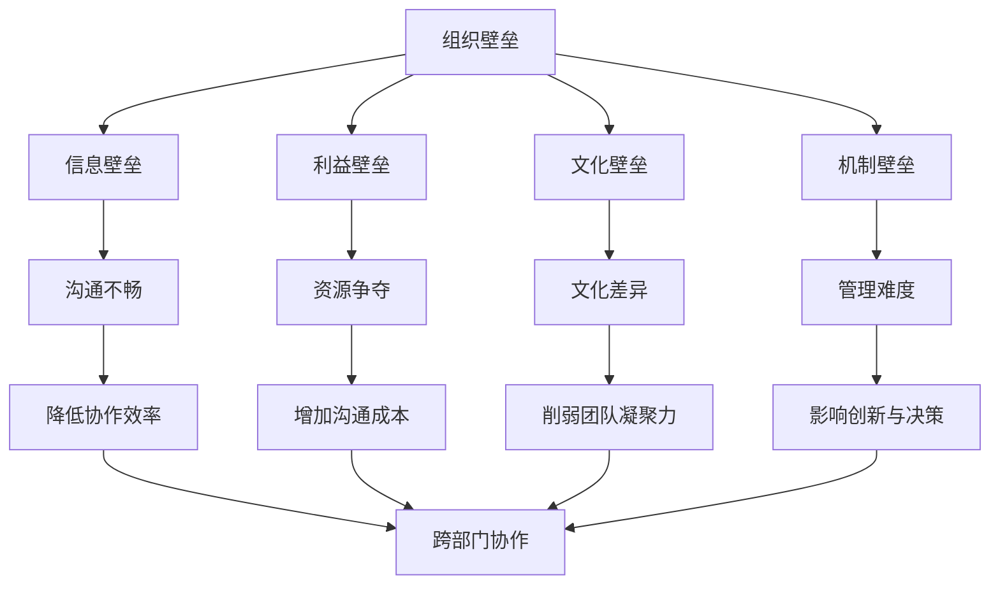

                 

### 引言：跨部门协作的重要性

在当今快速变化和高度复杂的商业环境中，跨部门协作的重要性愈发凸显。随着组织的规模不断扩大和业务范围的拓展，单一部门内的运作已无法满足企业整体的战略目标和市场竞争力。跨部门协作不仅是一种管理模式，更是一种资源整合、知识共享、协同创新的重要手段。

**背景介绍**：

首先，跨部门协作的背景在于现代企业组织结构日趋复杂，职能分工更加细化。在这样一个背景下，不同部门之间往往存在信息不对称、目标不一致、资源分配不均等问题。这些问题不仅影响了工作效率，也阻碍了企业的创新能力和市场响应速度。因此，提升跨部门协作效率成为企业生存和发展的关键。

**跨部门协作的意义**：

1. **提升资源利用率**：通过跨部门协作，企业可以整合不同部门的专业资源，形成优势互补，提高整体资源利用率。
   
2. **增强创新能力**：跨部门协作可以打破知识壁垒，促进不同部门间的知识交流与碰撞，从而激发创新的火花。

3. **提高决策质量**：跨部门协作有助于全面、多角度地分析问题，提高决策的科学性和有效性。

4. **强化团队意识**：跨部门协作可以增强团队成员之间的沟通和信任，提升团队整体凝聚力和执行力。

5. **适应市场变化**：在快速变化的市场环境中，跨部门协作能够提高企业的灵活性和响应速度，更好地适应市场变化。

**组织壁垒对协作的阻碍**：

尽管跨部门协作具有重要意义，但企业内部仍然存在诸多壁垒，阻碍协作的顺利进行。这些壁垒包括：

1. **信息壁垒**：部门之间的信息孤岛，导致信息不透明，沟通不畅。
   
2. **利益壁垒**：不同部门在目标、资源、利益上存在冲突，导致协作动力不足。
   
3. **文化壁垒**：不同部门有着不同的工作习惯和文化背景，导致协作难以顺畅。

4. **机制壁垒**：缺乏有效的跨部门协作机制，导致协作无章可循。

要实现高效的跨部门协作，企业必须认识到这些壁垒的存在，并采取相应的策略来打破它们，从而实现资源的最大化利用和企业的持续发展。

### 核心概念与联系：组织壁垒与跨部门协作

#### 组织壁垒的概念

组织壁垒是指在企业内部不同部门、层级或团队之间形成的障碍，这些障碍限制了信息的流动、资源的共享和目标的协同。组织壁垒的来源多样，主要包括：

1. **信息壁垒**：由于不同部门使用的系统不兼容、数据格式不一致，导致信息传递不畅，难以实现数据的共享和实时更新。

2. **利益壁垒**：各部门在利益上存在冲突，如预算分配、业绩考核等，导致部门之间在协作时产生摩擦和阻力。

3. **文化壁垒**：各部门有着不同的价值观、工作方式和沟通习惯，文化差异往往导致协作的困难和沟通的障碍。

4. **机制壁垒**：企业缺乏有效的跨部门协作机制和流程，导致协作无章可循，协作效率低下。

#### 组织壁垒的表现形式

组织壁垒的具体表现形式包括：

1. **部门隔离**：不同部门在物理空间上隔离，导致面对面沟通减少，信息传递速度慢。

2. **沟通不畅**：由于缺乏有效的沟通渠道和机制，部门之间难以及时交换信息，导致协作受阻。

3. **资源争夺**：各部门为了各自的利益，可能对有限的资源进行争夺，导致资源浪费和协作效率降低。

4. **目标不一致**：各部门在战略目标上可能存在差异，导致协作时的目标不统一，协作效果不佳。

#### 组织壁垒对协作的影响

组织壁垒对跨部门协作的影响是多方面的：

1. **降低协作效率**：部门隔离和文化差异导致协作困难，沟通不畅和目标不一致进一步降低了协作效率。

2. **增加沟通成本**：跨部门协作需要克服信息壁垒和利益壁垒，这往往需要额外的沟通和协调成本。

3. **削弱团队凝聚力**：文化差异和利益冲突可能导致团队凝聚力下降，影响团队的整体合作精神和执行力。

4. **影响创新与决策**：信息壁垒和机制壁垒限制了知识的流动和经验的分享，削弱了企业的创新能力和决策质量。

#### 跨部门协作的必要性

跨部门协作的必要性体现在以下几个方面：

1. **资源整合**：跨部门协作可以实现资源的有效整合，包括人力、物力、财力等，提高资源利用率。

2. **知识共享**：跨部门协作可以促进知识的交流与共享，激发创新思维，提升企业的创新能力。

3. **目标协同**：跨部门协作有助于明确各部门的共同目标，增强协作的凝聚力和执行力。

4. **提高决策质量**：跨部门协作可以汇集多部门的专业意见，提高决策的科学性和全面性。

#### 跨部门协作的优势

跨部门协作的优势包括：

1. **提高工作效率**：通过协作，可以缩短工作流程，减少不必要的重复劳动，提高整体工作效率。

2. **增强创新能力**：跨部门协作可以促进不同部门之间的知识碰撞和经验交流，激发创新思维。

3. **提升团队凝聚力**：通过共同完成任务，团队成员之间的信任和合作精神得到加强。

4. **增强市场响应速度**：跨部门协作有助于企业快速响应市场变化，提高市场竞争力。

#### 跨部门协作的挑战与机遇

跨部门协作面临诸多挑战，包括：

1. **文化差异**：不同部门的文化背景和价值观可能存在差异，导致协作困难。

2. **利益冲突**：各部门在资源、目标和利益上可能存在冲突，影响协作的顺利进行。

3. **沟通不畅**：缺乏有效的沟通渠道和机制，导致信息传递不畅，协作受阻。

4. **管理难度**：跨部门协作增加了管理难度，需要协调不同部门的需求和目标。

但同时，跨部门协作也带来了新的机遇：

1. **资源整合**：通过跨部门协作，可以实现资源的最大化利用，提高企业的整体竞争力。

2. **创新能力**：跨部门协作可以激发创新思维，推动企业持续创新。

3. **市场响应**：跨部门协作有助于企业快速响应市场变化，提高市场竞争力。

4. **团队建设**：跨部门协作可以加强团队之间的沟通和合作，提升团队凝聚力。

#### Mermaid流程图：组织壁垒与跨部门协作的关系

通过上述流程图，我们可以清晰地看到组织壁垒对跨部门协作的影响及如何通过协作来克服这些壁垒。

### 跨部门协作的理论基础

跨部门协作的有效实施不仅需要实践中的经验积累，还需要坚实的理论基础作为指导。以下将介绍几个关键的理论基础，这些理论为跨部门协作提供了理论支撑和实际操作指南。

#### 组织行为学理论

组织行为学理论主要研究组织中个体、团队以及组织整体的行为模式及其影响因素。在跨部门协作中，组织行为学理论的应用主要体现在以下几个方面：

1. **团队协作理论**：团队协作理论强调团队成员之间的合作和互动对于完成任务的重要性。在跨部门协作中，团队成员需要打破部门界限，形成跨部门团队，共同追求团队目标。关键在于如何建立有效的沟通机制、明确团队成员的角色和职责，以及激发团队成员的积极性和创造力。

2. **沟通理论**：沟通理论关注信息在组织中的流动方式及其对协作效率的影响。在跨部门协作中，有效的沟通是确保各部门之间信息畅通、目标一致的关键。组织行为学强调建立透明、开放的沟通文化，使用多种沟通渠道（如面对面会议、电子邮件、即时通讯工具等）来促进信息共享。

3. **激励理论**：激励理论探讨如何通过激励措施来提高员工的工作动力和绩效。在跨部门协作中，组织需要设计合理的激励机制，以鼓励员工主动参与协作，例如通过奖励优秀的跨部门协作团队或个人，提高员工的积极性和协作意愿。

#### 组织心理学理论

组织心理学理论侧重于研究员工的心理状态及其对组织行为的影响。以下是一些关键的理论概念及其在跨部门协作中的应用：

1. **员工动机理论**：员工动机理论关注员工在工作中追求的内在和外在动机。在跨部门协作中，了解员工的动机有助于设计激励措施，提高员工参与协作的积极性。例如，通过设置具有挑战性的任务、提供职业发展机会等来满足员工的内在动机。

2. **员工信任理论**：信任是跨部门协作中不可或缺的元素。组织心理学研究表明，信任可以提高团队协作效率，降低沟通成本。在跨部门协作中，通过建立互信机制，如定期会议、团队建设活动等，可以增强团队成员之间的信任。

3. **心理安全感理论**：心理安全感是指员工在组织中感到不受威胁、能够自由表达意见的状态。在跨部门协作中，创造一个支持性和包容性的工作环境，可以增强员工的心理安全感，提高协作的积极性。

#### 组织结构理论

组织结构理论探讨组织的层级结构、权责分配及其对组织效率的影响。以下是一些关键概念及其在跨部门协作中的应用：

1. **网络型组织结构**：网络型组织结构强调横向联系和跨部门协作，通过去中心化的方式提高组织的灵活性和响应速度。在跨部门协作中，网络型组织结构有助于打破部门壁垒，促进信息流动和资源共享。

2. **权责配置**：组织结构中的权责配置对跨部门协作具有重要影响。明确的权责划分可以减少部门间的责任推诿，提高协作效率。在跨部门协作中，需要明确各团队的职责和权限，确保协作过程中有明确的分工和责任。

3. **跨部门团队**：跨部门团队是跨部门协作的核心形式。在组织结构理论中，跨部门团队被看作是组织中的一种特殊团队形式，通过跨部门的组合，可以实现知识和资源的整合，提高协作效果。

#### 理论之间的联系

组织行为学、组织心理学和组织结构理论虽然各有侧重，但它们之间存在紧密的联系。组织行为学和组织心理学提供了理解员工行为和心理状态的基础，这些知识有助于设计有效的跨部门协作机制和激励机制。而组织结构理论则提供了组织框架和结构设计的指导，确保跨部门协作在组织内部得以顺利实施。

总的来说，跨部门协作的理论基础不仅为跨部门协作的实施提供了指导，还帮助企业在实际操作中识别和解决协作过程中的问题。通过综合应用这些理论，企业可以构建一个高效的跨部门协作体系，促进资源的整合和知识的共享，从而提升企业的整体竞争力和创新能力。

### 跨部门协作的最佳实践

在实际工作中，跨部门协作的有效实施需要结合具体情境，采用一系列最佳实践策略。以下将介绍几种关键的最佳实践，并提供具体的操作指南和案例。

#### 领导力在跨部门协作中的作用

领导者在跨部门协作中扮演着至关重要的角色，他们不仅需要协调各部门之间的工作，还需要激发团队的动力和创造力。以下是领导者应采取的几个关键措施：

1. **明确协作目标**：领导者需要明确跨部门协作的目标和预期成果，确保各部门都了解协作的目的和重要性。这可以通过定期召开协作启动会议，明确任务分工和责任。

2. **建立信任机制**：信任是跨部门协作成功的关键，领导者可以通过建立开放透明的沟通渠道、鼓励员工之间的互动和合作，以及提供必要的支持和资源来增强团队间的信任。

3. **激励与认可**：领导者应设计合理的激励机制，对在跨部门协作中表现优秀的团队和个人给予奖励和认可，激发团队成员的积极性和创造力。

**案例**：某高科技公司在一次新产品开发项目中，由研发部门、市场部门和技术支持部门组成的跨部门团队在领导者的协调下，通过定期的项目会议和沟通，成功实现了产品从研发到市场推广的顺利过渡。

#### 跨部门团队建设

跨部门团队建设是跨部门协作成功的重要保障。以下是一些关键的团队建设策略：

1. **团队成员招募与培训**：在选择团队成员时，应注重团队成员的专业技能和沟通能力。同时，对团队成员进行定期的培训，提升他们的协作意识和协作技能。

2. **团队角色分工**：明确每个团队成员的角色和职责，确保每个成员都了解自己在团队中的位置和任务，避免职责重叠和责任不清。

3. **建立团队规则**：制定明确的团队规则，包括工作流程、沟通机制、决策程序等，确保团队协作有序、高效。

**案例**：某汽车制造公司在生产线上引入了跨部门团队模式，由生产部门、质量控制和供应链管理等部门组成的团队通过明确的分工和规则，成功提高了生产效率，降低了质量缺陷率。

#### 跨部门沟通策略

有效的跨部门沟通是跨部门协作顺利进行的基石。以下是一些关键的沟通策略：

1. **使用多种沟通渠道**：结合面对面会议、电子邮件、即时通讯工具等多种沟通渠道，确保信息传达的及时性和准确性。

2. **定期召开协作会议**：定期召开跨部门协作会议，及时交流工作进展、解决问题、分享经验和成果，确保团队目标的一致性。

3. **建立信息共享平台**：建立统一的信息共享平台，如企业内部网站、协作软件等，方便团队成员随时获取最新信息，减少信息不对称。

**案例**：某电子商务公司在跨部门协作中，使用了项目管理软件和即时通讯工具，确保各部门之间沟通畅通，信息传递高效，从而在短时间内完成了多个大型促销活动。

#### 其他最佳实践

除了上述关键措施，还有一些其他最佳实践可以帮助提升跨部门协作的效率：

1. **共同制定项目计划**：在项目启动阶段，各部门共同制定项目计划，明确任务分工和时间节点，确保项目顺利推进。

2. **设立跨部门协调角色**：设立专门的跨部门协调人，负责各部门之间的沟通协调，确保协作过程中的问题能够及时解决。

3. **利用技术手段**：运用项目管理软件、协作工具和自动化系统等，提高跨部门协作的效率和准确性。

**案例**：某金融公司在跨部门协作中，引入了项目管理软件和协作工具，通过自动化流程和实时监控，实现了各部门之间的紧密协作，显著提升了项目执行效率。

通过这些最佳实践，企业可以构建一个高效的跨部门协作体系，促进资源的整合和知识的共享，从而提升企业的整体竞争力和创新能力。

### 案例研究：成功的跨部门协作项目

为了更好地理解跨部门协作的实际效果，我们将通过两个具体的案例，详细探讨跨国公司和国内企业如何通过成功的跨部门协作实现项目目标。

#### 案例一：跨国公司的跨部门协作

**项目背景与目标**：

某全球知名的跨国公司正在开发一款新的智能物联网设备。该项目涉及多个部门的协作，包括研发部门、市场营销部门、供应链管理部门和客户服务部门。项目的目标是确保设备在短时间内推向市场，并达到预期销售目标。

**项目实施过程**：

1. **项目启动与目标明确**：在项目启动会议上，各相关部门的负责人共同制定了详细的项目目标和时间表，明确了各部门在项目中的角色和责任。

2. **建立跨部门团队**：公司成立了一个跨部门团队，由研发部门的技术专家、市场营销部门的营销专家、供应链管理部门的物流专家和客户服务部门的客户支持专家组成。团队成员被分配到不同的子项目中，如产品设计、市场调研、供应链优化和客户支持等。

3. **定期沟通与协调**：跨部门团队每周召开会议，汇报各自子项目的进展情况，讨论遇到的挑战和解决方案。公司还使用了项目管理软件，确保各部门之间的信息共享和任务协同。

4. **共同解决问题**：在项目开发过程中，各团队共同面对了多个挑战，如技术难题、市场变化和供应链瓶颈。通过定期的沟通和协调，团队找到了有效的解决方案，如调整产品功能、优化市场策略和改进供应链流程。

5. **项目成果与反馈**：在项目完成后，公司成功将智能物联网设备推向市场，并达到了预期的销售目标。项目结束后，团队进行了总结会议，分享了项目经验，并为未来项目的协作提供了改进建议。

**项目成果**：

通过成功的跨部门协作，该公司不仅按时完成了项目目标，还提高了产品质量和市场适应性。项目的成功得益于各部门之间的紧密协作、沟通顺畅和资源共享。这一项目也为公司未来的跨部门协作提供了宝贵的经验。

#### 案例二：国内企业的跨部门协作

**项目背景与目标**：

某国内大型制造企业正在开发一款高性能的工业机器人。该项目涉及多个部门的合作，包括研发部门、生产部门、质量控制和销售部门。项目的目标是确保机器人产品在市场上具有竞争力，并迅速占领市场份额。

**项目实施过程**：

1. **项目启动与目标明确**：项目启动会议上，各相关部门的负责人明确了项目目标和时间表，并确定了各团队的具体任务。

2. **建立跨部门团队**：公司成立了一个跨部门团队，由研发部门的技术专家、生产部门的生产管理专家、质量控制部门的质检专家和销售部门的销售经理组成。每个团队被分配到不同的子项目中，如产品研发、生产流程优化、质量控制和市场推广等。

3. **协调资源与任务分配**：跨部门团队通过项目管理软件协调资源分配和任务执行，确保每个团队都能够获得所需的资源和支持。

4. **共同解决挑战**：在项目开发过程中，团队共同面对了技术难题、生产瓶颈和质量控制问题。通过定期的沟通和协调，团队找到了解决方案，如改进产品设计、优化生产流程和加强质量控制。

5. **项目成果与反馈**：在项目完成后，公司成功推出了高性能工业机器人，并获得了市场的积极反馈。项目的成功得益于各部门之间的紧密协作、资源共享和有效的沟通。

**项目成果**：

通过成功的跨部门协作，该公司不仅按时完成了项目目标，还提高了产品的市场竞争力。项目的成功经验也为公司未来的跨部门协作提供了借鉴，如加强沟通机制、优化资源配置和提升团队协作能力。

这两个案例表明，成功的跨部门协作不仅可以提高项目效率和质量，还能促进企业内部的资源整合和知识共享。通过有效的跨部门协作，企业可以更好地应对市场变化，提升竞争力和创新能力。

### 工具与方法：促进跨部门协作的技巧

在跨部门协作中，选择合适的工具和方法对于提高协作效率、减少沟通成本和确保项目顺利进行至关重要。以下是一些关键的促进跨部门协作的技巧：

#### 项目管理工具

项目管理工具是跨部门协作中的重要助手，可以帮助团队更好地规划和跟踪项目进度。以下是一些常用的项目管理工具及其应用场景：

1. **JIRA**：JIRA是一款功能强大的项目管理工具，适用于复杂的跨部门项目。它可以用于任务分配、进度跟踪、问题管理以及报告生成。团队成员可以通过JIRA提交任务、更新状态，并查看任务详情，确保任务分配和进度透明。

2. **Trello**：Trello是一个直观易用的看板工具，适合小型项目或跨部门协作。用户可以通过拖放功能轻松创建任务卡片、分配任务并跟踪进度。Trello的看板视图可以清晰地展示任务状态和项目进度，帮助团队成员更好地协同工作。

3. **Asana**：Asana是一款功能全面的协作工具，适合企业规模较大的跨部门协作项目。它可以用于任务管理、进度跟踪、团队协作和报告生成。Asana的日报功能可以帮助团队成员每天记录工作进展，确保任务按时完成。

**使用技巧**：

- **统一使用**：确保所有团队成员都熟悉并使用同一项目管理工具，减少沟通和协调成本。
- **任务分配清晰**：在任务分配时，明确任务的负责人、截止日期和具体要求，确保任务分配清晰。
- **定期更新**：定期更新任务状态，确保项目进度透明，及时发现并解决问题。

#### 沟通工具

有效的沟通是跨部门协作的关键，以下是一些常用的沟通工具及其特点：

1. **Slack**：Slack是一款流行的即时通讯工具，适用于日常的跨部门沟通。它可以用于团队聊天、文件共享、任务提醒等。Slack的频道功能可以帮助团队成员按照项目、任务或主题进行分组，确保沟通更加高效。

2. **Microsoft Teams**：Microsoft Teams是一款集通信、协作和会议于一体的工具，适用于企业内部的跨部门协作。它提供了聊天、视频会议、文档共享和任务管理等功能，可以帮助团队成员随时沟通和协作。

3. **Zoom**：Zoom是一款功能强大的视频会议工具，适用于需要面对面交流的跨部门协作。它支持多会议室、屏幕共享和实时聊天，可以帮助团队成员远程会议和协作。

**使用技巧**：

- **明确沟通目标**：每次会议或沟通前，明确会议目的和讨论要点，确保沟通有针对性。
- **定期沟通**：定期召开跨部门会议，确保团队之间的信息畅通和协作顺畅。
- **记录会议内容**：在会议结束后，及时记录会议内容和决定事项，确保团队成员都能了解会议结果。

#### 协作技巧

除了工具，一些协作技巧也可以有效提升跨部门协作的效率：

1. **明确职责和权限**：在跨部门协作中，明确每个团队成员的职责和权限，确保任务分配合理，避免责任不清和推诿。

2. **建立信任机制**：通过建立互信机制，如共同完成任务、定期反馈和表扬等，增强团队成员之间的信任和合作意愿。

3. **沟通技巧**：提高沟通技巧，如善于倾听、清晰表达和积极反馈，可以减少误解和冲突，提高协作效率。

**案例**：

某公司在开发一款新产品时，采用了项目管理工具JIRA和沟通工具Slack进行跨部门协作。在项目启动时，所有团队成员都接受了JIRA和Slack的培训，确保他们能够熟练使用这些工具。项目期间，团队通过JIRA进行任务分配和进度跟踪，通过Slack进行日常沟通和讨论。每周，团队还会召开一次视频会议，汇报工作进展和讨论问题。通过这些工具和技巧，项目团队成功地按时完成了开发任务，并顺利推出了新产品。

通过选择合适的工具和方法，并运用有效的协作技巧，企业可以显著提高跨部门协作的效率和质量，从而实现项目的成功。

### 文化变革：建立跨部门协作文化

跨部门协作的成功不仅依赖于有效的工具和技巧，更需要企业内部形成一种支持和鼓励协作的文化。文化变革是推动跨部门协作持续发展的关键，它要求企业从理念、行为和制度等多个层面进行系统性变革。

#### 文化变革的重要性

文化变革对于跨部门协作的影响至关重要。一个积极、开放和支持协作的企业文化能够：

1. **促进信任和透明度**：在协作文化中，员工更容易建立信任，信息能够透明地流通，减少信息壁垒和误解。

2. **提高员工的协作意愿**：在协作文化中，员工更愿意主动参与到跨部门合作中，分享知识和资源，提升整体团队效率。

3. **激发创新思维**：协作文化鼓励不同背景和技能的员工进行交流和合作，促进知识的碰撞和创新思维的产生。

4. **增强企业的灵活性和响应速度**：协作文化使企业能够快速适应市场变化，通过跨部门协作灵活调整策略和资源，提高市场竞争力。

#### 企业文化建设

要建立支持协作的企业文化，企业需要从以下几个方面进行建设：

1. **共同价值观**：企业应明确并倡导共同的价值观，如团队合作、开放沟通、知识共享和创新思维。通过内部宣传、培训和活动，让员工认同并践行这些价值观。

2. **领导示范**：企业的领导者需要以身作则，展示协作行为，通过自己的行动来影响和激励员工。例如，领导者可以通过跨部门会议、团队建设活动和协作项目，示范跨部门协作的重要性。

3. **沟通机制**：建立有效的内部沟通机制，如定期的跨部门会议、内部论坛和交流平台，鼓励员工之间的交流和合作。通过这些机制，员工可以分享经验、讨论问题并寻求解决方案。

4. **奖励机制**：建立奖励机制，鼓励员工在跨部门协作中表现突出。这可以包括物质奖励、晋升机会和公开表彰，以激励员工积极参与协作。

#### 员工行为规范

在协作文化中，员工的行为规范是确保协作顺利进行的重要保障。以下是一些关键的行为规范：

1. **开放沟通**：员工应保持开放的心态，积极倾听他人的意见和建议，并乐于分享自己的知识和经验。

2. **尊重差异**：不同部门有着不同的工作习惯和文化背景，员工应尊重这些差异，避免因为文化差异产生误解和冲突。

3. **共同目标**：员工应明确团队和个人的共同目标，将个人利益与团队利益相结合，为实现共同目标而努力。

4. **团队合作**：员工应积极参与团队活动，支持团队中的其他成员，共同完成任务。

#### 员工价值观的培养

培养员工的协作价值观是文化变革的核心。以下是一些具体的培养方法：

1. **培训与发展**：通过定期的培训课程，提升员工在跨部门协作方面的知识和技能，增强他们的协作意识和能力。

2. **案例分析**：通过分享成功的跨部门协作案例，让员工了解协作的重要性和成功的关键因素，激发他们的协作热情。

3. **团队建设活动**：组织团队建设活动，如团队拓展训练、团队合作游戏等，增强员工的团队合作精神和信任。

4. **企业文化活动**：通过企业文化活动，如文化节、员工表彰会等，营造一个积极、开放和支持协作的企业氛围。

通过文化变革，企业可以建立一种支持跨部门协作的文化，激发员工的协作意愿，提高协作效率，从而推动企业的持续发展和创新。

### 技术支持：利用技术手段促进跨部门协作

在当今数字化时代，技术手段在跨部门协作中发挥着不可或缺的作用。通过有效的技术支持，企业可以显著提升协作效率、减少沟通成本，并实现资源的优化配置。以下将探讨几种常见的技术手段及其在跨部门协作中的应用。

#### 信息技术在跨部门协作中的应用

1. **企业资源规划（ERP）系统**：
   ERP系统是企业管理的核心，它将企业的各种业务流程集成在一起，实现资源的统一管理和调度。在跨部门协作中，ERP系统可以帮助企业实现财务、人力资源、供应链和生产等各部门之间的数据共享和协同工作。例如，研发部门可以通过ERP系统获取市场部和销售部的需求信息，及时调整产品研发方向，提高市场响应速度。

2. **客户关系管理（CRM）系统**：
   CRM系统主要用于管理企业与客户之间的关系，它记录了客户的购买历史、需求和反馈信息。通过CRM系统，不同部门可以共享客户数据，确保市场营销、销售和服务部门之间的信息一致性。例如，销售部门可以及时了解客户的最新需求，并将这些信息反馈给研发部门，以便及时改进产品。

3. **办公自动化系统（OA）**：
   OA系统可以帮助企业实现办公流程的自动化，包括审批、文档管理、会议安排等。通过OA系统，企业可以实现跨部门的在线协同工作，提高工作效率。例如，跨部门的项目会议可以通过OA系统进行线上预约和通知，所有参会人员可以在会议前在线查看会议议程和材料，确保会议的高效进行。

#### 人工智能与跨部门协作

人工智能（AI）在跨部门协作中的应用正在日益广泛，它可以帮助企业实现自动化决策、优化资源分配和提升协作效率。以下是一些关键的应用场景：

1. **智能推荐系统**：
   通过机器学习算法，AI可以根据员工的工作行为和偏好，为其推荐相关的任务和资源。例如，在项目管理中，AI可以基于团队成员的技能和任务负荷，自动分配最合适的任务，确保任务的高效完成。

2. **智能助手**：
   智能助手（如虚拟聊天机器人）可以用于跨部门的信息查询和任务分配。员工可以通过自然语言与智能助手进行交互，获取所需的信息，如项目进度、任务分配和资源情况。例如，研发部门可以通过智能助手获取最新的市场调研报告，以便更好地进行产品研发。

3. **自动化决策支持**：
   AI可以用于自动化决策支持系统，通过分析大量的数据，为企业提供决策建议。例如，供应链部门可以利用AI系统预测市场需求，优化库存管理，减少库存成本。

#### 实际应用案例

1. **案例分析：跨国公司的数字化协作平台**：
   某跨国公司在全球范围内设有多个分支机构，为了提升跨部门协作效率，该公司开发了统一的数字化协作平台。该平台集成了ERP、CRM和OA系统，实现了全球业务流程的集成和协同。通过这个平台，各分支机构可以实时共享数据、协调资源，提高了决策效率和市场响应速度。

2. **案例分析：国内企业的AI协作工具**：
   某国内大型制造企业引入了AI协作工具，用于跨部门的项目管理。该工具通过自然语言处理和机器学习技术，为项目团队提供了智能任务分配、进度监控和决策支持。例如，当项目遇到瓶颈时，AI工具可以分析项目数据，提出优化建议，帮助团队快速解决问题。

通过利用信息技术和人工智能，企业可以实现跨部门协作的数字化和智能化，显著提升协作效率和决策质量。这些技术手段不仅帮助企业突破了传统的组织壁垒，还为企业的持续创新和发展提供了强有力的支持。

### 挑战与解决方案：跨部门协作中常见问题与解决策略

跨部门协作虽然具有显著的优势，但在实际操作过程中也面临诸多挑战。以下将分析跨部门协作中常见的几个问题，并提出相应的解决策略。

#### 沟通不畅

沟通不畅是跨部门协作中最常见的问题之一。不同部门之间缺乏有效的沟通渠道和机制，导致信息传递不及时、不全面，从而影响协作效率。

**解决方案**：

1. **建立沟通平台**：企业可以建立一个统一的沟通平台，如企业内部网站或协作软件，确保各部门之间的信息流通。通过这个平台，员工可以实时共享信息、讨论问题，并跟踪任务进展。

2. **定期沟通会议**：定期召开跨部门沟通会议，确保各部门之间的信息同步。会议内容应涵盖项目进展、问题讨论和决策制定，确保所有团队成员都了解项目的最新动态。

3. **明确沟通规范**：制定明确的沟通规范，包括沟通频率、沟通方式和沟通内容。通过规范化沟通，减少信息传递过程中的误解和遗漏。

#### 利益冲突

跨部门协作中，不同部门在资源分配、任务完成和利益分配上可能存在冲突，导致协作困难。

**解决方案**：

1. **设立协调角色**：设立专门的跨部门协调角色，如跨部门协调经理或项目经理，负责协调各部门之间的利益分配和资源调配，确保协作顺利进行。

2. **明确责任和权限**：在项目启动时，明确各团队的责任和权限，确保任务分工清晰，避免因责任不清导致的冲突。

3. **建立激励机制**：设计合理的激励机制，对在跨部门协作中表现优秀的团队和个人给予奖励，提高协作动力。

#### 文化差异

不同部门有着不同的工作习惯、文化背景和价值观，这些差异可能导致跨部门协作中的误解和冲突。

**解决方案**：

1. **文化培训**：开展跨部门文化培训，提高员工对不同部门文化的认识和尊重。通过培训，增强员工的跨部门协作意识和团队意识。

2. **建立共同价值观**：倡导并建立企业内部的共同价值观，如团队合作、开放沟通和互信互助，减少文化差异带来的冲突。

3. **促进文化交流**：组织跨部门的文化交流活动，如团队建设活动、文化体验等，增强团队成员之间的了解和信任。

#### 机制壁垒

跨部门协作中，企业往往缺乏有效的协作机制和流程，导致协作无章可循，协作效率低下。

**解决方案**：

1. **建立协作机制**：建立明确的跨部门协作机制和流程，包括任务分配、进度跟踪、沟通方式和决策程序等。通过规范化协作机制，提高协作效率。

2. **制定协作手册**：制定详细的协作手册，详细描述跨部门协作的流程和规范，确保所有团队成员都能遵循。

3. **加强监督与反馈**：设立监督机制，定期检查协作进展和效果，对协作中的问题及时反馈和调整，确保协作顺利进行。

通过上述解决方案，企业可以克服跨部门协作中的常见问题，提高协作效率，实现资源的最大化利用，推动企业的持续发展。

### 总结与展望：未来跨部门协作的趋势

跨部门协作作为现代企业管理的重要手段，其重要性在未来将进一步凸显。随着技术的发展和商业环境的不断变化，跨部门协作也将呈现出一些新的趋势和特点。

**跨部门协作的重要性**：

在全球化、数字化和智能化的背景下，企业面临的市场环境日益复杂，单一部门的工作模式已经无法满足企业发展的需求。跨部门协作不仅有助于企业整合内部资源，提高整体运营效率，还能促进创新和知识的共享，提升企业的市场竞争力。随着企业对协作效率和创新能力的日益重视，跨部门协作将逐渐成为企业战略的重要组成部分。

**未来跨部门协作的趋势**：

1. **数字化与智能化**：随着信息技术的不断进步，跨部门协作将更加数字化和智能化。人工智能、大数据和云计算等技术的应用，将使得协作过程中的信息传递、任务分配和决策支持更加高效和精准。

2. **跨界合作**：未来跨部门协作将不仅限于企业内部，还将涉及更多的跨界合作。企业与供应商、客户、合作伙伴等建立更紧密的协作关系，实现产业链的协同发展。

3. **敏捷协作**：敏捷管理理念将在跨部门协作中广泛应用。企业将采用更灵活、更快速的反应机制，通过跨部门团队的快速组建和任务执行，提高应对市场变化的能力。

4. **文化融合**：随着跨部门协作的加深，企业将更加重视文化融合。通过文化培训、团队建设活动和价值观倡导，促进不同部门之间的文化认同和合作。

**面临的挑战**：

1. **数据安全与隐私**：随着数字化协作的普及，数据安全和隐私保护将成为重要的挑战。企业需要建立完善的数据安全管理体系，确保协作过程中的数据安全。

2. **技能与人才短缺**：跨部门协作需要具备多技能、跨领域的人才，但当前市场上这类人才相对短缺。企业需要通过培训和发展计划，提升现有员工的协作能力和技能。

3. **协作机制的创新**：现有的协作机制和流程可能无法完全适应未来的跨部门协作需求，企业需要不断创新和优化协作机制，以应对复杂多变的市场环境。

**展望**：

未来，跨部门协作将更加智能化、数字化和敏捷化，成为企业核心竞争力的重要组成部分。通过有效的跨部门协作，企业可以更好地应对市场变化，实现资源的最大化利用，推动持续创新和业务增长。同时，企业也需要不断优化协作机制，提升员工的协作能力，应对未来跨部门协作带来的挑战。

### 文章标题：《跨部门协作：打破组织壁垒的策略》

#### 关键词：
- 跨部门协作
- 组织壁垒
- 效率提升
- 数字化转型
- 文化变革

#### 摘要：
本文深入探讨了跨部门协作在当代企业管理中的重要性，分析了组织壁垒对协作的阻碍，提出了基于实践的理论基础和最佳实践策略。通过跨国公司和国内企业的成功案例，展示了跨部门协作的实际效果。文章还详细介绍了利用技术手段促进跨部门协作的方法，并针对跨部门协作中的常见问题提出了解决方案。展望未来，跨部门协作将更加数字化和智能化，成为企业持续发展的关键。

#### 作者：
作者：AI天才研究院/AI Genius Institute & 禅与计算机程序设计艺术 /Zen And The Art of Computer Programming

---

# 《跨部门协作：打破组织壁垒的策略》

## 引言：跨部门协作的重要性

### 背景介绍

### 跨部门协作的意义

### 组织壁垒对协作的阻碍

## 核心概念与联系：组织壁垒与跨部门协作

### 组织壁垒的概念

### 组织壁垒的表现形式

### 组织壁垒对协作的影响

### 跨部门协作的必要性

### 跨部门协作的优势

### 跨部门协作的挑战与机遇

### Mermaid流程图：组织壁垒与跨部门协作的关系

## 跨部门协作的理论基础

### 组织行为学理论

### 组织心理学理论

### 组织结构理论

### 理论之间的联系

## 跨部门协作的最佳实践

### 领导力在跨部门协作中的作用

### 跨部门团队建设

### 跨部门沟通策略

## 案例研究：成功的跨部门协作项目

### 案例一：跨国公司的跨部门协作

### 案例二：国内企业的跨部门协作

## 工具与方法：促进跨部门协作的技巧

### 项目管理工具

### 沟通工具

### 协作技巧

## 文化变革：建立跨部门协作文化

### 文化变革的重要性

### 企业文化建设

### 员工行为规范

### 员工价值观的培养

## 技术支持：利用技术手段促进跨部门协作

### 信息技术在跨部门协作中的应用

### 人工智能与跨部门协作

### 实际应用案例

## 挑战与解决方案：跨部门协作中常见问题与解决策略

### 沟通不畅

### 利益冲突

### 文化差异

### 机制壁垒

## 总结与展望：未来跨部门协作的趋势

### 跨部门协作的重要性

### 未来跨部门协作的趋势

### 面临的挑战

### 展望

---

### 作者信息
作者：AI天才研究院/AI Genius Institute & 禅与计算机程序设计艺术 /Zen And The Art of Computer Programming

---

通过本文的详细探讨，我们希望读者能够对跨部门协作的重要性、理论基础、最佳实践和技术支持有更深入的理解。希望本文能为企业在实施跨部门协作时提供有益的参考和指导，助力企业的持续发展和创新。感谢读者的阅读，期待与您在未来的合作中共同成长。

