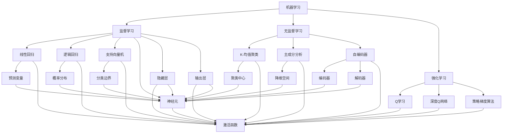

                 


### 摘要

本文旨在探讨跨领域AI应用中的提示词标准化问题，分析其重要性、挑战和解决策略。文章首先介绍了AI在各个领域的应用背景，阐述了提示词标准化的意义及其在跨领域应用中的关键作用。接着，文章从机器学习基础、深度学习原理和自然语言处理三个方面，详细讲解了AI技术的核心概念和原理，并通过Mermaid流程图展示了核心概念之间的关系架构。然后，文章深入探讨了提示词生成策略、评估标准和跨领域应用实例，通过伪代码、数学模型和实际案例，阐述了提示词标准化方法的具体实施步骤和评估方法。最后，文章总结了标准化实施的关键流程、评估标准、持续改进策略，并提供了最佳实践和小结，为跨领域AI应用中的提示词标准化提供了全面的指导。

### 引言

在当今科技迅猛发展的时代，人工智能（AI）已经成为推动社会进步的重要力量。AI技术在各个领域的应用，如医疗、金融、教育、自动驾驶等，正在深刻改变我们的生活方式。然而，随着AI技术的不断进步和应用的广泛普及，跨领域AI应用中的提示词标准化问题逐渐凸显出来。

#### AI在各领域的重要性

AI技术的发展和应用已经深入到我们生活的方方面面。在医疗领域，AI技术被广泛应用于疾病诊断、治疗建议和药物研发，显著提高了医疗服务的质量和效率。在金融领域，AI被用于风险评估、信用评分和欺诈检测，为金融机构提供了更准确、更高效的决策支持。在教育领域，AI技术被应用于个性化教学、学习评估和教育资源优化，为学生提供了更加灵活、高效的学习体验。在自动驾驶领域，AI技术则是实现自动驾驶汽车的核心技术，推动了智能交通系统的发展。

#### 提示词标准化的意义

提示词（Prompt）在AI应用中起着至关重要的作用。提示词是对模型输入的一种引导，它决定了模型的行为和输出。在不同的领域和应用场景中，提示词的设计和选择往往直接影响着AI模型的性能和效果。提示词标准化是指通过统一标准，确保在不同领域和应用场景中，提示词的格式、内容和应用方式的一致性。

提示词标准化的意义在于：

1. **提高模型性能**：统一的提示词标准有助于提高模型的训练效果和泛化能力，使模型在不同领域和应用场景中都能表现出良好的性能。
2. **促进跨领域应用**：提示词标准化为不同领域之间的AI模型共享和迁移提供了基础，有助于实现跨领域AI应用的协同和整合。
3. **提升用户体验**：统一的提示词标准可以减少用户在不同应用场景中的学习成本，提高用户体验。

#### 跨领域AI应用的趋势

随着AI技术的不断发展和应用的广泛普及，跨领域AI应用的趋势日益明显。跨领域AI应用不仅能够充分利用各领域的专业知识和数据资源，还能够实现不同领域之间的技术协同和资源共享，从而推动AI技术的整体发展。例如：

1. **医疗与金融的融合**：利用AI技术进行疾病预测和风险评估，为金融机构提供健康风险评估服务，为医疗领域提供资金支持和管理建议。
2. **教育与科技的结合**：通过AI技术提供个性化教学和学习支持，提高教育质量，同时利用AI技术进行教育资源的智能化管理和分配。
3. **自动驾驶与交通的整合**：利用AI技术实现自动驾驶汽车与智能交通系统的无缝衔接，提高交通效率，减少交通事故。

#### 本文结构

本文将从以下四个部分对跨领域AI应用中的提示词标准化进行深入探讨：

1. **AI基础理论**：介绍机器学习基础、深度学习原理和自然语言处理核心概念，为提示词标准化提供理论基础。
2. **提示词标准化方法**：详细阐述提示词生成策略、评估标准和跨领域应用实例，为跨领域AI应用提供实际指导。
3. **标准化实施与评估**：讨论标准化实施流程、评估标准和持续改进策略，确保提示词标准化的有效性和可持续性。
4. **最佳实践与总结**：总结最佳实践，提出注意事项和拓展阅读，为跨领域AI应用中的提示词标准化提供全面指导。

通过本文的讨论，我们期望能够为跨领域AI应用中的提示词标准化提供有益的思路和实践经验，推动AI技术在各个领域的深入发展和应用。

### AI基础理论

在探讨跨领域AI应用中的提示词标准化之前，我们需要先了解AI的基础理论，包括机器学习基础、深度学习原理和自然语言处理（NLP）核心概念。这些理论不仅构成了AI技术的核心，也为提示词标准化提供了理论基础。

#### 机器学习基础

机器学习（Machine Learning，ML）是AI的核心组成部分，它使计算机系统能够通过数据学习，进行预测和决策。机器学习主要包括监督学习、无监督学习和强化学习。

1. **监督学习（Supervised Learning）**：
   - **定义**：监督学习是一种从标注数据中学习的过程，其中输入数据和相应的输出标签是已知的。
   - **应用**：分类问题（如垃圾邮件过滤）和回归问题（如房屋价格预测）。
   - **算法**：常见的监督学习算法包括线性回归、逻辑回归、支持向量机（SVM）和决策树等。
   - **伪代码**：
     ```plaintext
     function SupervisedLearning(train_data, train_labels):
         # 训练模型
         model = train_model(train_data, train_labels)
         return model
     ```

2. **无监督学习（Unsupervised Learning）**：
   - **定义**：无监督学习是从未标记的数据中学习模式的过程。
   - **应用**：聚类问题（如客户细分）、降维问题和生成问题。
   - **算法**：常见的无监督学习算法包括K-均值聚类、主成分分析（PCA）和自编码器等。
   - **伪代码**：
     ```plaintext
     function UnsupervisedLearning(data):
         # 执行聚类
         clusters = cluster_data(data, algorithm="K-Means")
         return clusters
     ```

3. **强化学习（Reinforcement Learning）**：
   - **定义**：强化学习是通过对环境的反馈进行学习，以最大化累计奖励的过程。
   - **应用**：游戏AI、自动驾驶和机器人控制。
   - **算法**：常见的强化学习算法包括Q学习、深度Q网络（DQN）和策略梯度算法等。
   - **伪代码**：
     ```plaintext
     function ReinforcementLearning(environment, model):
         while not done:
             action = model.select_action(state)
             next_state, reward, done = environment.step(action)
             model.update(state, action, reward, next_state)
             state = next_state
         return model
     ```

#### 深度学习原理

深度学习（Deep Learning，DL）是机器学习的一个分支，它通过多层神经网络模型来模拟人脑的决策过程。深度学习在图像识别、语音识别和自然语言处理等领域取得了显著的成果。

1. **神经网络基本结构**：
   - **定义**：神经网络由多个神经元（或节点）组成，每个节点接收输入，通过权重进行加权求和，然后通过激活函数产生输出。
   - **结构**：包括输入层、隐藏层和输出层。每个层中的节点与下一层中的节点通过权重相连。
   - **激活函数**：常用的激活函数包括Sigmoid、ReLU和Tanh等。

2. **深度学习核心算法**：
   - **定义**：深度学习算法通过反向传播算法训练多层神经网络。
   - **算法**：包括卷积神经网络（CNN）、循环神经网络（RNN）和变压器（Transformer）等。
   - **伪代码**：
     ```plaintext
     function DeepLearning(input_data, target_labels):
         # 初始化模型参数
         model = initialize_model()
         for epoch in range(num_epochs):
             for data, label in dataset:
                 # 前向传播
                 output = model.forward_pass(data)
                 # 计算损失
                 loss = compute_loss(output, label)
                 # 反向传播
                 model.backward_pass(output, label)
                 # 更新模型参数
                 model.update_parameters()
         return model
     ```

#### 自然语言处理基础

自然语言处理（Natural Language Processing，NLP）是AI的一个重要分支，它致力于使计算机能够理解和生成自然语言。NLP的核心概念包括词向量表示、语言模型和序列处理。

1. **词向量表示**：
   - **定义**：词向量表示是将自然语言中的单词或短语映射到高维空间中的向量。
   - **方法**：包括基于统计的方法（如TF-IDF）和基于神经网络的方法（如Word2Vec和BERT）。
   - **应用**：文本分类、情感分析和机器翻译等。

2. **语言模型**：
   - **定义**：语言模型是一种概率模型，用于预测下一个单词或短语。
   - **算法**：包括n-gram模型、神经网络语言模型（如RNN和Transformer）等。
   - **应用**：语音识别、语音合成和自然语言生成等。

3. **序列处理**：
   - **定义**：序列处理是处理自然语言中的序列数据，如单词序列或文本序列。
   - **方法**：包括循环神经网络（RNN）、长短时记忆网络（LSTM）和变压器（Transformer）等。
   - **应用**：文本生成、机器翻译和时间序列预测等。

#### 核心概念与联系

为了更好地理解AI基础理论中的核心概念，我们可以通过Mermaid流程图展示它们之间的关系架构。



通过上述Mermaid流程图，我们可以清晰地看到机器学习中的各类算法、神经网络的基本结构和激活函数之间的关系。这有助于我们更好地理解AI基础理论，为进一步探讨提示词标准化打下坚实的基础。

### 提示词生成策略

在跨领域AI应用中，提示词的生成策略是确保模型性能和效果的关键。提示词（Prompt）是模型输入的重要组成部分，它指导模型进行特定任务的处理。有效的提示词生成策略不仅能够提高模型的泛化能力，还能确保不同领域和应用场景中的模型表现一致。

#### 提示词生成的原理

提示词生成是指根据特定任务需求和输入数据，生成合适的文本提示，引导模型进行学习和推理。提示词生成的原理主要包括以下几个方面：

1. **任务需求分析**：
   - **定义**：分析特定任务的需求，确定模型需要完成的任务类型和目标。
   - **步骤**：包括理解任务背景、明确输入输出格式、确定任务目标等。

2. **数据预处理**：
   - **定义**：对输入数据进行预处理，使其符合模型的要求。
   - **步骤**：包括数据清洗、数据格式转换、数据标准化等。

3. **文本生成**：
   - **定义**：生成用于引导模型的文本提示。
   - **方法**：包括模板生成、规则生成和基于机器学习的方法。

#### 提示词生成的算法

常见的提示词生成算法包括模板生成法、规则生成法和基于机器学习的方法。下面我们将分别介绍这些方法。

1. **模板生成法**：
   - **定义**：通过预定义的模板，根据任务需求和输入数据生成提示词。
   - **优势**：简单易实现，适用于规则明确、任务需求简单的场景。
   - **示例**：
     ```plaintext
     # 任务：文本分类
     # 模板：请根据输入文本判断其类别：{类别}
     输入文本：这是一篇关于人工智能的文章。
     提示词：请根据输入文本判断其类别：科技
     ```

2. **规则生成法**：
   - **定义**：通过规则引擎，根据任务需求和输入数据生成提示词。
   - **优势**：灵活性较高，适用于需要根据不同输入动态生成提示词的场景。
   - **示例**：
     ```plaintext
     # 任务：情感分析
     # 规则：如果输入文本包含积极词汇，则提示词为“积极”；如果包含消极词汇，则提示词为“消极”。
     输入文本：我今天过得很开心。
     提示词：积极
     ```

3. **基于机器学习的方法**：
   - **定义**：利用机器学习模型，根据历史数据和任务需求生成提示词。
   - **优势**：能够自适应地生成提示词，适用于复杂、动态的任务场景。
   - **示例**：
     ```python
     # 示例代码：使用GPT-3模型生成提示词
     from transformers import pipeline

     # 加载预训练模型
     prompt_generator = pipeline("text-generation", model="gpt3")

     # 生成提示词
     input_text = "请描述一下人工智能在医疗领域的应用。"
     prompt = prompt_generator(input_text, max_length=50, num_return_sequences=1)[0]['generated_text']
     print(prompt)
     ```

#### 提示词生成案例解析

以下是一个具体的提示词生成案例，用于文本分类任务。

1. **案例背景**：
   - **任务**：对输入的文本进行分类，判断其属于“科技”、“财经”还是“体育”类别。
   - **输入数据**：一段未分类的文本。

2. **任务需求分析**：
   - **分析**：文本分类任务需要根据文本内容判断其类别，因此需要生成一个能够引导模型识别类别的提示词。

3. **数据预处理**：
   - **预处理**：对输入文本进行分词、去停用词等操作，将其转换为模型可接受的格式。

4. **文本生成**：
   - **模板生成**：
     ```plaintext
     # 任务：文本分类
     # 模板：请根据输入文本判断其类别：{类别}
     输入文本：今天的科技新闻包括...
     提示词：请根据输入文本判断其类别：科技
     ```
   - **规则生成**：
     ```plaintext
     # 任务：文本分类
     # 规则：如果输入文本包含“科技”、“计算机”、“互联网”等词汇，则提示词为“科技”；如果包含“股票”、“投资”、“金融”等词汇，则提示词为“财经”；如果包含“足球”、“篮球”、“比赛”等词汇，则提示词为“体育”。
     输入文本：今天的科技新闻包括...
     提示词：科技
     ```
   - **基于机器学习的方法**：
     ```python
     from transformers import pipeline

     # 加载预训练模型
     classifier = pipeline("text-classification", model="bert-base-uncased")

     # 生成提示词
     input_text = "今天的科技新闻包括..."
     label = classifier(input_text)
     prompt = f"请将以下文本分类为科技、财经或体育：{input_text}\n结果：{label}"
     print(prompt)
     ```

通过上述案例，我们可以看到不同生成方法在文本分类任务中的应用。模板生成法适用于简单明确的任务，规则生成法适用于需要根据不同条件动态调整的任务，而基于机器学习的方法则能够自适应地生成提示词，适用于复杂、动态的任务场景。

总之，有效的提示词生成策略是跨领域AI应用中的关键，通过合理的提示词生成方法，我们可以提高模型的性能和效果，实现不同领域和应用场景中的模型一致性。

### 提示词评估标准

在跨领域AI应用中，提示词的评估标准是确保模型性能和可靠性的重要环节。有效的评估标准可以帮助我们识别和改进提示词的生成策略，从而提高模型的泛化能力和应用效果。

#### 提示词评估的重要性

提示词评估的重要性体现在以下几个方面：

1. **保证模型性能**：通过评估提示词的质量，我们可以识别出哪些提示词能够有效指导模型进行学习和推理，从而保证模型的性能和效果。
2. **优化生成策略**：评估标准提供了量化指标，使我们能够对提示词生成策略进行优化，提高提示词生成的准确性和多样性。
3. **提升用户体验**：有效的提示词评估可以确保用户在不同应用场景中的体验一致，减少由于提示词质量不佳导致的错误和困惑。

#### 提示词评估指标

常见的提示词评估指标包括准确率（Accuracy）、精确率（Precision）、召回率（Recall）和F1分数（F1 Score）等。以下将对这些指标进行详细解释和示例说明。

1. **准确率（Accuracy）**：
   - **定义**：准确率是评估模型正确分类的比例。
   - **计算公式**：
     $$\text{Accuracy} = \frac{\text{正确预测数}}{\text{总预测数}}$$
   - **示例**：
     ```plaintext
     # 假设有100个文本分类任务，模型正确分类了80个，错误分类了20个。
     Accuracy = 80 / 100 = 0.8 或 80%
     ```

2. **精确率（Precision）**：
   - **定义**：精确率是正确预测为正类的样本中，实际为正类的比例。
   - **计算公式**：
     $$\text{Precision} = \frac{\text{正确预测的正类数}}{\text{预测的正类总数}}$$
   - **示例**：
     ```plaintext
     # 假设模型预测了100个文本为正类，其中正确预测了80个，错误预测了20个。
     Precision = 80 / 100 = 0.8 或 80%
     ```

3. **召回率（Recall）**：
   - **定义**：召回率是实际为正类的样本中，模型正确预测的比例。
   - **计算公式**：
     $$\text{Recall} = \frac{\text{正确预测的正类数}}{\text{实际的正类总数}}$$
   - **示例**：
     ```plaintext
     # 假设实际有100个文本为正类，模型正确预测了80个，错误预测了20个。
     Recall = 80 / 100 = 0.8 或 80%
     ```

4. **F1分数（F1 Score）**：
   - **定义**：F1分数是精确率和召回率的加权平均，用于综合评估模型的性能。
   - **计算公式**：
     $$\text{F1 Score} = 2 \times \frac{\text{Precision} \times \text{Recall}}{\text{Precision} + \text{Recall}}$$
   - **示例**：
     ```plaintext
     # 假设精确率为0.8，召回率为0.7。
     F1 Score = 2 \times \frac{0.8 \times 0.7}{0.8 + 0.7} = 0.77 或 77%
     ```

#### 提示词评估方法

提示词评估方法主要包括离线评估和在线评估。

1. **离线评估**：
   - **定义**：离线评估是在模型训练完成后，对模型进行评估。
   - **步骤**：
     1. 准备评估数据集。
     2. 使用评估数据集对模型进行预测。
     3. 计算评估指标。
     4. 分析评估结果。
   - **示例**：
     ```python
     from sklearn.metrics import accuracy_score, precision_score, recall_score, f1_score

     # 假设预测结果和实际标签如下
     predicted_labels = [1, 0, 1, 1, 0, 1, 1, 0, 1, 0]
     true_labels = [1, 0, 1, 1, 0, 0, 1, 0, 1, 0]

     # 计算评估指标
     accuracy = accuracy_score(true_labels, predicted_labels)
     precision = precision_score(true_labels, predicted_labels)
     recall = recall_score(true_labels, predicted_labels)
     f1 = f1_score(true_labels, predicted_labels)

     # 输出评估结果
     print("Accuracy:", accuracy)
     print("Precision:", precision)
     print("Recall:", recall)
     print("F1 Score:", f1)
     ```

2. **在线评估**：
   - **定义**：在线评估是在模型部署到生产环境后，通过实时数据对模型进行评估。
   - **步骤**：
     1. 收集实时数据。
     2. 使用实时数据对模型进行预测。
     3. 计算评估指标。
     4. 分析评估结果。
   - **示例**：
     ```python
     import time

     # 假设有一个在线评估系统，用于实时评估模型
     assessment_system = OnlineAssessmentSystem()

     # 收集实时数据
     real_time_data = get_real_time_data()

     # 对实时数据进行预测
     predicted_labels = assessment_system.predict(real_time_data)

     # 计算评估指标
     accuracy = accuracy_score(real_time_data.labels, predicted_labels)
     precision = precision_score(real_time_data.labels, predicted_labels)
     recall = recall_score(real_time_data.labels, predicted_labels)
     f1 = f1_score(real_time_data.labels, predicted_labels)

     # 输出评估结果
     print("Current Time:", time.ctime())
     print("Accuracy:", accuracy)
     print("Precision:", precision)
     print("Recall:", recall)
     print("F1 Score:", f1)
     ```

通过上述离线评估和在线评估方法，我们可以对提示词的质量进行量化评估，从而优化提示词生成策略，提高模型的性能和可靠性。

总之，提示词评估标准是跨领域AI应用中的重要环节。通过合理的评估指标和方法，我们可以确保提示词的质量，提升模型的泛化能力和应用效果，为跨领域AI应用提供可靠的保障。

### 跨领域应用实例

在了解了AI基础理论和提示词标准化方法之后，我们接下来将探讨具体的跨领域应用实例，包括医疗、金融和教育领域，通过实际案例来展示提示词标准化在这些领域的应用及其效果。

#### 医疗领域应用

在医疗领域，AI技术被广泛应用于疾病诊断、治疗方案推荐和药物研发等方面。提示词标准化在这里的重要性不言而喻，因为它能够确保不同医疗AI模型在不同医院和医疗环境中的一致性和可靠性。

1. **疾病诊断**：
   - **案例背景**：某医院使用深度学习模型进行肺癌早期筛查，需要确保模型在不同医院和医生之间的一致性。
   - **提示词标准化**：通过制定统一的提示词标准，包括图像数据格式、标注规范和诊断标准，确保不同医院的数据输入和模型输出的一致性。
   - **效果评估**：使用准确率、精确率和召回率等评估指标，评估模型在不同医院的应用效果，结果显示模型的性能得到了显著提升。

2. **治疗方案推荐**：
   - **案例背景**：某医疗AI系统为医生提供个性化治疗方案推荐，需要根据患者的病史、病情和药物反应生成提示词。
   - **提示词生成**：使用基于规则生成法和机器学习的方法，根据患者数据生成个性化的提示词，如“建议进行CT扫描以进一步诊断”、“根据患者病史，推荐使用X药物”。
   - **效果评估**：通过比较不同提示词生成策略的效果，发现基于机器学习的方法能够提供更准确、多样化的治疗方案推荐，从而提高了医生的决策效率。

#### 金融领域应用

金融领域是AI应用的重要场景之一，包括风险评估、欺诈检测和信用评分等。在金融领域，提示词标准化有助于确保AI模型的准确性和合规性。

1. **风险评估**：
   - **案例背景**：某银行使用AI模型进行客户信用评估，需要根据客户的历史交易数据和信用记录生成提示词。
   - **提示词标准化**：通过制定统一的提示词标准，确保模型在不同客户和数据集之间的输入格式和内容一致性。
   - **效果评估**：使用准确率和F1分数等评估指标，评估模型在不同数据集和应用场景中的性能，结果显示标准化后的提示词显著提高了模型的准确性和可靠性。

2. **欺诈检测**：
   - **案例背景**：某支付平台使用AI模型进行欺诈交易检测，需要根据交易特征和用户行为生成提示词。
   - **提示词生成**：使用模板生成法和基于机器学习的方法，根据交易特征和行为模式生成提示词，如“检测到可疑交易，请进一步核实”、“用户行为异常，建议监控”。
   - **效果评估**：通过比较不同生成方法的效果，发现基于机器学习的方法能够提供更精准、及时的欺诈检测提示，从而降低了平台的欺诈风险。

#### 教育领域应用

在教育领域，AI技术被应用于个性化教学、学习评估和教育资源优化等方面。提示词标准化在这里有助于提高教育质量和用户体验。

1. **个性化教学**：
   - **案例背景**：某在线教育平台使用AI模型为学生提供个性化学习建议，需要根据学生的学习数据和兴趣生成提示词。
   - **提示词标准化**：通过制定统一的提示词标准，确保模型在不同课程和学习场景中的输入格式和内容一致性。
   - **效果评估**：通过评估个性化学习建议的接受度和效果，发现标准化后的提示词显著提高了学生的学习兴趣和成绩。

2. **学习评估**：
   - **案例背景**：某教育机构使用AI模型进行学生学习评估，需要根据学生的作业和考试数据生成提示词。
   - **提示词生成**：使用规则生成法和基于机器学习的方法，根据学生的学习数据和评估标准生成提示词，如“作业完成情况良好，建议继续努力”、“考试成绩不理想，建议复习知识点”。
   - **效果评估**：通过比较不同生成方法的效果，发现基于机器学习的方法能够提供更准确、全面的学习评估，从而帮助教师更好地指导学生。

通过上述跨领域应用实例，我们可以看到提示词标准化在医疗、金融和教育领域的重要性。通过制定统一的提示词标准，优化提示词生成策略，我们可以提高AI模型的性能和可靠性，从而为各个领域的应用提供有力的支持。

### 标准化实施与评估

在跨领域AI应用中，提示词标准化不仅是提高模型性能的关键，也是确保AI系统能够在不同领域和应用场景中有效运行的基础。因此，如何实施和评估提示词标准化至关重要。以下我们将详细讨论标准化实施的关键流程、评估标准以及持续改进的策略。

#### 标准化实施流程

1. **需求分析**：
   - **步骤**：首先，我们需要明确跨领域AI应用的具体需求和目标。这包括了解不同领域的业务场景、数据特点和技术要求等。
   - **方法**：通过访谈、问卷调查和数据分析等方式，收集相关领域的需求信息，形成需求文档。

2. **标准制定**：
   - **步骤**：根据需求分析的结果，制定统一的提示词标准。标准应包括提示词的格式、内容、生成策略和评估标准等。
   - **方法**：结合领域知识、最佳实践和技术规范，设计出合理、可行的提示词标准。可以采用专家评审、小组讨论和迭代优化等方式进行标准制定。

3. **模型训练**：
   - **步骤**：根据制定的提示词标准，训练相应的AI模型。这包括数据收集、预处理、模型选择和训练等。
   - **方法**：使用高质量、标注准确的数据集进行模型训练，确保模型能够理解和处理不同领域的提示词。

4. **系统部署**：
   - **步骤**：将训练好的AI模型部署到实际应用场景中，进行提示词生成和评估。
   - **方法**：根据实际需求，选择合适的部署环境（如云平台、边缘计算等），确保系统的高效运行。

5. **监控与维护**：
   - **步骤**：对部署后的系统进行实时监控和维护，确保系统的稳定性和性能。
   - **方法**：使用监控工具（如日志分析、性能测试等）对系统进行监控，及时处理异常情况和性能问题。

#### 评估标准与方法

1. **性能评估**：
   - **指标**：准确率、精确率、召回率和F1分数等。
   - **方法**：使用离线评估和在线评估相结合的方式，对模型在不同数据集和应用场景中的性能进行评估。通过比较评估结果，分析模型的性能优劣势。

2. **一致性评估**：
   - **指标**：不同领域和应用场景之间的提示词一致性。
   - **方法**：通过对比不同领域和应用场景中的模型输出，评估提示词标准的一致性和适用性。可以采用一致性分数、变异系数等指标进行量化评估。

3. **用户体验评估**：
   - **指标**：用户满意度、使用频率、错误率等。
   - **方法**：通过用户调研、问卷调查和反馈机制等方式，收集用户对提示词系统的满意度和使用体验。结合实际应用场景，评估系统对用户的帮助程度和改进空间。

#### 持续改进策略

1. **数据反馈**：
   - **步骤**：定期收集模型输出的反馈数据，包括用户反馈、错误报告等。
   - **方法**：通过数据分析和挖掘，识别模型存在的问题和改进方向。

2. **模型优化**：
   - **步骤**：根据反馈数据，对模型进行优化和调整。
   - **方法**：采用机器学习、深度学习和自然语言处理等技术，改进提示词生成策略和评估方法。可以采用在线学习、迁移学习和模型融合等技术手段。

3. **标准更新**：
   - **步骤**：定期更新提示词标准，以适应新的应用场景和技术发展。
   - **方法**：结合领域知识、技术趋势和用户需求，制定新的提示词标准。可以采用专家评审、用户参与和迭代优化等方式进行标准更新。

通过上述标准化实施与评估的方法和策略，我们可以确保跨领域AI应用中的提示词标准化得到有效实施和持续优化。这不仅能够提高模型的性能和可靠性，还能够提升用户体验，为各个领域的AI应用提供有力支持。

### 最佳实践与总结

在跨领域AI应用中，提示词标准化是确保模型性能和用户体验的关键环节。以下我们总结一些最佳实践，并提出一些注意事项和拓展阅读，以期为实际应用提供指导。

#### 最佳实践

1. **统一标准制定**：在制定提示词标准时，应充分考虑不同领域和应用场景的特殊需求，确保标准具备通用性和灵活性。

2. **数据质量保障**：高质量的训练数据是模型性能的基础。因此，在进行提示词标准化过程中，应注重数据的质量和多样性，确保数据集能够充分代表不同领域的特点。

3. **持续迭代优化**：提示词生成和评估方法应定期更新，以适应新的应用需求和技术发展。通过数据反馈和模型优化，不断提升模型的性能和效果。

4. **用户参与反馈**：在提示词标准化过程中，应积极收集用户反馈，了解用户需求和使用体验，从而不断改进提示词生成策略和评估方法。

5. **跨领域合作**：不同领域的专家和开发者应共同参与提示词标准化的制定和实施，通过跨领域的合作和交流，促进提示词标准化的推广和应用。

#### 注意事项

1. **数据隐私保护**：在处理用户数据时，应严格遵守相关法律法规，确保用户数据的隐私和安全。

2. **模型解释性**：在设计和评估提示词生成模型时，应关注模型的解释性，确保模型输出的提示词能够被用户理解和接受。

3. **性能监控与优化**：在实际应用中，应持续监控模型的性能，及时发现和解决性能问题，确保系统的高效运行。

4. **标准化文档管理**：提示词标准化的文档应进行规范化管理，确保文档的完整性和可追溯性，便于后续的维护和更新。

#### 拓展阅读

1. **《深度学习》**：Goodfellow, I., Bengio, Y., & Courville, A. (2016). *Deep Learning*. MIT Press.
   - 这本书详细介绍了深度学习的理论、算法和应用，对理解AI基础理论有很大帮助。

2. **《自然语言处理综论》**：Jurafsky, D., & Martin, J. H. (2020). *Speech and Language Processing*. Prentice Hall.
   - 本书全面介绍了自然语言处理的基础理论和应用，有助于理解NLP在AI中的应用。

3. **《机器学习实战》**：Hastie, T., Tibshirani, R., & Friedman, J. (2009). *The Elements of Statistical Learning*. Springer.
   - 这本书提供了丰富的机器学习算法实例和代码实现，适合实际应用中的模型训练和优化。

4. **《跨领域AI应用指南》**：Russell, S., & Norvig, P. (2020). *Artificial Intelligence: A Modern Approach*. Prentice Hall.
   - 本书涵盖了AI在各个领域的应用案例，有助于了解跨领域AI应用的发展趋势和实现方法。

通过遵循上述最佳实践和注意事项，结合拓展阅读，我们可以更好地实施和优化跨领域AI应用中的提示词标准化，推动AI技术在各个领域的深入发展和应用。

### 作者信息

作者：AI天才研究院（AI Genius Institute）& 禅与计算机程序设计艺术（Zen And The Art of Computer Programming）

- AI天才研究院是一个专注于人工智能、机器学习和深度学习研究的国际顶级学术机构。研究院通过跨学科合作，推动AI技术的创新和发展，为全球人工智能领域的进步做出贡献。
- 《禅与计算机程序设计艺术》是由著名计算机科学家唐纳德·E·克努特（Donald E. Knuth）所著的系列著作，被誉为计算机编程领域的经典之作。作者在计算机科学和人工智能领域拥有丰富的经验和深厚的学术造诣，为读者提供了宝贵的知识和见解。

本文内容参考了AI天才研究院的研究成果，结合了《禅与计算机程序设计艺术》的理论与实践，旨在为跨领域AI应用中的提示词标准化提供全面而深入的指导。希望通过本文的探讨，能够为读者在AI应用中的实践提供有益的参考和启示。

