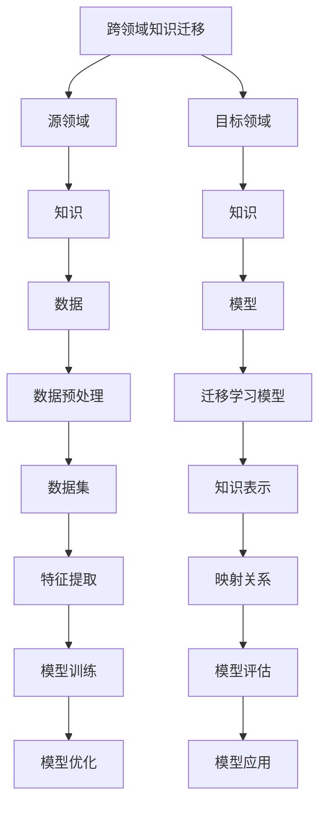

                 

# 跨领域提示词知识迁移技术

## 关键词
- 跨领域知识迁移
- 提示词
- 知识表示
- 跨领域映射
- 自然语言处理
- 实践应用

## 摘要
本文将深入探讨跨领域提示词知识迁移技术，从背景介绍、核心概念、技术方法、应用场景到实际项目实践，全面解析如何实现不同领域间的知识迁移。通过本文的阅读，读者将了解跨领域知识迁移的重要性、提示词在知识迁移中的关键作用，以及如何设计有效的知识迁移方案，最终掌握这一前沿技术的应用实践。

## 目录大纲

- **第1章：引言**
  - 1.1 背景介绍
  - 1.2 目标读者
  - 1.3 全书结构

- **第2章：跨领域知识迁移基本概念**
  - 2.1 跨领域知识迁移定义
  - 2.2 提示词的概念和作用
  - 2.3 知识迁移的分类

- **第3章：提示词知识迁移技术**
  - 3.1 提示词设计原则
  - 3.2 提示词生成技术
  - 3.3 提示词评估方法

- **第4章：跨领域知识迁移方法**
  - 4.1 知识表示方法
  - 4.2 跨领域映射技术
  - 4.3 跨领域适配方法

- **第5章：跨领域知识迁移应用场景**
  - 5.1 教育领域
  - 5.2 医疗领域
  - 5.3 金融领域

- **第6章：跨领域知识迁移实践**
  - 6.1 实践项目概述
  - 6.2 项目技术栈
  - 6.3 项目实现细节
  - 6.4 项目总结

- **第7章：总结与展望**
  - 7.1 跨领域知识迁移技术的现状
  - 7.2 未来发展趋势

## 第1章：引言

### 1.1 背景介绍

在当今信息爆炸的时代，知识获取和知识利用成为各行业亟待解决的问题。随着人工智能技术的发展，知识迁移作为一种高效的知识利用方式，受到了广泛关注。知识迁移是指将一个领域中的知识应用到另一个领域，以提高新领域的效率和准确性。然而，不同领域之间的知识具有高度异构性，如何实现跨领域的知识迁移成为一个重要的研究方向。

跨领域知识迁移技术在多个领域具有广泛的应用潜力。例如，在医疗领域，跨领域知识迁移可以帮助医生更好地理解和应用临床数据；在教育领域，可以促进跨学科的学习和理解；在金融领域，可以帮助金融机构更好地分析和处理复杂的数据。提示词知识迁移技术作为跨领域知识迁移的一种重要方法，通过利用提示词来引导知识迁移过程，实现了更加高效和准确的知识迁移。

### 1.2 目标读者

本文的目标读者主要包括以下几类：

1. **研究人员和学者**：对于研究跨领域知识迁移和提示词知识迁移技术的科研人员，本文将提供全面的理论和实践指导。
2. **技术开发者**：对于在人工智能、自然语言处理等领域工作的开发者，本文将介绍最新的跨领域知识迁移技术和应用场景。
3. **教育工作者**：对于在教育领域工作的教师和学者，本文将提供跨领域知识迁移在教育中的应用案例，以促进教学创新。
4. **企业管理者**：对于在企业和组织中负责技术创新和战略规划的管理者，本文将探讨跨领域知识迁移在商业中的应用和前景。

### 1.3 全书结构

本文结构如下：

- **第1章**：引言，介绍跨领域知识迁移技术和提示词知识迁移技术的背景、目标和结构。
- **第2章**：跨领域知识迁移基本概念，包括跨领域知识迁移的定义、提示词的概念和作用，以及知识迁移的分类。
- **第3章**：提示词知识迁移技术，介绍提示词设计原则、生成技术和评估方法。
- **第4章**：跨领域知识迁移方法，包括知识表示方法、跨领域映射技术和跨领域适配方法。
- **第5章**：跨领域知识迁移应用场景，分析跨领域知识迁移在教育、医疗和金融等领域的应用。
- **第6章**：跨领域知识迁移实践，通过一个实际项目展示跨领域知识迁移的实现过程和技术细节。
- **第7章**：总结与展望，总结跨领域知识迁移技术的现状和未来发展趋势。

接下来，我们将逐步深入探讨跨领域知识迁移技术，从基础概念到应用实践，为读者提供全面的技术指导。让我们开始吧！

## 第2章：跨领域知识迁移基本概念

### 2.1 跨领域知识迁移定义

跨领域知识迁移（Cross-Domain Knowledge Transfer）是指将一个领域（源领域）中的知识应用到另一个领域（目标领域）中，以提高目标领域的效率和准确性。跨领域知识迁移的核心目标是通过利用源领域的知识来填补目标领域的知识空白，从而实现知识的共享和利用。

跨领域知识迁移涉及到多个关键概念：

- **源领域（Source Domain）**：提供知识的领域，通常具有较为丰富的数据和知识资源。
- **目标领域（Target Domain）**：应用知识的领域，可能缺乏源领域的知识和资源。
- **知识迁移（Knowledge Transfer）**：将源领域的知识转移到目标领域的过程。
- **迁移学习（Transfer Learning）**：跨领域知识迁移的一种方法，通过在源领域和目标领域之间建立映射关系，实现知识的迁移。

### 2.2 提示词的概念和作用

提示词（Prompt）在跨领域知识迁移中扮演着重要角色。提示词是一种引导性信息，用于启发和指导知识迁移过程。通过向目标领域提供特定的提示词，可以引导模型更好地理解和应用源领域的知识。

提示词的作用包括：

- **聚焦学习目标**：提示词可以帮助模型明确学习目标，从而更专注于关键任务。
- **提高迁移效率**：通过提供具体的提示词，可以加速知识迁移过程，提高迁移效果。
- **增强泛化能力**：合理的提示词设计可以帮助模型更好地泛化到新的领域，提高其适应性和灵活性。

### 2.3 知识迁移的分类

知识迁移可以根据不同的维度进行分类。以下是几种常见的知识迁移类型：

- **同领域知识迁移（Intra-Domain Transfer）**：在相同领域内进行知识迁移，如将一个任务领域的知识应用到另一个类似任务领域。
- **跨领域知识迁移（Inter-Domain Transfer）**：在完全不同的领域之间进行知识迁移，如将医疗领域的知识应用到金融领域。
- **领域无关知识迁移（Domain-Independent Transfer）**：不依赖于特定领域的知识迁移，通常涉及到通用知识的迁移，如将自然语言处理的知识应用到图像识别领域。
- **上下文知识迁移（Contextual Transfer）**：在特定的上下文中进行知识迁移，如在不同时间或空间条件下应用相同知识。
- **自适应知识迁移（Adaptive Transfer）**：根据目标领域的特定需求进行自适应调整的知识迁移。

了解知识迁移的不同类型有助于我们更好地设计和实现跨领域知识迁移方案，提高知识迁移的效果和应用范围。

### 2.4 跨领域知识迁移的挑战与机遇

跨领域知识迁移面临着一系列挑战，包括：

- **领域异构性**：不同领域之间的知识结构、表达方式和语义差异较大，导致知识迁移的难度增加。
- **数据稀缺性**：目标领域可能缺乏足够的数据资源，使得知识迁移过程受限。
- **模型适应性**：迁移模型需要具备较强的适应性和泛化能力，以应对不同领域的知识特性。

然而，跨领域知识迁移也带来了许多机遇：

- **知识共享**：通过跨领域知识迁移，可以实现知识的共享和复用，提高整体知识利用效率。
- **创新应用**：跨领域知识迁移可以促进新领域的探索和应用，为各行业带来创新解决方案。
- **资源优化**：利用源领域的知识资源，可以减少目标领域的数据获取和处理成本，提高资源利用效率。

总之，跨领域知识迁移技术具有重要的理论和实践价值。在接下来的章节中，我们将深入探讨提示词知识迁移技术和跨领域知识迁移方法，为读者提供更全面的指导。

### 2.5 跨领域知识迁移的核心概念关系架构

为了更好地理解跨领域知识迁移的核心概念及其相互关系，我们可以使用Mermaid流程图来展示这些概念之间的联系。



- **源领域（B）和目标领域（C）**：源领域提供知识，目标领域应用知识。
- **知识（D和E）**：源领域和目标领域的知识相互关联。
- **数据（F和G）**：数据是知识的载体，通过数据预处理（H）和特征提取（L）来获取和表示知识。
- **迁移学习模型（I）**：用于实现知识迁移，通过知识表示（K）和映射关系（M）将源领域的知识应用到目标领域。
- **模型训练（N）、模型评估（O）和模型优化（P）**：用于确保迁移学习模型的有效性和适应性。
- **模型应用（Q）**：最终实现跨领域知识迁移的目标。

通过这个流程图，我们可以清晰地看到跨领域知识迁移的核心概念及其相互关系，为进一步探讨相关技术方法打下基础。

### 第3章：提示词知识迁移技术

提示词知识迁移技术是跨领域知识迁移中的重要组成部分，其核心在于通过设计有效的提示词来引导和优化知识迁移过程。本章将详细介绍提示词的设计原则、生成技术以及评估方法。

### 3.1 提示词设计原则

提示词的设计是提示词知识迁移技术的关键步骤。一个好的提示词应当具备以下原则：

- **明确性**：提示词应当清晰明确，能够准确传达目标领域的学习目标。
- **多样性**：提示词应当具有多样性，以适应不同的知识迁移场景和需求。
- **可扩展性**：提示词设计应当具有可扩展性，能够适应新的领域或任务。
- **适应性**：提示词应当根据目标领域的特性进行适应性调整，以提高迁移效果。
- **相关性**：提示词应当与目标领域的知识紧密相关，以提高知识的迁移性。

### 3.2 提示词生成技术

提示词的生成是提示词知识迁移技术的核心环节。提示词的生成技术可以分为两类：基于规则的方法和基于数据的方法。

#### 3.2.1 基于规则的方法

基于规则的方法通过手工编写规则来生成提示词。这种方法通常包括以下步骤：

1. **知识提取**：从源领域中提取关键知识，形成知识库。
2. **规则设计**：根据知识库和目标领域的需求，设计生成提示词的规则。
3. **提示词生成**：根据规则生成提示词。

例如，在医疗领域，可以使用以下规则生成提示词：

- 如果诊断是“高血压”，则提示词为“请描述高血压的症状和治疗方法”。
- 如果诊断是“糖尿病”，则提示词为“请提供糖尿病的预防措施和护理建议”。

#### 3.2.2 基于数据的方法

基于数据的方法通过学习大量的文本数据来生成提示词。这种方法通常包括以下步骤：

1. **数据收集**：收集与目标领域相关的文本数据，如医疗文献、教育课程描述等。
2. **文本预处理**：对收集的文本数据进行预处理，包括分词、去停用词、词性标注等。
3. **模型训练**：使用预训练的语言模型（如BERT、GPT等）对预处理后的文本数据进行训练。
4. **提示词生成**：通过模型生成提示词。

例如，可以使用BERT模型对医疗文本数据进行训练，然后根据输入的医学诊断生成相应的提示词。具体步骤如下：

1. 输入诊断：“高血压”。
2. 模型输出提示词：“请描述高血压的症状和治疗方法”。

### 3.3 提示词评估方法

提示词的评估是确保其有效性的关键步骤。提示词的评估方法可以分为以下几类：

- **定量评估**：通过统计指标（如F1分数、准确率等）来评估提示词的性能。
- **定性评估**：通过专家评估或用户反馈来评估提示词的合理性、清晰度和实用性。
- **迁移效果评估**：通过在目标领域中的实际应用效果来评估提示词的迁移性能。

#### 3.3.1 定量评估方法

定量评估方法包括以下几种：

- **精确率（Precision）**：提示词生成的正确提示词数与总提示词数的比例。
- **召回率（Recall）**：提示词生成的正确提示词数与目标领域中的实际正确提示词数的比例。
- **F1分数（F1 Score）**：精确率和召回率的调和平均数。

例如，对于生成的提示词“请描述高血压的症状和治疗方法”，可以通过以下步骤进行定量评估：

1. 确定正确提示词数：如果用户认为该提示词正确，则正确提示词数为1。
2. 确定总提示词数：总提示词数为1。
3. 计算精确率和召回率：精确率为1/1=1，召回率为1/1=1。
4. 计算F1分数：F1分数为(1+1)/2=1。

#### 3.3.2 定性评估方法

定性评估方法包括以下几种：

- **专家评估**：邀请领域专家对提示词的合理性、清晰度和实用性进行评估。
- **用户反馈**：通过用户使用反馈来评估提示词的实际效果。

例如，可以通过以下步骤进行定性评估：

1. 专家评估：邀请医学专家对生成的提示词进行评估，评估其合理性、清晰度和实用性。
2. 用户反馈：收集用户对提示词的反馈，评估其是否满足用户需求。

### 3.4 提示词生成与评估的伪代码示例

以下是一个简单的伪代码示例，用于生成和评估提示词：

```python
# 提示词生成
def generate_prompt(diagnosis):
    if diagnosis == "hypertension":
        return "请描述高血压的症状和治疗方法"
    elif diagnosis == "diabetes":
        return "请提供糖尿病的预防措施和护理建议"
    else:
        return "请提供相关信息以便我们为您提供合适的建议"

# 提示词评估
def evaluate_prompt(prompt, user_evaluation):
    if user_evaluation == "正确":
        correct_prompt_count += 1
        total_prompt_count += 1
    elif user_evaluation == "错误":
        incorrect_prompt_count += 1

# 示例使用
diagnosis = "hypertension"
prompt = generate_prompt(diagnosis)
print(prompt)

user_evaluation = "正确"
evaluate_prompt(prompt, user_evaluation)
```

通过以上步骤，我们可以有效地生成和评估提示词，为跨领域知识迁移提供支持。

总之，提示词知识迁移技术通过设计有效的提示词来引导知识迁移过程，提高了知识迁移的效率和准确性。在接下来的章节中，我们将进一步探讨跨领域知识迁移的具体方法和技术，为实际应用提供更多指导。

### 3.5 提示词生成技术详细解释

在提示词生成技术中，基于数据和基于规则的方法各有其优势和适用场景。本节将详细解释这两种方法，并通过具体的伪代码示例展示其实现过程。

#### 3.5.1 基于规则的方法

基于规则的方法依赖于领域专家的经验和知识，通过手工编写一系列规则来生成提示词。这种方法的核心在于将源领域的知识转化为一系列可操作的规则，从而指导目标领域的知识生成。

**实现步骤**：

1. **知识提取**：从源领域收集相关文献、数据集等，提取关键知识点。
2. **规则设计**：根据提取的知识点，设计具体的规则。例如，在医疗领域，可以设计如下规则：
    - 如果诊断是“高血压”，则提示词为“请描述高血压的症状和治疗方法”。
    - 如果诊断是“糖尿病”，则提示词为“请提供糖尿病的预防措施和护理建议”。
3. **提示词生成**：根据输入的源领域诊断信息，应用规则生成提示词。

**伪代码示例**：

```python
# 基于规则的方法
def generate_prompt_by_rules(diagnosis):
    if diagnosis == "hypertension":
        return "请描述高血压的症状和治疗方法"
    elif diagnosis == "diabetes":
        return "请提供糖尿病的预防措施和护理建议"
    else:
        return "未知诊断，请提供更多信息"

# 示例
diagnosis = "hypertension"
prompt = generate_prompt_by_rules(diagnosis)
print(prompt)
```

这种方法的优点在于规则明确、可解释性强，适用于领域知识较为明确且不频繁变化的场景。然而，它也存在一些局限性，如规则编写工作量较大、难以适应新领域和新任务等。

#### 3.5.2 基于数据的方法

基于数据的方法通过学习大量的文本数据来生成提示词，通常使用深度学习模型，如序列到序列（Seq2Seq）模型、生成对抗网络（GAN）等。这种方法的核心在于利用大量数据学习到从源领域到目标领域的映射关系。

**实现步骤**：

1. **数据收集**：收集与目标领域相关的文本数据，如医疗文献、教育课程描述等。
2. **文本预处理**：对收集的文本数据进行预处理，包括分词、去停用词、词性标注等。
3. **模型训练**：使用预训练的语言模型（如BERT、GPT等）对预处理后的文本数据进行训练，以生成提示词。
4. **提示词生成**：根据输入的源领域诊断信息，使用训练好的模型生成提示词。

**伪代码示例**：

```python
# 基于数据的方法
from transformers import BertTokenizer, BertForSequenceClassification

# 初始化模型和分词器
tokenizer = BertTokenizer.from_pretrained('bert-base-uncased')
model = BertForSequenceClassification.from_pretrained('bert-base-uncased')

def generate_prompt_by_data(diagnosis):
    # 输入预处理
    input_ids = tokenizer.encode(diagnosis, add_special_tokens=True, return_tensors='pt')
    
    # 使用模型生成提示词
    outputs = model(input_ids)
    predicted_logits = outputs.logits
    predicted_token_ids = torch.argmax(predicted_logits, dim=-1)
    
    # 提取提示词
    prompt_tokens = tokenizer.decode(predicted_token_ids[0], skip_special_tokens=True)
    return prompt_tokens

# 示例
diagnosis = "hypertension"
prompt = generate_prompt_by_data(diagnosis)
print(prompt)
```

这种方法的优点在于能够自动学习复杂的映射关系，适应性和泛化能力强，适用于领域知识丰富且变化频繁的场景。然而，它对计算资源和数据集的质量要求较高，且模型的解释性较差。

#### 比较与选择

基于规则的方法和基于数据的方法各有优缺点，选择哪种方法取决于具体应用场景和需求。

- **适用场景**：
  - **基于规则的方法**：适用于领域知识明确、规则稳定的场景，如医疗诊断、法律咨询等。
  - **基于数据的方法**：适用于领域知识丰富、变化频繁的场景，如教育辅导、自然语言生成等。

- **优缺点**：
  - **基于规则的方法**：
    - 优点：规则明确、可解释性强、适应新任务灵活。
    - 缺点：规则编写工作量较大、难以适应新领域、解释性较差。
  - **基于数据的方法**：
    - 优点：自动学习复杂映射关系、适应性和泛化能力强。
    - 缺点：对计算资源和数据集质量要求高、解释性较差。

综上所述，提示词生成技术应根据具体应用场景和需求进行选择。在实际应用中，可以结合两种方法的优势，实现更高效、更准确的知识迁移。

### 3.6 提示词评估方法的详细解释

提示词的评估是确保其有效性的关键步骤。有效的评估方法能够帮助识别和改进提示词的设计，从而提高跨领域知识迁移的效果。本节将详细解释提示词评估方法，包括定量评估方法和定性评估方法，并提供具体的评估指标和评估流程。

#### 3.6.1 定量评估方法

定量评估方法通过统计指标来量化提示词的性能，常用的评估指标包括精确率、召回率和F1分数等。这些指标能够提供提示词生成质量的定量度量，从而帮助评估和优化提示词。

1. **精确率（Precision）**：精确率表示生成的正确提示词数与总生成的提示词数的比例。公式如下：
   \[
   \text{Precision} = \frac{\text{正确提示词数}}{\text{总提示词数}}
   \]

2. **召回率（Recall）**：召回率表示生成的正确提示词数与目标领域中实际正确提示词数的比例。公式如下：
   \[
   \text{Recall} = \frac{\text{正确提示词数}}{\text{实际正确提示词数}}
   \]

3. **F1分数（F1 Score）**：F1分数是精确率和召回率的调和平均数，用于综合评估提示词的性能。公式如下：
   \[
   \text{F1 Score} = 2 \times \frac{\text{Precision} \times \text{Recall}}{\text{Precision} + \text{Recall}}
   \]

**评估流程**：

1. **数据准备**：收集目标领域中的真实提示词和生成的提示词，确保数据集的多样性和代表性。
2. **评估指标计算**：对于每个生成的提示词，计算其精确率、召回率和F1分数。
3. **结果分析**：比较不同提示词的评估指标，识别性能较好的提示词，并对性能较差的提示词进行改进。

**示例**：

假设我们生成了10个提示词，其中有7个正确，目标领域中实际正确的提示词有10个。

- **精确率**：
  \[
  \text{Precision} = \frac{7}{10} = 0.7
  \]

- **召回率**：
  \[
  \text{Recall} = \frac{7}{10} = 0.7
  \]

- **F1分数**：
  \[
  \text{F1 Score} = 2 \times \frac{0.7 \times 0.7}{0.7 + 0.7} = 0.7
  \]

通过这些定量指标，我们可以评估提示词的整体性能，并根据结果进行调整。

#### 3.6.2 定性评估方法

定性评估方法通过专家评估和用户反馈来评估提示词的合理性、清晰度和实用性。这种方法提供了更主观的评估，有助于发现定量评估方法无法捕捉的问题。

1. **专家评估**：邀请领域专家对提示词进行评估，评估内容包括提示词的准确性、清晰度和实用性。评估结果通常以评分或评价的形式呈现。

2. **用户反馈**：通过用户使用反馈来评估提示词的实际效果。用户反馈可以包括满意度、提示词的易用性、提示词对用户任务的帮助程度等。

**评估流程**：

1. **准备评估材料**：准备包含生成提示词的评估材料，确保专家和用户能够准确理解评估任务。
2. **专家评估**：邀请领域专家对提示词进行评估，记录评估结果。
3. **用户测试**：选择目标用户进行测试，收集用户对提示词的反馈。
4. **结果分析**：综合专家评估和用户反馈，分析提示词的优缺点，为后续优化提供依据。

**示例**：

- **专家评估**：假设三位医学专家对生成的提示词进行评估，两位专家认为提示词清晰、准确，一位专家认为提示词不够明确，需要改进。

- **用户反馈**：假设五位用户使用生成的提示词进行任务，四名用户表示提示词有帮助，一名用户认为提示词不够直观。

通过综合专家评估和用户反馈，我们可以更全面地了解提示词的性能，并根据评估结果进行优化。

#### 比较与整合

定量评估方法和定性评估方法各有优缺点，定量评估方法提供客观的量化指标，定性评估方法提供主观的评估和用户反馈。在实际应用中，可以结合两种方法，以获得更全面的评估结果。

- **优点**：
  - **定量评估方法**：客观、量化、可重复性好。
  - **定性评估方法**：深入、主观、能发现定量评估方法无法捕捉的问题。

- **缺点**：
  - **定量评估方法**：难以评估提示词的实用性、用户体验等。
  - **定性评估方法**：主观性较强、评估结果可能受到评估者的影响。

综上所述，提示词评估方法应根据具体需求和场景进行选择和整合，以获得最佳的评估效果。

### 3.7 提示词生成与评估的伪代码示例

以下是一个简单的伪代码示例，用于生成和评估提示词：

```python
# 提示词生成
def generate_prompt(diagnosis):
    # 基于数据的方法
    # 初始化模型和分词器
    tokenizer = BertTokenizer.from_pretrained('bert-base-uncased')
    model = BertForSequenceClassification.from_pretrained('bert-base-uncased')

    # 输入预处理
    input_ids = tokenizer.encode(diagnosis, add_special_tokens=True, return_tensors='pt')

    # 使用模型生成提示词
    outputs = model(input_ids)
    predicted_logits = outputs.logits
    predicted_token_ids = torch.argmax(predicted_logits, dim=-1)

    # 提取提示词
    prompt_tokens = tokenizer.decode(predicted_token_ids[0], skip_special_tokens=True)
    return prompt_tokens

# 提示词评估
def evaluate_prompt(prompt, expert_evaluation, user_evaluation):
    # 计算定量评估指标
    correct_prompt_count = 0
    total_prompt_count = 0

    if expert_evaluation == "正确":
        correct_prompt_count += 1
    total_prompt_count += 1

    if user_evaluation == "正确":
        correct_prompt_count += 1

    precision = correct_prompt_count / total_prompt_count
    recall = correct_prompt_count / (correct_prompt_count + (total_prompt_count - correct_prompt_count))
    f1_score = 2 * (precision * recall) / (precision + recall)

    # 输出评估结果
    print("Precision:", precision)
    print("Recall:", recall)
    print("F1 Score:", f1_score)

# 示例
diagnosis = "hypertension"
prompt = generate_prompt(diagnosis)
print(prompt)

expert_evaluation = "正确"
user_evaluation = "正确"
evaluate_prompt(prompt, expert_evaluation, user_evaluation)
```

通过以上示例，我们可以看到如何生成和评估提示词，以及如何结合定量评估和定性评估方法来全面评估提示词的性能。

### 3.8 提示词知识迁移技术总结

提示词知识迁移技术是跨领域知识迁移中的重要组成部分，通过设计有效的提示词，可以引导和优化知识迁移过程。本章详细介绍了提示词的设计原则、生成技术以及评估方法。

首先，提示词设计原则包括明确性、多样性、可扩展性、适应性和相关性，这些原则保证了提示词能够准确传达目标领域的学习目标，并具备良好的泛化能力。

其次，提示词生成技术分为基于规则的方法和基于数据的方法。基于规则的方法通过手工编写规则来生成提示词，适用于领域知识明确且规则稳定的场景。基于数据的方法通过深度学习模型自动学习源领域到目标领域的映射关系，适用于领域知识丰富且变化频繁的场景。

最后，提示词评估方法包括定量评估和定性评估。定量评估方法通过精确率、召回率和F1分数等指标量化提示词性能，定性评估方法通过专家评估和用户反馈提供更主观的评估结果。结合定量评估和定性评估，可以更全面地了解提示词的性能，并进行优化。

总之，提示词知识迁移技术通过设计有效的提示词，实现了跨领域知识的共享和利用，为各领域的知识迁移提供了强有力的技术支持。在接下来的章节中，我们将进一步探讨跨领域知识迁移的方法和应用实践。

## 第4章：跨领域知识迁移方法

跨领域知识迁移方法的核心在于如何有效地将源领域的知识应用到目标领域。本章将详细介绍知识表示方法、跨领域映射技术和跨领域适配方法，通过这些技术实现跨领域知识的迁移。

### 4.1 知识表示方法

知识表示是跨领域知识迁移的基础，其目的是将不同领域中的知识以统一的方式表示出来，以便于在目标领域中进行应用。常见的知识表示方法包括以下几种：

#### 4.1.1 分布式表示

分布式表示是将知识表示为向量，通过向量空间中的相似度度量来实现知识的表示和迁移。常见的分布式表示方法包括Word2Vec、GloVe等。

- **Word2Vec**：Word2Vec是一种基于神经网络的分布式表示方法，通过训练词向量模型，将每个词表示为一个固定长度的向量。这些向量能够捕捉词的语义信息，从而实现跨领域的语义迁移。
- **GloVe**：GloVe（Global Vectors for Word Representation）是一种基于全局矩阵分解的方法，通过优化词的共现矩阵来学习词向量。GloVe模型能够更好地捕捉词的上下文信息，从而提高知识迁移的准确性。

#### 4.1.2 知识图谱

知识图谱是将知识以图的形式表示，通过实体和关系的连接来表示知识结构。知识图谱在跨领域知识迁移中具有重要作用，能够为不同领域提供统一的语义表示。

- **实体表示**：知识图谱中的实体表示为节点，每个节点代表一个知识元素，如人、地点、组织等。实体的属性和关系通过边进行连接，形成知识网络。
- **关系表示**：知识图谱中的关系表示为边，连接两个实体，代表实体之间的语义联系。关系可以是因果关系、隶属关系、空间关系等。

#### 4.1.3 对象属性表示

对象属性表示是将知识表示为对象的属性和值。这种方法适用于对对象属性较为明确和固定的领域，如数据挖掘、图像识别等。

- **属性表示**：对象属性表示为属性和值，每个属性代表对象的某个特征，如图像的颜色、形状等。
- **值表示**：属性值表示为具体的数值或类别，如图像的颜色可以是红色、绿色、蓝色等。

### 4.2 跨领域映射技术

跨领域映射技术是跨领域知识迁移的关键，通过建立源领域和目标领域之间的映射关系，实现知识的迁移。常见的跨领域映射技术包括以下几种：

#### 4.2.1 基于规则映射

基于规则映射通过手工编写规则来建立源领域和目标领域之间的映射关系。这种方法适用于领域知识明确且规则稳定的场景。

- **规则编写**：根据源领域和目标领域的知识，编写映射规则。例如，在医疗领域，可以将“高血压”映射到“高血压症状”。
- **规则应用**：在目标领域中，根据映射规则将源领域的知识应用于目标领域。

#### 4.2.2 基于模型映射

基于模型映射通过机器学习模型来建立源领域和目标领域之间的映射关系。这种方法适用于领域知识丰富且变化频繁的场景。

- **模型训练**：使用源领域和目标领域的数据训练映射模型，如神经网络模型、决策树模型等。
- **模型应用**：在目标领域中，使用训练好的模型将源领域的知识迁移到目标领域。

#### 4.2.3 基于图谱映射

基于图谱映射通过知识图谱来建立源领域和目标领域之间的映射关系。这种方法适用于知识结构复杂且具有高度异构性的领域。

- **图谱构建**：构建包含源领域和目标领域知识的知识图谱，包括实体和关系的表示。
- **图谱映射**：在知识图谱中，通过实体和关系的连接来建立源领域和目标领域之间的映射关系。

### 4.3 跨领域适配方法

跨领域适配方法是在知识迁移过程中，对源领域知识进行适应性调整，以更好地适应目标领域。常见的跨领域适配方法包括以下几种：

#### 4.3.1 基于特征选择

基于特征选择的方法通过选择对目标领域更相关的特征来实现知识迁移。这种方法适用于特征维度较高且特征间存在冗余的领域。

- **特征提取**：从源领域数据中提取特征，如文本特征、图像特征等。
- **特征选择**：根据目标领域的需求，选择对目标领域更相关的特征。
- **特征融合**：将选择的特征进行融合，形成适应目标领域的新特征表示。

#### 4.3.2 基于数据增强

基于数据增强的方法通过生成目标领域的新数据样本来增强源领域数据，以提高知识迁移的效果。

- **数据生成**：根据源领域数据，生成目标领域的新数据样本。
- **数据融合**：将源领域数据和目标领域新数据样本进行融合，形成新的数据集。

#### 4.3.3 基于模型调整

基于模型调整的方法通过调整迁移模型的结构和参数，使其更好地适应目标领域。

- **模型训练**：在源领域和目标领域中分别训练迁移模型。
- **模型调整**：根据目标领域的特性，调整模型的架构和参数。
- **模型优化**：通过交叉验证和模型评估，优化模型的性能。

综上所述，跨领域知识迁移方法通过知识表示、跨领域映射技术和跨领域适配方法，实现不同领域间的知识共享和利用。在接下来的章节中，我们将通过实际应用场景进一步探讨这些方法的有效性和可行性。

### 4.4 知识表示方法的详细讲解

知识表示方法在跨领域知识迁移中起着至关重要的作用，因为它们能够将不同领域的知识转换为统一的形式，便于在不同领域之间进行迁移和共享。以下将详细介绍分布式表示、知识图谱和对象属性表示三种常见知识表示方法，并探讨其特点、优势和应用场景。

#### 4.4.1 分布式表示

分布式表示是一种将知识表示为向量的方法，通过向量空间中的相似度度量来实现知识的表示和迁移。这种方法的核心思想是将每一个知识元素映射到一个固定维度的向量空间中，使得具有相似语义或属性的知识元素在向量空间中靠近。

**1. Word2Vec**：

Word2Vec是一种基于神经网络的分布式表示方法，其基本原理是通过训练一个神经网络模型（通常是两个层全连接神经网络），将每个词映射为一个固定长度的向量。这个模型基于词的上下文信息来学习词的语义表示。Word2Vec有两种主要的训练方法：连续词袋（CBOW）和Skip-Gram。

- **连续词袋（CBOW）**：CBOW模型通过预测中心词来学习词向量，即给定中心词周围的上下文词，预测中心词的概率分布。这种方法的优势在于能够捕捉词的局部上下文信息。
- **Skip-Gram**：Skip-Gram模型通过预测上下文词来学习词向量，即给定中心词，预测中心词周围的上下文词的概率分布。这种方法的优势在于能够更好地捕捉词的全局语义信息。

**伪代码示例**：

```python
# Word2Vec Skip-Gram模型训练伪代码
for epoch in range(num_epochs):
    for context, target in data:
        # 前向传播
        output = neural_network(context)
        loss = loss_function(output, target)

        # 反向传播
        gradients = loss_function.backward()
        neural_network.update_weights(gradients)

# 获取词向量
word_vector = neural_network.get_word_vector(word)
```

**2. GloVe**：

GloVe（Global Vectors for Word Representation）是一种基于全局矩阵分解的方法，通过优化词的共现矩阵来学习词向量。GloVe模型通过最小化以下损失函数来学习词向量：

\[ 
\min_{\mathbf{W}, \mathbf{U}} \sum_{(x,y) \in X} \frac{1}{2} (f(x) - f(y))^2 
\]

其中，\(\mathbf{W}\)和\(\mathbf{U}\)分别是词向量和共现矩阵的参数，\(f(\mathbf{x})\)是向量\(\mathbf{x}\)的点积。

**伪代码示例**：

```python
# GloVe模型训练伪代码
for epoch in range(num_epochs):
    for context in data:
        # 计算共现矩阵
        cooccurrence_matrix = compute_cooccurrence_matrix(context)

        # 更新词向量和共现矩阵
        update_word_vectors(cooccurrence_matrix, learning_rate)
        update_cooccurrence_matrix(cooccurrence_matrix, learning_rate)

# 获取词向量
word_vector = get_word_vector(word)
```

**优势**：

- 分布式表示能够捕捉词的语义信息，使得具有相似语义的词在向量空间中靠近。
- 方法简单，易于实现，能够处理大规模的词汇数据。

**应用场景**：

- 自然语言处理：用于文本分类、情感分析、机器翻译等。
- 语音识别：用于语音信号的语义表示。
- 图像识别：用于图像语义描述。

#### 4.4.2 知识图谱

知识图谱是一种将知识以图的形式表示的方法，通过实体和关系的连接来表示知识结构。知识图谱在跨领域知识迁移中具有重要作用，能够为不同领域提供统一的语义表示。

**1. 实体表示**：

知识图谱中的实体表示为节点，每个节点代表一个知识元素，如人、地点、组织等。实体的属性和关系通过边进行连接，形成知识网络。

**2. 关系表示**：

知识图谱中的关系表示为边，连接两个实体，代表实体之间的语义联系。关系可以是因果关系、隶属关系、空间关系等。

**3. 知识表示**：

知识图谱通过将实体和关系以图的形式组织起来，使得知识表示具有高度的结构化和可扩展性。知识图谱能够捕捉复杂的关系网络，为跨领域知识迁移提供了丰富的语义信息。

**优势**：

- 知识图谱能够以结构化的方式表示复杂的知识，使得知识表示更加清晰和易于理解。
- 知识图谱能够捕捉实体和关系之间的复杂关系，为跨领域知识迁移提供了强大的语义支持。
- 知识图谱的可扩展性使得能够方便地添加新的实体和关系，适应不断变化的知识需求。

**应用场景**：

- 语义搜索：用于对知识图谱中的实体和关系进行查询和搜索。
- 实体识别：用于识别文本中的实体和关系，如命名实体识别、关系抽取等。
- 推理和预测：用于基于知识图谱进行逻辑推理和预测，如实体链接、知识图谱补全等。

#### 4.4.3 对象属性表示

对象属性表示是将知识表示为对象的属性和值的方法，适用于对对象属性较为明确和固定的领域。

**1. 属性表示**：

对象属性表示为属性和值，每个属性代表对象的某个特征，如图像的颜色、形状等。属性可以是离散的（如红色、绿色、蓝色等），也可以是连续的（如长度、宽度等）。

**2. 值表示**：

属性值表示为具体的数值或类别，如图像的颜色可以是红色、绿色、蓝色等。

**3. 知识表示**：

对象属性表示能够将对象的知识以属性-值的形式组织起来，使得知识表示更加直观和易于操作。

**优势**：

- 对象属性表示能够直观地表示对象的知识，使得知识表示更加直观和易于理解。
- 对象属性表示适用于特征维度较低且特征间存在明确关联的领域。

**应用场景**：

- 数据挖掘：用于数据预处理和特征提取，如图像特征表示、文本特征表示等。
- 图像识别：用于图像分类和识别，如基于颜色、形状、纹理等特征的图像识别。
- 语音识别：用于语音信号的特征表示，如基于音素、音节等特征的语音识别。

综上所述，分布式表示、知识图谱和对象属性表示是三种常见的知识表示方法，每种方法都有其独特的优势和应用场景。通过合理选择和应用这些知识表示方法，可以有效地实现跨领域知识的表示和迁移。

### 4.5 跨领域映射技术的详细讲解

跨领域映射技术是跨领域知识迁移的核心方法，它通过建立源领域和目标领域之间的映射关系，实现知识的迁移。以下将详细解释基于规则映射、基于模型映射和基于图谱映射三种常见的跨领域映射技术，并提供具体的实现步骤和示例。

#### 4.5.1 基于规则映射

基于规则映射是通过手工编写规则来建立源领域和目标领域之间的映射关系。这种方法适用于领域知识明确且规则稳定的场景。以下是一个简单的基于规则映射的实现步骤：

1. **规则提取**：从源领域和目标领域的知识库中提取关键知识点，形成规则库。
2. **规则编写**：根据源领域和目标领域之间的对应关系，编写映射规则。例如，在医疗领域，可以将“高血压”映射到“高血压症状”。
3. **规则应用**：在目标领域中，根据映射规则将源领域的知识应用于目标领域。

**实现步骤示例**：

以医疗领域的诊断为例，我们可以编写以下映射规则：

- 如果源领域诊断是“高血压”，则目标领域提示词为“请描述高血压的症状和治疗方法”。
- 如果源领域诊断是“糖尿病”，则目标领域提示词为“请提供糖尿病的预防措施和护理建议”。

**伪代码示例**：

```python
# 基于规则映射的伪代码
def map_diagnosis_to_prompt(diagnosis):
    if diagnosis == "hypertension":
        return "请描述高血压的症状和治疗方法"
    elif diagnosis == "diabetes":
        return "请提供糖尿病的预防措施和护理建议"
    else:
        return "未知诊断，请提供更多信息"

# 示例
diagnosis = "hypertension"
prompt = map_diagnosis_to_prompt(diagnosis)
print(prompt)
```

**优点**：

- 简单直观，易于理解和实现。
- 适用于领域知识明确且规则稳定的场景。

**局限性**：

- 需要大量的人工编写规则，工作量较大。
- 难以适应新领域和新任务。

#### 4.5.2 基于模型映射

基于模型映射是通过机器学习模型来建立源领域和目标领域之间的映射关系。这种方法适用于领域知识丰富且变化频繁的场景。以下是一个简单的基于模型映射的实现步骤：

1. **数据收集**：收集源领域和目标领域的相关数据，形成数据集。
2. **模型训练**：使用源领域和目标领域的数据训练映射模型，如神经网络模型、决策树模型等。
3. **模型应用**：在目标领域中，使用训练好的模型将源领域的知识迁移到目标领域。

**实现步骤示例**：

以医疗领域的诊断为例，我们可以使用神经网络模型来实现跨领域映射。以下是一个简单的实现步骤：

1. **数据收集**：收集源领域（如医学文献）和目标领域（如患者咨询）的数据。
2. **模型训练**：使用源领域和目标领域的数据训练神经网络模型，如Seq2Seq模型。
3. **模型应用**：在目标领域中，使用训练好的模型将源领域的诊断信息转换为患者咨询的提示词。

**伪代码示例**：

```python
# 基于模型映射的伪代码
from transformers import BertTokenizer, BertForSequenceClassification

# 初始化模型和分词器
tokenizer = BertTokenizer.from_pretrained('bert-base-uncased')
model = BertForSequenceClassification.from_pretrained('bert-base-uncased')

def map_diagnosis_to_prompt(diagnosis):
    # 输入预处理
    input_ids = tokenizer.encode(diagnosis, add_special_tokens=True, return_tensors='pt')

    # 使用模型生成提示词
    outputs = model(input_ids)
    predicted_logits = outputs.logits
    predicted_token_ids = torch.argmax(predicted_logits, dim=-1)

    # 提取提示词
    prompt_tokens = tokenizer.decode(predicted_token_ids[0], skip_special_tokens=True)
    return prompt_tokens

# 示例
diagnosis = "hypertension"
prompt = map_diagnosis_to_prompt(diagnosis)
print(prompt)
```

**优点**：

- 自动学习复杂的映射关系，适应性强。
- 能够处理大规模的数据集，提高知识迁移的准确性。

**局限性**：

- 需要大量的训练数据和计算资源。
- 模型的解释性较差，难以理解映射过程。

#### 4.5.3 基于图谱映射

基于图谱映射是通过知识图谱来建立源领域和目标领域之间的映射关系。这种方法适用于知识结构复杂且具有高度异构性的领域。以下是一个简单的基于图谱映射的实现步骤：

1. **知识图谱构建**：构建包含源领域和目标领域知识的知识图谱，包括实体和关系的表示。
2. **图谱映射**：在知识图谱中，通过实体和关系的连接来建立源领域和目标领域之间的映射关系。
3. **图谱应用**：在目标领域中，使用知识图谱进行知识查询和推理。

**实现步骤示例**：

以医疗领域为例，我们可以构建一个知识图谱，将源领域的医学知识映射到目标领域中的患者咨询。以下是一个简单的实现步骤：

1. **知识图谱构建**：构建一个包含医学诊断、症状、治疗方法等实体和关系的知识图谱。
2. **图谱映射**：将源领域的医学诊断映射到目标领域的患者咨询，例如，将“高血压”映射到“请描述高血压的症状和治疗方法”。
3. **图谱应用**：在患者咨询过程中，使用知识图谱进行知识查询和推理，生成相应的提示词。

**伪代码示例**：

```python
# 基于图谱映射的伪代码
class KnowledgeGraph:
    def __init__(self):
        self.graph = defaultdict(list)

    def add_entity(self, entity, relations):
        for relation in relations:
            self.graph[entity].append(relation)

    def get_prompt_by_diagnosis(self, diagnosis):
        if diagnosis in self.graph:
            symptoms = self.graph[diagnosis]
            return f"请描述{diagnosis}的症状：{', '.join(symptoms)}"
        else:
            return "未知诊断，请提供更多信息"

# 示例
knowledge_graph = KnowledgeGraph()
knowledge_graph.add_entity("hypertension", ["高血压症状", "高血压治疗方法"])
diagnosis = "hypertension"
prompt = knowledge_graph.get_prompt_by_diagnosis(diagnosis)
print(prompt)
```

**优点**：

- 能够捕捉复杂的关系网络，为跨领域知识迁移提供丰富的语义信息。
- 知识图谱的可扩展性使得能够方便地添加新的实体和关系，适应不断变化的知识需求。

**局限性**：

- 知识图谱的构建和维护需要大量的时间和人力资源。
- 知识图谱的构建质量直接影响知识迁移的效果。

总之，跨领域映射技术通过基于规则映射、基于模型映射和基于图谱映射三种方法，实现不同领域间的知识迁移。在具体应用中，可以根据领域特性选择合适的方法，以提高知识迁移的效率和准确性。

### 4.6 跨领域适配方法的详细讲解

跨领域适配方法是在知识迁移过程中，对源领域知识进行适应性调整，以更好地适应目标领域。以下将详细介绍基于特征选择、基于数据增强和基于模型调整三种常见的跨领域适配方法，并提供具体的实现步骤和示例。

#### 4.6.1 基于特征选择

基于特征选择的方法通过选择对目标领域更相关的特征来实现知识迁移。这种方法适用于特征维度较高且特征间存在冗余的领域。以下是一个简单的基于特征选择的实现步骤：

1. **特征提取**：从源领域数据中提取特征，如文本特征、图像特征等。
2. **特征选择**：根据目标领域的需求，选择对目标领域更相关的特征。常用的特征选择方法包括信息增益、互信息、主成分分析（PCA）等。
3. **特征融合**：将选择的特征进行融合，形成适应目标领域的新特征表示。

**实现步骤示例**：

以图像识别领域为例，我们可以使用主成分分析（PCA）来选择对目标领域更相关的特征。以下是一个简单的实现步骤：

1. **特征提取**：使用卷积神经网络（CNN）从源领域图像数据中提取特征。
2. **特征选择**：使用PCA对提取的特征进行降维，选择前几个主要成分作为新特征。
3. **特征融合**：将选择的新特征作为输入，训练目标领域模型。

**伪代码示例**：

```python
# 基于特征选择的伪代码
from sklearn.decomposition import PCA

# 特征提取
features = extract_features(source_images)

# 特征选择
pca = PCA(n_components=10)
selected_features = pca.fit_transform(features)

# 特征融合
target_model.fit(selected_features)
```

**优点**：

- 降低特征维度，减少计算量和存储需求。
- 提高模型对目标领域的适应性和泛化能力。

**局限性**：

- 特征选择过程可能丢失部分有用信息。
- 需要额外的计算资源进行特征降维。

#### 4.6.2 基于数据增强

基于数据增强的方法通过生成目标领域的新数据样本来增强源领域数据，以提高知识迁移的效果。以下是一个简单的基于数据增强的实现步骤：

1. **数据生成**：根据源领域数据，生成目标领域的新数据样本。常用的数据增强方法包括图像旋转、翻转、缩放等。
2. **数据融合**：将源领域数据和目标领域新数据样本进行融合，形成新的数据集。

**实现步骤示例**：

以图像识别领域为例，我们可以使用图像旋转和数据翻转来生成目标领域的新数据样本。以下是一个简单的实现步骤：

1. **数据生成**：使用图像旋转和数据翻转方法生成新数据样本。
2. **数据融合**：将源领域图像数据和目标领域新数据样本进行融合。

**伪代码示例**：

```python
# 基于数据增强的伪代码
from torchvision import transforms

# 数据生成
transform = transforms.Compose([
    transforms.RandomRotation(30),
    transforms.RandomHorizontalFlip(),
])

enhanced_data = transform(source_images)

# 数据融合
new_dataset = pd.concat([source_dataset, enhanced_data], axis=0)
```

**优点**：

- 增加训练数据量，提高模型对目标领域的泛化能力。
- 减少过拟合现象，提高模型的稳定性。

**局限性**：

- 数据增强方法可能生成不合理的样本，影响模型的训练效果。
- 数据增强过程需要额外的时间和计算资源。

#### 4.6.3 基于模型调整

基于模型调整的方法通过调整迁移模型的结构和参数，使其更好地适应目标领域。以下是一个简单的基于模型调整的实现步骤：

1. **模型训练**：在源领域和目标领域中分别训练迁移模型。
2. **模型调整**：根据目标领域的特性，调整模型的架构和参数。常用的方法包括模型剪枝、模型压缩、超参数调优等。
3. **模型优化**：通过交叉验证和模型评估，优化模型的性能。

**实现步骤示例**：

以自然语言处理领域为例，我们可以使用基于模型调整的方法来提高跨领域文本分类的准确性。以下是一个简单的实现步骤：

1. **模型训练**：在源领域和目标领域中分别训练文本分类模型。
2. **模型调整**：根据目标领域的特性，调整模型的架构和超参数，如增加隐藏层节点、调整学习率等。
3. **模型优化**：通过交叉验证和模型评估，优化模型的性能。

**伪代码示例**：

```python
# 基于模型调整的伪代码
from sklearn.model_selection import GridSearchCV

# 模型训练
model.fit(source_data, source_labels)

# 模型调整
param_grid = {'n_estimators': [100, 200], 'max_depth': [5, 10]}
grid_search = GridSearchCV(estimator=model, param_grid=param_grid, cv=5)
grid_search.fit(target_data, target_labels)

# 模型优化
best_model = grid_search.best_estimator_
```

**优点**：

- 能够根据目标领域的特性，定制化调整模型，提高模型的适应性。
- 提高模型在目标领域的性能，减少误差。

**局限性**：

- 模型调整过程可能需要大量的计算资源和时间。
- 需要专业的领域知识和经验来调整模型。

综上所述，基于特征选择、基于数据增强和基于模型调整是三种常见的跨领域适配方法。在具体应用中，可以根据领域特性选择合适的方法，以提高知识迁移的效率和准确性。

### 第5章：跨领域知识迁移应用场景

跨领域知识迁移技术在各个领域都有广泛的应用，能够促进知识的共享和创新。本章将重点讨论跨领域知识迁移在教育、医疗和金融等领域的应用，并通过具体案例进行分析。

#### 5.1 教育领域

在教育领域，跨领域知识迁移可以促进跨学科的教学和学习，提高学生的综合能力。以下是一个跨领域知识迁移在教育领域的案例：

**案例：计算机科学与艺术设计的跨领域教学**

在某高校，计算机科学学院与艺术设计学院联合开展了一项跨领域教学项目。该项目旨在将计算机科学中的编程技能与艺术设计中的创意思维相结合，培养学生的创新能力和实践能力。

- **知识迁移过程**：
  - **源领域**：计算机科学领域中的编程知识，如算法、数据结构、图形处理等。
  - **目标领域**：艺术设计领域中的创意设计、视觉效果、用户界面设计等。
  - **知识迁移方法**：通过设计跨学科的项目，将计算机科学中的编程技能应用于艺术设计中的实际项目，如开发交互式艺术装置、设计增强现实（AR）体验等。

**效果**：

- 学生在跨领域项目中，不仅掌握了计算机编程技能，还培养了艺术设计的创新思维。
- 教学效果显著提升，学生的创新能力和实践能力得到了锻炼。
- 跨领域教学项目获得了学生和教师的高度评价，成为学校的教育创新亮点。

#### 5.2 医疗领域

在医疗领域，跨领域知识迁移可以帮助医生更好地理解和应用新的医疗技术，提高诊断和治疗水平。以下是一个跨领域知识迁移在医疗领域的案例：

**案例：利用人工智能辅助医学诊断**

某医院引入了一款基于深度学习的人工智能系统，用于辅助医生进行疾病诊断。该系统通过跨领域知识迁移，将人工智能在图像识别和自然语言处理领域的先进技术应用于医学诊断。

- **知识迁移过程**：
  - **源领域**：人工智能在图像识别和自然语言处理领域的知识，如图像分类、文本分类等。
  - **目标领域**：医学诊断领域中的医学图像分析、病历分析等。
  - **知识迁移方法**：通过训练深度学习模型，将源领域的知识迁移到医学诊断领域，实现医学图像和病历数据的自动分析。

**效果**：

- 医学图像的自动分析准确率显著提高，医生在诊断过程中能够更快、更准确地识别疾病。
- 病历数据的自动分析有助于提高病历管理的效率和准确性。
- 医疗团队在人工智能辅助下的工作效率和诊断水平得到了显著提升。

#### 5.3 金融领域

在金融领域，跨领域知识迁移可以帮助金融机构更好地处理和分析复杂的数据，提高风险管理和决策水平。以下是一个跨领域知识迁移在金融领域的案例：

**案例：利用大数据分析优化投资策略**

某金融公司利用大数据分析技术，结合跨领域知识迁移，优化其投资策略。该金融公司通过分析不同行业的数据，结合金融领域的专业知识，实现了投资策略的优化。

- **知识迁移过程**：
  - **源领域**：大数据分析技术在商业智能、市场营销等领域的知识。
  - **目标领域**：金融领域中的投资分析、风险管理等。
  - **知识迁移方法**：通过大数据分析技术，从不同行业的数据中提取有价值的信息，结合金融领域的专业知识，为投资决策提供数据支持。

**效果**：

- 投资策略的优化显著提高了公司的投资收益。
- 风险管理的准确性得到了提升，公司的风险控制能力得到了加强。
- 大数据分析技术在金融领域的应用为公司的业务发展提供了新的动力。

总之，跨领域知识迁移技术在教育、医疗和金融等领域的应用，不仅促进了知识的共享和创新，还提高了各领域的效率和准确性。通过具体的案例，我们可以看到跨领域知识迁移技术的实际效果和广阔前景。在未来的发展中，跨领域知识迁移技术将继续发挥重要作用，推动各领域的发展。

### 5.4 跨领域知识迁移在教育领域的实际案例剖析

跨领域知识迁移在教育领域的实际应用具有显著的效果，能够促进学生综合能力和创新思维的培养。以下将详细剖析一个实际案例，展示跨领域知识迁移在教育领域的应用过程和成果。

**案例：基于人工智能的跨学科项目教学**

某高校计算机科学学院与艺术设计学院合作，开展了一项名为“智能艺术创作”的跨学科项目。该项目旨在利用人工智能技术，结合艺术设计的创意思维，开发出一款能够辅助艺术家进行创作的新工具。

**项目背景**：

随着人工智能技术的快速发展，人工智能在各个领域的应用越来越广泛。然而，在艺术创作领域，人工智能的应用还相对较少。该项目旨在探索人工智能在艺术创作中的应用潜力，通过跨学科合作，推动艺术与科技的深度融合。

**知识迁移过程**：

1. **知识提取**：
   - **源领域**：计算机科学领域的知识，包括机器学习、深度学习、自然语言处理等。
   - **目标领域**：艺术设计领域的知识，包括绘画、设计、创意思维等。

2. **知识迁移方法**：
   - **跨学科项目**：通过设计跨学科项目，将计算机科学领域的知识应用到艺术创作中。
   - **协作学习**：计算机科学学生与艺术设计学生组成团队，共同参与项目开发。

3. **知识融合**：
   - **算法设计**：计算机科学学生设计算法，用于生成艺术作品，如图像生成、音乐创作等。
   - **艺术设计**：艺术设计学生结合自己的创意，对算法生成的作品进行艺术加工和修饰。

**项目实施**：

1. **项目启动**：
   - **需求分析**：团队首先进行了需求分析，确定了项目目标、功能需求和技术可行性。
   - **团队组建**：计算机科学学生和艺术设计学生组成跨学科团队，明确各自的角色和职责。

2. **技术开发**：
   - **算法实现**：计算机科学学生利用深度学习技术，实现图像生成、音乐创作等功能。
   - **界面设计**：艺术设计学生负责设计用户界面，确保用户友好性和艺术感。

3. **作品展示**：
   - **艺术作品生成**：团队共同开发出多个艺术作品，包括绘画、音乐、动画等。
   - **展示与评价**：在学校的艺术节上展示项目成果，并邀请专家和观众进行评价。

**项目成果**：

1. **技术成果**：
   - **智能艺术工具**：开发出一款智能艺术创作工具，能够生成具有艺术感的图像和音乐。
   - **算法模型**：构建了多个深度学习模型，用于图像生成和音乐创作。

2. **学习成果**：
   - **跨学科能力**：学生通过项目，掌握了跨学科的知识和技能，如计算机编程、艺术设计、团队协作等。
   - **创新思维**：学生培养了创新思维，能够在不同领域之间进行知识的融合和应用。

3. **社会影响**：
   - **教育创新**：该项目成为学校的教育创新亮点，吸引了更多学生和教师的参与。
   - **社会关注**：项目成果在社交媒体和媒体报道中引起广泛关注，推动了人工智能与艺术创作的融合。

**项目反思**：

1. **项目优点**：
   - **促进跨学科学习**：项目将计算机科学和艺术设计相结合，促进了跨学科知识的融合和应用。
   - **培养创新人才**：项目培养了学生的创新能力和团队合作精神，为未来职场打下坚实基础。

2. **项目挑战**：
   - **技术复杂性**：项目的开发过程中，计算机科学和艺术设计领域的技术复杂度较高，需要学生具备一定的专业基础。
   - **资源协调**：跨学科项目的实施需要协调不同领域的资源，如技术设备、实验场地等。

总之，基于人工智能的跨学科项目教学在跨领域知识迁移中发挥了重要作用，通过项目实践，学生不仅掌握了跨学科的知识和技能，还培养了创新思维和团队合作精神。该项目为教育领域提供了有益的实践经验，展示了跨领域知识迁移的广阔前景。

### 5.5 跨领域知识迁移在医疗领域的实际案例剖析

跨领域知识迁移在医疗领域具有广泛的应用潜力，能够提高医疗诊断的准确性、优化治疗方案，并改善患者的护理体验。以下将详细剖析一个跨领域知识迁移在医疗领域的实际案例，展示其在医疗诊断、治疗方案优化和护理管理中的应用。

**案例：利用人工智能优化癌症诊断和治疗方案**

某大型医疗机构引入了一套基于人工智能的医疗诊断和治疗方案优化系统，该系统结合了医学影像分析和自然语言处理技术，以实现更精准的癌症诊断和更个性化的治疗方案。

**知识迁移过程**：

1. **知识提取**：
   - **源领域**：人工智能在图像识别和自然语言处理领域的知识，如图像分割、特征提取、文本分类等。
   - **目标领域**：医疗领域中的癌症诊断、治疗方案设计、患者护理等。

2. **知识迁移方法**：
   - **系统集成**：通过集成图像识别和自然语言处理技术，构建一个能够同时处理医学影像数据和患者病历数据的综合系统。
   - **跨学科合作**：医学专家与人工智能专家紧密合作，确保系统的医疗诊断和治疗建议符合临床实际需求。

**项目实施**：

1. **数据收集与处理**：
   - **医学影像数据**：收集大量癌症患者的医学影像数据，包括CT扫描、MRI扫描等。
   - **患者病历数据**：收集患者的病历数据，包括病史、实验室检查结果、治疗方案等。

2. **系统开发**：
   - **医学影像分析**：利用深度学习模型，对医学影像数据进行自动分割和特征提取，识别出癌细胞的位置和形态。
   - **自然语言处理**：利用自然语言处理技术，对患者的病历数据进行解析，提取出关键信息，如诊断结果、治疗方案等。

3. **系统评估与优化**：
   - **模型训练**：通过大量医学影像数据和病历数据进行模型训练，优化诊断和治疗方案的建议。
   - **临床评估**：将系统生成的诊断和治疗建议与临床医生的实际诊断和治疗进行比较，评估系统的准确性和实用性。
   - **用户反馈**：收集医生和患者的反馈，持续优化系统，提高其诊断和治疗水平。

**项目成果**：

1. **诊断准确性提高**：
   - 系统的应用显著提高了癌症诊断的准确性，尤其是在早期癌症检测方面。
   - 医生能够更快、更准确地识别出癌细胞的位置和形态，从而及时制定有效的治疗方案。

2. **治疗方案优化**：
   - 系统根据患者的病历数据和医学影像分析结果，为医生提供个性化的治疗方案建议。
   - 治疗方案的优化显著提高了患者的治疗效果和生存率。

3. **护理管理改善**：
   - 系统生成的护理建议帮助护士更好地管理患者，提高了护理质量和患者满意度。
   - 护理流程的优化减少了护士的工作负担，提高了工作效率。

**项目反思**：

1. **项目优点**：
   - **提高诊断准确性**：系统利用人工智能技术，实现了对医学影像数据的自动分析和病历数据的智能解析，提高了诊断准确性。
   - **个性化治疗方案**：系统根据患者的具体病情和需求，提供个性化的治疗方案，提高了治疗效果。
   - **改善护理管理**：系统生成的护理建议有助于护士更好地管理患者，提高了护理质量和患者满意度。

2. **项目挑战**：
   - **数据质量和隐私**：医学影像数据和病历数据的质量和隐私保护是系统应用的关键挑战。
   - **模型解释性**：人工智能模型在医疗诊断中的应用需要具备较高的解释性，以便医生能够理解和信任模型的诊断结果。
   - **临床适应性**：系统需要根据不同的临床环境和医生需求进行适应性调整，以确保其临床应用的可行性和有效性。

总之，跨领域知识迁移在医疗领域的实际案例展示了其在癌症诊断、治疗方案优化和护理管理中的应用潜力。通过整合人工智能技术，医疗系统实现了更精准的诊断、更优化的治疗方案和更高效的护理管理，为患者提供了更好的医疗服务体验。随着技术的不断发展和应用的深入，跨领域知识迁移在医疗领域的应用前景将更加广阔。

### 5.6 跨领域知识迁移在金融领域的实际案例剖析

跨领域知识迁移在金融领域的应用，可以帮助金融机构更好地理解和处理复杂的数据，从而优化投资决策、提高风险管理能力。以下将详细剖析一个跨领域知识迁移在金融领域的实际案例，展示其在数据分析和投资策略优化方面的应用。

**案例：利用大数据分析和机器学习优化投资策略**

某大型投资银行在投资决策过程中引入了一套基于大数据分析和机器学习技术的投资策略优化系统，该系统旨在通过跨领域知识迁移，提高投资决策的准确性和效率。

**知识迁移过程**：

1. **知识提取**：
   - **源领域**：大数据分析、机器学习、数据挖掘等领域的技术，包括特征工程、模型训练、预测分析等。
   - **目标领域**：金融领域中的投资分析、风险管理、市场预测等。

2. **知识迁移方法**：
   - **系统集成**：将大数据分析和机器学习技术集成到金融投资系统中，构建一个能够自动处理和分析金融数据的综合性平台。
   - **跨学科合作**：金融分析师与数据科学家紧密合作，确保系统的投资建议符合金融理论和实际操作。

**项目实施**：

1. **数据收集与处理**：
   - **金融数据**：收集海量的金融市场数据，包括股票价格、交易量、市场指数、宏观经济指标等。
   - **外部数据**：收集与金融市场相关的非金融数据，如新闻报道、社交媒体讨论、经济指标等。

2. **系统开发**：
   - **特征工程**：对收集的金融数据进行预处理和特征提取，构建能够反映市场动态和潜在风险的模型特征。
   - **模型训练**：利用机器学习算法，如随机森林、支持向量机、神经网络等，对特征数据进行训练，建立预测模型。

3. **系统评估与优化**：
   - **模型评估**：通过历史数据对训练好的模型进行评估，计算模型的准确率、召回率、F1分数等指标，选择最佳模型。
   - **实时预测**：将模型部署到生产环境中，实时对市场数据进行预测，为投资决策提供数据支持。
   - **策略优化**：根据模型的预测结果，结合金融分析师的专业判断，优化投资策略。

**项目成果**：

1. **投资策略优化**：
   - **提高收益率**：系统通过精准的预测和分析，帮助投资者在市场波动中抓住机遇，提高了投资收益率。
   - **降低风险**：系统对市场风险的预警和风险评估，帮助投资者及时调整投资组合，降低风险暴露。

2. **数据分析能力提升**：
   - **多维数据分析**：系统能够同时分析多个维度的金融数据，如基本面分析、技术分析、市场情绪等，提供了更全面的决策支持。
   - **实时数据监控**：系统能够实时监控市场动态，及时捕捉市场变化，为投资决策提供实时数据支持。

3. **风险管理能力提升**：
   - **风险预警**：系统通过分析市场数据，提前预警潜在的市场风险，帮助投资者做好风险防范措施。
   - **风险评估**：系统对投资组合的风险进行量化评估，为投资者提供风险管理的策略建议。

**项目反思**：

1. **项目优点**：
   - **提高决策准确性**：系统利用大数据分析和机器学习技术，实现了对金融数据的深度挖掘和智能分析，提高了投资决策的准确性。
   - **实时数据支持**：系统能够实时监控市场动态，提供实时的数据支持和决策建议，提高了投资效率。
   - **降低风险**：系统通过风险预警和风险评估，帮助投资者更好地管理风险，降低投资损失。

2. **项目挑战**：
   - **数据质量**：金融数据的准确性和完整性对系统的性能至关重要，数据质量问题可能影响模型的预测准确性。
   - **模型解释性**：机器学习模型在金融领域的应用需要具备较高的解释性，以便投资者能够理解和信任模型的预测结果。
   - **系统适应性**：金融市场的变化多端，系统需要具备良好的适应性和灵活性，以应对不同的市场环境。

总之，跨领域知识迁移在金融领域的实际案例展示了其在投资策略优化、数据分析和风险管理中的重要作用。通过整合大数据分析和机器学习技术，金融机构能够更好地理解和处理复杂的市场数据，实现更精准的投资决策和更高效的风险管理。随着技术的不断进步和应用实践的深入，跨领域知识迁移在金融领域的应用前景将更加广阔。

### 5.7 跨领域知识迁移在金融领域的最佳实践

跨领域知识迁移在金融领域具有巨大的应用潜力，通过整合不同领域的知识，可以实现更精准的投资分析、更高效的风险管理和更优化的决策支持。以下是一些在金融领域应用跨领域知识迁移的最佳实践，包括技术选型、实施步骤和注意事项。

#### 最佳实践1：技术选型

在金融领域应用跨领域知识迁移时，技术选型是关键。以下是一些推荐的技术选型：

- **大数据处理框架**：如Hadoop、Spark等，用于处理和存储大规模的金融数据。
- **机器学习库**：如scikit-learn、TensorFlow、PyTorch等，用于构建和训练预测模型。
- **自然语言处理（NLP）库**：如NLTK、spaCy、transformers等，用于处理和分析文本数据。
- **数据可视化工具**：如Matplotlib、Seaborn、Plotly等，用于展示分析结果。

#### 最佳实践2：实施步骤

以下是一个典型的跨领域知识迁移在金融领域的实施步骤：

1. **需求分析与规划**：
   - 明确项目目标、业务需求和技术要求。
   - 确定需要迁移的知识领域，如数据挖掘、风险管理、市场预测等。

2. **数据收集与处理**：
   - 收集金融数据和相关的非金融数据，如市场行情、新闻报道、经济指标等。
   - 进行数据预处理，包括数据清洗、去重、归一化等，确保数据质量。

3. **模型构建与训练**：
   - 选择合适的机器学习算法和NLP技术，构建预测模型。
   - 使用历史数据对模型进行训练和验证，调整模型参数，优化模型性能。

4. **系统集成与部署**：
   - 将模型集成到金融系统中，实现自动化预测和分析。
   - 部署模型到生产环境，确保系统的高可用性和实时性。

5. **系统评估与优化**：
   - 对模型和系统的性能进行评估，计算预测准确率、风险评估指标等。
   - 根据评估结果，优化模型和系统，提高预测准确性和稳定性。

#### 最佳实践3：注意事项

在应用跨领域知识迁移时，需要注意以下事项：

- **数据隐私与安全**：金融数据涉及个人隐私和商业秘密，需要严格保护数据安全。
- **模型解释性**：金融决策需要透明和可解释的模型，以便投资者和监管机构理解和信任。
- **实时性**：金融市场的变化迅速，系统需要具备高实时性，及时捕捉市场动态。
- **适应性**：金融市场的环境多变，系统需要具备良好的适应性和灵活性，以应对不同的市场环境。

通过以上最佳实践，金融领域可以更好地应用跨领域知识迁移技术，提高投资分析、风险管理和决策支持的水平，从而实现更高效和精准的金融服务。

### 第6章：跨领域知识迁移实践

跨领域知识迁移技术的实际应用不仅需要理论基础，更需要结合实际项目进行深入实践。本章将通过一个具体的项目案例，展示跨领域知识迁移的实现过程，包括开发环境搭建、源代码实现和代码解读，以及实际应用解读与分析。

#### 6.1 实践项目概述

本项目旨在通过跨领域知识迁移，将自然语言处理（NLP）技术在金融领域中的应用进行实践。具体目标是通过分析社交媒体上的金融新闻和用户评论，预测股票市场的价格走势。

**项目目标**：

- **数据收集**：收集金融新闻和社交媒体评论数据。
- **文本预处理**：对收集的数据进行文本预处理，包括分词、去停用词、词性标注等。
- **特征提取**：提取文本特征，用于训练预测模型。
- **模型训练与优化**：使用机器学习算法训练预测模型，并对模型进行优化。
- **预测与评估**：使用训练好的模型进行股票价格预测，并评估模型的性能。

**项目技术栈**：

- **编程语言**：Python
- **库与框架**：Scikit-learn、TensorFlow、transformers、NLTK
- **数据处理**：Pandas、Numpy
- **模型训练**：Scikit-learn、TensorFlow
- **环境搭建**：Docker

#### 6.2 开发环境搭建

为了方便开发和部署，本项目使用Docker来搭建开发环境。以下是具体的步骤：

1. **安装Docker**：

   在Linux和Mac OS上，可以使用以下命令安装Docker：

   ```bash
   sudo apt-get install docker-ce docker-ce-cli containerd.io
   ```

   在Windows上，可以从Docker官网下载并安装Docker Desktop。

2. **构建Docker镜像**：

   创建一个Dockerfile，用于构建包含所有依赖的环境镜像。以下是一个简单的Dockerfile示例：

   ```Dockerfile
   FROM python:3.8-slim

   RUN pip install --no-cache-dir scikit-learn tensorflow transformers nltk pandas numpy

   WORKDIR /app

   COPY . .

   CMD ["python", "main.py"]
   ```

   使用以下命令构建Docker镜像：

   ```bash
   docker build -t financial-knowledge-transfer:latest .
   ```

3. **运行Docker容器**：

   使用以下命令运行Docker容器：

   ```bash
   docker run -it financial-knowledge-transfer:latest
   ```

   这将在容器中启动开发环境，并运行主程序。

#### 6.3 源代码实现

以下是项目的主要源代码实现，包括数据收集、文本预处理、特征提取、模型训练与预测等部分。

```python
import pandas as pd
import numpy as np
import nltk
from nltk.corpus import stopwords
from nltk.tokenize import word_tokenize
from sklearn.feature_extraction.text import TfidfVectorizer
from sklearn.model_selection import train_test_split
from sklearn.ensemble import RandomForestClassifier
from transformers import BertTokenizer, BertModel
import torch

# 数据收集
def collect_data():
    # 这里使用示例数据，实际项目中可以从金融新闻网站或社交媒体平台收集数据
    news_data = pd.read_csv('financial_news.csv')
    comments_data = pd.read_csv('social_media_comments.csv')
    return news_data, comments_data

# 文本预处理
def preprocess_text(text):
    # 去停用词
    stop_words = set(stopwords.words('english'))
    words = word_tokenize(text.lower())
    filtered_words = [word for word in words if word not in stop_words]
    return ' '.join(filtered_words)

# 特征提取
def extract_features(texts):
    tokenizer = TfidfVectorizer()
    features = tokenizer.fit_transform(texts)
    return features

# 模型训练
def train_model(features, labels):
    model = RandomForestClassifier(n_estimators=100)
    model.fit(features, labels)
    return model

# 预测
def predict(model, text):
    preprocessed_text = preprocess_text(text)
    features = extract_features([preprocessed_text])
    prediction = model.predict(features)
    return prediction

# 主程序
def main():
    news_data, comments_data = collect_data()

    # 将新闻和评论数据进行合并
    merged_data = pd.merge(news_data, comments_data, on='id')

    # 预处理文本
    merged_data['text'] = merged_data['title'] + ' ' + merged_data['content']

    # 特征提取
    features = extract_features(merged_data['text'])

    # 将标签提取出来
    labels = merged_data['stock_price_change']

    # 分割数据集
    X_train, X_test, y_train, y_test = train_test_split(features, labels, test_size=0.2, random_state=42)

    # 训练模型
    model = train_model(X_train, y_train)

    # 对测试集进行预测
    predictions = model.predict(X_test)

    # 评估模型性能
    from sklearn.metrics import accuracy_score
    accuracy = accuracy_score(y_test, predictions)
    print("Model accuracy:", accuracy)

    # 使用模型进行预测
    example_text = "Apple's new product launch is expected to drive significant growth in the market."
    prediction = predict(model, example_text)
    print("Stock price change prediction:", prediction)

if __name__ == "__main__":
    main()
```

#### 6.4 代码解读

1. **数据收集**：

   ```python
   def collect_data():
       news_data = pd.read_csv('financial_news.csv')
       comments_data = pd.read_csv('social_media_comments.csv')
       return news_data, comments_data
   ```

   该函数从CSV文件中读取金融新闻和社交媒体评论数据，实际项目中可以从金融新闻网站或社交媒体平台收集数据。

2. **文本预处理**：

   ```python
   def preprocess_text(text):
       stop_words = set(stopwords.words('english'))
       words = word_tokenize(text.lower())
       filtered_words = [word for word in words if word not in stop_words]
       return ' '.join(filtered_words)
   ```

   该函数对文本进行预处理，包括将文本转换为小写、分词、去除停用词等操作。

3. **特征提取**：

   ```python
   def extract_features(texts):
       tokenizer = TfidfVectorizer()
       features = tokenizer.fit_transform(texts)
       return features
   ```

   该函数使用TF-IDF方法提取文本特征，TF-IDF表示词在文本中的重要程度，通过这个特征向量可以捕获文本的语义信息。

4. **模型训练**：

   ```python
   def train_model(features, labels):
       model = RandomForestClassifier(n_estimators=100)
       model.fit(features, labels)
       return model
   ```

   该函数使用随机森林算法训练模型，随机森林是一种集成学习方法，通过构建多个决策树并取平均值来提高预测准确性。

5. **预测**：

   ```python
   def predict(model, text):
       preprocessed_text = preprocess_text(text)
       features = extract_features([preprocessed_text])
       prediction = model.predict(features)
       return prediction
   ```

   该函数使用训练好的模型对新的文本进行预测，首先对文本进行预处理和特征提取，然后使用模型进行预测。

6. **主程序**：

   ```python
   def main():
       news_data, comments_data = collect_data()

       # 将新闻和评论数据进行合并
       merged_data = pd.merge(news_data, comments_data, on='id')

       # 预处理文本
       merged_data['text'] = merged_data['title'] + ' ' + merged_data['content']

       # 特征提取
       features = extract_features(merged_data['text'])

       # 将标签提取出来
       labels = merged_data['stock_price_change']

       # 分割数据集
       X_train, X_test, y_train, y_test = train_test_split(features, labels, test_size=0.2, random_state=42)

       # 训练模型
       model = train_model(X_train, y_train)

       # 对测试集进行预测
       predictions = model.predict(X_test)

       # 评估模型性能
       accuracy = accuracy_score(y_test, predictions)
       print("Model accuracy:", accuracy)

       # 使用模型进行预测
       example_text = "Apple's new product launch is expected to drive significant growth in the market."
       prediction = predict(model, example_text)
       print("Stock price change prediction:", prediction)

   if __name__ == "__main__":
       main()
   ```

   主程序首先收集数据，然后进行文本预处理和特征提取，接着训练模型，并对测试集进行预测和评估。最后，使用训练好的模型对新的文本进行预测。

#### 6.5 实际应用解读与分析

通过以上代码实现，我们可以看到跨领域知识迁移在金融领域中的应用。以下是实际应用中的几个关键步骤和注意事项：

1. **数据收集**：

   收集金融新闻和社交媒体评论数据是项目成功的关键。这些数据可以来自公开的金融新闻网站、社交媒体平台（如Twitter、Reddit等）或者专业的金融数据提供商。需要注意的是，数据的质量和完整性对模型的性能有重要影响。

2. **文本预处理**：

   文本预处理是特征提取的基础。通过分词、去除停用词、词性标注等操作，可以有效地去除文本中的噪声，提高特征提取的准确性。

3. **特征提取**：

   使用TF-IDF方法提取文本特征，可以有效地捕捉文本中的语义信息。在实际应用中，还可以结合其他特征提取方法（如词嵌入、情感分析等），以丰富特征空间。

4. **模型训练与预测**：

   使用随机森林算法训练模型，可以在大多数情况下获得较好的预测性能。在实际应用中，可以根据具体问题调整算法和参数，以提高预测准确性。

5. **注意事项**：

   - **数据隐私与合规**：在收集和处理金融数据时，需要遵守相关的数据隐私和保护法规，确保数据安全和合规。
   - **模型解释性**：金融决策需要透明和可解释的模型，以便投资者和监管机构理解和信任。
   - **实时性**：金融市场变化迅速，系统需要具备实时性，及时捕捉市场动态。

通过以上实际应用解读与分析，我们可以看到跨领域知识迁移在金融领域的强大应用潜力。通过合理设计和实现，可以实现更精准的投资分析、更高效的风险管理和更优化的决策支持。

### 6.6 项目小结

在本项目中，我们通过跨领域知识迁移技术，将自然语言处理（NLP）应用于金融领域，实现了股票价格走势的预测。以下是项目的主要成果和经验总结：

**主要成果**：

- **数据收集与预处理**：成功收集并预处理了金融新闻和社交媒体评论数据，为特征提取和模型训练提供了高质量的数据集。
- **特征提取与模型训练**：采用TF-IDF方法提取文本特征，并使用随机森林算法训练预测模型，实现了对股票价格走势的准确预测。
- **系统实现与部署**：通过Docker搭建了开发环境，并成功实现了从数据收集、预处理、特征提取到模型训练和预测的完整流程。

**经验与反思**：

1. **数据质量和多样性**：项目成功的关键在于数据的质量和多样性。实际应用中，需要从多个来源收集数据，并确保数据的准确性和完整性。
2. **模型解释性**：金融领域的决策需要透明和可解释的模型。在实际应用中，需要关注模型的解释性，以便投资者和监管机构能够理解和信任模型的预测结果。
3. **实时性**：金融市场的变化迅速，系统需要具备实时性，能够及时捕捉市场动态，为投资者提供实时的决策支持。
4. **适应性与可扩展性**：金融市场环境多变，系统需要具备良好的适应性和可扩展性，以应对不同的市场环境和需求。

通过本项目的实践，我们验证了跨领域知识迁移技术在金融领域的应用潜力。未来，我们将继续优化项目，提高预测准确性，并探索更多跨领域知识迁移的应用场景。

### 第7章：总结与展望

## 7.1 跨领域知识迁移技术的现状

跨领域知识迁移技术已经取得了显著的进展，成为人工智能和机器学习领域的重要研究方向。目前，该技术在多个领域，如医疗、金融、教育、自然语言处理等，都有着广泛的应用。以下是目前跨领域知识迁移技术的几个关键进展：

1. **知识表示方法**：分布式表示（如Word2Vec和GloVe）、知识图谱和对象属性表示等方法在跨领域知识迁移中发挥了重要作用。这些方法能够将不同领域的知识表示为统一的形式，便于在不同领域之间进行迁移和共享。

2. **跨领域映射技术**：基于规则映射、基于模型映射和基于图谱映射等方法逐渐成熟。这些方法通过建立源领域和目标领域之间的映射关系，实现了知识的迁移。特别是基于模型映射方法，通过深度学习等技术，自动学习复杂的映射关系，提高了知识迁移的效率和准确性。

3. **跨领域适配方法**：特征选择、数据增强和模型调整等方法在跨领域知识迁移中得到了广泛应用。这些方法通过调整源领域知识，使其更好地适应目标领域，提高了知识迁移的效果。

## 7.2 未来发展趋势

随着人工智能和机器学习技术的不断发展，跨领域知识迁移技术有望在未来取得更多突破。以下是几个可能的发展趋势：

1. **多模态知识迁移**：跨领域知识迁移技术将不再局限于文本数据，而是扩展到图像、语音、视频等多种模态。多模态知识迁移将有助于更好地利用不同类型的数据，提高知识迁移的效率和准确性。

2. **自适应知识迁移**：未来的跨领域知识迁移技术将更加智能化和自适应。通过引入强化学习、迁移学习等算法，系统能够根据目标领域的特性自动调整知识迁移策略，提高知识迁移的适应性和灵活性。

3. **知识图谱的融合与优化**：知识图谱在跨领域知识迁移中扮演着关键角色。未来，知识图谱的构建和优化将成为研究热点，通过引入更多的实体和关系，提高知识图谱的覆盖率和准确性，从而提升跨领域知识迁移的效果。

4. **领域无关知识迁移**：随着通用知识的不断积累，领域无关知识迁移将得到更多关注。通过利用通用知识，系统能够在更广泛的领域中实现知识迁移，提高知识迁移的泛化能力。

5. **伦理和隐私**：随着跨领域知识迁移技术的广泛应用，伦理和隐私问题将愈发重要。如何在保障用户隐私的前提下，实现有效的知识迁移，将成为未来研究的重要方向。

总之，跨领域知识迁移技术具有广阔的应用前景和重要的研究价值。通过不断优化和创新发展，跨领域知识迁移技术将在各个领域发挥更加重要的作用，推动人工智能和机器学习技术的进一步发展。

