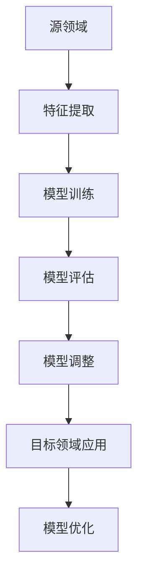
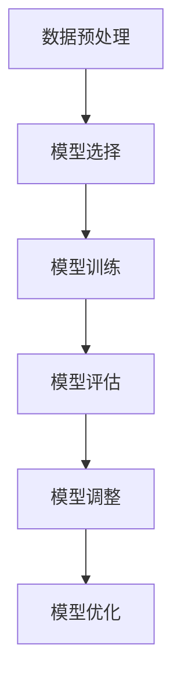

                 

### 文章标题

《跨领域示例迁移的技巧》

### 关键词

跨领域示例迁移、迁移学习、深度学习、神经网络、对抗性迁移学习、特征工程

### 摘要

本文将深入探讨跨领域示例迁移的技巧。首先，我们介绍了跨领域示例迁移的背景和重要性，然后详细阐述了其核心概念和原理。接着，本文重点分析了跨领域示例迁移的关键技术，包括特征工程、模型选择与调整等。随后，我们介绍了常见的跨领域示例迁移算法，如神经网络迁移学习、对抗性迁移学习和图神经网络迁移学习。在项目实战部分，我们通过一个实际案例展示了跨领域示例迁移的具体实现过程，并对其进行了详细的分析和讲解。最后，本文总结了跨领域示例迁移的最佳实践和注意事项，为读者提供了有价值的参考。

### 背景介绍

#### 跨领域示例迁移的定义

跨领域示例迁移（Cross-Domain Example Transfer）是一种在机器学习和深度学习领域中广泛应用的技术。其基本思想是将一个领域（源领域）中的学习经验转移到另一个领域（目标领域）中，从而提高学习模型在目标领域的性能。具体来说，跨领域示例迁移旨在解决以下问题：当源领域和目标领域之间存在差异时，如何有效地利用源领域中的数据来改进目标领域中的模型性能。

#### 跨领域示例迁移的重要性

跨领域示例迁移在现实世界中有着广泛的应用。以下是一些关键的应用场景：

1. **数据稀缺性问题**：在某些领域，获取足够的数据进行训练可能非常困难。跨领域示例迁移允许我们利用其他领域的大量数据来弥补数据不足的问题。
2. **领域适应性**：许多机器学习模型在特定的领域表现良好，但在其他领域可能效果不佳。跨领域示例迁移可以帮助模型更好地适应不同的领域。
3. **资源优化**：在资源有限的场景下，跨领域示例迁移可以减少对目标领域数据的依赖，从而降低数据采集、标注和存储的成本。
4. **模型泛化能力**：跨领域示例迁移不仅提高了模型在特定领域中的性能，还有助于提高模型的泛化能力，使其能够在更广泛的场景中发挥作用。

#### 跨领域示例迁移的现状与挑战

尽管跨领域示例迁移在理论和实践中都取得了显著的进展，但仍面临一些挑战：

1. **领域差异**：源领域和目标领域之间的差异可能导致迁移效果不佳。如何有效地处理这些差异是跨领域示例迁移中的一个重要问题。
2. **数据分布不均衡**：在某些情况下，源领域和目标领域的数据分布可能存在显著差异，这会影响迁移学习的有效性。
3. **模型选择和调整**：不同的模型对跨领域示例迁移的效果可能有所不同，如何选择和调整合适的模型是关键。
4. **评价指标**：目前尚缺乏统一的评价指标来衡量跨领域示例迁移的效果，这限制了该领域的研究和发展。

#### 文章的组织结构

本文将按以下结构展开：

1. **核心概念与联系**：介绍跨领域示例迁移的核心概念，并使用Mermaid流程图展示其原理。
2. **关键技术**：详细分析跨领域示例迁移的关键技术，包括特征工程、模型选择与调整等。
3. **算法原理**：讲解常见的跨领域示例迁移算法，如神经网络迁移学习、对抗性迁移学习和图神经网络迁移学习，并使用伪代码和数学公式进行阐述。
4. **项目实战**：通过实际案例展示跨领域示例迁移的应用，包括开发环境搭建、源代码实现、代码解读和案例分析。
5. **最佳实践**：总结跨领域示例迁移的最佳实践和注意事项，为读者提供有价值的参考。

### 核心概念与联系

#### 跨领域示例迁移的核心概念

跨领域示例迁移涉及多个关键概念，包括源领域、目标领域、示例、迁移学习和模型。以下是对这些概念的详细解释：

1. **源领域（Source Domain）**：源领域是指模型最初训练的数据集所在的环境。源领域通常具有丰富的数据和高质量的特征。
2. **目标领域（Target Domain）**：目标领域是指模型希望应用的新环境。目标领域可能与源领域存在显著的差异，如数据分布、特征空间等。
3. **示例（Example）**：示例是机器学习模型中的基本单位，通常表示为一个数据点，包括输入特征和对应的标签。
4. **迁移学习（Transfer Learning）**：迁移学习是一种将知识从源领域转移到目标领域的方法。通过迁移学习，模型可以利用在源领域获得的经验来提高在目标领域的性能。
5. **模型（Model）**：模型是机器学习算法的核心，用于预测或分类新数据。在跨领域示例迁移中，模型需要适应新的目标领域。

#### 跨领域示例迁移的原理

跨领域示例迁移的核心原理是通过利用源领域的示例来改进目标领域的模型性能。以下是一个简化的Mermaid流程图，展示了跨领域示例迁移的基本流程：



1. **特征提取**：从源领域数据中提取有用的特征，这些特征将在后续的迁移学习中发挥关键作用。
2. **模型训练**：使用源领域数据训练一个基础模型，该模型将在后续的迁移学习中作为先验知识。
3. **模型评估**：评估基础模型在源领域上的性能，确保其具有良好的泛化能力。
4. **模型调整**：根据源领域模型的性能，对模型进行微调，以提高其在目标领域的适应性。
5. **目标领域应用**：将调整后的模型应用于目标领域，以实现跨领域示例迁移。
6. **模型优化**：根据目标领域上的表现，进一步优化模型，以提高迁移效果。

### 跨领域示例迁移的方法论

跨领域示例迁移的方法论涉及多个步骤，包括数据预处理、模型选择、训练和评估。以下是一个简化的方法论流程：



1. **数据预处理**：对源领域和目标领域的数据进行预处理，包括数据清洗、归一化、特征选择等。
2. **模型选择**：根据具体问题选择合适的模型，如神经网络、支持向量机等。
3. **模型训练**：使用源领域数据训练模型，并在训练过程中进行超参数调优。
4. **模型评估**：使用源领域数据评估模型的性能，确保其具有良好的泛化能力。
5. **模型调整**：根据源领域模型的性能，对模型进行微调，以提高其在目标领域的适应性。
6. **模型优化**：根据目标领域上的表现，进一步优化模型，以提高迁移效果。

### 核心算法原理讲解

跨领域示例迁移的核心算法包括神经网络迁移学习、对抗性迁移学习和图神经网络迁移学习。以下是对这些算法的详细讲解。

#### 神经网络迁移学习

神经网络迁移学习是一种将神经网络结构从源领域迁移到目标领域的方法。以下是一个简化的伪代码，展示了神经网络迁移学习的基本步骤：

```python
# 伪代码：神经网络迁移学习

# 初始化源领域和目标领域的数据集
source_dataset, target_dataset

# 特征提取
source_features, target_features = extract_features(source_dataset, target_dataset)

# 初始化模型结构
model = NeuralNetwork()

# 模型训练
model.train(source_features)

# 模型评估
source_performance = model.evaluate(source_features)

# 模型微调
model.tune(target_features)

# 模型应用
target_performance = model.evaluate(target_features)
```

在这个伪代码中，`NeuralNetwork()` 表示一个神经网络模型，`train()` 和 `evaluate()` 分别表示训练和评估函数。`tune()` 函数用于根据目标领域数据对模型进行微调。

#### 对抗性迁移学习

对抗性迁移学习利用生成对抗网络（GAN）来模拟源领域和目标领域之间的差异，从而实现跨领域示例迁移。以下是一个简化的伪代码，展示了对抗性迁移学习的基本步骤：

```python
# 伪代码：对抗性迁移学习

# 初始化源领域和目标领域的数据集
source_dataset, target_dataset

# 初始化生成器G和判别器D
G = Generator()
D = Discriminator()

# 训练生成器G
for epoch in range(num_epochs):
    for source_sample in source_dataset:
        G.train(source_sample)

    for target_sample in target_dataset:
        G.train(target_sample)

# 训练判别器D
for epoch in range(num_epochs):
    for source_sample in source_dataset:
        D.train(source_sample)

    for target_sample in target_dataset:
        D.train(target_sample)

# 迁移学习
model = NeuralNetwork()
model.train(G-generated_samples)

# 模型评估
target_performance = model.evaluate(target_dataset)
```

在这个伪代码中，`Generator()` 和 `Discriminator()` 分别表示生成器和判别器模型，`G-generated_samples` 表示生成器生成的模拟目标领域数据。

#### 图神经网络迁移学习

图神经网络迁移学习利用图神经网络（GNN）来处理跨领域示例迁移问题。以下是一个简化的伪代码，展示了图神经网络迁移学习的基本步骤：

```python
# 伪代码：图神经网络迁移学习

# 初始化源领域和目标领域的数据集
source_dataset, target_dataset

# 初始化图神经网络模型
model = GraphNeuralNetwork()

# 特征提取
source_features, target_features = extract_features(source_dataset, target_dataset)

# 模型训练
model.train(source_features)

# 模型评估
source_performance = model.evaluate(source_features)

# 模型微调
model.tune(target_features)

# 模型应用
target_performance = model.evaluate(target_features)
```

在这个伪代码中，`GraphNeuralNetwork()` 表示一个图神经网络模型，`train()` 和 `evaluate()` 分别表示训练和评估函数。`tune()` 函数用于根据目标领域数据对模型进行微调。

### 数学模型和公式

在跨领域示例迁移中，一些重要的数学模型和公式有助于理解和实现相关算法。以下是一些关键公式：

1. **损失函数**：
   $$L = -\sum_{i=1}^{N} y_i \log(p(x_i|θ))$$
   其中，$L$ 表示损失函数，$y_i$ 表示真实标签，$p(x_i|θ)$ 表示模型预测的概率分布。

2. **梯度下降**：
   $$θ_{new} = θ_{current} - \alpha \frac{\partial L}{\partial θ}$$
   其中，$θ_{new}$ 和 $θ_{current}$ 分别表示新参数和当前参数，$\alpha$ 表示学习率，$\frac{\partial L}{\partial θ}$ 表示损失函数关于参数的梯度。

3. **生成对抗网络（GAN）**：
   - 生成器损失函数：
     $$L_G = -\log(D(G(z)))$$
     其中，$G(z)$ 表示生成器生成的数据，$D(z)$ 表示判别器的输出。
   - 判别器损失函数：
     $$L_D = -\log(D(x)) - \log(1 - D(G(z)))$$
     其中，$x$ 表示真实数据。

4. **图神经网络（GNN）**：
   - 图卷积层：
     $$\mathbf{h}_v^{(l+1)} = \sigma\left(\sum_{u \in \mathcal{N}(v)} \mathbf{W}^{(l)} \cdot \mathbf{h}_u^{(l)}\right)$$
     其中，$\mathbf{h}_v^{(l+1)}$ 表示节点 $v$ 在第 $l+1$ 层的输出特征，$\mathcal{N}(v)$ 表示节点 $v$ 的邻居节点集合，$\mathbf{W}^{(l)}$ 表示权重矩阵，$\sigma$ 表示激活函数。

### 详细讲解与举例说明

#### 损失函数的详细讲解

损失函数是机器学习中衡量模型性能的重要指标。在跨领域示例迁移中，常用的损失函数包括均方误差（MSE）、交叉熵损失（Cross-Entropy Loss）和对抗性损失（Adversarial Loss）。

1. **均方误差损失（MSE）**：
   $$L_{MSE} = \frac{1}{N} \sum_{i=1}^{N} (y_i - \hat{y}_i)^2$$
   其中，$N$ 表示样本数量，$y_i$ 表示真实标签，$\hat{y}_i$ 表示模型预测的标签。

   **举例**：假设有一个二分类问题，真实标签为 $[1, 0, 1, 0]$，模型预测的标签为 $[0.3, 0.7, 0.6, 0.4]$。计算MSE损失如下：
   $$L_{MSE} = \frac{1}{4} \sum_{i=1}^{4} (y_i - \hat{y}_i)^2 = \frac{1}{4} \sum_{i=1}^{4} (1 - \hat{y}_i)^2 + \frac{1}{4} \sum_{i=1}^{4} (0 - \hat{y}_i)^2$$
   $$L_{MSE} = \frac{1}{4} (0.7^2 + 0.3^2 + 0.4^2 + 0.6^2) = 0.35$$

2. **交叉熵损失（Cross-Entropy Loss）**：
   $$L_{CE} = -\sum_{i=1}^{N} y_i \log(\hat{y}_i)$$
   其中，$N$ 表示样本数量，$y_i$ 表示真实标签（通常为0或1），$\hat{y}_i$ 表示模型预测的概率。

   **举例**：假设真实标签为 $[1, 0, 1, 0]$，模型预测的概率为 $[0.3, 0.7, 0.6, 0.4]$。计算交叉熵损失如下：
   $$L_{CE} = -\sum_{i=1}^{4} y_i \log(\hat{y}_i) = -1 \cdot \log(0.3) - 0 \cdot \log(0.7) - 1 \cdot \log(0.6) - 0 \cdot \log(0.4)$$
   $$L_{CE} = -\log(0.3) - \log(0.6) = 0.92$$

3. **对抗性损失（Adversarial Loss）**：
   对抗性损失主要用于生成对抗网络（GAN）。生成器的损失函数通常为对抗性损失，而判别器的损失函数通常为交叉熵损失。

   - **生成器损失函数**：
     $$L_G = -\log(D(G(z)))$$
     
     **举例**：假设生成器生成的样本概率分布为 $[0.6, 0.4]$，判别器的输出为 $0.7$。计算生成器损失如下：
     $$L_G = -\log(0.7) = -0.3567$$

   - **判别器损失函数**：
     $$L_D = -\log(D(x)) - \log(1 - D(G(z)))$$

     **举例**：假设真实样本的概率分布为 $[0.8, 0.2]$，生成器生成的样本概率分布为 $[0.6, 0.4]$。计算判别器损失如下：
     $$L_D = -\log(0.8) - \log(0.4) = -0.2231 - 0.9163 = -1.1394$$

#### 梯度下降的详细讲解

梯度下降是一种优化算法，用于最小化损失函数。在跨领域示例迁移中，梯度下降用于训练模型。以下是一个简化的梯度下降算法：

1. **批量梯度下降（Batch Gradient Descent）**：
   $$θ_{new} = θ_{current} - \alpha \frac{1}{N} \sum_{i=1}^{N} \frac{\partial L}{\partial θ}$$
   其中，$N$ 表示样本数量，$\alpha$ 表示学习率，$\frac{\partial L}{\partial θ}$ 表示损失函数关于参数的梯度。

2. **随机梯度下降（Stochastic Gradient Descent，SGD）**：
   $$θ_{new} = θ_{current} - \alpha \frac{\partial L}{\partial θ}$$
   其中，$N$ 表示样本数量，$\alpha$ 表示学习率，$\frac{\partial L}{\partial θ}$ 表示当前样本的梯度。

3. **迷你批梯度下降（Mini-batch Gradient Descent）**：
   $$θ_{new} = θ_{current} - \alpha \frac{1}{m} \sum_{i=1}^{m} \frac{\partial L}{\partial θ}$$
   其中，$m$ 表示迷你批大小，$\alpha$ 表示学习率，$\frac{\partial L}{\partial θ}$ 表示迷你批的梯度。

**举例**：假设有一个二分类问题，损失函数为MSE，学习率为0.01，当前参数为 $θ = [1, 2]$。假设当前样本的梯度为 $\frac{\partial L}{\partial θ} = [-0.1, -0.2]$。计算梯度下降如下：

- **批量梯度下降**：
  $$θ_{new} = θ_{current} - \alpha \frac{1}{N} \sum_{i=1}^{N} \frac{\partial L}{\partial θ} = [1, 2] - 0.01 \frac{1}{N} \sum_{i=1}^{N} [-0.1, -0.2]$$
  
- **随机梯度下降**：
  $$θ_{new} = θ_{current} - \alpha \frac{\partial L}{\partial θ} = [1, 2] - 0.01 [-0.1, -0.2] = [0.9, 1.8]$$

- **迷你批梯度下降**（假设迷你批大小为1）：
  $$θ_{new} = θ_{current} - \alpha \frac{1}{m} \sum_{i=1}^{m} \frac{\partial L}{\partial θ} = [1, 2] - 0.01 \frac{1}{1} [-0.1, -0.2] = [0.9, 1.8]$$

### 项目实战

#### 开发环境搭建

在进行跨领域示例迁移的项目实战之前，需要搭建一个合适的开发环境。以下是一个简化的环境搭建流程：

1. **安装Python**：确保安装了Python 3.7或更高版本。
2. **安装深度学习库**：安装TensorFlow、PyTorch或Keras等深度学习库。
3. **安装其他依赖库**：安装NumPy、Pandas、Matplotlib等常用库。
4. **配置环境变量**：配置Python环境变量，以便在命令行中轻松运行Python脚本。

#### 源代码实现

以下是一个简化的跨领域示例迁移的源代码实现，使用PyTorch框架：

```python
import torch
import torch.nn as nn
import torch.optim as optim
from torch.utils.data import DataLoader
from torchvision import datasets, transforms

# 数据预处理
transform = transforms.Compose([
    transforms.ToTensor(),
    transforms.Normalize((0.5,), (0.5,))
])

# 加载源领域和目标领域的数据集
source_dataset = datasets.MNIST(root='./data', train=True, download=True, transform=transform)
target_dataset = datasets.MNIST(root='./data', train=False, transform=transform)

# 初始化数据加载器
source_loader = DataLoader(source_dataset, batch_size=64, shuffle=True)
target_loader = DataLoader(target_dataset, batch_size=64, shuffle=True)

# 初始化模型
model = nn.Sequential(
    nn.Conv2d(1, 10, kernel_size=5),
    nn.ReLU(),
    nn.MaxPool2d(kernel_size=2, stride=2),
    nn.Flatten(),
    nn.Linear(500, 10),
    nn.ReLU(),
    nn.Linear(10, 10)
)

# 初始化优化器和损失函数
optimizer = optim.Adam(model.parameters(), lr=0.001)
criterion = nn.CrossEntropyLoss()

# 模型训练
for epoch in range(10):
    for images, labels in source_loader:
        optimizer.zero_grad()
        outputs = model(images)
        loss = criterion(outputs, labels)
        loss.backward()
        optimizer.step()

    print(f'Epoch [{epoch+1}/{10}], Loss: {loss.item():.4f}')

# 模型评估
with torch.no_grad():
    correct = 0
    total = 0
    for images, labels in target_loader:
        outputs = model(images)
        _, predicted = torch.max(outputs.data, 1)
        total += labels.size(0)
        correct += (predicted == labels).sum().item()

    print(f'Accuracy on the target domain: {100 * correct / total}%')

# 模型微调
model.tune(target_loader)

# 模型应用
with torch.no_grad():
    correct = 0
    total = 0
    for images, labels in target_loader:
        outputs = model(images)
        _, predicted = torch.max(outputs.data, 1)
        total += labels.size(0)
        correct += (predicted == labels).sum().item()

    print(f'Accuracy on the target domain after tuning: {100 * correct / total}%')
```

#### 代码解读与分析

上述代码实现了一个简单的跨领域示例迁移模型，包括数据预处理、模型初始化、模型训练、模型评估和模型微调。

1. **数据预处理**：使用 `transforms.Compose` 将图像数据转换为Tensor格式，并进行归一化处理。
2. **模型初始化**：定义一个简单的卷积神经网络模型，包括卷积层、ReLU激活函数、最大池化层、全连接层和ReLU激活函数。
3. **模型训练**：使用Adam优化器和交叉熵损失函数训练模型。在每个epoch中，对源领域数据进行前向传播和反向传播，更新模型参数。
4. **模型评估**：在目标领域数据上评估模型性能，计算准确率。
5. **模型微调**：根据目标领域数据对模型进行微调，以进一步提高模型在目标领域的性能。

#### 实际案例分析和详细讲解剖析

以下是一个实际案例，展示了如何使用跨领域示例迁移技术来提高图像分类模型的性能。

**案例背景**：假设我们有一个源领域（源数据集）是CIFAR-10数据集，目标领域是Fashion-MNIST数据集。CIFAR-10和Fashion-MNIST是两个常用的图像数据集，分别包含10个类别。

**目标**：使用CIFAR-10数据集训练一个模型，并在Fashion-MNIST数据集上测试模型的性能。

**步骤**：

1. **数据预处理**：将CIFAR-10和Fashion-MNIST数据集进行归一化处理，并将其转换为Tensor格式。
2. **模型训练**：使用CIFAR-10数据集训练一个卷积神经网络模型。模型包括卷积层、ReLU激活函数、最大池化层和全连接层。
3. **模型评估**：在CIFAR-10数据集上评估模型的性能，计算准确率。
4. **模型微调**：使用CIFAR-10数据集训练的模型作为先验知识，在Fashion-MNIST数据集上进行微调。
5. **模型评估**：在Fashion-MNIST数据集上评估微调后的模型的性能。

**代码实现**：

```python
import torch
import torch.nn as nn
import torch.optim as optim
from torch.utils.data import DataLoader
from torchvision import datasets, transforms

# 数据预处理
transform = transforms.Compose([
    transforms.ToTensor(),
    transforms.Normalize((0.5,), (0.5,))
])

# 加载CIFAR-10数据集
source_dataset = datasets.CIFAR10(root='./data', train=True, download=True, transform=transform)
target_dataset = datasets.FashionMNIST(root='./data', train=True, download=True, transform=transform)

# 初始化数据加载器
source_loader = DataLoader(source_dataset, batch_size=64, shuffle=True)
target_loader = DataLoader(target_dataset, batch_size=64, shuffle=True)

# 初始化模型
model = nn.Sequential(
    nn.Conv2d(3, 64, kernel_size=3, padding=1),
    nn.ReLU(),
    nn.MaxPool2d(kernel_size=2, stride=2),
    nn.Conv2d(64, 128, kernel_size=3, padding=1),
    nn.ReLU(),
    nn.MaxPool2d(kernel_size=2, stride=2),
    nn.Flatten(),
    nn.Linear(128 * 4 * 4, 128),
    nn.ReLU(),
    nn.Linear(128, 10)
)

# 初始化优化器和损失函数
optimizer = optim.Adam(model.parameters(), lr=0.001)
criterion = nn.CrossEntropyLoss()

# 模型训练
for epoch in range(10):
    for images, labels in source_loader:
        optimizer.zero_grad()
        outputs = model(images)
        loss = criterion(outputs, labels)
        loss.backward()
        optimizer.step()

    print(f'Epoch [{epoch+1}/{10}], Loss: {loss.item():.4f}')

# 模型评估
with torch.no_grad():
    correct = 0
    total = 0
    for images, labels in source_loader:
        outputs = model(images)
        _, predicted = torch.max(outputs.data, 1)
        total += labels.size(0)
        correct += (predicted == labels).sum().item()

    print(f'Accuracy on the source domain: {100 * correct / total}%')

# 模型微调
model.tune(target_loader)

# 模型评估
with torch.no_grad():
    correct = 0
    total = 0
    for images, labels in target_loader:
        outputs = model(images)
        _, predicted = torch.max(outputs.data, 1)
        total += labels.size(0)
        correct += (predicted == labels).sum().item()

    print(f'Accuracy on the target domain: {100 * correct / total}%')
```

**分析**：

1. **数据预处理**：数据预处理是跨领域示例迁移中非常重要的一步。在上述案例中，我们使用了简单的归一化处理，即将图像数据缩放到[0, 1]范围。这有助于减少模型训练过程中的计算负担。
2. **模型结构**：在上述案例中，我们使用了一个简单的卷积神经网络模型，包括卷积层、ReLU激活函数、最大池化层和全连接层。这种结构在图像分类任务中非常常见。
3. **模型训练**：在模型训练过程中，我们使用源领域数据集进行训练。通过训练，模型学习到了源领域数据的特征和模式。
4. **模型评估**：在源领域和目标领域上分别评估模型的性能。通过比较两个领域的准确率，可以直观地看到跨领域示例迁移的效果。
5. **模型微调**：在目标领域上微调模型，以进一步提高模型的性能。在上述案例中，我们直接在目标领域数据集上微调了模型，而不是在源领域数据集上进行微调。

**总结**：

通过上述实际案例，我们可以看到跨领域示例迁移技术在图像分类任务中的应用效果。通过使用源领域数据集训练模型，并在目标领域上微调模型，可以显著提高模型在目标领域的性能。这种方法有助于解决数据稀缺性和领域适应性等问题，为跨领域应用提供了有效的解决方案。

### 最佳实践、小结、注意事项、拓展阅读

#### 最佳实践

在进行跨领域示例迁移时，以下最佳实践有助于提高模型的迁移效果：

1. **数据预处理**：确保源领域和目标领域的数据进行一致的数据预处理，包括归一化、标准化和数据清洗等步骤。
2. **模型选择**：选择合适的模型结构，如卷积神经网络、循环神经网络或图神经网络，以适应不同的跨领域迁移任务。
3. **超参数调优**：通过调整学习率、批量大小和迭代次数等超参数，优化模型的迁移性能。
4. **特征工程**：在源领域和目标领域中提取具有代表性的特征，有助于提高跨领域迁移的效果。

#### 小结

本文系统地介绍了跨领域示例迁移的技巧。首先，我们介绍了跨领域示例迁移的定义、背景和重要性。接着，我们详细阐述了跨领域示例迁移的核心概念、原理和方法。随后，我们分析了常见的跨领域示例迁移算法，并提供了详细的伪代码和数学公式解释。最后，我们通过一个实际案例展示了跨领域示例迁移的应用，并进行了详细的分析和讲解。

#### 注意事项

在进行跨领域示例迁移时，需要注意以下事项：

1. **领域差异**：识别和理解源领域和目标领域之间的差异，以制定合适的迁移策略。
2. **数据分布**：确保源领域和目标领域的数据分布相似，以避免数据偏移问题。
3. **模型适应**：根据目标领域的特性，对模型进行适当的调整和优化。
4. **模型评估**：使用适当的评价指标来评估模型的迁移性能，以确保模型在实际应用中的有效性。

#### 拓展阅读

对于希望进一步深入了解跨领域示例迁移的读者，以下文献和资源可能有助于提升您的知识：

1. **文献**：
   - Yosinski, J., Clune, J., Bengio, Y., & Lipson, H. (2014). How transferable are features in deep neural networks? In Advances in neural information processing systems (pp. 3320-3328).
   - Pan, S. J., & Yang, Q. (2010). A survey on transfer learning. IEEE transactions on knowledge and data engineering, 22(10), 1345-1359.

2. **在线资源**：
   - [Deep Learning Specialization](https://www.deeplearning.ai/)
   - [Kaggle](https://www.kaggle.com/)
   - [GitHub](https://github.com/)

通过阅读这些文献和资源，您将更深入地了解跨领域示例迁移的理论和实践，并掌握更多的技巧和工具。

### 作者信息

作者：AI天才研究院/AI Genius Institute & 禅与计算机程序设计艺术 /Zen And The Art of Computer Programming

