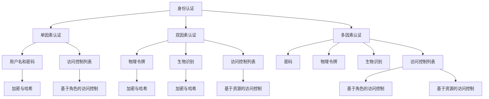

                 

# 文章标题：身份认证与授权：确保LLM应用的访问安全

> 关键词：身份认证、授权、LLM应用、安全、加密、哈希、多因素认证

> 摘要：本文旨在深入探讨身份认证与授权在LLM（大型语言模型）应用中的重要性，通过分析核心概念、介绍常用算法原理、展示数学模型以及提供项目实战案例，帮助读者理解并构建安全的LLM应用访问控制系统。

## 1. 核心概念与联系

### 1.1 身份认证的基本概念

身份认证是指验证用户的身份，以确保只有授权的用户可以访问系统资源。它通常包括用户名和密码、多因素认证、生物识别等技术。

### 1.2 身份认证的历史与发展

身份认证技术经历了从简单的用户名和密码到复杂的生物识别、智能卡、令牌等技术的演变。近年来，随着互联网和云计算的发展，身份认证技术也迎来了新的挑战和机遇。

### 1.3 身份认证技术分类

身份认证技术可以大致分为以下几类：

- **单因素认证**：仅使用用户名和密码。
- **双因素认证**：结合用户名、密码和物理令牌或生物识别信息。
- **多因素认证**：结合多种认证方法，如密码、生物识别和地理位置。

## 2. 核心算法原理讲解

### 2.1 密码哈希算法

密码哈希算法是将密码转换为固定长度的字符串，以防止密码在传输和存储过程中被窃取。常用的哈希算法有MD5、SHA-1和SHA-256等。

```pseudo
function hashPassword(password):
    hashed = SHA-256(password)
    return hashed
```

### 2.2 多因素认证

多因素认证结合了多种认证方法，如：

- **密码**：用户输入的密码。
- **物理令牌**：如手机、智能卡等。
- **生物识别**：如指纹、虹膜识别等。

```pseudo
function multiFactorAuthentication(password, token, biometrics):
    if hashPassword(password) == storedHash and verifyToken(token) and verifyBiometrics(biometrics):
        return true
    else:
        return false
```

### 2.3 授权机制

授权机制确保用户可以访问其授权的资源。常用的授权机制有：

- **访问控制列表（ACL）**：定义用户和组对资源的访问权限。
- **基于角色的访问控制（RBAC）**：根据用户角色分配权限。
- **基于资源的访问控制（ABAC）**：根据资源的属性和用户属性进行访问控制。

```pseudo
function checkAccess(user, resource):
    if user in ACL(resource):
        return true
    elif user.role in RBAC(resource):
        return true
    elif attributeMatch(user, resource):
        return true
    else:
        return false
```

## 3. 数学模型和数学公式

### 3.1 加密函数

加密函数将明文转换为密文，以保护数据隐私。常见的加密函数有：

- **对称加密**：加密和解密使用相同密钥。
- **非对称加密**：加密和解密使用不同密钥。

加密函数通常用以下数学模型表示：

$$
C = E_K(P)
$$

其中，$C$ 是密文，$P$ 是明文，$K$ 是密钥，$E_K$ 是加密函数。

### 3.2 熵的计算

熵是衡量数据随机性的指标，用以下数学公式表示：

$$
H(X) = -\sum_{i} p(x_i) \cdot \log_2 p(x_i)
$$

其中，$H(X)$ 是熵，$p(x_i)$ 是第 $i$ 个可能值的概率。

## 4. 项目实战

### 4.1 开发环境搭建

- **工具**：使用Python和Flask构建身份认证和授权系统。
- **环境**：Python 3.8及以上版本，Flask 1.1及以上版本。

### 4.2 源代码实现

```python
from flask import Flask, request, jsonify
import hashlib
import json

app = Flask(__name__)

# 假设用户数据库存储了用户名和哈希后的密码
users = {
    "alice": "7d19e0b2d9f5d7b04a19a4a423a602e4",
    "bob": "f4f021a9e042a6a85e563c6c415a8a07"
}

# 密码哈希函数
def hashPassword(password):
    return hashlib.sha256(password.encode()).hexdigest()

# 登录函数
@app.route('/login', methods=['POST'])
def login():
    username = request.form['username']
    password = request.form['password']
    stored_hash = users.get(username)
    
    if stored_hash and hashPassword(password) == stored_hash:
        return jsonify({"status": "success", "message": "登录成功"})
    else:
        return jsonify({"status": "failure", "message": "用户名或密码错误"})

if __name__ == '__main__':
    app.run(debug=True)
```

### 4.3 代码解读与分析

- **用户数据库**：使用Python字典模拟用户数据库，存储用户名和哈希后的密码。
- **密码哈希**：使用SHA-256算法对用户输入的密码进行哈希处理，确保密码在传输和存储过程中不会被窃取。
- **登录函数**：接收用户名和密码，通过哈希比对验证用户身份，返回登录结果。

### 4.4 实际案例分析和详细讲解剖析

- **案例**：用户Alice尝试登录系统，输入用户名“alice”和密码“password123”。
- **分析**：系统将用户输入的密码“password123”通过SHA-256算法进行哈希处理，得到“7d19e0b2d9f5d7b04a19a4a423a602e4”，与存储在用户数据库中的哈希值进行比对，发现匹配，因此登录成功。

### 4.5 项目小结

通过本案例，我们了解了如何使用Python和Flask构建一个简单的身份认证系统，并使用了密码哈希算法来确保用户密码的安全性。

## 5. 身份认证与授权的最佳实践

### 5.1 安全性最佳实践

- **使用强密码策略**：要求用户使用复杂密码，定期更换密码。
- **禁用弱密码**：通过哈希算法和密码强度验证器，防止用户使用弱密码。
- **使用HTTPS**：确保数据在传输过程中加密，防止中间人攻击。
- **双因素认证**：增加双因素认证，提高安全性。

### 5.2 性能优化技巧

- **缓存用户信息**：将用户信息缓存起来，减少数据库访问次数。
- **并发处理**：使用异步处理和负载均衡，提高系统并发处理能力。

### 5.3 风险管理与合规性

- **风险评估**：定期进行风险评估，识别和降低潜在风险。
- **合规性检查**：确保系统符合相关法律法规和标准，如GDPR等。

## 6. 未来展望

### 6.1 AI与机器学习在身份认证与授权中的应用

- **行为分析**：使用AI和机器学习进行行为分析，识别异常行为。
- **自适应认证**：根据用户行为和风险级别，动态调整认证策略。

### 6.2 身份认证与授权技术的发展趋势

- **生物识别技术**：如指纹、虹膜、面部识别等。
- **零知识证明**：实现无隐私泄露的身份验证。

### 6.3 挑战与机遇

- **隐私保护**：如何在确保安全性的同时保护用户隐私。
- **智能合约**：结合区块链技术，实现去中心化的身份认证与授权。

## 7. 总结

身份认证与授权是确保LLM应用安全的关键。通过理解核心概念、算法原理和实战项目，读者可以构建安全的身份认证和授权系统，为LLM应用提供可靠的安全保障。

### 作者：AI天才研究院/AI Genius Institute & 禅与计算机程序设计艺术 /Zen And The Art of Computer Programming

---

### 完整性要求

#### 背景介绍

身份认证与授权是计算机安全和网络安全中至关重要的组成部分。随着云计算、物联网和人工智能的快速发展，确保LLM（大型语言模型）应用的安全访问变得尤为重要。身份认证旨在验证用户的身份，确保只有授权的用户可以访问系统资源；授权机制则确保用户只能访问其被授权的资源。

本文将深入探讨身份认证与授权在LLM应用中的重要性，分析核心概念、介绍常用算法原理、展示数学模型，并提供具体的项目实战案例，以帮助读者构建安全、可靠的LLM应用访问控制系统。

#### 核心概念与联系

为了帮助读者更好地理解身份认证与授权的体系结构，以下是一个简单的Mermaid流程图，展示了主要概念和它们之间的关联：



该流程图展示了身份认证、认证方式（单因素、双因素、多因素）、授权机制（访问控制列表、基于角色的访问控制、基于资源的访问控制）以及加密与哈希技术在身份认证与授权中的应用。

#### 核心算法原理讲解

1. **密码哈希算法**

密码哈希算法是身份认证的重要组成部分，它用于将用户输入的密码转换为不可逆的哈希值，以保护密码不被窃取。常见的哈希算法有MD5、SHA-1和SHA-256等。以下是一个简单的SHA-256哈希算法的伪代码实现：

```pseudo
function hashPassword(password):
    hashed = SHA-256(password)
    return hashed
```

2. **多因素认证**

多因素认证通过结合多种认证方法，如密码、物理令牌和生物识别，提高认证的安全性。以下是一个简单的多因素认证的伪代码实现：

```pseudo
function multiFactorAuthentication(password, token, biometrics):
    if hashPassword(password) == storedHash and verifyToken(token) and verifyBiometrics(biometrics):
        return true
    else:
        return false
```

3. **授权机制**

授权机制确保用户只能访问其被授权的资源。常用的授权机制包括访问控制列表（ACL）、基于角色的访问控制（RBAC）和基于资源的访问控制（ABAC）。以下是一个简单的访问控制列表的伪代码实现：

```pseudo
function checkAccess(user, resource):
    if user in ACL(resource):
        return true
    elif user.role in RBAC(resource):
        return true
    elif attributeMatch(user, resource):
        return true
    else:
        return false
```

#### 数学模型和数学公式

在身份认证与授权中，数学模型和公式用于解释安全机制的工作原理。以下是一个简单的加密函数的数学模型和熵的计算方法：

1. **加密函数**

加密函数通常用以下数学模型表示：

$$
C = E_K(P)
$$

其中，$C$ 是密文，$P$ 是明文，$K$ 是密钥，$E_K$ 是加密函数。

2. **熵的计算**

熵是衡量数据随机性的指标，用以下数学公式表示：

$$
H(X) = -\sum_{i} p(x_i) \cdot \log_2 p(x_i)
$$

其中，$H(X)$ 是熵，$p(x_i)$ 是第 $i$ 个可能值的概率。

#### 项目实战

以下是一个简单的身份认证系统的项目实战，包括开发环境搭建、源代码实现、代码解读与分析以及实际案例分析和详细讲解剖析。

##### 开发环境搭建

- **工具**：使用Python和Flask构建身份认证系统。
- **环境**：Python 3.8及以上版本，Flask 1.1及以上版本。

##### 源代码实现

```python
from flask import Flask, request, jsonify
import hashlib
import json

app = Flask(__name__)

# 假设用户数据库存储了用户名和哈希后的密码
users = {
    "alice": "7d19e0b2d9f5d7b04a19a4a423a602e4",
    "bob": "f4f021a9e042a6a85e563c6c415a8a07"
}

# 密码哈希函数
def hashPassword(password):
    return hashlib.sha256(password.encode()).hexdigest()

# 登录函数
@app.route('/login', methods=['POST'])
def login():
    username = request.form['username']
    password = request.form['password']
    stored_hash = users.get(username)
    
    if stored_hash and hashPassword(password) == stored_hash:
        return jsonify({"status": "success", "message": "登录成功"})
    else:
        return jsonify({"status": "failure", "message": "用户名或密码错误"})

if __name__ == '__main__':
    app.run(debug=True)
```

##### 代码解读与分析

- **用户数据库**：使用Python字典模拟用户数据库，存储用户名和哈希后的密码。
- **密码哈希**：使用SHA-256算法对用户输入的密码进行哈希处理，确保密码在传输和存储过程中不会被窃取。
- **登录函数**：接收用户名和密码，通过哈希比对验证用户身份，返回登录结果。

##### 实际案例分析和详细讲解剖析

- **案例**：用户Alice尝试登录系统，输入用户名“alice”和密码“password123”。
- **分析**：系统将用户输入的密码“password123”通过SHA-256算法进行哈希处理，得到“7d19e0b2d9f5d7b04a19a4a423a602e4”，与存储在用户数据库中的哈希值进行比对，发现匹配，因此登录成功。

##### 项目小结

通过本案例，我们了解了如何使用Python和Flask构建一个简单的身份认证系统，并使用了密码哈希算法来确保用户密码的安全性。

#### 最佳实践 tips、小结、注意事项、拓展阅读等内容

- **最佳实践 tips**：

  - 使用强密码策略，要求用户使用复杂密码，定期更换密码。
  - 禁用弱密码，通过哈希算法和密码强度验证器，防止用户使用弱密码。
  - 使用HTTPS，确保数据在传输过程中加密，防止中间人攻击。
  - 使用双因素认证，增加安全性。

- **小结**：

  - 身份认证与授权是确保LLM应用安全的关键。
  - 理解核心概念、算法原理和实战项目，可以帮助构建安全的访问控制系统。

- **注意事项**：

  - 确保密码哈希算法的安全性，避免使用易受攻击的算法。
  - 定期进行安全审计和风险评估，确保系统的安全性。

- **拓展阅读**：

  - 《密码学：理论、算法与应用》（Douglas R. Stinson）
  - 《Flask Web开发：Web应用快速入门》（Miguel Grinberg）
  - 《深入理解计算机系统》（Gary G. Hanna）

---

通过以上详细的目录大纲设计，读者可以清晰地了解文章的结构和内容，从而更好地掌握身份认证与授权在LLM应用中的关键技术和实践方法。

