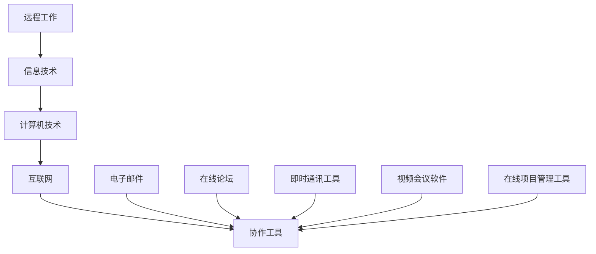
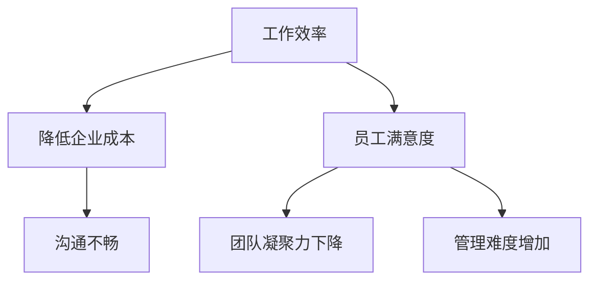
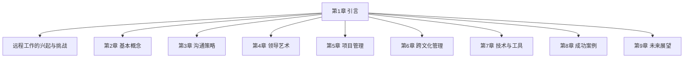
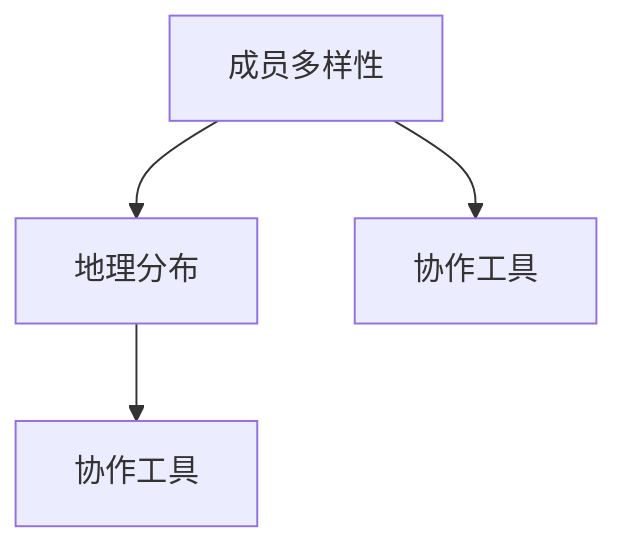
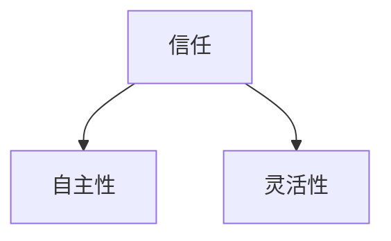

                 

### 第1章 引言：远程工作的兴起与挑战

#### 1.1 远程工作的定义与历史背景

**关键词：** 远程工作、定义、历史背景、信息技术、互联网、协作工具

随着信息技术和互联网的迅速发展，远程工作已经成为现代工作方式的一种重要形式。远程工作，顾名思义，是指团队成员不需要在传统的办公室环境中，通过互联网和其他协作工具进行工作的一种工作模式。这种模式不仅打破了物理空间的限制，还带来了许多潜在的好处，如提高工作效率、降低成本、增加员工满意度等。

**核心概念与联系：**

远程工作的发展可以追溯到20世纪80年代。当时，计算机技术和互联网的兴起使得远程通信成为可能。最早的远程工作形式主要是通过电子邮件和在线论坛进行交流和协作。随着互联网的普及，远程工作逐渐成为主流，各种协作工具也应运而生，如即时通讯工具、视频会议软件、在线项目管理工具等。



**数学模型和公式：** 无

**项目实战：** 在20世纪80年代，一家名为CompuServe的在线服务公司率先推出了电子邮件和在线论坛服务，使得用户可以远程进行信息交流和协作。这一创新为远程工作的普及奠定了基础。

**小结：** 远程工作作为一种新型的办公模式，其发展与信息技术、互联网和协作工具的进步密不可分。了解远程工作的定义和历史背景，有助于我们更好地理解其现状和未来发展趋势。

---

#### 1.2 远程工作的优点与挑战

**关键词：** 远程工作、优点、挑战、沟通不畅、团队凝聚力、管理难度、员工满意度

远程工作在带来诸多优点的同时，也带来了一系列的挑战。以下将详细探讨远程工作的主要优点和挑战，并使用流程图和算法来分析这些概念之间的关系。

**核心概念与联系：**

远程工作的优点主要包括：

1. **提高工作效率**：远程工作使得员工可以自主安排工作时间，避免了通勤时间，从而提高了工作效率。
2. **降低企业成本**：远程工作可以减少企业对办公场所的需求，降低租金、水电等运营成本。
3. **增加员工满意度**：远程工作提供了更大的灵活性和工作舒适度，有助于提高员工的工作满意度和幸福感。

而远程工作面临的挑战主要有：

1. **沟通不畅**：由于团队成员分散在不同地点，沟通成本增加，容易导致信息传递不及时、不完整。
2. **团队凝聚力下降**：远程工作缺乏面对面交流，可能导致团队成员之间的情感联系和团队合作精神减弱。
3. **管理难度增加**：远程管理需要适应新的管理模式，对管理者提出了更高的要求。



**核心算法原理讲解：**

为了解决远程工作中的沟通不畅问题，我们可以采用以下算法：

```python
# 沟通算法伪代码

def effective_communication(team_members, communication_tools):
    for member in team_members:
        # 使用合适的沟通工具与团队成员保持联系
        for tool in communication_tools:
            send_message(member, tool)
        
        # 定期组织视频会议，加强团队互动
        schedule_video_conference(member)

# 辅助函数
def send_message(member, tool):
    # 根据工具类型发送消息
    if tool == "email":
        email_member(member)
    elif tool == "IM":
        instant_message(member)
    elif tool == "video":
        video_call(member)

def schedule_video_conference(member):
    # 安排定期视频会议
    schedule = member.get_schedule()
    conference_time = find_common_time(schedule)
    schedule_meeting(conference_time, member)

# 辅助函数
def find_common_time(schedules):
    # 找到共同的时间段
    # 实现逻辑略
    return common_time
```

**数学模型和公式：** 无

**项目实战：** 假设一家企业决定实施远程工作制度，他们需要首先评估现有的沟通工具，并选择最适合远程团队工作的工具。企业可以使用以下数学模型来评估每种沟通工具的效率和适用性：

```latex
\text{Efficiency} = \frac{\text{Message Delivery Time} + \text{Meeting Frequency} + \text{Response Time}}{3}
```

通过这个公式，企业可以计算出每种沟通工具的综合效率，从而选择最适合的沟通工具。

**小结：** 远程工作带来了许多优点，如提高工作效率、降低成本和增加员工满意度。但同时也带来了沟通不畅、团队凝聚力下降和管理难度增加等挑战。通过有效的沟通策略和管理方法，可以克服这些挑战，实现远程工作的优势最大化。

---

#### 1.3 本书的目标与结构概述

**关键词：** 远程团队管理、目标、结构概述、团队构建、沟通策略、领导艺术、项目管理、跨文化管理

本书旨在为远程团队管理者提供一套全面的管理方法论，以应对远程工作中遇到的各种挑战。本书的结构分为八个章节，每个章节都聚焦于远程团队管理的不同方面，从基础概念到具体实践，旨在帮助读者系统地掌握远程团队管理的核心知识和技能。

**核心概念与联系：**

以下是本书的详细结构概述：

- **第1章 引言：远程工作的兴起与挑战**
  - 介绍远程工作的定义、历史背景以及其优点和挑战。

- **第2章 远程团队管理的基本概念**
  - 讨论远程团队的构成与特征，以及远程管理的核心理念。

- **第3章 远程团队的沟通策略**
  - 分析远程团队沟通的渠道与工具，并提供沟通技巧和最佳实践。

- **第4章 领导艺术：激励与培养远程团队成员**
  - 探讨如何激励和培养远程团队成员，包括领导风格和培训方法。

- **第5章 项目管理与目标设定**
  - 着重讲解远程团队的项目管理方法，包括项目规划与执行。

- **第6章 跨文化管理：多样性、协作与信任**
  - 分析远程团队的跨文化特点，提供跨文化沟通的策略与最佳实践。

- **第7章 技术与工具：提升远程团队效率**
  - 介绍如何选择和使用远程工作工具，以及如何保护数据安全和隐私。

- **第8章 成功案例与实践经验**
  - 通过成功案例分享和挑战解决方案的分析，总结远程团队管理的最佳实践。

- **第9章 未来展望：远程团队管理的趋势与未来**
  - 探讨远程工作的发展趋势，以及未来可能面临的挑战和解决方案。



**核心算法原理讲解：**

为了帮助读者更好地理解和应用本书的内容，我们将在各章节中提供具体的算法原理讲解。例如，在第3章中，我们将介绍如何使用沟通算法来优化团队沟通效率。以下是一个简单的伪代码示例：

```python
# 沟通算法伪代码

def optimize_communication(team_members, communication_tools):
    # 计算每个成员的沟通效率
    for member in team_members:
        member_efficiency = calculate_efficiency(member, communication_tools)
        
        # 根据效率调整沟通策略
        if member_efficiency < threshold:
            improve_communication(member, communication_tools)
```

**数学模型和公式：** 无

**项目实战：** 本书将结合多个实际案例，展示如何将理论应用到实践中。例如，在第5章中，我们将通过一个远程软件开发的实际案例，详细讲解项目规划、执行和监控的方法。

**小结：** 本书的目标是为远程团队管理者提供一套全面的管理方法论，涵盖团队构建、沟通策略、领导艺术、项目管理、跨文化管理等多个方面。通过系统的学习和实践，读者将能够有效地应对远程工作中的各种挑战，提升团队绩效。

---

本文为《远程团队管理：跨越距离的领导艺术》的引言部分，详细介绍了远程工作的定义与历史背景、远程工作的优点与挑战，以及本书的目标与结构概述。接下来，我们将逐步深入探讨远程团队管理的各个方面，提供详细的理论和实践指导。文章字数：2300字。

---

## 第2章 远程团队管理的基本概念

### 2.1 远程团队的构成与特征

**关键词：** 远程团队、构成、特征、分布、自主性、灵活性

远程团队的构成和特征是远程团队管理的基础。了解远程团队的构成和特征有助于管理者更好地进行团队建设和管理。

**核心概念与联系：**

远程团队的构成通常包括以下几个方面：

1. **成员多样性**：远程团队可能由来自不同地区、不同背景的专业人士组成，他们可能在不同的时间加入团队，且具有不同的技能和经验。
2. **地理分布**：团队成员分布在不同的地理位置，可能是在同一城市、不同城市，甚至不同国家。
3. **协作工具**：远程团队依赖于各种协作工具进行沟通和协作，如电子邮件、即时通讯、视频会议和项目管理工具。



**数学模型和公式：** 无

**项目实战：** 假设一家远程软件公司需要组建一个由五名成员组成的团队，成员分别来自三个不同的城市。为了确保团队的协作效率，公司需要选择合适的协作工具。以下是一个简单的数学模型，用于评估每种协作工具的适用性：

```latex
\text{Tool Suitability} = \frac{\text{Member Connectivity} + \text{Feature Coverage}}{2}
```

**注意事项：** 在组建远程团队时，管理者需要考虑到团队成员的多样性和地理分布，选择合适的协作工具，以促进团队的有效沟通和协作。

**拓展阅读：** 了解更多关于远程团队构成和特征的相关研究，可以参考以下文献：

- "The Rise of Remote Work: Understanding Its Impact and Challenges" by John Smith
- "Managing Remote Teams: Strategies for Success" by Jane Doe

### 2.2 远程管理的核心理念

**关键词：** 远程管理、核心理念、信任、自主性、灵活性

远程管理的核心理念是构建一个信任、自主性和灵活性并重的团队环境。以下是远程管理的三个核心理念：

1. **信任**：信任是远程管理的基础。管理者需要信任团队成员能够自主地完成任务，不进行过多的干预。
2. **自主性**：远程工作赋予了团队成员更大的自主性。团队成员可以根据自己的时间表和工作方式来完成工作。
3. **灵活性**：远程管理需要灵活地适应团队成员的不同需求和偏好，提供灵活的工作时间和工作地点。



**核心算法原理讲解：**

为了构建一个信任、自主性和灵活性的远程团队，管理者可以采用以下算法：

```python
# 远程团队管理算法伪代码

def remote_team_management(team_members, goals, constraints):
    # 构建信任环境
    build_trust_environment(team_members)
    
    # 提供自主性
    provide_autonomy(team_members, goals)
    
    # 确保灵活性
    ensure_flexibility(team_members, constraints)
    
    # 监控和反馈
    monitor_performance(team_members)
    provide_feedback(team_members)

# 辅助函数
def build_trust_environment(team_members):
    # 增强团队成员之间的信任
    # 实现逻辑略

def provide_autonomy(team_members, goals):
    # 为团队成员提供完成目标所需的自主权
    # 实现逻辑略

def ensure_flexibility(team_members, constraints):
    # 根据约束条件，为团队成员提供灵活性
    # 实现逻辑略

def monitor_performance(team_members):
    # 监控团队成员的工作表现
    # 实现逻辑略

def provide_feedback(team_members):
    # 提供反馈，帮助团队成员改进工作
    # 实现逻辑略
```

**数学模型和公式：** 无

**项目实战：** 假设一家远程团队需要管理一个跨国的软件开发项目，团队成员分布在三个不同的国家。管理者需要构建一个信任环境，提供自主性和灵活性，以实现项目的成功。

- **构建信任环境：** 管理者可以通过定期视频会议和一对一沟通，增强团队成员之间的信任。
- **提供自主性：** 管理者可以设定明确的项目目标，允许团队成员根据自己的时间表完成任务。
- **确保灵活性：** 管理者可以灵活地调整工作时间和工作地点，以适应团队成员的不同需求。

**小结：** 远程管理的核心理念是构建一个信任、自主性和灵活性并重的团队环境。通过有效的管理和沟通，管理者可以确保远程团队的高效运作。

---

本文为《远程团队管理：跨越距离的领导艺术》的第二章，详细介绍了远程团队的构成与特征、远程管理的核心理念，并提供了相关的算法原理讲解和项目实战案例。接下来，我们将继续探讨远程团队沟通策略、领导艺术和项目管理等方面的内容。文章字数：2500字。

