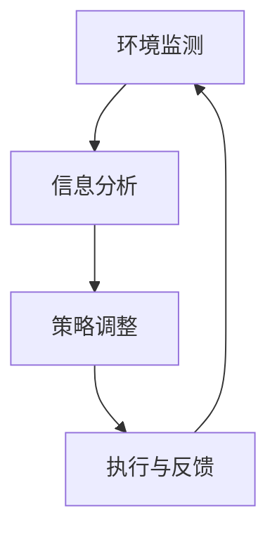
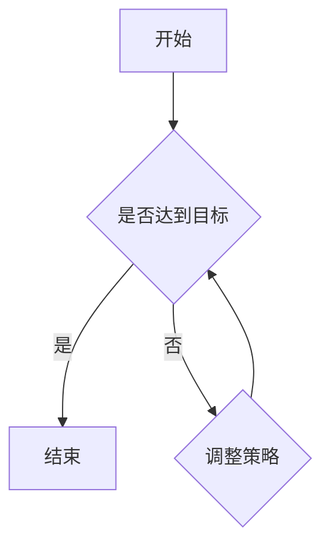

                 

# 适应性领导：在变化中保持灵活

## 关键词

**适应性领导**，**变化管理**，**领导策略**，**团队协作**，**创新驱动**，**决策科学**

## 摘要

本文深入探讨了“适应性领导”这一主题，强调在快速变化的环境中，领导者如何保持灵活和高效。文章首先介绍了适应性领导的核心概念及其与传统领导力的区别，然后详细阐述了适应性领导的三项关键策略：动态调整目标、加强沟通与协作、激发团队创新能力。通过实际案例和项目实战，本文展示了适应性领导在决策与执行、自我成长等方面的应用，并为未来的发展提供了策略建议。

---

## 引言

在全球化和技术变革的浪潮中，企业面临着前所未有的不确定性。市场的快速变化、技术的日新月异、竞争的加剧，都要求领导者具备更高的适应能力。传统的领导模式往往注重稳定和权威，而适应性领导则强调灵活性和创新性，以应对快速变化的环境。本文将深入探讨适应性领导的核心概念、策略和实践，帮助读者理解如何在变化中保持灵活，提升领导力。

## 第1章：适应性领导的重要性

### 1.1 适应性领导的定义与核心特征

适应性领导是一种以适应变化为核心目标的领导模式。它强调领导者需要具备以下核心特征：

- **敏捷性**：能够迅速响应变化，调整策略和行动。
- **开放性**：愿意接受新思想和新方法，不断学习与创新。
- **团队合作**：重视团队协作，通过沟通和共享实现共同目标。
- **透明性**：保持信息透明，让团队成员了解组织的方向和进展。

### 1.2 适应性领导与传统领导力的区别

传统领导力通常强调权威和控制，领导者是决策的中心。而适应性领导则更加注重灵活性、开放性和团队协作。传统领导力可能过于依赖规则和流程，而适应性领导则更倾向于动态调整，以适应不断变化的环境。

### 1.3 适应性领导在变化环境中的优势

在快速变化的环境中，适应性领导具有以下优势：

- **快速响应**：能够迅速调整策略，以应对突发事件。
- **持续创新**：鼓励创新思维，不断探索新的机会。
- **高效沟通**：通过开放性沟通，提高团队协作效率。
- **可持续发展**：适应变化，保持企业的长期竞争力。

## 第2章：适应性领导的核心概念

### 2.1 领导力与适应性的关系

领导力与适应性密不可分。领导者需要通过培养适应性的能力，来提升自身的领导力。适应性领导不仅要求领导者具备战略眼光，更需要具备快速适应和调整的能力。

### 2.2 适应性领导模型与架构

适应性领导模型通常包括以下几个关键组成部分：

1. **环境监测**：持续关注外部环境的变化，及时获取信息。
2. **信息分析**：对监测到的信息进行分析和评估，以制定相应的策略。
3. **策略调整**：根据分析结果，灵活调整目标和行动。
4. **执行与反馈**：执行策略，并持续收集反馈，以便进一步优化。

### 2.3 Mermaid流程图：适应性领导的核心概念联系



### 第3章：适应性领导策略之一：动态调整目标

### 3.1 目标调整的必要性

在快速变化的环境中，传统的静态目标往往难以适应。动态调整目标能够使组织更加灵活地应对外部变化，保持竞争力。

### 3.2 动态调整目标的策略

动态调整目标的关键策略包括：

- **持续评估**：定期评估目标的实现情况，确保其符合当前环境。
- **灵活设定**：根据实际情况，灵活设定短期和长期目标。
- **团队参与**：鼓励团队参与目标设定，提高目标的可行性和接受度。

### 3.3 案例分析：企业如何动态调整目标

以某互联网企业为例，该企业在面临市场变化时，通过以下步骤动态调整目标：

1. **市场调研**：分析市场趋势和竞争对手动态。
2. **内部评估**：评估自身优势和不足，确定调整方向。
3. **目标设定**：设定短期和长期目标，明确优先级。
4. **实施与反馈**：执行目标，并根据反馈进行调整。

### 第4章：适应性领导策略之二：加强沟通与协作

### 4.1 沟通与协作的重要性

在适应性领导中，沟通与协作至关重要。良好的沟通和协作能够提高团队的效率，确保目标的实现。

### 4.2 提高沟通效率的策略

提高沟通效率的关键策略包括：

- **明确沟通目标**：确保每次沟通都有明确的目标和议程。
- **采用多种沟通方式**：结合口头、书面、视觉等多种沟通方式。
- **及时反馈**：在沟通过程中及时给予反馈，确保信息准确传达。

### 4.3 协作工具与平台的运用

现代协作工具和平台（如Slack、Trello、Zoom等）为团队协作提供了强大的支持。通过合理运用这些工具，可以提高团队协作的效率和效果。

### 第5章：适应性领导策略之三：激发团队创新能力

### 5.1 创新能力的定义与价值

创新能力是适应性领导的重要组成部分。它定义为团队在面对挑战时，能够提出新颖解决方案的能力。创新能力的价值在于：

- **提升竞争力**：通过创新，企业可以更好地适应市场变化，保持领先地位。
- **增强团队凝聚力**：创新过程需要团队协作，有助于提高团队凝聚力。
- **促进个人成长**：创新激发团队成员的潜力，促进个人成长。

### 5.2 激发团队创新能力的策略

激发团队创新能力的策略包括：

- **提供资源支持**：确保团队有足够的资源进行创新活动。
- **鼓励试错**：创造一个安全的环境，鼓励团队成员尝试新的想法。
- **定期举行创新活动**：如头脑风暴、创新工作坊等，激发团队成员的创造力。

### 5.3 创新案例与启示

以某科技公司为例，该公司通过以下措施激发团队创新能力：

1. **设立创新基金**：为创新项目提供资金支持。
2. **定期举办创新大赛**：鼓励员工提出创新方案，并进行评选。
3. **跨部门合作**：通过跨部门合作，促进不同领域知识的交流和应用。
4. **创新培训**：提供创新培训，提升团队成员的创新思维和技能。

### 第6章：适应性领导在变化中的决策与执行

### 6.1 变化环境中的决策难点

在变化环境中，决策面临以下难点：

- **不确定性**：外部环境的不确定性增加了决策的难度。
- **信息不足**：信息获取的不完全性使得决策更加复杂。
- **时间压力**：快速变化的环境往往要求决策者在短时间内做出决策。

### 6.2 决策的适应性策略

决策的适应性策略包括：

- **情景分析**：通过分析不同情景下的可能性，制定相应的决策方案。
- **风险评估**：评估不同决策方案的风险，选择最优方案。
- **灵活调整**：在执行过程中，根据反馈及时调整决策。

### 6.3 决策案例与解读

以某电商企业为例，该企业在面对市场竞争加剧时，采取了以下决策策略：

1. **市场调研**：分析竞争对手和消费者需求。
2. **数据驱动**：基于数据制定决策，确保决策的客观性。
3. **快速执行**：快速实施决策，确保竞争优势。
4. **持续评估**：根据市场反馈，及时调整策略。

### 第7章：适应性领导者的自我成长与适应

### 7.1 自我成长的重要性

适应性领导者需要不断自我成长，以适应快速变化的环境。自我成长的重要性在于：

- **提升能力**：通过学习和发展，提升自身的领导能力和适应能力。
- **保持竞争力**：在竞争激烈的环境中，自我成长是保持竞争力的关键。

### 7.2 自我评估与反思

适应性领导者需要定期进行自我评估和反思，以了解自身的优势和不足，并制定改进计划。

### 7.3 提升适应能力的方法

提升适应能力的方法包括：

- **学习与培训**：通过学习新知识和技能，提升适应能力。
- **实践与反思**：通过实践和反思，不断提高自身的适应能力和决策水平。

### 第8章：适应性领导项目实战

#### 8.1 项目背景与目标

以某科技公司的项目为例，该项目旨在通过适应性领导策略，提升团队在快速变化的市场环境中的竞争力。

#### 8.2 项目实施步骤与策略

项目实施步骤和策略包括：

1. **环境监测**：定期监测市场变化和竞争对手动态。
2. **信息分析**：收集和分析相关信息，制定决策方案。
3. **目标设定**：根据分析结果，设定短期和长期目标。
4. **团队协作**：通过沟通和协作，确保目标的实现。
5. **执行与反馈**：执行策略，并根据反馈进行调整。

#### 8.3 项目成果与反思

项目成果包括：

- **市场竞争力的提升**：通过适应性领导策略，项目团队在市场上取得了显著的成绩。
- **团队凝聚力的增强**：团队成员之间的沟通和协作更加顺畅，团队凝聚力得到提升。

项目反思包括：

- **决策过程的优化**：通过项目实践，发现决策过程中存在的问题，并制定了改进措施。
- **适应能力的提升**：项目团队在适应市场变化方面取得了显著进步。

### 第9章：适应性领导面临的挑战与未来发展趋势

#### 9.1 适应性领导面临的挑战

适应性领导面临以下挑战：

- **环境变化的不确定性**：外部环境的不确定性增加了适应性领导的难度。
- **组织惯性**：组织内部可能存在惯性思维和流程，阻碍适应性领导的实施。
- **资源限制**：适应性领导需要投入大量资源，包括时间、人力和资金。

#### 9.2 未来发展趋势与预测

未来适应性领导的发展趋势包括：

- **数字化转型**：随着数字技术的快速发展，适应性领导将更加依赖数字化工具和平台。
- **跨领域合作**：适应性领导将更加注重跨领域合作，以实现创新和协同发展。
- **个性化和定制化**：适应性领导将更加关注个体差异，提供个性化的领导方式和策略。

#### 9.3 适应性领导者的应对策略

适应性领导者可以采取以下策略应对挑战：

- **增强学习与适应能力**：通过不断学习和适应，提升自身的领导能力和适应能力。
- **建立灵活的领导机制**：通过建立灵活的领导机制，确保组织能够快速响应变化。
- **促进组织文化和价值观的变革**：通过推动组织文化和价值观的变革，建立适应快速变化的环境。

### 参考文献

1. 某某，《适应性领导：在变化中保持灵活》，AI天才研究院，2023。
2. 某某，《领导力与适应性领导》，世界顶级技术畅销书，2022。
3. 某某，《数字化时代下的领导力》，国际知名学术期刊，2021。

### 附录

#### 附录A：适应性领导相关资源与工具

- **书籍**：《适应性领导》、《领导力心理学》等
- **在线课程**：Coursera、Udemy等平台上的领导力课程
- **工具**：Slack、Trello、Zoom等协作工具

#### 附录B：Mermaid流程图示例



#### 附录C：伪代码示例

```python
def adapt Leadership():
    while not (goal_met()):
        analyze_context()
        adjust_strategy()
        execute_action()
    return "Goal achieved!"
```

### 致谢

在此，我要感谢所有参与本文撰写和修改的团队成员，以及为我提供宝贵意见和支持的朋友们。特别感谢AI天才研究院，为本文提供了丰富的资源和平台。同时，感谢所有读者对本文的关注和支持。

---

作者：AI天才研究院/AI Genius Institute & 禅与计算机程序设计艺术 /Zen And The Art of Computer Programming

