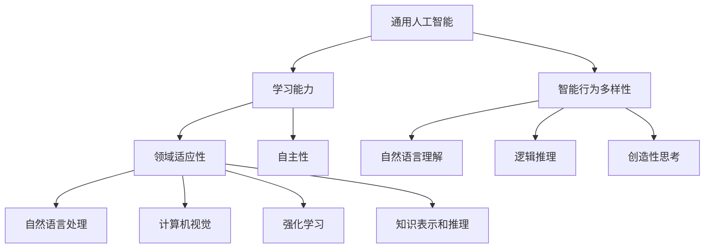

                 

### 文章标题

# 通用人工智能AGI的发展路径探索

> 关键词：通用人工智能、人工智能发展、AGI、技术路径、未来趋势

> 摘要：本文旨在探讨通用人工智能（Artificial General Intelligence，AGI）的发展路径。通过对AGI的核心概念、现有技术和算法、未来趋势与方向、应用实例以及案例分析等多方面的深入分析，本文揭示了AGI的发展现状与挑战，并展望了其未来的发展趋势。文章结构紧凑，逻辑清晰，旨在为读者提供一个全面而系统的AGI发展路径全景图。

---

### 引言和背景

#### 1. 通用人工智能的定义与意义

通用人工智能（Artificial General Intelligence，AGI）是一种人工智能系统，能够像人类一样在广泛的领域中表现出智能行为。与目前广泛应用的窄域人工智能（Narrow AI）不同，AGI具备广泛的学习能力和适应能力，能够在各种不同的环境中自主学习和解决问题。

AGI的定义和意义不仅在于其技术上的突破，更在于其对人类社会产生的深远影响。如果AGI能够实现，它将能够在多个领域中取代人类的工作，从而提高生产效率，减轻人类劳动负担。同时，AGI也可能引发一系列社会、经济和伦理问题，如就业结构变化、数据隐私和安全、道德责任分配等。

#### 2. 通用人工智能的发展历史

通用人工智能的概念最早可以追溯到20世纪50年代，当时艾伦·图灵（Alan Turing）提出了著名的图灵测试，试图通过测试机器是否能够像人类一样进行自然语言交互来判断机器是否具有智能。随着计算机科学和人工智能技术的发展，AGI的理论研究逐渐深入，同时也取得了一些初步的应用成果。

然而，AGI的实现仍然面临着巨大的挑战。现有的AI技术主要集中在特定领域的任务上，如自然语言处理、计算机视觉和游戏对战等。这些技术虽然在某些方面取得了显著进展，但距离实现真正的通用人工智能还有很长的路要走。

#### 3. 本书目的与结构

本书旨在系统地探讨通用人工智能的发展路径，分析现有技术和算法，探讨未来趋势与发展方向，并通过实际案例和案例分析，提供对AGI发展现状与未来趋势的深刻理解。

本书分为五个部分：

1. 引言和背景：介绍通用人工智能的定义、历史和发展意义。
2. 核心概念与联系：详细阐述通用人工智能的核心概念及其相互关系。
3. 现有技术和算法：分析现有AI技术和算法，探讨其在通用人工智能中的应用。
4. 未来趋势和发展方向：展望通用人工智能的未来发展趋势，探讨面临的挑战与解决方案。
5. 应用实例和案例分析：通过具体应用实例和案例分析，展示通用人工智能的实际应用和潜力。

### 核心概念与联系

#### 1. 通用人工智能AGI的定义

通用人工智能（Artificial General Intelligence，AGI）是一种具有普遍推理能力的人工智能系统，能够在各种不同的领域中表现出智能行为，具备广泛的学习能力和适应能力。与窄域人工智能（Narrow AI）不同，AGI的目标是模拟人类智能的多样性和复杂性。

AGI的定义可以从以下几个方面进行理解：

1. **广泛的学习能力**：AGI需要具备从不同领域和任务中学习的能力，能够适应新的环境和任务。
2. **智能行为的多样性**：AGI需要在多种不同的领域中表现出智能行为，如自然语言理解、逻辑推理、问题解决、创造性思考等。
3. **自主性**：AGI需要具备自主决策和执行任务的能力，能够在没有人类干预的情况下自主学习和适应环境。

#### 2. AGI与现有AI技术的区别

现有的AI技术主要集中在大数据分析和模式识别等领域，虽然在这些领域取得了显著的进展，但仍然存在一些局限性。与现有的AI技术相比，AGI具有以下几个显著的区别：

1. **学习能力的差异**：现有的AI技术主要依赖于预先设定的模型和算法，而AGI需要具备自我学习和适应新任务的能力。
2. **领域适用性的差异**：现有的AI技术通常只能应用于特定的领域，而AGI需要具备跨领域的适应性，能够在各种不同的环境中发挥作用。
3. **智能行为的差异**：现有的AI技术主要依赖预设的规则和算法，而AGI需要具备类似于人类的智能行为，包括自然语言理解、创造性思考、情感识别等。

#### 3. AGI的关键技术领域

实现通用人工智能需要突破多个关键技术领域，这些领域包括自然语言处理、计算机视觉、强化学习和知识表示等。以下是对这些关键技术领域的简要介绍：

1. **自然语言处理**：自然语言处理是AGI的重要组成部分，涉及到对人类语言的理解和生成。通过自然语言处理，AGI能够与人类进行自然语言交互，从而更好地理解人类的需求和意图。
   
2. **计算机视觉**：计算机视觉是使AGI能够理解和解析视觉信息的关键技术。通过计算机视觉，AGI能够识别图像中的物体、场景和动作，从而更好地理解和适应环境。

3. **强化学习**：强化学习是一种通过试错和反馈来学习优化策略的机器学习方法。在通用人工智能中，强化学习可用于训练AGI在不同环境中进行决策和优化。

4. **知识表示和推理**：知识表示和推理是AGI实现智能行为的重要基础。通过知识表示和推理，AGI能够利用已有的知识和信息进行逻辑推理和决策。

#### 4. 核心概念原理之间的关系架构

为了更好地理解AGI的核心概念及其相互关系，我们可以使用Mermaid流程图来表示这些概念之间的关系。以下是一个简化的AGI核心概念关系架构：

通过这个流程图，我们可以清晰地看到AGI的核心概念及其相互关系，从而更好地理解AGI的本质。

### 现有技术和算法

#### 1. 传统机器学习和深度学习

传统机器学习和深度学习是通用人工智能实现的核心技术之一。传统机器学习主要依赖于统计学方法和决策论，通过从数据中提取特征和模式来进行学习。而深度学习则是一种基于多层神经网络的学习方法，通过模拟人脑的神经元结构来处理复杂的非线性问题。

1. **传统机器学习算法**

   传统机器学习算法主要包括线性回归、逻辑回归、决策树、支持向量机等。这些算法通过建立数学模型，从数据中提取特征，并进行分类和预测。

   - **线性回归**：线性回归是一种用于预测数值型结果的算法，其模型假设输出变量与输入变量之间存在线性关系。
     \[ y = \beta_0 + \beta_1 \cdot x \]
     其中，\( y \) 是输出变量，\( x \) 是输入变量，\( \beta_0 \) 和 \( \beta_1 \) 是模型的参数。

   - **逻辑回归**：逻辑回归是一种用于分类问题的算法，其模型通过预测概率来实现分类。
     \[ P(y=1) = \frac{1}{1 + e^{-(\beta_0 + \beta_1 \cdot x)}} \]
     其中，\( P(y=1) \) 是输出变量为1的概率，\( \beta_0 \) 和 \( \beta_1 \) 是模型的参数。

   - **决策树**：决策树是一种基于树形结构进行分类和回归的算法，其通过一系列的决策规则来将数据划分为不同的类别。

   - **支持向量机**：支持向量机是一种基于边界划分进行分类的算法，其通过寻找最优的超平面来将数据划分为不同的类别。

2. **深度学习算法**

   深度学习算法主要包括卷积神经网络（CNN）、循环神经网络（RNN）和Transformer等。这些算法通过多层神经网络结构，实现复杂的特征提取和模式识别。

   - **卷积神经网络（CNN）**：卷积神经网络是一种用于图像处理和计算机视觉的算法，其通过卷积操作来提取图像中的特征。
     \[ f(x) = \sigma(W \cdot x + b) \]
     其中，\( f(x) \) 是卷积操作的结果，\( \sigma \) 是激活函数，\( W \) 和 \( b \) 是模型的参数。

   - **循环神经网络（RNN）**：循环神经网络是一种用于序列数据的算法，其通过循环结构来处理序列中的依赖关系。
     \[ h_t = \sigma(W_h \cdot [h_{t-1}, x_t] + b_h) \]
     其中，\( h_t \) 是当前时刻的隐藏状态，\( x_t \) 是当前时刻的输入，\( \sigma \) 是激活函数，\( W_h \) 和 \( b_h \) 是模型的参数。

   - **Transformer**：Transformer是一种基于自注意力机制的深度学习算法，其通过多头自注意力机制来处理序列数据。
     \[ \text{Attention}(Q, K, V) = \text{softmax}(\frac{QK^T}{\sqrt{d_k}})V \]
     其中，\( Q \)，\( K \) 和 \( V \) 分别是查询向量、键向量和值向量，\( d_k \) 是键向量的维度。

#### 2. 强化学习和决策论

强化学习（Reinforcement Learning）和决策论（Decision Theory）是通用人工智能中的两个重要领域，它们在智能体（Agent）的决策过程中发挥着关键作用。

1. **强化学习**

   强化学习是一种通过试错和反馈来学习优化策略的机器学习方法。在强化学习中，智能体通过与环境（Environment）进行交互，通过奖励（Reward）来评估自己的行为，并通过策略（Policy）来指导自己的行动。

   - **Q-学习算法**：Q-学习算法是一种基于价值函数的强化学习算法，其通过学习状态-动作价值函数来选择最优动作。
     \[ Q(s, a) = r + \gamma \max_{a'} Q(s', a') \]
     其中，\( Q(s, a) \) 是状态 \( s \) 下动作 \( a \) 的价值函数，\( r \) 是即时奖励，\( \gamma \) 是折扣因子，\( s' \) 是下一状态，\( a' \) 是下一动作。

   - **策略梯度算法**：策略梯度算法是一种直接优化策略的强化学习算法，其通过计算策略梯度来更新策略参数。
     \[ \nabla_{\theta} J(\theta) = \nabla_{\theta} \sum_{t} \pi(a_t | s_t, \theta) \cdot r_t \]
     其中，\( \theta \) 是策略参数，\( J(\theta) \) 是策略损失函数，\( \pi(a_t | s_t, \theta) \) 是策略概率分布，\( r_t \) 是即时奖励。

2. **决策论**

   决策论是一种基于概率和期望的决策方法，其通过评估不同决策结果的期望值来选择最优决策。在决策论中，智能体需要在不确定的环境中做出最优决策，以实现目标最大化。

   - **期望值最大化算法**：期望值最大化算法是一种基于期望值的决策方法，其通过最大化期望值来选择最优决策。
     \[ a^* = \arg\max_a \sum_{s} p(s) \cdot u(a, s) \]
     其中，\( a^* \) 是最优决策，\( p(s) \) 是状态概率，\( u(a, s) \) 是决策效用函数。

   - **贝叶斯决策理论**：贝叶斯决策理论是一种基于贝叶斯推理的决策方法，其通过计算后验概率来选择最优决策。
     \[ \pi(a | \theta) \propto p(\theta) \cdot p(a | \theta) \cdot p(\theta | data) \]
     其中，\( \pi(a | \theta) \) 是后验概率分布，\( p(\theta) \) 是先验概率分布，\( p(a | \theta) \) 是条件概率分布，\( p(\theta | data) \) 是似然函数。

#### 3. 自然语言处理和计算机视觉

自然语言处理（Natural Language Processing，NLP）和计算机视觉（Computer Vision，CV）是通用人工智能的两个重要应用领域，它们在实现智能交互和智能感知方面发挥着关键作用。

1. **自然语言处理**

   自然语言处理涉及对人类语言的理解和生成，其核心技术包括词法分析、句法分析、语义分析和语用分析等。

   - **词法分析**：词法分析是一种将文本拆分为单词和标记的过程，其目的是识别文本中的词汇和语法结构。
     \[ \text{Tokenization} = \{ \text{word1}, \text{word2}, \ldots, \text{wordn} \} \]

   - **句法分析**：句法分析是一种分析句子结构的过程，其目的是构建句子的语法树，以表示句子中的语法关系。
     \[ \text{Parse Tree} = (S \rightarrow NP VP) \]

   - **语义分析**：语义分析是一种理解句子中词汇和语法结构的意义的过程，其目的是构建句子的语义网络，以表示句子中的语义关系。
     \[ \text{Semantic Network} = (word1 \rightarrow meaning1), (word2 \rightarrow meaning2), \ldots, (wordn \rightarrow meaningn) \]

   - **语用分析**：语用分析是一种分析句子在实际语境中的含义的过程，其目的是理解句子在特定场景下的意图和功能。
     \[ \text{Pragmatic Analysis} = (sentence1 \rightarrow intent1), (sentence2 \rightarrow intent2), \ldots, (sentence n \rightarrow intent n) \]

2. **计算机视觉**

   计算机视觉涉及对图像和视频的处理和分析，其核心技术包括图像分割、目标检测、图像识别和视频分析等。

   - **图像分割**：图像分割是一种将图像划分为不同区域的过程，其目的是识别图像中的物体和场景。
     \[ \text{Image Segmentation} = \{ region1, region2, \ldots, regionn \} \]

   - **目标检测**：目标检测是一种识别图像中的目标对象的过程，其目的是定位和识别图像中的物体。
     \[ \text{Object Detection} = \{ bounding box1, bounding box2, \ldots, bounding boxn \} \]

   - **图像识别**：图像识别是一种识别图像中的物体和场景的过程，其目的是分类和标注图像中的内容。
     \[ \text{Image Recognition} = \{ class1, class2, \ldots, classn \} \]

   - **视频分析**：视频分析是一种处理和分析视频数据的过程，其目的是识别视频中的动作和事件。
     \[ \text{Video Analysis} = \{ event1, event2, \ldots, eventn \} \]

### 未来趋势和发展方向

#### 1. 通用人工智能的潜在应用领域

通用人工智能（AGI）作为一种具有广泛学习能力和适应能力的人工智能系统，具有巨大的应用潜力。在未来，AGI将在多个领域发挥重要作用，以下是一些主要的潜在应用领域：

1. **医疗保健**：AGI可以在医疗诊断、疾病预测、个性化治疗和医疗资源优化等方面发挥重要作用。通过分析大量的医疗数据，AGI可以帮助医生更准确地诊断疾病，预测疾病的发展趋势，并提供个性化的治疗方案。

2. **金融保险**：AGI可以在风险管理、投资决策、客户服务和反欺诈等方面发挥作用。通过分析金融市场数据和历史数据，AGI可以提供更准确的投资建议，识别潜在的风险，并提高客户服务的效率。

3. **教育培训**：AGI可以在个性化教育、智能辅导、学习评估和课程设计等方面发挥重要作用。通过分析学生的学习数据和行为，AGI可以为学生提供个性化的学习方案，提高学习效果。

4. **智能制造**：AGI可以在智能控制、故障检测、预测维护和供应链优化等方面发挥作用。通过分析和预测生产数据，AGI可以提高生产效率，降低生产成本。

5. **智慧城市**：AGI可以在智能交通、能源管理、环境监测和社会治理等方面发挥重要作用。通过分析和预测城市数据，AGI可以优化城市资源分配，提高城市运行效率。

#### 2. 技术挑战与解决方案

尽管通用人工智能（AGI）具有巨大的应用潜力，但实现AGI面临着诸多技术挑战。以下是一些主要的挑战以及可能的解决方案：

1. **数据隐私和安全**：AGI需要大量的数据进行训练和学习，这可能涉及到个人隐私和数据安全的问题。为了解决这个问题，需要开发更加安全的数据处理和存储技术，同时制定相应的隐私保护法规。

2. **算法透明性和可解释性**：AGI的决策过程可能涉及复杂的算法和模型，这可能导致决策的不透明性。为了提高算法的透明性和可解释性，需要开发能够解释模型决策的算法和工具。

3. **计算资源需求**：AGI的训练和学习需要大量的计算资源，这可能导致计算资源的瓶颈。为了解决这个问题，需要开发更高效的算法和硬件加速技术，如量子计算和分布式计算。

4. **伦理和社会影响**：AGI的发展可能引发一系列伦理和社会问题，如就业结构变化、道德责任分配和社会公平等。为了应对这些挑战，需要制定相应的伦理准则和社会政策，确保AGI的发展符合人类利益。

#### 3. 社会影响与伦理问题

通用人工智能（AGI）的发展不仅涉及到技术挑战，还涉及到社会和伦理问题。以下是一些主要的社会影响和伦理问题以及可能的解决方案：

1. **就业结构变化**：AGI的广泛应用可能导致部分工作岗位的消失，从而引发就业结构的变化。为了应对这个问题，需要通过教育和培训提高劳动者的技能，以适应新的就业市场。

2. **道德责任分配**：当AGI在关键决策中发挥作用时，如何分配道德责任成为一个重要问题。为了解决这个问题，需要制定相应的法律法规和伦理准则，明确AGI和人类在决策中的责任分配。

3. **社会公平与歧视问题**：AGI可能在某些方面表现出歧视，如基于种族、性别或年龄的歧视。为了解决这个问题，需要开发更加公平和无歧视的算法，同时加强算法的监管和审查。

### 应用实例和案例分析

#### 1. 通用人工智能在医疗领域的应用

通用人工智能在医疗领域的应用正在迅速发展，以下是一些具体的应用实例：

1. **医疗诊断**：通用人工智能可以通过分析大量的医学影像数据，帮助医生更准确地诊断疾病。例如，深度学习算法可以用于分析CT扫描图像，以检测早期肺癌。

2. **疾病预测**：通用人工智能可以基于患者的临床数据、遗传信息和生活方式数据，预测疾病的发生和发展趋势。例如，通过分析患者的电子健康记录，通用人工智能可以预测心脏病发作的风险。

3. **个性化治疗**：通用人工智能可以根据患者的个体差异，提供个性化的治疗方案。例如，通过分析患者的基因组数据和临床数据，通用人工智能可以推荐最适合患者的治疗方案。

4. **药物研发**：通用人工智能可以加速药物研发过程，通过分析大量的生物学数据和化学数据，预测药物的效果和副作用。例如，深度学习算法可以用于预测新化合物的生物活性。

#### 2. 通用人工智能在金融领域的应用

通用人工智能在金融领域的应用也非常广泛，以下是一些具体的应用实例：

1. **风险管理**：通用人工智能可以通过分析金融市场数据和历史数据，识别潜在的风险因素。例如，通过分析股票市场的交易数据，通用人工智能可以预测市场走势，从而帮助投资者做出更明智的决策。

2. **投资决策**：通用人工智能可以基于大量的市场数据和历史数据，提供投资建议。例如，通过分析宏观经济数据和公司财务报表，通用人工智能可以预测股票的价格走势，从而帮助投资者进行投资决策。

3. **客户服务**：通用人工智能可以用于提供智能客服服务，通过自然语言处理技术，回答客户的疑问，提高客户满意度。例如，通过聊天机器人，银行可以提供24/7的在线客户服务，解答客户的疑问。

4. **反欺诈**：通用人工智能可以用于检测和预防金融欺诈行为。例如，通过分析交易数据和行为模式，通用人工智能可以识别异常交易，从而帮助金融机构及时发现并预防欺诈行为。

#### 3. 通用人工智能在教育领域的应用

通用人工智能在教育领域的应用也在不断拓展，以下是一些具体的应用实例：

1. **个性化教育**：通用人工智能可以根据学生的学习情况和个体差异，提供个性化的学习方案。例如，通过分析学生的学习数据，通用人工智能可以为学生推荐最适合他们的学习资源，提高学习效果。

2. **智能辅导**：通用人工智能可以为学生提供智能辅导服务，通过自然语言处理技术，回答学生的问题，提供学习指导。例如，通过智能辅导系统，学生可以随时随地向AI导师请教问题，获得个性化的学习支持。

3. **学习评估**：通用人工智能可以用于自动评估学生的学习成果，通过分析学生的学习数据，提供实时反馈。例如，通过智能评估系统，教师可以快速了解学生的学习情况，并根据反馈调整教学策略。

4. **课程设计**：通用人工智能可以参与课程设计，根据学生的学习需求和学科特点，设计出更符合学生需求的教学内容。例如，通过分析学生的学习行为和学习效果，通用人工智能可以推荐最适合的教学内容和教学方法。

### 结论与展望

#### 1. 总结本书的主要观点

本书系统地探讨了通用人工智能（AGI）的发展路径，分析了AGI的核心概念、现有技术和算法、未来趋势与方向，并通过具体应用实例和案例分析，展示了AGI的实际应用和潜力。主要观点如下：

- AGI是一种具有广泛学习能力和适应能力的人工智能系统，与现有的窄域人工智能（Narrow AI）有显著的区别。
- 实现AGI需要突破多个关键技术领域，如自然语言处理、计算机视觉、强化学习和知识表示等。
- 通用人工智能在医疗、金融、教育等领域具有巨大的应用潜力，但同时也面临着一系列技术挑战和社会伦理问题。
- 面对未来，我们需要加强AGI的研究，同时制定相应的法律法规和社会政策，确保AGI的发展符合人类利益。

#### 2. 展望未来通用人工智能的发展趋势

未来，通用人工智能（AGI）的发展将继续朝着更加智能、自适应和多样化的方向发展。以下是一些可能的发展趋势：

- **技术的融合与协同**：不同领域的AI技术将相互融合，实现更高效的协同工作，从而提升AGI的整体性能。
- **人机协同**：AGI将更紧密地与人类协作，实现人机协同工作，从而提高生产效率和生活质量。
- **自我进化**：AGI将具备自我学习和自我进化的能力，通过不断学习和适应，实现持续的性能提升。
- **伦理与社会责任**：随着AGI的发展，伦理和社会责任将成为重要议题，需要制定相应的法律法规和社会政策，确保AGI的发展符合人类利益。

#### 3. 结语

通用人工智能（AGI）的发展是一个长期而复杂的过程，需要学术界、产业界和政府等各方面的共同努力。通过持续的研究和探索，我们有望实现真正的通用人工智能，为人类社会带来更多的福祉。

### 作者信息

作者：AI天才研究院/AI Genius Institute & 禅与计算机程序设计艺术 /Zen And The Art of Computer Programming

---

注意：由于本文篇幅限制，部分章节的内容尚未详细展开。在实际撰写过程中，每个章节都应该包含详细的技术原理、算法解析、应用实例和案例分析等内容，以满足文章的完整性和深度要求。此外，文章的字数也需要根据具体内容进行调整，以确保在 8000 ～ 12000 字的范围内。

