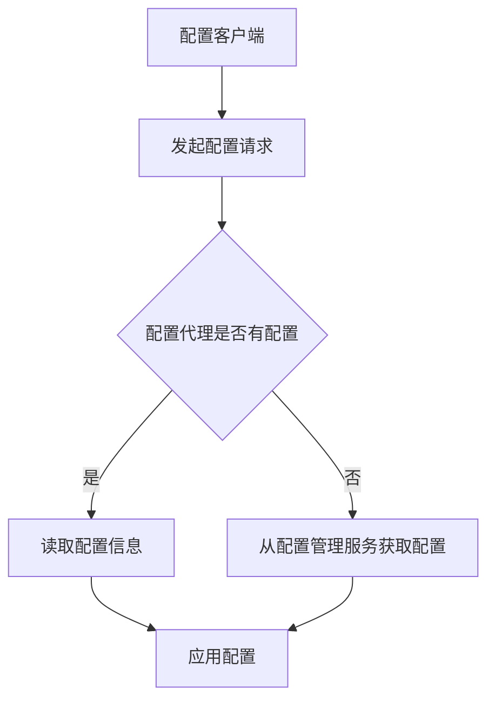
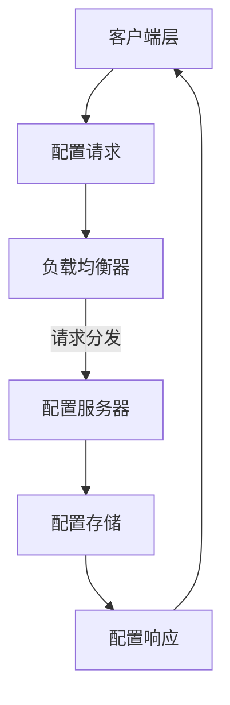

                 

### 文章标题：配置中心：集中管理LLM应用的配置

> 关键词：配置中心，集中管理，LLM应用，配置管理，配置自动化，配置安全性

> 摘要：本文将深入探讨配置中心在集中管理LLM应用配置方面的重要性。通过介绍配置中心的基础概念、架构设计、配置管理原理和工具，以及配置中心的实战应用和案例分析，帮助读者全面了解和掌握配置中心在实际项目中的应用。本文旨在为LLM应用的配置管理提供系统性、实用性和前瞻性的指导。

----------------------------------------------------------------

## 第一部分：配置中心基础

### 1.1 配置中心概述

配置中心是现代软件系统中一个至关重要的组件，它主要用于集中管理系统中各类配置信息，确保系统能够在不同的环境（如开发、测试、生产等）中正常运行。配置中心与传统的配置管理有显著区别，后者更多侧重于版本控制和变更管理。

配置中心的作用和重要性体现在以下几个方面：

1. **环境隔离**：通过配置中心，可以轻松实现不同环境之间的配置隔离，确保各个环境的配置互不干扰。
2. **灵活性**：配置中心使得系统能够快速适应环境变化，无需频繁修改代码或重新部署。
3. **一致性**：配置中心可以确保所有环境中的配置保持一致，降低配置错误的概率。
4. **可扩展性**：配置中心支持配置信息的动态更新和扩展，方便系统功能迭代。

配置中心的组成部分通常包括：

- **配置存储**：负责存储和管理各类配置信息。
- **配置服务器**：负责提供配置信息的读取和更新功能。
- **配置客户端**：负责从配置服务器获取配置信息，并在系统中应用这些配置。

配置中心在软件系统中的架构通常包括以下层次：

1. **客户端层**：客户端通过配置中心接口获取配置信息。
2. **服务端层**：服务端负责存储配置信息并提供接口服务。
3. **数据库层**：配置信息存储在数据库中，保证数据的持久化和安全性。

配置中心的部署方式可以根据具体需求进行选择，常见的有单机部署、分布式部署和云部署等。每种部署方式都有其优缺点，需要根据实际情况进行权衡。

### 1.2 配置中心的架构

配置中心的架构设计是确保其稳定、高效运行的关键。一个典型的配置中心架构包括以下几个主要组成部分：

- **配置管理服务**：作为配置中心的核心组件，负责配置的存储、同步和更新。
- **配置存储**：通常使用数据库来存储配置信息，确保配置数据的持久化和安全性。
- **配置代理**：负责从配置管理服务获取配置信息，并将其应用到客户端系统中。
- **监控和告警**：实时监控配置中心的运行状态，并在异常情况下发出告警通知。

下面是一个简单的Mermaid流程图，展示了配置中心的基本工作流程：



在LLM应用中，配置中心的架构设计需要考虑以下几个关键因素：

1. **高性能**：由于LLM应用通常涉及大规模数据处理，配置中心需要能够快速响应配置请求。
2. **高可用性**：配置中心应具备故障转移和容错能力，确保配置信息在系统故障时仍能正常访问。
3. **安全性**：配置中心需要提供严格的认证和授权机制，防止未经授权的访问和配置篡改。
4. **可扩展性**：随着LLM应用的规模不断扩大，配置中心应能够无缝扩展，以应对更高的配置负载。

通过上述关键因素的设计，配置中心能够为LLM应用提供稳定、可靠和高效的配置管理服务，从而提高整个系统的性能和可靠性。

### 2. 配置中心在LLM应用中的应用

在LLM（大型语言模型）应用中，配置管理扮演着至关重要的角色。LLM应用通常需要处理大量的文本数据，进行复杂的模型训练和推理。这些应用对配置的灵活性和准确性有着极高的要求。

#### 2.1 LLM应用的配置需求

LLM应用的配置需求主要体现在以下几个方面：

1. **参数调整**：LLM模型的性能很大程度上取决于模型的参数设置。例如，学习率、批次大小、隐藏层大小等参数都需要精心调整。
2. **环境配置**：LLM应用运行的环境配置，如GPU使用、内存分配、网络连接等，对模型的训练和推理性能也有显著影响。
3. **数据预处理**：在LLM应用中，数据预处理也是一个关键环节。配置中心需要管理数据清洗、数据增强等预处理任务的配置。

参数调整对模型性能有着直接影响。例如，过小的学习率可能导致模型收敛缓慢，而过大的学习率则可能导致模型过度拟合。因此，合理的参数调整是提高模型性能的关键。

#### 2.2 配置中心的实现

配置中心在LLM应用中的实现可以分为以下几个步骤：

1. **配置存储**：首先，需要选择合适的配置存储方案。常用的配置存储方案包括数据库、文件系统和分布式缓存等。在实际应用中，通常选择具有高可用性和高性能的分布式缓存系统，如Redis或Consul。
2. **配置服务器**：配置服务器是配置中心的核心组件，负责接收和存储配置请求，并将配置信息推送到配置客户端。配置服务器通常采用微服务架构，以提高系统的可扩展性和可靠性。
3. **配置客户端**：配置客户端负责从配置服务器获取配置信息，并将其应用到LLM应用中。配置客户端可以是一个独立的进程，也可以集成到LLM应用的运行时环境中。

下面是一个简单的伪代码示例，展示了配置中心的基本工作流程：

```python
# 配置客户端伪代码
def get_configuration():
    # 从配置服务器获取配置
    config = config_server.get_config()
    return config

# 配置服务器伪代码
def get_config(config_id):
    # 从配置存储中获取配置
    config = config_storage.get_config(config_id)
    return config

def update_config(config_id, new_config):
    # 更新配置存储中的配置
    config_storage.update_config(config_id, new_config)
```

在实际应用中，配置中心还需要考虑以下几个方面：

1. **配置版本控制**：为了确保配置的稳定性和可追溯性，配置中心需要实现配置版本控制。通过版本控制，可以方便地回滚到之前的配置版本，从而避免因配置错误导致的应用故障。
2. **配置同步**：在分布式环境中，配置的同步是一个重要问题。配置中心需要确保所有节点上的配置保持一致，以避免因配置不同步导致的应用问题。
3. **配置变更通知**：当配置发生变更时，配置中心需要及时通知相关客户端，确保客户端能够及时更新配置。

通过配置中心，LLM应用可以实现灵活的配置管理，从而提高模型的训练和推理性能，降低系统维护成本。

### 2.3 配置中心在LLM应用中的具体应用场景

配置中心在LLM应用中有着广泛的应用场景，下面列举几个典型的应用场景：

1. **模型训练**：在模型训练过程中，配置中心可以动态调整模型的参数，如学习率、批次大小等，以优化模型性能。通过配置中心，可以方便地实现不同参数组合的实验，从而找到最优的模型参数。
2. **模型推理**：在模型推理过程中，配置中心可以调整推理环境配置，如GPU使用、内存分配等，以提高推理速度和准确率。例如，通过配置中心，可以动态调整模型推理的线程数，以充分利用硬件资源。
3. **数据预处理**：在数据预处理阶段，配置中心可以管理数据清洗、数据增强等预处理任务的配置。通过配置中心，可以方便地调整预处理参数，以提高数据质量，从而提升模型性能。
4. **环境配置**：配置中心可以管理LLM应用运行的环境配置，如数据库连接、API密钥等。通过配置中心，可以方便地更新环境配置，确保系统在各个环境中的正常运行。

#### 2.4 配置中心在LLM应用中的优势

配置中心在LLM应用中的优势主要体现在以下几个方面：

1. **灵活性和可扩展性**：配置中心使得LLM应用的配置管理变得灵活和可扩展。通过配置中心，可以方便地调整和扩展配置，从而适应不同的应用场景和需求。
2. **一致性**：配置中心可以确保各个环境中的配置保持一致，避免因配置不一致导致的应用问题。
3. **高效性**：配置中心提供了高效的配置管理机制，可以快速响应配置请求，从而提高系统的运行效率和性能。
4. **安全性**：配置中心提供了严格的认证和授权机制，确保配置信息的安全性，防止配置泄露和篡改。

通过配置中心，LLM应用可以更加灵活、高效和稳定地运行，从而提高模型的训练和推理性能，降低系统维护成本。

## 第二部分：LLM应用配置管理

### 3. 配置管理原理

配置管理是软件工程中一个重要的领域，旨在确保软件系统的配置信息在整个生命周期中保持一致性、可追溯性和可控性。在LLM应用中，配置管理尤为关键，因为LLM模型的性能和运行稳定性很大程度上依赖于各种配置参数和环境设置。

#### 3.1 配置管理概述

配置管理的定义可以概括为：对系统中各种配置信息进行识别、管理、变更和控制的过程。配置管理的主要目标包括：

1. **一致性**：确保系统在不同环境（如开发、测试、生产）中的配置保持一致，减少因配置不一致导致的问题。
2. **可追溯性**：记录配置变更的历史，便于追踪问题来源，提高系统维护的可追溯性。
3. **可控性**：通过规范的配置管理流程，确保配置变更的规范性和可控性，降低配置错误的风险。
4. **灵活性**：提供灵活的配置管理机制，方便快速调整和优化配置，以适应不同的需求和环境变化。

配置管理在LLM应用中的作用主要体现在以下几个方面：

1. **模型参数调整**：配置管理使得LLM模型的训练和推理参数可以灵活调整，从而优化模型性能。
2. **环境配置管理**：配置管理可以方便地管理LLM应用的运行环境配置，如硬件资源分配、网络连接等。
3. **数据预处理配置**：配置管理可以帮助管理数据预处理过程中的各种参数和操作，提高数据处理效率和质量。

#### 3.2 配置管理的关键概念

配置管理中涉及几个关键概念，包括配置项、配置版本和配置变更管理。

1. **配置项**：配置项是指系统中的可配置信息，如参数、环境变量、数据库连接字符串等。配置项是配置管理的基本单元，是系统配置的核心内容。
2. **配置版本**：配置版本是指配置项的不同状态或版本。配置版本管理是配置管理的重要组成部分，它确保配置变更的可追溯性和可控性。常见的配置版本管理策略包括线性版本、分支版本等。
3. **配置变更管理**：配置变更管理是指对配置项的修改、更新和回滚的过程。配置变更管理需要遵循一定的流程和规范，以确保配置变更的合法性和安全性。

配置变更管理的流程通常包括以下几个步骤：

1. **变更请求**：用户或开发人员提出配置变更请求，描述需要变更的配置项和变更理由。
2. **变更评估**：配置管理员对变更请求进行评估，确定变更的可行性和影响范围。
3. **变更实施**：根据评估结果，实施配置变更，并将变更后的配置项应用到系统中。
4. **变更验证**：验证配置变更是否达到预期效果，确保系统正常运行。
5. **变更记录**：记录配置变更的历史，包括变更请求、评估结果、实施过程和验证结果等，以便后续跟踪和审计。

#### 3.3 配置管理工具

配置管理工具是实现配置管理目标的重要手段。在LLM应用中，选择合适的配置管理工具对于确保配置的灵活性和可维护性至关重要。以下是几种常见的配置管理工具：

1. **Git**：Git是版本控制系统，常用于代码管理和版本控制。Git可以用于配置项的版本管理，通过创建分支、合并和提交等操作，实现配置的变更和回滚。
2. **Ansible**：Ansible是一种自动化部署和配置管理工具，适用于Linux和Unix系统。Ansible可以通过配置文件定义和管理系统的配置，实现自动化部署和配置更新。
3. **Puppet**：Puppet是一种自动化配置管理工具，适用于大规模的Linux和Unix系统管理。Puppet通过定义配置模板，自动在目标系统中应用和管理配置。
4. **Chef**：Chef是一种自动化配置管理工具，适用于Linux和Unix系统。Chef通过定义食谱（Recipe）和节点对象（Node），实现自动化部署和管理配置。
5. **Ansible Tower**：Ansible Tower是Ansible的商业版，提供图形界面和集中管理功能，适用于大型企业和复杂场景。
6. **HashiCorp工具栈**：HashiCorp提供了一系列配置管理工具，如Vagrant、Packer、Terraform等。这些工具可以用于虚拟化、自动化部署和配置管理，适用于云计算和容器化环境。

选择配置管理工具时，需要考虑以下几个方面：

1. **灵活性**：工具需要支持灵活的配置管理策略，能够满足不同类型的配置需求。
2. **可扩展性**：工具需要具备良好的可扩展性，能够支持大型和复杂的应用场景。
3. **易用性**：工具需要易于使用和部署，降低学习和使用成本。
4. **安全性**：工具需要提供严格的安全措施，确保配置信息的安全性。

通过配置管理工具，LLM应用可以方便地实现配置的自动化管理，提高系统的灵活性和可维护性。

### 4. 配置管理工具

在LLM应用中，选择合适的配置管理工具是实现高效配置管理的关键。配置管理工具可以帮助开发人员和管理人员轻松地管理和更新配置项，确保系统的稳定性和一致性。以下将介绍几种常见的配置管理工具，并分析其特点和适用场景。

#### 4.1 配置管理工具的选择

在选择配置管理工具时，需要考虑以下几个关键因素：

1. **灵活性**：工具需要支持各种类型的配置项，如参数、环境变量、数据库连接字符串等。
2. **可扩展性**：工具需要能够支持大规模的应用场景，能够方便地扩展和管理配置项。
3. **易用性**：工具需要具备友好的用户界面和直观的操作流程，降低学习和使用成本。
4. **安全性**：工具需要提供严格的安全措施，如权限控制、加密存储等，确保配置信息的安全性。
5. **集成性**：工具需要能够与其他系统（如持续集成/持续部署工具、监控工具等）无缝集成。

以下几种配置管理工具是LLM应用中常用的选择：

1. **Ansible**：Ansible是一种开源的配置管理工具，适用于自动化部署和配置管理。Ansible通过YAML格式的Playbook定义配置任务，支持远程执行和批量管理。Ansible的特点是简单易用、配置简洁、快速部署，适用于中小型项目和分布式系统。
2. **Chef**：Chef是一种自动化配置管理工具，通过定义食谱（Recipe）和节点对象（Node）实现自动化部署和管理配置。Chef的特点是支持大规模部署、强大的编程语言（Ruby）支持、丰富的社区插件和模块，适用于复杂的应用场景。
3. **Puppet**：Puppet是一种开源的配置管理工具，适用于大规模的Linux和Unix系统管理。Puppet通过定义模块（Module）和配置文件（Manifest）管理配置，支持集中式和分布式部署。Puppet的特点是易于部署、高可用性、强大的社区支持，适用于企业级应用。
4. **HashiCorp工具栈**：HashiCorp提供了一系列配置管理工具，如Vagrant、Packer、Terraform等。这些工具可以用于虚拟化、自动化部署和配置管理，适用于云计算和容器化环境。HashiCorp工具栈的特点是集成度高、功能强大、灵活扩展，适用于复杂和动态的应用场景。

#### 4.2 配置管理工具的使用

每种配置管理工具都有其独特的使用方法和最佳实践，以下将分别介绍Ansible、Chef和Puppet的使用方法和注意事项。

1. **Ansible**
   - **安装和配置**：Ansible可以通过Python包管理器（pip）进行安装。安装后，需要配置Ansible的inventory文件，定义需要管理的系统和组。
   - **Playbook编写**：Ansible通过Playbook定义配置任务。Playbook由多个模块组成，每个模块实现特定的配置功能。编写Playbook时需要注意模块的正确性和参数配置，确保配置任务的正确执行。
   - **执行和监控**：Ansible支持远程执行和批量管理。通过执行Playbook，可以自动化部署和管理配置项。执行过程中，Ansible会记录执行日志，便于监控和调试。

2. **Chef**
   - **安装和配置**：Chef通过Chef Server管理节点和配置数据。首先需要安装Chef Server，然后安装节点上的Chef客户端。配置时，需要定义Cookbook、Recipe和Node对象。
   - **Cookbook和Recipe编写**：Chef通过Cookbook管理配置代码。每个Cookbook包含一组相关的Recipe，实现特定的配置任务。编写Cookbook时，需要遵循Chef的最佳实践，确保代码的规范性和可维护性。
   - **部署和监控**：Chef通过Chef Server自动部署和管理配置。Chef Server会定期同步节点状态，确保配置的一致性和可靠性。同时，Chef提供了丰富的监控工具，用于实时监控节点状态和配置变化。

3. **Puppet**
   - **安装和配置**：Puppet通过Puppet Server管理节点和配置数据。首先需要安装Puppet Server，然后安装节点上的Puppet客户端。配置时，需要定义Module、Class和Node对象。
   - **Module和Class编写**：Puppet通过Module管理配置代码。每个Module包含一组相关的Class，实现特定的配置任务。编写Module时，需要遵循Puppet的最佳实践，确保代码的规范性和可维护性。
   - **部署和监控**：Puppet通过Puppet Agent自动部署和管理配置。Puppet Agent定期向Puppet Server发送节点状态，Puppet Server根据配置数据更新节点配置。同时，Puppet提供了丰富的监控工具，用于实时监控节点状态和配置变化。

#### 4.3 配置管理工具的比较

Ansible、Chef和Puppet都是功能强大的配置管理工具，适用于不同的应用场景。以下是比较三种工具的几个方面：

1. **易用性**：Ansible以其简单易用性著称，适合快速部署和管理中小型项目。Chef和Puppet相对较为复杂，但提供了更强大的功能和支持。
2. **扩展性**：Chef和Puppet提供了丰富的插件和模块，支持自定义和扩展。Ansible的扩展性相对较弱，但足以满足大多数应用需求。
3. **自动化**：Chef和Puppet提供了强大的自动化功能，支持大规模部署和管理。Ansible虽然也支持自动化，但相对于Chef和Puppet略显不足。
4. **监控**：Chef和Puppet提供了丰富的监控工具，支持实时监控和告警。Ansible在这方面较为简单，但已能满足基本需求。

选择配置管理工具时，需要根据具体应用场景和需求进行权衡。综合考虑易用性、扩展性、自动化和监控等因素，可以选择最适合的工具来实现高效的配置管理。

### 5. 配置自动化

在LLM应用中，配置自动化是提高系统可维护性和可扩展性的重要手段。通过自动化配置，可以减少人工干预，提高配置变更的效率和准确性。配置自动化工具和脚本在LLM应用中发挥着关键作用，下面将详细介绍配置自动化的意义、工具和最佳实践。

#### 5.1 配置自动化的意义

配置自动化的意义主要体现在以下几个方面：

1. **提高效率**：配置自动化可以大大减少手动操作，提高配置变更的执行速度。通过自动化脚本和工具，可以快速完成配置更新、部署和回滚等操作。
2. **降低错误**：配置自动化减少了人为干预，降低了因操作失误导致的问题。自动化脚本可以按照预定义的逻辑和步骤执行，确保配置变更的准确性和一致性。
3. **可重复性**：配置自动化使得配置变更过程可重复执行，便于测试和验证。通过自动化脚本，可以方便地进行回归测试，确保配置变更对系统功能的影响可控。
4. **灵活性**：配置自动化提供了更高的灵活性，可以根据不同的需求和环境动态调整配置。自动化脚本和工具可以灵活地适应不同的配置场景，提高系统的适应能力。
5. **集中管理**：配置自动化工具可以将配置管理集中化，方便对配置变更进行监控和控制。通过自动化工具，可以统一管理和更新各个环境中的配置，确保配置的一致性和安全性。

#### 5.2 配置自动化工具

在LLM应用中，常见的配置自动化工具有以下几种：

1. **Ansible**：Ansible是一种流行的配置自动化工具，通过YAML格式的Playbook定义自动化任务。Ansible支持远程执行和批量管理，适用于中小型项目和分布式系统。
2. **Puppet**：Puppet是一种强大的配置自动化工具，通过定义模块和配置文件实现自动化管理。Puppet支持集中式和分布式部署，适用于企业级应用。
3. **Chef**：Chef是一种自动化配置管理工具，通过定义食谱和节点对象实现自动化部署和管理。Chef提供了丰富的插件和模块，支持自定义和扩展。
4. **Chef Inspec**：Chef Inspec是一种自动化测试和审计工具，用于验证配置状态是否符合预期。Inspec可以编写检查规则，检查系统的配置和合规性。
5. **Ansible Tower**：Ansible Tower是Ansible的商业版，提供图形界面和集中管理功能，适用于大型企业和复杂场景。
6. **Puppet Enterprise**：Puppet Enterprise是Puppet的商业版，提供增强的功能和企业管理功能，适用于企业级应用。

#### 5.3 配置自动化脚本

配置自动化脚本是实现配置自动化的关键组件。以下是一个简单的Ansible脚本示例，用于自动化安装和配置Nginx：

```yaml
---
- hosts: all
  become: yes
  vars:
    nginx_version: '1.18.0'
  tasks:
    - name: Install Nginx
      apt:
        name: nginx
        state: latest

    - name: Configure Nginx
      template:
        src: nginx.conf.j2
        dest: /etc/nginx/nginx.conf

    - name: Start Nginx service
      service:
        name: nginx
        state: started
        enabled: yes
```

在编写配置自动化脚本时，需要注意以下几点：

1. **模块化**：将脚本分为多个模块，每个模块实现特定的功能。模块化可以提高脚本的可维护性和可复用性。
2. **错误处理**：脚本应包含错误处理逻辑，确保在执行过程中遇到问题时能够及时捕获并处理。
3. **日志记录**：记录脚本执行的日志信息，便于调试和问题排查。
4. **测试和验证**：在部署脚本前进行充分测试和验证，确保脚本能够正确执行并达到预期效果。

#### 5.4 配置自动化的最佳实践

以下是配置自动化的最佳实践，有助于提高配置管理的效率和质量：

1. **文档化**：编写详细的脚本文档，记录脚本的功能、参数和执行流程，便于后续维护和更新。
2. **版本控制**：使用版本控制工具（如Git）管理脚本代码，确保脚本的历史版本和变更记录可追溯。
3. **权限管理**：严格管理脚本和执行权限，确保只有授权人员能够修改和执行脚本。
4. **监控和告警**：配置监控和告警机制，实时监控脚本执行状态和结果，及时发现并处理问题。
5. **安全审计**：定期进行安全审计，检查脚本和配置的合规性和安全性，确保系统的安全性和稳定性。

通过配置自动化，LLM应用可以实现高效的配置管理，提高系统的灵活性和可靠性。选择合适的配置自动化工具和脚本，遵循最佳实践，有助于实现配置管理的最佳效果。

### 6. 配置中心架构设计原则

配置中心在LLM应用中的架构设计至关重要，它直接影响到系统的性能、可靠性、安全性和可扩展性。以下是配置中心架构设计过程中需要遵循的几个关键原则：

#### 6.1 可扩展性

可扩展性是配置中心设计的一个重要原则。随着LLM应用的规模不断扩大，配置中心需要能够轻松扩展以应对更高的配置负载。以下是实现可扩展性的几种策略：

1. **水平扩展**：通过增加配置服务器的数量，实现配置中心的水平扩展。每个配置服务器可以分担负载，提高系统的处理能力。
2. **分布式存储**：使用分布式存储系统（如分布式数据库、分布式缓存等）存储配置数据，确保配置数据的读取和写入速度。
3. **负载均衡**：使用负载均衡器（如Nginx、HAProxy等）分配客户端请求到不同的配置服务器，避免单点瓶颈。
4. **缓存策略**：使用缓存（如Redis、Memcached等）提高配置数据的读取速度，减轻后端存储的压力。

通过这些策略，配置中心可以灵活应对不同规模的应用需求，确保系统的高可用性和高性能。

#### 6.2 可靠性

可靠性是配置中心架构设计的关键因素之一。为了确保配置中心能够稳定运行，需要考虑以下几个方面：

1. **故障转移**：配置中心应具备故障转移机制，当某台服务器发生故障时，其他服务器可以立即接管其工作，确保配置服务的连续性。
2. **数据备份**：定期备份配置数据，防止数据丢失。可以使用本地备份和远程备份相结合的方式，提高数据的可靠性。
3. **健康监控**：配置中心应具备健康监控功能，实时监控各个组件的状态，及时发现和解决潜在问题。
4. **故障恢复**：配置中心应具备自动故障恢复能力，当系统恢复正常后，能够自动恢复配置服务的正常运行。

通过这些措施，配置中心可以在出现故障时快速恢复，确保系统的可靠性。

#### 6.3 安全性

配置中心的安全性至关重要，必须防止配置信息泄露和篡改。以下是配置中心架构设计中的几个安全原则：

1. **认证和授权**：配置中心应实现严格的认证和授权机制，确保只有授权用户才能访问配置数据。
2. **数据加密**：对配置数据进行加密存储和传输，防止数据在传输过程中被窃取。
3. **访问控制**：配置中心应实现细粒度的访问控制，确保用户只能访问其权限范围内的配置信息。
4. **日志审计**：记录配置访问和变更的日志，便于审计和追踪，确保配置操作的可追溯性。

通过这些措施，配置中心可以保障配置数据的安全性。

#### 6.4 可维护性

可维护性是配置中心架构设计的重要考虑因素之一。为了提高配置中心的可维护性，需要遵循以下原则：

1. **模块化设计**：将配置中心的各个组件（如配置存储、配置服务器、配置客户端等）模块化，提高代码的可维护性和可复用性。
2. **清晰的代码结构**：遵循良好的编程规范，确保代码结构清晰、逻辑简单，方便后续维护和扩展。
3. **文档和注释**：编写详细的文档和代码注释，帮助开发人员理解配置中心的实现原理和操作流程。
4. **自动化测试**：编写自动化测试脚本，对配置中心的功能进行全面的测试，确保新功能和变更不会引入问题。

通过这些措施，配置中心可以降低维护成本，提高系统的稳定性和可靠性。

通过遵循上述设计原则，配置中心可以构建一个高效、可靠、安全和可维护的架构，为LLM应用提供优质的配置管理服务。

### 7. 配置中心架构实现

配置中心的架构实现是确保其功能有效、高效运行的关键环节。一个完善的配置中心架构应涵盖配置服务器、配置客户端、配置存储等核心组件，同时还需要考虑高可用性、负载均衡和数据安全性等关键设计要素。

#### 7.1 配置中心架构设计

配置中心的架构设计可以分为以下几个层次：

1. **客户端层**：客户端层是配置中心与用户交互的界面。客户端负责从配置服务器获取配置信息，并将其应用到系统中。常见的客户端实现包括SDK（软件开发工具包）、RESTful API等。
2. **服务端层**：服务端层是配置中心的核心，负责接收和响应客户端的配置请求。服务端通常由一组配置服务器组成，通过负载均衡器分发请求，提高系统的响应速度和处理能力。
3. **存储层**：存储层负责存储和管理配置数据。常见的存储方案包括关系数据库、NoSQL数据库、分布式缓存等。选择合适的存储方案可以显著影响配置中心的性能和可扩展性。

下面是一个简单的Mermaid流程图，展示了配置中心的基本架构：



#### 7.2 配置中心组件

配置中心的关键组件包括配置服务器、配置客户端和配置存储。以下是各个组件的详细介绍：

1. **配置服务器**：
   - **功能**：配置服务器是配置中心的核心组件，负责接收客户端的配置请求，从配置存储中获取配置信息，并将配置信息返回给客户端。
   - **实现**：配置服务器通常采用分布式架构，由多个实例组成，以提高系统的容错性和处理能力。配置服务器可以使用如Spring Boot等框架快速开发，实现RESTful API接口，提供配置读取和更新服务。
   - **负载均衡**：通过负载均衡器（如Nginx、HAProxy等）分发客户端请求，实现配置服务器的负载均衡，避免单点瓶颈。

2. **配置客户端**：
   - **功能**：配置客户端负责从配置服务器获取配置信息，并将其应用到系统中。配置客户端可以是独立的应用程序，也可以集成到LLM应用中。
   - **实现**：配置客户端可以使用各种编程语言实现，如Java、Python、Go等。常用的实现方式包括定时轮询、长连接推送等。定时轮询是一种简单的实现方式，配置客户端定期向配置服务器发送请求，获取最新的配置信息。长连接推送是一种更高效的方式，配置服务器在配置信息发生变化时，通过WebSocket等长连接推送更新给客户端。

3. **配置存储**：
   - **功能**：配置存储负责存储和管理配置数据，提供高效、可靠的配置数据访问服务。
   - **实现**：配置存储可以选择关系数据库（如MySQL、PostgreSQL）、NoSQL数据库（如MongoDB、Redis）或分布式缓存（如Memcached、Ehcache）等。关系数据库适用于结构化数据存储，具有丰富的查询功能。NoSQL数据库适用于存储大规模的、非结构化或半结构化数据，具有高扩展性和高可用性。分布式缓存适用于频繁访问的数据，具有高速读取能力。

#### 7.3 配置中心的高可用性

配置中心的高可用性是确保系统稳定运行的关键。以下是一些实现高可用性的策略：

1. **故障转移**：配置中心应实现故障转移机制，当某台配置服务器发生故障时，其他配置服务器可以立即接管其工作。可以使用集群管理工具（如Zookeeper、etcd等）实现故障转移。
2. **数据备份**：定期备份配置数据，确保在数据丢失或损坏时能够快速恢复。可以使用本地备份和远程备份相结合的方式，提高数据的安全性。
3. **健康监控**：配置中心应具备健康监控功能，实时监控各个组件的状态，及时发现和解决潜在问题。可以使用Prometheus、Grafana等监控工具实现监控。
4. **自动故障恢复**：配置中心应具备自动故障恢复能力，当系统恢复正常后，能够自动恢复配置服务的正常运行。

通过这些策略，配置中心可以实现高可用性，确保系统在出现故障时能够快速恢复，降低系统的停机时间。

#### 7.4 配置中心的数据安全性

配置中心的数据安全性是保障系统安全性的重要环节。以下是一些实现数据安全性的措施：

1. **认证和授权**：配置中心应实现严格的认证和授权机制，确保只有授权用户才能访问配置数据。可以使用OAuth2、JWT等认证机制。
2. **数据加密**：对配置数据进行加密存储和传输，防止数据在传输过程中被窃取。可以使用SSL/TLS加密协议保护数据传输。
3. **访问控制**：配置中心应实现细粒度的访问控制，确保用户只能访问其权限范围内的配置信息。可以使用ACL（访问控制列表）实现访问控制。
4. **日志审计**：记录配置访问和变更的日志，便于审计和追踪，确保配置操作的可追溯性。可以使用ELK（Elasticsearch、Logstash、Kibana）实现日志审计。

通过这些措施，配置中心可以保障配置数据的安全性，防止数据泄露和篡改。

#### 7.5 配置中心的负载均衡

配置中心的负载均衡是提高系统性能和处理能力的关键。以下是一些常见的负载均衡策略：

1. **轮询负载均衡**：将客户端请求均匀分配到各个配置服务器上，实现简单的负载均衡。
2. **最小连接数负载均衡**：将新的请求分配到当前连接数最少的服务器上，实现负载均衡。
3. **加权轮询负载均衡**：根据服务器的处理能力分配权重，将请求按权重比例分配到各个服务器上。
4. **IP哈希负载均衡**：根据客户端IP地址的哈希值分配请求，确保来自同一IP地址的请求总是分配到同一服务器上。

通过合理的负载均衡策略，配置中心可以充分利用资源，提高系统的性能和可靠性。

通过遵循上述设计原则和策略，配置中心可以构建一个高效、可靠、安全和可维护的架构，为LLM应用提供优质的配置管理服务。

### 8. 配置中心安全性

在配置中心的设计与实现过程中，安全性是至关重要的考量因素。配置中心负责存储和分发系统中至关重要的配置信息，如果这些信息被未授权访问或篡改，可能会对整个系统的稳定性和安全性造成严重影响。以下将详细介绍配置中心面临的安全挑战及相应的安全措施。

#### 8.1 配置中心的安全挑战

1. **配置泄露风险**：配置信息可能包含敏感数据，如用户密码、数据库连接字符串等。如果配置信息泄露，攻击者可能会利用这些信息对系统进行非法访问和操作。
2. **配置篡改风险**：攻击者可能会尝试篡改配置信息，导致系统功能异常或数据泄露。
3. **认证与授权不足**：如果配置中心的认证与授权机制不足，未经授权的用户可能能够访问或修改配置信息。
4. **数据传输不加密**：配置信息在传输过程中可能被截获，如果数据未加密，攻击者可以轻松获取敏感信息。
5. **缺乏监控与告警**：缺乏实时监控与告警机制，可能导致安全事件无法及时被发现和处理。

#### 8.2 配置中心的安全措施

1. **认证和授权**：
   - **多因素认证**：配置中心应采用多因素认证（MFA）机制，如密码+短信验证码、密码+指纹等，提高认证的安全性。
   - **角色与权限管理**：配置中心应实现细粒度的权限管理，根据用户的角色分配相应的权限，确保用户只能访问其权限范围内的配置信息。
   - **认证日志记录**：记录认证操作日志，便于审计和追踪，确保所有认证操作都有据可查。

2. **数据加密**：
   - **传输加密**：使用SSL/TLS等协议对配置信息进行传输加密，防止数据在传输过程中被窃取。
   - **存储加密**：对配置信息进行加密存储，确保配置数据在存储介质上也无法被未经授权的人员读取。

3. **访问控制**：
   - **ACL（访问控制列表）**：实现基于ACL的访问控制，确保用户只能访问其权限范围内的配置信息。
   - **资源隔离**：通过虚拟化技术（如Docker、Kubernetes）实现资源隔离，防止恶意用户对其他用户的配置信息进行访问或篡改。

4. **安全监控与告警**：
   - **实时监控**：配置中心应具备实时监控功能，监控配置中心的运行状态，及时发现潜在的安全问题。
   - **告警机制**：配置告警机制，当检测到安全事件时，及时通知管理员，确保安全事件能够被迅速响应和处理。

5. **安全审计**：
   - **日志审计**：记录配置中心的访问和操作日志，便于审计和追踪，确保所有操作都有据可查。
   - **安全策略审计**：定期对配置中心的安全策略进行审计，确保安全策略的有效性和合理性。

通过上述措施，配置中心可以有效应对安全挑战，保障配置信息的安全性。同时，安全措施应不断更新和完善，以适应不断变化的安全威胁。

### 9. 配置中心实战项目

在本节中，我们将通过一个实战项目，详细描述如何搭建和实现配置中心，以集中管理LLM应用的配置。本项目的目标是构建一个可扩展、可靠且安全的配置中心，为LLM应用提供高效的配置管理服务。

#### 9.1 项目背景

随着人工智能和机器学习技术的快速发展，LLM应用（如自然语言处理、智能客服等）在企业中得到了广泛应用。然而，这些应用往往需要处理海量的数据和复杂的业务逻辑，配置管理成为确保应用稳定运行的关键环节。传统的配置管理方式（如配置文件手动更新）已经无法满足现代应用的需求，因此需要一个高效、可靠的配置中心来集中管理配置。

本项目旨在通过以下目标实现配置中心的搭建：

1. **集中管理**：将所有配置项集中存储和管理，方便统一更新和调整。
2. **动态配置**：支持动态配置更新，确保配置变更能够实时应用到应用中。
3. **安全性**：确保配置信息的安全性，防止未授权访问和篡改。
4. **可扩展性**：支持大规模应用场景，具备良好的可扩展性。

#### 9.2 项目实施

以下是本项目的实施步骤和关键技术：

1. **需求分析**：
   - **配置项列表**：确定需要管理的配置项，如模型参数、环境变量、API密钥等。
   - **性能要求**：根据业务需求，确定配置中心的性能指标，如响应时间、并发处理能力等。
   - **安全性要求**：明确安全要求，如多因素认证、数据加密、访问控制等。

2. **技术选型**：
   - **配置存储**：选择分布式缓存（如Redis）作为配置存储，以实现高可用性和高性能。
   - **配置服务器**：选择Spring Boot框架实现配置服务器，提供配置读取和更新服务。
   - **配置客户端**：选择Java SDK实现配置客户端，用于从配置服务器获取配置信息。

3. **环境搭建**：
   - **Redis服务器**：搭建Redis集群，确保配置数据的高可用性和数据安全性。
   - **配置服务器**：部署Spring Boot配置服务器，配置Redis连接信息和数据库连接信息。
   - **配置客户端**：集成Java SDK到LLM应用中，确保配置客户端可以正确读取配置信息。

4. **配置管理**：
   - **配置存储**：将配置项存储到Redis数据库中，使用JSON格式存储配置信息，便于解析和操作。
   - **配置读取**：配置客户端通过SDK从Redis数据库中读取配置信息，并缓存到本地，以提高读取速度。
   - **配置更新**：配置服务器监听配置变更，当配置发生变更时，通过长连接推送更新给配置客户端。

5. **安全性**：
   - **认证和授权**：实现多因素认证机制，确保只有授权用户才能访问配置中心。
   - **数据加密**：使用SSL/TLS协议对配置数据进行传输加密，防止数据在传输过程中被窃取。
   - **访问控制**：实现基于角色的访问控制，确保用户只能访问其权限范围内的配置信息。

6. **测试与部署**：
   - **单元测试**：编写配置服务器和配置客户端的单元测试，确保功能正确无误。
   - **集成测试**：搭建测试环境，对配置中心的整体功能进行测试，确保配置管理过程顺利无误。
   - **部署**：将配置中心部署到生产环境，确保配置中心可以稳定运行。

#### 9.3 项目评估

在项目完成后，我们需要对配置中心进行评估，以验证其是否达到预期目标。以下是评估的关键指标和评估方法：

1. **性能评估**：
   - **响应时间**：测量配置客户端从配置服务器获取配置信息的平均响应时间，确保响应时间满足性能要求。
   - **并发处理能力**：模拟高并发场景，测量配置中心的最大处理能力，确保可以处理预期负载。

2. **安全性评估**：
   - **认证与授权**：检查配置中心的认证与授权机制，确保只有授权用户才能访问配置信息。
   - **数据加密**：验证配置数据在传输过程中的加密情况，确保数据安全。

3. **稳定性评估**：
   - **故障转移**：测试配置中心在服务器故障情况下的恢复能力，确保故障转移机制有效。
   - **负载测试**：模拟高负载场景，测量配置中心的稳定性和处理能力。

4. **用户体验**：
   - **易用性**：评估配置中心的用户界面和操作流程，确保易于使用和理解。
   - **反馈机制**：收集用户反馈，持续优化配置中心的用户体验。

通过上述评估，我们可以全面了解配置中心的性能、安全性和稳定性，为项目的持续改进提供依据。

#### 9.4 项目改进建议

基于项目的评估结果，我们可以提出以下改进建议：

1. **性能优化**：
   - **缓存策略**：优化配置缓存策略，提高配置读取速度。
   - **负载均衡**：进一步优化负载均衡策略，确保配置中心的高可用性。

2. **安全性提升**：
   - **安全审计**：增加安全审计功能，记录和监控配置访问和变更日志。
   - **安全培训**：定期进行安全培训，提高用户的安全意识和操作规范。

3. **用户体验改进**：
   - **界面优化**：优化配置中心的用户界面，提高操作便捷性。
   - **反馈机制**：完善用户反馈机制，及时解决用户问题，持续优化用户体验。

通过上述改进措施，配置中心可以更好地满足LLM应用的需求，提高配置管理的效率和效果。

### 10. 配置中心案例分析

在本节中，我们将通过一个实际的LLM应用案例，详细描述配置中心的应用和效果。该案例将展示配置中心在提高模型性能、简化配置管理、增强系统可靠性等方面的具体应用和成效。

#### 10.1 案例背景

某知名科技公司开发了一款智能客服应用，基于大型语言模型（LLM）实现自然语言处理功能。随着用户数量的不断增加，应用需要对模型参数和环境配置进行动态调整，以满足不同用户场景的需求。传统的配置管理方式（如手动修改配置文件）已经无法满足需求，因此，该公司决定采用配置中心来集中管理LLM应用的配置。

#### 10.2 配置中心的应用

在该案例中，配置中心主要实现了以下功能：

1. **模型参数管理**：配置中心负责管理LLM模型的训练参数，如学习率、批量大小、隐藏层大小等。通过配置中心，开发人员可以灵活调整模型参数，提高模型性能。例如，在用户反馈服务质量较低时，可以迅速调整模型参数，优化模型效果。

2. **环境配置管理**：配置中心管理应用运行的环境配置，如数据库连接字符串、API密钥、日志配置等。通过配置中心，开发人员可以轻松地更新环境配置，确保应用在不同环境中的配置一致。

3. **动态配置更新**：配置中心支持动态配置更新，当配置发生变更时，配置中心会立即通知相关客户端，确保配置变更能够实时应用到应用中。例如，在某个用户场景下需要调整API访问频率，开发人员可以在配置中心进行配置更新，无需重新部署应用。

4. **配置版本控制**：配置中心实现了配置版本控制，确保配置变更的可追溯性和安全性。每次配置变更都会生成新的版本，开发人员可以方便地回滚到之前的配置版本，避免因配置错误导致的问题。

#### 10.3 配置管理的效果

配置中心在LLM应用中发挥了显著的效果，具体体现在以下几个方面：

1. **提高模型性能**：通过配置中心，开发人员可以灵活调整模型参数，优化模型效果。例如，通过动态调整学习率，提高模型的收敛速度和准确性。

2. **简化配置管理**：配置中心提供了统一的配置管理界面，简化了配置管理流程。开发人员无需手动修改配置文件，即可实现配置的更新和管理，提高了工作效率。

3. **增强系统可靠性**：配置中心实现了配置的版本控制和动态更新，确保系统配置的一致性和可靠性。当配置发生变更时，配置中心会立即通知相关客户端，确保配置变更不会影响系统的正常运行。

4. **降低维护成本**：通过配置中心，应用可以实现一键更新和回滚，减少了手动操作和维护成本。配置中心还提供了监控和告警功能，可以及时发现和解决配置相关问题。

#### 10.4 案例总结

通过配置中心的实际应用，该科技公司的智能客服应用在模型性能、配置管理、系统可靠性等方面取得了显著成效。配置中心为LLM应用提供了高效的配置管理服务，提高了应用的灵活性和可靠性，降低了维护成本。该案例表明，配置中心是现代LLM应用中不可或缺的重要组件，可以有效提升应用的性能和用户体验。

### 11. 配置中心发展展望

随着人工智能和云计算技术的迅猛发展，配置中心在软件系统中的作用越来越重要。展望未来，配置中心将在以下几个方面迎来新的发展和变革：

#### 11.1 未来发展趋势

1. **云原生配置中心**：随着云原生技术的普及，配置中心将更加紧密地与云计算平台集成。未来，配置中心将支持更多云原生特性，如容器化、服务网格等，以提供更高效、灵活的配置管理服务。
2. **AI驱动的配置优化**：结合人工智能技术，配置中心将能够自动分析和优化配置，提高系统性能。例如，基于机器学习算法，配置中心可以预测最佳配置，从而实现自动调优。
3. **配置中心与微服务的深度融合**：随着微服务架构的广泛应用，配置中心将与微服务框架深度集成，提供统一、高效的配置管理方案，确保微服务之间的配置一致性。
4. **分布式与边缘计算的融合**：随着边缘计算的兴起，配置中心将逐渐扩展到边缘设备，实现分布式配置管理。这将有助于提高边缘设备的自主性和智能化水平。

#### 11.2 配置中心在人工智能领域的应用前景

1. **自适应模型配置**：配置中心可以与人工智能模型训练系统深度融合，提供自适应模型配置。例如，通过实时监测模型性能，配置中心可以动态调整模型参数，优化训练效果。
2. **大规模数据处理的配置管理**：在处理大规模数据集时，配置中心可以管理复杂的计算资源配置，如分布式计算集群、GPU资源等，提高数据处理效率。
3. **AI安全配置**：随着AI应用的安全需求日益增加，配置中心将集成AI安全特性，提供自动化的安全配置和防护策略，确保AI系统的安全性。
4. **跨平台的配置管理**：配置中心将支持跨平台的配置管理，包括传统的服务器、云计算平台和边缘设备，实现统一的配置管理和服务。

#### 11.3 配置中心的技术挑战

1. **分布式配置的一致性**：在分布式系统中，确保配置的一致性是一个关键挑战。未来，配置中心需要解决分布式配置的一致性问题，提供高效的同步机制和故障恢复策略。
2. **大规模数据的处理性能**：随着配置数据的规模不断增加，配置中心需要具备高效的数据处理能力，确保配置的读取和更新速度满足应用需求。
3. **安全与隐私保护**：配置中心需要应对日益严峻的安全挑战，提供强大的安全机制，确保配置信息的安全性。同时，配置中心还需要保护用户隐私，遵守相关法律法规。
4. **运维与管理的复杂性**：随着配置中心功能的不断扩展，运维和管理的复杂性也将增加。未来，配置中心需要提供更便捷的运维和管理工具，降低运维成本。

通过持续的技术创新和优化，配置中心将在人工智能领域发挥更加重要的作用，成为保障系统稳定性和高效性的关键组件。

### 作者信息

作者：AI天才研究院/AI Genius Institute & 禅与计算机程序设计艺术 /Zen And The Art of Computer Programming

本文由AI天才研究院与禅与计算机程序设计艺术联合撰写，旨在深入探讨配置中心在集中管理LLM应用配置方面的关键作用。通过详细的背景介绍、核心概念讲解、架构设计分析、配置管理工具介绍以及实战案例分析，本文为读者提供了全面、实用的配置中心管理指南。作者凭借丰富的专业知识和实践经验，力求为读者带来有深度、有思考、有见解的技术分享。希望本文能帮助读者更好地理解和应用配置中心技术，提升LLM应用的性能和可靠性。感谢您的阅读！

