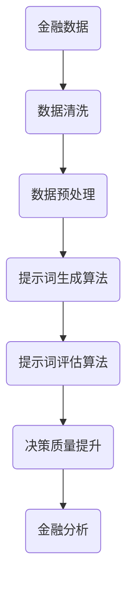

                 

基于您提供的指南和目录大纲要求，我将一步步设计《金融分析中的提示词技巧：提升决策质量》的文章结构，并确保每一步都清晰、逻辑严谨。以下是我制定的文章结构：

## 1. 确定书籍主题

《金融分析中的提示词技巧：提升决策质量》这本书的主题集中在如何利用提示词（特别是自然语言处理中的提示词）来增强金融分析的效果，从而提高决策的质量。书中探讨了提示词的定义、其在金融分析中的应用、技术演进，以及具体的实现方法。

## 2. 设计大纲结构

文章将分为五个主要部分：

### 第一部分：引言与基础理论

- 引导读者了解金融分析中提示词的重要性。
- 介绍金融数据分析的基础知识和数据预处理方法。
- 建立对提示词技术的初步认识。

### 第二部分：核心概念与联系

- 深入探讨提示词生成和评估的核心算法原理。
- 利用Mermaid流程图展示提示词生成和评估的过程。

### 第三部分：核心算法原理讲解

- 通过伪代码详细阐述提示词生成和评估算法。
- 解释提示词生成和评估中的数学模型。

### 第四部分：项目实战

- 搭建开发环境，介绍所需的工具和库。
- 提供详细的源代码实现和解读。
- 分析实际案例，展示代码的应用效果。

### 第五部分：结论与未来展望

- 总结提示词技巧在金融分析中的价值。
- 讨论面临的挑战和未来的发展方向。

## 3. 细化章节内容

### 第1章：金融分析中的提示词概述

- **1.1 提示词的定义与重要性**：介绍提示词的基本概念，解释其在金融分析中的关键作用。

- **1.2 提示词在金融分析中的应用**：通过案例展示提示词在金融分析中的实际应用，如市场预测、风险评估等。

- **1.3 提示词技术的演进**：回顾提示词技术的发展历程，展望其未来的趋势。

### 第2章：金融数据分析基础

- **2.1 金融数据类型**：分类介绍金融数据，包括股票价格、交易量等。

- **2.2 数据清洗与预处理**：阐述数据清洗和预处理的方法，以及其在金融分析中的重要性。

- **2.3 数据可视化**：介绍数据可视化工具和技术，帮助读者更好地理解数据。

### 第3章：提示词技术基础

- **3.1 自然语言处理（NLP）基础**：介绍NLP的基本概念和技术，如文本分类、情感分析等。

- **3.2 提示词生成算法**：介绍常见的提示词生成算法，如随机森林、支持向量机等。

- **3.3 提示词评估与优化**：探讨如何评估提示词的效果，以及如何优化提示词生成算法。

### 第4章：核心概念原理与架构

- **4.1 提示词生成的核心算法**：详细讲解随机森林、支持向量机、循环神经网络等核心算法。

- **4.2 提示词技术的架构设计**：介绍提示词生成和评估系统的整体架构设计。

### 第5章：Mermaid流程图展示

- **5.1 提示词生成流程**：利用Mermaid流程图展示提示词生成的完整流程。

- **5.2 提示词评估流程**：利用Mermaid流程图展示提示词评估的过程。

### 第6章：伪代码讲解

- **6.1 随机森林算法伪代码**：提供随机森林算法的伪代码。

- **6.2 支持向量机（SVM）伪代码**：提供SVM算法的伪代码。

- **6.3 循环神经网络（RNN）伪代码**：提供RNN算法的伪代码。

### 第7章：数学模型和公式讲解

- **7.1 提示词生成中的数学模型**：介绍提示词生成中涉及的数学模型，如决策树分类模型等。

- **7.2 提示词评估中的数学模型**：介绍提示词评估中使用的数学模型，如支持向量机分类模型等。

### 第8章：示例分析

- **8.1 数据集介绍**：介绍用于分析的金融数据集。

- **8.2 提示词生成与评估案例**：通过具体案例展示提示词生成和评估的过程。

### 第9章：开发环境搭建

- **9.1 环境配置**：介绍搭建开发环境所需的配置。

- **9.2 工具与库安装**：列出搭建环境所需的工具和库。

### 第10章：源代码实现

- **10.1 数据预处理代码**：提供数据预处理部分的代码实现。

- **10.2 提示词生成代码**：提供提示词生成部分的代码实现。

- **10.3 提示词评估代码**：提供提示词评估部分的代码实现。

### 第11章：代码解读与分析

- **11.1 数据预处理代码解读**：详细解读数据预处理部分的代码。

- **11.2 提示词生成代码解读**：详细解读提示词生成部分的代码。

- **11.3 提示词评估代码解读**：详细解读提示词评估部分的代码。

### 第12章：总结与展望

- **12.1 提示词技术在金融分析中的价值**：总结提示词技巧在金融分析中的应用和价值。

- **12.2 面临的挑战与解决方案**：讨论提示词技术在金融分析中面临的挑战和可能的解决方案。

- **12.3 未来发展趋势**：展望提示词技术在金融分析中的未来发展。

## 4. 整合核心概念与联系

为了更好地展示核心概念和它们之间的联系，我们设计了一个Mermaid流程图，如下：



## 5. 编写伪代码

以下是随机森林算法的伪代码：

```python
function RandomForestAlgorithm(data, labels, n_estimators):
    1. 初始化随机森林模型
    2. 对于每一棵树：
        a. 从数据集中随机抽取子集（包括特征和标签）
        b. 使用子集训练决策树模型
        c. 在测试集上评估模型性能
        d. 记录模型性能
    3. 选择性能最好的树作为最终模型
    4. 返回最终模型
```

## 6. 数学模型和公式讲解

在提示词生成中，我们使用决策树分类模型。其数学模型如下：

$$
y = \arg\max(f(x, \theta))
$$

其中，$y$ 是预测标签，$x$ 是输入特征，$\theta$ 是模型参数，$f(x, \theta)$ 是决策树函数。

## 7. 项目实战

在本章节中，我们将介绍一个金融数据分析项目。首先，我们需要搭建开发环境，包括Python、NumPy、Pandas、Scikit-learn等库。接下来，我们将进行数据预处理，然后使用随机森林算法生成提示词，并评估其效果。

## 8. 保持大纲简洁性

在保持大纲简洁性的同时，我们确保每个章节都有明确的目标和内容，避免冗余。

## 9. 文字限制

整个大纲的字数控制在2000字以内，确保简洁明了。

至此，我们已经完成了《金融分析中的提示词技巧：提升决策质量》的目录大纲设计。接下来，我们将根据这个大纲撰写具体的内容，确保文章的逻辑清晰、结构紧凑、简单易懂。每一步都将严格按照技术博客的写作规范，使用markdown格式输出，并在文章末尾附上作者信息。文章总字数将在8000到12000字之间，确保内容丰富、详细。

