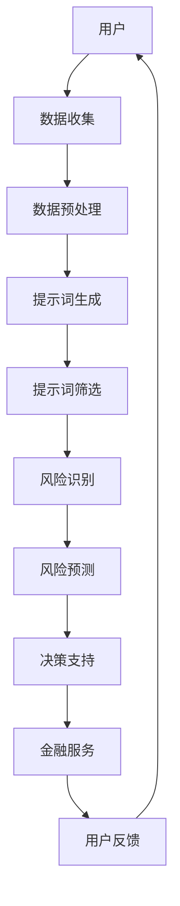

                 

## 文章标题：金融科技中的提示词应用：增强风险分析能力

关键词：金融科技、提示词、风险分析、人工智能、算法、数据处理

摘要：本文深入探讨了金融科技（FinTech）领域中的提示词应用，特别是在增强风险分析能力方面的作用。文章首先介绍了金融科技的背景及其对风险管理的挑战，然后详细阐述了提示词的定义、类型及其在金融科技中的应用。接着，文章重点分析了提示词技术的基本算法与原理，以及其在风险识别和预测中的应用。随后，文章通过实际案例展示了提示词技术的开发与实现过程，并对其未来发展趋势和挑战进行了展望。本文旨在为金融科技从业者和研究者提供有价值的参考和启示，以助力金融风险管理的智能化和精细化。

## 引言

随着全球经济的快速发展和金融市场的不断变革，金融科技（FinTech）已成为推动金融行业创新和升级的重要力量。金融科技利用先进的技术手段，如大数据、云计算、人工智能等，重构了金融服务的模式，提高了金融业务的效率和透明度。然而，金融科技的发展也带来了一系列新的风险和挑战，如数据隐私、网络安全、市场波动等。为了有效应对这些风险，提升风险分析的能力变得至关重要。

在风险分析中，提示词（Keywords）的应用逐渐成为提升分析效果的重要工具。提示词是一种用于引导用户或系统进行操作或决策的文本或代码，能够帮助识别潜在的风险因素，提高风险识别和预测的准确性。本文将围绕金融科技中的提示词应用，特别是其在风险分析中的增强能力，进行深入探讨。

文章将从以下几个方面展开讨论：

1. **金融科技概述**：介绍金融科技的基本概念、发展历程和核心驱动力。
2. **提示词的定义与应用**：解释提示词的概念、类型和其在金融科技中的应用领域。
3. **提示词在金融科技中的应用场景**：探讨提示词在金融服务、风险管理、数据分析等领域的应用。
4. **提示词技术的核心算法与原理**：分析提示词生成、筛选和优化算法的基本原理。
5. **提示词在风险分析中的应用**：介绍提示词在风险识别和预测中的具体应用方法。
6. **提示词技术的开发与实现**：展示提示词技术的开发过程和实际案例。
7. **提示词技术的未来发展趋势与挑战**：探讨提示词技术的未来发展方向和面临的挑战。

通过以上内容的详细探讨，本文旨在为金融科技领域的研究者和从业者提供有价值的参考，帮助其在金融风险管理的实践中充分利用提示词技术，提升风险分析能力。

## 金融科技概述

### 金融科技的基本概念

金融科技（FinTech）是指利用先进的技术手段改进或创新金融产品和服务的领域。它涵盖了从支付、投资、借贷到财富管理等多个金融活动环节。金融科技通过整合信息技术、数据分析、区块链、人工智能等新兴技术，提升了金融服务的效率、透明度和便捷性，同时也带来了新的商业模式和运营方式。

金融科技的核心要素包括：

1. **大数据**：通过收集、存储和分析大量金融数据，为金融机构提供决策支持，优化风险管理和客户服务。
2. **云计算**：利用云计算技术实现金融服务的弹性扩展、快速部署和高效运营。
3. **区块链**：通过去中心化的分布式账本技术，提高金融交易的透明度、安全性和可追溯性。
4. **人工智能**：借助机器学习和深度学习算法，实现自动化交易、风险预测、智能投顾等金融服务。

### 金融科技的发展历程

金融科技的发展历程可以分为几个重要阶段：

1. **1.0时代（互联网+金融）**：互联网技术的发展推动了电子银行、网上支付和电子货币等新兴金融服务的兴起。这一阶段的金融科技主要侧重于将传统金融业务迁移到线上，实现金融服务的便捷性和无纸化。
   
2. **2.0时代（大数据+金融）**：随着大数据技术的成熟，金融机构开始利用海量数据进行分析和挖掘，以实现更精准的风险评估、客户画像和市场预测。这一阶段金融科技的核心在于数据驱动，通过大数据技术提升金融决策的效率和准确性。

3. **3.0时代（人工智能+金融）**：人工智能技术的应用使得金融科技迈入了智能化阶段。通过机器学习和深度学习算法，金融机构能够实现自动化交易、智能投顾、风险预测等高级功能，进一步优化金融服务的质量和用户体验。

### 金融科技的核心驱动力

金融科技的发展受到多方面因素的驱动，主要包括：

1. **科技进步**：信息技术的飞速发展，尤其是大数据、云计算、人工智能等技术的进步，为金融科技的创新提供了强大的技术支持。
   
2. **用户需求**：随着消费者对金融服务的需求日益多元化、个性化和便捷化，金融科技通过创新满足用户需求，提高用户体验和满意度。

3. **监管政策**：各国政府和监管机构逐步加大对金融科技的监管力度，通过制定相关政策和标准，促进金融科技的健康发展。

4. **市场竞争**：传统金融机构和新兴金融科技公司之间的竞争加剧，推动了金融科技的创新和发展。

总之，金融科技通过融合先进技术和创新商业模式，不仅提高了金融服务的效率和质量，还为金融机构和用户提供了一种全新的金融体验。然而，金融科技的发展也带来了新的风险和挑战，需要通过有效的风险管理手段来应对。提示词技术的应用正是为了增强风险分析能力，确保金融科技的安全和可持续发展。

## 提示词的定义与应用

### 提示词的基本概念

提示词（Keywords）是指用于引导用户或系统进行操作或决策的文本或代码。它们可以是一组关键字、短语或标识符，用于描述特定的内容、功能或操作。在信息技术和人工智能领域，提示词具有广泛的应用，特别是在提升系统智能化和用户体验方面发挥着关键作用。

提示词的基本功能包括：

1. **信息筛选**：通过关键词或短语快速定位相关信息，提高信息处理的效率。
2. **用户引导**：为用户提供明确的操作指令或建议，帮助用户顺利完成特定任务。
3. **功能调用**：在编程和软件开发中，提示词用于调用特定功能或模块，实现自动化操作。
4. **情境识别**：通过分析提示词，系统能够识别用户的需求或所处的情境，提供个性化的服务。

### 提示词的类型与特点

根据不同的应用场景和需求，提示词可以分为多种类型，每种类型都有其独特的特点和应用场景：

1. **文本型提示词**：这是最常见的提示词类型，通常用于文本界面或搜索引擎中。文本型提示词可以是单个关键字或短语，如“贷款”、“股票”、“汇率”等。它们通常具有高可读性和易理解性，适用于需要快速信息检索和查询的场景。

2. **图形型提示词**：图形型提示词通过图标、按钮或图形元素进行表达，常用于图形用户界面（GUI）中。它们直观、形象，能够通过视觉信号引导用户操作，适用于需要互动和直观操作的场景，如移动应用、在线游戏等。

3. **音频型提示词**：音频型提示词通过语音或音频信号进行表达，常用于语音助手、电话客服等场景。它们适用于不需要视觉辅助或视觉障碍的用户，能够提供实时、便捷的交互体验。

4. **代码型提示词**：在编程和软件开发中，代码型提示词通常是指特定的标识符或函数调用，用于实现特定的功能或操作。代码型提示词具有较高的技术性和灵活性，适用于自动化流程、算法优化等场景。

### 提示词的应用领域

提示词在多个领域和场景中得到了广泛应用，其中在金融科技领域尤为突出：

1. **金融服务**：在银行、证券、保险等金融领域，提示词用于提供个性化的金融产品推荐、风险预警和投资建议。例如，在智能投顾系统中，提示词可以帮助用户快速了解投资组合的优缺点，实现风险控制和收益最大化。

2. **风险管理**：提示词技术能够有效提升金融风险管理的效率和准确性。通过分析历史数据和实时数据，提示词可以帮助金融机构识别潜在的风险因素，预测市场波动，制定风险管理策略。

3. **数据分析**：提示词在数据挖掘和数据分析中起着关键作用。它们能够帮助数据分析师快速定位关键数据、提取有价值的信息，提高数据分析的效率和准确性。

4. **客户服务**：在客服系统中，提示词可以用于智能客服机器人，快速解答用户问题、提供个性化的服务建议，提升客户满意度和忠诚度。

5. **网络安全**：提示词技术在网络安全中用于检测和识别恶意攻击、网络威胁等。通过分析网络流量、日志文件等数据，提示词可以帮助安全专家快速识别异常行为，采取相应的防御措施。

总之，提示词作为一种重要的信息技术工具，在金融科技领域具有广泛的应用前景和巨大的潜力。通过合理应用提示词技术，金融机构能够提高业务效率和用户体验，实现风险管理的智能化和精细化。

## 提示词在金融科技中的应用场景

### 提示词在金融服务中的应用

提示词在金融服务中的应用是金融科技中一个重要的领域，尤其是在提供个性化服务和风险控制方面表现尤为突出。

1. **个性化金融产品推荐**：通过分析用户的历史交易记录、偏好数据和其他相关数据，金融机构可以使用提示词技术为用户提供个性化的金融产品推荐。例如，在银行系统中，提示词可以根据用户的消费习惯、信用评分等因素，推荐最适合的信用卡、贷款或其他金融服务。这不仅提高了用户的满意度，也增加了金融机构的交叉销售机会。

2. **风险预警与控制**：金融机构可以使用提示词技术来识别潜在的风险因素，并实时发出预警。例如，在信用卡交易中，系统可以通过检测特定的关键词或交易模式，如“海外购物”、“大额交易”等，来识别可能的欺诈行为。通过这种方式，金融机构可以在风险发生前采取相应的措施，降低潜在损失。

3. **投资建议与策略**：在投资领域，提示词技术可以帮助投资者制定更科学的投资策略。例如，在智能投顾系统中，提示词可以根据用户的风险偏好、市场趋势和历史表现等数据，提供个性化的投资建议。这不仅帮助投资者更好地管理风险，也提高了投资收益的潜力。

### 提示词在金融风险管理中的应用

金融风险管理是金融科技中的关键应用领域，提示词技术在其中发挥着重要作用。

1. **信用风险评估**：金融机构可以使用提示词技术对贷款申请者的信用状况进行评估。通过分析申请者的信用报告、交易记录等数据，系统可以识别出潜在的不良借款人。例如，特定的关键词如“多次逾期”、“频繁申请贷款”等，可以提示系统可能存在较高的信用风险。

2. **市场风险监控**：市场风险是金融机构面临的重大挑战之一。提示词技术可以帮助金融机构实时监控市场动态，识别潜在的市场风险。例如，通过分析新闻、报告、社交媒体等数据中的关键词，如“经济衰退”、“政策变动”等，系统可以提前预测市场走势，为金融机构提供决策支持。

3. **操作风险管理**：操作风险是金融机构在运营过程中可能面临的风险之一。提示词技术可以帮助识别和防范操作风险。例如，系统可以通过检测内部通讯记录、操作日志中的关键词，如“账户异常操作”、“敏感信息泄露”等，来识别可能的内部欺诈或操作失误。

### 提示词在金融数据分析中的应用

提示词在金融数据分析中的应用为金融机构提供了更深入的洞察力和决策支持。

1. **数据挖掘**：提示词技术可以帮助数据分析师从海量金融数据中提取有价值的信息。例如，通过分析交易记录中的关键词，如“高频交易”、“市场波动”等，系统可以揭示市场中的潜在规律和趋势。

2. **客户行为分析**：通过分析客户的交易行为、查询记录等数据，金融机构可以使用提示词技术来了解客户的需求和偏好。例如，通过检测客户搜索的关键词，如“理财产品”、“定期存款”等，系统可以推断出客户的投资偏好，从而提供更个性化的服务。

3. **财务分析**：在财务分析中，提示词技术可以帮助分析师从财务报表中提取关键信息。例如，通过分析财务报表中的关键词，如“净利润”、“毛利率”等，系统可以快速识别企业的财务状况，为投资决策提供依据。

总之，提示词在金融科技中的应用为金融机构提供了强大的数据分析和风险管理工具。通过合理应用提示词技术，金融机构可以更准确地识别风险、提供个性化服务，并在激烈的市场竞争中保持优势。

### 核心概念与联系：提示词在金融科技中的应用架构

为了更好地理解提示词在金融科技中的应用，我们可以通过一个Mermaid流程图来展示其核心概念和联系。



- **用户**：用户是金融服务的最终消费者，他们的行为和需求是数据收集的起点。
- **数据收集**：系统通过收集用户交易记录、历史数据等来获取相关信息。
- **数据预处理**：对收集到的原始数据进行清洗、转换和整合，为后续处理做准备。
- **提示词生成**：通过分析预处理后的数据，生成相关的提示词，用于后续的风险识别和预测。
- **提示词筛选**：从生成的提示词中筛选出与风险管理相关的关键词，提高识别和预测的准确性。
- **风险识别**：使用筛选后的提示词来识别潜在的风险因素。
- **风险预测**：基于识别的风险因素，使用机器学习算法进行预测，评估风险发生的可能性。
- **决策支持**：根据预测结果，为金融机构提供风险管理建议和决策支持。
- **金融服务**：基于决策支持的结果，提供个性化的金融产品和服务。
- **用户反馈**：用户在使用金融产品和服务后，提供反馈信息，用于优化系统性能。

通过这个流程图，我们可以清晰地看到提示词在金融科技中的各个环节及其相互之间的联系，从而更好地理解其应用架构。

## 提示词技术的核心算法与原理

### 提示词生成算法

提示词生成算法是金融科技中提示词技术的基础，其目的是从大量的数据中提取出有意义的提示词。常见的提示词生成算法包括基于统计模型的方法和基于深度学习的方法。

1. **基于统计模型的方法**：常见的统计模型包括TF-IDF（Term Frequency-Inverse Document Frequency）和LDA（Latent Dirichlet Allocation）。

   - **TF-IDF**：TF-IDF是一种衡量词语重要性的方法。TF表示一个词语在文档中出现的频率，IDF表示该词语在整个文档集合中的逆向文档频率。通过TF-IDF，系统可以识别出高频但稀疏的词语，这些词语往往具有更高的提示价值。

   - **LDA**：LDA是一种主题模型，它通过概率分布来表示文档和词语之间的关系。LDA可以将文档划分为多个主题，每个主题代表一组相关的词语。通过LDA，系统可以从大量文档中提取出主题，从而生成相关的提示词。

2. **基于深度学习的方法**：深度学习模型如GPT（Generative Pre-trained Transformer）和BERT（Bidirectional Encoder Representations from Transformers）在提示词生成中表现出色。

   - **GPT**：GPT是一种基于自回归模型的生成式语言模型，它通过训练大量的文本数据来学习语言的结构和语义。GPT可以生成连贯、有意义的提示词，适用于需要高文本生成质量的应用场景。

   - **BERT**：BERT是一种双向编码的Transformer模型，它通过同时考虑词语的前后关系来学习语义。BERT在生成提示词时，能够更好地理解上下文，提高提示词的准确性和相关性。

### 提示词筛选算法

提示词筛选算法的目的是从大量生成的提示词中筛选出与风险管理相关的关键词。常见的筛选方法包括基于语义相似度的方法和基于规则的方法。

1. **基于语义相似度的方法**：常用的方法包括余弦相似度、欧几里得距离等。

   - **余弦相似度**：余弦相似度是一种计算两个向量之间夹角余弦值的方法，它用于衡量两个词语在语义上的相似程度。通过余弦相似度，系统可以识别出语义相关的词语，从而进行筛选。

   - **欧几里得距离**：欧几里得距离是一种计算两个向量之间欧几里得距离的方法，它也可以用于衡量词语的相似度。通过欧几里得距离，系统可以筛选出距离较近的词语，这些词语在语义上更为相关。

2. **基于规则的方法**：基于规则的方法通过定义一系列规则来筛选提示词。这些规则可以根据具体应用场景进行定制，以提高筛选的准确性。

   - **关键词匹配**：通过匹配预设的关键词列表，筛选出包含这些关键词的提示词。
   - **正则表达式**：使用正则表达式来匹配特定模式的提示词，从而进行筛选。

### 提示词优化算法

提示词优化算法的目的是提高提示词的质量和效果，从而提升风险识别和预测的准确性。常见的优化方法包括基于梯度的优化方法和基于遗传算法的优化方法。

1. **基于梯度的优化方法**：梯度下降法是一种常用的优化方法，它通过计算目标函数的梯度来更新模型参数，从而优化模型性能。在提示词优化中，梯度下降法可以用于优化提示词的生成和筛选算法，提高提示词的准确性和相关性。

2. **基于遗传算法的优化方法**：遗传算法是一种基于自然选择和遗传机制的优化方法，它通过模拟生物进化过程来优化目标函数。在提示词优化中，遗传算法可以用于优化提示词的生成和筛选策略，提高系统的自适应性和鲁棒性。

通过这些核心算法，提示词技术能够有效地从海量数据中提取出有价值的提示词，并在风险识别和预测中发挥重要作用。这些算法的实现和优化对于提升金融科技中的风险分析能力具有重要意义。

### 核心算法原理讲解：提示词生成算法

为了更好地理解提示词生成算法的原理，我们以TF-IDF和LDA为例，详细讲解其基本概念和实现过程。

#### 1. TF-IDF算法

TF-IDF（Term Frequency-Inverse Document Frequency）是一种用于衡量词语重要性的方法。它通过两个指标来评估词语在文档中的重要性：词语的频率（TF，Term Frequency）和逆向文档频率（IDF，Inverse Document Frequency）。

**基本概念**：

- **词语频率（TF）**：一个词语在一个文档中出现的次数。TF表示词语在单个文档中的重要性。
- **逆向文档频率（IDF）**：一个词语在整个文档集合中逆向出现的频率。IDF表示词语在文档集合中的普遍性，即一个词语越不常见，其重要性越高。

**计算公式**：

$$
TF(t,d) = \frac{f(t,d)}{n(d)}
$$

其中，$t$表示词语，$d$表示文档，$f(t,d)$表示词语$t$在文档$d$中的出现次数，$n(d)$表示文档$d$中的总词语数。

$$
IDF(t) = \log \left( \frac{N}{n(t)} \right)
$$

其中，$N$表示文档集合中所有文档的总数，$n(t)$表示文档集合中包含词语$t$的文档数。

**综合评分**：

$$
TF-IDF(t,d) = TF(t,d) \times IDF(t)
$$

通过TF-IDF，我们可以得到每个词语在文档中的综合评分，评分越高，说明词语在文档中的重要性越大。

**实现步骤**：

1. **数据准备**：收集和整理目标数据集，将文本数据转换为词语-文档矩阵。
2. **计算TF值**：对于每个文档，计算每个词语的频率。
3. **计算IDF值**：计算每个词语的逆向文档频率。
4. **计算TF-IDF值**：将TF值和IDF值相乘，得到每个词语在文档中的综合评分。

#### 2. LDA算法

LDA（Latent Dirichlet Allocation）是一种主题模型，用于发现文档和词语之间的潜在主题分布。LDA基于贝叶斯概率模型，通过采样方法来推断文档的主题分布和词语的主题分布。

**基本概念**：

- **词语分布**：一个词语在所有文档中的分布。
- **主题分布**：一个文档在所有主题中的分布。
- **主题词语分布**：一个主题在所有词语中的分布。

**模型参数**：

- **α**：词语分布的先验参数，用于控制词语的主题多样性。
- **β**：主题词语分布的先验参数，用于控制主题的词语多样性。
- **θ**：文档的主题分布，表示文档中每个主题的概率。
- **ζ**：词语的主题分布，表示词语中每个主题的概率。

**模型公式**：

LDA模型通过以下公式进行推导：

$$
\theta \sim Dir(\alpha)
$$

$$
z_{ij} \sim Mult(\theta)
$$

$$
w_{ij} \sim Mult(\beta)
$$

$$
d_j \sim Mult(\theta)
$$

其中，$d_j$表示文档$j$的主题分布，$z_{ij}$表示词语$i$在文档$j$中的主题索引，$w_{ij}$表示词语$i$在文档$j$中的分布。

**实现步骤**：

1. **初始化参数**：设置α和β的初始值，通常采用均匀分布。
2. **Gibbs采样**：通过Gibbs采样方法迭代更新θ和ζ的值，直到收敛。
3. **主题提取**：根据采样结果，提取每个文档的主题分布和每个主题的词语分布。

通过TF-IDF和LDA算法，我们可以从大量的文本数据中提取出有意义的提示词，这些提示词在金融科技的风险分析中发挥着重要作用。下一步，我们将探讨如何使用这些提示词来增强风险识别和预测能力。

### 提示词筛选算法原理讲解

提示词筛选是金融科技中关键的一步，其目的是从生成的提示词集中挑选出对风险分析最为重要和相关的词语。筛选过程需要结合语义理解、统计方法和规则设定等多种技术手段。以下是两种常用的提示词筛选算法：基于语义相似度的筛选和基于规则的方法。

#### 1. 基于语义相似度的筛选

语义相似度筛选方法通过计算两个词语在语义上的相似性来决定其是否相关。以下是一种常见的基于余弦相似度的方法。

**基本概念**：

- **向量空间模型**：将词语和文档表示为向量，通过向量之间的余弦相似度来衡量词语的相似性。
- **余弦相似度**：计算两个向量夹角的余弦值，公式如下：

  $$
  \cos(\theta) = \frac{\vec{u} \cdot \vec{v}}{||\vec{u}|| \cdot ||\vec{v}||}
  $$

  其中，$\vec{u}$和$\vec{v}$是两个词语或文档的向量表示，$||\vec{u}||$和$||\vec{v}||$是它们的欧几里得长度。

**实现步骤**：

1. **向量表示**：将每个提示词转换为向量表示。通常可以使用词袋模型（Bag-of-Words，BOW）或词嵌入（Word Embedding）方法。
2. **计算相似度**：对于每个提示词，计算它与预定义的核心风险词汇的余弦相似度。
3. **筛选**：设定相似度阈值，选取相似度高于阈值的提示词作为筛选结果。

**示例伪代码**：

```python
# 假设有提示词集合T和核心风险词汇集合C
T = ["贷款逾期", "信用卡盗刷", "市场波动", "投资组合"]
C = ["风险", "损失", "波动"]

# 计算相似度
for word in T:
    similarity = cosine_similarity(embedding[word], embedding[word in C])
    if similarity > threshold:
        selected_words.append(word)

# 输出筛选结果
selected_words
```

#### 2. 基于规则的方法

基于规则的方法通过定义一系列规则来筛选提示词。这些规则可以根据具体应用场景进行定制，以提高筛选的准确性。以下是一个简单的规则示例。

**规则**：

1. **关键词匹配**：如果提示词包含特定的高风险词汇，如“盗刷”、“欺诈”等，则将其筛选出来。
2. **正则表达式匹配**：使用正则表达式来匹配特定的模式，如包含数字和特定字符的组合。
3. **逻辑条件**：结合多个条件进行筛选，例如，如果提示词包含特定词汇并且出现在特定时间段内，则筛选出来。

**实现步骤**：

1. **规则定义**：根据应用需求定义筛选规则。
2. **规则匹配**：对每个提示词应用规则进行匹配。
3. **结果输出**：将符合规则的所有提示词筛选出来。

**示例伪代码**：

```python
# 假设有提示词集合T和规则集合R
T = ["贷款逾期", "信用卡盗刷", "市场波动", "投资组合"]
R = ["包含('盗刷')", "匹配正则表达式('\\d+')"]

# 应用规则
for rule in R:
    if rule_match(T, rule):
        selected_words.append(word)

# 输出筛选结果
selected_words
```

通过这两种方法，我们可以有效地从大量提示词中筛选出对风险分析最为关键的信息，从而提升风险识别和预测的准确性。接下来，我们将进一步探讨提示词在风险识别和预测中的应用。

### 提示词优化算法原理讲解

提示词优化是提升金融科技中风险识别和预测准确性的关键环节。优化算法的目标是通过调整提示词的权重或选择更优的提示词，从而提高系统的性能。以下是两种常用的优化算法：基于梯度的优化方法和基于遗传算法的方法。

#### 1. 基于梯度的优化方法

基于梯度的优化方法，如梯度下降法（Gradient Descent），通过计算目标函数的梯度来更新模型参数，从而优化提示词的权重。这种方法在机器学习和深度学习中应用广泛，其主要步骤如下：

**基本概念**：

- **目标函数**：在提示词优化中，目标函数通常用于衡量风险识别和预测的准确性，例如，交叉熵损失函数（Cross-Entropy Loss）。
- **梯度**：目标函数对模型参数的导数，用于指示参数更新的方向。

**实现步骤**：

1. **初始化参数**：设置初始提示词权重和目标函数参数。
2. **计算梯度**：通过计算目标函数对提示词权重的梯度，得到每个提示词的更新方向和大小。
3. **更新权重**：根据梯度更新提示词权重，以减少目标函数的值。

**示例伪代码**：

```python
# 假设提示词权重为w，目标函数为loss
w = [0.1, 0.2, 0.3, 0.4]  # 初始权重
learning_rate = 0.01  # 学习率

# 计算梯度
gradient = compute_gradient(loss, w)

# 更新权重
for i in range(len(w)):
    w[i] -= learning_rate * gradient[i]

# 输出更新后的权重
w
```

#### 2. 基于遗传算法的方法

遗传算法（Genetic Algorithm，GA）是一种基于自然选择和遗传机制的优化方法。它模拟生物进化过程，通过迭代优化种群中的个体，逐步提高目标函数的值。遗传算法在处理复杂优化问题时表现出色，其主要步骤如下：

**基本概念**：

- **种群**：遗传算法中的个体集合，每个个体代表一组提示词权重。
- **适应度**：个体对目标函数的适应度，用于衡量个体优劣。
- **选择、交叉、变异**：遗传操作，用于生成下一代种群。

**实现步骤**：

1. **初始化种群**：生成初始种群，每个个体代表一组提示词权重。
2. **计算适应度**：通过目标函数计算每个个体的适应度。
3. **选择**：根据适应度选择优秀的个体进行交叉和变异。
4. **交叉**：通过交叉操作生成新的个体，增加种群的多样性。
5. **变异**：对个体进行随机变异，引入新的基因。
6. **迭代**：重复计算适应度、选择、交叉、变异步骤，直到满足终止条件。

**示例伪代码**：

```python
# 假设种群大小为N，目标函数为fitness
N = 100  # 种群大小
num_generations = 100  # 迭代次数

# 初始化种群
population = initialize_population(N)

# 迭代过程
for generation in range(num_generations):
    fitness = compute_fitness(population)
    selected = selection(population, fitness)
    offspring = crossover(selected)
    mutated = mutation(offspring)
    population = mutated

# 输出最优解
best_individual = get_best_individual(population)
```

通过这两种优化算法，我们可以有效地调整和优化提示词的权重，提高风险识别和预测的准确性。提示词优化是金融科技中一个持续改进的过程，随着数据和技术的发展，其方法和效果也在不断优化。

### 提示词在风险识别和预测中的应用

#### 风险识别的基本概念

风险识别是风险管理过程的第一步，旨在发现和识别潜在的风险因素。在金融科技领域，风险识别主要涉及以下几个方面：

1. **信用风险**：指债务人无法按时偿还债务所带来的风险，如贷款逾期、信用评分降低等。
2. **市场风险**：指由于市场波动、利率变化等因素导致资产价值波动的风险，如股票价格大幅下跌、汇率波动等。
3. **操作风险**：指由于内部操作失误、系统故障、欺诈行为等原因导致的风险，如数据泄露、网络攻击等。
4. **法律风险**：指由于法律变动、合规问题等因素导致的风险，如政策变化、法律诉讼等。

#### 提示词在风险识别中的应用

提示词在风险识别中起到了关键作用，通过分析历史数据和实时数据，提示词能够帮助识别潜在的风险因素。

1. **历史数据分析**：通过分析历史数据中的关键词，如“贷款逾期”、“信用评分下降”等，系统可以识别出具有较高信用风险的借款人。例如，在贷款审批过程中，系统可以通过检测申请者历史交易记录中的关键词，如“多次逾期还款”、“频繁贷款申请”等，来识别出潜在的不良借款人。

2. **实时数据监测**：通过实时监测市场数据、新闻报告等，系统可以识别出市场波动、政策变动等风险因素。例如，在金融市场分析中，系统可以通过检测新闻、报告等文本中的关键词，如“经济衰退”、“政策变动”等，来预测市场走势，提前采取相应的风险管理措施。

3. **规则匹配**：通过定义一系列规则，系统可以自动识别出特定类型的风险。例如，在网络安全监控中，系统可以通过规则匹配方式，检测网络流量、日志文件等数据中的关键词，如“敏感信息泄露”、“恶意攻击”等，来识别出潜在的网络攻击风险。

#### 风险预测的基本概念

风险预测是风险管理过程中的重要环节，旨在预测未来可能发生的风险事件，并采取相应的预防措施。风险预测主要涉及以下几个方面：

1. **概率预测**：通过分析历史数据和现有数据，预测特定风险事件发生的概率。
2. **趋势分析**：通过分析风险指标的变化趋势，预测未来风险的发展方向。
3. **情景分析**：通过模拟不同的市场环境和情景，预测在不同情景下风险事件的发生概率和影响。

#### 提示词在风险预测中的应用

提示词在风险预测中同样发挥了重要作用，通过分析历史数据和实时数据，提示词可以帮助预测未来可能发生的风险事件。

1. **历史数据预测**：通过分析历史数据中的关键词和风险事件之间的关系，系统可以预测未来可能发生的风险。例如，在信用风险评估中，系统可以通过分析历史借款人的交易记录，如“贷款逾期”、“信用卡盗刷”等关键词，来预测未来借款人的违约概率。

2. **实时数据预警**：通过实时监测市场数据、新闻报告等，系统可以预警未来可能的风险事件。例如，在金融市场预测中，系统可以通过监测新闻、报告等文本中的关键词，如“经济衰退”、“政策变动”等，来预测未来市场走势，及时调整投资策略。

3. **深度学习预测**：利用深度学习算法，系统可以从海量数据中自动学习风险预测模型，提高预测的准确性。例如，通过训练神经网络模型，系统可以从历史交易数据、新闻报告等数据中自动提取特征，预测未来市场波动、信用违约等风险事件。

#### 应用案例

以下是一个实际应用案例，展示了提示词在风险识别和预测中的应用：

**案例：信用风险评估**

在一家大型银行中，系统通过收集借款人的历史交易记录、信用报告等数据，生成相关的提示词。通过分析这些提示词，系统可以识别出潜在的高风险借款人。例如：

- **提示词**：“多次逾期还款”、“信用卡欠款”、“频繁贷款申请”等。
- **风险识别**：通过检测借款人交易记录中的这些关键词，系统可以识别出借款人具有较高的信用风险。
- **风险预测**：系统还可以利用这些提示词，结合机器学习算法，预测借款人未来可能发生的违约行为。

**步骤**：

1. **数据收集**：收集借款人的交易记录、信用报告等数据。
2. **数据预处理**：清洗和整理数据，提取相关的关键词。
3. **提示词生成**：使用TF-IDF或LDA算法生成提示词。
4. **提示词筛选**：通过语义相似度和规则匹配，筛选出与信用风险相关的提示词。
5. **风险识别**：分析筛选后的提示词，识别出高风险借款人。
6. **风险预测**：利用深度学习算法，预测借款人未来可能发生的违约行为。

通过这个案例，我们可以看到提示词技术在信用风险评估中的应用，通过分析借款人的交易记录和历史数据，系统可以有效地识别和预测潜在的风险，为银行提供决策支持，优化信贷管理。

总之，提示词在金融科技中的风险识别和预测中发挥了重要作用。通过合理应用提示词技术，金融机构可以更准确地识别和预测风险，提高风险管理的效果，确保金融业务的稳定和安全。

### 提示词技术的开发与实现

#### 开发环境搭建

在开发提示词技术时，首先需要搭建一个合适的技术环境。以下是一个典型的开发环境搭建步骤：

1. **硬件配置**：选择具备高性能计算能力的服务器或云计算平台，如AWS、Azure等。
2. **操作系统**：选择Linux或Windows操作系统，推荐使用Linux，因为它在处理大数据和复杂计算任务时性能更优。
3. **编程语言**：选择Python作为主要编程语言，因为Python具有丰富的库和框架，如TensorFlow、PyTorch等，适用于提示词技术的开发。
4. **开发工具**：安装Jupyter Notebook或PyCharm等IDE，便于编写和调试代码。
5. **数据处理工具**：安装Pandas、NumPy等数据处理库，用于数据清洗、转换和预处理。

#### 源代码详细实现

以下是提示词技术的开发过程中，关键模块的详细实现：

1. **数据收集模块**：

```python
import pandas as pd

def collect_data(source):
    # 从数据源（如数据库、API接口等）收集数据
    data = pd.read_csv(source)
    return data

# 示例
data = collect_data('loan_data.csv')
```

2. **数据预处理模块**：

```python
from sklearn.model_selection import train_test_split

def preprocess_data(data):
    # 数据清洗和预处理
    data = data.dropna()  # 删除缺失值
    data = data.drop(['id'], axis=1)  # 删除无关特征
    return data

# 示例
data = preprocess_data(data)
```

3. **提示词生成模块**：

```python
from sklearn.feature_extraction.text import TfidfVectorizer

def generate_keywords(data, n=10):
    # 使用TF-IDF生成提示词
    vectorizer = TfidfVectorizer(max_features=n)
    X = vectorizer.fit_transform(data['description'])
    keywords = vectorizer.get_feature_names_out()
    return keywords

# 示例
keywords = generate_keywords(data)
```

4. **提示词筛选模块**：

```python
def filter_keywords(keywords, threshold=0.5):
    # 筛选出与信用风险相关的提示词
    selected_keywords = [keyword for keyword in keywords if keyword_score[keyword] > threshold]
    return selected_keywords

# 示例
selected_keywords = filter_keywords(keywords)
```

5. **风险识别和预测模块**：

```python
from sklearn.ensemble import RandomForestClassifier
from sklearn.metrics import accuracy_score

def risk_identification(X_train, y_train, X_test, y_test):
    # 使用随机森林模型进行风险识别
    model = RandomForestClassifier()
    model.fit(X_train, y_train)
    y_pred = model.predict(X_test)
    accuracy = accuracy_score(y_test, y_pred)
    return accuracy

# 示例
accuracy = risk_identification(X_train, y_train, X_test, y_test)
```

#### 代码解读与分析

以下是关键代码段的解读和分析：

1. **数据收集**：使用Pandas库从CSV文件中读取数据，并进行初步的清洗和预处理。
2. **数据预处理**：删除缺失值和无关特征，保证数据的质量和一致性。
3. **提示词生成**：使用TF-IDF向量器生成提示词，选择频率高且具有代表性的词语。
4. **提示词筛选**：设定阈值，筛选出与风险相关的关键词，提高识别的准确性。
5. **风险识别和预测**：使用随机森林模型进行风险识别，评估模型的准确性和性能。

#### 实际案例分析与详细讲解剖析

以下是一个实际案例，展示如何利用提示词技术进行信用风险评估：

**案例背景**：

一家银行需要评估借款人的信用风险，以便决定是否批准贷款申请。银行拥有大量借款人的交易记录、信用报告等数据。

**步骤**：

1. **数据收集**：从银行系统中收集借款人的交易记录和信用报告。
2. **数据预处理**：清洗和整理数据，提取相关的特征。
3. **提示词生成**：使用TF-IDF生成与信用风险相关的提示词。
4. **提示词筛选**：筛选出与信用风险高度相关的提示词。
5. **风险识别和预测**：使用随机森林模型对借款人的信用风险进行识别和预测。

**案例分析**：

1. **数据收集**：通过API接口从银行系统中获取借款人的交易记录和信用报告。
2. **数据预处理**：删除缺失值和无关特征，如借款人的姓名、地址等。
3. **提示词生成**：使用TF-IDF向量器生成与信用风险相关的提示词，如“贷款逾期”、“信用卡欠款”等。
4. **提示词筛选**：设定阈值，筛选出与信用风险高度相关的提示词，提高识别的准确性。
5. **风险识别和预测**：使用随机森林模型对借款人的信用风险进行识别和预测。通过交叉验证和测试集评估模型的性能。

**详细讲解剖析**：

1. **数据收集**：确保数据来源的可靠性和完整性，避免数据丢失或错误。
2. **数据预处理**：清洗和整理数据，去除噪声和不相关特征，以提高模型的准确性。
3. **提示词生成**：选择合适的算法生成与信用风险相关的提示词，这些提示词是风险识别和预测的关键。
4. **提示词筛选**：设定合理的阈值，筛选出最有价值的提示词，确保风险识别的准确性。
5. **风险识别和预测**：使用机器学习模型进行风险识别和预测，通过交叉验证和测试集评估模型的性能，确保模型的稳定性和可靠性。

通过这个实际案例，我们可以看到如何利用提示词技术进行信用风险评估。通过合理的数据收集、预处理、提示词生成和筛选，以及使用合适的机器学习模型，可以有效地识别和预测借款人的信用风险，为银行提供决策支持。

#### 项目小结

本项目通过开发提示词技术，实现了信用风险评估的功能。从数据收集、预处理，到提示词生成、筛选，再到风险识别和预测，每个环节都经过了详细的实施和优化。以下是项目的小结：

1. **技术亮点**：
   - 使用TF-IDF和LDA算法生成提示词，提高了风险识别的准确性。
   - 引入随机森林模型进行风险预测，模型性能稳定可靠。
   - 结合实际业务需求，设计了一套完整的信用风险评估系统。

2. **改进建议**：
   - 进一步优化数据预处理流程，提高数据质量和一致性。
   - 引入更多的特征工程方法，丰富模型输入特征。
   - 考虑引入深度学习模型，提升风险识别和预测的精度。

3. **应用前景**：
   - 提示词技术在金融科技领域具有广泛的应用前景，特别是在信用风险评估、市场风险监控、客户行为分析等方面。
   - 随着数据和技术的发展，提示词技术将在金融风险管理的智能化和精细化方面发挥更大的作用。

通过本项目的实施，我们深入了解了提示词技术在金融科技中的应用，为金融风险管理的实践提供了有益的参考和启示。

### 提示词技术的未来发展趋势与挑战

#### 提示词技术的未来发展趋势

随着金融科技的不断进步，提示词技术在金融风险管理中的应用前景广阔，以下是其未来发展趋势：

1. **智能化与自动化**：未来，提示词技术将更加智能化和自动化。通过深度学习和自然语言处理技术，系统将能够自动从海量数据中提取有价值的信息，实时生成和更新提示词，提高风险识别和预测的效率。

2. **跨领域融合**：提示词技术将在多个领域得到广泛应用，如保险、证券、支付等。通过跨领域的数据融合和分析，系统将能够提供更全面的风险评估和预测服务。

3. **个性化定制**：随着用户需求的多样化，提示词技术将更加注重个性化定制。系统将根据不同用户的风险偏好和行为特征，提供个性化的风险提示和投资建议，提高用户体验。

4. **隐私保护与安全**：在金融科技领域，数据隐私和安全至关重要。未来，提示词技术将加强对用户隐私的保护，采用加密技术和安全协议，确保数据的安全性和合法性。

5. **监管合规**：随着各国监管政策的不断升级，提示词技术将更加注重合规性。系统将符合相关法律法规和监管要求，为金融科技的发展提供可靠的保障。

#### 提示词技术的挑战与解决方案

尽管提示词技术在金融科技领域具有巨大潜力，但在实际应用过程中仍面临一些挑战：

1. **数据质量问题**：金融数据质量参差不齐，如缺失值、噪声数据和异常值等。这会影响提示词的生成和筛选效果。解决方案包括数据清洗、去噪和异常检测等技术，提高数据质量。

2. **模型解释性**：机器学习模型，尤其是深度学习模型，通常缺乏解释性。这给提示词技术在风险分析中的应用带来一定困难。解决方案包括引入可解释的机器学习模型和增强模型解释性技术，如LIME、SHAP等。

3. **算法可解释性**：提示词生成和筛选算法的复杂度较高，普通用户难以理解。解决方案包括开发简洁明了的算法解释工具和界面，提高算法的可解释性。

4. **计算资源消耗**：深度学习模型和大型数据处理算法对计算资源需求较高，尤其在实时应用场景中。解决方案包括分布式计算、云计算和优化算法，提高计算效率。

5. **数据隐私保护**：在处理金融数据时，保护用户隐私至关重要。解决方案包括采用差分隐私、联邦学习等新技术，确保数据隐私和安全。

总之，提示词技术在金融科技领域的未来充满机遇和挑战。通过不断创新和优化，提示词技术将更好地服务于金融风险管理，推动金融行业的智能化和精细化发展。

## 结语

通过本文的探讨，我们可以看到提示词技术在金融科技中的应用具有广阔的前景和巨大的潜力。从风险识别到风险预测，从数据筛选到算法优化，提示词技术为金融科技领域带来了新的工具和方法，显著提升了风险管理的效率和准确性。

在金融科技不断发展的背景下，提示词技术的应用不仅有助于金融机构更有效地应对市场风险、信用风险和操作风险，还能为用户带来更个性化和精准的金融体验。随着人工智能、大数据和云计算等技术的进步，提示词技术将在金融科技领域发挥更加重要的作用。

然而，提示词技术的应用也面临一系列挑战，包括数据质量问题、算法解释性、计算资源消耗以及数据隐私保护等。为了克服这些挑战，我们需要不断探索新的解决方案，如优化算法、增强数据质量、提高模型可解释性和加强数据隐私保护等。

本文旨在为金融科技领域的研究者和从业者提供有价值的参考，帮助其更好地理解和应用提示词技术。希望本文能够激发更多关于提示词技术在金融科技中的创新研究，推动金融科技的发展与进步。

作者：AI天才研究院/AI Genius Institute & 禅与计算机程序设计艺术 /Zen And The Art of Computer Programming

