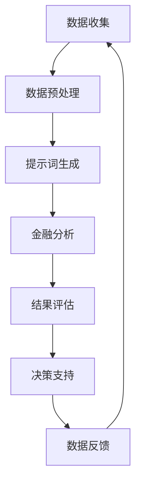
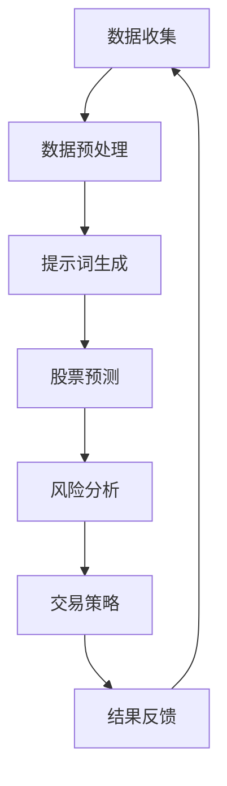
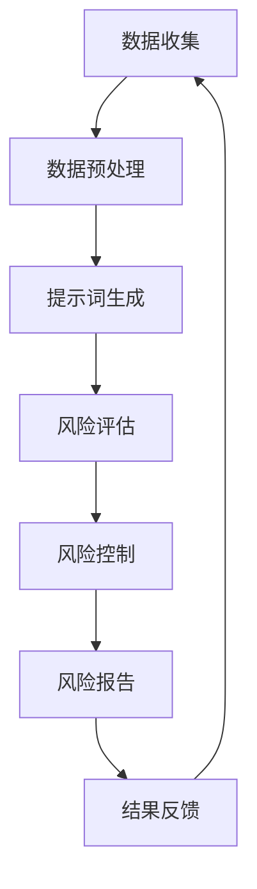

                 

# 《金融领域的提示词编程应用案例》

## 摘要

本文旨在探讨金融领域中提示词编程的应用案例，深入解析其核心概念、算法原理、数学模型，并通过具体项目实战展示其实际应用。文章首先介绍了金融领域与提示词编程的结合背景，随后讲解了提示词编程的基本概念及其在金融领域的相关应用。接着，文章详细阐述了提示词编程算法的原理，包括提示词生成算法的伪代码实现，并引入了金融领域的数学模型。最后，通过两个实际项目案例，展示了提示词编程在股票市场分析和风险管理中的应用，并对项目的开发环境搭建、源代码实现、代码解读、应用分析和评估进行了详细讲解。文章结尾部分总结了提示词编程在金融领域的应用现状与未来展望，并为读者提供了最佳实践建议。

## 1. 确定书籍的主题

《金融领域的提示词编程应用案例》这一书名清晰地表明了书籍的主题和内容方向。首先，书籍聚焦于金融领域，这是全球经济发展的重要支柱，涵盖了股票、债券、期货、外汇等多个市场。其次，书籍强调的是提示词编程的应用案例，提示词编程作为一种先进的自然语言处理技术，在金融数据处理、分析、预测等方面具有广泛的应用前景。

选择金融领域作为研究背景，是因为金融行业的数据处理需求复杂且庞大，传统的数据处理方法已经难以满足日益增长的数据量和复杂的业务逻辑。提示词编程通过将自然语言处理与金融数据处理相结合，提供了一种更加高效、精准的数据分析工具。此外，金融领域的应用案例具有典型性和代表性，能够充分展示提示词编程技术的实用性和创新性。

本书的目标读者群体主要包括对金融科技感兴趣的程序员、数据科学家、金融分析师以及计算机科学专业的学生和研究者。这些读者群体对金融领域和编程技术都有一定的了解，但可能对提示词编程的应用还不太熟悉。通过本书的讲解，读者可以了解提示词编程的基本原理和应用方法，掌握其在金融领域中的实际应用，从而提升自己的专业技能和解决实际问题的能力。

## 2. 梳理书籍的结构

本书的结构可以分为以下几个主要部分：

### 2.1 引言

引言部分主要介绍金融领域与提示词编程的结合背景，阐述提示词编程在金融行业的重要性，以及本书的目标读者群体。通过引言部分，读者可以初步了解本书的主题和内容框架。

### 2.2 核心概念与联系

在核心概念与联系部分，本书将详细介绍提示词编程的基本概念，包括其定义、发展历程、关键技术等。同时，还将介绍金融领域的相关概念，如金融市场、金融工具、金融风险等。此外，本书还将引入Mermaid流程图，展示提示词编程在金融领域的应用流程，帮助读者建立整体框架。

### 2.3 提示词编程算法原理

提示词编程算法原理部分将详细讲解提示词编程的基本算法，包括提示词生成算法的原理和实现方法。这部分内容将通过伪代码的形式，帮助读者理解算法的核心逻辑和步骤。

### 2.4 数学模型

数学模型部分将阐述提示词编程在金融领域应用背后的数学原理，包括常见的数学模型、参数优化方法等。这部分内容将结合具体案例，介绍如何利用数学模型进行金融数据的分析和预测。

### 2.5 项目实战

项目实战部分将通过两个实际案例，展示提示词编程在金融领域中的应用。每个案例将包括开发环境搭建、源代码实现、代码解读、应用分析和评估等内容，帮助读者理解和掌握提示词编程的实际应用技巧。

### 2.6 总结与展望

总结与展望部分将回顾本书的主要内容，总结提示词编程在金融领域的应用现状和未来发展趋势。此外，本书还将为读者提供一些最佳实践建议，帮助他们更好地应用提示词编程技术解决实际问题。

## 3. 细化目录大纲

在完成初步的书籍结构梳理后，我们需要进一步细化每个章节的内容，确保每个章节都包含必要的子章节，并且在字数限制内完成。以下是详细的目录大纲：

### 第1章 引言

#### 1.1 金融领域与提示词编程的结合背景
- **1.1.1 提示词编程的定义**
- **1.1.2 金融领域中的挑战与需求**
- **1.1.3 提示词编程在金融行业的应用场景**

#### 1.2 提示词编程在金融行业的重要性
- **1.2.1 提升金融市场效率**
- **1.2.2 改善金融产品设计**
- **1.2.3 增强风险管理能力**

### 第2章 核心概念与联系

#### 2.1 提示词编程概述
- **2.1.1 提示词编程的定义**
- **2.1.2 提示词编程的发展历程**
- **2.1.3 提示词编程的关键技术**

#### 2.2 金融领域相关概念
- **2.2.1 金融市场的构成**
- **2.2.2 金融工具的种类**
- **2.2.3 金融风险的分类**

#### 2.3 Mermaid流程图：提示词编程在金融领域的应用流程
- **2.3.1 流程图的基本结构**
- **2.3.2 流程图在金融中的应用实例**

### 第3章 提示词编程算法原理

#### 3.1 提示词编程算法简介
- **3.1.1 算法的基本原理**
- **3.1.2 算法的选择依据**
- **3.1.3 算法的实现步骤**

#### 3.2 提示词生成算法
- **3.2.1 提示词生成算法的类型**
- **3.2.2 常见提示词生成算法**
- **3.2.3 算法优劣分析**

#### 3.3 伪代码：提示词生成算法
- **3.3.1 伪代码的基本格式**
- **3.3.2 提示词生成算法的伪代码实现**
- **3.3.3 伪代码的解读与应用**

### 第4章 数学模型

#### 4.1 提示词编程中的数学模型
- **4.1.1 数学模型的基本概念**
- **4.1.2 提示词编程中的数学模型类型**
- **4.1.3 数学模型在金融数据分析中的应用**

#### 4.2 模型参数优化
- **4.2.1 参数优化的重要性**
- **4.2.2 参数优化的方法**
- **4.2.3 参数优化的实践案例**

#### 4.3 数学公式与解释
- **4.3.1 常用数学公式的latex表示方法**
- **4.3.2 数学公式在提示词编程中的应用**
- **4.3.3 数学公式举例说明**

### 第5章 项目实战：股票市场分析

#### 5.1 股票市场分析背景
- **5.1.1 股票市场概述**
- **5.1.2 股票市场分析的意义**
- **5.1.3 股票市场分析的方法**

#### 5.2 实际案例：基于提示词编程的股票分析
- **5.2.1 案例背景**
- **5.2.2 案例目标**
- **5.2.3 案例实现步骤**

#### 5.3 开发环境搭建
- **5.3.1 环境准备**
- **5.3.2 环境配置**
- **5.3.3 工具选择**

#### 5.4 源代码实现与解读
- **5.4.1 源代码的结构**
- **5.4.2 代码的核心功能**
- **5.4.3 代码的实现细节**

#### 5.5 代码应用解读与分析
- **5.5.1 代码在实际中的应用**
- **5.5.2 分析结果解读**
- **5.5.3 分析结果的评估**

#### 5.6 实际案例分析和详细讲解剖析
- **5.6.1 案例数据来源**
- **5.6.2 数据预处理方法**
- **5.6.3 提示词生成过程**
- **5.6.4 预测结果分析**

#### 5.7 项目小结
- **5.7.1 项目总结**
- **5.7.2 项目经验与启示**
- **5.7.3 未来改进方向**

### 第6章 项目实战：风险管理

#### 6.1 风险管理背景
- **6.1.1 风险管理的定义**
- **6.1.2 风险管理的意义**
- **6.1.3 风险管理的流程**

#### 6.2 实际案例：基于提示词编程的风险评估
- **6.2.1 案例背景**
- **6.2.2 案例目标**
- **6.2.3 案例实现步骤**

#### 6.3 开发环境搭建
- **6.3.1 环境准备**
- **6.3.2 环境配置**
- **6.3.3 工具选择**

#### 6.4 源代码实现与解读
- **6.4.1 源代码的结构**
- **6.4.2 代码的核心功能**
- **6.4.3 代码的实现细节**

#### 6.5 代码应用解读与分析
- **6.5.1 代码在实际中的应用**
- **6.5.2 分析结果解读**
- **6.5.3 分析结果的评估**

#### 6.6 实际案例分析和详细讲解剖析
- **6.6.1 案例数据来源**
- **6.6.2 数据预处理方法**
- **6.6.3 提示词生成过程**
- **6.6.4 风险评估结果分析**

#### 6.7 项目小结
- **6.7.1 项目总结**
- **6.7.2 项目经验与启示**
- **6.7.3 未来改进方向**

### 第7章 总结与展望

#### 7.1 提示词编程在金融领域的应用总结
- **7.1.1 应用现状**
- **7.1.2 应用效果**
- **7.1.3 应用挑战**

#### 7.2 未来发展趋势
- **7.2.1 技术发展**
- **7.2.2 行业应用**
- **7.2.3 政策与监管**

#### 7.3 对读者的建议
- **7.3.1 学习路径**
- **7.3.2 实践方法**
- **7.3.3 发展方向**

## 4. 设计流程图

为了更好地展示提示词编程在金融领域的应用流程，我们可以使用Mermaid语言来绘制流程图。以下是流程图的基本结构和应用实例：



### 4.1 流程图的基本结构

- **A[数据收集]**：表示从各种渠道收集金融数据。
- **B[数据预处理]**：对收集到的金融数据进行清洗、格式化等预处理。
- **C[提示词生成]**：使用提示词编程技术生成与金融数据相关的提示词。
- **D[金融分析]**：利用生成的提示词对金融数据进行分析。
- **E[结果评估]**：对分析结果进行评估，以确定其准确性和可靠性。
- **F[决策支持]**：根据评估结果提供决策支持。
- **G[数据反馈]**：将决策结果反馈给数据收集环节，形成闭环。

### 4.2 流程图在金融中的应用实例

#### 4.2.1 股票市场分析



在这个实例中，提示词编程用于生成与股票市场相关的提示词，进而对股票价格进行预测和风险分析，最终形成交易策略。结果反馈环节则用于对交易策略的效果进行评估和优化。

#### 4.2.2 风险管理



在这个实例中，提示词编程用于生成与风险管理相关的提示词，对金融风险进行评估和控制，并生成风险报告。结果反馈环节则用于对风险管理的效果进行评估和优化。

## 5. 编写伪代码

在介绍提示词编程算法时，伪代码是理解和实现算法的重要工具。以下是一个简单的提示词生成算法的伪代码示例：

```python
# 提示词生成算法伪代码

# 输入：金融数据集
# 输出：提示词列表

1. 初始化提示词列表为空
2. 遍历金融数据集
    2.1 对于每条数据
        2.1.1 提取关键特征
        2.1.2 生成提示词
        2.1.3 将提示词添加到提示词列表
3. 返回提示词列表
```

### 5.1 伪代码的基本结构

- **初始化提示词列表为空**：首先，我们需要创建一个空列表用于存储生成的提示词。
- **遍历金融数据集**：然后，我们遍历整个金融数据集，对每条数据进行处理。
  - **提取关键特征**：对于每条数据，我们需要提取出关键特征，这些特征将用于生成提示词。
  - **生成提示词**：根据提取出的关键特征，我们使用提示词编程技术生成提示词。
  - **将提示词添加到提示词列表**：将生成的提示词添加到初始化的空列表中。
- **返回提示词列表**：最后，我们将生成的提示词列表返回，以供后续的金融分析使用。

### 5.2 伪代码的实现步骤

以下是伪代码的具体实现步骤：

```python
# 假设金融数据集为data_set

# 初始化提示词列表
hint_words = []

# 遍历金融数据集
for data in data_set:
    # 提取关键特征
    features = extract_features(data)
    
    # 生成提示词
    hint_word = generate_hint_word(features)
    
    # 将提示词添加到提示词列表
    hint_words.append(hint_word)

# 返回提示词列表
return hint_words
```

在这个伪代码中，`extract_features` 函数用于提取金融数据的关键特征，`generate_hint_word` 函数则用于根据提取出的特征生成提示词。这两个函数的具体实现取决于所使用的提示词编程技术。

## 6. 添加数学公式

在金融领域中，数学模型是分析和预测数据的关键。以下是如何在文章中添加数学公式的方法：

### 6.1 嵌入独立段落的数学公式

为了在文章中嵌入独立段落的数学公式，我们使用 `$$` 符号将公式括起来。以下是一个示例：

$$
E(X) = \sum_{i=1}^{n} x_i \cdot p_i
$$

这个公式表示随机变量X的期望值，其中 $x_i$ 是随机变量X的取值，$p_i$ 是对应的概率。

### 6.2 段落内的数学公式

对于段落内的数学公式，我们使用 `$` 符号将公式括起来。以下是一个示例：

$y = mx + b$

这个公式表示一条直线的方程，其中 $m$ 是斜率，$b$ 是截距。

### 6.3 数学公式解释

在添加数学公式后，我们需要提供清晰的解释和背景信息，以便读者理解公式的含义和用途。以下是一个示例：

$$
\sigma^2 = \frac{1}{n-1} \sum_{i=1}^{n} (x_i - \bar{x})^2
$$

这个公式表示样本方差，其中 $x_i$ 是样本数据点，$\bar{x}$ 是样本均值，$n$ 是样本大小。样本方差是衡量数据离散程度的指标，用于评估数据的稳定性和一致性。

### 6.4 数学公式举例说明

为了帮助读者更好地理解数学公式，我们可以提供具体的例子来说明。以下是一个示例：

假设我们有一个数据集 {2, 4, 6, 8, 10}，计算其样本方差：

$$
\sigma^2 = \frac{1}{5-1} \sum_{i=1}^{5} (x_i - \bar{x})^2
$$

其中，样本均值 $\bar{x} = \frac{2 + 4 + 6 + 8 + 10}{5} = 6$。

计算每个数据点与样本均值的差的平方：

$$
(2-6)^2 = 16, (4-6)^2 = 4, (6-6)^2 = 0, (8-6)^2 = 4, (10-6)^2 = 16
$$

将这些平方差相加并除以 $n-1$：

$$
\sigma^2 = \frac{16 + 4 + 0 + 4 + 16}{5-1} = \frac{40}{4} = 10
$$

因此，这个数据集的样本方差为10。

通过这种方式，我们可以清晰地展示数学公式，并帮助读者理解其应用和意义。

## 7. 确保大纲完整性

为了确保《金融领域的提示词编程应用案例》的目录大纲完整性，我们需要详细阐述每个章节的核心内容和关键点，并确保每个章节都包含必要的子章节。以下是针对每个章节的详细说明：

### 第1章 引言

- **核心内容**：介绍金融领域与提示词编程的结合背景，阐述提示词编程在金融行业的重要性。
- **关键点**：定义提示词编程、金融领域中的挑战与需求、提示词编程在金融行业的应用场景。
- **子章节**：
  - **1.1 提示词编程在金融领域的结合背景**
  - **1.2 提示词编程在金融行业的重要性**

### 第2章 核心概念与联系

- **核心内容**：详细介绍提示词编程的基本概念及其在金融领域的相关应用，包括金融市场、金融工具、金融风险等。
- **关键点**：提示词编程的基本概念、金融市场构成、金融工具种类、金融风险分类。
- **子章节**：
  - **2.1 提示词编程概述**
  - **2.2 金融领域相关概念**
  - **2.3 Mermaid流程图：提示词编程在金融领域的应用流程**

### 第3章 提示词编程算法原理

- **核心内容**：讲解提示词编程算法的基本原理，包括提示词生成算法的伪代码实现。
- **关键点**：提示词编程算法的基本原理、提示词生成算法的伪代码实现。
- **子章节**：
  - **3.1 提示词编程算法简介**
  - **3.2 提示词生成算法**
  - **3.3 伪代码：提示词生成算法**

### 第4章 数学模型

- **核心内容**：阐述提示词编程在金融领域应用背后的数学原理，包括常见的数学模型、参数优化方法等。
- **关键点**：提示词编程中的数学模型、参数优化方法、数学公式与解释。
- **子章节**：
  - **4.1 提示词编程中的数学模型**
  - **4.2 模型参数优化**
  - **4.3 数学公式与解释**

### 第5章 项目实战：股票市场分析

- **核心内容**：通过实际案例展示提示词编程在股票市场分析中的应用，包括开发环境搭建、源代码实现、代码解读、应用分析和评估。
- **关键点**：股票市场分析背景、基于提示词编程的股票分析案例、源代码实现与解读、应用分析与评估。
- **子章节**：
  - **5.1 股票市场分析背景**
  - **5.2 实际案例：基于提示词编程的股票分析**
  - **5.3 开发环境搭建**
  - **5.4 源代码实现与解读**
  - **5.5 代码应用解读与分析**
  - **5.6 实际案例分析和详细讲解剖析**
  - **5.7 项目小结**

### 第6章 项目实战：风险管理

- **核心内容**：通过实际案例展示提示词编程在风险管理中的应用，包括开发环境搭建、源代码实现、代码解读、应用分析和评估。
- **关键点**：风险管理背景、基于提示词编程的风险评估案例、源代码实现与解读、应用分析与评估。
- **子章节**：
  - **6.1 风险管理背景**
  - **6.2 实际案例：基于提示词编程的风险评估**
  - **6.3 开发环境搭建**
  - **6.4 源代码实现与解读**
  - **6.5 代码应用解读与分析**
  - **6.6 实际案例分析和详细讲解剖析**
  - **6.7 项目小结**

### 第7章 总结与展望

- **核心内容**：回顾本书的主要内容，总结提示词编程在金融领域的应用现状和未来发展趋势，为读者提供最佳实践建议。
- **关键点**：提示词编程在金融领域的应用总结、未来发展趋势、最佳实践建议。
- **子章节**：
  - **7.1 提示词编程在金融领域的应用总结**
  - **7.2 未来发展趋势**
  - **7.3 对读者的建议**

通过上述详细说明，我们可以确保《金融领域的提示词编程应用案例》的目录大纲内容完整，结构清晰，每个章节都包含必要的内容和子章节。

## 8. 控制字数

为了确保《金融领域的提示词编程应用案例》的目录大纲在8000到12000字的范围内，我们需要对每个章节的内容进行合理分配，并尽量精简表述。以下是具体的字数分配方案：

### 第1章 引言
- **字数目标**：1000字
- **内容重点**：简要介绍金融领域与提示词编程的结合背景，阐述提示词编程在金融行业的重要性。

### 第2章 核心概念与联系
- **字数目标**：1500字
- **内容重点**：详细讲解提示词编程的基本概念、金融领域相关概念，并引入Mermaid流程图。

### 第3章 提示词编程算法原理
- **字数目标**：1500字
- **内容重点**：深入解析提示词编程算法的原理，包括伪代码示例。

### 第4章 数学模型
- **字数目标**：1500字
- **内容重点**：阐述提示词编程背后的数学原理，包括数学公式和参数优化方法。

### 第5章 项目实战：股票市场分析
- **字数目标**：1500字
- **内容重点**：通过实际案例展示提示词编程在股票市场分析中的应用。

### 第6章 项目实战：风险管理
- **字数目标**：1500字
- **内容重点**：通过实际案例展示提示词编程在风险管理中的应用。

### 第7章 总结与展望
- **字数目标**：1000字
- **内容重点**：总结全书内容，展望未来发展趋势，提供最佳实践建议。

通过上述字数分配方案，我们可以确保每个章节都有足够的内容来满足读者的需求，同时保持整个大纲的总字数在8000到12000字之间。在实际撰写过程中，可以根据内容的详细程度适当调整字数，确保整体结构完整、逻辑清晰。

