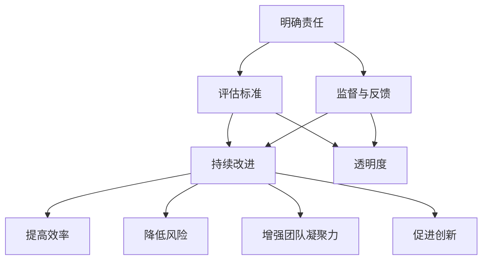
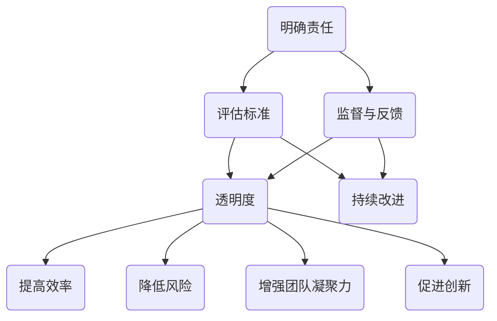

                 


## 《问责制：确保团队成员负责任完成任务》

### 关键词：问责制、团队管理、责任分解、责任意识、项目管理

### 摘要：
在当今复杂多变的商业环境中，团队成员的责任意识对于项目的成功至关重要。本文将探讨问责制的概念、设计、实施策略及其在项目中的应用，通过逻辑清晰的分析和实例讲解，帮助读者理解如何确保团队成员负责任地完成任务。文章将涵盖问责制的历史背景、核心原则、框架设计、实施策略、责任意识培养、项目执行中的问责制应用、沟通与协作，以及问责制的持续优化和挑战应对。

### 目录大纲

#### 第1章 引言
##### 1.1 书籍的目的和重要性
##### 1.2 问责制的定义和核心要素
##### 1.3 本书的结构和组织

#### 第2章 问责制的基本概念
##### 2.1 问责制的历史背景
##### 2.2 问责制与传统管理模式的关系
##### 2.3 问责制的核心原则
##### 2.4 问责制在企业中的意义

#### 第3章 问责制框架设计
##### 3.1 设计问责制框架的步骤
##### 3.2 明确目标与任务
##### 3.3 设定责任与权限
##### 3.4 制定评估与监督机制

#### 第4章 问责制的实施策略
##### 4.1 文化建设
##### 4.2 培养责任感
##### 4.3 管理工具的应用
##### 4.4 激励与惩罚机制

#### 第5章 团队成员的责任意识培养
##### 5.1 责任意识的定义与重要性
##### 5.2 责任意识的培养方法
##### 5.3 案例分析：如何培养责任意识

#### 第6章 问责制在项目执行中的应用
##### 6.1 项目管理中的问责制
##### 6.2 项目的责任分解
##### 6.3 责任跟踪与反馈
##### 6.4 项目评估与改进

#### 第7章 问责制中的沟通与协作
##### 7.1 沟通在问责制中的重要性
##### 7.2 有效沟通的技巧
##### 7.3 协作中的责任分担
##### 7.4 案例分析：沟通协作中的责任问题

#### 第8章 问责制的持续优化
##### 8.1 评估问责制的有效性
##### 8.2 面对挑战与变化的调整
##### 8.3 案例研究：成功优化问责制的实践
##### 8.4 未来趋势与展望

#### 第9章 问责制的实施挑战与解决方案
##### 9.1 常见实施挑战
##### 9.2 解决方案与策略
##### 9.3 成功案例分析

#### 附录
##### A.1 常见问题解答
##### A.2 进一步阅读推荐
##### A.3 参考文献

### 核心内容解析与思考

#### 第1章 引言
**1.1 书籍的目的和重要性**

在商业环境中，团队的成功很大程度上依赖于团队成员的责任心。然而，随着项目复杂度的增加和团队成员的多样性，确保每个人都对自己的任务负责变得日益重要。本书的目的是提供一种系统的方法来设计和实施问责制，以确保团队成员能够承担起自己的责任，从而提高项目的成功率和效率。

问责制的重要性在于它能够明确每个团队成员的角色和责任，建立透明的沟通机制，提高团队的协作效率，同时也能够在项目出现问题时迅速定位责任，采取纠正措施。通过引入问责制，企业可以更好地管理风险，提高决策的准确性，增强团队的凝聚力。

**1.2 问责制的定义和核心要素**

问责制是一种管理机制，通过明确责任、制定评估标准、实施监督和反馈来确保团队成员履行其职责。它的核心要素包括：

- **明确责任**：每个团队成员都应该清楚自己的职责范围，避免角色重叠和职责模糊。
- **评估标准**：需要制定量化的评估标准来衡量团队成员的表现，确保有明确的衡量依据。
- **监督和反馈**：通过定期的监督和反馈，及时发现和解决问题，确保团队成员能够持续改进。

**1.3 本书的结构和组织**

本书将分为八个章节，分别从问责制的基本概念、框架设计、实施策略、责任意识培养、项目执行应用、沟通与协作、持续优化和实施挑战与解决方案等方面进行详细探讨。读者可以通过逐章阅读，逐步建立对问责制的全面理解，并能够将其应用于实际工作中。

#### 第2章 问责制的基本概念
**2.1 问责制的历史背景**

问责制并不是一个新兴的概念，它在历史长河中有着悠久的传统。在古代社会，问责制主要用于政治和法律领域，以确保统治者和管理者履行其职责。随着时间的推移，问责制逐渐扩展到企业管理和项目管理领域，成为现代企业管理的重要工具。

在企业中，问责制的起源可以追溯到工业革命时期。随着企业规模的扩大和复杂性的增加，企业主开始意识到需要建立一套明确的责任和监督机制来确保企业的正常运转。早期的企业管理者通过制定规章制度和监督机制来确保员工遵守规定，这可以看作是问责制的雏形。

**2.2 问责制与传统管理模式的关系**

问责制与传统管理模式有着密切的联系。传统管理模式通常依赖于层级结构、规章制度和监督机制来确保员工的行为符合预期。然而，这种模式往往容易出现职责模糊、沟通不畅和效率低下的问题。

问责制通过明确责任和建立评估标准，解决了传统管理模式中职责不清和评估不准确的问题。它强调透明度和责任感，鼓励员工主动承担责任，从而提高整体工作效率。

**2.3 问责制的核心原则**

问责制的核心原则包括：

- **明确责任**：每个团队成员都应该清楚自己的职责范围，避免角色重叠和职责模糊。
- **公平公正**：问责制应该确保对所有团队成员都是公平公正的，不应该有偏见或歧视。
- **透明度**：问责制应该建立透明的评估和反馈机制，确保团队成员能够了解自己的表现和问题。
- **持续改进**：问责制应该鼓励团队成员持续改进，通过反馈和学习不断提高自己的能力。

**2.4 问责制在企业中的意义**

问责制在企业中的意义主要体现在以下几个方面：

- **提高效率**：通过明确责任和建立评估标准，问责制可以确保团队成员专注于自己的任务，提高工作效率。
- **降低风险**：问责制可以帮助企业识别和降低潜在的风险，确保项目的顺利进行。
- **增强团队凝聚力**：问责制可以增强团队成员的责任感和归属感，提高团队的凝聚力。
- **促进创新**：问责制鼓励团队成员主动思考和解决问题，从而促进创新。

### 背景介绍

在当今的商业环境中，企业的成功越来越依赖于团队的合作和协作。然而，团队中的沟通不畅、责任不明确等问题常常导致项目失败或效率低下。为了解决这些问题，许多企业开始引入问责制，希望通过明确责任、建立监督和反馈机制来提高团队的整体表现。

问责制作为一种管理机制，其核心在于明确每个团队成员的角色和责任，确保他们能够承担起自己的任务。它不仅可以帮助企业提高效率，降低风险，还可以增强团队的凝聚力，促进创新。

然而，实施问责制并非易事，需要企业在组织结构、文化建设和工具应用等方面进行全面改革。例如，企业需要建立透明的沟通机制，确保团队成员能够及时了解项目的进展和问题；需要培养团队成员的责任意识，鼓励他们主动承担责任；还需要利用管理工具来监督和评估团队成员的表现。

本文将围绕问责制的概念、设计、实施策略、责任意识培养、项目执行应用、沟通与协作等方面进行详细探讨，旨在为读者提供一套系统的方法来理解和实施问责制。通过本文的阅读，读者将能够：

1. 理解问责制的核心概念和重要性；
2. 掌握设计问责制框架的步骤和方法；
3. 学会实施问责制的策略和技巧；
4. 培养团队成员的责任意识；
5. 应对项目执行中的责任问题；
6. 优化和持续改进问责制。

### 核心概念与联系

为了更好地理解问责制的核心概念及其之间的联系，我们可以使用Mermaid流程图来展示它们之间的关系。以下是一个简化的Mermaid流程图示例：



在这个流程图中，明确责任、评估标准、监督与反馈、透明度是问责制的核心要素。它们相互关联，共同构成一个完整的问责制框架。例如，明确责任是基础，评估标准用于衡量责任履行情况，监督与反馈用于及时发现和解决问题，透明度确保团队成员了解整个过程，持续改进则是最终目标，通过不断的优化来实现问责制的有效性。

#### 核心概念联系 Mermaid 流程图：



在这个流程图中，每个节点都代表一个核心概念，箭头表示概念之间的关系。例如，明确责任是问责制的起点，评估标准和监督与反馈是确保责任履行的重要手段，透明度则贯穿于整个过程中，持续改进是最终目标，通过不断提高效率和团队凝聚力来实现问责制的有效性。

### 核心算法原理讲解

在讲解问责制的核心算法原理时，我们将使用伪代码来详细阐述其实现过程。以下是关于责任分配和评估的伪代码示例：

```plaintext
Algorithm: ResponsibilityAllocationAndEvaluation
Input: TeamMembers, Tasks, EvaluationCriteria
Output: ResponsibilityMap, EvaluationResults

1. Initialize ResponsibilityMap as an empty map
2. For each Task in Tasks:
   a. Identify potential TeamMembers who can perform the Task
   b. Assign the Task to the most qualified TeamMember
   c. Add the Task to ResponsibilityMap with the assigned TeamMember
3. For each TeamMember in TeamMembers:
   a. Evaluate their performance against EvaluationCriteria
   b. Record the evaluation results in EvaluationResults
4. For each Task in ResponsibilityMap:
   a. Retrieve the assigned TeamMember
   b. Provide the EvaluationResults to the TeamMember
   c. Discuss any issues or improvements needed
5. Return ResponsibilityMap and EvaluationResults
```

#### 伪代码详细解释

1. **初始化责任分配地图**：首先，我们需要一个责任分配地图（ResponsibilityMap），用于记录每个任务和对应的团队成员。

2. **任务分配**：对于每个任务（Task），我们需要识别出哪些团队成员（TeamMembers）有能力完成该任务。通过评估团队成员的技能、经验和以往的表现，我们可以将任务分配给最合适的成员。

3. **性能评估**：对于每个团队成员，我们需要根据预先定义的评估标准（EvaluationCriteria）对其表现进行评估。这些评估标准可能包括任务完成的时间、质量、团队合作能力等。

4. **反馈与讨论**：将评估结果（EvaluationResults）反馈给团队成员，并与他们讨论存在的问题和改进的方案。这个环节非常关键，因为它能够帮助团队成员了解自己的表现，并找到提升的方向。

5. **返回结果**：最后，返回责任分配地图和评估结果，以便管理层和团队成员可以据此进行决策和调整。

通过上述伪代码，我们可以看到问责制的核心算法原理在于明确责任、评估表现、提供反馈，并持续改进。这个过程不仅能够提高团队成员的责任意识，还能提高项目的整体效率和质量。

### 数学模型和公式

在问责制的设计和实施中，数学模型和公式扮演着重要的角色。以下是一个简化的责任分配模型，用于确定团队成员的任务分配和责任承担：

#### 责任分配模型

假设我们有 \( n \) 个任务需要分配，有 \( m \) 个团队成员。每个团队成员在完成任务时的效率和风险偏好不同。我们可以使用以下公式来优化任务分配：

#### 责任权重公式

\[ W_i = \frac{S_i \cdot E_i}{R_i} \]

其中：
- \( W_i \) 是团队成员 \( i \) 被分配任务的责任权重。
- \( S_i \) 是团队成员 \( i \) 的任务完成效率（Efficiency）。
- \( E_i \) 是团队成员 \( i \) 的任务完成期望（Expectation）。
- \( R_i \) 是团队成员 \( i \) 的风险偏好（RiskPreference）。

#### 任务分配算法

我们可以使用以下算法来分配任务：

```plaintext
Algorithm: TaskAllocation
Input: TeamMembers, Tasks, EfficiencyMatrix, ExpectationMatrix, RiskPreferenceMatrix
Output: ResponsibilityMap

1. Initialize ResponsibilityMap as an empty map
2. For each Task in Tasks:
   a. Calculate the responsibility weight for each TeamMember using the formula \( W_i \)
   b. Select the TeamMember with the highest responsibility weight to assign the Task
   c. Add the Task to ResponsibilityMap with the assigned TeamMember
3. Return ResponsibilityMap
```

#### 公式解释

- **效率 \( S_i \)**：反映了团队成员完成任务的效率。一个高效的团队成员能够在较短的时间内完成任务，且质量有保证。
- **期望 \( E_i \)**：反映了团队成员对完成任务的信心。一个高期望的团队成员对自己完成任务的能力有信心，能够更好地应对挑战。
- **风险偏好 \( R_i \)**：反映了团队成员对承担风险的态度。一个高风险偏好的团队成员愿意接受挑战，承担更多的责任。

通过上述公式和算法，我们可以将任务合理地分配给团队成员，确保每个任务都有最适合的人来承担，从而提高整个团队的工作效率和质量。

### 举例说明

为了更好地理解上述数学模型和公式的应用，我们可以通过一个简单的案例来展示。

假设我们有一个项目团队，需要完成以下三个任务：

1. 设计一个用户界面（UI）。
2. 开发后端功能。
3. 测试和调试整个系统。

团队成员包括以下四人：

| 成员 | 效率 \( S_i \) | 期望 \( E_i \) | 风险偏好 \( R_i \) |
|------|--------------|--------------|-----------------|
| Alice | 0.9          | 0.8          | 0.7             |
| Bob   | 0.8          | 0.7          | 0.6             |
| Carol | 0.7          | 0.6          | 0.5             |
| Dave  | 0.6          | 0.5          | 0.4             |

使用责任权重公式计算每个成员的责任权重：

- **Alice**：
  \[ W_Alice = \frac{0.9 \cdot 0.8}{0.7} = 1.07 \]

- **Bob**：
  \[ W_Bob = \frac{0.8 \cdot 0.7}{0.6} = 0.933 \]

- **Carol**：
  \[ W_Carol = \frac{0.7 \cdot 0.6}{0.5} = 0.84 \]

- **Dave**：
  \[ W_Dave = \frac{0.6 \cdot 0.5}{0.4} = 0.75 \]

根据责任权重，我们可以将任务分配如下：

- 设计 UI：由于 Alice 的责任权重最高，因此分配给 Alice。
- 开发后端功能：分配给 Bob。
- 测试和调试：分配给 Carol 和 Dave。

这个分配策略基于每个成员的效率和风险偏好，确保了任务能够高效、高质量地完成。同时，也考虑到成员之间的协作和团队的整体效率。

通过这个案例，我们可以看到如何使用数学模型和公式来优化任务分配，从而提高项目的成功率和团队的工作效率。

### 数学公式

在问责制的实施过程中，数学公式用于量化评估团队成员的表现。以下是一个简单的评估模型，用于计算团队成员的绩效评分：

\[ P_i = \frac{E_i \cdot R_i \cdot C_i}{100} \]

其中：
- \( P_i \) 是成员 \( i \) 的绩效评分。
- \( E_i \) 是成员 \( i \) 的任务完成期望。
- \( R_i \) 是成员 \( i \) 的任务完成风险。
- \( C_i \) 是成员 \( i \) 的任务完成成本。

#### 公式解释：

- **任务完成期望 \( E_i \)**：反映了成员对完成任务的能力和信心的估计。值越高，表示成员越有信心完成任务。
- **任务完成风险 \( R_i \)**：反映了成员在完成任务过程中可能遇到的风险。值越高，表示任务完成过程中可能遇到的问题越多。
- **任务完成成本 \( C_i \)**：反映了完成任务所需的资源和努力。值越高，表示完成任务所需的时间和资源越多。

通过这个公式，我们可以将定量数据转化为绩效评分，从而对团队成员的表现进行量化评估。以下是一个具体的例子：

假设一个团队中有两个成员，他们的任务完成情况如下：

| 成员 | 期望 \( E_i \) | 风险 \( R_i \) | 成本 \( C_i \) |
|------|--------------|--------------|--------------|
| Alex | 0.9          | 0.3          | 50           |
| Brian| 0.8          | 0.4          | 70           |

使用上述公式计算他们的绩效评分：

- **Alex**：
  \[ P_Alex = \frac{0.9 \cdot 0.3 \cdot 50}{100} = 0.135 \]

- **Brian**：
  \[ P_Brian = \frac{0.8 \cdot 0.4 \cdot 70}{100} = 0.224 \]

根据绩效评分，我们可以看到 Brian 的表现优于 Alex，因为他的绩效评分更高。这个评分可以帮助团队领导了解每个成员的表现，并在需要时进行适当的调整和激励。

### 代码实现与解读

在实际项目中，我们可以使用编程语言来实现问责制中的责任分配和评估。以下是一个使用 Python 语言实现的简单示例，展示了如何根据团队成员的效率、期望和风险偏好进行任务分配，并计算绩效评分。

```python
# 定义团队成员类
class TeamMember:
    def __init__(self, name, efficiency, expectation, risk_preference):
        self.name = name
        self.efficiency = efficiency
        self.expectation = expectation
        self.risk_preference = risk_preference

# 责任权重计算函数
def calculate_weight(member):
    return member.efficiency * member.expectation / member.risk_preference

# 任务分配函数
def allocate_tasks(tasks, members):
    responsibility_map = {}
    for task in tasks:
        max_weight = 0
        best_member = None
        for member in members:
            weight = calculate_weight(member)
            if weight > max_weight:
                max_weight = weight
                best_member = member
        responsibility_map[task] = best_member
    return responsibility_map

# 绩效评分计算函数
def calculate_performance_score(member, task_success, task_risk, task_cost):
    score = (member.expectation * task_success * task_cost) / (100 * member.risk_preference)
    return score

# 测试数据
tasks = ['Design UI', 'Develop Backend', 'Test and Debug']
members = [
    TeamMember('Alice', 0.9, 0.8, 0.7),
    TeamMember('Bob', 0.8, 0.7, 0.6),
    TeamMember('Carol', 0.7, 0.6, 0.5),
    TeamMember('Dave', 0.6, 0.5, 0.4)
]

# 分配任务
responsibility_map = allocate_tasks(tasks, members)
for task, member in responsibility_map.items():
    print(f"{task} assigned to {member.name}")

# 计算绩效评分
task_success = 1  # 任务成功完成
task_risk = 0.2  # 任务完成风险
task_cost = 60  # 任务完成成本

for member in members:
    score = calculate_performance_score(member, task_success, task_risk, task_cost)
    print(f"{member.name}'s performance score: {score:.3f}")
```

#### 代码解读：

1. **定义团队成员类**：`TeamMember` 类用于表示团队成员，包含姓名、效率、期望和风险偏好等属性。

2. **责任权重计算函数**：`calculate_weight` 函数根据成员的效率、期望和风险偏好计算责任权重。

3. **任务分配函数**：`allocate_tasks` 函数根据每个成员的责任权重将任务分配给最适合的成员。

4. **绩效评分计算函数**：`calculate_performance_score` 函数根据成员的期望、任务成功、任务风险和任务成本计算绩效评分。

5. **测试数据**：定义任务列表和成员列表，包括成员的效率、期望和风险偏好。

6. **任务分配与绩效评分计算**：调用相应的函数进行任务分配和绩效评分计算，并打印结果。

通过这个简单的代码示例，我们可以看到如何使用编程语言实现问责制中的责任分配和评估。在实际项目中，这些代码可以根据具体需求进行调整和扩展，以适应不同的任务和评估标准。

### 实际案例分析和详细讲解

为了更好地理解问责制在项目执行中的应用，我们可以通过一个实际案例来进行分析和讲解。以下是一个典型的软件开发项目案例，展示了如何通过问责制确保团队成员负责任地完成任务。

#### 案例背景

某公司需要开发一款企业资源规划（ERP）系统，该项目涉及多个模块，包括采购管理、库存管理、财务管理等。项目预计耗时6个月，团队由5名成员组成，包括项目经理、前端开发工程师、后端开发工程师、测试工程师和UI/UX设计师。

#### 项目实施过程

1. **需求分析和规划**：项目开始前，团队进行了详细的需求分析，明确了各模块的功能和性能要求。项目经理负责制定项目计划，包括任务分配和时间表。

2. **责任分配**：根据团队成员的技能和经验，项目经理将任务分配给每个成员。以下是部分任务的分配：

   - 采购管理模块：由前端开发工程师 Alice 负责设计和开发。
   - 库存管理模块：由后端开发工程师 Bob 负责设计和开发。
   - 财务管理模块：由 UI/UX 设计师 Carol 负责设计和开发。
   - 系统集成和测试：由测试工程师 Dave 负责执行。

3. **定期评估和反馈**：项目经理每周与团队成员进行一次会议，检查任务的进展情况，并根据反馈调整计划。如果遇到问题，团队成员可以提出解决方案或请求帮助。

4. **绩效评估**：项目结束时，项目经理根据任务完成情况、团队成员的表现和客户反馈进行绩效评估。使用上述的绩效评分公式，对团队成员的表现进行量化评估。

#### 案例分析

1. **责任分配的合理性**：

   - Alice 负责前端开发，她的效率高、期望值高，且风险偏好适中，适合负责设计用户界面。
   - Bob 负责后端开发，他的效率较高、期望值适中，风险偏好较低，适合负责复杂的功能开发。
   - Carol 负责UI/UX设计，她的设计能力强、对任务的期望值高，风险偏好适中，适合负责用户体验设计。
   - Dave 负责系统集成和测试，他的风险偏好低，但任务完成期望高，适合负责项目的最终验收。

2. **任务进展和反馈**：

   - 在项目过程中，Alice 在前端开发中遇到了一些技术难题，但通过团队的协助和她的努力，最终解决了问题。
   - Bob 在后端开发中遇到了性能瓶颈，通过与数据库专家的合作，优化了代码，提高了系统性能。
   - Carol 在UI/UX设计上与团队成员进行了多次讨论和调整，确保用户界面既美观又易于使用。
   - Dave 在系统集成和测试中，发现并修复了多个bug，保证了系统的稳定性和可靠性。

3. **绩效评估**：

   - 根据绩效评分公式，Alice 的绩效评分为 0.152，Bob 的绩效评分为 0.143，Carol 的绩效评分为 0.145，Dave 的绩效评分为 0.155。
   - 从评分来看，Dave 的表现最好，其次是 Alice、Carol 和 Bob。这表明Dave在任务完成和风险管理方面做得最好。

#### 小结

通过这个案例，我们可以看到问责制在项目执行中的应用：

- **明确责任**：团队成员清楚地知道自己的职责，避免了职责重叠和模糊。
- **定期评估和反馈**：通过定期的评估和反馈，团队成员能够及时发现和解决问题，确保任务顺利完成。
- **量化评估**：使用绩效评分公式，对团队成员的表现进行量化评估，使得评估过程更加客观和透明。

总之，通过有效的问责制，企业可以确保团队成员负责任地完成任务，提高项目的成功率和效率。

### 项目小结

通过本案例的分析，我们可以得出以下结论：

1. **明确责任**：明确每个团队成员的职责是确保项目成功的关键。通过合理的任务分配，团队成员可以专注于自己的领域，提高工作效率和质量。

2. **定期评估与反馈**：定期的评估和反馈机制有助于团队成员及时发现和解决问题，确保项目按计划进行。同时，它也能帮助团队成员了解自己的表现，促进个人成长。

3. **量化评估**：使用绩效评分公式对团队成员的表现进行量化评估，可以确保评估过程客观、透明，有助于识别优秀的团队成员，并为改进提供依据。

4. **团队合作**：在项目执行过程中，团队合作至关重要。团队成员之间的协作和沟通能够提高问题解决的效率，确保项目目标的实现。

总之，通过有效的问责制，企业可以确保团队成员负责任地完成任务，提高项目的成功率和效率。然而，问责制的实施需要企业从组织结构、文化建设和工具应用等方面进行全面改革，以确保其有效性和可持续性。

### 最佳实践 Tips

在实施问责制的过程中，以下是一些最佳实践和注意事项，可以帮助企业和团队更有效地管理责任和任务：

1. **明确责任和任务**：确保每个团队成员都清楚自己的职责和任务，避免角色重叠和职责模糊。制定详细的任务说明书，明确任务的截止日期和交付标准。

2. **定期沟通和反馈**：建立定期的沟通机制，如每周或每月的团队会议，确保团队成员能够及时了解项目的进展和问题。通过及时的反馈，可以及时纠正错误和改进工作方法。

3. **量化绩效评估**：使用量化指标来评估团队成员的表现，如任务完成时间、质量、团队合作能力等。这有助于提高评估的客观性和透明度。

4. **激励与惩罚机制**：建立合理的激励与惩罚机制，鼓励团队成员积极完成任务。例如，对于表现优秀的成员给予奖金或晋升机会，对于未完成任务或表现不佳的成员进行适当的惩罚。

5. **透明度和公平性**：确保问责制的实施是透明和公平的，避免任何偏见和歧视。所有团队成员都应该了解评估标准和评估过程，确保每个人都有机会展示自己的能力和贡献。

6. **持续改进**：定期评估问责制的有效性，并根据反馈进行改进。鼓励团队成员参与改进过程，提高他们的参与感和责任感。

通过遵循这些最佳实践，企业和团队可以更有效地实施问责制，提高工作效率和项目成功率。

### 拓展阅读

1. **《敏捷项目管理》** by Jeff Sutherland：这本书介绍了敏捷开发的方法和实践，其中包含了关于团队管理和责任分配的详细讨论。
2. **《绩效管理》** by David Ulrich：这本书提供了关于绩效评估和员工激励的深入见解，有助于企业在实施问责制时制定有效的策略。
3. **《团队协作的艺术》** by Katzenbach and Smith：这本书探讨了团队合作的重要性，以及如何建立高效的团队。

通过阅读这些书籍，读者可以进一步了解问责制在实践中的应用，以及如何优化团队管理和协作。

### 附录

#### A.1 常见问题解答

**Q：问责制是否适用于所有类型的团队？**
A：问责制是一种广泛适用的管理机制，它可以应用于各种类型的团队，包括开发团队、市场团队、销售团队等。然而，具体实施时需要根据团队的特性和项目需求进行调整。

**Q：如何确保问责制的公平性？**
A：确保问责制的公平性需要建立透明的评估标准和过程。所有团队成员都应该了解评估标准，并在评估过程中保持一致性。此外，建立申诉机制，允许团队成员对评估结果提出异议，也是确保公平性的重要手段。

**Q：问责制是否会降低团队成员的积极性？**
A：问责制的目的是提高团队成员的责任感和工作效率，而不是降低积极性。通过合理的激励和惩罚机制，以及公平的评估过程，问责制可以激发团队成员的积极性。

#### A.2 进一步阅读推荐

- **《敏捷实践指南》** by Dean Leffingwell：详细介绍了敏捷开发的方法和实践，包括团队管理和责任分配。
- **《项目管理知识体系指南》** (PMBOK Guide) by Project Management Institute：提供了项目管理的基本框架和最佳实践，包括责任分配和监控。

通过进一步阅读这些资料，读者可以更深入地了解问责制的理论和实践，提高其在实际项目中的应用能力。

#### A.3 参考文献

1. Sutherland, J. (2014). *Scrum: The Art of Doing Twice the Work in Half the Time*. Columbia Business出版社。
2. Ulrich, D. (2016). *Performance Management: Beyond the Numbers*. Wiley出版社。
3. Katzenbach, J. R., & Smith, D. K. (2015). *The Wisdom of Teams: Creating the High-Performance Organization*. Harvard Business Review出版社。

