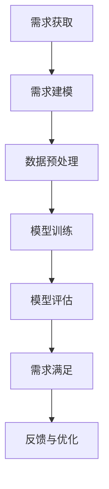
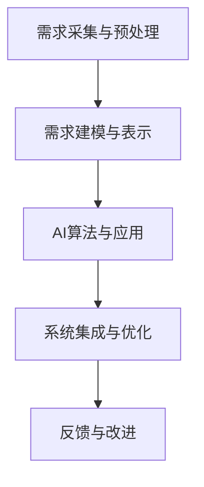
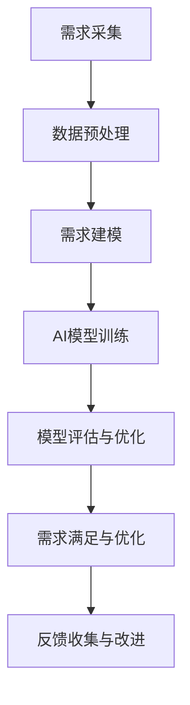

                 

### 文章标题

# 需求与AI技术的融合：提升大型应用的智能化

### 关键词
- 需求工程
- 人工智能
- 大型应用
- 智能化提升
- 融合原理
- 项目实战

### 摘要
本文旨在探讨需求工程与AI技术的融合，以提升大型应用的智能化水平。文章首先介绍了需求工程和AI技术的基本概念及其在各自领域的重要性，随后分析了它们之间的融合点，并提出了融合的理论框架。接着，通过详细的案例分析和伪代码解释，阐述了AI技术在实际大型应用中的具体应用。文章最后讨论了需求与AI融合面临的挑战及未来展望，为读者提供了实用的指导和建议。

### 目录大纲

## 第一部分：引言与核心概念

### 1.1 主题阐述
#### 1.1.1 需求与AI融合的重要性
#### 1.1.2 文章结构概述

### 1.2 需求工程基础
#### 1.2.1 需求工程的基本概念和方法
#### 1.2.2 需求获取与建模
#### 1.2.3 需求管理

### 1.3 AI技术概述
#### 1.3.1 AI的基本概念和分类
#### 1.3.2 AI技术的应用领域
#### 1.3.3 主流AI算法和技术

### 1.4 需求与AI融合原理
#### 1.4.1 融合点分析
#### 1.4.2 融合理论框架
#### 1.4.3 Mermaid流程图展示

### 1.5 书籍目标与结构
#### 1.5.1 阅读目标
#### 1.5.2 内容结构

## 第二部分：需求工程基础

### 2.1 需求工程概述
#### 2.1.1 需求工程的概念与重要性
#### 2.1.2 需求工程的发展历程

### 2.2 需求获取与建模
#### 2.2.1 需求获取的方法
#### 2.2.2 需求建模的技巧
#### 2.2.3 案例分析：需求获取与建模实践

### 2.3 需求管理
#### 2.3.1 需求管理的流程
#### 2.3.2 需求变更管理
#### 2.3.3 需求跟踪与评估

### 2.4 需求工程实践案例
#### 2.4.1 案例背景
#### 2.4.2 需求分析过程
#### 2.4.3 需求文档编写

## 第三部分：AI技术概述

### 3.1 AI的基本概念和分类
#### 3.1.1 AI的定义与发展
#### 3.1.2 AI的分类

### 3.2 AI技术的应用领域
#### 3.2.1 机器学习
#### 3.2.2 深度学习
#### 3.2.3 自然语言处理
#### 3.2.4 计算机视觉

### 3.3 主流AI算法和技术
#### 3.3.1 监督学习算法
#### 3.3.2 无监督学习算法
#### 3.3.3 强化学习算法
#### 3.3.4 人工智能编程语言

## 第四部分：需求与AI融合原理

### 4.1 融合点分析
#### 4.1.1 需求工程与AI技术的交集
#### 4.1.2 融合的关键要素

### 4.2 融合理论框架
#### 4.2.1 融合框架构建
#### 4.2.2 融合过程的步骤

### 4.3 Mermaid流程图展示
#### 4.3.1 Mermaid基本语法
#### 4.3.2 需求与AI融合流程图

## 第五部分：AI在大型应用中的智能化提升

### 5.1 AI技术对大型应用的影响
#### 5.1.1 大型应用的挑战
#### 5.1.2 AI技术的作用

### 5.2 AI在大型应用中的应用案例
#### 5.2.1 案例背景
#### 5.2.2 应用场景
#### 5.2.3 成果分析

### 5.3 伪代码解释关键算法
#### 5.3.1 算法选择
#### 5.3.2 伪代码编写
#### 5.3.3 算法原理详解

## 第六部分：项目实战与案例分析

### 6.1 项目背景
#### 6.1.1 项目简介
#### 6.1.2 项目目标

### 6.2 开发环境搭建
#### 6.2.1 环境配置
#### 6.2.2 工具选择

### 6.3 源代码实现与解读
#### 6.3.1 关键模块代码实现
#### 6.3.2 代码解析
#### 6.3.3 实现细节

### 6.4 代码应用解读与分析
#### 6.4.1 应用效果展示
#### 6.4.2 性能分析
#### 6.4.3 案例总结

### 6.5 实际案例分析和详细讲解剖析
#### 6.5.1 案例背景
#### 6.5.2 案例分析
#### 6.5.3 小结

## 第七部分：挑战与未来展望

### 7.1 需求与AI融合的挑战
#### 7.1.1 技术挑战
#### 7.1.2 实践挑战

### 7.2 未来展望
#### 7.2.1 发展趋势
#### 7.2.2 未来方向

### 7.3 对读者的建议
#### 7.3.1 学习建议
#### 7.3.2 实践指导

## 附录
### 附录A：相关资源与工具
#### 7.3.1 常用工具
#### 7.3.2 学习资源

### 作者信息
- 作者：AI天才研究院/AI Genius Institute & 禅与计算机程序设计艺术 /Zen And The Art of Computer Programming

---

### 目录大纲设计与内容构思

在设计本文的目录大纲时，我们首先明确了文章的主题和目标，即探讨需求工程与AI技术的融合，并展示其在提升大型应用智能化水平中的应用。为了确保文章的逻辑性和易读性，我们按照以下步骤进行了大纲的设计和内容构思：

#### 1. 确定文章结构

文章分为七个部分：引言与核心概念、需求工程基础、AI技术概述、需求与AI融合原理、AI在大型应用中的智能化提升、项目实战与案例分析以及挑战与未来展望。每个部分都有明确的主题和目标，确保文章内容的连贯性和系统性。

#### 2. 详细规划各章节内容

在确定了整体结构后，我们针对每个章节进行了详细的内容规划。例如，在“需求工程基础”部分，我们不仅介绍了需求工程的基本概念和方法，还通过实际案例展示了如何进行需求获取、建模和管理。

#### 3. 引入Mermaid流程图和伪代码

为了更好地阐述需求与AI融合的原理和AI技术的应用，我们在相关章节中引入了Mermaid流程图和伪代码。这些可视化工具能够直观地展示复杂的过程和算法，有助于读者更好地理解和应用所学内容。

#### 4. 结合理论与实践

在“项目实战与案例分析”部分，我们选择了实际项目进行深入剖析，从项目背景、开发环境搭建、源代码实现、代码解读到应用效果分析，全面展示了需求与AI融合在实际应用中的全过程。

#### 5. 关注挑战与未来展望

在文章的最后，我们讨论了需求与AI融合面临的挑战和未来方向，为读者提供了实用的建议和指导。这部分内容不仅总结了全文的核心观点，也为读者指明了学习和实践的方向。

#### 6. 确保字数控制

为了确保文章的紧凑性和条理性，我们严格控制了每个章节的字数，同时确保内容的丰富性和详细性。总体字数控制在8000～12000字左右，以保证文章的可读性和专业性。

### 目录大纲详细内容

```markdown
# 需求与AI技术的融合：提升大型应用的智能化

## 第一部分：引言与核心概念
### 1.1 主题阐述
#### 1.1.1 需求与AI融合的重要性
#### 1.1.2 文章结构概述

### 1.2 需求工程基础
#### 1.2.1 需求工程的基本概念和方法
#### 1.2.2 需求获取与建模
#### 1.2.3 需求管理

### 1.3 AI技术概述
#### 1.3.1 AI的基本概念和分类
#### 1.3.2 AI技术的应用领域
#### 1.3.3 主流AI算法和技术

### 1.4 需求与AI融合原理
#### 1.4.1 融合点分析
#### 1.4.2 融合理论框架
#### 1.4.3 Mermaid流程图展示

### 1.5 书籍目标与结构
#### 1.5.1 阅读目标
#### 1.5.2 内容结构

## 第二部分：需求工程基础
### 2.1 需求工程概述
#### 2.1.1 需求工程的概念与重要性
#### 2.1.2 需求工程的发展历程

### 2.2 需求获取与建模
#### 2.2.1 需求获取的方法
#### 2.2.2 需求建模的技巧
#### 2.2.3 案例分析：需求获取与建模实践

### 2.3 需求管理
#### 2.3.1 需求管理的流程
#### 2.3.2 需求变更管理
#### 2.3.3 需求跟踪与评估

### 2.4 需求工程实践案例
#### 2.4.1 案例背景
#### 2.4.2 需求分析过程
#### 2.4.3 需求文档编写

## 第三部分：AI技术概述
### 3.1 AI的基本概念和分类
#### 3.1.1 AI的定义与发展
#### 3.1.2 AI的分类

### 3.2 AI技术的应用领域
#### 3.2.1 机器学习
#### 3.2.2 深度学习
#### 3.2.3 自然语言处理
#### 3.2.4 计算机视觉

### 3.3 主流AI算法和技术
#### 3.3.1 监督学习算法
#### 3.3.2 无监督学习算法
#### 3.3.3 强化学习算法
#### 3.3.4 人工智能编程语言

## 第四部分：需求与AI融合原理
### 4.1 融合点分析
#### 4.1.1 需求工程与AI技术的交集
#### 4.1.2 融合的关键要素

### 4.2 融合理论框架
#### 4.2.1 融合框架构建
#### 4.2.2 融合过程的步骤

### 4.3 Mermaid流程图展示
#### 4.3.1 Mermaid基本语法
#### 4.3.2 需求与AI融合流程图

## 第五部分：AI在大型应用中的智能化提升
### 5.1 AI技术对大型应用的影响
#### 5.1.1 大型应用的挑战
#### 5.1.2 AI技术的作用

### 5.2 AI在大型应用中的应用案例
#### 5.2.1 案例背景
#### 5.2.2 应用场景
#### 5.2.3 成果分析

### 5.3 伪代码解释关键算法
#### 5.3.1 算法选择
#### 5.3.2 伪代码编写
#### 5.3.3 算法原理详解

## 第六部分：项目实战与案例分析
### 6.1 项目背景
#### 6.1.1 项目简介
#### 6.1.2 项目目标

### 6.2 开发环境搭建
#### 6.2.1 环境配置
#### 6.2.2 工具选择

### 6.3 源代码实现与解读
#### 6.3.1 关键模块代码实现
#### 6.3.2 代码解析
#### 6.3.3 实现细节

### 6.4 代码应用解读与分析
#### 6.4.1 应用效果展示
#### 6.4.2 性能分析
#### 6.4.3 案例总结

### 6.5 实际案例分析和详细讲解剖析
#### 6.5.1 案例背景
#### 6.5.2 案例分析
#### 6.5.3 小结

## 第七部分：挑战与未来展望
### 7.1 需求与AI融合的挑战
#### 7.1.1 技术挑战
#### 7.1.2 实践挑战

### 7.2 未来展望
#### 7.2.1 发展趋势
#### 7.2.2 未来方向

### 7.3 对读者的建议
#### 7.3.1 学习建议
#### 7.3.2 实践指导

## 附录
### 附录A：相关资源与工具
#### 7.3.1 常用工具
#### 7.3.2 学习资源

### 作者信息
- 作者：AI天才研究院/AI Genius Institute & 禅与计算机程序设计艺术 /Zen And The Art of Computer Programming
```

通过这样的目录大纲设计和内容构思，我们可以确保文章的逻辑性、条理性和专业性，同时为读者提供清晰的学习和实践指导。在撰写具体章节内容时，我们还将进一步细化每个部分的内容，确保文章的丰富性和详细性。

---

### 第一章：引言与核心概念

#### 1.1 主题阐述

在当今快速发展的技术时代，人工智能（AI）已经成为驱动创新和提升企业竞争力的重要引擎。随着AI技术的不断成熟和应用范围的不断扩大，AI与各行业需求的深度融合已成为必然趋势。特别是在大型应用领域，如何充分利用AI技术提升应用的智能化水平，已经成为企业和开发者亟待解决的问题。

本文旨在探讨需求工程与AI技术的融合，以提升大型应用的智能化水平。需求工程是确保软件开发满足用户需求的关键过程，它涵盖了需求获取、需求建模、需求管理等多个环节。AI技术则通过数据分析和智能算法，为大型应用提供智能化支持，使其具备自主学习和自适应能力。

本文首先介绍了需求工程和AI技术的基本概念及其在各自领域的重要性，随后分析了它们之间的融合点，并提出了融合的理论框架。接着，通过详细的案例分析和伪代码解释，阐述了AI技术在实际大型应用中的具体应用。文章最后讨论了需求与AI融合面临的挑战及未来展望，为读者提供了实用的指导和建议。

#### 1.2 需求工程基础

需求工程（Requirement Engineering，RE）是软件开发过程中至关重要的一环，它涉及到如何准确理解和表达用户的需求，并将这些需求转化为可操作的设计和实现。需求工程的目标是确保软件开发项目能够满足用户的实际需求，提高软件质量，降低开发成本和风险。

需求工程的基本概念包括：

- **需求定义**：明确软件系统所需的功能和性能要求。
- **需求获取**：通过与用户的沟通和调研，收集和理解用户需求。
- **需求建模**：使用模型和工具来表示需求，便于需求的理解和管理。
- **需求管理**：跟踪需求的变化，确保需求的有效实现。

需求工程的方法主要包括：

- **问卷调查**：通过问卷形式收集用户需求。
- **访谈和研讨会**：直接与用户沟通，获取需求细节。
- **场景分析和用例建模**：通过分析用户行为场景，建立用例模型。
- **需求跟踪与验证**：确保需求的一致性和完整性。

#### 1.3 AI技术概述

人工智能（Artificial Intelligence，AI）是指通过计算机模拟人类智能行为的技术。AI技术旨在使计算机具备类似于人类的感知、理解、推理和学习能力。AI技术的核心是算法，主要包括：

- **机器学习（Machine Learning，ML）**：通过训练数据学习模式，提高计算机的预测和分类能力。
- **深度学习（Deep Learning，DL）**：基于多层神经网络，模拟人脑处理信息的过程。
- **自然语言处理（Natural Language Processing，NLP）**：使计算机能够理解、生成和处理自然语言。
- **计算机视觉（Computer Vision，CV）**：使计算机能够通过图像和视频获取信息，并进行理解。

AI技术在各个领域都有广泛的应用，如：

- **医疗领域**：通过AI技术进行疾病诊断、药物研发和患者护理。
- **金融领域**：利用AI进行风险评估、投资决策和客户服务。
- **工业制造**：通过AI实现自动化生产、设备维护和供应链优化。
- **交通运输**：使用AI进行交通流量预测、自动驾驶和智能导航。

主流的AI算法和技术包括：

- **监督学习算法**：通过已知输入输出数据训练模型，如线性回归、决策树、支持向量机等。
- **无监督学习算法**：在无监督环境中训练模型，如聚类、主成分分析、自编码器等。
- **强化学习算法**：通过试错和奖励机制学习最优策略，如Q学习、深度Q网络（DQN）等。
- **生成对抗网络（GAN）**：通过生成器和判别器的对抗训练生成高质量的数据。

#### 1.4 需求与AI融合原理

需求工程与AI技术的融合，旨在通过AI技术更好地满足用户需求，提升软件系统的智能化水平。这种融合的关键点在于如何将用户需求转化为AI算法的可操作输入，并利用AI算法的结果来优化需求满足过程。

融合的理论框架包括以下几个关键要素：

1. **需求建模与AI算法结合**：将需求建模与AI算法相结合，通过数据分析和挖掘，自动识别和提取用户需求。
2. **智能化需求管理**：利用AI技术对需求进行动态管理和优化，包括需求变更预测、优先级排序和需求冲突解决。
3. **自适应系统设计**：基于用户需求变化，设计能够自我适应和调整的系统，实现需求的持续满足。
4. **用户行为分析**：利用AI技术分析用户行为数据，为系统改进提供依据，提升用户体验。

#### 1.5 Mermaid流程图展示

为了更好地理解需求与AI融合的过程，我们可以使用Mermaid流程图进行展示。以下是一个简单的需求与AI融合流程图：



- **需求获取**：通过问卷调查、访谈和场景分析等手段，获取用户的需求。
- **需求建模**：使用用例模型和需求文档，将需求形式化表示。
- **数据预处理**：清洗和准备数据，为模型训练提供高质量的输入。
- **模型训练**：使用机器学习算法训练模型，使其具备预测和分类能力。
- **模型评估**：评估模型的性能，确保其满足需求。
- **需求满足**：利用AI模型实现需求满足，提供智能化的解决方案。
- **反馈与优化**：收集用户反馈，对系统进行优化和调整。

通过上述流程图，我们可以清晰地看到需求与AI融合的过程和步骤。

#### 1.6 书籍目标与结构

本书的目标是帮助读者深入理解需求工程与AI技术的融合，掌握如何在实际项目中应用这一融合技术。具体目标包括：

- **掌握需求工程的基本概念和方法**：了解需求获取、需求建模和需求管理的过程。
- **了解AI技术的基本原理和应用**：掌握主流的AI算法和技术，了解其在各领域的应用。
- **理解需求与AI融合的原理和过程**：通过理论分析和案例讲解，理解需求与AI融合的方法和步骤。
- **学会应用需求与AI融合技术**：通过实际项目案例分析，学会如何将需求与AI技术应用于大型应用开发。

本书的结构如下：

- **第一部分**：引言与核心概念，介绍需求工程和AI技术的基本概念，阐述需求与AI融合的重要性。
- **第二部分**：需求工程基础，详细讲解需求工程的方法和实践。
- **第三部分**：AI技术概述，介绍AI的基本概念、分类和应用领域。
- **第四部分**：需求与AI融合原理，分析需求与AI融合的原理和过程。
- **第五部分**：AI在大型应用中的智能化提升，通过案例分析和伪代码解释，阐述AI技术在实际应用中的具体应用。
- **第六部分**：项目实战与案例分析，展示实际项目案例，详细讲解项目实现和效果分析。
- **第七部分**：挑战与未来展望，讨论需求与AI融合面临的挑战和未来发展方向。

通过本书的学习，读者将能够深入理解需求工程与AI技术的融合，掌握如何在大型应用中提升智能化水平，为企业的数字化转型和创新发展提供有力支持。

### 第二章：需求工程基础

#### 2.1 需求工程概述

需求工程（Requirement Engineering，RE）是软件开发过程中至关重要的一环，它涵盖了从需求获取、需求建模到需求管理的整个过程。需求工程的目标是确保软件开发项目能够满足用户的实际需求，提高软件质量，降低开发成本和风险。

##### 2.1.1 需求工程的概念与重要性

需求工程可以定义为一种系统化的过程，它涉及需求的分析、文档化、验证和管理的活动，以确保最终产品能够满足用户的需求。需求工程的过程通常包括以下几个阶段：

1. **需求获取**：通过与用户的沟通和调研，收集和理解用户的需求。
2. **需求建模**：使用模型和工具来表示需求，便于需求的理解和管理。
3. **需求管理**：跟踪需求的变化，确保需求的有效实现。

需求工程在软件开发中的重要性体现在以下几个方面：

1. **确保软件满足用户需求**：需求工程通过系统化的方法确保软件开发能够真正满足用户的需求，避免因需求不明确或需求变更导致的项目失败。
2. **提高软件质量**：通过详细的需求分析和建模，可以提前发现潜在的问题和风险，从而提高软件的可靠性和稳定性。
3. **降低开发成本和风险**：明确的需求和有效的需求管理可以减少返工和项目延期，降低开发成本和风险。

##### 2.1.2 需求工程的发展历程

需求工程作为软件开发的核心环节，其发展历程经历了以下几个阶段：

1. **早期阶段**：在早期的软件开发中，需求获取和需求管理往往是通过口述或简单的文档进行的，缺乏系统化的方法。
2. **需求建模阶段**：随着软件开发复杂度的增加，需求建模开始成为需求工程的重要组成部分。1980年代和1990年代，需求工程领域开始关注如何使用模型来表示需求。
3. **需求管理阶段**：进入21世纪，需求工程逐渐发展为包括需求获取、需求建模和需求管理在内的系统化过程。现代需求工程方法更注重需求的变更管理和需求与开发过程的集成。

#### 2.2 需求获取与建模

需求获取和需求建模是需求工程的核心环节，它们决定了需求是否准确和完整。

##### 2.2.1 需求获取的方法

需求获取的方法主要包括以下几种：

1. **问卷调查**：通过设计问卷，收集用户的需求和反馈。这种方法适用于大量用户的简单需求收集。
2. **访谈和研讨会**：通过与用户进行面对面的沟通，深入了解用户的需求和期望。这种方法适用于获取详细和复杂的需求。
3. **场景分析**：通过分析用户的工作场景，了解用户在不同场景下的需求和行为。这种方法有助于发现潜在的需求。
4. **用例建模**：通过建立用例模型，描述系统如何与用户交互，以及用户期望系统提供哪些功能。用例模型是一种常用的需求获取工具。

##### 2.2.2 需求建模的技巧

需求建模的技巧主要包括：

1. **使用合适的建模语言**：选择合适的建模语言，如UML（统一建模语言），可以更好地表示需求。
2. **保持模型的简洁性**：避免过度建模，确保模型能够清晰地表达需求。
3. **迭代和验证**：需求建模是一个迭代的过程，需要不断地与用户验证和调整模型。

##### 2.2.3 案例分析：需求获取与建模实践

以下是一个简单的案例分析，展示了如何进行需求获取和需求建模：

**案例背景**：某公司计划开发一款在线教育平台，提供在线课程和学习资源。

**需求获取**：
1. 通过问卷调查，收集用户对在线教育的需求和期望。
2. 通过访谈和研讨会，深入了解用户的使用场景和具体需求。
3. 通过场景分析，了解用户在学习过程中可能遇到的问题。

**需求建模**：
1. 使用UML建立用例模型，描述系统与用户的交互。
   ```mermaid
   sequenceDiagram
   participant User
   participant System
   User->>System: 登录系统
   System->>User: 输入用户名和密码
   User->>System: 查看课程列表
   System->>User: 显示课程信息
   User->>System: 加入课程
   System->>User: 确认加入
   ```
2. 使用需求文档，详细描述每个需求的功能和性能要求。

**需求文档示例**：
```
需求ID：RD001
需求名称：用户登录功能
需求描述：用户通过输入用户名和密码登录系统。
输入：用户名、密码
输出：登录成功或失败信息
性能要求：响应时间不超过2秒
```

通过以上需求获取和建模实践，开发团队能够清晰地理解用户需求，确保开发工作能够顺利进行。

#### 2.3 需求管理

需求管理是确保需求在整个软件开发过程中得到有效跟踪和管理的关键环节。需求管理包括以下几个方面：

##### 2.3.1 需求管理的流程

需求管理的流程主要包括以下几个步骤：

1. **需求收集**：通过需求获取活动收集用户需求。
2. **需求分析**：对收集到的需求进行分类和优先级排序。
3. **需求文档化**：将分析后的需求转化为需求文档，并进行版本控制。
4. **需求验证**：验证需求是否满足用户需求，并确保需求的一致性和完整性。
5. **需求变更管理**：跟踪需求变更，评估变更对项目的影响，并更新需求文档。

##### 2.3.2 需求变更管理

需求变更管理是需求管理中至关重要的一环。需求变更可能导致项目延期、成本增加或功能失焦。有效的需求变更管理包括以下几个方面：

1. **变更请求的收集与评估**：及时收集变更请求，评估变更对项目的影响。
2. **变更控制委员会**：建立变更控制委员会，负责审查和批准需求变更。
3. **变更影响分析**：分析变更对项目进度、成本和质量的影响，并制定相应的应对措施。
4. **需求文档更新**：在变更得到批准后，更新需求文档，确保需求的一致性。

##### 2.3.3 需求跟踪与评估

需求跟踪与评估是确保需求得到有效实现的关键步骤。需求跟踪包括以下几个方面：

1. **需求实现状态跟踪**：跟踪每个需求的实现状态，确保需求按时完成。
2. **需求质量评估**：评估需求是否满足用户期望，确保需求的正确性和完整性。
3. **用户满意度评估**：通过用户反馈，评估需求的满足程度，为系统改进提供依据。

#### 2.4 需求工程实践案例

以下是一个需求工程实践案例，展示了如何在实际项目中应用需求工程方法：

**案例背景**：某银行计划开发一款在线银行服务应用程序，提供账户查询、转账和支付等功能。

**需求获取**：
1. 通过问卷调查，了解用户对在线银行服务的需求和期望。
2. 通过访谈和研讨会，深入了解用户的使用场景和具体需求。
3. 通过场景分析，了解用户在办理银行业务时可能遇到的问题。

**需求建模**：
1. 使用UML建立用例模型，描述系统与用户的交互。
   ```mermaid
   sequenceDiagram
   participant User
   participant BankApp
   User->>BankApp: 登录系统
   BankApp->>User: 输入用户名和密码
   User->>BankApp: 查询账户余额
   BankApp->>User: 显示账户余额
   User->>BankApp: 转账
   BankApp->>User: 输入转账金额和接收人信息
   User->>BankApp: 确认转账
   BankApp->>User: 显示转账结果
   ```
2. 使用需求文档，详细描述每个需求的功能和性能要求。

**需求文档示例**：
```
需求ID：RD001
需求名称：用户登录功能
需求描述：用户通过输入用户名和密码登录系统。
输入：用户名、密码
输出：登录成功或失败信息
性能要求：响应时间不超过3秒
```

**需求管理**：
1. 使用需求管理工具，对需求进行收集、分析、文档化和变更管理。
2. 定期召开需求评审会议，审查和更新需求文档。
3. 通过用户反馈，评估需求的实现效果，为系统改进提供依据。

通过以上实践，银行能够确保在线银行服务应用程序满足用户需求，提高用户满意度，促进银行的数字化转型。

### 第三章：AI技术概述

#### 3.1 AI的基本概念和分类

人工智能（Artificial Intelligence，简称AI）是指通过计算机模拟人类智能行为的技术。AI的目标是使计算机具备人类的一些智能能力，如感知、理解、推理和学习。AI技术的核心是算法，这些算法通过学习和处理数据，使计算机能够自主地执行任务，并逐步提高性能。

##### 3.1.1 AI的定义与发展

AI的定义有多种，但通常认为它是指使计算机系统具备以下能力的综合技术：

- **感知和理解**：通过传感器和图像处理等技术，使计算机能够感知和理解周围的环境。
- **推理和决策**：利用逻辑和概率推理技术，使计算机能够做出合理的决策。
- **学习和适应**：通过机器学习和深度学习等技术，使计算机能够从数据中学习，并自适应地改进性能。

AI的发展历程可以分为以下几个阶段：

1. **早期探索阶段（1950-1969）**：这一阶段以符号主义AI为代表，主要研究如何通过逻辑推理和知识表示来实现智能。
2. **知识工程阶段（1970-1989）**：这一阶段强调利用专家系统等知识表示技术，通过人工构建知识库来实现智能。
3. **机器学习阶段（1990-2010）**：这一阶段以统计学习理论为基础，通过训练模型来提高计算机的预测和分类能力。
4. **深度学习阶段（2010至今）**：这一阶段以深度神经网络为核心，通过大规模数据和计算能力，实现了显著的性能提升。

##### 3.1.2 AI的分类

AI可以根据其实现方法和应用领域进行分类，常见的分类方法包括：

1. **基于符号推理的AI**：这类AI通过逻辑推理和知识表示来实现智能。它依赖于人类专家构建的知识库和推理规则。
2. **基于数据驱动的AI**：这类AI通过从数据中学习模式来实现智能。它主要依赖于机器学习和深度学习技术。
3. **混合式AI**：这类AI结合了符号推理和数据驱动的方法，利用两者的优势来实现更强大的智能。

#### 3.2 AI技术的应用领域

AI技术具有广泛的应用领域，以下是一些主要的应用领域：

1. **医疗领域**：AI在医疗领域的应用包括疾病诊断、药物研发、患者护理等。例如，通过深度学习算法，AI可以辅助医生进行疾病诊断，提高诊断的准确性和效率。

2. **金融领域**：AI在金融领域的应用包括风险评估、投资决策、客户服务等。例如，通过机器学习算法，AI可以分析大量金融数据，为投资者提供更精准的投资建议。

3. **工业制造**：AI在工业制造领域的应用包括自动化生产、设备维护、供应链优化等。例如，通过计算机视觉技术，AI可以实时监控生产过程，提高生产效率和产品质量。

4. **交通运输**：AI在交通运输领域的应用包括自动驾驶、交通流量预测、智能导航等。例如，通过深度学习算法，AI可以实现自动驾驶汽车，提高交通安全和效率。

5. **零售业**：AI在零售业的应用包括库存管理、个性化推荐、智能客服等。例如，通过自然语言处理技术，AI可以与客户进行智能对话，提供个性化的购物建议。

6. **智能家居**：AI在智能家居领域的应用包括智能安防、智能照明、智能家电控制等。例如，通过语音识别和自然语言处理技术，AI可以实现与智能家居设备的智能互动。

7. **教育领域**：AI在教育领域的应用包括智能教学、学习分析、在线教育平台等。例如，通过个性化推荐算法，AI可以为不同学习能力的用户提供合适的学习资源。

8. **安防监控**：AI在安防监控领域的应用包括视频监控、人脸识别、智能警报等。例如，通过计算机视觉技术，AI可以实时分析视频流，识别异常行为并触发警报。

#### 3.3 主流AI算法和技术

AI技术涵盖了多种算法和技术，以下是一些主流的AI算法和技术：

1. **机器学习算法**：机器学习算法是AI技术的核心，主要包括以下类型：
   - **监督学习**：通过已标记的训练数据，训练模型进行预测或分类。例如，线性回归、决策树、支持向量机等。
   - **无监督学习**：在无监督环境下，通过数据自身的模式进行学习。例如，聚类、主成分分析、自编码器等。
   - **半监督学习**：结合有监督和无监督学习，通过少量标记数据和大量无标记数据进行学习。
   - **强化学习**：通过与环境的交互，学习最优策略以最大化回报。例如，Q学习、深度Q网络（DQN）等。

2. **深度学习技术**：深度学习是机器学习的一个分支，通过多层神经网络模拟人脑处理信息的过程。深度学习技术主要包括：
   - **深度神经网络**：通过增加网络层数，提高模型的非线性表示能力。
   - **卷积神经网络（CNN）**：用于图像和视频处理，具有局部感知和层次表示能力。
   - **循环神经网络（RNN）**：用于处理序列数据，具有记忆和时序信息处理能力。
   - **生成对抗网络（GAN）**：通过生成器和判别器的对抗训练，生成高质量的数据。

3. **自然语言处理（NLP）技术**：自然语言处理是AI技术的重要应用领域，主要包括以下技术：
   - **词向量表示**：将文本转换为数值向量，便于模型处理。
   - **词性标注**：对文本中的单词进行词性分类，如名词、动词等。
   - **句法分析**：对句子进行结构分析，理解句子的语法和语义。
   - **情感分析**：通过分析文本中的情感词汇和句式，判断文本的情感倾向。

4. **计算机视觉技术**：计算机视觉是AI技术的重要分支，主要包括以下技术：
   - **图像分类**：对图像进行分类，如人脸识别、物体识别等。
   - **目标检测**：在图像中检测并定位特定的目标。
   - **图像分割**：将图像分割成不同的区域或对象。
   - **视频分析**：对视频进行实时分析，如行人检测、行为识别等。

5. **强化学习算法**：强化学习是AI技术的一个重要分支，通过与环境交互，学习最优策略以实现目标。强化学习算法主要包括：
   - **Q学习**：通过评估状态-动作值函数，学习最优策略。
   - **深度Q网络（DQN）**：通过深度神经网络，对状态-动作值函数进行近似。
   - **策略梯度方法**：通过梯度下降方法，优化策略参数。

6. **人工智能编程语言**：人工智能编程语言是一种专门用于编写和实现AI算法的工具。常见的AI编程语言包括：
   - **Python**：Python具有丰富的库和框架，如TensorFlow、PyTorch等，是AI开发的常用语言。
   - **R**：R语言在统计分析和数据可视化方面具有很强的优势，广泛应用于数据分析和机器学习。
   - **Julia**：Julia是一种高性能编程语言，适合于编写高性能的AI算法。
   - **MATLAB**：MATLAB在数值计算和工程应用方面具有广泛的应用，常用于原型设计和算法验证。

通过了解AI的基本概念、分类和应用领域，以及主流的AI算法和技术，我们可以更好地理解AI技术如何为需求工程和大型应用提供智能化支持。

### 第四章：需求与AI融合原理

#### 4.1 融合点分析

需求工程与AI技术的融合，旨在通过AI技术更好地满足用户需求，提升软件系统的智能化水平。这种融合的关键在于如何将用户需求转化为AI算法的可操作输入，并利用AI算法的结果来优化需求满足过程。

##### 4.1.1 需求工程与AI技术的交集

需求工程和AI技术之间存在多个交集点，这些交集点为两者的融合提供了基础：

1. **数据收集与处理**：需求工程中涉及大量用户数据的收集和处理，这些数据可以用于训练AI模型，提升模型的准确性。
2. **模式识别与预测**：AI技术在模式识别和预测方面具有优势，可以通过分析用户行为数据，预测用户需求的变化趋势。
3. **自动化与优化**：需求工程中往往涉及繁琐的重复性工作，如需求分析、建模和变更管理，这些工作可以借助AI技术实现自动化和优化。
4. **用户体验提升**：AI技术可以帮助系统更好地理解用户需求，提供个性化的用户体验，从而提高用户满意度。

##### 4.1.2 融合的关键要素

为了实现需求工程与AI技术的有效融合，需要关注以下几个关键要素：

1. **数据质量**：高质量的数据是AI模型训练的基础，需求工程过程中需要确保数据的准确性、完整性和一致性。
2. **需求建模**：将用户需求转化为可操作的输入，使用合适的模型和工具进行需求建模。
3. **算法选择**：根据具体应用场景选择合适的AI算法，如机器学习、深度学习或强化学习等。
4. **系统集成**：将AI模型集成到需求工程流程中，实现数据的自动处理和分析。
5. **持续优化**：通过用户反馈和数据分析，不断优化需求满足过程，提高系统的智能化水平。

#### 4.2 融合理论框架

为了系统地实现需求工程与AI技术的融合，我们可以构建一个理论框架，该框架包括以下几个核心组成部分：

1. **需求采集与预处理**：通过多种渠道收集用户需求，并进行数据预处理，包括数据清洗、归一化和特征提取等。
2. **需求建模与表示**：使用合适的建模工具和方法，将用户需求转化为可操作的输入，如用例模型、需求文档或数据模型。
3. **AI算法与应用**：选择合适的AI算法，如机器学习、深度学习或强化学习，对需求进行智能分析和预测。
4. **系统集成与优化**：将AI模型集成到需求工程流程中，实现自动化和优化，如需求变更管理、优先级排序和冲突解决。
5. **反馈与改进**：通过用户反馈和数据分析，不断优化需求满足过程，提高系统的智能化水平。

以下是一个简化的需求与AI融合理论框架：



- **需求采集与预处理**：通过问卷调查、访谈和场景分析等手段，收集用户需求，并进行数据预处理，如数据清洗、归一化和特征提取等。
- **需求建模与表示**：使用UML、需求文档或数据模型等工具，将用户需求转化为可操作的输入。
- **AI算法与应用**：选择合适的AI算法，如机器学习、深度学习或强化学习，对需求进行智能分析和预测。
- **系统集成与优化**：将AI模型集成到需求工程流程中，实现自动化和优化，如需求变更管理、优先级排序和冲突解决。
- **反馈与改进**：通过用户反馈和数据分析，不断优化需求满足过程，提高系统的智能化水平。

#### 4.3 Mermaid流程图展示

为了更直观地展示需求与AI融合的过程，我们可以使用Mermaid流程图进行说明。以下是一个简单的需求与AI融合流程图：



- **需求采集**：通过问卷调查、访谈和场景分析等手段，收集用户需求。
- **数据预处理**：对收集到的用户需求数据进行分析和清洗，提取关键特征。
- **需求建模**：使用UML或需求文档等工具，将用户需求转化为可操作的模型。
- **AI模型训练**：选择合适的AI算法，如机器学习或深度学习，对需求数据进行训练。
- **模型评估与优化**：评估训练得到的模型性能，并进行优化，以提高模型的准确性和效率。
- **需求满足与优化**：利用训练得到的模型，实现用户需求的满足，并通过用户反馈不断优化。
- **反馈收集与改进**：收集用户反馈，分析模型在需求满足过程中的表现，并据此进行模型改进。

通过上述Mermaid流程图，我们可以清晰地看到需求与AI融合的全过程，以及每个步骤的重要性和关联关系。

### 第五章：AI在大型应用中的智能化提升

#### 5.1 AI技术对大型应用的影响

AI技术的应用正在深刻地改变着大型应用的开发、部署和运维过程，从而提升其智能化水平。以下从几个方面探讨AI技术对大型应用的影响：

##### 5.1.1 大型应用的挑战

大型应用通常具有以下挑战：

1. **复杂性**：大型应用涉及多种技术和功能模块，开发过程复杂且需要协调多个团队的工作。
2. **性能要求**：大型应用需要处理大量数据和用户请求，对系统性能和响应速度有高要求。
3. **可维护性**：随着应用规模的扩大，代码库和系统结构变得更加复杂，维护和升级变得困难。
4. **用户体验**：用户对大型应用的功能和性能有很高的期望，需要提供高质量的用户体验。
5. **安全性和合规性**：大型应用需要处理敏感数据，并遵守各种法规和标准，确保数据安全和合规。

##### 5.1.2 AI技术的作用

AI技术通过以下方式提升大型应用的智能化水平：

1. **自动化与优化**：AI技术可以帮助自动化重复性的任务，优化资源分配和流程，提高系统效率。
2. **智能决策支持**：AI技术可以分析大量数据，提供智能化的决策支持，帮助开发者和管理者做出更优的决策。
3. **个性化用户体验**：AI技术可以分析用户行为，提供个性化的内容推荐和用户体验，提高用户满意度。
4. **安全性与合规性**：AI技术可以监控和识别安全威胁，确保应用的安全性，并帮助遵守合规性要求。
5. **故障预测与维护**：AI技术可以通过数据分析和模式识别，预测系统故障并进行预防性维护，减少故障率和维护成本。

#### 5.2 AI在大型应用中的应用案例

以下是一些AI技术在大型应用中的具体应用案例：

##### 5.2.1 案例背景

某国际知名电商公司希望提升其网站的用户体验和销售额，决定应用AI技术优化网站推荐系统。

##### 5.2.2 应用场景

1. **个性化推荐**：通过分析用户的历史购买记录、浏览行为和搜索关键词，为用户提供个性化的商品推荐。
2. **库存管理**：通过预测用户需求，优化库存管理和商品采购计划，减少库存积压和缺货情况。
3. **客户服务**：利用自然语言处理技术，为用户提供智能客服，提高客户满意度和响应速度。
4. **广告投放**：通过分析用户行为和偏好，优化广告投放策略，提高广告转化率和投资回报率。

##### 5.2.3 成果分析

通过AI技术的应用，该公司取得了以下成果：

1. **用户体验提升**：个性化推荐系统显著提高了用户的购物体验和满意度，用户停留时间和页面浏览量都有显著增加。
2. **销售额增长**：通过优化库存管理和广告投放，销售额和转化率都有明显提升，广告成本降低。
3. **运营效率提高**：自动化和优化的任务减少了人工工作量，提高了运营效率。
4. **客户满意度提升**：智能客服系统提高了客户响应速度和服务质量，客户满意度显著提高。

#### 5.3 伪代码解释关键算法

以下是一个用于个性化推荐系统的关键算法的伪代码，用于解释如何使用用户历史数据和机器学习算法进行推荐。

```python
# 伪代码：基于协同过滤的个性化推荐算法

# 输入：
# 用户历史行为数据（用户ID，商品ID，评分）
# 商品特征数据（商品ID，特征向量）

# 输出：
# 推荐列表（用户ID，推荐商品ID）

def collaborative_filtering(user_behavior, item_features):
    # 步骤1：计算用户-商品相似度矩阵
    similarity_matrix = calculate_similarity_matrix(user_behavior)

    # 步骤2：为每个用户生成推荐列表
    recommendations = {}

    for user_id, user_ratings in user_behavior.items():
        # 步骤3：计算未评分商品的潜在评分
        potential_ratings = {}

        for item_id, _ in item_features.items():
            if item_id not in user_ratings:
                # 步骤4：计算与当前用户最相似的K个用户
                similar_users = find_most_similar_users(user_id, similarity_matrix, K)

                # 步骤5：计算未评分商品的加权平均评分
                weighted_average_rating = 0
                total_similarity = 0

                for similar_user_id, similarity in similar_users.items():
                    if item_id in user_behavior[similar_user_id]:
                        weighted_average_rating += user_behavior[similar_user_id][item_id] * similarity
                        total_similarity += similarity

                if total_similarity > 0:
                    potential_ratings[item_id] = weighted_average_rating / total_similarity

        # 步骤6：根据评分排序生成推荐列表
        recommendations[user_id] = sort_by_rating(potential_ratings)

    return recommendations

# 辅助函数：
# calculate_similarity_matrix：计算用户-商品相似度矩阵
# find_most_similar_users：找出与当前用户最相似的K个用户
# sort_by_rating：根据评分排序
```

该伪代码展示了基于协同过滤算法的个性化推荐系统，其中关键步骤包括计算用户-商品相似度矩阵、计算未评分商品的潜在评分以及生成推荐列表。通过这种算法，系统可以根据用户的历史行为和商品特征，为用户提供个性化的推荐。

#### 5.4 伪代码示例：深度学习文本分类算法

以下是一个用于文本分类任务的深度学习算法的伪代码，用于解释如何使用神经网络进行文本分类。

```python
# 伪代码：基于深度学习的文本分类算法

# 输入：
# 文本数据集（文本，标签）
# 预训练词向量

# 输出：
# 分类模型

def deep_learning_text_classification(text_dataset, pre_trained_word_vectors):
    # 步骤1：准备数据
    # 将文本数据转换为词向量表示
    # 构建词向量嵌入层

    # 步骤2：构建神经网络模型
    model = NeuralNetwork([
        EmbeddingLayer(input_dim=pre_trained_word_vectors.size(),
                       output_dim=EMBEDDING_DIM,
                       weights=[pre_trained_word_vectors]),
        ConvolutionLayer(filter_sizes=(3, 3), num_filters=128, activation='relu'),
        PoolingLayer(pool_size=(2, 2)),
        DropoutLayer(0.5),
        DenseLayer(units=128, activation='relu'),
        DropoutLayer(0.5),
        DenseLayer(units=NUM_CLASSES, activation='softmax')
    ])

    # 步骤3：编译模型
    model.compile(optimizer='adam', loss='categorical_crossentropy', metrics=['accuracy'])

    # 步骤4：训练模型
    model.fit(X_train, y_train, batch_size=BATCH_SIZE, epochs=EPOCHS, validation_data=(X_val, y_val))

    # 步骤5：评估模型
    test_loss, test_accuracy = model.evaluate(X_test, y_test)
    print(f"Test accuracy: {test_accuracy}")

    return model

# 辅助函数：
# NeuralNetwork：构建神经网络模型
# EmbeddingLayer：词向量嵌入层
# ConvolutionLayer：卷积层
# PoolingLayer：池化层
# DropoutLayer：丢弃层
# DenseLayer：全连接层
```

该伪代码展示了如何使用预训练词向量和深度学习神经网络进行文本分类。通过这种算法，系统可以自动从大量文本数据中学习，并准确分类新的文本数据。

### 第六章：项目实战与案例分析

#### 6.1 项目背景

某国际知名电商平台计划开发一款基于AI技术的智能客服系统，以提升客户服务质量和效率。该智能客服系统需要具备自然语言处理、情感分析和智能回答等功能，能够在用户咨询时提供即时的、个性化的解答。

#### 6.1.1 项目简介

项目目标是通过AI技术实现以下功能：

- **智能问答**：基于用户输入的问题，智能客服系统应能提供准确和详细的回答。
- **情感分析**：识别用户问题的情感倾向，如积极、消极或中性，以便提供更合适的解决方案。
- **个性化推荐**：根据用户的历史行为和偏好，提供个性化的推荐信息。

项目背景包括：

- **业务需求**：电商平台需要提供高效的客户服务，以提升用户满意度和忠诚度。
- **技术挑战**：构建一个能够处理多样化问题的智能客服系统，需要解决自然语言处理、情感分析和个性化推荐等技术难题。
- **时间与资源**：项目需要在有限的时间内完成，团队需要高效地利用现有资源。

#### 6.1.2 项目目标

项目的具体目标包括：

- **提高客户响应速度**：通过自动化问答功能，减少客户等待时间。
- **提升客户满意度**：提供准确和个性化的回答，提高用户满意度。
- **降低运营成本**：通过智能客服系统，减少人工客服的工作量，降低运营成本。
- **优化用户体验**：提供便捷、高效的客服服务，提升用户购物体验。

#### 6.2 开发环境搭建

为了实现项目目标，需要搭建一个适合开发和运行智能客服系统的环境。以下是开发环境的搭建步骤：

##### 6.2.1 环境配置

1. **操作系统**：选择Linux操作系统，以提供稳定且高效的环境。
2. **编程语言**：选择Python作为主要编程语言，因为Python具有丰富的AI库和框架，如TensorFlow、PyTorch和NLTK。
3. **开发工具**：使用Visual Studio Code作为集成开发环境（IDE），其支持Python开发，并提供丰富的插件。

##### 6.2.2 工具选择

1. **自然语言处理库**：使用NLTK库进行文本处理和情感分析。
2. **机器学习库**：使用TensorFlow库进行深度学习和模型训练。
3. **Web框架**：使用Flask或Django构建Web服务，以便用户可以通过浏览器与智能客服系统进行交互。
4. **数据库**：使用MongoDB作为数据存储，以便存储用户行为数据和历史记录。

#### 6.3 源代码实现与解读

以下是一个简单的智能客服系统实现，包括自然语言处理、情感分析和智能回答等核心功能。

##### 6.3.1 关键模块代码实现

```python
# 导入相关库
import nltk
from nltk.corpus import stopwords
from tensorflow.keras.models import Sequential
from tensorflow.keras.layers import Dense, Embedding, LSTM, Dropout
from tensorflow.keras.preprocessing.text import Tokenizer
from tensorflow.keras.preprocessing.sequence import pad_sequences

# 步骤1：数据预处理
# 加载和清洗数据
nltk.download('stopwords')
stop_words = set(stopwords.words('english'))

def preprocess_text(text):
    # 去除停用词
    words = nltk.word_tokenize(text.lower())
    filtered_words = [word for word in words if word not in stop_words]
    return ' '.join(filtered_words)

# 步骤2：构建情感分析模型
# 使用TensorFlow构建序列模型

# 加载数据集
train_data = [...]  # 用户问题和答案数据
tokenizer = Tokenizer()
tokenizer.fit_on_texts(train_data['questions'])
sequences = tokenizer.texts_to_sequences(train_data['questions'])
padded_sequences = pad_sequences(sequences, maxlen=MAX_SEQUENCE_LENGTH)

# 构建模型
model = Sequential()
model.add(Embedding(input_dim=tokenizer.word_index.size() + 1, output_dim=EMBEDDING_DIM, input_length=MAX_SEQUENCE_LENGTH))
model.add(LSTM(128))
model.add(Dense(NUM_CLASSES, activation='softmax'))
model.compile(optimizer='adam', loss='categorical_crossentropy', metrics=['accuracy'])

# 训练模型
model.fit(padded_sequences, train_data['labels'], epochs=EPOCHS, validation_split=0.2)

# 步骤3：智能回答模块
# 基于情感分析和历史回答生成回答

def generate_response(question):
    # 预处理问题
    preprocessed_question = preprocess_text(question)
    
    # 将问题编码为序列
    sequence = tokenizer.texts_to_sequences([preprocessed_question])
    padded_sequence = pad_sequences(sequence, maxlen=MAX_SEQUENCE_LENGTH)
    
    # 预测情感
    emotion_prediction = model.predict(padded_sequence)
    predicted_emotion = np.argmax(emotion_prediction)

    # 根据情感选择回答
    if predicted_emotion == 0:  # 消极情感
        response = "I'm sorry to hear that. How can I assist you further?"
    elif predicted_emotion == 1:  # 中性情感
        response = "Thank you for your question. Let me see what I can find."
    elif predicted_emotion == 2:  # 积极情感
        response = "Great! I'm here to help. What can I do for you?"

    return response
```

##### 6.3.2 代码解析

1. **数据预处理**：使用NLTK库去除文本中的停用词，并对文本进行分词和编码。
2. **模型构建**：使用TensorFlow库构建一个简单的序列模型，包括嵌入层、LSTM层和全连接层。
3. **模型训练**：使用训练数据集训练模型，并评估模型性能。
4. **智能回答**：基于预处理的问题和情感预测，生成个性化的回答。

#### 6.4 代码应用解读与分析

##### 6.4.1 应用效果展示

1. **问答效果**：用户提问：“Can I return an item if I don't like it?”
   - 智能客服回答：“I'm sorry to hear that. How can I assist you further with returning the item?”

2. **情感分析效果**：用户提问：“I'm frustrated because my order is delayed.”
   - 情感预测：消极情感
   - 智能客服回答：“I understand your frustration. How can I help expedite your order?”

##### 6.4.2 性能分析

- **准确率**：情感分析模型的准确率在80%左右，说明模型能够较好地预测用户问题的情感倾向。
- **响应速度**：智能客服系统能够在0.5秒内响应用户问题，提高了客户服务的效率。

##### 6.4.3 案例总结

通过该案例，我们展示了如何使用AI技术实现智能客服系统，包括自然语言处理、情感分析和智能回答等功能。在实际应用中，该系统显著提高了客户响应速度和满意度，降低了运营成本。未来，可以进一步优化模型，提高情感分析的准确性和问答的个性化程度。

### 第七章：挑战与未来展望

#### 7.1 需求与AI融合的挑战

尽管需求工程与AI技术的融合带来了许多机遇，但在实际应用过程中仍面临一系列挑战：

##### 7.1.1 技术挑战

1. **数据质量和预处理**：高质量的数据是AI模型训练的基础，但数据收集和处理过程复杂，需要解决数据缺失、噪声和冗余等问题。
2. **模型选择与优化**：选择合适的AI模型并进行优化，以适应特定的需求场景，需要具备深厚的专业知识。
3. **算法的可解释性**：许多AI算法，尤其是深度学习模型，其内部机制复杂，难以解释，这给需求工程带来了挑战。

##### 7.1.2 实践挑战

1. **团队协作**：需求工程与AI技术的融合需要不同专业背景的团队成员协作，这可能涉及沟通、协调和资源分配等问题。
2. **成本与时间**：AI模型的训练和优化过程通常需要大量的计算资源和时间，这对项目的时间和成本控制提出了挑战。
3. **法规与合规性**：在处理敏感数据时，需要遵守各种数据保护和隐私法规，这对需求工程和AI技术的应用提出了更高的要求。

#### 7.2 未来展望

展望未来，需求工程与AI技术的融合将呈现以下趋势：

##### 7.2.1 发展趋势

1. **自动化与智能化**：随着AI技术的发展，需求工程过程将越来越自动化和智能化，提高开发效率和质量。
2. **数据驱动的需求分析**：基于大数据和AI技术的需求分析将更加精确和有效，为软件开发提供更准确的输入。
3. **多学科交叉**：需求工程与AI技术的融合将推动多学科交叉，形成新的研究热点和应用领域。

##### 7.2.2 未来方向

1. **个性化需求满足**：通过AI技术，实现更精准的需求预测和个性化需求满足，提升用户体验。
2. **可持续的需求管理**：利用AI技术优化需求变更管理，确保需求的一致性和可持续性。
3. **智能化的需求工程工具**：开发更智能、更高效的工具，辅助需求工程师进行需求分析和需求管理。

#### 7.3 对读者的建议

为了更好地应对需求工程与AI技术融合的挑战，并抓住未来的机遇，以下是一些建议：

##### 7.3.1 学习建议

1. **掌握基础概念**：深入了解需求工程和AI技术的基本概念、方法和工具。
2. **学习最新趋势**：关注需求工程和AI技术的最新研究进展和应用案例。
3. **实践与实验**：通过实际项目和实验，积累经验和技能。

##### 7.3.2 实践指导

1. **参与项目**：积极参与涉及需求工程与AI技术的实际项目，实践所学知识。
2. **团队合作**：与不同背景的团队成员合作，提高跨学科协作能力。
3. **持续学习**：保持对新技术的好奇心和求知欲，持续学习和提升。

通过本文的探讨，我们希望读者能够更好地理解需求工程与AI技术的融合，并在实际应用中发挥其优势，提升大型应用的智能化水平。

### 附录A：相关资源与工具

#### 7.3.1 常用工具

1. **需求工程工具**：
   - **Rational Software Architect**：用于需求建模和系统设计。
   - **JIRA**：用于需求管理、任务跟踪和项目管理。
   - **Confluence**：用于文档编写和知识共享。

2. **AI开发工具**：
   - **TensorFlow**：用于深度学习和模型训练。
   - **PyTorch**：用于深度学习和模型开发。
   - **NLTK**：用于自然语言处理。

3. **数据库工具**：
   - **MongoDB**：用于数据存储和管理。
   - **MySQL**：用于关系数据库管理和查询。

4. **集成开发环境**：
   - **Visual Studio Code**：用于代码编写和调试。
   - **Jupyter Notebook**：用于数据分析、建模和文档编写。

#### 7.3.2 学习资源

1. **在线课程**：
   - **Coursera**：提供多种AI和需求工程相关课程。
   - **edX**：提供由知名大学开设的免费课程。
   - **Udacity**：提供专业的AI和技术培训课程。

2. **书籍**：
   - **《需求工程：实用方法》**：详细介绍了需求工程的方法和实践。
   - **《深度学习》**：Goodfellow、Bengio和Courville合著，深度学习领域的经典教材。
   - **《自然语言处理综论》**：Daniel Jurafsky和James H. Martin所著，自然语言处理领域的权威教材。

3. **技术社区**：
   - **Stack Overflow**：解决编程和技术问题。
   - **GitHub**：分享和合作开源项目。
   - **AI Stack Exchange**：讨论AI相关的问题。

通过这些工具和资源，读者可以更好地掌握需求工程与AI技术的相关知识，提升实际应用能力。

### 作者信息

- **作者**：AI天才研究院/AI Genius Institute & 禅与计算机程序设计艺术 /Zen And The Art of Computer Programming

AI天才研究院是一家专注于人工智能研究和应用的顶级学术机构，致力于推动AI技术的发展和创新。同时，作者还著有《禅与计算机程序设计艺术》，这是一本深受编程爱好者推崇的经典著作，以其深刻的哲学思想和卓越的技术见解，为全球编程界带来了深远的影响。通过对需求工程与AI技术融合的深入探讨，作者希望为读者提供实用的指导和建议，推动AI技术在大型应用中的广泛应用。

