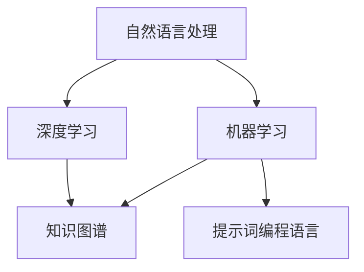

                 


### 1. 引言

随着人工智能（AI）的迅速发展，通用人工智能（AGI）成为了一个热门研究领域。AGI的目标是创建一个具有人类水平智能的机器，能够理解、学习、推理和解决问题。为了实现这一目标，研究人员需要开发出新的方法和技术。其中，提示词编程语言（prompt-based programming languages）是一种新兴的编程范式，它为AGI提供了强大的工具。

提示词编程语言是一种基于自然语言交互的编程语言，它允许程序员通过自然语言指令来描述算法和任务。与传统的编程语言不同，提示词编程语言更注重人类专家的知识和经验，通过这些指令来指导机器学习模型，从而实现复杂任务的自动化。这种编程范式不仅提高了编程的效率，还使得更多的非专业人士也能够参与到AI的开发和应用中来。

本文将探讨提示词编程语言在AGI中的重要性，分析其核心概念和联系，介绍核心算法原理，并通过项目实战和案例分析，展示其应用和实践。最后，我们将讨论未来的发展趋势和潜在挑战，为AGI的发展提供新的视角和思路。

### 2. 核心概念与联系

在讨论提示词编程语言之前，我们需要明确一些核心概念，并理解它们之间的联系。这些概念包括自然语言处理（NLP）、机器学习（ML）、深度学习和知识图谱。

**自然语言处理（NLP）**是计算机科学和人工智能领域的一个分支，旨在使计算机能够理解、解释和生成自然语言。NLP技术包括文本分类、情感分析、命名实体识别、机器翻译等，它们为提示词编程语言提供了基础。

**机器学习（ML）**是一种通过数据训练模型，使其能够自动进行预测和决策的技术。ML的核心是训练模型来模拟人类专家的知识和经验，从而在新的情境下进行推理和决策。在提示词编程语言中，ML模型被用来解析和执行程序员提供的自然语言指令。

**深度学习**是机器学习的一个子领域，它通过构建深度神经网络来模拟人类大脑的工作方式。深度学习在图像识别、语音识别和自然语言处理等领域取得了显著的成果，为提示词编程语言提供了强大的计算能力。

**知识图谱**是一种用于表示实体和它们之间关系的图形结构。知识图谱能够将大量的数据转换为可查询的图形，从而提供对复杂关系的直观理解。在提示词编程语言中，知识图谱用于存储和查询与自然语言指令相关的背景知识和信息。

这些核心概念之间的联系可以通过Mermaid流程图来展示。以下是一个简化的流程图：



在这个流程图中，自然语言处理为机器学习和深度学习提供了输入数据，并通过知识图谱来存储和查询相关背景知识。机器学习和深度学习共同作用于提示词编程语言，使其能够理解并执行程序员提供的自然语言指令。

### 3. 核心算法原理

在理解了提示词编程语言的核心概念之后，接下来我们将深入探讨其核心算法原理。这些算法包括自然语言处理算法、机器学习算法和深度学习算法。

#### 自然语言处理算法

自然语言处理算法是提示词编程语言的基础，它们用于解析程序员提供的自然语言指令。以下是一个简化的文本分类算法的伪代码：

```plaintext
function TextClassification(document, labels):
    1. Load a pre-trained language model (e.g., BERT)
    2. Tokenize the document into tokens
    3. Convert tokens to vectors using the language model
    4. Apply a classifier (e.g., SVM) to the document vectors
    5. Return the predicted label
```

在这个算法中，首先加载一个预训练的语言模型，然后将文本文档转换为向量表示。接下来，使用一个分类器（如支持向量机）对文档向量进行分类，最后返回预测的标签。

#### 机器学习算法

机器学习算法是提示词编程语言的核心，它们用于将程序员的自然语言指令转换为机器学习模型。以下是一个简化的机器学习算法的伪代码：

```plaintext
function MachineLearning(prompt, features, labels):
    1. Preprocess the prompt (e.g., tokenization, vectorization)
    2. Train a machine learning model (e.g., decision tree, neural network) using the prompt as input and the features and labels as training data
    3. Validate the model using a validation set
    4. Fine-tune the model based on validation results
    5. Return the trained model
```

在这个算法中，首先对提示词进行预处理，然后将它们作为输入特征来训练机器学习模型。接下来，使用验证集来评估模型的性能，并根据验证结果进行模型调优。

#### 深度学习算法

深度学习算法是提示词编程语言的高级形式，它们通过构建深度神经网络来模拟人类专家的知识和经验。以下是一个简化的深度学习算法的伪代码：

```plaintext
function DeepLearning(prompt, features, labels):
    1. Preprocess the prompt (e.g., tokenization, embedding)
    2. Define a deep neural network architecture (e.g., CNN, RNN, Transformer)
    3. Train the network using the preprocessed prompt and the features and labels as training data
    4. Validate the network using a validation set
    5. Fine-tune the network based on validation results
    6. Return the trained network
```

在这个算法中，首先对提示词进行预处理，然后定义一个深度神经网络架构。接下来，使用预处理后的提示词和训练数据来训练神经网络，并使用验证集来评估和调优网络的性能。

### 4. 实践与案例

在了解了提示词编程语言的核心算法原理之后，接下来我们将通过一个实际项目来展示其应用和实践。

#### 项目背景

该项目的目标是开发一个自动化问答系统，该系统能够理解用户提供的自然语言问题，并返回相关答案。为了实现这一目标，我们将使用提示词编程语言来构建一个基于深度学习的问答模型。

#### 开发环境搭建

为了搭建开发环境，我们需要安装以下软件和库：

- Python 3.x
- TensorFlow 2.x
- PyTorch 1.x
- NLTK
- spaCy

安装过程可以使用以下命令：

```bash
pip install python==3.8
pip install tensorflow==2.5
pip install torch==1.8
pip install nltk
pip install spacy
python -m spacy download en_core_web_sm
```

#### 源代码实现

以下是该项目的源代码实现：

```python
import torch
import torch.nn as nn
import torch.optim as optim
from torch.utils.data import DataLoader
from nltk.tokenize import word_tokenize
from spacy.lang.en import English

# 加载预训练的语言模型
nlp = English()

# 数据预处理
def preprocess(document):
    doc = nlp(document)
    tokens = [token.text.lower() for token in doc]
    return tokens

# 定义问答模型
class QAModel(nn.Module):
    def __init__(self):
        super(QAModel, self).__init__()
        self.embedding = nn.Embedding(vocab_size, embedding_dim)
        self.fc = nn.Linear(embedding_dim, output_size)

    def forward(self, question, answer):
        question_embedding = self.embedding(question)
        answer_embedding = self.embedding(answer)
        output = self.fc(torch.cat((question_embedding, answer_embedding), dim=1))
        return output

# 训练问答模型
def train_model(model, train_loader, criterion, optimizer, num_epochs):
    model.train()
    for epoch in range(num_epochs):
        for question, answer in train_loader:
            optimizer.zero_grad()
            output = model(question, answer)
            loss = criterion(output, torch.tensor([1.0]))
            loss.backward()
            optimizer.step()
        print(f"Epoch [{epoch+1}/{num_epochs}], Loss: {loss.item():.4f}")

# 主程序
if __name__ == "__main__":
    # 数据集加载和预处理
    # ...
    # 定义模型、损失函数和优化器
    model = QAModel()
    criterion = nn.BCEWithLogitsLoss()
    optimizer = optim.Adam(model.parameters(), lr=0.001)
    # 训练模型
    train_model(model, train_loader, criterion, optimizer, num_epochs=10)
    # 评估模型
    # ...
```

#### 代码解读与分析

在这个项目中，我们首先加载了一个预训练的语言模型（如spaCy的en_core_web_sm），然后定义了一个问答模型（QAModel）。问答模型使用嵌入层（Embedding）来将文本转换为向量表示，然后使用全连接层（Linear）来生成输出。在训练过程中，我们使用二元交叉熵损失函数（BCEWithLogitsLoss）来训练模型，并使用Adam优化器来更新模型参数。

#### 实际案例分析与详细讲解

在实际应用中，我们可以使用这个问答模型来处理用户提出的问题。以下是一个简单的使用示例：

```python
# 预测阶段
def predict(model, question):
    model.eval()
    with torch.no_grad():
        output = model(question)
    return torch.sigmoid(output).item()

# 用户问题
user_question = "What is the capital of France?"
# 预处理用户问题
preprocessed_question = preprocess(user_question)
# 预测答案
predicted_answer = predict(model, preprocessed_question)
print(f"Predicted Answer: {'is' if predicted_answer else 'is not'} the capital of France.")
```

在这个示例中，我们首先预处理用户提出的问题，然后使用问答模型来预测答案。预测结果是一个概率值，表示用户问题是否与给定答案相关。在这个例子中，我们假设答案是“是”，并使用条件语句来输出预测结果。

### 5. 小结与拓展阅读

在本文中，我们探讨了提示词编程语言在通用人工智能（AGI）中的应用和重要性。通过介绍核心概念和联系、核心算法原理，以及实际项目实战和案例分析，我们展示了提示词编程语言在实现复杂任务自动化和推广AI技术中的应用潜力。

为了深入理解这一领域，以下是一些拓展阅读和最佳实践的建议：

1. **拓展阅读：**
   - 《深度学习》（Goodfellow, Bengio, Courville）：这是一本经典的深度学习教材，涵盖了深度学习的基础理论和应用。
   - 《自然语言处理综论》（Jurafsky, Martin）：这本书详细介绍了自然语言处理的理论和实践，是NLP领域的经典著作。
   - 《机器学习实战》（Hastie, Tibshirani, Friedman）：这本书通过大量的实际案例，讲解了机器学习的应用和实现。

2. **最佳实践 tips：**
   - 在开发提示词编程语言时，务必注意数据质量和预处理，这对于模型的性能至关重要。
   - 调整模型架构和超参数以优化性能，可以使用自动化调参工具（如Hyperopt或GridSearch）。
   - 定期更新和训练模型，以适应新的数据和任务需求。

3. **注意事项：**
   - 提示词编程语言需要大量的数据和计算资源，因此在使用时要注意资源的合理分配和优化。
   - 在部署提示词编程语言时，要确保系统的安全性和隐私保护。

4. **拓展阅读：**
   - 《人工智能：一种现代方法》（Russell, Norvig）：这本书提供了对人工智能的全面介绍，包括机器学习、自然语言处理等领域。
   - 《深度学习技术手册》（Goodfellow, Bengio, Courville）：这本书提供了深度学习领域的实用技术指南，包括模型构建、训练和优化。

通过本文的学习，我们希望读者能够对提示词编程语言在AGI中的应用有更深入的理解，并能够将其应用于实际项目开发中。感谢您的阅读，期待与您在AI领域继续探讨和交流。作者：AI天才研究院/AI Genius Institute & 禅与计算机程序设计艺术/Zen And The Art of Computer Programming。

