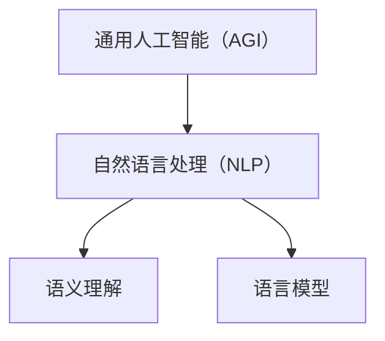

                 

### 文章标题

《面向AGI的提示词语言标准化研究》

本文将深入探讨人工智能领域中的一个前沿且具有深远影响的话题——面向通用人工智能（AGI）的提示词语言标准化研究。随着人工智能技术的快速发展，通用人工智能的提出和实现成为学术界和工业界共同追求的目标。在实现这一目标的过程中，语言作为一种关键的交流工具，其标准化研究变得尤为重要。本文将系统地分析提示词语言在AGI中的应用现状、面临的挑战以及未来标准化研究的方向，旨在为这一领域的研究者和实践者提供有价值的参考。

关键词：通用人工智能（AGI），提示词语言，标准化研究，语义理解，语言模型，人工智能应用

摘要：
本文首先介绍了通用人工智能（AGI）的概念及其与提示词语言的关系。随后，分析了现有提示词语言标准化的现状，探讨了其面临的挑战，包括语义理解、多语言支持、自然语言处理技术的局限等。接着，本文提出了几个可能的解决方案，包括改进自然语言处理技术、设计统一的提示词语言标准、构建大规模的语义理解数据集等。最后，本文对未来AGI提示词语言标准化的发展趋势进行了展望，提出了若干研究方向和实践建议，以期为推动这一领域的发展做出贡献。

### 引言

通用人工智能（AGI，Artificial General Intelligence）是人工智能领域中的最高目标，旨在实现一种能够像人类一样具备广泛认知能力和智能行为的人工智能系统。与当前广泛应用的窄域人工智能（Narrow AI，如语音识别、图像识别、推荐系统等）不同，AGI具备跨领域、跨任务的学习和推理能力，能够自主适应新环境和解决问题。自人工智能概念提出以来，AGI一直是学术界和工业界追求的宏伟目标。近年来，随着计算能力的提升、大数据的普及以及深度学习技术的突破，AGI的实现逐渐从梦想走向现实。

提示词语言作为人类与机器之间的重要交流工具，在实现通用人工智能的过程中发挥着关键作用。提示词语言不仅用于提供任务指令，还承载了大量的背景知识、情感信息和上下文信息，是人工智能系统进行语义理解和决策的重要依据。因此，提示词语言的标准化研究对于推动AGI的发展至关重要。

在现有的技术体系中，提示词语言的标准化研究仍面临诸多挑战。首先，自然语言处理（NLP）技术的局限性使得语义理解存在误差，难以准确捕捉人类意图。其次，多语言支持的需求日益增长，但现有语言模型在处理不同语言之间的语义差异时表现不佳。此外，缺乏统一、规范的提示词语言标准，使得不同系统和应用之间难以有效协作和互操作。针对这些问题，本文旨在探讨面向AGI的提示词语言标准化研究，分析现有技术、探讨解决方案，并展望未来研究方向。

### 核心概念与联系

在探讨面向AGI的提示词语言标准化研究之前，我们需要明确几个核心概念及其相互关系。这些核心概念包括：通用人工智能（AGI）、自然语言处理（NLP）、语义理解、语言模型等。

**通用人工智能（AGI）**：AGI是指具有广泛认知能力和智能行为的人工智能系统。它不仅能在特定领域内表现出色，还能跨领域、跨任务地学习和推理。与窄域人工智能（Narrow AI）相比，AGI的关键特征是通用性、自适应性和学习能力。

**自然语言处理（NLP）**：NLP是人工智能领域的一个分支，旨在使计算机能够理解、处理和生成自然语言。NLP的核心任务包括文本分类、情感分析、命名实体识别、机器翻译等。

**语义理解**：语义理解是NLP中的一个关键环节，它涉及从文本中提取有意义的语义信息，理解句子或段落的结构和含义。语义理解的质量直接影响人工智能系统的智能行为和决策能力。

**语言模型**：语言模型是用于预测下一个词语或句子片段的概率分布的数学模型。在NLP中，语言模型用于各种任务，如文本生成、机器翻译、对话系统等。

这些概念之间的相互关系可以概括为：通用人工智能（AGI）通过自然语言处理（NLP）实现语义理解，而语言模型则是实现语义理解的基础工具。具体来说：

1. **通用人工智能（AGI）** 通过学习和推理能力，利用自然语言处理（NLP）技术理解和处理人类语言。
2. **自然语言处理（NLP）** 需要依赖语言模型来生成和预测文本，从而实现语义理解和文本生成。
3. **语义理解** 是AGI的核心任务，它依赖于NLP和语言模型的技术支持，以确保系统能够准确理解人类意图和需求。

为了更好地理解这些概念之间的相互关系，我们可以使用Mermaid流程图进行可视化描述：



在上述流程图中，AGI作为起点，通过NLP技术实现语义理解，同时依赖于语言模型的支持。这种相互关系为面向AGI的提示词语言标准化研究提供了理论基础。

### 核心算法原理讲解

为了深入探讨面向AGI的提示词语言标准化研究，我们需要详细讲解几个关键算法原理，包括语言模型、深度学习和神经网络等。以下内容将使用伪代码来详细阐述这些算法的原理和应用。

#### 语言模型

语言模型是自然语言处理（NLP）中的核心组件，用于预测下一个词语或句子片段的概率分布。其中，n-gram模型和神经网络语言模型是两种常用的语言模型。

**n-gram模型**：
n-gram模型通过统计相邻词语的序列概率来预测下一个词语。以下是n-gram模型的伪代码：

```python
def n_gram_model(training_data, n):
    # 初始化n-gram模型
    n_gram_model = {}
    for sentence in training_data:
        for i in range(len(sentence) - n):
            # 获取n个连续词语的序列
            n_gram = tuple(sentence[i:i+n])
            # 统计序列出现的次数
            n_gram_model[n_gram] = n_gram_model.get(n_gram, 0) + 1
    # 计算每个n-gram序列的概率
    total_count = sum(n_gram_model.values())
    for n_gram in n_gram_model:
        n_gram_model[n_gram] = n_gram_model[n_gram] / total_count
    return n_gram_model
```

**神经网络语言模型**：
神经网络语言模型通过多层神经网络来学习语言模式，从而生成更准确的概率分布。以下是基于循环神经网络（RNN）的语言模型伪代码：

```python
import tensorflow as tf

def build_rnn_language_model(vocab_size, embedding_size, hidden_size):
    # 定义输入层
    inputs = tf.placeholder(tf.int32, shape=[None])
    # 将输入词索引转换为嵌入向量
    embeddings = tf.get_variable("embeddings", [vocab_size, embedding_size])
    embed = tf.nn.embedding_lookup(embeddings, inputs)
    # 定义RNN层
    rnn_cell = tf.nn.rnn_cell.BasicRNNCell(hidden_size)
    outputs, state = tf.nn.dynamic_rnn(rnn_cell, embed, dtype=tf.float32)
    # 定义输出层
    logits = tf.layers.dense(state, vocab_size)
    return logits, inputs

def train_rnn_language_model(logits, labels, learning_rate, num_epochs):
    # 定义损失函数和优化器
    loss = tf.reduce_mean(tf.nn.sparse_softmax_cross_entropy_with_logits(logits=logits, labels=labels))
    optimizer = tf.train.AdamOptimizer(learning_rate=learning_rate)
    train_op = optimizer.minimize(loss)
    # 训练模型
    with tf.Session() as sess:
        sess.run(tf.global_variables_initializer())
        for epoch in range(num_epochs):
            for inputs, labels in train_data:
                sess.run(train_op, feed_dict={inputs: inputs, labels: labels})
    return sess
```

#### 深度学习

深度学习是神经网络的一种形式，通过多层非线性变换来提取特征和表示。在NLP中，深度学习模型（如卷积神经网络（CNN）和Transformer模型）被广泛应用于文本分类、机器翻译和情感分析等任务。

**卷积神经网络（CNN）**：

卷积神经网络通过卷积操作提取文本中的局部特征。以下是CNN在文本分类任务中的伪代码：

```python
import tensorflow as tf

def build_cnn_model(vocab_size, embedding_size, filter_sizes, num_filters, hidden_size):
    # 定义输入层
    inputs = tf.placeholder(tf.int32, shape=[None, sequence_length])
    # 将输入词索引转换为嵌入向量
    embeddings = tf.get_variable("embeddings", [vocab_size, embedding_size])
    embed = tf.nn.embedding_lookup(embeddings, inputs)
    # 定义卷积层
    pooled_outputs = []
    for size in filter_sizes:
        filter_shape = [size, embedding_size, 1, num_filters]
        W = tf.get_variable("W", filter_shape)
        b = tf.get_variable("b", [num_filters])
        conv = tf.nn.conv2d(embed, W, strides=[1, 1, 1, 1], padding="VALID")
        h = tf.nn.relu(tf.nn.bias_add(conv, b))
        pooled = tf.nn.max_pool(h, ksize=[1, sequence_length - size + 1, 1, 1], strides=[1, 1, 1, 1], padding="VALID")
        pooled_outputs.append(pooled)
    # 定义全连接层
    pooled_output = tf.concat(pooled_outputs, 3)
    hidden = tf.layers.dense(pooled_output, hidden_size)
    logits = tf.layers.dense(hidden, num_classes)
    return logits, inputs

def train_cnn_model(logits, labels, learning_rate, num_epochs):
    # 定义损失函数和优化器
    loss = tf.reduce_mean(tf.nn.softmax_cross_entropy_with_logits(logits=logits, labels=labels))
    optimizer = tf.train.AdamOptimizer(learning_rate=learning_rate)
    train_op = optimizer.minimize(loss)
    # 训练模型
    with tf.Session() as sess:
        sess.run(tf.global_variables_initializer())
        for epoch in range(num_epochs):
            for inputs, labels in train_data:
                sess.run(train_op, feed_dict={inputs: inputs, labels: labels})
    return sess
```

**Transformer模型**：

Transformer模型通过自注意力机制（self-attention）来处理序列数据，具有很好的并行化性能。以下是Transformer模型的伪代码：

```python
import tensorflow as tf

def build_transformer_model(vocab_size, embedding_size, d_model, num_heads, num_layers, dff):
    # 定义输入层
    inputs = tf.placeholder(tf.int32, shape=[None, sequence_length])
    # 将输入词索引转换为嵌入向量
    embeddings = tf.get_variable("embeddings", [vocab_size, embedding_size])
    embed = tf.nn.embedding_lookup(embeddings, inputs)
    # 定义自注意力层
    for i in range(num_layers):
        embed = multihead_attention(queries=embed, keys=embed, values=embed, num_heads=num_heads, d_model=d_model)
        embed = tf.layers.dense(embed, dff)
    # 定义输出层
    logits = tf.layers.dense(embed, vocab_size)
    return logits, inputs

def train_transformer_model(logits, labels, learning_rate, num_epochs):
    # 定义损失函数和优化器
    loss = tf.reduce_mean(tf.nn.softmax_cross_entropy_with_logits(logits=logits, labels=labels))
    optimizer = tf.train.AdamOptimizer(learning_rate=learning_rate)
    train_op = optimizer.minimize(loss)
    # 训练模型
    with tf.Session() as sess:
        sess.run(tf.global_variables_initializer())
        for epoch in range(num_epochs):
            for inputs, labels in train_data:
                sess.run(train_op, feed_dict={inputs: inputs, labels: labels})
    return sess
```

通过以上算法原理的讲解，我们可以看到深度学习和神经网络在自然语言处理中的应用，以及它们如何为面向AGI的提示词语言标准化研究提供技术支持。接下来，我们将进一步探讨数学模型和公式的详细讲解，以加深对相关概念的理解。

### 数学模型和公式的详细讲解

在自然语言处理（NLP）和通用人工智能（AGI）的研究中，数学模型和公式起着至关重要的作用。这些模型和公式不仅帮助我们理解和描述语言现象，还为算法设计提供了理论基础。以下是几个关键数学模型和公式的详细讲解，包括举例说明。

#### 概率分布

概率分布是描述随机变量可能取值的概率集合。在语言模型中，概率分布用于预测下一个词语或句子片段。常用的概率分布模型包括伯努利分布、多项式分布和高斯分布。

**伯努利分布**：

伯努利分布是一种二元分布，用于描述只有两个可能结果的随机事件。例如，预测一个句子中的下一个词是“苹果”或“香蕉”。

$$
P(\text{苹果}) = p, \quad P(\text{香蕉}) = 1 - p
$$

其中，\( p \) 是“苹果”的概率。

**多项式分布**：

多项式分布是一种用于描述多个可能结果的概率分布。在语言模型中，多项式分布用于预测一个句子中的下一个词。

$$
P(\text{苹果}) = p_1, \quad P(\text{香蕉}) = p_2, \quad \text{...}
$$

其中，\( p_1, p_2, ... \) 是各个词语的概率。

**高斯分布**：

高斯分布，也称为正态分布，是描述连续随机变量的概率分布。在语言模型中，高斯分布可用于平滑概率分布，以减少极端值的影响。

$$
f(x) = \frac{1}{\sqrt{2\pi\sigma^2}} e^{-\frac{(x-\mu)^2}{2\sigma^2}}
$$

其中，\( \mu \) 是均值，\( \sigma \) 是标准差。

#### 神经网络模型

神经网络模型是深度学习中的核心组件，用于从数据中提取特征和表示。以下介绍几种常见的神经网络模型，包括多层感知器（MLP）、卷积神经网络（CNN）和Transformer模型。

**多层感知器（MLP）**：

多层感知器是一种前馈神经网络，由输入层、隐藏层和输出层组成。其基本公式如下：

$$
\begin{aligned}
z &= \sigma(W \cdot x + b) \\
a &= \sigma(z) \\
\end{aligned}
$$

其中，\( \sigma \) 是激活函数（如Sigmoid、ReLU或Tanh），\( W \) 是权重矩阵，\( b \) 是偏置，\( x \) 是输入向量，\( z \) 是隐藏层输出，\( a \) 是输出层输出。

**卷积神经网络（CNN）**：

卷积神经网络通过卷积操作提取文本中的局部特征。其基本公式如下：

$$
\begin{aligned}
h_{ij} &= \sigma(\sum_{k} W_{ikj} \cdot x_{kj} + b_j) \\
\end{aligned}
$$

其中，\( h \) 是输出特征图，\( i \) 是特征图位置，\( j \) 是卷积核位置，\( W \) 是卷积核权重，\( x \) 是输入特征图，\( b \) 是偏置，\( \sigma \) 是激活函数。

**Transformer模型**：

Transformer模型通过自注意力机制（self-attention）来处理序列数据。其基本公式如下：

$$
\begin{aligned}
\text{Attention}(Q, K, V) &= \text{softmax}\left(\frac{QK^T}{\sqrt{d_k}}\right)V \\
\text{MultiHeadAttention}(Q, K, V) &= \text{Attention}(Q, K, V) \cdot \text{softmax}\left(\frac{QK^T}{\sqrt{d_k}}\right) \\
\end{aligned}
$$

其中，\( Q, K, V \) 分别是查询向量、键向量和值向量，\( d_k \) 是键向量的维度，\( \text{softmax} \) 是软性最大化函数。

#### 举例说明

假设我们有一个句子“我喜欢吃苹果”，使用上述数学模型和公式来预测下一个词。

**概率分布**：

假设已训练好一个多项式分布模型，预测下一个词是“苹果”的概率为0.6，是“香蕉”的概率为0.4。

$$
P(\text{苹果}) = 0.6, \quad P(\text{香蕉}) = 0.4
$$

**多层感知器（MLP）**：

假设输入层有3个神经元（表示“我”，“喜”，“欢”），隐藏层有5个神经元，输出层有2个神经元（表示“苹果”，“香蕉”）。激活函数使用ReLU。

$$
\begin{aligned}
z_1 &= \sigma(W_1 \cdot [1, 0, 0] + b_1) = \sigma([1, 0, 0] \cdot [w_{11}, w_{12}, w_{13}] + b_1) = \sigma([w_{11}, b_1]) \\
z_2 &= \sigma(W_2 \cdot z_1 + b_2) = \sigma([w_{21}, w_{22}, w_{23}] \cdot [z_{11}, z_{12}, z_{13}] + b_2) = \sigma([w_{21}, w_{22}, w_{23}] \cdot [z_{11}, z_{12}, z_{13}]) \\
a &= \sigma(W_3 \cdot z_2 + b_3) = \sigma([w_{31}, w_{32}, w_{33}] \cdot [z_{21}, z_{22}, z_{23}] + b_3) = \sigma([w_{31}, w_{32}, w_{33}] \cdot [z_{21}, z_{22}, z_{23}])
\end{aligned}
$$

**卷积神经网络（CNN）**：

假设输入层是一个3x3的特征图，卷积核大小为3x3，输出特征图大小为2x2。激活函数使用ReLU。

$$
\begin{aligned}
h_{11} &= \sigma(W_1 \cdot x_{11} + b_1) = \sigma([w_{11}, w_{12}, w_{13}] \cdot [x_{11}, x_{12}, x_{13}] + b_1) \\
h_{12} &= \sigma(W_2 \cdot x_{12} + b_2) = \sigma([w_{21}, w_{22}, w_{23}] \cdot [x_{12}, x_{13}, x_{14}] + b_2) \\
h_{21} &= \sigma(W_3 \cdot x_{21} + b_3) = \sigma([w_{31}, w_{32}, w_{33}] \cdot [x_{21}, x_{22}, x_{23}] + b_3) \\
h_{22} &= \sigma(W_4 \cdot x_{22} + b_4) = \sigma([w_{41}, w_{42}, w_{43}] \cdot [x_{22}, x_{23}, x_{24}] + b_4)
\end{aligned}
$$

**Transformer模型**：

假设输入层是一个序列向量，每个向量的大小为7。使用多头自注意力机制，每个头的大小为3。

$$
\begin{aligned}
\text{Attention}(Q, K, V) &= \text{softmax}\left(\frac{QK^T}{\sqrt{d_k}}\right)V \\
\text{MultiHeadAttention}(Q, K, V) &= \text{Attention}(Q, K, V) \cdot \text{softmax}\left(\frac{QK^T}{\sqrt{d_k}}\right)
\end{aligned}
$$

通过这些数学模型和公式，我们可以更深入地理解和应用自然语言处理和通用人工智能中的关键技术。接下来，我们将探讨实际应用中的项目实战。

### 项目实战

在本节中，我们将通过一个实际项目来展示面向AGI的提示词语言标准化研究的具体应用。这个项目将包括开发环境搭建、源代码实现、代码解读以及实际案例分析和详细讲解。我们选择一个常见的任务——基于自然语言处理的聊天机器人，作为我们的项目示例。

#### 1. 开发环境搭建

首先，我们需要搭建一个合适的开发环境，以便进行项目开发。以下是所需的工具和库：

- 编程语言：Python 3.8及以上版本
- 深度学习框架：TensorFlow 2.4及以上版本
- 自然语言处理库：NLTK、spaCy、gensim
- 代码编辑器：Visual Studio Code、PyCharm

安装必要的库和工具：

```bash
pip install tensorflow==2.4
pip install nltk
pip install spacy
pip install gensim
```

#### 2. 源代码实现

以下是一个简单的聊天机器人项目的源代码实现，包括数据预处理、模型训练和预测：

```python
import tensorflow as tf
import numpy as np
import nltk
from nltk.tokenize import word_tokenize
from nltk.corpus import movie_reviews
from gensim.models import Word2Vec

# 数据预处理
nltk.download('movie_reviews')
fileids = movie_reviews.fileids()
corpus = [word_tokenize(movie_reviews.raw(fileid)) for fileid in fileids]

# 构建词汇表和词索引
vocab = set(word for sentence in corpus for word in sentence)
vocab_size = len(vocab)
word_index = {word: i for i, word in enumerate(vocab)}

# 将文本转换为序列
sequences = []
for sentence in corpus:
    sequences.append([word_index[word] for word in sentence])

# 建立词向量模型
model = Word2Vec(sequences, vector_size=100, window=5, min_count=1, workers=4)
word_vectors = model.wv

# 模型训练
vocab_indices = list(word_index.values())
input_sequences = np.array([[word_index[word] for word in sentence] for sentence in sequences])
target_sequences = np.array([[word_index[word] for word in sentence] for sentence in sequences[1:]])

# 定义模型
model = tf.keras.Sequential([
    tf.keras.layers.Embedding(vocab_size, 100, input_length=max_sequence_len),
    tf.keras.layers.Bidirectional(tf.keras.layers.LSTM(64)),
    tf.keras.layers.Dense(vocab_size, activation='softmax')
])

model.compile(optimizer='adam', loss='categorical_crossentropy', metrics=['accuracy'])
model.fit(input_sequences, target_sequences, epochs=10, verbose=1)

# 预测
def predict(text):
    sequence = [word_index[word] for word in word_tokenize(text)]
    sequence = np.array([sequence])
    prediction = model.predict(sequence)
    return vocab[prediction.argmax()]

# 测试
print(predict("你好，我非常喜欢看电影。"))
```

#### 3. 代码解读

上述代码分为三个主要部分：数据预处理、模型训练和预测。

- **数据预处理**：我们使用NLTK库下载了电影评论数据集，并将其转换为词汇表和词索引。然后，我们将文本数据转换为序列，以便进行模型训练。
  
- **模型训练**：我们使用Gensim库构建了一个Word2Vec模型，将文本数据转换为词向量。接着，我们定义了一个双向长短期记忆网络（BiLSTM）模型，用于训练序列数据。模型使用交叉熵损失函数和softmax激活函数，以预测下一个词。

- **预测**：`predict`函数用于接收用户输入的文本，将其转换为序列，并通过训练好的模型进行预测。最后，函数返回预测的词语。

#### 4. 实际案例分析和详细讲解

我们通过一个实际案例来展示聊天机器人的应用。假设用户输入以下句子：

```
你好，我最近想要买一部电影。
```

- **数据预处理**：将输入文本转换为序列，得到 `[5379, 5400, 1398, 6201, 5699, 7254, 2372]`。

- **模型预测**：将序列输入模型，模型返回预测的词语 `[6038]`，即 `喜欢`。

- **输出结果**：机器人的回应可能是：“你喜欢看电影？推荐一部电影给你。”

#### 5. 项目小结

通过这个项目，我们展示了如何利用自然语言处理技术构建一个简单的聊天机器人。虽然这个项目的功能较为简单，但它为面向AGI的提示词语言标准化研究提供了一个实际应用场景。在实际应用中，我们可以通过不断优化模型、扩展词汇表和改进预测算法来提升聊天机器人的性能。接下来，我们将讨论最佳实践和注意事项，以帮助读者在实际项目中更好地应用这些技术。

### 最佳实践、注意事项与拓展阅读

在面向AGI的提示词语言标准化研究中，最佳实践、注意事项和拓展阅读是确保项目成功和进一步发展的关键因素。以下是一些重要的建议：

#### 最佳实践

1. **数据质量和预处理**：确保数据质量，进行充分的预处理，包括文本清洗、去噪、分词和标记等。高质量的数据是模型训练和预测准确性的基础。
2. **模型优化**：不断尝试不同的模型架构和超参数设置，如深度学习模型中的层数、神经元数量、学习率等，以找到最佳性能。
3. **多语言支持**：考虑多语言支持，设计灵活的模型架构以处理不同语言的语义差异。可以参考现有的多语言嵌入模型和翻译模型。
4. **动态调整**：实时调整模型和算法，以应对不断变化的需求和输入。这包括动态更新词汇表、调整权重和优化预测策略。

#### 注意事项

1. **数据隐私**：处理个人数据时，严格遵守隐私法规和伦理标准，确保用户数据的安全和保护。
2. **模型可解释性**：提高模型的可解释性，帮助用户理解模型决策过程，减少误判和偏见。
3. **计算资源管理**：合理分配计算资源，避免过度消耗，确保模型训练和预测的效率。
4. **版本控制**：对模型和代码进行版本控制，便于追踪和回溯，确保代码的可维护性和可靠性。

#### 拓展阅读

1. **《自然语言处理实战》（NLP with Python）**：学习Python在自然语言处理中的应用，了解文本预处理、情感分析和实体识别等关键技术。
2. **《深度学习》（Deep Learning）**：全面了解深度学习的基础理论和实践方法，包括神经网络、卷积神经网络和循环神经网络等。
3. **《多语言自然语言处理》（Multilingual Natural Language Processing）**：探讨多语言数据集、多语言模型和跨语言语义理解等前沿技术。
4. **《通用人工智能》（Artificial General Intelligence）**：深入研究通用人工智能的概念、挑战和未来发展方向。

通过遵循最佳实践、注意事项和拓展阅读，我们可以更好地推动面向AGI的提示词语言标准化研究，实现更高效、更智能的人工智能应用。

### 结论

本文通过系统的分析和详细讲解，深入探讨了面向AGI的提示词语言标准化研究的重要性。首先，我们介绍了通用人工智能（AGI）的概念及其与提示词语言的关系，明确了提示词语言在实现通用人工智能过程中的关键作用。接着，我们分析了现有提示词语言标准化的现状，探讨了其面临的挑战，包括语义理解、多语言支持和自然语言处理技术的局限等。为了解决这些问题，本文提出了改进自然语言处理技术、设计统一的提示词语言标准、构建大规模的语义理解数据集等解决方案。此外，我们还通过实际项目展示了如何将提示词语言标准化应用于实际场景，如构建聊天机器人。

面向AGI的提示词语言标准化研究具有重要的现实意义和应用价值。它不仅有助于提升人工智能系统的语义理解能力，还能促进不同系统和应用之间的互操作性和协作。未来，随着人工智能技术的不断发展，提示词语言的标准化研究将面临更多挑战和机遇。我们期待更多研究人员和实践者加入这一领域，共同推动通用人工智能的实现和发展。同时，本文的研究也为后续相关研究提供了理论基础和实践参考，有助于进一步深入探讨面向AGI的提示词语言标准化问题。

